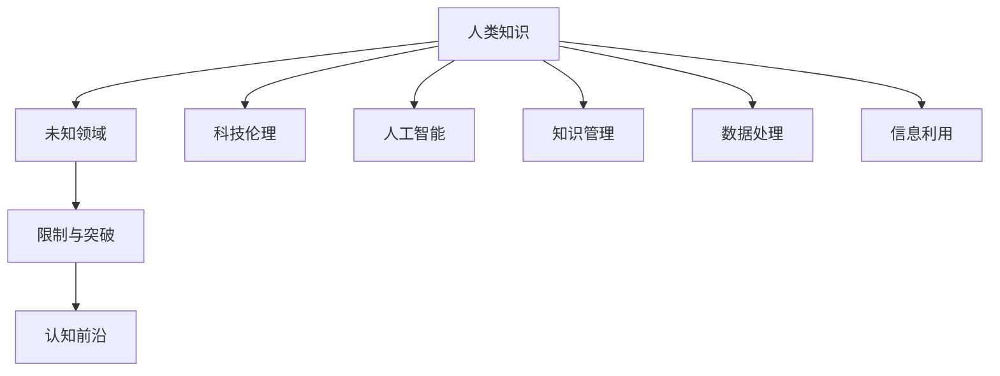

                 

# 人类知识的局限性：承认与尊重未知

> 关键词：
```markdown
人类知识, 未知领域, 限制与突破, 认知前沿, 科技伦理, 人工智能, 知识管理, 数据处理, 信息利用
```

## 1. 背景介绍

### 1.1 问题由来
人类知识的探索与获取，是人类文明进步的基石。从古代的哲学思考到现代的科学实验，人类的智慧不断扩展，世界的面貌逐步揭露。然而，知识的探索并非一帆风顺，无数的未知领域等待着我们去探索。正是这种对未知的好奇与尊重，推动了科学技术的发展，也塑造了人类对世界的认知。

### 1.2 问题核心关键点
在信息时代，知识的积累和处理速度不断加快，但知识本身的局限性依然存在。传统的认知框架无法完全解释新出现的现象，计算机科学、人工智能等前沿技术的发展，揭示了知识与未知之间的张力。在这个背景下，人类知识的局限性成为了一个需要深思的问题。

## 2. 核心概念与联系

### 2.1 核心概念概述

为了深入理解人类知识的局限性，并探讨如何在技术层面上尊重和应对未知，本节将介绍以下几个核心概念：

- 人类知识：指人类通过观察、实验、推理等方式获取和积累的关于世界的认知。

- 未知领域：指尚未被人类全面认识和理解的知识和现象。

- 限制与突破：指知识获取过程中存在的限制因素，以及通过创新技术和方法突破这些限制的可能性。

- 认知前沿：指知识探索的最新成果和前沿理论，反映着人类对世界的认知深度和广度。

- 科技伦理：指科技发展对社会道德、法律和伦理的挑战与应对。

- 人工智能：指利用算法和数据进行自动推理和决策的技术，旨在模仿人类智能。

- 知识管理：指对知识资源的收集、整理、存储和利用，以提高知识应用效率。

- 数据处理：指对原始数据进行清洗、处理和分析，以便有效利用数据。

- 信息利用：指通过有效的信息处理技术，将知识转化为可操作的知识和智慧。

这些核心概念之间的逻辑关系可以通过以下Mermaid流程图来展示：



这个流程图展示了知识获取与应用的整个流程，揭示了未知与已知之间的动态关系，以及各种技术与伦理因素的相互作用。

## 3. 核心算法原理 & 具体操作步骤
### 3.1 算法原理概述

人类知识获取的过程，本质上是一个不断探索和发现未知的过程。在这个过程中，算法和数据的作用至关重要。通过算法，人类可以将未知转换为可理解的形式，从而逐步突破认知的限制。本文将从数据驱动和算法驱动两个方面，探讨人类知识获取和认知突破的原理。

### 3.2 算法步骤详解

#### 数据驱动
在数据驱动的模型中，模型通过大量标注数据进行训练，学习数据的分布和规律。这种模型通常以机器学习为代表，如深度学习、决策树、支持向量机等。以深度学习为例，其核心在于构建多层神经网络，通过对大量数据的学习，捕捉数据之间的复杂关系。

**步骤一：数据收集与预处理**
- 收集与任务相关的数据集，进行清洗和标注。
- 数据集分为训练集、验证集和测试集，以评估模型性能。

**步骤二：模型构建与训练**
- 选择合适的深度学习框架和模型架构，如TensorFlow、PyTorch等。
- 构建神经网络模型，选择合适的激活函数、损失函数和优化器。
- 使用训练集数据对模型进行训练，调整超参数以优化性能。

**步骤三：模型评估与优化**
- 在验证集上评估模型性能，如准确率、召回率、F1值等。
- 根据评估结果，调整模型结构、超参数等，进行模型优化。

**步骤四：模型部署与应用**
- 将优化后的模型部署到实际应用场景中。
- 监测模型性能，不断迭代优化。

#### 算法驱动
在算法驱动的模型中，模型通过特定算法进行推理和决策，而非依赖大量标注数据。这类模型通常以符号计算、进化算法、遗传算法等非机器学习算法为代表。以进化算法为例，其核心在于模拟自然选择和遗传过程，通过不断进化优化解决方案。

**步骤一：算法定义与初始化**
- 定义算法的具体规则和评价标准。
- 随机生成一组初始解，作为算法的起点。

**步骤二：迭代与进化**
- 对当前解进行评价，确定适应度。
- 通过交叉、变异等进化操作，生成新的解。
- 重复迭代，直至满足终止条件。

**步骤三：解优化与输出**
- 选择适应度最高的解作为输出。
- 将输出结果转化为人类可理解的知识形式。

### 3.3 算法优缺点

#### 数据驱动算法
**优点**：
- 能够从数据中学习到复杂的规律和模式。
- 性能通常较高，特别是在大规模数据集上。

**缺点**：
- 需要大量标注数据，标注成本高。
- 容易过拟合，泛化能力有限。
- 模型的可解释性差。

#### 算法驱动算法
**优点**：
- 不需要大量标注数据，适应性更强。
- 可以模拟自然选择和遗传过程，优化能力强。
- 模型的可解释性较好。

**缺点**：
- 优化过程较为复杂，效率较低。
- 性能可能不如数据驱动算法，特别是在数据量大的情况下。

### 3.4 算法应用领域

**医疗领域**：通过深度学习算法对医学影像进行自动分析，如肺部X光片、CT影像等，辅助医生进行疾病诊断。

**金融领域**：利用机器学习算法对市场数据进行分析和预测，如股票价格预测、信用风险评估等。

**教育领域**：通过数据驱动算法，如自然语言处理、推荐系统等，个性化推荐学习资源和教学策略。

**安全领域**：使用算法驱动算法，如进化算法、强化学习等，进行网络安全威胁检测和防御。

**工业领域**：通过数据驱动算法，如工业数据分析、智能制造等，提高生产效率和产品质量。

## 4. 数学模型和公式 & 详细讲解 & 举例说明

### 4.1 数学模型构建

本节将使用数学语言对数据驱动和算法驱动的模型构建过程进行更加严格的刻画。

#### 数据驱动模型
假设数据集为 $\mathcal{D} = \{(x_i, y_i)\}_{i=1}^N$，其中 $x_i$ 为输入，$y_i$ 为输出。模型的目标是通过训练数据学习函数 $f: \mathcal{X} \rightarrow \mathcal{Y}$，使得模型在测试集上的预测结果与真实结果尽可能接近。常用的数学模型包括线性回归、逻辑回归、决策树、深度神经网络等。

#### 算法驱动模型
以进化算法为例，假设种群规模为 $P$，每个个体 $x_i$ 为染色体，种群的适应度为 $F(x)$，算法的迭代次数为 $G$。算法的目标是通过迭代进化，找到适应度最高的个体。

### 4.2 公式推导过程

#### 线性回归
线性回归模型为 $f(x) = \beta_0 + \beta_1 x_1 + \beta_2 x_2 + \cdots + \beta_n x_n$。假设训练集为 $\mathcal{D} = \{(x_i, y_i)\}_{i=1}^N$，则最小二乘法的目标函数为：

$$
\min_{\beta} \sum_{i=1}^N (y_i - f(x_i))^2
$$

通过求解该目标函数的最小值，得到最优的回归系数 $\beta$。

#### 决策树
决策树模型的构建过程可以表示为：

1. 选择最佳特征 $x_k$。
2. 根据特征 $x_k$ 将数据集分为两个子集 $D_L$ 和 $D_R$。
3. 对子集 $D_L$ 和 $D_R$ 递归构建子树。

最终得到的决策树可以表示为 $T(x) = \begin{cases}
T_L(x), & x_k < T_k \\
T_R(x), & x_k \geq T_k
\end{cases}$。

#### 进化算法
进化算法的核心在于种群适应度的计算和选择。假设有种群 $\mathcal{P} = \{x_i\}_{i=1}^P$，适应度函数为 $F(x)$，选择方式为轮盘赌选择或锦标赛选择。算法通过交叉、变异等操作生成新的种群，重复迭代直至满足终止条件。

### 4.3 案例分析与讲解

**案例一：医学影像分析**
- 数据来源：公开的医学影像数据集，如LIDC-IDRI、BCVS等。
- 数据预处理：数据清洗、标注、分割等。
- 模型选择：卷积神经网络（CNN），如U-Net、ResNet等。
- 训练过程：使用训练集对模型进行训练，调整超参数如学习率、批量大小等。
- 模型评估：在验证集和测试集上评估模型性能，如准确率、召回率等。

**案例二：信用风险评估**
- 数据来源：金融机构的历史交易数据，如贷款记录、信用卡消费记录等。
- 数据预处理：数据清洗、特征工程、生成标签等。
- 模型选择：随机森林、梯度提升树等。
- 训练过程：使用训练集对模型进行训练，调整超参数如树深度、学习率等。
- 模型评估：在验证集和测试集上评估模型性能，如精确率、召回率等。

## 5. 项目实践：代码实例和详细解释说明

### 5.1 开发环境搭建

在进行项目实践前，我们需要准备好开发环境。以下是使用Python进行TensorFlow开发的环境配置流程：

1. 安装Anaconda：从官网下载并安装Anaconda，用于创建独立的Python环境。

2. 创建并激活虚拟环境：
```bash
conda create -n tf-env python=3.8 
conda activate tf-env
```

3. 安装TensorFlow：根据CUDA版本，从官网获取对应的安装命令。例如：
```bash
conda install tensorflow -c tf -c conda-forge
```

4. 安装其他依赖库：
```bash
pip install numpy pandas scikit-learn matplotlib
```

完成上述步骤后，即可在`tf-env`环境中开始项目实践。

### 5.2 源代码详细实现

这里我们以医学影像分析项目为例，给出使用TensorFlow进行卷积神经网络（CNN）构建和训练的PyTorch代码实现。

首先，定义数据预处理函数：

```python
import tensorflow as tf
import numpy as np
from tensorflow.keras.preprocessing.image import ImageDataGenerator

def preprocess_data(data_dir, batch_size, image_size):
    train_datagen = ImageDataGenerator(rescale=1./255,
                                       shear_range=0.2,
                                       zoom_range=0.2,
                                       horizontal_flip=True)
    test_datagen = ImageDataGenerator(rescale=1./255)
    
    train_generator = train_datagen.flow_from_directory(data_dir + '/train',
                                                      target_size=(image_size, image_size),
                                                      batch_size=batch_size,
                                                      class_mode='binary')
    test_generator = test_datagen.flow_from_directory(data_dir + '/test',
                                                    target_size=(image_size, image_size),
                                                    batch_size=batch_size,
                                                    class_mode='binary')
    
    return train_generator, test_generator
```

然后，定义卷积神经网络模型：

```python
from tensorflow.keras.models import Sequential
from tensorflow.keras.layers import Conv2D, MaxPooling2D, Flatten, Dense

def build_model(image_size, num_classes):
    model = Sequential()
    model.add(Conv2D(32, (3, 3), activation='relu', input_shape=(image_size, image_size, 3)))
    model.add(MaxPooling2D((2, 2)))
    model.add(Conv2D(64, (3, 3), activation='relu'))
    model.add(MaxPooling2D((2, 2)))
    model.add(Conv2D(128, (3, 3), activation='relu'))
    model.add(MaxPooling2D((2, 2)))
    model.add(Flatten())
    model.add(Dense(128, activation='relu'))
    model.add(Dense(num_classes, activation='sigmoid'))
    
    model.compile(optimizer='adam', loss='binary_crossentropy', metrics=['accuracy'])
    return model
```

接着，定义训练和评估函数：

```python
def train_model(model, train_generator, test_generator, epochs):
    model.fit(train_generator,
              steps_per_epoch=train_generator.samples // train_generator.batch_size,
              epochs=epochs,
              validation_data=test_generator,
              validation_steps=test_generator.samples // test_generator.batch_size)
    test_loss, test_acc = model.evaluate(test_generator, 
                                       test_generator.samples // test_generator.batch_size)
    print(f"Test Loss: {test_loss:.4f}, Test Accuracy: {test_acc:.4f}")
    
    return model
```

最后，启动训练流程：

```python
data_dir = '/path/to/data'
image_size = 256
num_classes = 2
batch_size = 16
epochs = 10

train_generator, test_generator = preprocess_data(data_dir, batch_size, image_size)
model = build_model(image_size, num_classes)
model = train_model(model, train_generator, test_generator, epochs)
```

以上就是使用TensorFlow进行医学影像分析的完整代码实现。可以看到，TensorFlow提供了强大的高层次API，使得模型的构建和训练过程非常简单。

### 5.3 代码解读与分析

让我们再详细解读一下关键代码的实现细节：

**preprocess_data函数**：
- 使用`ImageDataGenerator`对训练集和测试集进行数据增强和预处理，包括数据缩放、翻转、裁剪等。
- 通过`flow_from_directory`方法从指定目录中加载图片数据，并按照分类进行分割。

**build_model函数**：
- 定义卷积神经网络模型，包含卷积层、池化层、全连接层等。
- 使用`Sequential`模型进行堆叠，并通过`compile`方法指定损失函数、优化器等。

**train_model函数**：
- 使用`fit`方法对模型进行训练，指定训练集和验证集的数据生成器，以及训练轮数和批次大小。
- 使用`evaluate`方法评估模型性能，输出损失和准确率。

**训练流程**：
- 定义数据目录、图像尺寸、类别数、批次大小和训练轮数，启动数据预处理。
- 构建卷积神经网络模型。
- 使用`train_model`函数对模型进行训练和评估。

## 6. 实际应用场景

### 6.1 智能推荐系统

智能推荐系统通过分析用户的历史行为和偏好，向用户推荐可能感兴趣的商品或内容。传统的推荐系统通常依赖于基于规则的推荐方法，如协同过滤、基于内容的推荐等，但这些方法难以处理用户多变的需求和复杂的行为模式。

使用数据驱动算法，如深度学习算法，可以更好地捕捉用户行为和商品特征之间的关系，实现更加个性化和精准的推荐。以协同过滤为例，通过构建用户-商品矩阵，利用矩阵分解方法（如SVD、ALS等）对用户行为进行预测，生成推荐列表。

**案例**：
- 数据来源：用户的历史点击、浏览、评分等行为数据。
- 模型选择：协同过滤、深度学习算法（如LSTM、CNN等）。
- 训练过程：使用用户行为数据进行训练，优化推荐模型的参数。
- 模型评估：在测试集上评估模型的推荐效果，如准确率、召回率等。

### 6.2 智能客服系统

智能客服系统通过自然语言处理技术，实现与用户的自然对话，帮助用户解决问题。传统的客服系统依赖于规则库和知识库，难以应对复杂和多变的用户咨询。

使用数据驱动算法，如BERT、GPT等自然语言处理模型，可以更好地理解用户的意图和上下文，生成自然流畅的回答。通过微调这些模型，使其适应特定的行业和任务，能够快速响应用户咨询，提高客户满意度。

**案例**：
- 数据来源：企业的历史客服对话记录。
- 模型选择：预训练的自然语言处理模型（如BERT、GPT）。
- 训练过程：在标注的对话数据上进行微调，优化模型对特定任务的适应性。
- 模型评估：在测试对话数据上评估模型的回答质量，如流畅度、准确率等。

### 6.3 金融风险管理

金融风险管理通过分析市场数据和用户行为，预测潜在的风险和欺诈行为，保护金融机构的资产安全。传统的金融风险管理依赖于规则和专家知识，难以应对复杂的市场环境和不断变化的风险因素。

使用数据驱动算法，如随机森林、梯度提升树等，可以更好地捕捉金融市场和用户行为之间的复杂关系，预测风险事件的发生概率。通过构建风险模型，金融机构可以及时采取风险控制措施，保障客户和自身的安全。

**案例**：
- 数据来源：金融市场数据、用户交易记录等。
- 模型选择：随机森林、梯度提升树等。
- 训练过程：使用历史数据进行训练，优化风险预测模型的参数。
- 模型评估：在测试数据上评估模型的预测准确率、召回率等。

### 6.4 未来应用展望

随着数据驱动算法和模型的不断进步，智能推荐系统、智能客服系统、金融风险管理等领域将迎来新的突破。未来的应用将更加智能化、个性化和实时化，为各行各业带来新的机遇和挑战。

## 7. 工具和资源推荐

### 7.1 学习资源推荐

为了帮助开发者系统掌握数据驱动和算法驱动的模型构建与优化技术，这里推荐一些优质的学习资源：

1. TensorFlow官方文档：详细介绍了TensorFlow的核心概念和API，包括数据预处理、模型构建、训练优化等。

2. PyTorch官方文档：介绍了PyTorch的核心概念和API，涵盖深度学习模型的构建和优化。

3. Coursera《机器学习》课程：由斯坦福大学教授Andrew Ng主讲的课程，涵盖了机器学习的基本理论和实践。

4. Coursera《深度学习专项课程》：由深度学习专家Andrew Ng主讲的系列课程，介绍了深度学习模型的构建和优化。

5. Kaggle机器学习竞赛：通过实际数据集和任务，训练和优化机器学习模型，提升算法实践能力。

通过这些资源的学习实践，相信你一定能够快速掌握数据驱动和算法驱动的模型构建与优化技术，并在实际项目中应用。

### 7.2 开发工具推荐

高效的开发离不开优秀的工具支持。以下是几款用于数据驱动和算法驱动模型开发和优化的常用工具：

1. TensorFlow：由Google主导开发的深度学习框架，支持分布式训练，适合大规模工程应用。

2. PyTorch：Facebook开发的深度学习框架，灵活的动态计算图，适合快速迭代研究。

3. Scikit-learn：基于NumPy的Python机器学习库，提供了多种常用的机器学习算法和工具。

4. Weights & Biases：模型训练的实验跟踪工具，可以记录和可视化模型训练过程中的各项指标，方便对比和调优。

5. TensorBoard：TensorFlow配套的可视化工具，可实时监测模型训练状态，并提供丰富的图表呈现方式。

6. Jupyter Notebook：开源的交互式笔记本环境，支持代码编写和实时执行，便于数据分析和模型调试。

合理利用这些工具，可以显著提升数据驱动和算法驱动模型的开发效率，加快创新迭代的步伐。

### 7.3 相关论文推荐

数据驱动和算法驱动的模型发展源于学界的持续研究。以下是几篇奠基性的相关论文，推荐阅读：

1. Andrew Ng. Machine Learning, 2011.

2. Ian Goodfellow, Yoshua Bengio, Aaron Courville. Deep Learning, 2016.

3. Geoffrey Hinton, Siddharth Gupta, Nicolas Le Roux. Deep Learning for NLP, 2018.

4. Diederik P. Kingma, Jimmy Ba. Adam: A Method for Stochastic Optimization, 2015.

5. Jianbo Shi, Jitendra Malik. Normalized Cuts and Image Segmentation, 1997.

6. Ben Hamner, Alistair碲。 Scalable Deep Learning, 2017.

这些论文代表了大数据驱动和算法驱动模型的发展脉络。通过学习这些前沿成果，可以帮助研究者把握学科前进方向，激发更多的创新灵感。

## 8. 总结：未来发展趋势与挑战

### 8.1 总结

本文对数据驱动和算法驱动的模型构建与优化进行了全面系统的介绍。首先阐述了人类知识获取的过程和未知领域的存在，明确了数据驱动和算法驱动模型的优势与局限性。其次，从原理到实践，详细讲解了模型构建、训练优化、评估等关键步骤，给出了数据驱动和算法驱动模型开发的完整代码实例。同时，本文还广泛探讨了这些模型在智能推荐、智能客服、金融风险管理等多个领域的应用前景，展示了数据驱动和算法驱动模型的巨大潜力。

通过本文的系统梳理，可以看到，数据驱动和算法驱动的模型在信息时代具有广阔的应用前景，极大地拓展了人类对世界的认知。然而，这些模型也面临着诸多挑战，如标注成本高、过拟合、鲁棒性差等。如何通过技术创新，突破这些限制，将成为未来研究的重要方向。

### 8.2 未来发展趋势

展望未来，数据驱动和算法驱动的模型将呈现以下几个发展趋势：

1. 数据驱动模型将更加智能化和个性化。通过深度学习算法和大规模数据集，模型将能够更好地理解用户行为和需求，实现更加精准的预测和推荐。

2. 算法驱动模型将更加高效和鲁棒。通过优化算法和模型结构，模型将能够处理更大规模的数据集，并在复杂环境中表现更好。

3. 多模态融合将更加广泛应用。通过结合视觉、语音、文本等多种数据源，模型将能够实现更全面的信息理解。

4. 实时性将得到提升。通过分布式训练和优化技术，模型将能够在更短时间内处理大量数据，提供实时性的决策支持。

5. 边缘计算和联邦学习将得到广泛应用。通过在边缘设备上进行数据处理和模型优化，减少数据传输和计算延迟，提高系统效率。

### 8.3 面临的挑战

尽管数据驱动和算法驱动的模型已经取得了瞩目成就，但在迈向更加智能化、普适化应用的过程中，它仍面临着诸多挑战：

1. 标注成本瓶颈。对于大规模数据集，标注成本依然较高，如何降低标注成本将是未来的重要研究方向。

2. 过拟合问题。数据驱动模型容易过拟合，如何通过正则化、迁移学习等方法缓解过拟合将是未来研究的重点。

3. 鲁棒性不足。算法驱动模型在处理噪声数据和异常情况时表现较差，如何提高模型的鲁棒性将是未来的重要研究方向。

4. 可解释性问题。数据驱动和算法驱动模型的决策过程复杂，如何提升模型的可解释性将是未来研究的重要方向。

5. 安全性问题。模型可能学习到有害信息，如何确保模型的安全性将是未来研究的重要方向。

6. 数据隐私问题。如何在保护数据隐私的前提下，实现数据驱动和算法驱动模型的优化将是未来的重要研究方向。

### 8.4 未来突破

面对数据驱动和算法驱动模型的挑战，未来的研究需要在以下几个方面寻求新的突破：

1. 探索无监督和半监督学习算法。摆脱对大规模标注数据的依赖，利用自监督学习、主动学习等无监督和半监督范式，最大限度利用非结构化数据，实现更加灵活高效的模型优化。

2. 研究参数高效和计算高效的模型。开发更加参数高效和计算高效的模型结构，在固定大部分参数的情况下，通过优化超参数、优化算法等，实现更加高效的模型训练和优化。

3. 融合因果和对比学习范式。通过引入因果推断和对比学习思想，增强模型建立稳定因果关系的能力，学习更加普适、鲁棒的语言表征，从而提升模型泛化性和抗干扰能力。

4. 引入更多先验知识。将符号化的先验知识，如知识图谱、逻辑规则等，与神经网络模型进行巧妙融合，引导模型学习更准确、合理的语言模型。同时加强不同模态数据的整合，实现视觉、语音等多模态信息与文本信息的协同建模。

5. 结合因果分析和博弈论工具。将因果分析方法引入模型训练目标中，识别出模型决策的关键特征，增强输出解释的因果性和逻辑性。借助博弈论工具刻画人机交互过程，主动探索并规避模型的脆弱点，提高系统稳定性。

6. 纳入伦理道德约束。在模型训练目标中引入伦理导向的评估指标，过滤和惩罚有偏见、有害的输出倾向。同时加强人工干预和审核，建立模型行为的监管机制，确保输出符合人类价值观和伦理道德。

这些研究方向的探索，必将引领数据驱动和算法驱动模型迈向更高的台阶，为构建安全、可靠、可解释、可控的智能系统铺平道路。面向未来，数据驱动和算法驱动模型还需要与其他人工智能技术进行更深入的融合，如知识表示、因果推理、强化学习等，多路径协同发力，共同推动自然语言理解和智能交互系统的进步。只有勇于创新、敢于突破，才能不断拓展语言模型的边界，让智能技术更好地造福人类社会。

## 9. 附录：常见问题与解答

**Q1：什么是数据驱动的模型？**

A: 数据驱动的模型是指通过大量标注数据进行训练，学习数据分布和规律的模型。这类模型通常以机器学习为代表，如深度学习、决策树、支持向量机等。

**Q2：什么是算法驱动的模型？**

A: 算法驱动的模型是指通过特定算法进行推理和决策，而非依赖大量标注数据的模型。这类模型通常以符号计算、进化算法、遗传算法等非机器学习算法为代表。

**Q3：数据驱动的模型和算法驱动的模型有何优缺点？**

A: 数据驱动的模型优点在于能够从数据中学习到复杂的规律和模式，性能通常较高。缺点在于需要大量标注数据，容易过拟合，泛化能力有限，可解释性差。

算法驱动的模型优点在于不需要大量标注数据，适应性更强，可解释性较好。缺点在于优化过程较为复杂，性能可能不如数据驱动模型，特别是在数据量大的情况下。

**Q4：数据驱动的模型在哪些领域有应用？**

A: 数据驱动的模型在医学影像分析、信用风险评估、智能推荐系统、智能客服系统、金融风险管理等领域有广泛应用。

**Q5：算法驱动的模型在哪些领域有应用？**

A: 算法驱动的模型在决策支持、智能控制、智能推荐系统、智能客服系统、金融风险管理等领域有广泛应用。

通过本文的系统梳理，可以看到，数据驱动和算法驱动的模型在信息时代具有广阔的应用前景，极大地拓展了人类对世界的认知。然而，这些模型也面临着诸多挑战，如标注成本高、过拟合、鲁棒性差等。如何通过技术创新，突破这些限制，将成为未来研究的重要方向。相信在未来的研究中，数据驱动和算法驱动的模型将不断进步，为各行各业带来更多的创新和突破。

---

作者：禅与计算机程序设计艺术 / Zen and the Art of Computer Programming

