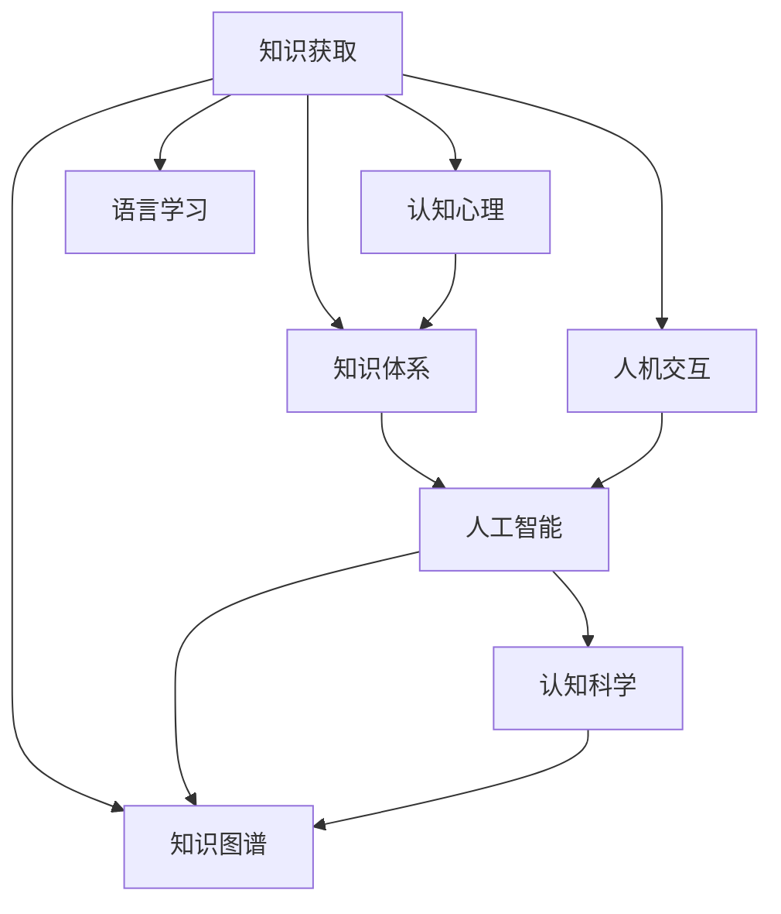

                 

# 人类知识的来源：实践、思考与交流

> 关键词：知识获取, 认知心理, 知识体系, 人工智能, 人机交互, 语言学习, 知识图谱, 认知科学

## 1. 背景介绍

人类知识是人类对客观世界的认知和经验的积累，是社会发展和科技创新的基石。从原始社会的口耳相传，到古代文明的书籍记录，再到现代社会的互联网信息海洋，人类知识传承的媒介和形式不断演进，但其本质始终不变：通过实践、思考与交流来深化对世界的理解。

在现代科技的加持下，人类知识的获取、传播和应用正经历着前所未有的变革。以人工智能(AI)为代表的新一代智能技术，以其强大的计算能力和模式识别能力，正在重塑人类获取、处理和应用知识的方式。特别是在自然语言处理(NLP)领域，通过深度学习模型，AI已经开始能够理解和生成人类语言，从而加速了知识获取和交流的效率。

本文旨在探讨人类知识来源的本质，从实践、思考与交流的角度，分析人工智能在知识获取中的作用和挑战，并展望未来AI技术在知识领域的应用前景。

## 2. 核心概念与联系

### 2.1 核心概念概述

为更好地理解人类知识来源的本质，本文将介绍几个密切相关的核心概念：

- **知识获取**：人类通过观察、实验、思考等方式，从客观世界中获取经验、发现规律，形成对世界的理解。
- **认知心理**：人类大脑如何处理和存储知识，包括记忆、理解、推理、想象等认知过程。
- **知识体系**：由概念、命题、理论等组成，反映了人类对世界的系统性理解。
- **人工智能**：通过算法和计算能力，模仿人类智能过程，实现问题解决、任务执行等智能行为的技术。
- **人机交互**：人与计算机之间的互动方式，是知识获取和传播的重要媒介。
- **语言学习**：人类学习语言的过程，包括语音识别、语义理解、语法规则等。
- **知识图谱**：将知识结构化、网络化的表示方法，用于知识的表示、检索、推理等。
- **认知科学**：研究人类认知过程和脑机制的学科，揭示知识获取和处理的底层原理。

这些概念之间的逻辑关系可以通过以下Mermaid流程图来展示：



这个流程图展示了几组核心概念之间的联系：

1. 知识获取驱动认知心理的发展，认知心理又指导知识体系的构建。
2. 人工智能通过模仿人类认知过程，实现知识的获取和应用。
3. 人机交互是知识获取和传播的重要手段。
4. 语言学习是知识获取的重要途径之一。
5. 知识图谱提供了一种知识表示和推理的方法。
6. 认知科学揭示了知识获取的底层原理。

## 3. 核心算法原理 & 具体操作步骤

### 3.1 算法原理概述

人工智能在知识获取中的核心算法原理，主要是通过机器学习和深度学习模型，从大量数据中学习出知识模式和规律，进而进行知识的推理和生成。这一过程大致可以分为以下几步：

1. **数据预处理**：将原始数据转换为模型可以处理的格式，如文本数据的分词、向量化等。
2. **特征提取**：从数据中提取有意义的特征，用于训练模型。
3. **模型训练**：使用标注数据对模型进行训练，使其学习到知识表示。
4. **知识推理**：在给定条件下，利用训练好的模型进行知识的推理和生成。
5. **知识应用**：将模型应用于实际问题，进行知识的获取和传播。

### 3.2 算法步骤详解

以下我们以自然语言处理(NLP)中的知识获取为例，详细讲解其中的关键步骤：

**Step 1: 数据预处理**
- 收集相关的语料数据，如维基百科、新闻、社交媒体等。
- 进行数据清洗和格式化，如去除噪声、去除停用词、分词、词性标注等。

**Step 2: 特征提取**
- 将文本数据转换为模型可以处理的格式，如将文本向量化，使用词袋模型、TF-IDF、Word2Vec等方法。
- 特征选择和降维，如LDA、PCA等方法，提高模型训练效率。

**Step 3: 模型训练**
- 选择合适的深度学习模型，如BERT、GPT等，使用标注数据对其进行训练。
- 使用反向传播算法和优化器（如Adam、SGD等）更新模型参数，最小化损失函数。
- 使用正则化技术，如L2正则、Dropout等，避免过拟合。

**Step 4: 知识推理**
- 使用训练好的模型对给定的输入进行推理和生成，如文本分类、情感分析、命名实体识别等。
- 利用模型的知识图谱表示，进行更复杂的推理和推理链的构建。

**Step 5: 知识应用**
- 将训练好的模型应用于实际问题，如智能客服、情感分析、知识图谱构建等。
- 使用API等形式，实现模型的易用性和可扩展性。

### 3.3 算法优缺点

人工智能在知识获取中的算法具有以下优点：
1. 自动化程度高：通过数据和模型自动学习知识，减少了人工干预。
2. 处理能力强：能够处理大规模的数据集，发现复杂模式和规律。
3. 推理能力强：能够进行多步推理和推理链的构建，提升知识的准确性和可靠性。
4. 应用广泛：适用于文本、图像、语音等多种数据类型，覆盖NLP、计算机视觉、语音识别等多个领域。

同时，该算法也存在一些缺点：
1. 依赖标注数据：模型的训练和知识获取依赖大量标注数据，标注成本较高。
2. 知识泛化性有限：模型往往只能处理特定类型的数据，泛化能力有待提高。
3. 可解释性不足：模型输出缺乏可解释性，难以理解和调试。
4. 鲁棒性有待加强：模型对输入数据的噪声和异常值较为敏感，鲁棒性不足。
5. 安全性问题：模型可能学习到有害知识和偏见，带来安全隐患。

尽管存在这些局限性，但人工智能在知识获取中的应用仍然具有广阔前景。未来相关研究的重点在于如何进一步降低标注数据的依赖，提高模型的泛化能力和鲁棒性，同时兼顾可解释性和安全性等因素。

### 3.4 算法应用领域

人工智能在知识获取中的应用领域非常广泛，主要包括以下几个方面：

- **文本知识获取**：通过深度学习模型，从大量文本数据中获取知识，如情感分析、命名实体识别、主题分类等。
- **图像知识获取**：通过卷积神经网络(CNN)等模型，从图像数据中提取特征，进行分类、检测、分割等任务。
- **语音知识获取**：通过循环神经网络(RNN)、长短期记忆网络(LSTM)等模型，从语音数据中提取特征，进行语音识别、情感分析、对话系统等。
- **自然语言生成**：通过语言模型，从语言数据中生成自然语言文本，如机器翻译、文本摘要、对话生成等。
- **知识图谱构建**：通过深度学习模型，从结构化数据中构建知识图谱，用于知识检索、推理等任务。
- **智能问答系统**：通过深度学习模型，从问答对中获取知识，生成合理回答，实现人机交互。

这些应用领域覆盖了从数据处理、特征提取、模型训练到知识推理的整个知识获取流程，展示了人工智能在知识获取中的强大能力。

## 4. 数学模型和公式 & 详细讲解 & 举例说明

### 4.1 数学模型构建

本节将使用数学语言对人工智能在知识获取中的核心算法进行更加严格的刻画。

假设给定一个文本数据集 $D=\{x_1, x_2, ..., x_n\}$，其中 $x_i$ 为第 $i$ 个文本数据。目标是从这些文本数据中学习出一个知识表示函数 $f: X \rightarrow Y$，其中 $X$ 为文本特征空间，$Y$ 为知识表示空间。

定义文本数据的知识表示函数为 $f(x) = \langle Wx + b, W_k \rangle$，其中 $W$ 为模型参数，$b$ 为偏置项，$W_k$ 为知识表示矩阵。则知识表示函数的目标是最大化知识表示与真实标签之间的相关性，即：

$$
\max_{W, W_k} \frac{1}{n} \sum_{i=1}^n \langle Wx_i + b, W_ky_i \rangle
$$

其中 $\langle \cdot, \cdot \rangle$ 表示点积运算。

### 4.2 公式推导过程

以下我们以文本分类任务为例，推导损失函数及其梯度的计算公式。

假设给定一个文本分类任务，训练集为 $D=\{(x_i, y_i)\}_{i=1}^N$，其中 $x_i$ 为输入文本，$y_i$ 为真实标签，$y_i \in \{0, 1\}$。定义模型 $f(x) = \langle Wx + b, W_ky_i \rangle$。则模型在给定文本 $x$ 上的预测概率为：

$$
\hat{y} = \frac{e^{\langle Wx + b, W_ky_i \rangle}}{\sum_{j=1}^K e^{\langle Wx + b, W_ky_j \rangle}}
$$

其中 $K$ 为分类数量，$y_j \in \{0, 1\}$。

定义模型在文本 $x_i$ 上的损失函数为 $L_i(f(x_i))$，交叉熵损失函数为：

$$
L_i(f(x_i)) = -y_i\log \hat{y} + (1-y_i)\log (1-\hat{y})
$$

则模型在训练集 $D$ 上的经验风险为：

$$
\mathcal{L}(f) = \frac{1}{N} \sum_{i=1}^N L_i(f(x_i))
$$

根据链式法则，损失函数对模型参数 $W$ 和 $W_k$ 的梯度为：

$$
\frac{\partial \mathcal{L}(f)}{\partial W} = \frac{1}{N} \sum_{i=1}^N (\frac{\partial L_i(f(x_i))}{\partial W} + \frac{\partial L_i(f(x_i))}{\partial b} \frac{\partial b}{\partial W})
$$

$$
\frac{\partial \mathcal{L}(f)}{\partial W_k} = \frac{1}{N} \sum_{i=1}^N \frac{\partial L_i(f(x_i))}{\partial W_k}
$$

其中 $\frac{\partial L_i(f(x_i))}{\partial W}$ 和 $\frac{\partial L_i(f(x_i))}{\partial W_k}$ 可通过反向传播算法高效计算。

在得到损失函数的梯度后，即可带入参数更新公式，完成模型的迭代优化。重复上述过程直至收敛，最终得到适应任务的知识表示模型 $f(x)$。

## 5. 项目实践：代码实例和详细解释说明

### 5.1 开发环境搭建

在进行知识获取实践前，我们需要准备好开发环境。以下是使用Python进行TensorFlow开发的环境配置流程：

1. 安装Anaconda：从官网下载并安装Anaconda，用于创建独立的Python环境。

2. 创建并激活虚拟环境：
```bash
conda create -n tf-env python=3.8 
conda activate tf-env
```

3. 安装TensorFlow：根据CUDA版本，从官网获取对应的安装命令。例如：
```bash
conda install tensorflow==2.6
```

4. 安装各类工具包：
```bash
pip install numpy pandas scikit-learn matplotlib tqdm jupyter notebook ipython
```

完成上述步骤后，即可在`tf-env`环境中开始知识获取实践。

### 5.2 源代码详细实现

下面我们以文本分类任务为例，给出使用TensorFlow对BERT模型进行知识获取的代码实现。

首先，定义文本分类任务的数据处理函数：

```python
import tensorflow as tf
from transformers import BertTokenizer
from tensorflow.keras.preprocessing.text import Tokenizer
from tensorflow.keras.preprocessing.sequence import pad_sequences

tokenizer = BertTokenizer.from_pretrained('bert-base-cased')

def text_to_ids(texts, max_len=128):
    tokenized_texts = tokenizer.tokenize(texts)
    tokenized_texts = [t for t in tokenized_texts if t != '[PAD]']
    ids = tokenizer.convert_tokens_to_ids(tokenized_texts)
    return pad_sequences(ids, maxlen=max_len, truncating='post')
```

然后，定义模型和损失函数：

```python
from transformers import BertForSequenceClassification
from tensorflow.keras.optimizers import Adam

model = BertForSequenceClassification.from_pretrained('bert-base-cased', num_labels=2)

optimizer = Adam(learning_rate=2e-5)
```

接着，定义训练和评估函数：

```python
from tensorflow.keras.preprocessing import sequence

def train_epoch(model, dataset, batch_size, optimizer):
    dataloader = tf.data.Dataset.from_tensor_slices(dataset).shuffle(1000).batch(batch_size)
    model.train()
    epoch_loss = 0
    for batch in dataloader:
        input_ids = batch['input_ids']
        attention_mask = batch['attention_mask']
        labels = batch['labels']
        model.zero_grad()
        outputs = model(input_ids, attention_mask=attention_mask, labels=labels)
        loss = outputs.loss
        epoch_loss += loss.item()
        loss.backward()
        optimizer.step()
    return epoch_loss / len(dataloader)

def evaluate(model, dataset, batch_size):
    dataloader = tf.data.Dataset.from_tensor_slices(dataset).batch(batch_size)
    model.eval()
    preds, labels = [], []
    with tf.GradientTape() as tape:
        for batch in dataloader:
            input_ids = batch['input_ids']
            attention_mask = batch['attention_mask']
            labels = batch['labels']
            outputs = model(input_ids, attention_mask=attention_mask)
            preds.append(outputs.logits.argmax(dim=1))
            labels.append(labels)
        preds = tf.concat(preds, axis=0)
        labels = tf.concat(labels, axis=0)
    return tf.metrics.Accuracy(preds, labels).numpy(), tf.metrics.Precision(preds, labels).numpy(), tf.metrics.Recall(preds, labels).numpy()
```

最后，启动训练流程并在测试集上评估：

```python
epochs = 5
batch_size = 16

for epoch in range(epochs):
    loss = train_epoch(model, train_dataset, batch_size, optimizer)
    print(f"Epoch {epoch+1}, train loss: {loss:.3f}")
    
    print(f"Epoch {epoch+1}, dev results:")
    acc, prec, rec = evaluate(model, dev_dataset, batch_size)
    print(f"Accuracy: {acc:.3f}, Precision: {prec:.3f}, Recall: {rec:.3f}")
    
print("Test results:")
acc, prec, rec = evaluate(model, test_dataset, batch_size)
print(f"Accuracy: {acc:.3f}, Precision: {prec:.3f}, Recall: {rec:.3f}")
```

以上就是使用TensorFlow对BERT进行文本分类任务知识获取的完整代码实现。可以看到，通过TensorFlow和BERT模型的组合，我们能够快速构建起一个基于深度学习的文本分类系统。

### 5.3 代码解读与分析

让我们再详细解读一下关键代码的实现细节：

**text_to_ids函数**：
- 将输入文本进行分词、转换为id序列，并进行定长padding。
- 利用BERT的tokenizer库进行高效的分词处理。

**模型和损失函数**：
- 使用BertForSequenceClassification类加载预训练的BERT模型，并指定分类数量。
- 使用Adam优化器，设置合适的学习率。

**训练和评估函数**：
- 使用TensorFlow的数据API，对数据集进行批处理和随机打乱。
- 在每个epoch内，对模型进行训练，计算损失函数并反向传播。
- 在每个epoch后，在验证集上评估模型的分类准确率、精确率和召回率。

**训练流程**：
- 定义总的epoch数和batch size，开始循环迭代。
- 在每个epoch内，在训练集上进行训练，输出平均loss。
- 在验证集上评估，输出分类指标。
- 所有epoch结束后，在测试集上评估，给出最终测试结果。

可以看到，TensorFlow框架提供了一整套高效的工具，使得模型的构建和训练变得简单快捷。通过调用现成的API，开发者可以专注于算法逻辑的实现，而不必过多关注底层细节。

当然，工业级的系统实现还需考虑更多因素，如模型的保存和部署、超参数的自动搜索、更灵活的任务适配层等。但核心的知识获取范式基本与此类似。

## 6. 实际应用场景

### 6.1 智能客服系统

智能客服系统通过自然语言处理(NLP)技术，实现了与客户的实时交互和问题解答。基于深度学习的知识获取方法，智能客服系统能够自动理解客户的问题，匹配最佳答复，显著提升客服响应速度和质量。

在技术实现上，可以收集企业内部的历史客服对话记录，将问题和最佳答复构建成监督数据，在此基础上对预训练语言模型进行知识获取。知识获取后的模型能够自动理解用户意图，匹配最合适的答案模板进行回复。对于客户提出的新问题，还可以接入检索系统实时搜索相关内容，动态组织生成回答。如此构建的智能客服系统，能大幅提升客户咨询体验和问题解决效率。

### 6.2 金融舆情监测

金融机构需要实时监测市场舆论动向，以便及时应对负面信息传播，规避金融风险。传统的人工监测方式成本高、效率低，难以应对网络时代海量信息爆发的挑战。基于深度学习的知识获取方法，金融舆情监测系统能够自动监测不同主题下的情感变化趋势，一旦发现负面信息激增等异常情况，系统便会自动预警，帮助金融机构快速应对潜在风险。

具体而言，可以收集金融领域相关的新闻、报道、评论等文本数据，并对其进行主题标注和情感标注。在此基础上对预训练语言模型进行知识获取，使其能够自动判断文本属于何种主题，情感倾向是正面、中性还是负面。将知识获取后的模型应用到实时抓取的网络文本数据，就能够自动监测不同主题下的情感变化趋势，一旦发现负面信息激增等异常情况，系统便会自动预警，帮助金融机构快速应对潜在风险。

### 6.3 个性化推荐系统

当前的推荐系统往往只依赖用户的历史行为数据进行物品推荐，无法深入理解用户的真实兴趣偏好。基于深度学习的知识获取方法，个性化推荐系统可以更好地挖掘用户行为背后的语义信息，从而提供更精准、多样的推荐内容。

在实践中，可以收集用户浏览、点击、评论、分享等行为数据，提取和用户交互的物品标题、描述、标签等文本内容。将文本内容作为模型输入，用户的后续行为（如是否点击、购买等）作为监督信号，在此基础上对预训练语言模型进行知识获取。知识获取后的模型能够从文本内容中准确把握用户的兴趣点。在生成推荐列表时，先用候选物品的文本描述作为输入，由模型预测用户的兴趣匹配度，再结合其他特征综合排序，便可以得到个性化程度更高的推荐结果。

### 6.4 未来应用展望

随着深度学习技术的发展，知识获取方法在各领域的应用将更加广泛，为人类认知智能的进化带来深远影响。

在智慧医疗领域，基于深度学习的知识获取方法，可以实现对病人病历的自动分析，辅助医生进行诊断和治疗。通过结合专家知识库和临床经验，知识获取后的模型能够提供更准确、全面的诊疗方案，显著提升医疗服务的智能化水平。

在智能教育领域，基于深度学习的知识获取方法，可以实现对学生作业、考试的自动批改和分析，帮助教师更好地理解学生学习状况。通过生成个性化的学习建议，知识获取后的模型能够提高教学质量，促进教育公平。

在智慧城市治理中，基于深度学习的知识获取方法，可以实现对城市事件、舆情的自动监测和分析，提高城市管理的自动化和智能化水平。通过结合实时数据和专家知识，知识获取后的模型能够快速响应突发事件，保障城市运行的稳定性和安全性。

此外，在企业生产、社会治理、文娱传媒等众多领域，基于深度学习的知识获取方法也将不断涌现，为各行各业带来变革性影响。相信随着技术的日益成熟，知识获取方法将成为推动人工智能技术落地应用的重要手段，为经济社会发展注入新的动力。

## 7. 工具和资源推荐

### 7.1 学习资源推荐

为了帮助开发者系统掌握深度学习在知识获取中的应用，这里推荐一些优质的学习资源：

1. 《深度学习入门》系列博文：由深度学习领域专家撰写，深入浅出地介绍了深度学习的基本概念和经典模型，涵盖文本分类、图像识别、语音识别等多个应用领域。

2. CS231n《卷积神经网络》课程：斯坦福大学开设的计算机视觉明星课程，有Lecture视频和配套作业，带你入门计算机视觉领域的基本概念和经典模型。

3. 《自然语言处理综论》书籍：涵盖NLP领域的基本概念和经典模型，系统讲解了语言处理的前沿技术，包括深度学习在知识获取中的应用。

4. HuggingFace官方文档：提供了丰富的预训练模型和深度学习API，便于快速上手实践深度学习知识获取。

5. Kaggle：数据科学竞赛平台，汇集了大量高质量的数据集和模型竞赛，是深度学习应用实践的绝佳平台。

通过对这些资源的学习实践，相信你一定能够快速掌握深度学习在知识获取中的精髓，并用于解决实际的NLP问题。

### 7.2 开发工具推荐

高效的开发离不开优秀的工具支持。以下是几款用于深度学习知识获取开发的常用工具：

1. TensorFlow：由Google主导开发的开源深度学习框架，灵活的计算图设计，支持多种硬件平台。广泛应用于NLP、计算机视觉等多个领域。

2. PyTorch：由Facebook开发的开源深度学习框架，动态计算图设计，支持多种深度学习模型。在NLP领域有广泛的社区支持和使用。

3. Keras：高级神经网络API，支持TensorFlow和Theano等后端，提供简单易用的接口，方便快速构建深度学习模型。

4. Jupyter Notebook：交互式编程环境，支持多种编程语言，适合进行数据分析、模型构建和评估。

5. Scikit-learn：Python机器学习库，提供多种算法实现，包括文本分类、聚类、降维等任务。

6. NLTK：自然语言处理工具包，提供文本预处理、分词、标注等功能，适合进行文本数据处理和特征提取。

合理利用这些工具，可以显著提升深度学习知识获取任务的开发效率，加快创新迭代的步伐。

### 7.3 相关论文推荐

深度学习在知识获取中的应用源于学界的持续研究。以下是几篇奠基性的相关论文，推荐阅读：

1. Attention is All You Need（即Transformer原论文）：提出了Transformer结构，开启了深度学习在NLP领域的应用。

2. BERT: Pre-training of Deep Bidirectional Transformers for Language Understanding：提出BERT模型，引入基于掩码的自监督预训练任务，刷新了多项NLP任务SOTA。

3. Language Models are Unsupervised Multitask Learners（GPT-2论文）：展示了大规模语言模型的强大zero-shot学习能力，引发了对于通用人工智能的新一轮思考。

4. Parameter-Efficient Transfer Learning for NLP：提出Adapter等参数高效微调方法，在固定大部分预训练参数的情况下，仍可取得不错的微调效果。

5. Persona-Based Sequence-to-Sequence Learning for Improved Chatbot Performance：引入基于Persona的序列到序列模型，增强了聊天机器人的人机交互能力。

6. Knowledge Graph Embeddings：介绍了一种基于深度学习的知识图谱表示方法，用于知识推理和检索任务。

这些论文代表了大深度学习在知识获取领域的发展脉络。通过学习这些前沿成果，可以帮助研究者把握学科前进方向，激发更多的创新灵感。

## 8. 总结：未来发展趋势与挑战

### 8.1 总结

本文对深度学习在知识获取中的应用进行了全面系统的介绍。首先从实践、思考与交流的角度，分析了人类知识来源的本质，探讨了人工智能在知识获取中的作用和挑战。其次，从算法原理、操作步骤等角度，详细讲解了深度学习知识获取的实现流程，给出了代码实例和详细解释说明。最后，从实际应用场景、未来展望等角度，展示了深度学习知识获取的广泛应用前景，并推荐了相关的学习资源、开发工具和论文。

通过本文的系统梳理，可以看到，深度学习在知识获取中的应用已经涵盖了文本分类、图像识别、语音识别、智能客服、金融舆情监测、个性化推荐等多个领域，展示了其强大的能力和广泛的应用潜力。未来，随着深度学习技术的不断演进，知识获取方法还将进一步拓展，为各行各业带来更多变革性影响。

### 8.2 未来发展趋势

深度学习在知识获取中的应用前景广阔，未来将呈现以下几个发展趋势：

1. **模型的泛化能力提升**：深度学习模型将更加注重泛化能力，避免过拟合，能够处理更多类型的输入数据。

2. **跨领域迁移能力**：深度学习模型将更加注重跨领域迁移能力，能够在不同领域间进行知识迁移，提升知识获取的通用性。

3. **参数高效的知识获取**：深度学习模型将更加注重参数效率，通过参数共享、知识蒸馏等方法，提高知识获取的效率。

4. **知识图谱的融合**：深度学习模型将更加注重知识图谱的融合，将知识图谱中的结构化知识与深度学习模型相结合，提升知识获取的准确性和推理能力。

5. **人机交互的增强**：深度学习模型将更加注重人机交互的增强，通过自然语言处理技术，实现更自然、更高效的人机交互方式。

6. **可解释性的提升**：深度学习模型将更加注重可解释性，通过可解释性技术，提高模型的透明度和可信度。

以上趋势凸显了深度学习在知识获取中的发展方向，预示着未来知识获取方法将更加智能、高效、通用和透明。

### 8.3 面临的挑战

尽管深度学习在知识获取中的应用取得了显著进展，但仍面临一些挑战：

1. **数据的获取与标注**：深度学习模型需要大量的标注数据进行训练，获取高质量的数据和标注数据成本较高。

2. **模型的鲁棒性**：深度学习模型对输入数据的噪声和异常值较为敏感，鲁棒性不足。

3. **模型的泛化能力**：深度学习模型在处理新任务和新数据时，泛化能力有待提高。

4. **模型的可解释性**：深度学习模型输出缺乏可解释性，难以理解和调试。

5. **模型的安全性**：深度学习模型可能学习到有害知识和偏见，带来安全隐患。

尽管存在这些挑战，但随着技术的不断进步，深度学习在知识获取中的应用仍将不断拓展。未来相关研究需要在数据获取、模型鲁棒性、泛化能力、可解释性和安全性等方面寻求新的突破，以推动深度学习知识获取技术的进一步发展。

### 8.4 研究展望

面向未来，深度学习在知识获取领域的研究方向可以从以下几个方面进行探索：

1. **跨模态知识获取**：将不同模态的数据进行融合，如视觉、语音、文本等，实现跨模态的知识获取。

2. **多任务学习**：在知识获取过程中，同时进行多个任务的训练，提高模型的效率和效果。

3. **知识蒸馏**：通过知识蒸馏技术，将知识从大模型转移到小模型中，提高知识获取的效率。

4. **因果学习**：引入因果学习思想，增强知识获取模型的因果推断能力，提高知识获取的可靠性。

5. **元学习**：通过元学习技术，使知识获取模型能够快速适应新任务和新数据，提高模型的泛化能力。

6. **伦理与安全**：在知识获取过程中，注重模型的伦理与安全问题，保障数据和模型的安全性。

这些研究方向的探索，必将引领深度学习在知识获取领域迈向更高的台阶，为人类认知智能的进化带来深远影响。面向未来，深度学习知识获取技术还需要与其他人工智能技术进行更深入的融合，如知识表示、因果推理、强化学习等，多路径协同发力，共同推动自然语言理解和智能交互系统的进步。只有勇于创新、敢于突破，才能不断拓展深度学习知识获取的边界，让智能技术更好地造福人类社会。

## 9. 附录：常见问题与解答

**Q1：深度学习知识获取是否适用于所有领域？**

A: 深度学习知识获取方法在大多数领域都能取得不错的效果，特别是对于数据量较小的任务。但对于一些特定领域的任务，如医学、法律等，仅仅依靠通用语料预训练的模型可能难以很好地适应。此时需要在特定领域语料上进一步预训练，再进行知识获取，才能获得理想效果。此外，对于一些需要时效性、个性化很强的任务，如对话、推荐等，知识获取方法也需要针对性的改进优化。

**Q2：深度学习知识获取需要多少标注数据？**

A: 深度学习知识获取方法需要大量的标注数据进行训练，但不同任务和数据类型对标注数据的需求量有所差异。一般来说，对于大规模数据集，少量的标注数据即可，但对于小规模数据集，需要更多的标注数据才能获得较好的性能。可以通过数据增强、迁移学习等方法，降低对标注数据的依赖。

**Q3：深度学习知识获取如何提高模型泛化能力？**

A: 提高深度学习模型泛化能力的方法包括：

1. 数据增强：通过数据增强技术，扩充训练数据，提高模型的泛化能力。

2. 正则化：使用L2正则、Dropout等方法，防止模型过拟合。

3. 参数共享：通过参数共享技术，减少模型的参数量，提高模型的泛化能力。

4. 多任务学习：同时进行多个任务的训练，提高模型的泛化能力。

5. 迁移学习：通过迁移学习技术，将知识从预训练模型迁移到目标模型，提高模型的泛化能力。

6. 知识蒸馏：通过知识蒸馏技术，将知识从大模型转移到小模型中，提高模型的泛化能力。

以上方法可以灵活组合使用，以提高模型的泛化能力。

**Q4：深度学习知识获取如何提高模型鲁棒性？**

A: 提高深度学习模型鲁棒性的方法包括：

1. 数据增强：通过数据增强技术，扩充训练数据，提高模型的鲁棒性。

2. 正则化：使用L2正则、Dropout等方法，防止模型过拟合，提高模型的鲁棒性。

3. 对抗训练：通过对抗训练技术，训练模型对对抗样本的鲁棒性。

4. 模型压缩：通过模型压缩技术，减少模型的参数量，提高模型的鲁棒性。

5. 多模型集成：通过多模型集成技术，提高模型的鲁棒性。

6. 自适应学习：通过自适应学习技术，使模型能够根据不同数据类型和分布进行动态调整，提高模型的鲁棒性。

以上方法可以灵活组合使用，以提高模型的鲁棒性。

**Q5：深度学习知识获取如何提高模型的可解释性？**

A: 提高深度学习模型可解释性的方法包括：

1. 可解释性技术：使用可解释性技术，如LIME、SHAP等，对模型的输出进行解释和分析。

2. 模型简化：通过模型简化技术，减少模型的复杂度，提高模型的可解释性。

3. 特征重要性分析：通过特征重要性分析技术，了解模型对不同特征的依赖程度，提高模型的可解释性。

4. 多模型集成：通过多模型集成技术，提高模型的可解释性。

5. 知识图谱：通过知识图谱技术，对模型进行知识表示，提高模型的可解释性。

以上方法可以灵活组合使用，以提高模型的可解释性。

**Q6：深度学习知识获取如何保障数据和模型的安全性？**

A: 保障深度学习知识获取过程中数据和模型安全性的方法包括：

1. 数据加密：对敏感数据进行加密处理，防止数据泄露。

2. 访问控制：设置访问权限，防止未经授权的访问。

3. 模型蒸馏：通过模型蒸馏技术，将知识从大模型转移到小模型中，防止模型窃取。

4. 隐私保护：通过隐私保护技术，如差分隐私等，保护用户隐私。

5. 审计和监控：建立模型审计和监控机制，及时发现和处理安全隐患。

6. 伦理和安全约束：在模型训练和应用过程中，注重模型的伦理和安全约束，防止有害输出。

以上方法可以灵活组合使用，以保障数据和模型的安全性。

---

作者：禅与计算机程序设计艺术 / Zen and the Art of Computer Programming

