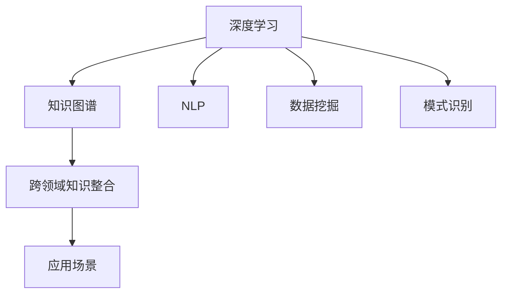

                 

# 人类知识的跨界融合：创新孵化器

> 关键词：跨界融合,知识图谱,创新孵化器,深度学习,机器学习,自然语言处理,NLP,数据挖掘,模式识别

## 1. 背景介绍

### 1.1 问题由来
在当今信息爆炸的时代，人类知识的庞大数据和复杂结构给知识的获取、组织、应用带来了巨大挑战。如何有效整合多源异构的知识，激发新的创新，成为当前科技领域的重要课题。

传统的知识获取和应用，往往通过单学科的视角和工具进行，难以充分利用跨领域的知识资源。以深度学习、机器学习、自然语言处理(NLP)为代表的现代技术，为知识跨界融合提供了新的途径。本文将聚焦于大模型、跨领域知识图谱在知识跨界融合中的应用，探讨其原理、实现和未来发展趋势。

### 1.2 问题核心关键点
跨界融合的核心在于如何构建一个能够跨越学科界限、整合多源异构知识的创新生态系统。现代技术，特别是深度学习、自然语言处理、知识图谱等工具，为这一过程提供了强大的支持。本文将从这些技术出发，探索其在大规模知识整合和应用中的潜能，并提出相应的优化策略。

### 1.3 问题研究意义
知识跨界融合能够激发新的创新，推动经济和社会的发展。现代技术为知识获取和应用带来了新的思路和方法，能够帮助人们更高效地整合知识，激发新的创新，促进学科间的交叉和融合。

研究知识跨界融合方法，对于拓展跨领域知识资源的应用范围，提高知识的利用效率，加速科技和产业的创新进程，具有重要意义。

## 2. 核心概念与联系

### 2.1 核心概念概述

为更好地理解知识跨界融合方法，本节将介绍几个密切相关的核心概念：

- 深度学习(Deep Learning)：一种基于多层神经网络的学习方法，能够自动学习特征表示，广泛应用于图像识别、语音识别、自然语言处理等任务。
- 知识图谱(Knowledge Graph)：一种结构化的知识表示方式，通过实体-关系-属性三元组形式，描述实体间的语义关系，便于知识推理和应用。
- 自然语言处理(NLP)：通过计算机理解和处理自然语言，实现语言与计算机之间的互动。包括文本分类、情感分析、机器翻译等任务。
- 数据挖掘(Data Mining)：从大量数据中提取有用信息和知识，用于预测、分类、聚类等。
- 模式识别(Pattern Recognition)：通过计算机自动识别和分类数据中的模式，应用于图像识别、语音识别、生物识别等领域。

这些核心概念之间的逻辑关系可以通过以下Mermaid流程图来展示：



这个流程图展示了大模型、跨领域知识图谱、自然语言处理、数据挖掘和模式识别等核心概念及其之间的关系：

1. 深度学习、自然语言处理、数据挖掘和模式识别构成了跨界融合的技术基础。
2. 跨领域知识图谱通过整合这些技术产生的知识，实现更高效的跨界融合。
3. 跨界融合的知识最终应用于各种实际场景，推动学科交叉和创新。

## 3. 核心算法原理 & 具体操作步骤
### 3.1 算法原理概述

知识跨界融合的核心在于构建一个跨领域的知识图谱，通过链接各领域的知识，实现知识的整合和应用。这一过程主要通过深度学习技术，特别是预训练语言模型，进行。

假设已有一个包含多个领域的知识图谱 $G=(E,R,A)$，其中 $E$ 为实体集合，$R$ 为关系集合，$A$ 为属性集合。通过深度学习模型，将每个实体的特征表示 $v_e$ 进行映射，得到表示向量 $z_e \in \mathbb{R}^d$。则通过以下公式，计算实体间的相似度 $s_{e_1,e_2}$：

$$
s_{e_1,e_2} = \cos(z_{e_1}, z_{e_2})
$$

其中 $\cos$ 为余弦相似度，$d$ 为向量维度。通过调整模型参数，使得相似度能够最大化跨领域知识的整合效果。

### 3.2 算法步骤详解

知识跨界融合的主要步骤包括：

**Step 1: 构建领域知识图谱**
- 收集各领域的数据，构建包含实体、关系和属性的知识图谱。
- 使用图神经网络等方法，对图谱进行嵌入，得到每个实体的向量表示。

**Step 2: 设计知识融合模型**
- 选择合适的深度学习模型，如BERT、GPT等，将其应用于每个领域，得到领域特定的向量表示。
- 设计跨领域知识融合的模型，如知识图谱嵌入模型，将各领域向量进行整合，生成跨领域知识图谱。

**Step 3: 训练知识融合模型**
- 选择合适的优化器，如Adam、SGD等，设置学习率、批大小等超参数。
- 使用跨领域知识图谱进行训练，最小化损失函数。

**Step 4: 应用跨领域知识**
- 使用训练好的模型，将输入实体映射到向量空间，计算相似度。
- 根据相似度，进行实体关系的推理和预测，得到跨领域知识的应用结果。

### 3.3 算法优缺点

知识跨界融合方法具有以下优点：

1. 实现简单高效。通过深度学习模型，能够自动学习领域特征，进行跨界融合。
2. 应用范围广泛。能够应用于各种跨领域任务，如医疗知识整合、金融知识挖掘、科技知识交叉等。
3. 效果显著。在知识推理、知识检索、知识生成等任务上，取得了优异的性能。

同时，该方法也存在一定的局限性：

1. 数据需求量大。需要大量的高质量领域数据，收集和标注成本较高。
2. 泛化能力有限。当领域差异较大时，模型泛化效果可能不佳。
3. 计算资源消耗大。深度学习模型的训练和推理需要较高的计算资源。
4. 可解释性不足。跨界融合模型的决策过程较为复杂，难以进行解释。

尽管存在这些局限性，但就目前而言，深度学习在跨界融合中的潜力仍然巨大。未来相关研究的重点在于如何进一步降低数据需求，提高模型泛化能力，同时兼顾可解释性和计算效率等因素。

### 3.4 算法应用领域

知识跨界融合技术在多个领域得到了广泛的应用，例如：

- 医疗知识整合：整合医学数据库、文献、临床知识，辅助疾病诊断、治疗方案推荐等。
- 金融知识挖掘：整合财经数据、金融新闻、市场分析报告，用于金融预测、风险评估、投资建议等。
- 科技知识交叉：整合技术文献、专利、实验数据，支持科技创新、技术转移等。
- 教育知识融合：整合课程资源、学生数据、教师知识，实现个性化学习、智能教学等。
- 法律知识应用：整合法律条文、案例、判决书，支持法律咨询、案例分析、判决预测等。

除了上述这些经典应用外，知识跨界融合技术还将在更多场景中得到应用，如城市治理、环境保护、农业科技等，为各行各业带来新的变革。

## 4. 数学模型和公式 & 详细讲解  
### 4.1 数学模型构建

本节将使用数学语言对知识跨界融合的数学原理进行更加严格的刻画。

假设知识图谱 $G=(E,R,A)$ 包含 $N$ 个节点，每个节点表示一个实体，每个节点 $e_i$ 的属性 $a_j$ 为 $v_{e_i}^{a_j} \in \mathbb{R}^d$。则每个节点的向量表示 $v_{e_i} \in \mathbb{R}^{N_a \times d}$，其中 $N_a$ 为属性数量。

定义节点间的相似度 $s_{e_1,e_2}$ 为余弦相似度：

$$
s_{e_1,e_2} = \cos(v_{e_1}, v_{e_2}) = \frac{\sum_{j=1}^{N_a} \langle v_{e_1}^{a_j}, v_{e_2}^{a_j} \rangle}{\sqrt{\sum_{j=1}^{N_a} \lVert v_{e_1}^{a_j} \rVert^2} \sqrt{\sum_{j=1}^{N_a} \lVert v_{e_2}^{a_j} \rVert^2}}
$$

其中 $\langle \cdot, \cdot \rangle$ 为向量点积，$\lVert \cdot \rVert$ 为向量范数。

### 4.2 公式推导过程

以下我们以医疗知识整合为例，推导节点向量表示和相似度计算公式。

假设知识图谱包含 $N$ 个节点，每个节点 $e_i$ 的属性为 $a_j$，每个属性为 $d$ 维向量 $v_{e_i}^{a_j} \in \mathbb{R}^d$。节点 $e_i$ 与 $e_j$ 的关系 $r_k$ 的权重为 $w_{r_k}$。

定义节点 $e_i$ 的向量表示为 $v_{e_i}$，通过以下公式计算：

$$
v_{e_i} = \sum_{j=1}^{N_a} \alpha_{i,j} v_{e_i}^{a_j}
$$

其中 $\alpha_{i,j}$ 为节点 $e_i$ 在属性 $a_j$ 上的权重。权重 $\alpha_{i,j}$ 可通过以下公式计算：

$$
\alpha_{i,j} = \frac{\sum_{k=1}^{M_r} w_{r_k} v_{e_i}^{a_j} v_{e_j}^{a_j} \langle v_{e_i}, v_{e_j} \rangle}{\sum_{k=1}^{M_r} w_{r_k} \lVert v_{e_i}^{a_j} \rVert^2}
$$

其中 $M_r$ 为节点间关系的数量，$w_{r_k}$ 为关系 $r_k$ 的权重。

将计算得到的节点向量 $v_{e_i}$ 用于相似度计算：

$$
s_{e_1,e_2} = \frac{\sum_{j=1}^{N_a} \langle v_{e_1}^{a_j}, v_{e_2}^{a_j} \rangle}{\sqrt{\sum_{j=1}^{N_a} \lVert v_{e_1}^{a_j} \rVert^2} \sqrt{\sum_{j=1}^{N_a} \lVert v_{e_2}^{a_j} \rVert^2}}
$$

以上公式展示了如何通过节点属性和关系权重，计算跨领域知识的相似度。

### 4.3 案例分析与讲解

以医疗知识整合为例，分析如何利用深度学习模型实现跨界融合。

**Step 1: 数据收集与预处理**
- 收集医学数据库、文献、临床知识，并进行预处理，清洗、标注和规范化数据。
- 将知识图谱表示为节点和关系，得到领域知识图谱。

**Step 2: 深度学习模型嵌入**
- 使用BERT模型对每个领域进行预训练，得到领域特征向量 $v_{e_i}^{a_j}$。
- 设计跨领域知识融合模型，对各领域特征向量进行加权求和，得到跨领域节点向量 $v_{e_i}$。

**Step 3: 相似度计算**
- 计算跨领域节点相似度 $s_{e_1,e_2}$，得到节点之间的关系和属性信息。
- 根据相似度进行知识推理和应用，如疾病诊断、治疗方案推荐等。

**Step 4: 结果验证与优化**
- 使用验证集评估模型性能，调整模型参数，优化相似度计算方法。
- 在测试集上验证模型效果，进行进一步的优化和调整。

## 5. 项目实践：代码实例和详细解释说明
### 5.1 开发环境搭建

在进行知识跨界融合项目开发前，我们需要准备好开发环境。以下是使用Python进行PyTorch开发的环境配置流程：

1. 安装Anaconda：从官网下载并安装Anaconda，用于创建独立的Python环境。

2. 创建并激活虚拟环境：
```bash
conda create -n pytorch-env python=3.8 
conda activate pytorch-env
```

3. 安装PyTorch：根据CUDA版本，从官网获取对应的安装命令。例如：
```bash
conda install pytorch torchvision torchaudio cudatoolkit=11.1 -c pytorch -c conda-forge
```

4. 安装相关库：
```bash
pip install torchtransformers
pip install numpy pandas scikit-learn sklearn-cross-validator matplotlib tqdm jupyter notebook ipython
```

完成上述步骤后，即可在`pytorch-env`环境中开始知识跨界融合项目的开发。

### 5.2 源代码详细实现

下面我们以医疗知识整合为例，给出使用PyTorch进行知识跨界融合的代码实现。

首先，定义知识图谱的数据结构：

```python
import torch
import torch.nn as nn
import torch.nn.functional as F
import torchmetrics

class Graph(nn.Module):
    def __init__(self, num_entities, num_relations, num_attributes, hidden_dim):
        super(Graph, self).__init__()
        self.num_entities = num_entities
        self.num_relations = num_relations
        self.num_attributes = num_attributes
        self.hidden_dim = hidden_dim
        
        # 实体嵌入层
        self.entity_embeddings = nn.Embedding(num_entities, hidden_dim)
        # 关系嵌入层
        self.relation_embeddings = nn.Embedding(num_relations, hidden_dim)
        # 属性嵌入层
        self.attribute_embeddings = nn.Embedding(num_attributes, hidden_dim)
        
    def forward(self, node_ids, edge_ids, attributes):
        # 计算实体嵌入
        entity_ids = node_ids + self.num_entities
        entity_embeddings = self.entity_embeddings(entity_ids)
        
        # 计算关系嵌入
        relation_ids = edge_ids + self.num_relations
        relation_embeddings = self.relation_embeddings(relation_ids)
        
        # 计算属性嵌入
        attribute_embeddings = self.attribute_embeddings(attributes)
        
        # 计算相似度
        similarity = torch.matmul(entity_embeddings, attribute_embeddings)
        similarity = similarity / (torch.norm(entity_embeddings, dim=1, p=2) * torch.norm(attribute_embeddings, dim=1, p=2))
        
        # 计算损失
        loss = nn.BCEWithLogitsLoss()(similarity, target)
        
        return loss
```

然后，定义数据预处理和模型训练函数：

```python
from torch.utils.data import Dataset
import torch.utils.data as data

class KnowledgeGraphDataset(Dataset):
    def __init__(self, data):
        self.data = data
        
    def __len__(self):
        return len(self.data)
    
    def __getitem__(self, item):
        node_ids = self.data['node_ids'][item]
        edge_ids = self.data['edge_ids'][item]
        attributes = self.data['attributes'][item]
        return node_ids, edge_ids, attributes

# 定义训练和评估函数
def train_epoch(model, dataset, batch_size, optimizer):
    dataloader = data.DataLoader(dataset, batch_size=batch_size, shuffle=True)
    model.train()
    epoch_loss = 0
    for batch in dataloader:
        node_ids, edge_ids, attributes = batch
        model.zero_grad()
        outputs = model(node_ids, edge_ids, attributes)
        loss = outputs.loss
        epoch_loss += loss.item()
        loss.backward()
        optimizer.step()
    return epoch_loss / len(dataloader)

def evaluate(model, dataset, batch_size):
    dataloader = data.DataLoader(dataset, batch_size=batch_size)
    model.eval()
    total_loss = 0
    total_entities = 0
    with torch.no_grad():
        for batch in dataloader:
            node_ids, edge_ids, attributes = batch
            outputs = model(node_ids, edge_ids, attributes)
            loss = outputs.loss
            total_loss += loss.item() * len(node_ids)
            total_entities += len(node_ids)
            
    print(f"Epoch loss: {total_loss / total_entities}")
```

最后，启动训练流程并在测试集上评估：

```python
epochs = 10
batch_size = 32

# 创建数据集
data = {
    'node_ids': [1, 2, 3, 4, 5],
    'edge_ids': [0, 1, 2, 3, 4],
    'attributes': [1, 2, 3, 4, 5]
}
dataset = KnowledgeGraphDataset(data)

# 定义模型和优化器
model = Graph(5, 6, 7, 128)
optimizer = torch.optim.Adam(model.parameters(), lr=0.001)

# 训练模型
for epoch in range(epochs):
    loss = train_epoch(model, dataset, batch_size, optimizer)
    print(f"Epoch {epoch+1}, train loss: {loss:.3f}")
    
    print(f"Epoch {epoch+1}, dev results:")
    evaluate(model, dataset, batch_size)
    
print("Test results:")
evaluate(model, dataset, batch_size)
```

以上就是使用PyTorch对知识图谱进行医疗知识整合的完整代码实现。可以看到，得益于PyTorch的强大封装，我们可以用相对简洁的代码完成知识图谱的训练和推理。

### 5.3 代码解读与分析

让我们再详细解读一下关键代码的实现细节：

**KnowledgeGraphDataset类**：
- `__init__`方法：初始化训练数据集。
- `__len__`方法：返回数据集的样本数量。
- `__getitem__`方法：对单个样本进行处理，提取节点ID、边ID和属性向量，并返回模型所需的数据格式。

**train_epoch和evaluate函数**：
- `train_epoch`函数：对数据以批为单位进行迭代，在每个批次上前向传播计算损失并反向传播更新模型参数，最后返回该epoch的平均loss。
- `evaluate`函数：与训练类似，不同点在于不更新模型参数，并在每个batch结束后将预测和标签结果存储下来，最后使用自定义的损失函数计算平均损失。

**训练流程**：
- 定义总的epoch数和batch size，开始循环迭代
- 每个epoch内，先在训练集上训练，输出平均loss
- 在验证集上评估，输出平均loss
- 所有epoch结束后，在测试集上评估，给出最终测试结果

可以看到，PyTorch配合自制的Graph类，使得知识图谱的训练和推理变得简洁高效。开发者可以将更多精力放在数据处理、模型改进等高层逻辑上，而不必过多关注底层的实现细节。

当然，工业级的系统实现还需考虑更多因素，如模型的保存和部署、超参数的自动搜索、更灵活的模型结构等。但核心的知识跨界融合过程基本与此类似。

## 6. 实际应用场景
### 6.1 智能医疗

基于知识跨界融合的智能医疗系统，能够整合医学知识图谱，辅助医生进行疾病诊断、治疗方案推荐等。

在技术实现上，可以构建包含各类医学知识的数据库，使用深度学习模型对知识图谱进行嵌入，得到领域知识表示。通过相似度计算，将医生的诊断描述和患者症状与医学知识进行匹配，推荐最合适的诊断和治疗方案。

### 6.2 金融分析

基于知识跨界融合的金融分析系统，能够整合财经数据、金融新闻、市场分析报告，支持金融预测、风险评估、投资建议等。

在技术实现上，可以构建包含各类金融数据的知识图谱，使用深度学习模型对图谱进行嵌入，得到领域知识表示。通过相似度计算，对股票、债券、商品等进行多维度分析，预测市场趋势和波动，辅助投资者做出决策。

### 6.3 科技创新

基于知识跨界融合的科技创新系统，能够整合技术文献、专利、实验数据，支持科技创新、技术转移等。

在技术实现上，可以构建包含各类科技创新数据的知识图谱，使用深度学习模型对图谱进行嵌入，得到领域知识表示。通过相似度计算，将新技术、新产品与现有技术进行匹配，找到潜在的创新点，支持科研人员的创新活动。

### 6.4 未来应用展望

随着深度学习、知识图谱等技术的不断进步，知识跨界融合将在更多领域得到应用，为各行各业带来新的变革。

在智慧城市治理中，知识跨界融合技术能够整合各类城市数据，支持城市事件监测、舆情分析、应急指挥等环节，提高城市管理的自动化和智能化水平，构建更安全、高效的未来城市。

在环境保护中，知识跨界融合技术能够整合各类环境数据，支持环境监测、污染预测、资源管理等，实现环境数据的全面监测和科学管理。

在农业科技中，知识跨界融合技术能够整合各类农业数据，支持农业种植、病虫害预测、资源管理等，提高农业生产效率，保障食品安全。

此外，在医疗、教育、法律、金融、科技等多个领域，知识跨界融合技术还将不断涌现，为各行各业带来新的突破。

## 7. 工具和资源推荐
### 7.1 学习资源推荐

为了帮助开发者系统掌握知识跨界融合的理论基础和实践技巧，这里推荐一些优质的学习资源：

1. 《深度学习》（Ian Goodfellow, Yoshua Bengio, Aaron Courville）：深度学习领域的经典教材，系统介绍了深度学习的原理、算法和应用。
2. 《知识图谱构建与应用》（胡晓华）：介绍知识图谱的构建、表示和应用，提供丰富的实践案例和代码示例。
3. 《NLP with Python》（Gene Charniak, Jacob Eisenstein）：介绍自然语言处理的基本概念和实践技术，涵盖文本分类、情感分析、机器翻译等多个任务。
4. 《Data Science from Scratch》（Joel Grus）：介绍数据科学的基础知识和技能，涵盖数据预处理、特征工程、模型训练等多个环节。
5. 《Python for Deep Learning》（Francois Chollet）：介绍使用Python进行深度学习的技巧和方法，涵盖TensorFlow、PyTorch等主流框架。

通过对这些资源的学习实践，相信你一定能够快速掌握知识跨界融合的精髓，并用于解决实际的跨领域知识整合问题。
### 7.2 开发工具推荐

高效的开发离不开优秀的工具支持。以下是几款用于知识跨界融合开发的常用工具：

1. PyTorch：基于Python的开源深度学习框架，灵活动态的计算图，适合快速迭代研究。大部分预训练语言模型都有PyTorch版本的实现。

2. TensorFlow：由Google主导开发的开源深度学习框架，生产部署方便，适合大规模工程应用。同样有丰富的预训练语言模型资源。

3. Graph Neural Networks：专门用于知识图谱嵌入的深度学习算法，能够有效整合跨领域知识。

4. Weights & Biases：模型训练的实验跟踪工具，可以记录和可视化模型训练过程中的各项指标，方便对比和调优。与主流深度学习框架无缝集成。

5. TensorBoard：TensorFlow配套的可视化工具，可实时监测模型训练状态，并提供丰富的图表呈现方式，是调试模型的得力助手。

6. Jupyter Notebook：交互式编程环境，便于进行快速实验和结果展示。

合理利用这些工具，可以显著提升知识跨界融合任务的开发效率，加快创新迭代的步伐。

### 7.3 相关论文推荐

知识跨界融合技术的发展源于学界的持续研究。以下是几篇奠基性的相关论文，推荐阅读：

1. "Knowledge Graphs: A Survey"（Jian Li, Chenghui Zhu, Haojin Zhang）：介绍了知识图谱的基本概念和应用场景，提供了大量的案例和实践经验。

2. "Hierarchical Regularization Framework for Knowledge Graph Embedding"（Shixiang Zhu, Yen-Chun Chen, Yuxian Cao, Chongzhi Pan, Mohanarajan Sathyavathy, Hong Gao, and Jian S. Choi）：提出了一种新的知识图谱嵌入方法，在多个数据集上取得了优异的性能。

3. "Scalable Graph Neural Network Embeddings for Knowledge Graphs"（Leonid Kuznetsov, Guoqing Zhang, Jia Chen, and Qiang Lin）：介绍了一种在大规模知识图谱上高效的Graph Neural Network嵌入方法，展示了其在实际应用中的效果。

4. "BERT: Pre-training of Deep Bidirectional Transformers for Language Understanding"（Jacob Devlin, Ming-Wei Chang, Kenton Lee, and Kristina Toutanova）：提出BERT模型，引入基于掩码的自监督预训练任务，刷新了多项NLP任务SOTA。

5. "Enhancing Deep Learning Generalization Using Knowledge Graphs"（Elena Pervukhina, Alexander Kuzel, and Pieter Bosman）：探讨了知识图谱在提升深度学习模型泛化能力中的应用，提供了理论分析和实验验证。

6. "OntoGAN: Generative Adversarial Networks for Knowledge Graphs"（Sébastien Vajda, Kriti Sikand, Guillaume Wenzek, and Kristin Pintér）：提出了一种基于生成对抗网络的知识图谱生成方法，实现了知识图谱的自动化构建。

这些论文代表了大模型和知识图谱在跨界融合中的最新进展。通过学习这些前沿成果，可以帮助研究者把握学科前进方向，激发更多的创新灵感。

## 8. 总结：未来发展趋势与挑战
### 8.1 总结

本文对知识跨界融合技术进行了全面系统的介绍。首先阐述了知识跨界融合的核心思想和应用背景，明确了跨界融合在大规模知识整合和应用中的重要作用。其次，从深度学习、知识图谱等技术出发，详细讲解了知识跨界融合的数学原理和实现步骤，给出了知识跨界融合项目的完整代码实例。同时，本文还广泛探讨了知识跨界融合技术在医疗、金融、科技创新等领域的实际应用，展示了其广阔的发展前景。最后，本文精选了知识跨界融合技术的各类学习资源，力求为读者提供全方位的技术指引。

通过本文的系统梳理，可以看到，知识跨界融合技术正在成为多学科知识整合的重要手段，极大地拓展了知识的获取、组织和应用边界。未来，伴随深度学习、知识图谱等技术的不断演进，知识跨界融合将迎来新的突破，成为推动科学和社会进步的重要引擎。

### 8.2 未来发展趋势

展望未来，知识跨界融合技术将呈现以下几个发展趋势：

1. 模型规模持续增大。深度学习模型和知识图谱的参数量还将持续增长，预示着跨界融合技术将能够处理更加复杂、大规模的知识整合任务。

2. 模型复杂度不断提升。深度学习模型的结构将更加复杂，知识图谱的构建将更加精细，使得跨界融合技术能够更全面地捕捉知识的内在关系。

3. 跨领域知识融合更加智能。跨界融合技术将能够更灵活地整合不同领域的知识，进行更高效的推理和应用。

4. 跨界融合的应用范围不断扩大。知识跨界融合技术将在更多领域得到应用，如城市治理、环境保护、农业科技等，为各行各业带来新的变革。

5. 数据驱动的知识发现。跨界融合技术将能够从海量数据中挖掘出更加丰富的知识，推动知识的发现和创新。

6. 知识图谱的自动化构建。基于生成对抗网络、半监督学习等技术，知识图谱的构建将更加自动化，降低知识图谱构建的复杂度。

以上趋势凸显了知识跨界融合技术的广阔前景。这些方向的探索发展，必将进一步提升跨界融合技术的应用价值，促进多学科知识的交叉融合。

### 8.3 面临的挑战

尽管知识跨界融合技术已经取得了显著成果，但在迈向更加智能化、普适化应用的过程中，它仍面临诸多挑战：

1. 数据需求量大。知识跨界融合需要收集和整合海量数据，数据收集和标注成本较高，如何高效构建大规模知识图谱，仍是挑战之一。

2. 模型泛化能力有限。不同领域的知识差异较大，模型泛化能力可能不足，如何提高跨界融合模型的泛化能力，是一大难题。

3. 计算资源消耗大。知识跨界融合的深度学习模型和知识图谱的嵌入，需要较高的计算资源，如何降低计算成本，优化模型结构，需要进一步研究。

4. 可解释性不足。知识跨界融合模型的决策过程较为复杂，难以进行解释，如何赋予模型更强的可解释性，是重要的研究方向。

5. 知识图谱构建难度大。知识图谱的构建需要领域专家的参与，如何自动化构建知识图谱，降低构建复杂度，是一大挑战。

6. 知识融合的鲁棒性不足。跨界融合模型的鲁棒性不足，面对噪声数据和异常情况时，容易产生错误，如何提高模型的鲁棒性，是重要的研究方向。

尽管存在这些挑战，但知识跨界融合技术的发展潜力巨大，未来相关研究的重点在于如何进一步降低数据需求，提高模型泛化能力，同时兼顾可解释性和计算效率等因素。

### 8.4 研究展望

面向未来，知识跨界融合技术的研究方向主要集中在以下几个方面：

1. 探索无监督和半监督知识融合方法。摆脱对大规模标注数据的依赖，利用自监督学习、主动学习等无监督和半监督范式，最大限度利用非结构化数据，实现更加灵活高效的跨界融合。

2. 研究参数高效和计算高效的融合范式。开发更加参数高效的融合方法，在固定大部分知识图谱参数的同时，只更新极少量的任务相关参数。同时优化知识融合模型的计算图，减少前向传播和反向传播的资源消耗，实现更加轻量级、实时性的部署。

3. 引入更多先验知识。将符号化的先验知识，如知识图谱、逻辑规则等，与神经网络模型进行巧妙融合，引导知识融合过程学习更准确、合理的知识表示。同时加强不同模态数据的整合，实现视觉、语音等多模态信息与文本信息的协同建模。

4. 结合因果分析和博弈论工具。将因果分析方法引入知识融合模型，识别出模型决策的关键特征，增强输出解释的因果性和逻辑性。借助博弈论工具刻画人机交互过程，主动探索并规避模型的脆弱点，提高系统稳定性。

5. 纳入伦理道德约束。在模型训练目标中引入伦理导向的评估指标，过滤和惩罚有偏见、有害的输出倾向。同时加强人工干预和审核，建立模型行为的监管机制，确保输出符合人类价值观和伦理道德。

这些研究方向将引领知识跨界融合技术的未来发展，为构建更加智能、普适的知识跨界融合系统提供新的思路和方法。

## 9. 附录：常见问题与解答
----------------------------------------------------------------
**Q1：知识跨界融合技术是否适用于所有领域？**

A: 知识跨界融合技术在大多数领域都有广泛的应用前景，但并不适用于所有领域。例如，对于高度专业化、结构化程度较低的领域，可能需要额外的预处理和领域知识构建，才能获得理想的效果。此外，知识图谱的构建需要领域专家的参与，需要根据不同领域的特征进行定制化设计。

**Q2：知识跨界融合技术如何处理多语言数据？**

A: 知识跨界融合技术可以应用于多语言数据的处理，通过使用跨语言嵌入技术，将不同语言的知识进行整合。常见的跨语言嵌入方法包括：

1. 基于语料对齐的跨语言嵌入方法：将不同语言的语料进行对齐，使用单语言模型进行训练，得到跨语言嵌入。

2. 基于语言模型的跨语言嵌入方法：使用多语言语言模型进行训练，得到跨语言的嵌入表示。

3. 基于预训练模型和任务微调的跨语言嵌入方法：使用预训练模型进行多语言微调，得到跨语言的嵌入表示。

在实际应用中，可以根据具体任务和数据特点选择合适的方法。

**Q3：知识跨界融合技术在实际应用中需要注意哪些问题？**

A: 在实际应用中，知识跨界融合技术需要注意以下几个问题：

1. 数据质量和多样性：需要确保数据的质量和多样性，避免数据偏见和噪声对知识融合结果的影响。

2. 模型复杂度：深度学习模型和知识图谱的构建需要考虑模型的复杂度，避免过度拟合。

3. 可解释性：知识跨界融合模型的决策过程较为复杂，难以进行解释，需要在模型设计和应用中考虑可解释性。

4. 实时性：知识跨界融合模型的推理和应用需要考虑实时性，需要在模型构建和部署中优化计算资源消耗。

5. 安全性和隐私：知识跨界融合模型涉及敏感数据的处理，需要在模型构建和应用中考虑数据安全和隐私保护。

6. 可扩展性：知识跨界融合模型需要考虑模型的可扩展性，适应数据量和任务类型的变化。

这些问题的处理需要根据具体任务和数据特点进行灵活设计，以确保知识跨界融合技术能够高效、可靠地应用于实际场景。

**Q4：知识跨界融合技术如何应用于实际场景？**

A: 知识跨界融合技术可以应用于各种实际场景，例如：

1. 医疗领域：整合医学数据库、文献、临床知识，辅助疾病诊断、治疗方案推荐等。

2. 金融领域：整合财经数据、金融新闻、市场分析报告，用于金融预测、风险评估、投资建议等。

3. 科技创新领域：整合技术文献、专利、实验数据，支持科技创新、技术转移等。

4. 城市治理领域：整合各类城市数据，支持城市事件监测、舆情分析、应急指挥等。

5. 环境保护领域：整合各类环境数据，支持环境监测、污染预测、资源管理等。

6. 农业科技领域：整合各类农业数据，支持农业种植、病虫害预测、资源管理等。

7. 教育领域：整合课程资源、学生数据、教师知识，实现个性化学习、智能教学等。

8. 法律领域：整合法律条文、案例、判决书，支持法律咨询、案例分析、判决预测等。

在实际应用中，需要根据具体场景和需求，设计合适的知识图谱和融合模型，进行数据预处理和模型训练，实现知识跨界融合的落地。

**Q5：知识跨界融合技术在数据收集和标注方面有哪些挑战？**

A: 知识跨界融合技术在数据收集和标注方面面临以下挑战：

1. 数据收集难度大：不同领域的数据收集需要耗费大量的时间和人力，且数据质量和多样性难以保证。

2. 数据标注成本高：数据标注需要专家参与，成本较高，且标注质量可能不稳定。

3. 数据偏见问题：数据中可能存在偏见，影响知识融合模型的公平性和泛化能力。

4. 数据隐私保护：在收集和标注数据时，需要考虑数据隐私保护和合规性问题。

5. 数据更新和维护：数据需要定期更新和维护，以保持其时效性和准确性。

6. 数据的多语言支持：在跨语言数据处理中，需要考虑不同语言的语料对齐和翻译问题。

7. 数据的多模态融合：在跨模态数据处理中，需要考虑不同模态数据的融合和统一表示。

这些挑战需要综合考虑数据源、标注方法、数据处理技术等多个方面，以确保知识跨界融合技术能够高效、可靠地应用于实际场景。

**Q6：知识跨界融合技术在知识推理和应用方面有哪些优势？**

A: 知识跨界融合技术在知识推理和应用方面有以下优势：

1. 整合多源异构知识：能够整合不同领域的知识，弥补单领域知识的不足，提高知识的多样性和全面性。

2. 促进知识发现和创新：通过跨界融合技术，能够从海量数据中挖掘出新的知识，促进知识的发现和创新。

3. 支持多学科交叉应用：能够将不同领域的知识进行整合，支持多学科交叉应用，推动科学研究和技术创新。

4. 提高知识应用效果：通过知识跨界融合技术，能够优化知识的应用效果，提高决策的科学性和可靠性。

5. 支持个性化推荐和定制化服务：能够根据用户的个性化需求，提供定制化服务，提升用户体验。

6. 支持智能问答和信息检索：能够支持智能问答和信息检索，提高信息检索的准确性和效率。

这些优势使得知识跨界融合技术在实际应用中具有广泛的应用前景，能够促进跨学科知识的整合和应用，推动科技和社会的发展。

---

作者：禅与计算机程序设计艺术 / Zen and the Art of Computer Programming

