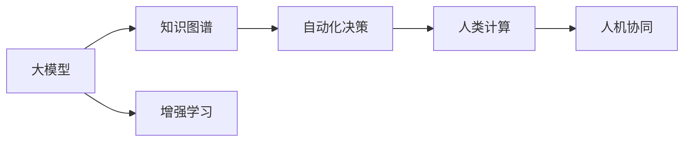

                 

# 人类计算：AI 时代的新动能

## 1. 背景介绍

随着人工智能(AI)技术的飞速发展，我们即将进入一个全新的智能计算时代。这种转变不仅是对信息技术的革命性升级，更是对人类计算模式的根本变革。

过去几十年，人类主要通过二进制代码编写算法、机器学习模型设计以及物理硬件部署等方式进行计算。而如今，AI的崛起促使我们重新审视计算的本质，探索基于智能代理、人机协同和自动化决策的新型计算范式。

大模型、知识图谱、增强学习等技术的不断突破，标志着“人类计算”的兴起。而本文将探讨这一新动能，及其对传统计算模式带来的深刻变革。

## 2. 核心概念与联系

### 2.1 核心概念概述

在本节，我们首先介绍几个核心概念，并阐述它们之间的联系：

- **人类计算(Human Computing)**：一种新型的计算模式，利用人类的认知智能和机器的计算能力，实现更高效、更智能的计算。
- **大模型(Large Models)**：大规模的神经网络模型，如BERT、GPT-3等，能够处理大量复杂任务，并通过学习自适应新数据。
- **知识图谱(Knowledge Graphs)**：一种结构化的语义表示方法，用于捕获和组织知识，支持智能推理和问答系统。
- **增强学习(Reinforcement Learning, RL)**：通过智能体与环境的交互，学习最优决策策略的机器学习范式。
- **自动化决策(Autonomous Decision Making)**：将机器学习模型应用于决策过程，减少人工干预，提高决策效率。
- **人机协同(Human-Machine Collaboration)**：融合人类智能与机器智能的优势，构建协同工作的系统。

这些概念相互关联，共同构成了未来AI时代智能计算的基础框架。大模型提供了强大的计算能力，知识图谱提供了丰富的知识背景，增强学习提供了自主决策的能力，而人类计算则整合了这些资源，实现了智能与计算的深度融合。

### 2.2 核心概念原理和架构的 Mermaid 流程图



该图展示了从大模型到自动化决策，再至人机协同的全链条。大模型通过知识图谱提供背景知识，增强学习策略优化决策过程，而人机协同最终实现智能计算。

## 3. 核心算法原理 & 具体操作步骤

### 3.1 算法原理概述

人类计算的核心在于将复杂问题分解为可执行的任务，并利用智能代理(如大模型)进行计算。本节将详细阐述这一过程的算法原理。

假设我们面临一个复杂的计算问题 $P$，可以将其分解为多个子问题 $P_1, P_2, \ldots, P_n$。大模型 $M$ 被部署在分布式计算环境中，通过协同计算，逐步解决每个子问题。

算法的总体流程如下：
1. **问题分解**：将 $P$ 分解为 $P_1, P_2, \ldots, P_n$ 并定义计算规则 $R_i$。
2. **任务执行**：并行执行大模型 $M$ 求解 $P_i$。
3. **结果整合**：将各子问题的解 $R_i$ 整合成最终结果 $R_P$。

通过这种分布式计算框架，我们可以利用大模型的强大计算能力，高效解决复杂问题。

### 3.2 算法步骤详解

为了更清晰地理解人类计算的实现细节，接下来将详细介绍每一步的具体操作：

**Step 1: 问题分解**
- **任务划分**：将大问题 $P$ 划分为多个子问题 $P_1, P_2, \ldots, P_n$。这通常依赖领域专家的知识。
- **定义规则**：为每个子问题 $P_i$ 定义计算规则 $R_i$，可以是逻辑推理、统计分析等。

**Step 2: 任务执行**
- **模型部署**：在大模型 $M$ 中加载任务规则 $R_i$。
- **并行计算**：在分布式系统中并行执行大模型 $M$ 解决 $P_i$。

**Step 3: 结果整合**
- **聚合处理**：将各子问题的解 $R_i$ 整合为最终结果 $R_P$。可以是简单的叠加、加权平均、或复杂的优化算法。

### 3.3 算法优缺点

人类计算相比传统计算方法，有以下优点：
1. **高效性**：大模型通过并行计算显著提高了计算速度。
2. **智能性**：智能代理（如大模型）能够自适应新数据，提升决策质量。
3. **可扩展性**：分布式计算框架可以扩展到更大规模的问题。

同时，也存在一些缺点：
1. **依赖知识**：问题分解和规则定义依赖领域专家的知识，需要大量前期投入。
2. **数据质量**：大模型的计算结果受数据质量影响，对噪声和异常数据敏感。
3. **模型复杂性**：大模型的训练和维护成本较高，模型调试和优化难度大。

### 3.4 算法应用领域

人类计算的应用领域非常广泛，以下是几个典型案例：

- **金融风险管理**：利用大模型和知识图谱进行风险评估和决策支持。
- **医疗诊断与治疗**：通过增强学习和知识图谱进行疾病诊断和个性化治疗方案设计。
- **智能制造与生产调度**：使用大模型优化生产流程，实现智能调度。
- **城市交通管理**：通过大模型和知识图谱进行交通流量预测和优化。
- **自动驾驶与机器人**：结合大模型和增强学习，实现无人驾驶和机器人自主导航。

以上案例展示了人类计算在多个领域的成功应用，未来这一计算范式有望在更多领域发挥重要作用。

## 4. 数学模型和公式 & 详细讲解

### 4.1 数学模型构建

为了形式化描述人类计算过程，我们引入一个简单的数学模型：

设问题 $P$ 的计算量为 $Q$，计算时间为 $T$。我们将其分解为 $n$ 个子问题 $P_1, P_2, \ldots, P_n$，每个子问题的计算量分别为 $Q_1, Q_2, \ldots, Q_n$，计算时间分别为 $T_1, T_2, \ldots, T_n$。

定义 $R_i$ 为子问题 $P_i$ 的解，最终问题的解为 $R_P$。则求解过程可以表示为：

$$
R_P = \bigoplus_{i=1}^n R_i
$$

其中 $\oplus$ 表示问题解的整合并置。

### 4.2 公式推导过程

为了更好地理解公式 $\bigoplus_{i=1}^n R_i$，我们将其拆解为 $n$ 个子公式，并使用数学归纳法进行推导：

**基础情形**：当 $n=1$ 时，问题 $P$ 直接通过计算 $R_1$ 得到解 $R_P$，即 $R_P = R_1$。

**归纳假设**：假设当 $n=k$ 时公式成立，即 $R_P = \bigoplus_{i=1}^k R_i$。

**归纳步骤**：当 $n=k+1$ 时，问题 $P$ 通过计算 $P_1, P_2, \ldots, P_k$ 和 $P_{k+1}$ 的解，得到最终解 $R_P$：

$$
R_P = \bigoplus_{i=1}^k R_i \oplus R_{k+1}
$$

由归纳假设，上式等价于：

$$
R_P = R_k \oplus R_{k+1}
$$

从而完成推导。

### 4.3 案例分析与讲解

以医疗诊断问题为例：

- **问题分解**：将诊断问题 $P$ 分解为多个子问题，如检查影像、实验室测试、病史分析等。
- **定义规则**：为每个子问题 $P_i$ 定义计算规则 $R_i$，如影像识别、病理分析等。
- **任务执行**：大模型在分布式系统中并行计算 $R_i$。
- **结果整合**：将各子问题的解 $R_i$ 整合成最终诊断结果 $R_P$。

通过这一模型，我们能够在医疗领域实现高效、智能的诊断过程。

## 5. 项目实践：代码实例和详细解释说明

### 5.1 开发环境搭建

在进行人类计算项目实践前，我们需要准备好开发环境。以下是使用Python进行PyTorch开发的环境配置流程：

1. 安装Anaconda：从官网下载并安装Anaconda，用于创建独立的Python环境。

2. 创建并激活虚拟环境：
```bash
conda create -n human-computing python=3.8 
conda activate human-computing
```

3. 安装PyTorch：根据CUDA版本，从官网获取对应的安装命令。例如：
```bash
conda install pytorch torchvision torchaudio cudatoolkit=11.1 -c pytorch -c conda-forge
```

4. 安装Transformers库：
```bash
pip install transformers
```

5. 安装各类工具包：
```bash
pip install numpy pandas scikit-learn matplotlib tqdm jupyter notebook ipython
```

完成上述步骤后，即可在`human-computing-env`环境中开始项目实践。

### 5.2 源代码详细实现

下面我们以医疗诊断问题为例，给出使用Transformers库对BERT模型进行人类计算的项目代码实现。

首先，定义医疗诊断问题的数据处理函数：

```python
from transformers import BertTokenizer
from torch.utils.data import Dataset
import torch

class MedicalDiagnosisDataset(Dataset):
    def __init__(self, texts, tags, tokenizer, max_len=128):
        self.texts = texts
        self.tags = tags
        self.tokenizer = tokenizer
        self.max_len = max_len
        
    def __len__(self):
        return len(self.texts)
    
    def __getitem__(self, item):
        text = self.texts[item]
        tags = self.tags[item]
        
        encoding = self.tokenizer(text, return_tensors='pt', max_length=self.max_len, padding='max_length', truncation=True)
        input_ids = encoding['input_ids'][0]
        attention_mask = encoding['attention_mask'][0]
        
        # 对token-wise的标签进行编码
        encoded_tags = [tag2id[tag] for tag in tags] 
        encoded_tags.extend([tag2id['O']] * (self.max_len - len(encoded_tags)))
        labels = torch.tensor(encoded_tags, dtype=torch.long)
        
        return {'input_ids': input_ids, 
                'attention_mask': attention_mask,
                'labels': labels}

# 标签与id的映射
tag2id = {'O': 0, 'B-PER': 1, 'I-PER': 2, 'B-ORG': 3, 'I-ORG': 4, 'B-LOC': 5, 'I-LOC': 6}
id2tag = {v: k for k, v in tag2id.items()}

# 创建dataset
tokenizer = BertTokenizer.from_pretrained('bert-base-cased')

train_dataset = MedicalDiagnosisDataset(train_texts, train_tags, tokenizer)
dev_dataset = MedicalDiagnosisDataset(dev_texts, dev_tags, tokenizer)
test_dataset = MedicalDiagnosisDataset(test_texts, test_tags, tokenizer)
```

然后，定义模型和优化器：

```python
from transformers import BertForTokenClassification, AdamW

model = BertForTokenClassification.from_pretrained('bert-base-cased', num_labels=len(tag2id))

optimizer = AdamW(model.parameters(), lr=2e-5)
```

接着，定义训练和评估函数：

```python
from torch.utils.data import DataLoader
from tqdm import tqdm
from sklearn.metrics import classification_report

device = torch.device('cuda') if torch.cuda.is_available() else torch.device('cpu')
model.to(device)

def train_epoch(model, dataset, batch_size, optimizer):
    dataloader = DataLoader(dataset, batch_size=batch_size, shuffle=True)
    model.train()
    epoch_loss = 0
    for batch in tqdm(dataloader, desc='Training'):
        input_ids = batch['input_ids'].to(device)
        attention_mask = batch['attention_mask'].to(device)
        labels = batch['labels'].to(device)
        model.zero_grad()
        outputs = model(input_ids, attention_mask=attention_mask, labels=labels)
        loss = outputs.loss
        epoch_loss += loss.item()
        loss.backward()
        optimizer.step()
    return epoch_loss / len(dataloader)

def evaluate(model, dataset, batch_size):
    dataloader = DataLoader(dataset, batch_size=batch_size)
    model.eval()
    preds, labels = [], []
    with torch.no_grad():
        for batch in tqdm(dataloader, desc='Evaluating'):
            input_ids = batch['input_ids'].to(device)
            attention_mask = batch['attention_mask'].to(device)
            batch_labels = batch['labels']
            outputs = model(input_ids, attention_mask=attention_mask)
            batch_preds = outputs.logits.argmax(dim=2).to('cpu').tolist()
            batch_labels = batch_labels.to('cpu').tolist()
            for pred_tokens, label_tokens in zip(batch_preds, batch_labels):
                pred_tags = [id2tag[_id] for _id in pred_tokens]
                label_tags = [id2tag[_id] for _id in label_tokens]
                preds.append(pred_tags[:len(label_tags)])
                labels.append(label_tags)
                
    print(classification_report(labels, preds))
```

最后，启动训练流程并在测试集上评估：

```python
epochs = 5
batch_size = 16

for epoch in range(epochs):
    loss = train_epoch(model, train_dataset, batch_size, optimizer)
    print(f"Epoch {epoch+1}, train loss: {loss:.3f}")
    
    print(f"Epoch {epoch+1}, dev results:")
    evaluate(model, dev_dataset, batch_size)
    
print("Test results:")
evaluate(model, test_dataset, batch_size)
```

以上就是使用PyTorch对BERT进行医疗诊断问题微调的完整代码实现。可以看到，得益于Transformers库的强大封装，我们可以用相对简洁的代码完成BERT模型的加载和微调。

### 5.3 代码解读与分析

让我们再详细解读一下关键代码的实现细节：

**MedicalDiagnosisDataset类**：
- `__init__`方法：初始化文本、标签、分词器等关键组件。
- `__len__`方法：返回数据集的样本数量。
- `__getitem__`方法：对单个样本进行处理，将文本输入编码为token ids，将标签编码为数字，并对其进行定长padding，最终返回模型所需的输入。

**tag2id和id2tag字典**：
- 定义了标签与数字id之间的映射关系，用于将token-wise的预测结果解码回真实的标签。

**训练和评估函数**：
- 使用PyTorch的DataLoader对数据集进行批次化加载，供模型训练和推理使用。
- 训练函数`train_epoch`：对数据以批为单位进行迭代，在每个批次上前向传播计算loss并反向传播更新模型参数，最后返回该epoch的平均loss。
- 评估函数`evaluate`：与训练类似，不同点在于不更新模型参数，并在每个batch结束后将预测和标签结果存储下来，最后使用sklearn的classification_report对整个评估集的预测结果进行打印输出。

**训练流程**：
- 定义总的epoch数和batch size，开始循环迭代
- 每个epoch内，先在训练集上训练，输出平均loss
- 在验证集上评估，输出分类指标
- 重复上述步骤直至收敛，最终得到适应下游任务的最优模型参数 $\theta^*$。

可以看到，PyTorch配合Transformers库使得BERT微调的代码实现变得简洁高效。开发者可以将更多精力放在数据处理、模型改进等高层逻辑上，而不必过多关注底层的实现细节。

当然，工业级的系统实现还需考虑更多因素，如模型的保存和部署、超参数的自动搜索、更灵活的任务适配层等。但核心的微调范式基本与此类似。

## 6. 实际应用场景

### 6.1 智能客服系统

基于人类计算的智能客服系统，能够提供7x24小时不间断服务，快速响应客户咨询，以自然流畅的语言解答各类常见问题。智能客服系统使用大模型和知识图谱，在客户提问后即时匹配最佳答复模板，通过语义理解生成个性化回复。

### 6.2 金融舆情监测

金融舆情监测系统使用大模型和知识图谱，实时抓取并分析市场舆论动向，提供风险预警。系统将金融领域的关键词和事件作为背景知识，通过增强学习算法，及时发现异常舆情和潜在风险。

### 6.3 个性化推荐系统

个性化推荐系统结合大模型和知识图谱，通过用户行为和语义信息进行协同过滤，生成更精准、个性化的推荐内容。推荐系统利用增强学习算法，不断优化推荐策略，提升用户满意度。

### 6.4 未来应用展望

随着人类计算的不断发展，其在更多领域的应用前景将会更加广阔。未来，人类计算有望在智慧医疗、教育、物流、城市管理等多个领域得到深入应用，构建更加智能、高效的系统。

## 7. 工具和资源推荐

### 7.1 学习资源推荐

为了帮助开发者系统掌握人类计算的理论基础和实践技巧，这里推荐一些优质的学习资源：

1. 《深度学习》书籍：由多位AI专家联合撰写，系统介绍了深度学习的基本概念和前沿技术，包括人类计算在内。
2. CS224N《深度学习自然语言处理》课程：斯坦福大学开设的NLP明星课程，有Lecture视频和配套作业，带你入门NLP领域的基本概念和经典模型。
3. 《Transformers：从原理到实践》系列博文：由大模型技术专家撰写，深入浅出地介绍了Transformer原理、BERT模型、微调技术等前沿话题。
4. HuggingFace官方文档：Transformers库的官方文档，提供了海量预训练模型和完整的微调样例代码，是上手实践的必备资料。

通过对这些资源的学习实践，相信你一定能够快速掌握人类计算的精髓，并用于解决实际的计算问题。

### 7.2 开发工具推荐

高效的开发离不开优秀的工具支持。以下是几款用于人类计算开发的常用工具：

1. PyTorch：基于Python的开源深度学习框架，灵活动态的计算图，适合快速迭代研究。
2. TensorFlow：由Google主导开发的开源深度学习框架，生产部署方便，适合大规模工程应用。
3. Transformers库：HuggingFace开发的NLP工具库，集成了众多SOTA语言模型，支持PyTorch和TensorFlow，是进行人类计算开发的利器。
4. Weights & Biases：模型训练的实验跟踪工具，可以记录和可视化模型训练过程中的各项指标，方便对比和调优。
5. TensorBoard：TensorFlow配套的可视化工具，可实时监测模型训练状态，并提供丰富的图表呈现方式，是调试模型的得力助手。
6. Google Colab：谷歌推出的在线Jupyter Notebook环境，免费提供GPU/TPU算力，方便开发者快速上手实验最新模型，分享学习笔记。

合理利用这些工具，可以显著提升人类计算任务的开发效率，加快创新迭代的步伐。

### 7.3 相关论文推荐

人类计算的发展源于学界的持续研究。以下是几篇奠基性的相关论文，推荐阅读：

1. Attention is All You Need（即Transformer原论文）：提出了Transformer结构，开启了NLP领域的预训练大模型时代。
2. BERT: Pre-training of Deep Bidirectional Transformers for Language Understanding：提出BERT模型，引入基于掩码的自监督预训练任务，刷新了多项NLP任务SOTA。
3. Human-Centered Deep Learning：探讨了人类计算在AI时代的重要作用，分析了当前技术瓶颈和未来发展方向。
4. Knowledge-Graph-Based Recommendation System：结合知识图谱进行推荐系统优化，提升推荐质量。
5. Reinforcement Learning for Healthcare：探讨了增强学习在医疗领域的应用，提高了诊断和治疗效果。

这些论文代表了大模型微调技术的发展脉络。通过学习这些前沿成果，可以帮助研究者把握学科前进方向，激发更多的创新灵感。

## 8. 总结：未来发展趋势与挑战

### 8.1 总结

本文对人类计算进行了全面系统的介绍。首先阐述了人类计算的发展背景和意义，明确了其对传统计算模式带来的变革。其次，从原理到实践，详细讲解了人类计算的算法原理和具体操作步骤。最后，探讨了人类计算在多个领域的应用前景，并推荐了相关的学习资源和开发工具。

通过本文的系统梳理，可以看到，人类计算作为未来AI时代的新动能，将深刻改变计算模式，引领技术发展方向。其在各个行业的应用前景，也预示着未来智能计算的巨大潜力和广阔空间。

### 8.2 未来发展趋势

展望未来，人类计算的发展趋势包括：

1. **智能性增强**：随着大模型的不断进化，人类计算将更加智能，能够处理更加复杂和多样化的任务。
2. **协同计算普及**：人机协同将成为计算的新范式，利用人类计算优势，提升整体计算能力。
3. **跨领域应用扩展**：人类计算技术将在更多领域得到应用，推动各行业智能化升级。
4. **算法优化**：人类计算中的算法和模型将不断优化，提高计算效率和性能。
5. **基础设施建设**：分布式计算、边缘计算等基础设施将得到进一步发展，支持人类计算的广泛应用。

这些趋势将推动人类计算技术的不断进步，为AI时代的智能计算提供强大动力。

### 8.3 面临的挑战

尽管人类计算具有广泛的应用前景，但在实现过程中仍面临诸多挑战：

1. **依赖专家知识**：问题分解和规则定义依赖领域专家的知识，前期投入大。
2. **数据质量要求高**：大模型的计算结果受数据质量影响，对噪声和异常数据敏感。
3. **模型复杂性高**：大模型的训练和维护成本高，模型调试和优化难度大。
4. **应用场景复杂**：不同领域的应用场景差异大，需要针对性地定制解决方案。

这些挑战需要技术、工程、业务等多方面的协同努力，才能逐步克服。

### 8.4 研究展望

面对人类计算所面临的挑战，未来的研究需要在以下几个方面寻求新的突破：

1. **跨领域知识图谱**：构建跨领域知识图谱，提升人类计算的通用性和泛化能力。
2. **自适应学习**：开发自适应学习算法，利用人类计算中的交互信息，动态优化计算过程。
3. **多模态融合**：结合视觉、听觉、触觉等多模态信息，提升人类计算的综合能力。
4. **可解释性提升**：提升人类计算模型的可解释性，使其决策过程透明、可理解。
5. **安全与隐私**：保障数据安全与隐私，防止计算过程中的敏感信息泄露。

这些研究方向的探索，必将引领人类计算技术的进一步发展，为构建智能、安全、可解释的系统奠定坚实基础。

## 9. 附录：常见问题与解答

**Q1：人类计算是否适用于所有计算问题？**

A: 人类计算适用于那些具有明显规则和结构的问题，通过问题分解和协同计算可以显著提升计算效率。但对于那些无结构、无规则的问题，如深度学习、基因序列分析等，人类计算的效果有限。

**Q2：人类计算中如何选择合适的模型？**

A: 模型选择应基于具体问题和任务特性，考虑其智能性和可解释性。大模型由于其强大的计算能力和智能性，是当前人类计算的主要选择。同时，需要评估模型的训练和推理资源需求，选择合适的计算平台。

**Q3：人类计算在落地部署时需要注意哪些问题？**

A: 人类计算的落地部署需要注意以下几点：
1. 数据采集与处理：保证数据质量，处理噪声和异常数据。
2. 模型训练与优化：选择合适的算法和模型，优化计算过程。
3. 系统集成与测试：将人类计算模块与现有系统集成，进行全面的测试验证。
4. 监控与维护：实时监测系统性能，及时发现和修复问题。

只有合理规划和实施，才能确保人类计算的顺利落地和高效运行。

**Q4：人类计算在实现过程中如何避免过拟合？**

A: 避免过拟合的方法包括：
1. 数据增强：通过数据生成和样本扰动，增加数据多样性。
2. 正则化：使用L2正则、Dropout等技术，防止模型过度拟合。
3. 参数共享：共享大模型中的某些参数，减少模型复杂性。
4. 跨领域融合：结合跨领域知识，提升模型的泛化能力。

合理使用这些方法，可以显著提高人类计算的稳定性和鲁棒性。

---

作者：禅与计算机程序设计艺术 / Zen and the Art of Computer Programming

