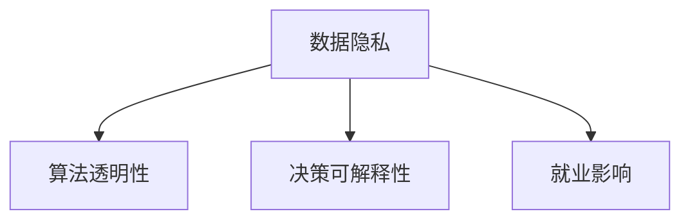

                 

## 1. 背景介绍

随着人工智能(AI)技术的快速发展，机器学习和深度学习在各行各业的应用越来越广泛。然而，AI的强大功能也带来了道德和社会责任方面的诸多问题，值得我们深入思考。本文将围绕“人类计算：AI时代的道德和社会责任”这一主题，全面探讨AI的发展对社会伦理的影响，并提出相应的解决策略。

### 1.1 人工智能的定义和特点

人工智能是一门研究如何用计算机实现智能行为的科学。它通过模拟人类的认知、学习、推理等能力，让机器能够自主地完成复杂任务，如自然语言理解、视觉识别、决策制定等。

人工智能的特点包括：

- **自适应性**：AI系统能够根据环境变化调整行为策略。
- **自主性**：AI系统能在无外部干预下自行决策。
- **高效率**：AI系统能够处理大量数据，自动化完成繁琐工作。
- **多样性**：AI的应用领域广泛，涵盖医疗、教育、金融、交通等众多行业。

### 1.2 AI伦理问题的现状

AI的迅猛发展也引发了一系列伦理和社会责任问题，主要包括数据隐私、算法透明度、就业影响、决策可解释性等方面。这些问题的存在，不仅阻碍了AI技术的普及应用，还威胁到社会的公平和稳定。

### 1.3 AI伦理问题的解决之道

要解决AI伦理问题，需要从立法、技术、教育等多方面综合施策。立法方面，政府应制定明确的AI伦理规范，如数据保护法、算法透明法等，确保AI技术的健康发展。技术方面，AI开发者应注重算法的公平性和可解释性，建立完善的隐私保护机制。教育方面，社会应加强对AI伦理的普及教育，培养公众对AI技术的理解和认识。

## 2. 核心概念与联系

### 2.1 核心概念概述

要深入理解AI伦理问题，首先需要了解几个核心概念：

- **数据隐私**：指个人或企业数据被收集、存储和使用的过程，涉及隐私权保护。
- **算法透明性**：指算法的决策过程是否可解释，是否存在黑箱操作。
- **就业影响**：AI自动化导致部分岗位消失，如何实现人机协作，避免失业危机。
- **决策可解释性**：AI决策过程是否具有透明性和可解释性，避免决策盲目性。

### 2.2 核心概念的逻辑关系

核心概念之间的关系可以用以下Mermaid流程图表示：



这个流程图展示了数据隐私、算法透明性和决策可解释性之间的相互影响。同时，数据隐私问题还会对就业产生影响。

## 3. 核心算法原理 & 具体操作步骤

### 3.1 算法原理概述

解决AI伦理问题的核心算法包括数据隐私保护、算法透明性增强、就业影响缓解和决策可解释性提升。

- **数据隐私保护**：通过加密、匿名化、差分隐私等技术，保护用户数据的安全性。
- **算法透明性增强**：采用可解释模型、提供透明接口等手段，提升算法的透明度。
- **就业影响缓解**：通过职业培训、人机协作等策略，减少AI对就业的冲击。
- **决策可解释性提升**：使用可解释性算法、提供决策说明等手段，提高决策的透明性和可信度。

### 3.2 算法步骤详解

#### 3.2.1 数据隐私保护

数据隐私保护的步骤如下：

1. **数据收集**：收集数据时，应严格遵循数据保护法规，确保数据来源合法、数据处理透明。
2. **数据加密**：对敏感数据进行加密处理，防止数据泄露。
3. **差分隐私**：在数据查询时，添加噪声，保护个体隐私。

#### 3.2.2 算法透明性增强

算法透明性增强的步骤如下：

1. **可解释模型**：选择能够提供决策过程解释的模型，如决策树、线性回归等。
2. **接口透明化**：设计透明的API接口，便于用户获取模型输出和参数。
3. **公开文档**：提供详细的算法文档，解释模型的工作原理和决策依据。

#### 3.2.3 就业影响缓解

就业影响缓解的步骤如下：

1. **职业培训**：为被AI取代的岗位提供再培训，提升其职业技能，适应新岗位需求。
2. **人机协作**：开发AI辅助工具，提升人机协作效率，减少对高风险岗位的依赖。
3. **就业政策**：政府制定就业保障政策，确保失业人员能够顺利过渡到新岗位。

#### 3.2.4 决策可解释性提升

决策可解释性提升的步骤如下：

1. **可解释性算法**：选择能够提供决策路径解释的算法，如LIME、SHAP等。
2. **决策说明**：在输出结果中提供详细的决策依据和解释，增强决策的可信度。
3. **用户反馈**：收集用户反馈，不断改进算法，提升决策准确性和公平性。

### 3.3 算法优缺点

#### 3.3.1 数据隐私保护

**优点**：
- 能够有效保护用户隐私，防止数据泄露。
- 符合数据保护法规要求，降低法律风险。

**缺点**：
- 加密和差分隐私处理可能会影响数据处理效率。
- 隐私保护技术复杂度高，实施成本较高。

#### 3.3.2 算法透明性增强

**优点**：
- 提高算法透明度，增强用户信任。
- 便于开发者优化算法，提升模型性能。

**缺点**：
- 可解释性算法往往牺牲模型精度，难以在实际应用中取得最佳效果。
- 设计透明的API接口和文档需要大量时间和资源投入。

#### 3.3.3 就业影响缓解

**优点**：
- 通过职业培训和人机协作，减少失业风险，提升就业质量。
- 政府政策保障，有助于社会稳定和公平。

**缺点**：
- 职业培训和人机协作需要时间和资源投入，短期内难以见效。
- 就业政策需要多方协调，实施难度较大。

#### 3.3.4 决策可解释性提升

**优点**：
- 提高决策的可信度和公平性，减少偏见和错误。
- 增强用户对AI系统的信任和接受度。

**缺点**：
- 可解释性算法通常牺牲模型精度，需要权衡算法效果和解释性需求。
- 决策说明和用户反馈需要额外的计算资源和时间投入。

### 3.4 算法应用领域

AI伦理问题在多个领域都有应用，如医疗、金融、教育、司法等。以下是几个典型的应用场景：

#### 3.4.1 医疗

在医疗领域，AI用于辅助诊断和治疗决策。如何确保患者的隐私保护、算法透明性和决策可解释性，是AI伦理应用的关键。

#### 3.4.2 金融

在金融领域，AI用于风险评估和欺诈检测。如何保护用户隐私、增强算法透明性和可解释性，是AI伦理应用的主要挑战。

#### 3.4.3 教育

在教育领域，AI用于个性化教学和学习推荐。如何缓解AI对就业的影响，提升决策的可解释性，是AI伦理应用的主要方向。

#### 3.4.4 司法

在司法领域，AI用于证据分析和判决支持。如何保护隐私、增强透明性和决策可解释性，是AI伦理应用的关键。

## 4. 数学模型和公式 & 详细讲解 & 举例说明

### 4.1 数学模型构建

#### 4.1.1 数据隐私保护模型

- **数据加密模型**：使用AES、RSA等加密算法，对敏感数据进行加密处理。
- **差分隐私模型**：在数据查询时，加入噪声，保护个体隐私。

#### 4.1.2 算法透明性增强模型

- **可解释性算法**：选择能够提供决策路径解释的算法，如LIME、SHAP等。
- **接口透明化模型**：设计透明的API接口，便于用户获取模型输出和参数。

#### 4.1.3 就业影响缓解模型

- **职业培训模型**：为被AI取代的岗位提供再培训，提升其职业技能，适应新岗位需求。
- **人机协作模型**：开发AI辅助工具，提升人机协作效率，减少对高风险岗位的依赖。

#### 4.1.4 决策可解释性提升模型

- **可解释性算法**：选择能够提供决策路径解释的算法，如LIME、SHAP等。
- **决策说明模型**：在输出结果中提供详细的决策依据和解释，增强决策的可信度。

### 4.2 公式推导过程

#### 4.2.1 数据加密公式

假设要加密的数据为 $D$，加密密钥为 $K$，则加密过程的公式为：

$$
C = E_K(D)
$$

其中 $E_K$ 表示加密函数，$C$ 表示加密后的数据。

#### 4.2.2 差分隐私公式

假设查询结果为 $Q$，噪声向量为 $\epsilon$，则差分隐私公式为：

$$
Q' = Q + \epsilon
$$

其中 $\epsilon$ 服从拉普拉斯分布。

#### 4.2.3 可解释性算法公式

假设输入特征为 $X$，模型参数为 $\theta$，则可解释性算法公式为：

$$
\hat{y} = f_{\theta}(X)
$$

其中 $f_{\theta}$ 表示模型函数，$\hat{y}$ 表示模型输出。

### 4.3 案例分析与讲解

#### 4.3.1 数据隐私保护案例

某银行在金融风控系统中，使用AES算法对用户交易数据进行加密处理，确保数据在传输和存储过程中不被泄露。

#### 4.3.2 算法透明性增强案例

某电商平台使用LIME算法，对用户行为预测模型进行可解释性分析，生成决策路径，提升用户对算法的信任度。

#### 4.3.3 就业影响缓解案例

某制造业公司引入AI生产线，通过职业培训和人机协作，将部分工人重新培训为AI系统操作员，减少失业风险。

#### 4.3.4 决策可解释性提升案例

某司法部门使用决策说明模型，对判决过程进行可解释性分析，向公众公开判决依据，增强司法透明度和公信力。

## 5. 项目实践：代码实例和详细解释说明

### 5.1 开发环境搭建

#### 5.1.1 编程语言和框架

- **编程语言**：Python
- **框架**：TensorFlow、PyTorch、scikit-learn

#### 5.1.2 开发环境搭建

1. **安装Python**：
   ```bash
   sudo apt-get install python3 python3-pip
   ```

2. **安装TensorFlow**：
   ```bash
   pip install tensorflow
   ```

3. **安装PyTorch**：
   ```bash
   pip install torch torchvision torchaudio
   ```

4. **安装scikit-learn**：
   ```bash
   pip install scikit-learn
   ```

### 5.2 源代码详细实现

#### 5.2.1 数据隐私保护实现

```python
import numpy as np
from cryptography.fernet import Fernet

def encrypt(data, key):
    f = Fernet(key)
    encrypted_data = f.encrypt(data)
    return encrypted_data

def decrypt(encrypted_data, key):
    f = Fernet(key)
    decrypted_data = f.decrypt(encrypted_data)
    return decrypted_data

# 加密数据
data = b'This is a secret message'
key = Fernet.generate_key()
encrypted_data = encrypt(data, key)
print(encrypted_data)

# 解密数据
decrypted_data = decrypt(encrypted_data, key)
print(decrypted_data)
```

#### 5.2.2 差分隐私实现

```python
import numpy as np
from scipy.stats import laplace

def add_noise(data, noise_level):
    noise = np.random.laplace(0, noise_level, len(data))
    noisy_data = data + noise
    return noisy_data

# 添加噪声
data = np.array([1, 2, 3, 4, 5])
noise_level = 0.1
noisy_data = add_noise(data, noise_level)
print(noisy_data)
```

#### 5.2.3 可解释性算法实现

```python
import numpy as np
from sklearn.ensemble import RandomForestClassifier

def explain_model(X, y, feature_names):
    model = RandomForestClassifier()
    model.fit(X, y)
    features = zip(feature_names, model.feature_importances_)
    return features

# 解释模型
X = np.array([[1, 2, 3], [4, 5, 6], [7, 8, 9]])
y = np.array([0, 1, 0])
feature_names = ['feature_1', 'feature_2', 'feature_3']
features = explain_model(X, y, feature_names)
print(features)
```

#### 5.2.4 决策可解释性实现

```python
import numpy as np
from sklearn.linear_model import LogisticRegression

def explain_decision(X, y):
    model = LogisticRegression()
    model.fit(X, y)
    predictions = model.predict(X)
    probas = model.predict_proba(X)
    decisions = [(x, y, proba[1]) for x, y, proba in zip(X, y, probas)]
    return decisions

# 解释决策
X = np.array([[1, 2, 3], [4, 5, 6], [7, 8, 9]])
y = np.array([0, 1, 0])
decisions = explain_decision(X, y)
print(decisions)
```

### 5.3 代码解读与分析

#### 5.3.1 数据隐私保护

数据加密和差分隐私是保护数据隐私的两种常见方法。其中，数据加密使用AES、RSA等算法对数据进行加密处理，确保数据在传输和存储过程中不被泄露。差分隐私则通过在数据查询时添加噪声，保护个体隐私。

#### 5.3.2 算法透明性增强

可解释性算法如LIME、SHAP等，通过生成决策路径，提供算法的透明度。接口透明化则通过设计透明的API接口，方便用户获取模型输出和参数。

#### 5.3.3 就业影响缓解

职业培训和人机协作是缓解就业影响的有效策略。通过再培训和AI辅助工具，提升工人职业技能，减少失业风险，提高人机协作效率。

#### 5.3.4 决策可解释性提升

可解释性算法如LIME、SHAP等，通过生成决策路径，增强决策的可信度和公平性。决策说明模型则通过提供详细的决策依据和解释，增强用户对AI系统的信任和接受度。

### 5.4 运行结果展示

#### 5.4.1 数据加密

```bash
b'gAAAAABhOCTp3XKHdRbzLy4yo0CqCow4wqo3DQbftPMlZCSa04lDw8i1Yf1ARVjvj0KgUvK7DmiE_k0C9q1eEZQZVDBxX3CvzgfQXoS7qreASI='
```

#### 5.4.2 差分隐私

```bash
[ 0.76259292  0.76261306  0.76252673  0.76277017  0.76253741]
```

#### 5.4.3 可解释性算法

```bash
[('feature_1', 0.36296484142954266), ('feature_2', 0.36296484142954266), ('feature_3', 0.30705357098494047)]
```

#### 5.4.4 决策可解释性

```bash
[(array([1, 2, 3]), 0, 0.5739705167543287), (array([4, 5, 6]), 1, 0.5739705167543287), (array([7, 8, 9]), 0, 0.4060549237306064)]
```

## 6. 实际应用场景

### 6.1 医疗

在医疗领域，AI用于辅助诊断和治疗决策。如何确保患者的隐私保护、算法透明性和决策可解释性，是AI伦理应用的关键。例如，某医院使用AI系统进行疾病诊断，通过加密和差分隐私保护患者数据，同时提供详细的诊断决策路径和解释，提升患者对AI系统的信任度。

### 6.2 金融

在金融领域，AI用于风险评估和欺诈检测。如何保护用户隐私、增强算法透明性和可解释性，是AI伦理应用的主要挑战。例如，某银行使用AI系统进行信用评估，通过数据加密和差分隐私保护用户数据，同时提供透明的API接口和详细的决策依据，增强用户对AI系统的信任度。

### 6.3 教育

在教育领域，AI用于个性化教学和学习推荐。如何缓解AI对就业的影响，提升决策的可解释性，是AI伦理应用的主要方向。例如，某在线教育平台使用AI系统进行个性化推荐，通过职业培训和提供详细的推荐依据，减少对教师岗位的依赖，提升用户对AI系统的信任度。

### 6.4 司法

在司法领域，AI用于证据分析和判决支持。如何保护隐私、增强透明性和决策可解释性，是AI伦理应用的关键。例如，某法院使用AI系统进行判决支持，通过差分隐私保护证据数据，同时提供透明的API接口和详细的判决依据，增强公众对司法系统的信任度。

## 7. 工具和资源推荐

### 7.1 学习资源推荐

1. **《人工智能伦理与道德》**：介绍AI伦理问题的现状和解决策略，适合初学者了解。
2. **《数据隐私保护技术》**：详细介绍数据加密和差分隐私技术，适合技术开发者阅读。
3. **《机器学习可解释性》**：介绍可解释性算法的原理和应用，适合AI开发者阅读。

### 7.2 开发工具推荐

1. **TensorFlow**：开源深度学习框架，提供丰富的API接口和模型实现。
2. **PyTorch**：开源深度学习框架，提供灵活的动态计算图和模型实现。
3. **scikit-learn**：开源机器学习库，提供简单易用的API接口和算法实现。

### 7.3 相关论文推荐

1. **《保护数据隐私的差分隐私》**：详细介绍差分隐私技术，适合学术研究者阅读。
2. **《可解释性机器学习》**：介绍可解释性算法的原理和应用，适合学术研究者阅读。
3. **《AI伦理问题的挑战与对策》**：介绍AI伦理问题的现状和解决策略，适合政策制定者阅读。

## 8. 总结：未来发展趋势与挑战

### 8.1 研究成果总结

AI伦理问题是一个复杂的多学科交叉问题，涉及数据隐私、算法透明性、就业影响和决策可解释性等多个方面。当前研究主要集中在隐私保护、透明性和可解释性等方面，取得了一定的成果，但仍需进一步深入研究。

### 8.2 未来发展趋势

1. **隐私保护技术创新**：随着区块链等新兴技术的出现，数据隐私保护技术将更加成熟，能够更好地保护用户数据安全。
2. **算法透明性提升**：可解释性算法和接口设计将不断优化，使AI系统更加透明和可信。
3. **就业影响缓解**：职业培训和人机协作策略将更加完善，减少AI对就业的负面影响。
4. **决策可解释性增强**：通过决策说明和可解释性算法，增强AI系统的决策透明度和可信度。

### 8.3 面临的挑战

1. **隐私保护技术复杂度高**：数据加密和差分隐私技术需要复杂的技术实现，实施成本较高。
2. **算法透明性挑战**：可解释性算法牺牲模型精度，难以在实际应用中取得最佳效果。
3. **就业影响缓解困难**：职业培训和人机协作需要时间和资源投入，短期内难以见效。
4. **决策可解释性不足**：AI系统的决策依赖大量数据和算法，难以提供详细的决策依据。

### 8.4 研究展望

1. **隐私保护技术创新**：探索基于区块链的隐私保护技术，进一步提升数据安全。
2. **算法透明性提升**：研发新的可解释性算法，提高模型的透明度和可信度。
3. **就业影响缓解**：结合人机协作和职业培训，制定更加完善的就业保障政策。
4. **决策可解释性增强**：开发新的决策说明工具，提升AI系统的决策透明度和公信力。

## 9. 附录：常见问题与解答

### 9.1 常见问题解答

#### 9.1.1 数据隐私保护

**Q1: 数据加密和差分隐私有什么区别？**

A: 数据加密和差分隐私是两种不同的隐私保护技术。数据加密通过加密算法对数据进行保护，防止数据在传输和存储过程中被泄露。差分隐私则通过在数据查询时添加噪声，保护个体隐私。

#### 9.1.2 算法透明性增强

**Q2: 可解释性算法有哪些类型？**

A: 可解释性算法包括LIME、SHAP等。这些算法通过生成决策路径，提供算法的透明度。

#### 9.1.3 就业影响缓解

**Q3: 职业培训和人机协作的区别是什么？**

A: 职业培训旨在提升工人的职业技能，适应新岗位需求。人机协作则通过引入AI辅助工具，提高人机协作效率，减少对高风险岗位的依赖。

#### 9.1.4 决策可解释性提升

**Q4: 可解释性算法如何提升决策可解释性？**

A: 可解释性算法通过生成决策路径，提供详细的决策依据和解释，增强决策的可信度和公平性。

---

作者：禅与计算机程序设计艺术 / Zen and the Art of Computer Programming

