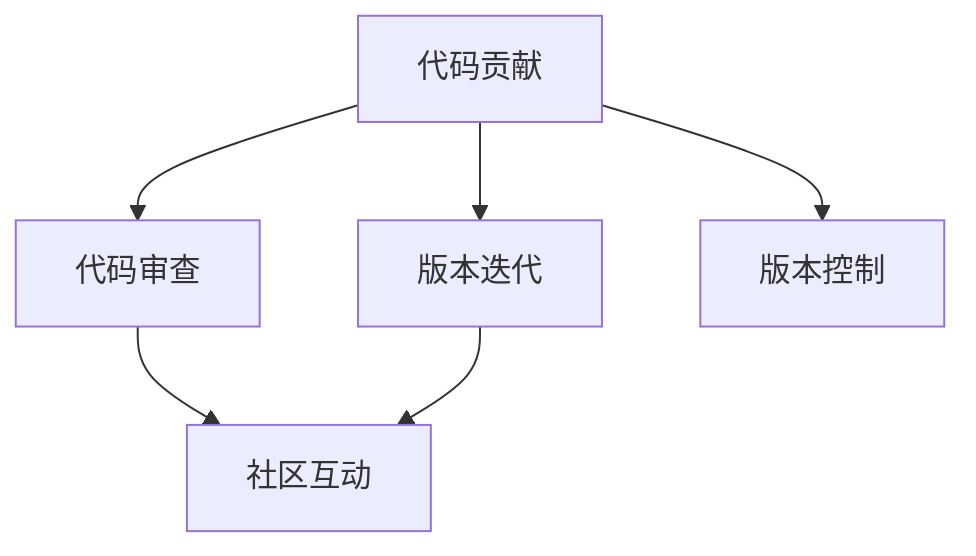

                 

# 从代码贡献者到开源项目维护者

## 1. 背景介绍

### 1.1 问题由来
随着开源社区的不断壮大和普及，越来越多的开发者不再满足于独立编写代码，而是转向开源项目，以合作、共享和共同进步的方式推动技术的发展。然而，对于许多刚入门的代码贡献者而言，从单一的代码编写转向项目的维护和优化，无疑是一个巨大的挑战。本文旨在为开源项目的代码贡献者提供从初级到高级的全方位指导，帮助他们成长为项目维护者。

### 1.2 问题核心关键点
开源项目维护的核心在于代码质量、社区互动和版本迭代。一个优秀的开源项目不仅需要高标准的代码贡献，还需要高效的代码审查、良好的社区氛围以及稳定的版本发布机制。代码贡献者要想成为项目维护者，需要在以上各方面不断提升自己的能力。

## 2. 核心概念与联系

### 2.1 核心概念概述

为了更好地理解开源项目的维护过程，本节将介绍几个关键概念：

- **代码贡献(Coding Contribution)**：开发者通过提交代码或修复漏洞等方式，对开源项目进行贡献。
- **代码审查(Code Review)**：项目维护者或其他经验丰富的开发者，对代码贡献者的提交进行审核，以确保代码质量符合项目标准。
- **版本迭代(Version Iteration)**：定期发布软件更新，修复已知问题，添加新功能和改进现有功能。
- **社区互动(Community Interaction)**：开发者之间、开发者与项目维护者之间的互动交流，包括讨论、反馈、培训等。
- **版本控制(Version Control)**：如Git，用于管理代码的历史记录、分支管理、合并策略等。

这些核心概念之间的逻辑关系可以通过以下Mermaid流程图来展示：



这个流程图展示了代码贡献者到项目维护者的主要活动路径：

1. 代码贡献者首先提交代码，由代码审查环节进行审核。
2. 审核通过的代码进入版本迭代环节，最终发布新版本。
3. 在此过程中，社区互动贯穿始终，促进开发者之间的沟通和合作。
4. 版本控制作为基础设施，确保代码的版本管理有序进行。

## 3. 核心算法原理 & 具体操作步骤
### 3.1 算法原理概述

开源项目的维护工作，本质上是一个持续改进和优化的过程。其核心思想是：通过不断地收集社区反馈、进行代码审查和迭代发布，确保项目的代码质量和用户体验。这一过程通常包括以下几个关键步骤：

- **代码提交**：开发者将代码提交到版本控制系统中，触发代码审查流程。
- **代码审查**：项目维护者对提交的代码进行审查，识别潜在问题并提出改进建议。
- **代码合并**：提交的代码通过审查后，将其合并到主分支，进入版本迭代环节。
- **版本发布**：定期发布新版本，发布前进行全面的测试和修复，确保稳定性和可靠性。
- **社区互动**：积极参与社区讨论，倾听用户需求，适时调整项目方向。

### 3.2 算法步骤详解

以下详细介绍开源项目维护的关键步骤和具体操作步骤：

#### 3.2.1 代码提交

**步骤1**：选择适合的开源项目和分支
- 找到与个人技术栈和兴趣相符的项目。
- 在项目中创建一个新的分支，用于提交代码。

**步骤2**：编写和测试代码
- 编写高质量的代码，遵循项目风格和规范。
- 在本地进行单元测试，确保代码正确无误。

**步骤3**：提交代码
- 在Git上进行提交，并附上简短的提交说明。
- 如果有必要，可以在提交中@相关开发者进行通知。

#### 3.2.2 代码审查

**步骤1**：选择审查者
- 根据代码类型和复杂度选择合适的审查者。
- 如果项目有指定的审查流程，按照流程进行。

**步骤2**：编写详细审查反馈
- 仔细阅读代码，识别潜在的问题和改进建议。
- 使用适当的工具进行代码审查，如GitHub的PR审查功能。

**步骤3**：提供建设性意见
- 审查时保持礼貌和客观，提出具体的改进建议。
- 讨论代码的实现方式和可能的优化方案。

#### 3.2.3 代码合并

**步骤1**：解决审查反馈
- 根据审查者的建议修改代码，并提交修改版本。
- 确保修改后的代码通过了所有测试。

**步骤2**：合并代码
- 在Git上进行合并请求，将修改后的代码提交到主分支。
- 等待项目维护者审查并决定是否合并。

#### 3.2.4 版本发布

**步骤1**：准备发布
- 在发布前进行全面的功能测试、性能测试和安全性测试。
- 确保所有已知问题已经修复，新功能已经稳定。

**步骤2**：发布版本
- 使用CI/CD工具自动化发布流程。
- 记录发布日志，包括发布内容、版本号、发布日期等信息。

**步骤3**：后续维护
- 跟踪发布后的反馈和问题，及时修复和更新。
- 收集用户意见，评估新功能的可用性和用户满意度。

#### 3.2.5 社区互动

**步骤1**：参与社区讨论
- 在项目官方论坛、邮件列表、社交媒体等平台积极参与讨论。
- 及时回复社区成员的问题和建议，促进社区活跃度。

**步骤2**：组织和参与活动
- 参与项目组织的活动，如技术讨论、黑客松等。
- 主动提出项目改进建议，参与项目的决策过程。

**步骤3**：培养新手
- 帮助新人熟悉项目流程，解答他们的疑问。
- 为新成员提供指导和培训，提高团队整体能力。

### 3.3 算法优缺点

开源项目维护的优点包括：
- 提高代码质量和项目稳定性。
- 增强社区凝聚力和开发者归属感。
- 积累技术和项目管理经验，提升自身能力。

同时，也存在一些局限：
- 需要投入大量时间和精力。
- 管理复杂，需要协调多方面资源。
- 可能面临社区内部的利益冲突和分歧。

### 3.4 算法应用领域

开源项目维护的应用领域非常广泛，包括但不限于以下几类：

- **开源软件项目**：如Linux Kernel、Apache HTTP Server等，需要定期发布新版本的软件更新，修复已知问题，添加新功能。
- **开源工具和框架**：如Docker、Kubernetes等，需要持续维护和优化，提升用户体验和性能。
- **开源社区和平台**：如GitHub、Stack Overflow等，需要管理社区互动，优化用户界面和功能。
- **开源科学研究和教育**：如OpenAI、MIT OpenCourseWare等，需要不断发布研究成果和教学资源，推动科学和技术教育的发展。

## 4. 数学模型和公式 & 详细讲解 & 举例说明

### 4.1 数学模型构建

在开源项目维护中，我们通常使用Git进行版本控制，使用CI/CD工具进行自动化发布和测试。以下是一个简单的数学模型构建过程：

设项目的总代码数量为$N$，每个贡献者提交的代码数量为$n_i$，总提交次数为$T$。假设每个贡献者的代码质量服从独立同分布的泊松分布，期望值为$\lambda_i$。则代码审查的质量期望值为：

$$
E(Q) = \sum_{i=1}^m \lambda_i \times P(r>0)
$$

其中，$P(r>0)$表示代码审查失败的概率，即未能通过审查的概率。

### 4.2 公式推导过程

对于泊松分布$P(x; \lambda) = \frac{\lambda^x e^{-\lambda}}{x!}$，设审查失败的期望值为$E(\bar{r})$，则有：

$$
E(\bar{r}) = \sum_{i=1}^m \lambda_i (1 - P(r>0))
$$

根据泊松分布的性质，$P(r>0) = 1 - \sum_{i=0}^{\infty} P(r=i)$，其中$P(r=i)$为代码审查通过$i$次失败的概率。

因此，我们有：

$$
E(Q) = \sum_{i=1}^m \lambda_i \times (1 - \sum_{i=0}^{\infty} P(r=i))
$$

通过进一步计算，可以得到代码审查质量的概率模型和期望值公式。

### 4.3 案例分析与讲解

假设一个开源项目有5个贡献者，每个贡献者的代码质量期望值均为$\lambda_i = 0.02$，代码审查失败的期望值为$E(\bar{r}) = 0.1$。则项目的代码审查质量期望值$E(Q)$为：

$$
E(Q) = 5 \times 0.02 \times (1 - 0.1) = 0.08
$$

这意味着，在5个贡献者的代码中，有8%的概率未能通过审查，平均每个代码审查失败的期望值为1.2次。

## 5. 项目实践：代码实例和详细解释说明

### 5.1 开发环境搭建

在进行开源项目维护之前，我们需要准备好开发环境。以下是一些常用的开发工具和资源：

- **IDE**：如Visual Studio Code、Atom、PyCharm等，用于编写和调试代码。
- **版本控制**：如Git，用于管理代码的版本和分支。
- **CI/CD工具**：如Jenkins、Travis CI、GitHub Actions等，用于自动化发布和测试。
- **文档和规范**：如GitHub的Wiki功能，用于记录项目文档和编码规范。
- **社区平台**：如Slack、Discord等，用于项目内部和外部交流。

### 5.2 源代码详细实现

下面以一个简单的开源项目为例，展示代码提交和代码审查的详细实现过程。

首先，创建一个新的Git分支：

```bash
git checkout -b fix-issue-123
```

然后，编写并提交代码：

```bash
nano fix-issue-123.py
git add fix-issue-123.py
git commit -m "Fix issue #123"
```

提交完成后，选择适当的审查者进行代码审查：

```bash
git push origin fix-issue-123:master
```

审查者可以在GitHub上查看PR，并进行评论和修改：

```bash
git fetch origin master:fix-issue-123
git merge fix-issue-123
git push origin fix-issue-123
```

### 5.3 代码解读与分析

在代码提交和审查过程中，我们需要注意以下几点：

- **提交说明**：清晰的提交说明有助于代码审查者理解提交内容，避免误解和重复劳动。
- **代码风格**：遵循项目编码规范，确保代码的可读性和可维护性。
- **测试覆盖**：提交前进行充分的测试，确保代码质量。
- **文档更新**：在修改代码时，及时更新相关的文档和注释。

### 5.4 运行结果展示

在代码提交和审查完成后，我们可以通过以下步骤展示运行结果：

- **单元测试**：运行所有单元测试，确保新代码功能正常。
- **代码审查**：展示审查结果，包括审查者评论和修改意见。
- **发布日志**：记录新版本的发布日志，包括发布内容、版本号、发布日期等。

## 6. 实际应用场景

### 6.1 开源软件维护

开源软件维护是一个典型的开源项目维护场景。例如，Linux Kernel项目中，维护者需要定期发布新版本的内核，修复已知问题，添加新功能。通过代码贡献者和维护者的共同努力，Linux Kernel项目在稳定性、性能和安全性方面取得了显著的进展。

### 6.2 开源工具和框架

开源工具和框架维护需要关注用户体验和性能优化。例如，Docker项目中，维护者不断改进容器引擎的功能和性能，提供更好的用户体验。通过代码贡献者和维护者的合作，Docker成为业界领先的容器化解决方案。

### 6.3 开源社区和平台

开源社区和平台维护需要关注社区互动和用户体验。例如，GitHub项目中，维护者不断优化GitHub的界面和功能，提升社区成员的使用体验。通过代码贡献者和维护者的共同努力，GitHub成为全球最大的代码托管平台。

### 6.4 未来应用展望

未来，开源项目维护将更加依赖于机器学习和自动化工具。例如，通过机器学习算法，可以对代码质量进行自动化评估和分类，提高审查效率和准确性。通过自动化测试工具，可以自动执行回归测试和性能测试，保证软件质量。

## 7. 工具和资源推荐

### 7.1 学习资源推荐

为了帮助开发者提升开源项目维护的能力，这里推荐一些优质的学习资源：

- **《开源项目维护指南》**：系统介绍了开源项目维护的各个环节，包括代码贡献、代码审查、版本迭代和社区互动等。
- **GitHub官方文档**：提供了GitHub平台的详细使用指南，包括版本控制、代码审查、PR流程等。
- **《CI/CD最佳实践》**：介绍了CI/CD工具的使用和最佳实践，包括自动化发布、测试、部署等。
- **《开源社区管理》**：介绍了开源社区的组织和管理方法，包括社区运营、用户互动、活动策划等。

通过对这些资源的学习实践，相信你一定能够快速掌握开源项目维护的技巧，并应用于实际项目中。

### 7.2 开发工具推荐

以下是几款用于开源项目维护的常用工具：

- **GitHub**：全球最大的代码托管平台，提供了版本控制、代码审查、PR流程等丰富的功能。
- **Jenkins**：开源的CI/CD工具，支持多种插件和自动化发布流程。
- **Travis CI**：开源的CI/CD工具，提供了简单、灵活的自动化测试和发布功能。
- **Slack**：全球领先的即时通讯工具，用于项目内部和外部的交流和讨论。
- **Discord**：流行的团队沟通工具，支持语音、视频、文本等多种交流方式。

合理利用这些工具，可以显著提升开源项目维护的效率和质量，加快创新迭代的步伐。

### 7.3 相关论文推荐

开源项目维护的研究方向广泛，涉及代码质量评估、自动化测试、版本控制等多个方面。以下是几篇奠基性的相关论文，推荐阅读：

- **《开源项目维护的挑战与对策》**：分析了开源项目维护的常见问题和解决方案，提供了系统化的维护指南。
- **《自动化测试在开源项目中的应用》**：介绍了自动化测试工具在开源项目中的应用和最佳实践，提高了软件质量和开发效率。
- **《开源社区管理策略》**：研究了开源社区的组织和管理方法，提供了实用的社区运营策略。

这些论文代表了开源项目维护技术的发展脉络，通过学习这些前沿成果，可以帮助研究者把握学科前进方向，激发更多的创新灵感。

## 8. 总结：未来发展趋势与挑战

### 8.1 总结

本文对开源项目维护工作进行了全面系统的介绍。首先阐述了开源项目维护的核心概念和关键步骤，明确了代码贡献者和项目维护者在不同阶段的任务和责任。其次，从原理到实践，详细讲解了开源项目维护的数学模型和操作步骤，给出了具体代码实例。同时，本文还探讨了开源项目维护在多个领域的实际应用，展示了其广泛的应用前景。最后，推荐了多种学习资源、开发工具和相关论文，帮助开发者系统掌握开源项目维护的精髓。

通过本文的系统梳理，可以看到，开源项目维护工作是一项系统工程，需要代码贡献者和项目维护者共同努力，通过不断的迭代和优化，才能保证项目的质量和稳定性。未来，随着开源社区的进一步发展和技术的不断进步，开源项目维护将面临更多的机遇和挑战，需要我们不断探索和创新。

### 8.2 未来发展趋势

展望未来，开源项目维护将呈现以下几个发展趋势：

1. **自动化和智能化**：通过引入机器学习和自动化工具，提高代码质量评估和自动化测试的效率和准确性。
2. **社区互动和参与**：通过加强社区互动，提高社区成员的参与度和归属感，促进项目发展。
3. **多领域和跨平台**：开源项目维护将从传统软件开发领域扩展到更多领域，如科学计算、人工智能等。
4. **开放标准和互操作性**：推动开源项目之间的互操作性，提升整个开源生态系统的协同效率。

这些趋势凸显了开源项目维护技术的广阔前景，为开源社区的发展提供了新的方向和动力。

### 8.3 面临的挑战

尽管开源项目维护技术已经取得了显著成就，但在迈向更加智能化、普适化应用的过程中，仍面临诸多挑战：

1. **代码质量不一致**：不同开发者提交的代码质量参差不齐，影响项目整体稳定性。
2. **社区分歧和利益冲突**：社区内部的分歧和利益冲突，可能导致项目发展方向不一致。
3. **资源限制和协调困难**：开源项目维护需要协调多方面的资源，可能导致资源限制和沟通困难。
4. **新老开发者交接**：新老开发者的交接可能导致项目断层，影响项目连续性。
5. **法律和伦理问题**：开源项目中的法律和伦理问题，需要引起足够的重视和谨慎处理。

这些挑战需要我们不断优化和改进开源项目维护的流程和工具，确保项目的长期稳定和健康发展。

### 8.4 研究展望

面对开源项目维护所面临的挑战，未来的研究需要在以下几个方面寻求新的突破：

1. **代码质量自动化评估**：开发更加智能化的代码质量评估工具，通过机器学习算法自动识别代码中的潜在问题和改进建议。
2. **社区互动智能化**：利用自然语言处理技术，对社区讨论进行分析和总结，引导社区成员进行更有意义的交流。
3. **多领域和跨平台协作**：推动开源项目之间的互操作性，实现跨平台、跨领域的协同开发和维护。
4. **开源社区治理**：研究开源社区的治理机制，制定合理的发展策略和规则，确保社区成员的权益和利益。
5. **法律和伦理合规**：建立开源项目的法律和伦理合规机制，确保项目的合法性和社会责任。

这些研究方向将为开源项目维护技术提供新的突破，推动开源社区的持续发展和创新。

## 9. 附录：常见问题与解答

**Q1：开源项目维护需要哪些关键技能？**

A: 开源项目维护需要以下关键技能：
- 编程语言和框架：熟练掌握多种编程语言和开源框架，如Python、JavaScript、Java等。
- 版本控制工具：熟悉Git等版本控制工具的使用。
- 代码审查技巧：掌握代码审查的标准和流程，能够提出建设性意见。
- 社区互动能力：具备良好的沟通能力，能够有效参与社区讨论。
- 问题解决能力：能够快速定位和解决问题，提升代码质量。

**Q2：如何处理开源项目中的代码冲突？**

A: 处理开源项目中的代码冲突，可以按照以下步骤进行：
- 识别冲突的代码部分。
- 与代码审查者讨论冲突原因和解决方案。
- 在Git上进行冲突解决和合并。
- 提交合并后的代码，等待代码审查。

**Q3：开源项目维护需要投入多少时间？**

A: 开源项目维护需要投入大量时间和精力，具体取决于项目的规模和复杂度。一般建议每周投入固定时间，保证项目的持续稳定发展。

**Q4：如何提升开源项目的社区活跃度？**

A: 提升开源项目的社区活跃度，可以采取以下措施：
- 积极回应社区成员的提问和反馈。
- 组织和参与社区活动，如技术讨论、黑客松等。
- 定期发布项目进展和成果，增强社区成员的归属感。
- 引入新成员，扩大社区规模和影响力。

**Q5：开源项目维护对个人发展有何好处？**

A: 开源项目维护对个人发展有以下好处：
- 提高编程能力和技术水平。
- 拓展视野和知识面，了解不同领域的技术和应用。
- 积累经验和项目管理能力，提升职业竞争力。
- 增强社区意识和责任感，促进个人成长和职业发展。

通过本文的系统梳理，可以看到，开源项目维护工作是一项系统工程，需要代码贡献者和项目维护者共同努力，通过不断的迭代和优化，才能保证项目的质量和稳定性。未来，随着开源社区的进一步发展和技术的不断进步，开源项目维护将面临更多的机遇和挑战，需要我们不断探索和创新。只有勇于创新、敢于突破，才能不断拓展开源项目维护的边界，为开源社区的持续发展和创新提供新的动力。

