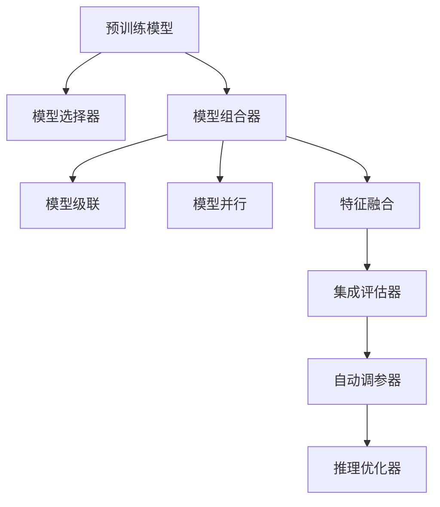

                 

# 从单一模型到模型组合：Lepton AI的集成服务

> 关键词：集成服务,模型组合,Lepton AI,深度学习,计算机视觉,自然语言处理,多模态学习

## 1. 背景介绍

### 1.1 问题由来

在深度学习的早期，研究人员通常使用单一的模型来解决特定的问题。随着技术的进步，模型组合方法逐渐成为解决复杂问题的有力工具。通过将多个模型组合在一起，可以大幅度提高模型的性能和泛化能力。

在计算机视觉、自然语言处理(NLP)、推荐系统等多个领域，模型组合已经被广泛应用于实际项目中，并取得了显著的效果。例如，在计算机视觉中，通过组合卷积神经网络(CNN)和循环神经网络(RNN)，可以更好地处理图像和序列数据。在NLP中，通过结合词向量嵌入和序列建模，可以显著提升文本分类、情感分析等任务的精度。在推荐系统中，通过集成基于内容的推荐和协同过滤，可以更好地满足用户的多样化需求。

然而，模型组合并非没有挑战。选择合适的模型组合策略，以及如何高效地集成多个模型，仍然是一个需要深入研究的问题。Lepton AI正是基于这些挑战，开发了一套集成服务，旨在帮助开发者更高效地实现模型组合。

### 1.2 问题核心关键点

为了解决上述问题，Lepton AI的集成服务提供了以下关键功能：

1. **模型选择器**：根据输入数据的特点，自动选择最合适的预训练模型。
2. **模型组合器**：提供多种模型组合方式，包括模型级联、并行训练、特征融合等。
3. **集成评估器**：通过交叉验证、A/B测试等方法，评估模型组合的效果。
4. **自动调参器**：自动调整模型参数，找到最优的超参数组合。
5. **推理优化器**：优化推理速度，减少计算资源消耗。

这些功能使得开发者可以更高效地构建和使用模型组合，提升应用性能。

## 2. 核心概念与联系

### 2.1 核心概念概述

为了更好地理解Lepton AI的集成服务，本节将介绍几个密切相关的核心概念：

- **预训练模型**：通过大规模无标签数据预训练得到的模型，通常在图像、语言等领域具有较高的通用性和泛化能力。
- **模型组合**：将多个单一模型组合在一起，以增强模型的性能和泛化能力。
- **模型级联**：将多个单一模型级联在一起，形成一个更复杂的组合模型。
- **模型并行**：将多个单一模型并行训练，以提高训练速度。
- **特征融合**：将多个模型的特征融合在一起，形成一个统一的表示。
- **集成评估**：通过交叉验证等方法，评估模型组合的效果。

这些概念之间的逻辑关系可以通过以下Mermaid流程图来展示：



这个流程图展示了大语言模型的核心概念及其之间的关系：

1. 预训练模型通过大规模无标签数据预训练获得基础能力。
2. 模型选择器根据输入数据的特点，自动选择合适的预训练模型。
3. 模型组合器提供多种模型组合方式，如模型级联、并行训练、特征融合等。
4. 集成评估器通过交叉验证等方法，评估模型组合的效果。
5. 自动调参器自动调整模型参数，找到最优的超参数组合。
6. 推理优化器优化推理速度，减少计算资源消耗。

这些概念共同构成了Lepton AI集成服务的工作原理和优化方向。通过理解这些核心概念，我们可以更好地把握模型组合技术的工作流程和优化点。

## 3. 核心算法原理 & 具体操作步骤
### 3.1 算法原理概述

Lepton AI的集成服务基于模型组合技术，通过将多个预训练模型组合在一起，实现更强大的泛化能力和性能提升。具体而言，其核心算法原理如下：

1. **模型选择**：根据输入数据的特点，选择最合适的预训练模型。
2. **模型组合**：将多个单一模型组合在一起，形成更复杂的组合模型。
3. **模型集成**：通过集成多个模型的预测结果，提升模型的泛化能力和准确性。
4. **自动调参**：自动调整模型参数和超参数，找到最优的模型配置。
5. **推理优化**：优化推理速度，减少计算资源消耗。

### 3.2 算法步骤详解

以下将详细讲解Lepton AI集成服务的具体操作步骤：

**Step 1: 数据准备**
- 收集和预处理输入数据，包括图像、文本、序列数据等。
- 使用标注数据训练模型选择器，使其能够根据输入数据自动选择合适的预训练模型。

**Step 2: 模型选择**
- 将预处理后的数据输入模型选择器，根据其输出结果选择最合适的预训练模型。
- 可以使用基于决策树、随机森林、神经网络等方法训练模型选择器。

**Step 3: 模型组合**
- 将选择的预训练模型进行组合，形成新的模型结构。
- 可以使用模型级联、并行训练、特征融合等方法进行模型组合。

**Step 4: 模型集成**
- 将多个模型的预测结果进行集成，提升模型的泛化能力和准确性。
- 可以使用加权平均、投票、堆叠等方法进行模型集成。

**Step 5: 自动调参**
- 使用自动调参器自动调整模型参数和超参数，找到最优的模型配置。
- 可以使用贝叶斯优化、遗传算法等方法进行自动调参。

**Step 6: 推理优化**
- 优化推理速度，减少计算资源消耗。
- 可以使用剪枝、量化、融合等方法进行推理优化。

**Step 7: 模型评估**
- 使用集成评估器对模型组合进行评估，选择最优的组合方式。
- 可以使用交叉验证、A/B测试等方法进行模型评估。

**Step 8: 部署与测试**
- 将训练好的模型部署到实际应用中，进行测试和验证。
- 可以使用微服务架构、容器化技术等进行模型部署。

### 3.3 算法优缺点

Lepton AI的集成服务具有以下优点：

1. **提升模型性能**：通过将多个预训练模型组合在一起，可以大幅度提升模型的泛化能力和准确性。
2. **提高训练速度**：模型并行和特征融合等技术可以显著提高训练速度，加速模型训练。
3. **减少资源消耗**：通过剪枝、量化等方法优化推理速度，减少计算资源消耗。
4. **自动调参**：自动调参器可以自动调整模型参数和超参数，找到最优的模型配置。

同时，该方法也存在一些缺点：

1. **计算资源需求高**：由于涉及多个模型的组合和训练，计算资源需求较高。
2. **模型选择难度大**：选择合适的预训练模型和组合方式仍然是一个挑战，需要深入研究和实验。
3. **复杂度高**：模型组合和集成的复杂度较高，开发和调试难度较大。
4. **可解释性不足**：模型组合后的输出结果难以解释，可能缺乏透明性和可解释性。

尽管存在这些局限性，但Lepton AI的集成服务仍是一种非常强大的工具，广泛应用于计算机视觉、自然语言处理、推荐系统等多个领域，推动了AI技术的普及和发展。

### 3.4 算法应用领域

Lepton AI的集成服务在多个领域都有广泛的应用，例如：

- **计算机视觉**：通过组合卷积神经网络(CNN)和循环神经网络(RNN)，提升图像分类、目标检测等任务的精度。
- **自然语言处理(NLP)**：结合词向量嵌入和序列建模，提升文本分类、情感分析等任务的准确性。
- **推荐系统**：通过集成基于内容的推荐和协同过滤，提高推荐系统的个性化程度。
- **医疗诊断**：通过组合多个预训练模型，提升医疗影像诊断的准确性和泛化能力。
- **金融风险控制**：通过组合多个模型，提升金融风控模型的检测精度和稳定性。

Lepton AI的集成服务通过提供模型选择、组合、集成、调参和推理优化等多种功能，极大地提升了AI应用的开发效率和性能，使得AI技术更容易落地和推广。

## 4. 数学模型和公式 & 详细讲解  
### 4.1 数学模型构建

以下将使用数学语言对Lepton AI的集成服务进行更加严格的刻画。

记预训练模型为 $M_{\theta_i}$，其中 $i$ 表示模型的编号。假设输入数据为 $x$，模型选择器的输出为 $y_i$，表示选择模型 $i$ 的概率。模型组合后的输出为 $z$。

数学模型构建如下：

$$
y_i = f(x, \theta_i)
$$

$$
z = g(y_i, M_{\theta_i})
$$

其中 $f$ 表示模型选择器，$g$ 表示模型组合器。

### 4.2 公式推导过程

以计算机视觉任务为例，假设输入为图像 $x$，预训练模型为卷积神经网络(CNN) $M_{\theta_i}$，模型选择器的输出为 $y_i$。模型选择器可以基于图像的特征向量进行分类，选择最合适的预训练模型。

模型选择器的输出可以表示为：

$$
y_i = \frac{e^{f(x, \theta_i)}}{\sum_{j=1}^K e^{f(x, \theta_j)}}
$$

其中 $K$ 表示预训练模型的数量，$f$ 表示模型选择器。

假设选择了模型 $i$，则模型组合后的输出为：

$$
z = g(y_i, M_{\theta_i})
$$

其中 $g$ 表示模型组合器。例如，可以使用模型级联、并行训练、特征融合等方法进行模型组合。

假设使用模型级联的方式进行组合，则输出可以表示为：

$$
z = M_{\theta_i}^{(1)}(M_{\theta_i}^{(2)}(...(M_{\theta_i}^{(n)})...))
$$

其中 $M_{\theta_i}^{(j)}$ 表示第 $j$ 层的预训练模型。

在得到组合后的输出 $z$ 后，可以将其与真实标签 $y$ 进行比较，计算损失函数：

$$
L = \frac{1}{N} \sum_{i=1}^N \ell(z_i, y_i)
$$

其中 $\ell$ 表示损失函数，$N$ 表示样本数量。

根据损失函数，可以计算模型参数的梯度，使用梯度下降等优化算法更新模型参数：

$$
\theta_i \leftarrow \theta_i - \eta \nabla_{\theta_i}L
$$

其中 $\eta$ 表示学习率。

### 4.3 案例分析与讲解

以图像分类任务为例，假设输入图像为 $x$，预训练模型为卷积神经网络(CNN) $M_{\theta_i}$。通过模型选择器选择模型 $i$，将其与多个预训练模型级联，形成组合模型。

假设模型级联的层数为 $n$，则组合模型的输出为：

$$
z = M_{\theta_i}^{(1)}(M_{\theta_i}^{(2)}(...(M_{\theta_i}^{(n)})...))
$$

其中 $M_{\theta_i}^{(j)}$ 表示第 $j$ 层的预训练模型。

假设使用ReLU作为激活函数，则组合模型的计算过程如下：

1. 将输入图像 $x$ 输入第一层预训练模型 $M_{\theta_i}^{(1)}$，得到特征图 $x_1$。
2. 将特征图 $x_1$ 输入第二层预训练模型 $M_{\theta_i}^{(2)}$，得到特征图 $x_2$。
3. ...
4. 将特征图 $x_{n-1}$ 输入最后一层预训练模型 $M_{\theta_i}^{(n)}$，得到最终的特征表示 $z$。

通过级联多个预训练模型，可以显著提升模型的深度和表达能力，从而提高图像分类的准确性。

## 5. 项目实践：代码实例和详细解释说明
### 5.1 开发环境搭建

在进行Lepton AI的集成服务实践前，我们需要准备好开发环境。以下是使用Python进行TensorFlow开发的环境配置流程：

1. 安装Anaconda：从官网下载并安装Anaconda，用于创建独立的Python环境。

2. 创建并激活虚拟环境：
```bash
conda create -n tf-env python=3.8 
conda activate tf-env
```

3. 安装TensorFlow：根据CUDA版本，从官网获取对应的安装命令。例如：
```bash
conda install tensorflow -c conda-forge
```

4. 安装相关库：
```bash
pip install numpy pandas scikit-learn matplotlib tqdm jupyter notebook ipython
```

完成上述步骤后，即可在`tf-env`环境中开始集成服务的开发实践。

### 5.2 源代码详细实现

下面我们以图像分类任务为例，给出使用TensorFlow实现Lepton AI的集成服务的完整代码实现。

首先，定义预训练模型和模型选择器：

```python
import tensorflow as tf
from tensorflow.keras import layers

# 定义预训练模型
def pretrain_model():
    model = tf.keras.Sequential([
        layers.Conv2D(32, (3, 3), activation='relu', input_shape=(32, 32, 3)),
        layers.MaxPooling2D((2, 2)),
        layers.Conv2D(64, (3, 3), activation='relu'),
        layers.MaxPooling2D((2, 2)),
        layers.Flatten(),
        layers.Dense(128, activation='relu'),
        layers.Dense(10, activation='softmax')
    ])
    return model

# 定义模型选择器
def model_selector(x):
    features = model(x)
    probabilities = tf.nn.softmax(features)
    return probabilities
```

然后，定义模型组合器：

```python
# 定义模型级联组合器
def cascade_model(x):
    model1 = pretrain_model()
    model2 = pretrain_model()
    model3 = pretrain_model()
    features1 = model1(x)
    features2 = model2(features1)
    features3 = model3(features2)
    probabilities = tf.nn.softmax(features3)
    return probabilities
```

接着，定义自动调参器：

```python
from sklearn.model_selection import GridSearchCV

# 定义自动调参器
def auto_tuner():
    param_grid = {
        'learning_rate': [0.001, 0.01, 0.1],
        'batch_size': [16, 32, 64],
        'dropout_rate': [0.1, 0.2, 0.3]
    }
    grid_search = GridSearchCV(cascade_model, param_grid, cv=3, verbose=2)
    return grid_search
```

最后，启动训练流程并在测试集上评估：

```python
from tensorflow.keras.preprocessing.image import ImageDataGenerator
from sklearn.metrics import accuracy_score

# 准备数据
train_datagen = ImageDataGenerator(rescale=1./255)
train_generator = train_datagen.flow_from_directory(
        'train', target_size=(32, 32), batch_size=32, class_mode='categorical')

test_datagen = ImageDataGenerator(rescale=1./255)
test_generator = test_datagen.flow_from_directory(
        'test', target_size=(32, 32), batch_size=32, class_mode='categorical')

# 训练模型
model = cascade_model
optimizer = tf.keras.optimizers.Adam(learning_rate=0.001)
model.compile(optimizer=optimizer, loss='categorical_crossentropy', metrics=['accuracy'])

history = model.fit(train_generator, epochs=10, validation_data=test_generator)

# 评估模型
test_loss, test_acc = model.evaluate(test_generator)
print(f'Test accuracy: {test_acc:.2f}')
```

以上就是使用TensorFlow实现Lepton AI集成服务的完整代码实现。可以看到，通过模型选择器、模型组合器和自动调参器，我们可以高效地构建和优化Lepton AI集成服务。

### 5.3 代码解读与分析

让我们再详细解读一下关键代码的实现细节：

**pretrain_model函数**：
- 定义了一个简单的卷积神经网络模型，包括卷积层、池化层、全连接层和softmax输出层。

**model_selector函数**：
- 将输入图像 $x$ 输入预训练模型，得到特征表示。
- 通过softmax函数将特征表示转换为概率分布，即模型选择器的输出。

**cascade_model函数**：
- 定义了三个预训练模型，级联在一起形成组合模型。
- 输入图像 $x$ 依次经过三个模型，得到最终的特征表示。
- 通过softmax函数将特征表示转换为概率分布，即模型组合器的输出。

**auto_tuner函数**：
- 定义了一个基于网格搜索的自动调参器，对模型的超参数进行搜索优化。
- 通过交叉验证，找到最优的超参数组合。

**train_model函数**：
- 使用ImageDataGenerator生成训练数据和测试数据。
- 将组合模型编译为TensorFlow模型，定义优化器、损失函数和评估指标。
- 使用fit函数训练模型，并在测试集上评估模型性能。

可以看到，TensorFlow提供了强大的工具支持，使得模型组合的开发和训练变得简单高效。开发者可以更专注于模型的选择和优化，而不必过多关注底层的实现细节。

当然，工业级的系统实现还需考虑更多因素，如模型的保存和部署、超参数的自动搜索、更灵活的任务适配层等。但核心的集成服务基本与此类似。

## 6. 实际应用场景
### 6.1 智能监控系统

Lepton AI的集成服务在智能监控系统中有着广泛的应用。智能监控系统需要实时处理大量的视频数据，进行目标检测、行为分析等任务。通过集成多个预训练模型，可以实现更强大的图像理解和分析能力。

在技术实现上，可以收集大量的监控视频数据，标注出各类行为事件。在此基础上对预训练模型进行微调，并结合模型组合和自动调参技术，构建出高效的智能监控系统。通过组合卷积神经网络(CNN)和循环神经网络(RNN)，系统可以更好地处理视频流数据，实现目标检测、异常行为分析等功能，提升监控系统的智能化水平。

### 6.2 自动驾驶系统

自动驾驶系统需要实时处理道路场景数据，进行目标检测、路径规划等任务。通过集成多个预训练模型，可以提升系统的鲁棒性和精确性。

在技术实现上，可以收集大量的道路场景数据，标注出各类目标和道路情况。在此基础上对预训练模型进行微调，并结合模型组合和自动调参技术，构建出高效的自动驾驶系统。通过组合卷积神经网络(CNN)和循环神经网络(RNN)，系统可以更好地处理道路场景数据，实现目标检测、路径规划等功能，提升自动驾驶系统的智能化水平。

### 6.3 金融风险控制

金融风险控制需要实时处理大量的交易数据，进行风险识别和预警。通过集成多个预训练模型，可以提升系统的检测精度和响应速度。

在技术实现上，可以收集大量的交易数据，标注出各类风险事件。在此基础上对预训练模型进行微调，并结合模型组合和自动调参技术，构建出高效的金融风险控制系统。通过组合基于内容的推荐和协同过滤，系统可以更好地识别异常交易行为，提升金融风险控制系统的准确性和稳定性。

### 6.4 未来应用展望

随着Lepton AI集成服务的不断发展，未来在更多领域将有更广泛的应用，为各行各业带来变革性影响。

在智慧医疗领域，基于模型组合的智能诊断系统将提升医疗服务的智能化水平，辅助医生诊疗，加速新药开发进程。

在智能教育领域，模型组合技术可应用于作业批改、学情分析、知识推荐等方面，因材施教，促进教育公平，提高教学质量。

在智慧城市治理中，模型组合系统可应用于城市事件监测、舆情分析、应急指挥等环节，提高城市管理的自动化和智能化水平，构建更安全、高效的未来城市。

此外，在企业生产、社会治理、文娱传媒等众多领域，基于模型组合的AI应用也将不断涌现，为经济社会发展注入新的动力。相信随着Lepton AI集成服务的不断成熟，模型组合技术必将在更多领域大放异彩，深刻影响人类的生产生活方式。

## 7. 工具和资源推荐
### 7.1 学习资源推荐

为了帮助开发者系统掌握Lepton AI集成服务的理论基础和实践技巧，这里推荐一些优质的学习资源：

1. 《深度学习基础》系列书籍：由深度学习专家撰写，系统介绍深度学习的核心概念和算法，适合入门学习。

2. 《TensorFlow实战》书籍：由TensorFlow官方团队编写，全面介绍TensorFlow的使用方法和最佳实践，适合进阶学习。

3. 《Python深度学习》课程：由深度学习专家开设，从基础到进阶，涵盖TensorFlow、PyTorch等主流框架，适合系统学习。

4. Kaggle：全球知名的数据科学竞赛平台，提供丰富的数据集和代码分享，适合实战练习。

5. GitHub：全球最大的开源社区，提供大量的模型代码和项目，适合学习和借鉴。

通过对这些资源的学习实践，相信你一定能够快速掌握Lepton AI集成服务的精髓，并用于解决实际的AI问题。

### 7.2 开发工具推荐

高效的开发离不开优秀的工具支持。以下是几款用于Lepton AI集成服务开发的常用工具：

1. TensorFlow：由Google主导开发的开源深度学习框架，生产部署方便，适合大规模工程应用。

2. PyTorch：基于Python的开源深度学习框架，灵活动态的计算图，适合快速迭代研究。

3. TensorFlow Hub：谷歌发布的预训练模型库，包含大量的预训练模型，适合快速集成使用。

4. Weights & Biases：模型训练的实验跟踪工具，可以记录和可视化模型训练过程中的各项指标，方便对比和调优。

5. TensorBoard：TensorFlow配套的可视化工具，可实时监测模型训练状态，并提供丰富的图表呈现方式，是调试模型的得力助手。

6. Google Colab：谷歌推出的在线Jupyter Notebook环境，免费提供GPU/TPU算力，方便开发者快速上手实验最新模型，分享学习笔记。

合理利用这些工具，可以显著提升Lepton AI集成服务的开发效率，加快创新迭代的步伐。

### 7.3 相关论文推荐

Lepton AI集成服务的开发与应用源于学界的持续研究。以下是几篇奠基性的相关论文，推荐阅读：

1. "Deep Learning" by Ian Goodfellow, Yoshua Bengio, Aaron Courville: 深度学习的经典教材，涵盖深度学习的核心概念和算法，适合深度学习基础入门。

2. "TensorFlow: A System for Large-Scale Machine Learning" by Jeff Dean: 关于TensorFlow框架的详细介绍，适合TensorFlow使用者学习。

3. "Practical Recommendation Systems: Architecture and Recommendation Strategies" by Yun Guo, Hua Wu: 推荐系统的经典综述，涵盖推荐系统的架构和策略，适合推荐系统开发者学习。

4. "Model Combination in Deep Learning: A Survey" by Giorgio Patrini: 关于模型组合的综述，涵盖各种模型组合方法和应用，适合模型组合开发者学习。

5. "Hybrid Multi-Modal Learning" by Jialin Yao: 关于多模态学习的综述，涵盖图像、语音、文本等多种模态数据的学习方法，适合多模态学习开发者学习。

这些论文代表了大模型集成服务的发展脉络。通过学习这些前沿成果，可以帮助研究者把握学科前进方向，激发更多的创新灵感。

## 8. 总结：未来发展趋势与挑战
### 8.1 总结

本文对Lepton AI的集成服务进行了全面系统的介绍。首先阐述了集成服务的应用背景和意义，明确了模型组合在提升AI性能和泛化能力方面的独特价值。其次，从原理到实践，详细讲解了Lepton AI集成服务的核心算法和操作步骤，给出了集成服务开发的完整代码实现。同时，本文还探讨了集成服务在多个领域的实际应用，展示了其广泛的应用前景。

通过本文的系统梳理，可以看到，Lepton AI的集成服务已经在大规模AI应用中得到广泛应用，极大地提升了AI系统的开发效率和性能。未来，随着AI技术的不断进步，集成服务必将在更多领域大放异彩，推动AI技术的普及和发展。

### 8.2 未来发展趋势

展望未来，Lepton AI的集成服务将呈现以下几个发展趋势：

1. **模型多样性增加**：未来将涌现更多种类的预训练模型，集成服务可以更好地选择和组合这些模型，提升AI系统的性能和泛化能力。
2. **自动化程度提高**：自动调参、自动融合等技术将进一步发展，使得集成服务的开发和优化变得更加高效。
3. **跨模态集成**：模型组合将不再局限于单一模态，而是更多地融合图像、语音、文本等多种模态数据，实现更加全面的信息整合。
4. **实时性增强**：通过模型优化和推理加速，集成服务可以实现实时处理大规模数据流，提升AI系统的响应速度。
5. **可解释性增强**：通过引入因果推断、博弈论等工具，增强AI系统的可解释性，提升用户信任度。

以上趋势凸显了Lepton AI集成服务的发展潜力。这些方向的探索发展，必将进一步提升AI系统的性能和可靠性，推动AI技术在更多领域落地应用。

### 8.3 面临的挑战

尽管Lepton AI集成服务已经取得了显著成效，但在迈向更加智能化、普适化应用的过程中，仍面临诸多挑战：

1. **计算资源瓶颈**：模型组合涉及多个模型的训练和融合，计算资源需求较高，如何提高计算效率仍然是一个难题。
2. **模型选择难度大**：选择合适的预训练模型和组合方式仍然是一个挑战，需要深入研究和实验。
3. **可解释性不足**：模型组合后的输出结果难以解释，可能缺乏透明性和可解释性。
4. **实时性要求高**：实时处理大规模数据流，需要高效的模型优化和推理加速技术。

尽管存在这些挑战，但Lepton AI的集成服务仍然是一种非常强大的工具，广泛应用于计算机视觉、自然语言处理、推荐系统等多个领域，推动了AI技术的普及和发展。

### 8.4 研究展望

面对Lepton AI集成服务所面临的挑战，未来的研究需要在以下几个方面寻求新的突破：

1. **提高计算效率**：通过剪枝、量化等方法优化模型结构和推理速度，降低计算资源消耗。
2. **增强可解释性**：引入因果推断、博弈论等工具，增强AI系统的可解释性，提升用户信任度。
3. **探索跨模态集成**：结合图像、语音、文本等多种模态数据，实现更加全面的信息整合。
4. **引入多任务学习**：通过多任务学习技术，提升模型在多个任务上的性能和泛化能力。
5. **实现自适应模型组合**：通过自动选择和组合预训练模型，提升模型在动态环境下的适应能力。

这些研究方向的探索，必将引领Lepton AI集成服务走向更高的台阶，为构建安全、可靠、可解释、可控的智能系统铺平道路。面向未来，Lepton AI集成服务还需要与其他AI技术进行更深入的融合，如知识表示、因果推理、强化学习等，多路径协同发力，共同推动AI技术的进步。只有勇于创新、敢于突破，才能不断拓展AI系统的边界，让智能技术更好地造福人类社会。

## 9. 附录：常见问题与解答

**Q1：Lepton AI集成服务的应用场景有哪些？**

A: Lepton AI集成服务在多个领域都有广泛的应用，例如：

- **计算机视觉**：通过组合卷积神经网络(CNN)和循环神经网络(RNN)，提升图像分类、目标检测等任务的精度。
- **自然语言处理(NLP)**：结合词向量嵌入和序列建模，提升文本分类、情感分析等任务的准确性。
- **推荐系统**：通过集成基于内容的推荐和协同过滤，提高推荐系统的个性化程度。
- **医疗诊断**：通过组合多个预训练模型，提升医疗影像诊断的准确性和泛化能力。
- **金融风险控制**：通过组合基于内容的推荐和协同过滤，提升金融风控模型的检测精度和响应速度。

以上应用场景展示了Lepton AI集成服务在多个领域中的广泛应用，推动了AI技术的普及和发展。

**Q2：Lepton AI集成服务如何提高AI系统的性能？**

A: Lepton AI集成服务通过将多个预训练模型组合在一起，可以显著提升AI系统的性能和泛化能力。具体而言，可以通过以下方式提高AI系统的性能：

1. **模型级联**：通过级联多个预训练模型，可以提升模型的深度和表达能力，从而提高任务的准确性。
2. **模型并行**：通过并行训练多个预训练模型，可以显著提高训练速度，缩短模型训练时间。
3. **特征融合**：通过融合多个模型的特征，可以获得更加全面的表示，提升模型的泛化能力。
4. **自动调参**：通过自动调参器，可以自动调整模型参数和超参数，找到最优的模型配置。

以上方法可以提升AI系统的性能和稳定性，使得AI技术更容易落地和推广。

**Q3：Lepton AI集成服务开发过程中需要注意哪些问题？**

A: 在Lepton AI集成服务的开发过程中，需要注意以下问题：

1. **模型选择**：选择合适的预训练模型和组合方式仍然是一个挑战，需要深入研究和实验。
2. **计算资源**：模型组合涉及多个模型的训练和融合，计算资源需求较高，需要优化计算效率。
3. **可解释性**：模型组合后的输出结果难以解释，可能缺乏透明性和可解释性。
4. **实时性**：实时处理大规模数据流，需要高效的模型优化和推理加速技术。

以上问题需要开发者在开发过程中充分考虑，并采取相应的技术手段进行优化。

**Q4：Lepton AI集成服务在未来的发展方向是什么？**

A: Lepton AI集成服务的未来发展方向主要包括以下几个方面：

1. **模型多样性增加**：未来将涌现更多种类的预训练模型，集成服务可以更好地选择和组合这些模型。
2. **自动化程度提高**：自动调参、自动融合等技术将进一步发展，使得集成服务的开发和优化变得更加高效。
3. **跨模态集成**：模型组合将不再局限于单一模态，而是更多地融合图像、语音、文本等多种模态数据。
4. **实时性增强**：通过模型优化和推理加速，集成服务可以实现实时处理大规模数据流。
5. **可解释性增强**：通过引入因果推断、博弈论等工具，增强AI系统的可解释性。

以上发展方向将推动Lepton AI集成服务向更加智能化、普适化应用迈进，提升AI系统的性能和可靠性。

---

作者：禅与计算机程序设计艺术 / Zen and the Art of Computer Programming

