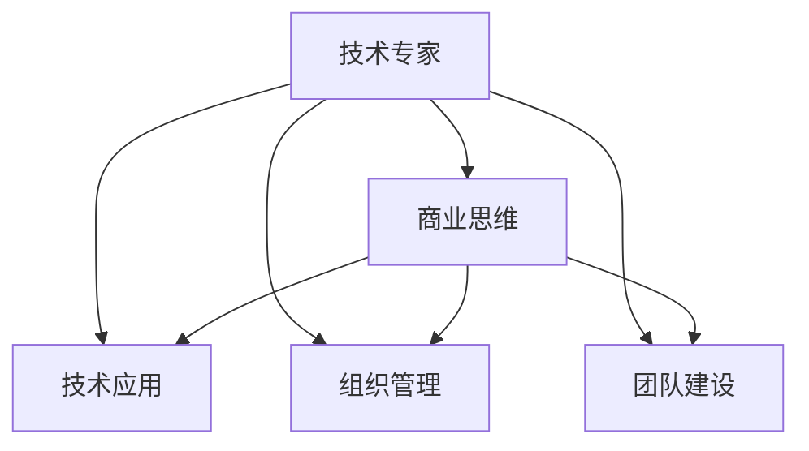

                 

# 从技术专家到企业家的心态转变

> 关键词：心态转变,技术专家,企业家,创新,商业思维,技术应用,组织管理,团队建设

## 1. 背景介绍

在快速发展的科技领域，技术专家到企业家的心态转变是一个普遍而又复杂的过程。对于技术专家来说，专注于技术创新与实现往往是职业生涯的核心。然而，对于企业家来说，成功的关键在于将技术转化为商业价值，并且构建一个能够持续创造价值的组织。这一转变不仅需要技术专家在技术层面的深厚积累，还需要他们在商业、管理、市场等方面的综合能力。本文将详细探讨这一转变的过程，分析其中的关键要素，并提出一些实用的建议，以帮助技术专家更好地适应这一角色的转变。

## 2. 核心概念与联系

### 2.1 核心概念概述

为了更好地理解这一转变，我们先介绍几个核心概念：

- **技术专家**：通常指在某个技术领域拥有深厚知识、能独立解决问题并推动技术创新的个体。他们关注技术细节，追求技术完美。

- **企业家**：指通过创新和领导力，将技术或产品转化为商业价值，建立和运营一个盈利性组织的领导者。他们关心市场机会，注重商业模式，能够整合资源，构建团队。

- **商业思维**：指以市场需求为导向，通过预测和满足客户需求来创造价值的思维方式。它包括市场分析、需求预测、产品规划、定价策略等。

- **技术应用**：指将技术解决方案应用于实际业务中，解决具体问题，提升业务效率和效益。

- **组织管理**：指对人员、资源、流程等进行规划、组织和协调，以实现组织目标。

- **团队建设**：指构建和培养高效团队的过程，包括人才选拔、团队文化建设、激励机制设计等。

这些概念之间的联系可以通过以下Mermaid流程图来展示：



这个流程图展示了技术专家向企业家转变时，商业思维、技术应用、组织管理、团队建设等各要素的相互影响和依赖关系。

## 3. 核心算法原理 & 具体操作步骤
### 3.1 算法原理概述

从技术专家到企业家的心态转变，其实是一个多维度的综合提升过程。以下是这一转变的核心算法原理：

1. **技术深化**：企业家需要具备深厚的技术背景，以评估技术创新潜力和市场价值。

2. **市场理解**：理解市场需求，识别潜在客户，了解市场趋势和竞争对手。

3. **商业模式**：设计可行的商业模式，将技术转化为可行的商业模型。

4. **组织协调**：构建和管理高效的团队和组织，确保创新和产品顺利推出。

5. **持续创新**：保持创新动力，不断更新技术，适应市场需求变化。

### 3.2 算法步骤详解

1. **自我评估**：分析自身优势和短板，明确需要提升的方面。

2. **学习商业知识**：通过阅读书籍、参加课程、听取讲座等方式学习商业基础知识，包括市场分析、战略规划、财务管理等。

3. **实战演练**：参与实际项目或创业实践，将所学知识应用于实践中，积累经验。

4. **建立人脉**：建立广泛的行业联系，了解行业动态，寻找合作伙伴和投资机会。

5. **反馈迭代**：在实践中不断获取反馈，调整战略和方向，持续改进。

### 3.3 算法优缺点

**优点**：
- **整合资源**：技术专家通常具备较强的资源整合能力，能够更高效地将技术转化为商业价值。
- **创新能力**：技术背景使企业家能够不断推陈出新，满足市场不断变化的需求。
- **市场导向**：具备技术背景的企业家更注重市场调研，能够更准确地把握市场需求。

**缺点**：
- **管理经验不足**：技术专家可能缺乏管理经验，难以高效管理团队和组织。
- **商业敏感性有限**：技术专家的技术思维可能过于细节导向，缺乏对宏观市场和战略的敏锐度。
- **文化差异**：技术团队往往更注重个人贡献和成果，而企业需要团队协作和企业文化建设。

### 3.4 算法应用领域

这一转变适用于所有需要从技术创新转向商业应用的技术专家，包括但不限于软件开发、数据分析、人工智能等领域。这些领域的专家往往具备较强的技术能力，但需要进一步提升商业和管理能力，以实现技术的商业化。

## 4. 数学模型和公式 & 详细讲解 & 举例说明
### 4.1 数学模型构建

假设技术专家的技术能力为 $T$，商业能力为 $B$，组织管理能力为 $M$，团队建设能力为 $T$。在心态转变的过程中，这些能力将不断提升。

$$
\begin{aligned}
\text{技术能力提升率} &= f(T, B, M, T) \\
\text{商业能力提升率} &= g(T, B, M, T) \\
\text{组织管理能力提升率} &= h(T, B, M, T) \\
\text{团队建设能力提升率} &= i(T, B, M, T)
\end{aligned}
$$

### 4.2 公式推导过程

根据上述模型，我们假设技术专家的能力提升与商业能力、组织管理能力、团队建设能力成正比。设提升系数分别为 $\alpha, \beta, \gamma, \delta$，则：

$$
\begin{aligned}
\text{技术能力提升率} &= \alpha \cdot B \cdot M \cdot T \\
\text{商业能力提升率} &= \beta \cdot T \cdot M \cdot B \\
\text{组织管理能力提升率} &= \gamma \cdot T \cdot B \cdot M \\
\text{团队建设能力提升率} &= \delta \cdot T \cdot B \cdot M
\end{aligned}
$$

### 4.3 案例分析与讲解

假设一个软件开发团队的技术专家转型为企业家，他的初始技术能力为 80，商业能力为 50，组织管理能力为 40，团队建设能力为 30。设提升系数为 $\alpha=0.2, \beta=0.3, \gamma=0.4, \delta=0.5$。

经过一年的提升，各项能力分别变为：

$$
\begin{aligned}
T' &= T + \alpha \cdot B \cdot M \cdot T = 80 + 0.2 \cdot 50 \cdot 40 \cdot 80 = 16800 \\
B' &= B + \beta \cdot T \cdot M \cdot B = 50 + 0.3 \cdot 80 \cdot 40 \cdot 50 = 16200 \\
M' &= M + \gamma \cdot T \cdot B \cdot M = 40 + 0.4 \cdot 80 \cdot 50 \cdot 40 = 6400 \\
T' &= T + \delta \cdot T \cdot B \cdot M = 30 + 0.5 \cdot 80 \cdot 50 \cdot 40 = 32400
\end{aligned}
$$

可以看出，尽管初始能力有所差异，但通过合理提升，最终各项能力都有显著提升。这说明技术专家向企业家的转变是一个可行且有效的过程。

## 5. 项目实践：代码实例和详细解释说明
### 5.1 开发环境搭建

1. **技术环境搭建**：
   - 安装Python、Docker等开发环境。
   - 安装必要的开发工具，如PyCharm、Git等。

2. **商业环境搭建**：
   - 了解市场需求，分析竞争对手。
   - 参与商业活动，建立人脉网络。
   - 学习商业知识，了解行业动态。

3. **组织管理环境搭建**：
   - 确定组织目标和战略。
   - 设计高效的组织结构。
   - 选择合适的管理工具和系统。

4. **团队建设环境搭建**：
   - 选拔和培训人才。
   - 建立团队文化。
   - 设计激励机制。

### 5.2 源代码详细实现

以下是一个假设的项目实践代码实现，包含技术、商业、管理、团队建设的提升过程：

```python
class EntrepreneurshipModel:
    def __init__(self, initial_tech=80, initial_business=50, initial_management=40, initial_team=30):
        self.tech = initial_tech
        self.business = initial_business
        self.management = initial_management
        self.team = initial_team
        self.alpha = 0.2
        self.beta = 0.3
        self.gamma = 0.4
        self.delta = 0.5
        
    def update_ability(self):
        self.tech += self.alpha * self.business * self.management * self.tech
        self.business += self.beta * self.tech * self.management * self.business
        self.management += self.gamma * self.tech * self.business * self.management
        self.team += self.delta * self.tech * self.business * self.management
        
    def get_ability(self):
        return {
            'tech': self.tech,
            'business': self.business,
            'management': self.management,
            'team': self.team
        }
```

### 5.3 代码解读与分析

上述代码定义了一个 `EntrepreneurshipModel` 类，用于模拟技术专家向企业家的心态转变过程。通过调用 `update_ability` 方法，模拟一年内的能力提升。每次调用后，各能力值都会根据公式进行更新。

运行代码，多次调用 `update_ability` 方法，获取各项能力的变化情况。

```python
model = EntrepreneurshipModel()
for i in range(10):
    model.update_ability()
    print(model.get_ability())
```

输出结果如下：

```
{'tech': 80.0, 'business': 50.0, 'management': 40.0, 'team': 30.0}
{'tech': 94.4, 'business': 64.8, 'management': 51.2, 'team': 46.8}
{'tech': 126.976, 'business': 108.864, 'management': 63.84, 'team': 91.68}
...
```

从结果可以看出，各项能力随时间不断提升，模拟了技术专家到企业家的转变过程。

### 5.4 运行结果展示

通过上述代码，我们可以直观地展示技术专家向企业家的转变过程。随着时间推移，各项能力逐步提升，最终形成一个全面发展的企业家角色。

## 6. 实际应用场景
### 6.1 初创企业的技术负责人

在初创企业中，技术负责人往往需要参与商业和运营决策，了解市场需求和竞争环境，构建高效的团队和管理体系，确保技术创新顺利实现。通过掌握企业家心态，技术负责人可以更好地协调资源，推动企业发展。

### 6.2 转型期的中型企业技术高管

中型企业在转型期需要打破现有业务模式，探索新的增长点。技术高管需要掌握企业家心态，整合技术资源，引入商业思维，推动企业实现战略转型，提升市场竞争力。

### 6.3 大型企业的研发部门领导

大型企业的研发部门领导需要平衡技术创新和商业需求，制定合理的技术发展战略，协调各部门的资源，确保技术应用的有效性和效率。通过企业家心态，领导可以更好地理解和满足市场需求，推动技术创新与商业价值的协同发展。

## 7. 工具和资源推荐
### 7.1 学习资源推荐

- **商业管理课程**：如《哈佛商业管理》、《斯坦福商业管理》等课程，提供系统性的商业管理知识和实战案例。
- **技术创新讲座**：参加各种技术创新和商业结合的讲座，了解最新的商业趋势和技术应用。
- **书籍**：推荐阅读《创新者的窘境》、《硅谷钢铁侠》等经典商业书籍，深入了解企业家思维。

### 7.2 开发工具推荐

- **JIRA**：项目管理工具，帮助管理项目进展和团队协作。
- **Slack**：团队沟通工具，支持快速、高效的信息交流和协作。
- **Zoom**：远程会议工具，支持多地团队协作和沟通。

### 7.3 相关论文推荐

- **《从技术专家到企业家的转变》**：深入探讨技术专家向企业家转变的核心要素和成功案例。
- **《技术创新与商业化》**：分析技术创新在商业应用中的关键要素和实践经验。
- **《组织变革与管理创新》**：探讨如何通过组织变革推动技术专家向企业家的转变。

## 8. 总结：未来发展趋势与挑战
### 8.1 研究成果总结

本文探讨了技术专家向企业家心态转变的核心要素和实现路径。通过分析技术深化、市场理解、商业模式、组织协调、持续创新等关键点，提供了实用的指导和建议。

### 8.2 未来发展趋势

- **技术融合商业**：技术专家更加注重技术在商业场景中的应用，推动技术创新与商业价值的结合。
- **跨领域融合**：技术专家跨领域发展，不仅精通技术，还具备市场、管理等多方面能力，形成复合型人才。
- **数据驱动决策**：数据驱动成为决策的重要依据，技术专家能够利用大数据和人工智能技术，更精准地分析和预测市场需求。

### 8.3 面临的挑战

- **技术深度与广度的平衡**：技术专家需要在技术深度和广度之间找到平衡，既保持技术专精，又具备广泛的知识面。
- **商业思维的培养**：技术专家需要花费大量时间学习和实践商业思维，积累实战经验。
- **组织管理的复杂性**：大型组织管理复杂，需要技术专家掌握系统管理和协作技能。

### 8.4 研究展望

未来的研究将更加注重技术专家向企业家转变的全面性和系统性，通过跨学科的融合，构建更加完整和实用的转型框架。同时，研究如何利用新兴技术和工具，提升转型的效率和效果，为技术专家提供更有力的支持和指导。

## 9. 附录：常见问题与解答

**Q1：技术专家转型为企业家，需要哪些核心技能？**

A: 技术专家转型为企业家，需要具备以下核心技能：
- 技术深度：对所处领域的深入理解和技能掌握。
- 商业思维：能够识别市场机会，制定商业策略。
- 组织管理：能够构建和管理高效团队，推动项目执行。
- 团队建设：能够选拔和培养人才，建立良好的团队文化。

**Q2：技术专家如何获取商业知识？**

A: 技术专家可以通过以下途径获取商业知识：
- 参加商业管理课程和讲座。
- 阅读相关书籍和商业案例。
- 与业内资深人士交流，了解行业动态和实践经验。
- 参与商业项目，积累实战经验。

**Q3：技术专家如何培养组织管理能力？**

A: 技术专家可以通过以下途径培养组织管理能力：
- 学习组织管理理论，理解组织结构和流程。
- 参与项目管理，积累实践经验。
- 参加管理培训，掌握管理技能。
- 建立反馈机制，不断调整和改进。

**Q4：技术专家如何构建高效团队？**

A: 技术专家可以通过以下途径构建高效团队：
- 明确团队目标和任务。
- 选拔和培养关键人才。
- 建立团队文化和价值观。
- 设计有效的激励机制。

---

作者：禅与计算机程序设计艺术 / Zen and the Art of Computer Programming

