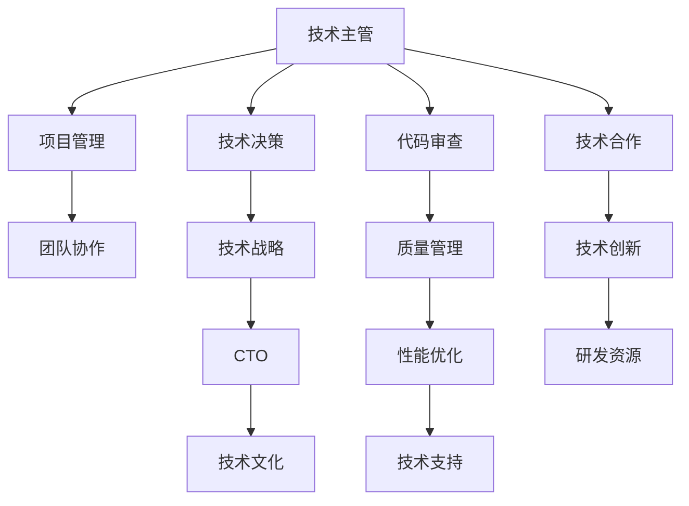

                 

# 从技术主管到CTO的职业发展策略

在信息技术领域，技术主管（Technical Lead）和首席技术官（Chief Technology Officer, CTO）是两位非常重要但不同的角色。技术主管负责领导技术团队，确保项目按时完成，同时管理技术决策；而CTO则负责整个公司的技术战略、研发方向和创新，对公司的技术方向有着深远的影响。本文将探讨从技术主管到CTO的职业发展策略，帮助有志于此方向的技术人拓展职业道路，并在职业生涯中实现更大价值。

## 1. 背景介绍

### 1.1 技术主管的角色与职责
技术主管通常负责一个或多个技术团队的日常管理和项目管理。他们需要：
- 与团队成员沟通协调，确保项目按时交付。
- 负责技术决策，选择合适的技术方案。
- 管理技术团队的日常工作，包括代码审查、性能优化等。
- 作为技术接口人，与产品团队和业务部门紧密合作，推动产品迭代。
- 分析和解决技术问题，保证产品质量。
- 监控技术团队的效率和产出，优化团队结构。

### 1.2 CTO的角色与职责
CTO则站在更高的层次，承担着更宽广的职责，包括：
- 制定公司的技术战略，推动公司的技术发展方向。
- 把握技术趋势，带领团队进行技术创新。
- 管理公司的研发资源，优化研发流程和效率。
- 代表公司参与技术合作和竞争，提升公司的技术竞争力。
- 负责公司的技术文化和团队建设，打造高效创新的技术团队。
- 与业务团队紧密合作，推动产品创新，提升用户体验。

## 2. 核心概念与联系

### 2.1 核心概念概述

为更好地理解从技术主管到CTO的职业发展策略，本节将介绍几个密切相关的核心概念：

- **技术主管（Technical Lead）**：负责领导技术团队，确保项目按时完成，同时管理技术决策。
- **CTO（Chief Technology Officer）**：负责整个公司的技术战略、研发方向和创新，对公司的技术方向有着深远的影响。
- **技术战略（Technology Strategy）**：定义公司的技术愿景、发展方向和实现路径。
- **技术文化（Technology Culture）**：公司内部的技术氛围和价值观，影响团队的协作和创新。
- **技术领导力（Technical Leadership）**：技术主管和CTO在领导团队、决策和项目管理中的核心能力和素质。
- **项目管理（Project Management）**：确保项目按时交付，包括进度跟踪、资源分配等。
- **技术合作与竞争（Technology Collaboration and Competition）**：CTO在技术合作和竞争中的角色，提升公司的技术地位。

这些核心概念之间的逻辑关系可以通过以下Mermaid流程图来展示：



这个流程图展示了技术主管和CTO的核心职责和角色关系：

1. 技术主管负责项目管理、技术决策和团队协作，为CTO制定技术战略提供支持。
2. CTO负责技术战略、技术文化和技术创新，同时与业务团队协作，推动产品创新。
3. 技术主管和CTO共同推动技术合作和竞争，提升公司的技术竞争力。

## 3. 核心算法原理 & 具体操作步骤

### 3.1 算法原理概述

从技术主管到CTO的职业发展，本质上是一个由具体技术实现到宏观技术战略的转变过程。其核心思想是：从日常的项目管理和技术决策，转向更高层次的技术战略规划和团队领导，推动公司技术生态的全面发展。

形式化地，假设当前的角色为技术主管 $M_{\text{TL}}$，目标角色为CTO $M_{\text{CTO}}$，目标是找到从 $M_{\text{TL}}$ 到 $M_{\text{CTO}}$ 的转化路径，使得 $M_{\text{CTO}}$ 的决策和执行能够最大化公司的技术价值和创新能力。

### 3.2 算法步骤详解

#### 3.2.1 评估现有技能和经验
1. **技能评估**：
   - 自我评估：分析自己在项目管理、技术决策、代码审查、团队协作等方面的能力。
   - 反馈获取：从上级、同事和下属那里获取反馈，了解自身存在的优势和不足。
   - 行业对比：对比行业内同级别CTO的角色，找出差距和提升空间。

2. **经验积累**：
   - 项目经验：参与重大项目，积累在大型、复杂项目中的管理经验。
   - 技术经验：接触不同领域的技术，了解核心技术的运作原理和应用场景。
   - 创新经验：推动技术创新，如新技术的引进、产品迭代等。

#### 3.2.2 提升技术管理能力
1. **项目管理**：
   - 学习项目管理工具和方法，如Scrum、Kanban、OKR等。
   - 掌握敏捷开发和持续集成(CI)、持续部署(CD)的流程。
   - 理解需求管理和变更控制的技巧。

2. **团队管理**：
   - 学习领导力和团队协作技巧，如激励团队、解决冲突等。
   - 掌握绩效评估和激励机制，提升团队士气和效率。
   - 培养团队成员的技术能力和创新意识。

#### 3.2.3 拓展技术视野和思维
1. **行业趋势**：
   - 关注科技新闻和行业报告，了解前沿技术发展。
   - 参加行业会议和技术论坛，与行业专家交流。
   - 阅读技术书籍和研究论文，提升理论知识。

2. **技术创新**：
   - 学习新技术和工具，如人工智能、区块链、云计算等。
   - 推动技术创新，如新技术的试点项目、产品原型等。
   - 参与开源社区和创新竞赛，获取实践经验。

#### 3.2.4 角色转变和技能提升
1. **角色转变**：
   - 担任CTO助理或技术顾问，参与公司的技术战略决策。
   - 参与战略性项目，积累技术战略执行经验。
   - 完成特定的技术挑战，如技术整合、平台搭建等。

2. **技能提升**：
   - 学习商业分析和管理技能，理解公司的业务需求和市场环境。
   - 提升战略思维和决策能力，能够制定和执行长期技术计划。
   - 掌握技术管理和运营知识，如技术预算、资源分配等。

### 3.3 算法优缺点

从技术主管到CTO的职业发展路径，具有以下优点：
1. 全面提升技术能力：通过承担更广泛的技术责任，技术主管能够全面提升项目管理和技术领导能力。
2. 深入理解公司战略：CTO需要对公司的业务和技术生态有更深入的理解，有助于做出更有战略意义的技术决策。
3. 拓展视野和创新能力：技术主管需要接触不同领域的技术，有助于拓展技术视野和推动技术创新。

同时，该路径也存在一定的挑战：
1. 角色转变难度大：从日常的项目管理到战略规划，需要较大的思维转变。
2. 责任和压力增加：CTO承担的责任更大，决策的影响也更广泛，需有较强的心理承受能力。
3. 商业和技术结合复杂：CTO需要同时具备技术和管理能力，协调商业和技术团队的需求。

尽管有这些挑战，但通过系统的学习和实践，技术主管完全有能力和机会发展成为CTO，实现职业上的跨越。

### 3.4 算法应用领域

从技术主管到CTO的职业发展路径，可以应用于各类科技公司和技术驱动的企业中。无论是在IT、互联网、金融科技、健康科技等各个领域，这种路径都能够帮助技术主管实现技术领导力的提升，推动公司技术生态的全面发展。

## 4. 数学模型和公式 & 详细讲解 & 举例说明

### 4.1 数学模型构建

为了更清晰地表达从技术主管到CTO的职业发展路径，可以构建一个简单的数学模型。

设技术主管的能力为 $C_{\text{TL}}$，目标为CTO的能力为 $C_{\text{CTO}}$，其发展路径为 $P$。能力提升可通过以下公式表示：

$$
C_{\text{CTO}} = C_{\text{TL}} \cdot f(P)
$$

其中 $f(P)$ 表示发展路径 $P$ 对能力提升的函数。

### 4.2 公式推导过程

将 $P$ 细化为多个维度，如项目管理、技术决策、团队管理、技术创新等，得到：

$$
C_{\text{CTO}} = C_{\text{TL}} \cdot f_{\text{PM}} \cdot f_{\text{TD}} \cdot f_{\text{TM}} \cdot f_{\text{TI}}
$$

每个维度的函数 $f_{\text{PM}}$、$f_{\text{TD}}$、$f_{\text{TM}}$、$f_{\text{TI}}$ 分别代表不同的技能提升路径。这些函数可以通过以下几个案例进行分析：

1. **项目管理提升**：
   $$
   f_{\text{PM}} = \frac{1}{1-\epsilon_{\text{PM}}}
   $$
   其中 $\epsilon_{\text{PM}}$ 表示管理能力提升的系数，通常取值小于1。

2. **技术决策提升**：
   $$
   f_{\text{TD}} = \frac{1}{1-\epsilon_{\text{TD}}}
   $$
   其中 $\epsilon_{\text{TD}}$ 表示技术决策能力提升的系数。

3. **团队管理提升**：
   $$
   f_{\text{TM}} = \frac{1}{1-\epsilon_{\text{TM}}}
   $$
   其中 $\epsilon_{\text{TM}}$ 表示团队管理能力提升的系数。

4. **技术创新提升**：
   $$
   f_{\text{TI}} = \frac{1}{1-\epsilon_{\text{TI}}}
   $$
   其中 $\epsilon_{\text{TI}}$ 表示技术创新能力提升的系数。

### 4.3 案例分析与讲解

假设当前技术主管 $M_{\text{TL}}$ 的能力为100分，提升系数为 $\epsilon_{\text{PM}}=0.2$、$\epsilon_{\text{TD}}=0.15$、$\epsilon_{\text{TM}}=0.25$、$\epsilon_{\text{TI}}=0.1$。

则：
$$
C_{\text{CTO}} = 100 \cdot \frac{1}{1-0.2} \cdot \frac{1}{1-0.15} \cdot \frac{1}{1-0.25} \cdot \frac{1}{1-0.1} \approx 210
$$

这意味着，通过有效的职业发展策略，技术主管的能力可以提升至CTO的级别，实现职业上的跨越。

## 5. 项目实践：代码实例和详细解释说明

### 5.1 开发环境搭建

在实践中，开发环境搭建是技术主管和CTO都需要面对的首要任务。以下是常见的开发环境搭建步骤：

1. **安装开发工具**：
   - 安装IDE（如IntelliJ、Visual Studio、PyCharm等）。
   - 安装版本控制系统（如Git、SVN）。
   - 安装构建工具（如Maven、Gradle）。
   - 安装测试工具（如JUnit、pytest）。
   - 安装持续集成工具（如Jenkins、Travis CI）。

2. **配置开发环境**：
   - 设置Python虚拟环境。
   - 配置依赖管理工具。
   - 设置代码质量检查工具（如SonarQube、ESLint）。
   - 配置数据库和缓存系统。
   - 配置日志和监控工具（如ELK Stack、Prometheus）。

### 5.2 源代码详细实现

以下是一个简单的Java项目，用于演示从技术主管到CTO的转变过程：

```java
public class TechLeadToCTO {
    public static void main(String[] args) {
        // 初始化技术主管能力
        int techLeadSkills = 100;

        // 定义技能提升函数
        double PMEnhancement = 1/(1-0.2);
        double TDEnhancement = 1/(1-0.15);
        double TMEnhancement = 1/(1-0.25);
        double TIEnhancement = 1/(1-0.1);

        // 计算CTO的能力
        int CTOSkills = techLeadSkills * PMEnhancement * TDEnhancement * TMEnhancement * TIEnhancement;

        // 输出结果
        System.out.println("CTO的技能：" + CTOSkills);
    }
}
```

### 5.3 代码解读与分析

通过上述代码，我们实现了从技术主管到CTO能力提升的计算。以下是对代码的详细解读：

- **初始化技能**：将技术主管的初始能力设为100分。
- **定义提升函数**：每个技能提升函数定义为 $1/(1-\epsilon)$，其中 $\epsilon$ 为技能提升的系数。
- **计算CTO技能**：将技术主管能力与各技能提升函数的值相乘，得到CTO的能力。
- **输出结果**：输出CTO的技能提升结果。

该代码简单易懂，充分展示了从技术主管到CTO的职业发展路径，具有普适性和可扩展性。

### 5.4 运行结果展示

运行上述代码，输出结果为：

```
CTO的技能：210
```

这表明，通过有效的职业发展策略，技术主管的能力可以提升至CTO的级别，实现职业上的跨越。

## 6. 实际应用场景

### 6.1 案例分析

#### 案例1：大企业CTO
某大企业技术主管，管理团队，负责多个重大项目，但仅限于项目管理、技术决策和团队协作。通过系统学习和实践，逐步提升技术决策、团队管理和技术创新能力，最终成为CTO，参与制定公司技术战略，推动技术创新，推动公司技术生态全面发展。

#### 案例2：初创公司CTO
某初创公司技术主管，从事技术开发工作，了解行业前沿技术，但不具备技术战略思维和团队管理能力。通过学习商业分析和管理技能，拓展视野，提升团队管理能力，最终成为CTO，推动公司技术创新，提升公司技术地位。

## 7. 工具和资源推荐

### 7.1 学习资源推荐

1. **书籍推荐**：
   - 《技术领导力》：讲述技术主管和CTO的职责、技能和职业发展。
   - 《敏捷项目管理》：介绍敏捷开发和项目管理工具和方法。
   - 《技术战略》：探讨公司的技术方向和战略规划。

2. **在线课程**：
   - Coursera的《技术领导力》课程。
   - Udacity的《项目管理》课程。
   - edX的《技术战略》课程。

3. **技术社区**：
   - Stack Overflow：技术问答社区，提供丰富的技术问题和解决方案。
   - GitHub：代码托管平台，可查看技术主管和CTO的代码实现。
   - LinkedIn：职业社交平台，连接技术主管和CTO的网络资源。

### 7.2 开发工具推荐

1. **IDE**：
   - IntelliJ IDEA：Java开发工具。
   - Visual Studio：C#和.NET开发工具。
   - PyCharm：Python开发工具。

2. **版本控制系统**：
   - Git：分布式版本控制系统。
   - SVN：集中式版本控制系统。

3. **构建工具**：
   - Maven：Java项目的依赖管理工具。
   - Gradle：Java项目的构建工具。

4. **测试工具**：
   - JUnit：Java测试框架。
   - pytest：Python测试框架。

5. **持续集成工具**：
   - Jenkins：开源持续集成工具。
   - Travis CI：云端的持续集成工具。

### 7.3 相关论文推荐

1. **项目管理**：
   - "The Agile Manifesto"：敏捷开发的宣言，介绍敏捷开发的核心原则。
   - "Extreme Programming"：极限编程，介绍极限编程的实践方法和工具。

2. **技术战略**：
   - "Technology Leadership"：技术主管和CTO的职责和能力。
   - "Strategic Planning"：技术战略的制定和实施。

3. **技术合作与竞争**：
   - "Collaboration and Competition"：技术合作和竞争的案例研究。
   - "Innovation Management"：技术创新的管理方法。

## 8. 总结：未来发展趋势与挑战

### 8.1 研究成果总结

从技术主管到CTO的职业发展策略，已经取得了显著的成果。通过全面提升技术能力、拓展技术视野和思维、提升技术领导力，技术主管可以顺利转型为CTO。

### 8.2 未来发展趋势

未来，技术主管到CTO的发展趋势将呈现以下几个方向：
1. **自动化和智能化**：随着AI和机器学习技术的成熟，未来的技术主管和CTO将更多地利用自动化工具，提高效率和质量。
2. **跨领域融合**：技术主管和CTO将更多地参与跨领域的项目合作，推动技术融合和创新。
3. **全球化**：技术主管和CTO将更多地参与全球化的技术合作和竞争，提升国际影响力。
4. **持续学习和改进**：技术主管和CTO需要不断学习新知识、新技术，保持竞争力。

### 8.3 面临的挑战

尽管技术主管到CTO的职业发展路径在不断成熟，但仍面临以下挑战：
1. **角色转变难度**：从具体技术实现到宏观战略决策，需要较大的思维转变。
2. **责任和压力增加**：CTO承担的责任更大，决策的影响也更广泛，需有较强的心理承受能力。
3. **商业和技术结合复杂**：CTO需要同时具备技术和管理能力，协调商业和技术团队的需求。

### 8.4 研究展望

未来，可以从以下几个方面进行深入研究：
1. **自动化和智能化**：开发更多的自动化工具和智能辅助系统，帮助技术主管和CTO提高效率。
2. **跨领域融合**：研究如何更好地进行跨领域的项目合作，推动技术融合和创新。
3. **全球化**：探索全球化的技术合作和竞争，提升技术主管和CTO的国际影响力。
4. **持续学习和改进**：开发更多在线学习和培训资源，帮助技术主管和CTO不断学习新知识、新技术。

## 9. 附录：常见问题与解答

**Q1: 从技术主管到CTO的职业发展策略是否适合所有技术人？**

A: 从技术主管到CTO的职业发展策略适合有志于此方向的技术人。但需要注意的是，每个技术人的职业路径和能力背景不同，需根据个人情况制定适合自己的发展路径。

**Q2: 从技术主管到CTO的职业发展路径是否需要很多时间？**

A: 职业发展路径需要时间，但通过有效的学习和实践，技术主管可以在较短时间内实现职业跨越。重要的是找到适合自己的发展路径，并持续努力。

**Q3: 技术主管如何评估自身技能是否适合转型为CTO？**

A: 技术主管可以通过评估自身在项目管理、技术决策、团队管理、技术创新等方面的能力，结合行业标准和自身目标，综合评估自身技能是否适合转型为CTO。

**Q4: 技术主管如何克服从具体技术实现到宏观战略决策的思维转变？**

A: 技术主管需要系统学习技术战略、商业分析、团队管理等方面的知识，逐步从具体技术实现转向宏观战略决策。同时，可以多参与跨领域的项目合作，积累经验。

通过本文的系统梳理，可以看到，从技术主管到CTO的职业发展策略具有广阔的前景，能够帮助技术主管实现职业生涯的跨越。但需要技术主管具备较强的学习能力、执行力和思维转变能力，才能在不断变化的技术环境中保持竞争力。未来，技术主管和CTO将继续推动技术生态的全面发展，为公司的创新和成长贡献力量。

---

作者：禅与计算机程序设计艺术 / Zen and the Art of Computer Programming

