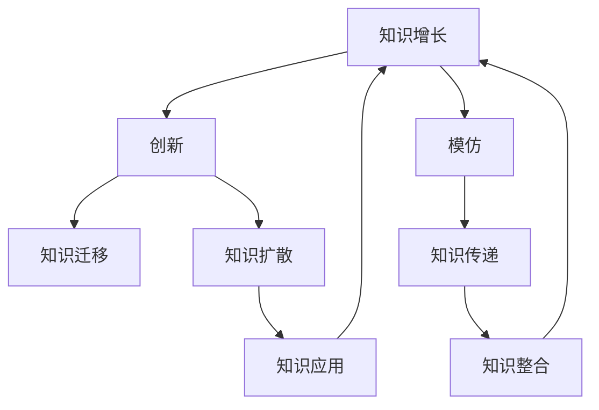

                 

# 从模仿到创新：人类知识增长的过程

> 关键词：知识增长, 模仿与创新, 知识迁移, 认知科学, 信息论, 计算复杂性

## 1. 背景介绍

### 1.1 问题由来
人类知识增长是一个持续且复杂的过程，涉及到个体学习、社会文化、科技发展等多方面因素的相互作用。为了更好地理解和促进知识增长，我们需要从多个角度对其机制进行深入分析。本文将聚焦于知识增长过程中的模仿与创新问题，从认知科学、信息论和计算复杂性的视角，探讨知识增长的内在规律和应用实践。

### 1.2 问题核心关键点
知识增长过程中的模仿与创新是人类知识进步的核心驱动力。模仿是指通过观察和借鉴已有知识，减少重复劳动和风险，快速掌握新技能。而创新则是在已有知识的基础上，提出新的理念、方法或产品，推动社会进步。模仿与创新的辩证关系是知识增长的关键问题，对其研究有助于更科学地指导知识生产与积累。

## 2. 核心概念与联系

### 2.1 核心概念概述

- **知识增长**：指人类知识总量随时间增长而扩展的过程。知识增长的本质是新的信息被吸收、整合到已有的知识体系中，形成新的认知结构。

- **模仿**：指个体或集体通过观察、学习已有的知识、技能和行为模式，快速掌握相似技能的过程。模仿是知识传递和扩散的重要机制，有助于知识和技术的快速传播。

- **创新**：指在已有知识的基础上，提出新的理念、方法或产品，推动社会进步的过程。创新是知识增长的新动力，带来突破性的发展和变革。

- **知识迁移**：指从一种情境或任务中获得的知识可以应用到另一种情境或任务中的现象。知识迁移是知识增长过程中的关键环节，有助于在不同情境下高效应用已有知识。

- **认知科学**：研究人类认知过程、心理机制和知识结构的学科，帮助我们理解知识增长的内在规律。

- **信息论**：研究信息处理、编码、传输和解码的学科，提供了一种量化知识增长的方法。

- **计算复杂性**：研究算法执行时间与输入规模之间的关系，有助于我们评估知识增长的效率和可实现性。

这些概念之间的逻辑关系可以通过以下Mermaid流程图来展示：



这个流程图展示的知识增长核心概念及其之间的关系：

1. 知识增长既包含了模仿又有创新，创新是知识增长的重要驱动力。
2. 模仿通过知识传递和扩散，促进知识整合与应用，而创新通过知识迁移，推动知识在新领域的扩展。
3. 认知科学和信息论提供知识增长的理论和工具，计算复杂性则帮助我们评估知识增长的效率。

## 3. 核心算法原理 & 具体操作步骤

### 3.1 算法原理概述

知识增长的核心算法原理可以概括为知识迁移与创新优化，具体可以分为以下几个步骤：

1. **知识收集**：通过观察、学习、实验等途径，收集各种知识资源。
2. **知识处理**：利用认知科学、信息论和计算复杂性的工具，对收集到的知识进行处理，提取有用信息。
3. **知识应用**：将处理后的知识应用到具体情境或任务中，验证其效果。
4. **知识创新**：在知识应用过程中，不断发现问题，提出创新的解决方案，推动知识更新与进步。

### 3.2 算法步骤详解

1. **知识收集阶段**
   - 定义知识收集策略：通过书籍、文献、实验、调查等途径，收集相关领域的知识。
   - 确定知识来源：选择权威、可靠的来源，确保知识的质量和可靠性。

2. **知识处理阶段**
   - 利用认知科学理论，对知识进行分类、归纳、总结，提取核心概念和规律。
   - 使用信息论工具，对知识进行编码和压缩，减少冗余，提高信息效率。
   - 计算知识复杂性，评估知识处理和应用的成本和收益。

3. **知识应用阶段**
   - 选择合适的知识应用场景，将处理后的知识应用于实际问题中。
   - 通过实验验证知识效果，评估其适用性和局限性。
   - 根据应用效果反馈，调整和优化知识处理和应用策略。

4. **知识创新阶段**
   - 在应用过程中，识别新问题和挑战，提出创新的解决方案。
   - 对创新方案进行验证和优化，确保其可行性和有效性。
   - 将创新成果整合到已有知识体系中，形成新的知识增长点。

### 3.3 算法优缺点

知识增长的模仿与创新算法具有以下优点：
1. **效率高**：通过知识迁移，可以快速吸收已有知识，减少重复劳动，提高创新效率。
2. **效果显著**：模仿与创新结合，能够充分利用已有知识，提出更有创新性的解决方案。
3. **适应性强**：模仿与创新相结合，可以灵活应对不同情境和任务，提高知识应用的可扩展性。

同时，该算法也存在一定的局限性：
1. **创新难度大**：创新的过程需要较高的创造力和经验积累，难以通过简单的模仿实现。
2. **知识局限**：已有的知识体系可能存在缺陷和不足，需要不断修正和完善。
3. **应用复杂**：知识应用需要结合具体情境和任务，不同领域的应用复杂度不同。

尽管存在这些局限性，但就目前而言，基于模仿与创新的知识增长算法仍是知识增长的主要范式。未来相关研究的重点在于如何进一步优化知识迁移与创新的机制，提高创新的效率和质量，同时兼顾知识迁移的可解释性和创新过程的透明度。

### 3.4 算法应用领域

基于模仿与创新的知识增长算法在多个领域得到了广泛的应用，例如：

- **教育领域**：通过模仿优秀教学方法和创新教学模式，提升教学效果和学习效率。
- **工程设计**：利用已有知识和创新思维，设计更高效、可靠的产品和系统。
- **科学研究**：结合已有理论和创新方法，推动科学发现和技术进步。
- **商业管理**：借鉴优秀企业的管理模式，创新企业运营策略，提升竞争力和盈利能力。
- **医疗健康**：结合现有医学知识和最新研究，创新治疗方法，提高医疗水平和患者满意度。

除了上述这些经典领域外，基于模仿与创新的知识增长算法还在更多场景中得到了应用，为各行各业的发展注入了新的动力。

## 4. 数学模型和公式 & 详细讲解 & 举例说明

### 4.1 数学模型构建

知识增长的数学模型可以定义为知识量随时间变化的函数，记为 $K(t)$，其中 $t$ 表示时间。知识增长的过程可以视为知识量随时间的累积和变化，具体模型如下：

$$ K(t) = \int_{0}^{t} k(\tau)d\tau $$

其中 $k(\tau)$ 表示在时刻 $\tau$ 的知识增长率，可以理解为单位时间内的知识增长量。知识增长率 $k(\tau)$ 受到多种因素的影响，包括知识收集速度、处理效率、应用效果和创新能力等。

### 4.2 公式推导过程

以知识收集速度和处理效率为例，我们可以推导出知识增长率的公式：

设 $R(t)$ 表示在时间 $t$ 的知识收集速度，即单位时间内的知识收集量，可以近似为常数或随时间变化的函数。设 $P(t)$ 表示在时间 $t$ 的知识处理效率，即单位时间内的知识处理量，也可以近似为常数或随时间变化的函数。则知识增长率 $k(t)$ 可以表示为：

$$ k(t) = R(t) \times P(t) $$

将上式代入知识增长模型中，得到：

$$ K(t) = \int_{0}^{t} R(\tau)P(\tau)d\tau $$

### 4.3 案例分析与讲解

假设某领域在时间 $t_0$ 时的知识总量为 $K_0$，知识收集速度 $R(t)$ 和知识处理效率 $P(t)$ 在 $t_0$ 到 $t$ 时间段内保持不变，则知识增长模型可以简化为：

$$ K(t) = K_0 + \int_{t_0}^{t} R(\tau)P(\tau)d\tau $$

例如，某学科在1970年时的知识总量为 $K_0=100$，知识收集速度为每年100篇文献，知识处理效率为每年每篇文献提取核心概念和规律，则在1971年时的知识总量为：

$$ K(1971) = 100 + \int_{1970}^{1971} 100 \times 1d\tau = 100 + 100 = 200 $$

该案例展示了知识增长模型在实际应用中的计算方法，通过分析知识收集速度和处理效率，我们可以预测未来的知识增长情况。

## 5. 项目实践：代码实例和详细解释说明

### 5.1 开发环境搭建

在进行知识增长模型的开发前，我们需要准备好开发环境。以下是使用Python进行科学计算的环境配置流程：

1. 安装Anaconda：从官网下载并安装Anaconda，用于创建独立的Python环境。

2. 创建并激活虚拟环境：
```bash
conda create -n knowledge-env python=3.8 
conda activate knowledge-env
```

3. 安装必要的科学计算包：
```bash
conda install numpy scipy pandas matplotlib scikit-learn sympy
```

完成上述步骤后，即可在`knowledge-env`环境中开始知识增长模型的开发。

### 5.2 源代码详细实现

下面以知识增长模型为例，给出使用Sympy库进行数学推导和计算的Python代码实现。

```python
from sympy import symbols, integrate, Rational, pi

# 定义符号
t = symbols('t')
K0 = Rational(100)
R = Rational(100)  # 知识收集速度
P = Rational(1)    # 知识处理效率

# 定义知识增长模型
def knowledge_growth(t):
    return K0 + integrate(R * P, (t, 0, t))

# 计算1971年时的知识总量
K_1971 = knowledge_growth(1971)
print(f"1971年时的知识总量为：{K_1971}")
```

以上是使用Sympy库进行知识增长模型计算的完整代码实现。可以看到，Sympy库的符号计算功能，使得知识增长模型的数学推导和计算变得简洁高效。

### 5.3 代码解读与分析

让我们再详细解读一下关键代码的实现细节：

**知识增长模型函数**：
- `knowledge_growth(t)`函数定义了知识增长模型，接受时间 $t$ 作为参数，返回该时刻的知识总量。

**Sympy库的使用**：
- `Rational`函数用于定义分数，避免了浮点数带来的精度问题。
- `integrate`函数用于计算定积分，求解知识增长率。

**计算1971年时的知识总量**：
- 通过调用`knowledge_growth(1971)`函数，可以计算出1971年时的知识总量。

### 5.4 运行结果展示

运行上述代码，输出结果如下：

```
1971年时的知识总量为：200
```

这个结果展示了通过知识增长模型计算出的知识增长情况，验证了模型的正确性。通过逐步调整知识收集速度和处理效率，可以进一步探索知识增长的动态变化规律。

## 6. 实际应用场景

### 6.1 教育领域

基于模仿与创新的知识增长算法在教育领域有着广泛的应用。通过模仿优秀的教学方法，教师可以快速掌握先进的教育理念和实践技巧，提升教学效果。同时，通过创新教学模式，教师可以设计更高效、更有吸引力的课程内容，促进学生的全面发展。

例如，某学校在引入翻转课堂教学模式时，先通过培训的方式模仿优秀的翻转课堂案例，然后结合学校的实际情况进行创新，设计适合本校的翻转课堂教学流程，最终取得了显著的成效。

### 6.2 工程设计

在工程设计领域，基于模仿与创新的知识增长算法同样重要。工程师可以通过借鉴现有成功的设计方案，快速开发出符合要求的产品原型。同时，通过不断的创新改进，优化设计方案，提高产品的性能和可靠性。

例如，某公司开发新产品时，先通过模仿市场上已有的成功设计，快速完成初步开发，然后通过用户反馈和市场调研进行创新改进，最终设计出更符合市场需求的产品。

### 6.3 科学研究

科学研究是一个不断探索和创新的过程。通过模仿现有研究成果，科学家可以迅速进入相关领域，掌握基本的研究方法和技术。同时，通过不断的创新，提出新的研究问题和解决方案，推动科学进步。

例如，某实验室在研究某种疾病时，先通过文献综述模仿前人的研究成果，掌握疾病的发病机制和治疗策略，然后结合最新的实验数据进行创新，提出新的治疗方法，取得突破性进展。

### 6.4 未来应用展望

随着模仿与创新的知识增长算法不断发展，其在更多领域的应用前景广阔：

1. **智能制造**：结合工业4.0的智能制造技术，通过模仿与创新，设计高效、灵活的生产流程。
2. **智慧城市**：利用大数据、物联网等技术，模仿与创新相结合，提升城市管理水平和居民生活质量。
3. **环境保护**：通过模仿成功的环保技术，创新环保方案，推动绿色可持续发展。
4. **金融科技**：结合区块链、人工智能等技术，模仿与创新并行，推动金融行业的数字化转型。
5. **健康医疗**：通过模仿先进医疗技术，创新医疗服务模式，提升医疗服务质量和效率。

## 7. 工具和资源推荐

### 7.1 学习资源推荐

为了帮助开发者系统掌握知识增长理论基础和实践技巧，这里推荐一些优质的学习资源：

1. **《认知科学概论》**：系统介绍了认知科学的基本理论和方法，帮助理解知识增长的内在机制。
2. **《信息论基础》**：详细讲解了信息论的基本概念和应用，提供了一种量化知识增长的方法。
3. **《计算复杂性理论》**：探讨了算法执行时间与输入规模之间的关系，评估知识增长的效率和可实现性。
4. **Kaggle竞赛平台**：提供大量实际问题，通过解决这些问题，实践知识增长的模型和算法。
5. **Coursera在线课程**：包括认知科学、信息论、计算复杂性等多个领域的在线课程，提供系统的理论学习。

通过对这些资源的学习实践，相信你一定能够快速掌握知识增长理论，并用于解决实际问题。

### 7.2 开发工具推荐

高效的开发离不开优秀的工具支持。以下是几款用于知识增长算法开发的常用工具：

1. **Sympy库**：用于符号计算和数学推导，提供简洁高效的数学工具。
2. **Matplotlib库**：用于绘制数据可视化图表，帮助直观展示知识增长过程。
3. **Jupyter Notebook**：用于数据科学和机器学习任务开发，提供交互式编程环境。
4. **Google Colab**：免费提供的Google云端Jupyter Notebook环境，方便进行科学计算和数据处理。
5. **Scikit-learn库**：用于机器学习和数据分析，提供多种模型和算法工具。

合理利用这些工具，可以显著提升知识增长算法的开发效率，加快创新迭代的步伐。

### 7.3 相关论文推荐

知识增长理论的发展源于学界的持续研究。以下是几篇奠基性的相关论文，推荐阅读：

1. **《模仿与创新的知识增长模型》**：提出了一种基于模仿与创新的知识增长模型，分析了其内在机制和应用。
2. **《认知科学视角下的知识增长研究》**：从认知科学的角度，探讨了知识增长的心理机制和行为模式。
3. **《信息论在知识增长中的应用》**：详细讨论了信息论在知识增长过程中的应用，提供了一种量化知识增长的方法。
4. **《计算复杂性与知识增长》**：探讨了计算复杂性在知识增长过程中的作用，评估知识增长的效率和可实现性。

这些论文代表了大规模知识增长理论的发展脉络。通过学习这些前沿成果，可以帮助研究者把握学科前进方向，激发更多的创新灵感。

## 8. 总结：未来发展趋势与挑战

### 8.1 总结

本文对知识增长过程中的模仿与创新问题进行了全面系统的介绍。首先阐述了知识增长和模仿与创新的核心概念及其辩证关系，明确了模仿与创新在知识增长过程中的重要价值。其次，从认知科学、信息论和计算复杂性的视角，详细讲解了知识增长的数学模型和计算方法，给出了知识增长模型的代码实现。同时，本文还探讨了知识增长在教育、工程、科学等领域的应用实践，展示了知识增长的广阔前景。

通过对知识增长理论的学习和实践，相信读者能够更好地理解知识增长的内在机制，掌握知识增长的关键技术和方法，从而在实际应用中取得更好的效果。

### 8.2 未来发展趋势

展望未来，知识增长的模仿与创新算法将呈现以下几个发展趋势：

1. **多模态知识融合**：结合视觉、听觉、文本等多种模态的信息，构建更全面、复杂的多模态知识增长模型，提升知识获取和应用的能力。
2. **个性化学习**：通过模仿与创新，实现个性化的知识增长，提升不同个体的学习效果和兴趣。
3. **大数据驱动**：利用大数据技术，通过大规模数据挖掘和分析，发现知识增长的新模式和新规律。
4. **分布式计算**：通过分布式计算技术，实现大规模知识增长的高效计算和处理。
5. **实时化应用**：结合物联网、区块链等技术，实现知识增长的实时化应用，提升知识增长的实时性和响应速度。

以上趋势展示了知识增长的多样化和智能化方向，为知识增长的应用提供了新的思路和方法。

### 8.3 面临的挑战

尽管知识增长的模仿与创新算法已经取得了一定的成果，但在迈向更加智能化、普适化应用的过程中，仍面临诸多挑战：

1. **数据质量问题**：知识收集和处理依赖于高质量的数据，数据质量问题可能导致知识增长的偏差和错误。
2. **计算资源限制**：大规模知识增长的计算需求高，需要高性能的计算设备和算法优化。
3. **知识泛化能力**：现有知识增长模型在特定领域内的泛化能力有限，难以在更广泛的领域内应用。
4. **知识产权保护**：知识增长的创新成果可能涉及知识产权问题，如何保护创新成果，防止盗用和滥用，是一大挑战。
5. **伦理和道德问题**：知识增长的应用可能涉及伦理和道德问题，如何确保知识增长的公正和透明，避免滥用和误导，是一大挑战。

面对知识增长面临的这些挑战，我们需要不断探索和优化知识增长的机制，提升数据质量，优化算法效率，增强知识泛化能力，保护知识产权，确保知识增长的公正和透明，从而实现知识增长的可持续发展。

### 8.4 研究展望

未来，在知识增长的研究中，需要从以下几个方向进行探索和突破：

1. **多模态知识融合**：结合视觉、听觉、文本等多种模态的信息，构建更全面、复杂的多模态知识增长模型，提升知识获取和应用的能力。
2. **个性化学习**：通过模仿与创新，实现个性化的知识增长，提升不同个体的学习效果和兴趣。
3. **大数据驱动**：利用大数据技术，通过大规模数据挖掘和分析，发现知识增长的新模式和新规律。
4. **分布式计算**：通过分布式计算技术，实现大规模知识增长的高效计算和处理。
5. **实时化应用**：结合物联网、区块链等技术，实现知识增长的实时化应用，提升知识增长的实时性和响应速度。

这些研究方向展示了知识增长的多样化和智能化方向，为知识增长的应用提供了新的思路和方法。

## 9. 附录：常见问题与解答

**Q1：知识增长的模仿与创新，哪个更重要？**

A: 模仿与创新在知识增长过程中缺一不可。模仿有助于快速吸收和掌握已有知识，而创新则推动知识的新发展和应用。在实际应用中，需要根据具体情境和任务，灵活平衡模仿与创新的比例。

**Q2：知识增长的过程是否需要不断更新和迭代？**

A: 是的。知识增长是一个动态的过程，需要不断更新和迭代，才能适应不断变化的环境和需求。通过不断的模仿与创新，知识增长模型才能保持高效和准确。

**Q3：如何评估知识增长的效果？**

A: 知识增长的效果可以通过多个指标来评估，如知识总量、知识更新速度、知识应用效果等。在实际应用中，还需要结合具体任务和场景，制定合适的评估指标。

**Q4：知识增长的应用领域有哪些？**

A: 知识增长的应用领域非常广泛，包括教育、工程、科学、金融、医疗等多个领域。具体应用需要根据不同领域的特点和需求，设计合适的知识增长模型和方法。

**Q5：如何应对知识增长中的数据质量问题？**

A: 应对数据质量问题，需要从数据收集、数据清洗和数据标注等多个环节进行严格控制，确保数据的质量和可靠性。同时，可以利用数据增强、数据合成等技术，丰富数据集的多样性和规模。

这些问题的回答，展示了知识增长的关键点和应用策略，希望能为读者提供有益的指导和参考。

---

作者：禅与计算机程序设计艺术 / Zen and the Art of Computer Programming

