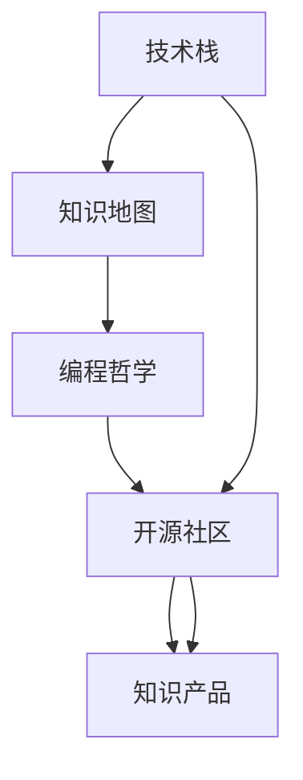

                 

# 从程序员到知识创业者的蜕变之路

> 关键词：技术创业, 知识产品, 编程哲学, 知识共享, 开源社区, 知识地图

## 1. 背景介绍

在当前这个快速变化的时代，程序员已经不再是一个单纯的代码编写者。随着技术的进步和社会的变革，越来越多的程序员开始探索自我实现的新途径——知识创业。知识创业者不仅将自己的技术能力作为产品的核心竞争力，更是将其转化为易于传播、易于应用的形态，从而创造出价值。

从程序员到知识创业者的蜕变之路，是一条既充满挑战又充满机遇的道路。它不仅需要深厚的技术背景，更需要清晰的思维、敏锐的洞察力、以及良好的市场感。本文将从技术、商业和人文三个角度，探讨这一蜕变之路上的关键要素和实践策略。

## 2. 核心概念与联系

### 2.1 核心概念概述

在探讨这一蜕变之路时，以下几个核心概念是必须要理解的：

- **技术栈**：程序员熟练掌握的技术集合，包括编程语言、框架、算法、工具等。
- **知识地图**：将知识进行系统化的组织和分类，便于用户查找和应用。
- **编程哲学**：程序员在编程过程中所遵循的理念和原则，包括代码质量、可维护性、可扩展性等。
- **开源社区**：程序员们基于共同目标和兴趣，自发组织起来的社区，致力于分享代码、交流技术、解决问题。
- **知识产品**：将技术知识和经验转化为易于使用、易于传播的形式，如书籍、博客、视频、应用等。

这些核心概念之间存在密切的联系，共同构成了知识创业的基础：

- 技术栈提供了知识创业的基石，是产品的技术实现基础。
- 知识地图帮助组织和呈现知识，使知识产品更加易用。
- 编程哲学指导编程实践，提升代码质量，增强产品的竞争力。
- 开源社区汇聚了程序员的力量，促进了知识的共享和技术的进步。
- 知识产品则是将技术知识转化为实际应用，创造了社会价值。

### 2.2 核心概念原理和架构的 Mermaid 流程图



这个流程图展示了核心概念之间的内在联系和转化路径。技术栈通过开源社区的贡献和合作，不断丰富和提升；编程哲学指导着技术栈和知识产品的设计；而知识地图则将技术栈和编程哲学的智慧，转化为易于理解和应用的知识产品。

## 3. 核心算法原理 & 具体操作步骤

### 3.1 算法原理概述

知识创业者的核心算法原理，可以概括为“数据驱动，技术赋能”。这意味着，知识创业者需要通过收集、分析和应用数据，找到市场和用户需求，再利用技术手段，创造出能够解决这些需求的知识产品。

具体来说，知识创业的算法原理包括以下几个关键步骤：

1. **需求分析**：通过市场调研、用户反馈等方式，收集数据，分析用户需求。
2. **需求匹配**：将用户需求与已有知识进行匹配，找到合适的解决方案。
3. **技术实现**：利用技术栈中的工具和框架，实现解决方案，生成知识产品。
4. **用户验证**：通过用户测试，验证知识产品的有效性和用户体验。
5. **迭代优化**：根据用户反馈，不断优化知识产品，提升其价值和竞争力。

### 3.2 算法步骤详解

以下详细讲解知识创业的具体操作步骤：

**Step 1: 需求分析**

1. **市场调研**：通过问卷调查、访谈等方式，收集目标市场的需求信息。
2. **用户画像**：构建用户画像，分析用户的背景、需求、行为等特征。
3. **数据收集**：通过线上线下渠道，收集与用户需求相关的数据。

**Step 2: 需求匹配**

1. **问题识别**：根据收集的数据，识别用户面临的具体问题。
2. **解决方案设计**：设计能够解决这些问题的知识产品原型。
3. **知识地图构建**：将解决方案中的关键知识，系统化地组织到知识地图中。

**Step 3: 技术实现**

1. **技术选型**：根据解决方案的需求，选择合适的技术栈。
2. **代码开发**：利用技术栈中的工具和框架，开发知识产品的核心功能。
3. **测试和优化**：进行单元测试、集成测试，确保代码质量和性能。

**Step 4: 用户验证**

1. **原型测试**：将知识产品原型提供给部分目标用户，收集反馈。
2. **用户调查**：通过问卷调查等方式，收集用户对知识产品的评价和建议。
3. **迭代改进**：根据用户反馈，优化知识产品，提升用户体验。

**Step 5: 市场推广**

1. **营销策略**：制定市场推广策略，选择合适的渠道和方式。
2. **内容制作**：制作吸引用户注意的内容，如博客文章、视频教程、社交媒体等。
3. **用户获取**：通过内容营销、社交媒体推广等方式，吸引目标用户。

### 3.3 算法优缺点

知识创业的算法具有以下优点：

- **高效灵活**：可以快速响应市场变化，迭代优化产品。
- **用户导向**：紧密围绕用户需求，提升产品价值。
- **技术赋能**：利用先进技术手段，提高产品的竞争力和用户体验。

同时，知识创业的算法也存在一些局限性：

- **数据依赖**：对数据的质量和量有较高要求，数据获取和分析成本较高。
- **技术门槛**：需要具备一定的技术背景和能力，入门门槛较高。
- **市场风险**：市场需求和用户反馈可能存在不确定性，需要持续验证和调整。

### 3.4 算法应用领域

知识创业的算法在多个领域都有广泛的应用：

- **技术教程**：将编程知识和技术栈的系统性介绍，转化为易于理解的视频教程、博客文章等形式。
- **开发工具**：基于开源社区的技术贡献，开发出更加高效、实用的编程工具和框架。
- **数据分析**：利用大数据技术和算法，为用户提供数据分析服务，帮助其做出更明智的决策。
- **在线教育**：将编程知识与在线教育技术结合，开发出互动性强的在线课程和学习平台。
- **知识共享**：利用开源社区的力量，构建知识共享平台，促进知识的传播和应用。

这些领域的应用，展示了知识创业的广泛潜力和市场前景。

## 4. 数学模型和公式 & 详细讲解 & 举例说明

### 4.1 数学模型构建

知识创业的数学模型构建，需要从数据收集、分析到产品设计的全过程。以下是一个简单的数学模型示例：

**需求分析模型**：
假设用户需求可以用 $X$ 来表示，市场调研数据可以用 $D$ 表示，则需求分析模型可以表示为：
$$
X = f(D)
$$
其中 $f$ 是一个映射函数，将市场调研数据转化为用户需求。

**需求匹配模型**：
假设解决方案可以用 $Y$ 来表示，用户需求和解决方案的关系可以用 $g$ 表示，则需求匹配模型可以表示为：
$$
Y = g(X)
$$
其中 $g$ 是一个映射函数，将用户需求映射到解决方案。

**技术实现模型**：
假设知识产品可以用 $P$ 来表示，技术栈和解决方案的关系可以用 $h$ 表示，则技术实现模型可以表示为：
$$
P = h(Y)
$$
其中 $h$ 是一个映射函数，将解决方案转化为知识产品。

### 4.2 公式推导过程

- **需求分析**：
$$
D = \{d_1, d_2, ..., d_n\}
$$
其中 $d_i$ 表示市场调研数据的第 $i$ 项。根据 $d_i$ 计算 $X$，可以通过以下公式：
$$
X = \sum_{i=1}^n w_id_i
$$
其中 $w_i$ 是第 $i$ 项数据的权重，根据调研数据的重要性和可靠性确定。

- **需求匹配**：
$$
Y = \{y_1, y_2, ..., y_m\}
$$
其中 $y_i$ 表示解决方案的第 $i$ 个要素。根据 $X$ 计算 $Y$，可以通过以下公式：
$$
Y = \{y_i | i \in X\}
$$

- **技术实现**：
$$
P = \{p_1, p_2, ..., p_k\}
$$
其中 $p_i$ 表示知识产品的第 $i$ 个特性。根据 $Y$ 计算 $P$，可以通过以下公式：
$$
P = \{p_i | i \in Y\}
$$

### 4.3 案例分析与讲解

以一个简单的在线教育平台为例：

**需求分析**：
- 市场调研数据：收集来自不同渠道的在线教育市场需求数据。
- 用户画像：构建目标用户画像，分析其学习习惯、需求等。
- 数据收集：通过问卷调查、访谈等方式，收集用户的学习需求。

**需求匹配**：
- 问题识别：识别用户在学习过程中遇到的主要问题。
- 解决方案设计：设计以视频课程、互动练习、在线答疑为主要内容的知识产品原型。
- 知识地图构建：将课程、练习、答疑等知识系统化组织到知识地图中。

**技术实现**：
- 技术选型：选择适合的视频编码、互动设计、数据存储等技术栈。
- 代码开发：开发视频课程录制、互动练习生成、在线答疑系统等功能。
- 测试和优化：进行系统测试、用户体验测试，优化知识产品的性能和用户体验。

**用户验证**：
- 原型测试：将原型提供给部分用户，收集反馈。
- 用户调查：通过问卷调查，收集用户对知识产品的评价和建议。
- 迭代改进：根据用户反馈，优化知识产品，提升用户体验。

**市场推广**：
- 营销策略：制定社交媒体营销、内容营销等策略。
- 内容制作：制作吸引用户注意的内容，如教学视频、用户体验报告等。
- 用户获取：通过社交媒体推广、搜索引擎优化等方式，吸引目标用户。

## 5. 项目实践：代码实例和详细解释说明

### 5.1 开发环境搭建

在进行知识创业的实践时，需要搭建一个开发环境，以便进行代码开发和测试。以下是搭建开发环境的详细步骤：

1. **安装开发工具**：
   - 安装 Python：选择 Python 3.x 版本，如 3.6、3.7 或 3.8。
   - 安装 IDE：如 PyCharm、VS Code 或 Sublime Text。
   - 安装版本控制系统：如 Git，用于代码管理和协作。

2. **安装开发库**：
   - 安装 Python 科学计算库：如 NumPy、Pandas、Matplotlib。
   - 安装 Web 开发库：如 Flask、Django。
   - 安装机器学习库：如 scikit-learn、TensorFlow、PyTorch。
   - 安装数据处理库：如 SQLAlchemy、Pymongo。

3. **搭建开发环境**：
   - 创建虚拟环境：使用 Python 的虚拟环境工具，如 venv，创建一个隔离的开发环境。
   - 安装依赖库：使用 pip 安装开发所需的库。

### 5.2 源代码详细实现

以下是一个简单的在线教育平台的代码实现示例：

**视频课程录制系统**：
```python
import cv2
from moviepy.editor import VideoFileClip, VideoStream

class VideoRecorder:
    def __init__(self, input_file, output_file):
        self.input_file = input_file
        self.output_file = output_file
    
    def record(self, start_time, end_time):
        clip = VideoFileClip(self.input_file)
        start, end = clip.get_time(self.start_time, self.end_time)
        output = clip.subclip(start, end)
        output.write_videofile(self.output_file)
```

**互动练习生成系统**：
```python
class Question:
    def __init__(self, question, options, correct_option):
        self.question = question
        self.options = options
        self.correct_option = correct_option
    
    def get_answer(self, user_answer):
        if user_answer == self.correct_option:
            return "Correct!"
        else:
            return "Incorrect. The correct answer is " + self.correct_option + "."

class PracticeGenerator:
    def __init__(self):
        self.questions = []
    
    def add_question(self, question):
        self.questions.append(question)
    
    def generate_practice(self):
        user_answer = input("Please choose your answer: ")
        for question in self.questions:
            feedback = question.get_answer(user_answer)
            print(feedback)
```

**在线答疑系统**：
```python
class QnA:
    def __init__(self):
        self.answers = {}
    
    def add_answer(self, question, answer):
        self.answers[question] = answer
    
    def get_answer(self, question):
        if question in self.answers:
            return self.answers[question]
        else:
            return "I'm sorry, I don't have an answer for that."
    
class QnADatabase:
    def __init__(self):
        self.qn_a = QnA()
    
    def ask_question(self, question):
        answer = self.qn_a.get_answer(question)
        print(answer)
```

### 5.3 代码解读与分析

**视频录制系统**：
- **实现思路**：通过 OpenCV 和 MoviePy 库，实现视频录制和剪辑。
- **关键代码**：`VideoFileClip.subclip(start, end)` 方法用于剪辑视频，`write_videofile()` 方法用于保存视频。

**互动练习生成系统**：
- **实现思路**：通过定义 `Question` 和 `PracticeGenerator` 类，实现互动练习的生成和管理。
- **关键代码**：`Question.get_answer()` 方法用于判断用户答案的正误，`PracticeGenerator.add_question()` 方法用于添加练习题。

**在线答疑系统**：
- **实现思路**：通过定义 `QnA` 和 `QnADatabase` 类，实现在线答疑。
- **关键代码**：`QnA.add_answer()` 方法用于添加FAQ，`QnADatabase.get_answer()` 方法用于查询FAQ。

### 5.4 运行结果展示

运行以上代码，可以通过命令行界面进行视频录制、练习生成和在线答疑。例如，使用以下命令录制视频：
```bash
python video_recorder.py /path/to/input.mp4 /path/to/output.mp4 00:00:00 00:00:30
```

## 6. 实际应用场景

### 6.1 在线教育平台

在线教育平台是一个典型的知识创业应用场景。通过将编程知识和技术栈的系统性介绍，转化为易于理解的视频教程、博客文章等形式，为学习者提供一站式的学习资源，显著提升了学习效率。

例如，Coursera 和 Udemy 等在线教育平台，通过收集用户的学习需求和反馈，不断迭代优化课程内容和教学方式，使得教育资源更加丰富、高效、易于获取。

### 6.2 编程社区

编程社区是知识创业者另一个重要的应用场景。通过搭建开源社区，促进程序员之间的知识共享和交流，提升编程水平和技术能力。

例如，Stack Overflow 和 GitHub 等社区，通过提供丰富的代码库和讨论平台，汇聚了全球的程序员力量，构建了一个庞大、活跃的知识共享生态系统。

### 6.3 企业内部培训

企业内部培训也是一个知识创业的应用场景。通过将企业内部积累的技术经验和知识，系统化地整理成培训课程和文档，提升员工的技术能力和业务水平。

例如，谷歌和微软等企业，通过搭建内部的在线培训平台，结合公司的实际业务需求，提供定制化的技术培训和课程，帮助员工快速掌握新技术，提升工作效率。

### 6.4 未来应用展望

未来的知识创业，将进一步拓展到更多的领域和场景，为社会带来更多的价值和变革。

- **智慧医疗**：利用编程知识和技术栈，构建智能医疗系统，提升医疗服务的智能化水平，辅助医生诊疗，加速新药开发进程。
- **智能城市**：结合编程知识和城市治理需求，构建智能城市管理系统，提高城市管理的自动化和智能化水平，构建更安全、高效的未来城市。
- **教育公平**：利用编程知识和教育需求，构建普及性强的在线教育平台，因材施教，促进教育公平，提高教学质量。

## 7. 工具和资源推荐

### 7.1 学习资源推荐

为了帮助知识创业者系统掌握编程技术、知识管理和创业实践，这里推荐一些优质的学习资源：

1. **《编程珠玑》（The Art of Computer Programming）**：由计算机图灵奖获得者 Donald E. Knuth 所著，深入浅出地介绍了编程技术和算法思想，是程序员的经典读物。
2. **Coursera 和 Udemy**：提供来自世界顶尖大学和企业的在线课程，涵盖编程、数据科学、人工智能等多个领域。
3. **Stack Overflow**：程序员们交流技术问题、分享代码的社区，提供了丰富的编程资源和学习经验。
4. **GitHub**：全球最大的代码托管平台，汇聚了丰富的开源项目和技术社区，是学习编程和贡献代码的好去处。
5. **Open Educational Resources (OER)**：提供免费的教育资源，包括教材、课程、习题等，助力知识共享和教育公平。

### 7.2 开发工具推荐

高效的工具和资源，是知识创业的重要支撑。以下是几款推荐的工具：

1. **PyCharm**：一款功能强大的 Python IDE，支持代码编辑、调试、测试等多种功能，适合 Python 开发。
2. **VS Code**：一款轻量级的代码编辑器，支持多种编程语言和插件，灵活性高。
3. **Jupyter Notebook**：一款交互式编程环境，支持多种编程语言和数据科学库，适合数据可视化和科学计算。
4. **Git**：一款版本控制系统，支持代码管理、协作和分支管理，是团队开发的基础工具。
5. **Docker**：一款容器化平台，支持跨平台运行和部署，适合构建稳定的开发环境。

### 7.3 相关论文推荐

知识创业的实践需要扎实的理论基础，以下是几篇相关的经典论文：

1. **《软件开发的艺术》（The Art of Software Development）**：Donal Knuth 所著，系统介绍了软件开发的技术和哲学，是程序员的必读之作。
2. **《编程：核心概念》（Programming: The Core Concepts）**：John Hunt 所著，通过实例讲解编程的核心概念和设计思想。
3. **《数据科学实战》（Data Science for Business）**：Peter Datah 所著，介绍了数据科学在商业中的应用和实践，适合企业数据科学团队学习。
4. **《深度学习》（Deep Learning）**：Ian Goodfellow 所著，系统介绍了深度学习的理论和实践，是人工智能研究的重要教材。
5. **《面向对象编程的艺术》（The Art of Object-Oriented Programming）**：Sandi Metz 和 Katrina Owen 所著，通过实例讲解面向对象编程的设计和实践。

## 8. 总结：未来发展趋势与挑战

### 8.1 研究成果总结

知识创业从根本上改变了程序员的角色和价值。它不仅推动了技术的发展和传播，更促进了知识的共享和应用，提升了社会整体的创新能力和竞争力。

### 8.2 未来发展趋势

未来的知识创业将呈现出以下几个发展趋势：

- **自动化和智能化**：随着 AI 和机器学习技术的发展，自动化编程和智能化开发将成为主流，显著提升开发效率和质量。
- **跨领域融合**：知识创业将突破传统的技术边界，与金融、医疗、教育等更多领域进行深度融合，推动各行业的数字化转型。
- **社区化和开源化**：开源社区将成为知识创业的重要基础设施，汇聚全球的编程力量，构建知识共享的生态系统。
- **个性化和定制化**：通过大数据和机器学习技术，实现知识产品和服务的个性化和定制化，提升用户体验和满意度。
- **可持续发展**：知识创业将更加注重社会和环境责任，推动可持续发展的理念和技术应用。

### 8.3 面临的挑战

尽管知识创业的前景广阔，但在发展的过程中也面临诸多挑战：

- **数据隐私和安全**：随着数据在知识创业中的重要性提升，如何保障用户数据隐私和安全，将成为关键问题。
- **知识碎片化**：如何在碎片化的知识海洋中，系统化和结构化地组织和呈现知识，提升知识产品的可读性和可用性。
- **技术壁垒**：知识创业的门槛较高，需要具备一定的技术背景和能力，如何降低入门门槛，普及知识创业的理念和技术。
- **商业化难度**：如何将知识产品商业化，并实现持续的收入和盈利，是知识创业者面临的重要挑战。
- **用户需求多样化**：用户需求和场景各异，如何针对不同的用户群体，提供多样化的知识产品和服务，满足用户的个性化需求。

### 8.4 研究展望

未来的知识创业研究，需要在以下几个方面进行深入探索：

- **知识图谱与语义网络**：通过构建知识图谱和语义网络，实现知识之间的关联和推理，提升知识产品的深度和广度。
- **深度学习和自然语言处理**：利用深度学习和自然语言处理技术，提升知识产品的智能化水平，增强知识产品的吸引力和应用效果。
- **社会化和协作化**：通过社会化和协作化的知识管理方式，增强知识产品的互动性和参与性，提升知识创业的社会价值。
- **跨文化和跨语言**：实现跨文化和跨语言的智能知识产品，促进全球范围内的知识共享和应用。
- **持续学习和自我优化**：构建自适应和自优化的知识创业系统，实现知识的持续学习和自我优化，保持知识的动态更新和活力。

## 9. 附录：常见问题与解答

**Q1: 知识创业与传统软件开发有什么区别？**

A: 知识创业与传统软件开发的区别主要在于其目标和价值导向不同。知识创业更加注重知识的传播和应用，提升社会整体的创新能力和竞争力；而传统软件开发则侧重于技术的实现和商业价值的创造。

**Q2: 知识创业需要哪些关键技能？**

A: 知识创业需要具备以下关键技能：
- 编程和算法技能：扎实的编程基础和算法知识，是知识创业的技术保障。
- 系统设计和架构能力：能够设计可扩展、易维护的知识产品系统，是知识创业的重要能力。
- 数据处理和分析技能：具备数据分析和处理能力，能够从数据中提取有价值的信息，指导知识创业的决策和优化。
- 市场营销和用户研究技能：了解市场和用户需求，能够制定有效的市场推广策略和用户研究方法，促进知识产品的传播和应用。
- 项目管理能力：具备项目管理的基本知识和技能，能够高效地管理和推进知识创业项目。

**Q3: 如何选择合适的知识创业方向？**

A: 选择合适的知识创业方向，需要考虑以下几个因素：
- 市场需求：分析市场需求，选择有潜力的方向，如在线教育、编程社区、企业内部培训等。
- 个人兴趣和专长：选择自己感兴趣且擅长的领域，提升创业的热情和动力。
- 资源和能力：评估自身资源和能力，选择匹配度高的方向，降低创业的风险和难度。
- 社会价值：考虑创业的社会价值和影响，选择有社会效益的方向，如智慧医疗、智能城市等。

**Q4: 知识创业的商业模式有哪些？**

A: 知识创业的商业模式主要包括：
- 订阅模式：通过收费订阅，提供持续的知识服务和内容更新。
- 广告模式：通过广告收入，支持免费知识产品的开发和运营。
- 授权模式：将知识产品授权给其他企业或机构使用，获取授权费用。
- 自营模式：通过自身运营和销售，实现知识产品的商业化。
- 众筹模式：通过众筹平台筹集资金，支持知识创业的开发和推广。

**Q5: 知识创业的难点有哪些？**

A: 知识创业的难点主要在于：
- 市场准入门槛高：需要具备一定的技术背景和能力，对于初学者门槛较高。
- 数据隐私和安全：需要保护用户数据的隐私和安全，避免数据泄露和滥用。
- 知识碎片化：如何将碎片化的知识系统化、结构化，提升知识产品的可读性和可用性。
- 商业化难度大：需要找到有效的商业化模式，实现持续的收入和盈利。
- 用户需求多样化：需要针对不同的用户群体，提供多样化的知识产品和服务，满足个性化需求。

---

作者：禅与计算机程序设计艺术 / Zen and the Art of Computer Programming

