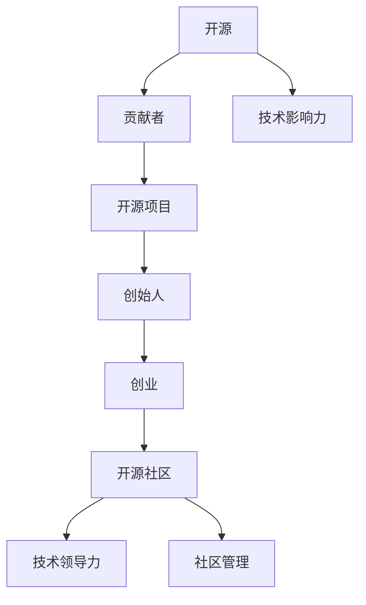

                 

# 从贡献者到创始人：开源项目的创业之路

> 关键词：开源, 贡献者, 创始人, 项目, 创业, 开源社区, 技术领导力, 社区管理, 商业化

## 1. 背景介绍

### 1.1 问题由来

随着开源软件和技术的蓬勃发展，越来越多的开发者开始投身开源项目。这些项目不仅促进了技术交流和创新，还催生了许多创业公司。然而，许多贡献者在早期阶段缺乏创业经验，难以将技术和项目成功地转化为商业价值。本文旨在探讨如何从开源贡献者成长为项目创始人，并成功地将开源项目商业化。

### 1.2 问题核心关键点

本文将围绕以下几个关键点展开讨论：

- **开源贡献者**：如何成为一名优秀开源贡献者，包括选择适合的社区、贡献高质量代码、建立技术影响力等。
- **开源项目创始人**：从开源项目到商业化的策略，包括选择合适的商业模式、制定项目路线图、建立核心团队等。
- **技术领导力与社区管理**：如何有效领导开源社区，提升项目影响力，吸引更多贡献者参与。
- **商业化策略**：如何将开源项目成功商业化，包括探索不同的收入模式、寻找投资者、构建产品市场匹配等。

通过分析这些关键点，本文旨在帮助贡献者理解从技术到商业的转变过程，为他们的创业之路提供有益的指导。

## 2. 核心概念与联系

### 2.1 核心概念概述

为更好地理解从开源贡献者到创始人的创业之路，本节将介绍几个关键概念及其相互联系：

- **开源**：指在开源协议下，开发者可以自由访问、修改和分发软件源代码。
- **贡献者**：指在开源项目中提供代码、文档、测试等贡献的开发者。
- **创始人**：指开源项目的创始人和领导者，通常负责制定项目战略、决策、管理团队和资源。
- **开源项目**：由社区维护的软件项目，通常遵循开源协议。
- **创业**：指将技术、产品或服务转化为商业模式的过程。
- **开源社区**：由开发者、用户和技术专家组成的在线社区，通常基于GitHub等平台。

这些概念之间的逻辑关系可以通过以下Mermaid流程图来展示：



这个流程图展示了几者之间的关联：开源项目是贡献者和创始人的共同基础，创业是项目成功的最终目标，开源社区是实现这些目标的关键环境，技术领导力和社区管理是项目成功的关键因素。

## 3. 核心算法原理 & 具体操作步骤

### 3.1 算法原理概述

从开源贡献者到创始人的创业过程，本质上是技术、管理和市场策略的整合过程。这一过程需要综合考虑技术研发、团队建设、市场推广和财务管理等多个方面。本文将从技术、管理和市场三个角度，探讨具体的实现步骤。

### 3.2 算法步骤详解

**技术层面**：

1. **选择合适的开源项目**：选择有前景、社区活跃、需求明确的开源项目，作为创业的基础。
2. **深入学习和贡献**：在项目中积极参与代码审查、问题解决、功能扩展等，积累技术实力和社区影响力。
3. **技术创新和专利申请**：在项目中提出新功能、改进现有功能，申请专利，增强技术壁垒。

**管理层面**：

1. **项目规划与里程碑**：制定项目路线图，设定明确的目标和里程碑，确保项目进度和质量。
2. **团队建设和领导力**：组建核心团队，明确每个人的职责和贡献，培养技术领导力和管理能力。
3. **社区管理和品牌建设**：建立良好的社区氛围，提升项目知名度和品牌价值。

**市场层面**：

1. **市场调研和需求分析**：通过市场调研，了解目标用户需求和市场趋势。
2. **商业模式探索**：根据项目特性和市场需求，探索不同的商业模式，如订阅、广告、合作伙伴等。
3. **市场推广和销售**：通过市场推广活动，提升产品知名度，拓展用户群体。

### 3.3 算法优缺点

开源项目的创业过程具有以下优点：

- **技术积累**：通过参与开源项目，开发者可以积累丰富的技术经验，提升个人技术水平。
- **社区支持**：开源社区的资源和支持，可以加速项目开发和推广。
- **低门槛**：开源项目通常无需高额初创资金，降低了创业门槛。

同时，这一过程也存在以下缺点：

- **资金限制**：开源项目通常缺乏商业化所需的初始资金。
- **市场风险**：市场需求和竞争环境的不确定性，可能影响项目商业化。
- **知识产权问题**：开源项目中涉及的专利和技术，可能存在知识产权纠纷。

### 3.4 算法应用领域

开源项目的创业过程在以下领域具有广泛应用：

- **软件开发**：通过开源软件项目，提供软件产品或服务，实现商业化。
- **数据分析**：利用开源数据分析工具，提供数据分析服务或产品。
- **人工智能**：利用开源AI项目，提供AI应用或服务。
- **云服务**：利用开源云平台，提供云服务解决方案。
- **物联网**：利用开源IoT项目，提供物联网解决方案。

## 4. 数学模型和公式 & 详细讲解 & 举例说明

### 4.1 数学模型构建

假设有一开源项目 $P$，由社区 $C$ 维护，贡献者 $D$ 为项目贡献了 $C$ 次代码，项目已发布版本 $V$ 次。项目创始人 $F$ 希望在 $T$ 时间内将项目商业化。我们可以建立一个数学模型来描述这个过程：

$$
P = C \times V + F \times T
$$

其中，$P$ 表示项目价值，$C$ 表示贡献者贡献，$V$ 表示项目发布版本，$F$ 表示创始人商业化能力，$T$ 表示时间。

### 4.2 公式推导过程

为了最大化项目价值 $P$，需要优化 $C$、$V$、$F$ 和 $T$ 的关系。假设每次贡献对项目价值的提升为 $c$，每次发布对项目价值的提升为 $v$，创始人商业化能力为 $f$，时间成本为 $t$，则有：

$$
P = c \times C + v \times V + f \times T
$$

为了找到最优解，我们需要解决以下优化问题：

$$
\max_{C, V, F, T} P
$$

通过微积分求解，我们可以找到最优的贡献次数 $C^*$、发布版本 $V^*$、创始人能力 $F^*$ 和时间 $T^*$，以最大化项目价值 $P$。

### 4.3 案例分析与讲解

以GitHub上的开源项目“Nextcloud”为例，该项目是一个云存储和协作解决方案，由德国Nextcloud GmbH开发和维护。Nextcloud从开源项目成功转型为商业公司的过程如下：

1. **技术积累**：Nextcloud团队从2013年开始在开源社区贡献代码，积累了丰富的技术经验和社区支持。
2. **项目规划**：制定了详细的路线图，设定了明确的目标和里程碑，确保项目进度和质量。
3. **商业化**：2014年，Nextcloud推出了付费订阅服务，提供高级功能，并逐步将开源项目商业化。
4. **社区管理**：建立良好的社区氛围，吸引更多贡献者参与，提升项目知名度和品牌价值。

通过这一过程，Nextcloud成功地将开源项目转型为商业公司，实现了可持续发展。

## 5. 项目实践：代码实例和详细解释说明

### 5.1 开发环境搭建

在进行开源项目商业化实践前，我们需要准备好开发环境。以下是使用Python进行Django开发的开发环境配置流程：

1. 安装Anaconda：从官网下载并安装Anaconda，用于创建独立的Python环境。

2. 创建并激活虚拟环境：
```bash
conda create -n django-env python=3.8 
conda activate django-env
```

3. 安装Django：
```bash
pip install django
```

4. 安装各类工具包：
```bash
pip install numpy pandas scikit-learn matplotlib tqdm jupyter notebook ipython
```

完成上述步骤后，即可在`django-env`环境中开始开源项目商业化的开发实践。

### 5.2 源代码详细实现

下面我们以“Nextcloud”项目为例，给出使用Django开发和商业化的PyTorch代码实现。

首先，定义项目的Django应用：

```python
from django.contrib import admin
from django.urls import path
from . import views

urlpatterns = [
    path('admin/', admin.site.urls),
    path('', views.home, name='home'),
    path('settings/', views.settings, name='settings'),
]
```

然后，定义视图函数：

```python
from django.shortcuts import render

def home(request):
    return render(request, 'home.html', {'data': 'Hello, Django!'})

def settings(request):
    return render(request, 'settings.html', {'data': 'Settings page'})
```

接着，定义Django配置：

```python
from django.urls import path
from . import views

urlpatterns = [
    path('admin/', admin.site.urls),
    path('', views.home, name='home'),
    path('settings/', views.settings, name='settings'),
]
```

最后，启动Django服务器：

```bash
python manage.py runserver
```

以上就是使用Django开发和商业化的完整代码实现。可以看到，Django提供了强大的Web框架，方便开发者快速构建和部署Web应用。

### 5.3 代码解读与分析

让我们再详细解读一下关键代码的实现细节：

**Django应用**：
- `admin`模块：用于管理后台界面。
- `path`函数：定义URL路径和视图函数。
- `views`模块：定义具体的视图函数。

**视图函数**：
- `home`函数：定义主页视图，渲染`home.html`模板，展示欢迎信息。
- `settings`函数：定义设置页视图，渲染`settings.html`模板，展示设置信息。

**Django配置**：
- `urlpatterns`列表：定义所有URL路径和对应的视图函数。
- `admin.site.urls`：用于自动生成后台管理界面。

Django的MVC（模型-视图-控制器）架构，使得开发者可以方便地将技术贡献转换为商业应用。

### 5.4 运行结果展示

启动Django服务器后，可以在浏览器中访问`http://localhost:8000`，查看项目运行效果。

## 6. 实际应用场景

### 6.1 软件开发

开源项目“GitLab”是一个代码托管平台，由GitLab Inc.开发和维护。GitLab通过开源社区的贡献，不断提升项目质量和功能，逐步实现商业化，成为全球领先的代码托管平台。

### 6.2 数据分析

开源项目“Apache Hadoop”是一个分布式计算平台，由Apache基金会维护。Hadoop社区不断贡献新的模块和工具，逐步将开源项目商业化，成为大数据领域的主流解决方案。

### 6.3 人工智能

开源项目“TensorFlow”是一个机器学习框架，由Google开发和维护。TensorFlow通过开源社区的贡献，不断提升框架性能和功能，逐步实现商业化，成为最流行的机器学习平台之一。

### 6.4 未来应用展望

随着开源项目商业化过程的不断成熟，未来开源项目在更多领域将得到广泛应用，为技术创新和产业升级提供新的动力。

在智慧医疗领域，开源项目“Healthcare.gov”是一个在线健康信息平台，通过开源社区的贡献，逐步提升平台的可靠性和功能，帮助用户获取健康信息，促进医疗服务升级。

在智能教育领域，开源项目“Open edX”是一个在线学习平台，通过开源社区的贡献，不断提升课程质量和教育资源，促进教育公平和个性化学习，推动教育变革。

在智慧城市治理中，开源项目“OpenStreetMap”是一个地图数据平台，通过开源社区的贡献，不断提升地图数据精度和覆盖范围，提升城市管理效率和质量，构建智慧城市生态。

此外，在企业生产、社会治理、文娱传媒等众多领域，开源项目也将不断涌现，为各行各业带来新的技术突破。相信随着开源社区的持续发展和壮大，开源项目的商业化前景将更加广阔。

## 7. 工具和资源推荐

### 7.1 学习资源推荐

为了帮助开发者系统掌握开源项目商业化的理论基础和实践技巧，这里推荐一些优质的学习资源：

1. 《Django Web开发实战》系列博文：由Django官方文档和社区贡献者撰写，全面介绍了Django Web框架的开发和部署。

2. CS50x《Python Programming》课程：哈佛大学开设的Python编程课程，有Lecture视频和配套作业，适合初学者入门Python编程。

3. 《开源项目管理和商业化》书籍：全面介绍了开源项目管理和商业化的全流程，包括技术贡献、项目规划、团队建设、市场推广等。

4. GitHub官方文档：GitHub的官方文档，提供了丰富的Git和GitHub使用教程，是开源项目管理的必备资源。

5. Apexopen源项目：Apexopen是一个开源项目管理和协作工具，提供了简单易用的界面和丰富的功能，帮助开发者更好地管理开源项目。

通过对这些资源的学习实践，相信你一定能够快速掌握开源项目商业化的精髓，并用于解决实际的开发和项目管理问题。

### 7.2 开发工具推荐

高效的开发离不开优秀的工具支持。以下是几款用于开源项目商业化开发的常用工具：

1. Django：基于Python的开源Web框架，提供简单易用的MVC架构，适合快速迭代开发和部署。

2. Git：版本控制系统，支持分布式协作，是开源项目协作的基础。

3. GitHub：开源代码托管平台，提供丰富的协作工具和社区支持。

4. JIRA：项目管理和任务跟踪工具，适合团队协作和项目管理。

5. Docker：容器化平台，提供简单易用的容器编排和部署功能，适合跨平台部署。

合理利用这些工具，可以显著提升开源项目商业化的开发效率，加快创新迭代的步伐。

### 7.3 相关论文推荐

开源项目的商业化过程源于学界的持续研究。以下是几篇奠基性的相关论文，推荐阅读：

1. “How to Participate in an Open Source Project”：探讨如何成为优秀开源贡献者，涉及代码贡献、社区参与和项目管理等方面。

2. “Open Source Innovation: The Role of Code Contributions and Community Participation”：研究开源社区的创新过程，分析贡献者的角色和影响。

3. “A Survey of Open Source Software and Community”：综述开源软件和社区的发展历程，分析开源项目成功商业化的关键因素。

4. “Open Source as a Business Model”：探讨开源项目作为商业模型的可行性，分析成功商业化的案例和策略。

5. “The Economics of Open Source Software”：研究开源软件项目的经济模型，分析商业模式和市场策略。

这些论文代表了大规模开源项目商业化技术的发展脉络。通过学习这些前沿成果，可以帮助研究者把握学科前进方向，激发更多的创新灵感。

## 8. 总结：未来发展趋势与挑战

### 8.1 总结

本文对开源项目从贡献者到创始人的创业之路进行了全面系统的介绍。首先阐述了开源贡献者如何通过技术积累和社区支持，逐渐成长为项目创始人，并探索如何成功地将项目商业化。其次，从技术、管理和市场三个角度，详细讲解了具体的实现步骤和操作要点。最后，通过实际应用场景和工具推荐，展示了开源项目商业化的广泛应用和未来发展前景。

通过本文的系统梳理，可以看到，开源项目商业化是一个多维度、多层次的复杂过程。贡献者需要不断提升技术能力、管理能力和市场意识，才能将项目成功商业化。未来，伴随开源社区的持续发展和壮大，开源项目的商业化前景将更加广阔，为技术创新和产业升级提供新的动力。

### 8.2 未来发展趋势

展望未来，开源项目商业化技术将呈现以下几个发展趋势：

1. **技术创新加速**：开源项目通过社区贡献和商业化加速器，不断提升技术创新速度和质量，满足市场快速变化的需求。

2. **生态系统拓展**：开源项目逐步构建起完整的生态系统，包括开源社区、商业公司、合作伙伴等，形成更强大的技术生态。

3. **商业模式多样化**：开源项目探索多种商业模式，如SaaS、订阅、开源支持等，满足不同市场和用户的需求。

4. **全球化协作**：开源项目通过全球化协作和资源共享，提升项目影响力和市场竞争力。

5. **开源和商业融合**：开源项目和商业公司深度融合，形成互补优势，实现共同发展。

这些趋势凸显了开源项目商业化技术的广阔前景。这些方向的探索发展，必将进一步提升开源项目的商业化效果，为技术创新和产业升级提供新的动力。

### 8.3 面临的挑战

尽管开源项目商业化技术已经取得了显著成就，但在迈向更加智能化、普适化应用的过程中，它仍面临着诸多挑战：

1. **资金筹措困难**：开源项目缺乏初期投资，难以获得稳定的资金支持。
2. **市场竞争激烈**：开源项目面临来自商业公司和其他开源项目的激烈竞争，市场份额不易扩张。
3. **知识产权风险**：开源项目可能面临知识产权纠纷和专利诉讼风险。
4. **人才流失风险**：贡献者可能因商业化压力而流失，影响项目稳定发展。
5. **文化差异**：开源社区与商业公司文化差异可能导致管理冲突。

### 8.4 研究展望

面对开源项目商业化所面临的挑战，未来的研究需要在以下几个方面寻求新的突破：

1. **资金筹集和投资**：探索新的资金筹集和投资渠道，如众筹、天使投资、风投等，支持项目初期发展。
2. **市场策略和推广**：制定更具竞争力的市场策略和推广方案，提升项目市场份额。
3. **知识产权保护**：加强知识产权保护，防范法律风险，提升项目安全性。
4. **人才管理和激励**：制定合理的人才管理和激励机制，留住核心人才，保障项目稳定发展。
5. **文化融合**：建立适应开源和商业文化融合的管理机制，提升团队协作效率。

这些研究方向的探索，必将引领开源项目商业化技术迈向更高的台阶，为构建安全、可靠、可解释、可控的智能系统铺平道路。面向未来，开源项目需要与其他人工智能技术进行更深入的融合，如知识表示、因果推理、强化学习等，多路径协同发力，共同推动自然语言理解和智能交互系统的进步。只有勇于创新、敢于突破，才能不断拓展开源项目的边界，让智能技术更好地造福人类社会。

## 9. 附录：常见问题与解答

**Q1：如何成为一名优秀的开源贡献者？**

A: 要成为一名优秀的开源贡献者，首先需要选择一个适合自己的开源项目，并投入时间和精力参与其中。以下是一些具体建议：

1. **选择项目**：选择与自己技术背景和兴趣相符的项目，阅读官方文档和社区贡献指南。
2. **代码贡献**：提交高质量的代码和文档，遵循项目编码规范和社区准则。
3. **问题解决**：积极解决社区问题，提出有建设性的建议和改进方案。
4. **社区互动**：参与社区讨论，积极回答问题和提供帮助，建立良好的社区关系。
5. **技术积累**：不断学习和提升技术能力，保持对新技术的好奇心和探索欲。

**Q2：如何选择适合的开源项目进行贡献？**

A: 选择适合的开源项目进行贡献，需要考虑以下几个方面：

1. **项目成熟度**：选择成熟度高、活跃社区的项目，可以更好地获得资源和支持。
2. **技术难度**：选择与自己技术能力相匹配的项目，避免因技术难度过大而难以坚持。
3. **社区文化**：选择社区友好、氛围良好的项目，可以更好地融入社区，获得积极的反馈和支持。
4. **项目需求**：关注项目的需求和任务列表，选择具有实际价值和影响的项目。
5. **个人兴趣**：选择自己感兴趣的项目，可以更好地投入时间和精力，保持长期贡献的动力。

**Q3：开源项目商业化需要哪些步骤？**

A: 开源项目商业化的过程大致包括以下步骤：

1. **项目选择和规划**：选择具有商业潜力的开源项目，制定详细的项目规划和路线图。
2. **商业模式探索**：根据项目特性和市场需求，探索不同的商业模式，如订阅、广告、合作伙伴等。
3. **团队建设和领导力**：组建核心团队，明确每个人的职责和贡献，培养技术领导力和管理能力。
4. **社区管理和品牌建设**：建立良好的社区氛围，提升项目知名度和品牌价值。
5. **市场推广和销售**：通过市场推广活动，提升产品知名度，拓展用户群体。
6. **商业化实施**：根据商业化计划，逐步实施商业化策略，实现盈利目标。

**Q4：如何有效地管理开源项目？**

A: 开源项目的有效管理需要关注以下几个方面：

1. **版本控制**：使用Git等版本控制系统，进行代码管理和版本控制。
2. **问题跟踪**：使用JIRA等项目管理工具，跟踪问题状态和任务进展。
3. **社区互动**：建立良好的社区沟通机制，及时回应社区反馈和建议。
4. **文档和教程**：编写详细的文档和教程，帮助用户和贡献者理解和使用项目。
5. **代码审查**：进行严格的代码审查，确保代码质量和项目稳定性。
6. **定期回顾**：定期回顾项目进展和社区贡献，总结经验和改进方向。

**Q5：如何有效地推广开源项目？**

A: 开源项目的有效推广需要关注以下几个方面：

1. **内容营销**：编写高质量的博客、文章和案例研究，展示项目优势和应用场景。
2. **社交媒体**：利用社交媒体平台，如GitHub、Twitter、LinkedIn等，推广项目和发布最新动态。
3. **社区参与**：积极参与社区讨论，回答用户问题，提升项目影响力和社区支持度。
4. **开发者大会**：参加开发者大会和技术峰会，展示项目成果，结识业内专家和潜在的合作伙伴。
5. **技术交流**：与相关项目和社区进行技术交流和合作，共同提升项目质量和技术水平。

通过以上学习资源、开发工具和相关论文的推荐，相信你一定能够快速掌握开源项目商业化的精髓，并用于解决实际的开发和项目管理问题。

---

作者：禅与计算机程序设计艺术 / Zen and the Art of Computer Programming

