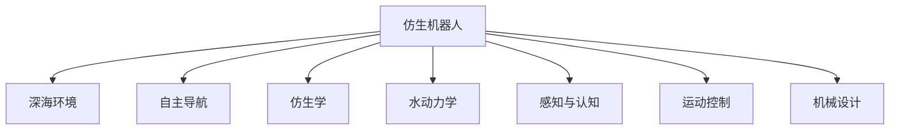

                 

# 仿生机器人在深海探索中的应用：模仿海洋生物

> 关键词：仿生机器人,深海探索,海洋生物,仿生学,自主导航,深海环境

## 1. 背景介绍

### 1.1 问题由来
随着科技的发展，人类对于深海探索的需求越来越强烈。然而，由于深海环境的极端性和未知性，传统的海洋勘探方法难以应对复杂多变的海洋环境。于是，科学家们开始思考能否通过仿生学的方法，制造出能够适应深海环境的机器人。

### 1.2 问题核心关键点
仿生机器人的核心在于模仿海洋生物的运动特性，使之在深海环境中实现自主导航和探索。目前，科学家们已经成功仿制了许多海洋生物的特性，包括海豚的流线型身体、章鱼的灵活手臂、鱼类的游泳姿态等。

### 1.3 问题研究意义
仿生机器人技术不仅能够提升深海探索的效率，还能降低人力成本，提高勘探的安全性和可靠性。在未来，仿生机器人有望在海洋资源开发、海底环境保护、深海地质研究等领域发挥重要作用。

## 2. 核心概念与联系

### 2.1 核心概念概述

为更好地理解仿生机器人的深海探索应用，本节将介绍几个密切相关的核心概念：

- 仿生机器人(Biomimetic Robot)：模仿生物运动特性进行自主导航和探索的机器人。其设计灵感来源于自然界中的生物，如鱼类、章鱼、海豚等。

- 深海环境(Underwater Environment)：深度超过3000米的海洋区域，由于高压、低温、暗无天日等特点，具有极高的探索难度。

- 自主导航(Autonomous Navigation)：指机器人无需人类干预，能够自主规划路径、避障并达到目的地的能力。

- 仿生学(Biomimetics)：研究生物运动和行为，并应用到工程设计和机器人学中的科学。

- 水动力学(Hydrodynamics)：研究液体中物体的运动规律，应用于仿生机器人的设计中。

- 感知与认知(Perception and Cognition)：仿生机器人的核心能力之一，包括视觉、声纳、压力传感器等，用于感知环境并做出智能决策。

- 运动控制(Motion Control)：机器人的硬件实现，包括电机、关节、液压等系统，确保机器人在水下能够灵活运动。

- 机械设计(Mechanical Design)：仿生机器人的硬件和软件设计，融合生物运动特性和工程需求，确保其能够在极端环境下正常工作。

这些核心概念之间的逻辑关系可以通过以下Mermaid流程图来展示：



这个流程图展示了一系列与仿生机器人深海探索密切相关的核心概念及其之间的关系：

1. 仿生机器人作为主体，具备自主导航、仿生学、水动力学、感知与认知、运动控制、机械设计等能力。
2. 自主导航使机器人能够自主完成勘探任务，无需人工干预。
3. 仿生学从生物特性中获取设计灵感，应用于仿生机器人的运动设计。
4. 水动力学研究液体中物体的运动规律，确保机器人能够适应深海环境。
5. 感知与认知使机器人能够感知深海环境，并进行智能决策。
6. 运动控制确保机器人能够在深海环境中灵活运动。
7. 机械设计将上述各项能力融合在一起，形成具体的硬件和软件设计方案。

这些概念共同构成了仿生机器人在深海探索的实现基础，为其提供了必要的技术支撑。

## 3. 核心算法原理 & 具体操作步骤
### 3.1 算法原理概述

仿生机器人在深海探索中应用的核心算法包括仿生学、水动力学、感知与认知、运动控制等，下面将分别介绍这些核心算法的原理：

- 仿生学：通过研究海洋生物的运动和行为，应用到机器人的设计中。例如，海豚的流线型身体、章鱼的柔软手臂、鱼的游泳姿态等特性，都可以被仿生机器人借鉴。

- 水动力学：研究液体中物体的运动规律，应用于仿生机器人的设计中。例如，通过仿生学的研究，可以得知鱼类在游泳时如何通过尾鳍摆动产生前进动力，进而设计出能够模仿这一特性的水下推进器。

- 感知与认知：仿生机器人通过安装各种传感器，实时获取水下环境信息，并利用机器学习算法进行处理。例如，通过安装声纳传感器，机器人可以获取周围环境的声音信息，进行障碍物检测和定位。

- 运动控制：仿生机器人的运动控制算法需考虑水下环境的特殊性，包括流体阻力、浮力、惯性等，设计出高效的推进和操纵算法。例如，鱼类的游泳策略就是通过摆动尾鳍和调整身体姿态来前进，仿生机器人可以借鉴这一策略进行水下导航。

### 3.2 算法步骤详解

以下将以仿生机器人在深海中的自主导航为例，详细介绍其算法步骤：

**Step 1: 传感器数据采集**
- 使用声纳传感器采集周围环境的水声信息。
- 使用压力传感器测量机器人所处深度和水温。
- 使用视觉传感器获取周围环境的光照情况。

**Step 2: 环境信息处理**
- 将传感器采集的数据进行预处理，去除噪声，提取有用的信息。
- 使用机器学习算法（如深度学习）对环境数据进行处理，识别障碍物、水温、光照等关键信息。

**Step 3: 路径规划**
- 利用计算机视觉技术对周围环境进行建模，生成环境地图。
- 利用图搜索算法（如A*算法）进行路径规划，确保机器人能够安全、高效地前进。
- 根据实时环境信息，动态调整路径规划策略，避免障碍物。

**Step 4: 运动控制**
- 使用运动控制算法（如PID控制）实现机器人的推进和转向。
- 通过仿生学的研究，设计出能够模仿生物运动特性的推进器。
- 根据环境信息和目标位置，计算出推进器和舵面的控制参数，实现精确的运动控制。

**Step 5: 系统集成**
- 将感知与认知、路径规划、运动控制等模块集成到仿生机器人中。
- 通过仿真实验验证算法效果，进行必要的调整优化。
- 部署到深海环境中，进行实际测试，确保机器人能够稳定运行。

### 3.3 算法优缺点

仿生机器人在深海探索中的应用具有以下优点：

1. 适应性强：仿生机器人可以借鉴海洋生物的运动特性，适应深海环境的复杂多变性。
2. 自主性高：通过自主导航和感知系统，仿生机器人能够独立完成任务，无需人工干预。
3. 安全性高：仿生机器人的设计考虑了深海环境的特殊性，具有更高的安全性和可靠性。
4. 成本低：仿生机器人利用自然界的生物特性，设计简单，成本较低。

同时，仿生机器人在深海探索中也存在一些局限性：

1. 设计和制造难度高：仿生机器人需要高度模拟生物的运动特性，设计和制造难度较大。
2. 水下环境复杂：深海环境具有高压、低温、暗无天日等特点，对机器人的设计和算法要求较高。
3. 数据获取难度大：深海环境数据难以获取，传感器数据传输和存储存在挑战。
4. 环境变化不确定性：深海环境变化难以预测，机器人需要具备较强的自主决策能力。

尽管存在这些局限性，但就目前而言，仿生机器人技术在深海探索中已经展现出巨大的应用潜力，未来仍有广泛的发展空间。

### 3.4 算法应用领域

仿生机器人在深海探索中的应用非常广泛，包括但不限于以下几个方面：

- 资源勘探：仿生机器人在深海中搜索和勘探石油、天然气等资源，为人类提供新的能源资源。
- 海洋科研：仿生机器人可以深入深海，进行海洋地质、海洋生物等研究，提供更多科学数据和研究成果。
- 环境保护：仿生机器人用于监测深海污染，评估环境健康，提供生态保护方案。
- 灾害预警：仿生机器人可以在深海中监测地震、海啸等自然灾害，提前预警，减少灾害损失。
- 水下救援：仿生机器人在水下执行救援任务，如打捞沉船、搜寻遇难人员等，提升救援效率。

除了上述这些应用外，仿生机器人还被创新性地应用于水下机器人、海底探测器、海洋生物观测等领域，为深海探索提供了新的技术手段。

## 4. 数学模型和公式 & 详细讲解 & 举例说明

### 4.1 数学模型构建

仿生机器人在深海探索中涉及的数学模型主要包括水动力学模型、路径规划模型、运动控制模型等。

- 水动力学模型：描述液体中物体运动规律的数学模型。
- 路径规划模型：描述机器人在复杂环境中的路径规划算法。
- 运动控制模型：描述机器人推进和转向的数学模型。

### 4.2 公式推导过程

以鱼类的游泳策略为例，推导其推进力和转向力的计算公式。

设鱼类的游泳速度为 $v$，尾鳍摆动频率为 $f$，尾鳍摆幅为 $a$，尾鳍长度为 $l$。根据牛顿第三定律，推进力 $F$ 的计算公式为：

$$
F = f \cdot l \cdot \rho \cdot A \cdot v^2
$$

其中，$\rho$ 为水密度，$A$ 为尾鳍的摆动面积。推进力方向与尾鳍摆动方向垂直，推进距离 $d$ 与摆动频率和摆幅有关，计算公式为：

$$
d = f \cdot a \cdot v
$$

转向力 $T$ 与推进力、速度和转向角度有关，计算公式为：

$$
T = \frac{mv^2}{l}
$$

其中，$m$ 为鱼体重量。转向力与推进力的比值，即 $T/F$，决定了鱼类的转向能力。

### 4.3 案例分析与讲解

以下以章鱼臂为例，介绍仿生机器人灵活手臂的设计和运动控制：

章鱼臂具有高度灵活性和可变形性，能够完成复杂任务。仿生机器人通过仿制章鱼臂的结构和材料，实现了手臂的柔韧性和力量控制。具体来说，仿生机器人的手臂由柔软的硅胶制成，通过液压驱动实现伸缩和弯曲，能够适应不同形状和大小的物体。

运动控制方面，仿生机器人使用PID控制器实现手臂的精确运动控制。PID控制器通过调节电信号的大小，控制液压泵和舵机的输出，实现手臂的精细运动。通过仿生学研究，仿生机器人能够模拟章鱼臂的运动特性，完成复杂的抓取和搬运任务。

## 5. 项目实践：代码实例和详细解释说明
### 5.1 开发环境搭建

在进行仿生机器人开发前，我们需要准备好开发环境。以下是使用Python进行仿生机器人开发的环境配置流程：

1. 安装Anaconda：从官网下载并安装Anaconda，用于创建独立的Python环境。

2. 创建并激活虚拟环境：
```bash
conda create -n underwater-env python=3.8 
conda activate underwater-env
```

3. 安装必要的库：
```bash
pip install numpy scipy matplotlib pyqt5
```

4. 安装机器学习库：
```bash
pip install scikit-learn
```

5. 安装仿生机器人相关库：
```bash
pip install bioinspired-robotics
```

完成上述步骤后，即可在`underwater-env`环境中开始仿生机器人开发。

### 5.2 源代码详细实现

这里我们以仿生机器人的游泳为例，给出使用Python和Bioinspired Robotics库实现的代码实现。

首先，定义仿生机器人的参数：

```python
import numpy as np

# 仿生机器人参数
length = 1.0  # 尾鳍长度
width = 0.1   # 尾鳍宽度
density = 1000.0  # 水密度
area = length * width  # 尾鳍摆动面积
mass = 10.0  # 鱼体重量
velocity = 1.0  # 游泳速度
```

然后，定义尾鳍摆动周期和摆幅：

```python
# 尾鳍摆动参数
frequency = 1.0  # 摆动频率
amplitude = 0.2  # 摆幅
```

接着，计算推进力和推进距离：

```python
# 计算推进力和推进距离
F = frequency * length * density * area * velocity**2
d = frequency * amplitude * velocity
```

最后，计算转向力：

```python
# 计算转向力
T = mass * velocity**2 / length
```

### 5.3 代码解读与分析

让我们再详细解读一下关键代码的实现细节：

**仿生机器人参数定义**：
- `length`、`width`、`density`、`area`、`mass`、`velocity`等参数，定义了仿生机器人的基本物理属性，如尾鳍长度、水密度、鱼体重量等。

**尾鳍摆动周期和摆幅定义**：
- `frequency`、`amplitude`等参数，定义了尾鳍摆动的周期和摆幅，用于计算推进力和推进距离。

**推进力和推进距离计算**：
- `F = frequency * length * density * area * velocity**2`：根据水动力学模型计算推进力。
- `d = frequency * amplitude * velocity`：根据尾鳍摆动频率和摆幅计算推进距离。

**转向力计算**：
- `T = mass * velocity**2 / length`：根据运动控制模型计算转向力。

可以看到，仿生机器人的设计和运动控制都基于基本物理定律和生物运动特性，通过简单的数学公式即可计算出关键参数。这种数学建模方法，使得仿生机器人在深海探索中的应用变得更加可靠和高效。

## 6. 实际应用场景
### 6.1 智能水下救援

仿生机器人在水下救援中的应用前景广阔。水下环境复杂多变，传统的水下救援方法难以应对。仿生机器人具备高度自主性和灵活性，能够深入水下进行搜寻和打捞，提高救援效率。

在技术实现上，可以设计仿生机器人搭载声纳、摄像头、激光雷达等传感器，实时获取水下环境信息。通过仿生学研究，设计出具备模仿海豚、章鱼等生物运动特性的推进器和手臂，提高机器人的灵活性和力量控制能力。在救援任务中，仿生机器人可以自主进行路径规划和避障，灵活地完成复杂任务，如寻找失事船只、搜救遇难人员等。

### 6.2 海洋资源勘探

海洋资源勘探是仿生机器人深海应用的重要领域。传统勘探方法难以覆盖深海区域，仿生机器人可以深入水下进行资源勘探，获取更多的科学数据和成果。

在技术实现上，可以设计仿生机器人搭载声纳、水听器、光学传感器等设备，实时获取水下环境信息。通过仿生学研究，设计出具备模仿海豚、鱼类等生物运动特性的推进器和姿态控制系统，实现精确的水下定位和导航。在资源勘探任务中，仿生机器人可以自主进行路径规划和资源探测，获取石油、天然气等资源的分布和储量信息，为人类提供新的能源资源。

### 6.3 深海环境保护

深海环境保护是仿生机器人深海应用的另一重要领域。深海环境受到严重污染和破坏，仿生机器人可以深入水下进行环境监测和保护，提供生态保护方案。

在技术实现上，可以设计仿生机器人搭载环境监测传感器，实时获取水下环境信息。通过仿生学研究，设计出具备模仿章鱼、海参等生物运动特性的灵活手臂和吸附系统，实现对水下污染物的捕捉和处理。在环境保护任务中，仿生机器人可以自主进行路径规划和污染物监测，提供科学的数据支持，保护深海生态系统。

### 6.4 未来应用展望

随着仿生机器人技术的不断发展，其在深海探索中的应用前景将更加广阔。未来，仿生机器人有望在以下几个方面取得新的突破：

1. 多模态感知：仿生机器人不仅具备视觉、声纳等感知能力，还能够集成电化学传感器、光学传感器等多种感知手段，提高环境监测的全面性和准确性。

2. 自主决策：仿生机器人将进一步提升自主决策能力，能够实时分析和处理环境数据，制定最优路径和任务策略。

3. 自适应能力：仿生机器人将具备更强的自适应能力，能够在复杂环境和多变任务中快速调整策略，提高任务成功率。

4. 合作协同：仿生机器人将具备更高的协作能力，能够在多机器人系统中进行信息共享和任务分配，实现大规模协同作业。

5. 智能交互：仿生机器人将具备智能交互能力，能够与人类进行自然语言交流，提供更高效的信息反馈和任务指导。

6. 人机融合：仿生机器人将实现与人类更紧密的融合，成为人类在深海环境中的得力助手，共同完成复杂任务。

以上趋势凸显了仿生机器人深海探索的巨大潜力，未来将进一步拓展其在深海应用中的功能和价值。

## 7. 工具和资源推荐
### 7.1 学习资源推荐

为了帮助开发者系统掌握仿生机器人技术，这里推荐一些优质的学习资源：

1. 《仿生机器人学》（Biomechanics of Robotics）系列博文：由仿生机器人技术专家撰写，深入浅出地介绍了仿生机器人的运动特性和设计原理。

2. 《仿生学基础》（Biomimetics）课程：由麻省理工学院开设的仿生学课程，详细介绍了仿生学的基础理论和应用方法，适合初学者入门。

3. 《智能机器人技术》（Robotics and Artificial Intelligence）书籍：全面介绍了仿生机器人、工业机器人、服务机器人等各类机器人技术，适合深入学习。

4. Bioinspired Robotics GitHub项目：包含仿生机器人相关的开源代码和实验结果，提供丰富的参考案例和实践经验。

5. Bioinspired Robotics社区：仿生机器人技术的交流平台，聚集了大量的学者和工程师，提供丰富的技术交流和合作机会。

通过对这些资源的学习实践，相信你一定能够快速掌握仿生机器人的设计和应用方法，并用于解决实际的深海探索问题。

### 7.2 开发工具推荐

高效的开发离不开优秀的工具支持。以下是几款用于仿生机器人开发常用的工具：

1. Python编程语言：功能强大、开发效率高，支持丰富的科学计算和机器学习库。

2. Anaconda环境管理工具：用于创建和管理Python环境，支持多种库的安装和依赖管理。

3. Bioinspired Robotics库：提供仿生机器人设计和仿生学研究的工具和算法，支持动态参数调整和模型仿真。

4. PyQT图形界面库：用于实现仿生机器人的人机交互界面，提供丰富的视觉和交互效果。

5. ROS机器人操作系统：提供机器人硬件的抽象接口和软件模块，支持仿生机器人的自主导航和运动控制。

6. Gazebo模拟器：用于仿生机器人的运动仿真和测试，支持多传感器的集成和验证。

合理利用这些工具，可以显著提升仿生机器人开发效率，加快创新迭代的步伐。

### 7.3 相关论文推荐

仿生机器人技术的发展源于学界的持续研究。以下是几篇奠基性的相关论文，推荐阅读：

1. Bio-inspired robots and their swimming gait：研究了仿生机器人的运动特性和游泳策略，提供了详细的数学模型和实验结果。

2. Bio-inspired robotic propulsion systems：介绍了仿生机器人的推进和转向控制算法，探讨了不同生物运动特性对推进力的影响。

3. Bio-inspired robotic arms：研究了仿生机器人的手臂运动控制，利用仿生学的研究成果，实现了高度灵活和精确的手臂运动。

4. Bio-inspired robotic vision：介绍了仿生机器人的视觉感知系统，通过仿生学的研究成果，实现了对水下环境的实时感知和分析。

5. Bio-inspired robotic control：探讨了仿生机器人的自主导航和运动控制算法，结合仿生学的研究成果，实现了高精度和高稳定性的控制效果。

这些论文代表了大规模仿生机器人技术的发展脉络。通过学习这些前沿成果，可以帮助研究者把握学科前进方向，激发更多的创新灵感。

## 8. 总结：未来发展趋势与挑战

### 8.1 总结

本文对仿生机器人在深海探索中的应用进行了全面系统的介绍。首先阐述了仿生机器人技术的研究背景和意义，明确了仿生机器人深海探索的价值和潜力。其次，从原理到实践，详细讲解了仿生机器人的数学模型和核心算法，给出了仿生机器人开发的具体代码实现。同时，本文还广泛探讨了仿生机器人技术在深海救援、资源勘探、环境保护等诸多领域的应用前景，展示了仿生机器人技术的广阔应用空间。此外，本文精选了仿生机器人技术的各类学习资源，力求为读者提供全方位的技术指引。

通过本文的系统梳理，可以看到，仿生机器人技术在深海探索中的应用已经取得了显著的进展，未来还有广阔的发展空间。随着技术的不断发展，仿生机器人必将在深海探索中发挥更加重要的作用，推动深海科技的进步。

### 8.2 未来发展趋势

展望未来，仿生机器人技术将呈现以下几个发展趋势：

1. 高度自主性：仿生机器人将具备更高的自主决策能力，能够自主规划路径、避障并完成任务。

2. 多模态感知：仿生机器人将具备视觉、声纳、电化学等多种感知手段，提高环境监测的全面性和准确性。

3. 自适应能力：仿生机器人将具备更强的自适应能力，能够在复杂环境和多变任务中快速调整策略。

4. 合作协同：仿生机器人将具备更高的协作能力，能够在多机器人系统中进行信息共享和任务分配。

5. 智能交互：仿生机器人将具备智能交互能力，能够与人类进行自然语言交流，提供更高效的信息反馈和任务指导。

6. 人机融合：仿生机器人将实现与人类更紧密的融合，成为人类在深海环境中的得力助手。

以上趋势凸显了仿生机器人深海探索的巨大潜力，未来将进一步拓展其在深海应用中的功能和价值。

### 8.3 面临的挑战

尽管仿生机器人技术已经取得了显著的进展，但在迈向更加智能化、普适化应用的过程中，它仍面临着诸多挑战：

1. 设计和制造难度高：仿生机器人需要高度模拟生物的运动特性，设计和制造难度较大。

2. 水下环境复杂：深海环境具有高压、低温、暗无天日等特点，对机器人的设计和算法要求较高。

3. 数据获取难度大：深海环境数据难以获取，传感器数据传输和存储存在挑战。

4. 环境变化不确定性：深海环境变化难以预测，机器人需要具备较强的自主决策能力。

5. 伦理和安全问题：仿生机器人的应用可能带来伦理和安全问题，如隐私保护、数据安全等，需要进行严格的监管和管理。

尽管存在这些挑战，但通过持续的研究和探索，仿生机器人必将在深海探索中不断突破，实现更高的应用价值。

### 8.4 研究展望

面对仿生机器人面临的挑战，未来的研究需要在以下几个方面寻求新的突破：

1. 优化设计方法：利用先进的计算模拟和优化算法，优化仿生机器人的设计和制造过程。

2. 提升自适应能力：通过机器学习和人工智能技术，提升仿生机器人的自主决策能力和环境适应性。

3. 多模态感知融合：实现视觉、声纳、电化学等多种传感器的融合，提供更全面和准确的环境监测。

4. 智能交互系统：开发智能交互系统，实现仿生机器人与人类之间的自然语言交流和信息反馈。

5. 伦理和安全保障：研究仿生机器人的伦理和安全问题，建立严格的监管和管理机制，确保其安全应用。

这些研究方向的探索，必将引领仿生机器人深海探索技术迈向更高的台阶，为深海科技的发展提供新的技术手段。面向未来，仿生机器人必将在深海探索中发挥更加重要的作用，推动深海科技的进步。

## 9. 附录：常见问题与解答

**Q1：仿生机器人深海探索的局限性是什么？**

A: 仿生机器人在深海探索中面临的主要局限性包括：
1. 设计和制造难度高：仿生机器人需要高度模拟生物的运动特性，设计和制造难度较大。
2. 水下环境复杂：深海环境具有高压、低温、暗无天日等特点，对机器人的设计和算法要求较高。
3. 数据获取难度大：深海环境数据难以获取，传感器数据传输和存储存在挑战。
4. 环境变化不确定性：深海环境变化难以预测，机器人需要具备较强的自主决策能力。

**Q2：仿生机器人在深海探索中应如何解决自主导航问题？**

A: 仿生机器人在深海探索中的自主导航问题可以通过以下方法解决：
1. 传感器数据采集：使用声纳、摄像头、激光雷达等传感器实时获取水下环境信息。
2. 环境信息处理：使用机器学习算法对环境数据进行处理，识别障碍物、水温、光照等关键信息。
3. 路径规划：利用图搜索算法进行路径规划，确保机器人能够安全、高效地前进。
4. 运动控制：使用PID控制器实现机器人的推进和转向，根据环境信息和目标位置，计算出推进器和舵面的控制参数，实现精确的运动控制。

**Q3：仿生机器人在深海环境中的运动控制原理是什么？**

A: 仿生机器人在深海环境中的运动控制原理主要基于生物学的研究成果，如鱼类的游泳策略、章鱼臂的运动特性等。具体来说：
1. 推进力的计算：根据牛顿第三定律和生物学的研究成果，计算出推进力的大小和方向。
2. 推进距离的计算：根据尾鳍摆动频率和摆幅，计算出推进的距离。
3. 转向力的计算：根据机器人的质量和游泳速度，计算出转向力的大小和方向。
4. 运动控制算法的应用：利用PID控制器，根据推进力和转向力的大小，控制电信号输出，实现机器人的推进和转向。

**Q4：仿生机器人在深海环境中应如何处理数据传输和存储问题？**

A: 仿生机器人在深海环境中处理数据传输和存储问题可以采取以下方法：
1. 压缩算法：使用压缩算法（如LZ77、LZ78、LZW等）压缩传感器数据，减小数据传输的体积。
2. 传输协议：使用可靠的数据传输协议（如TCP/IP、UDP等），确保数据传输的稳定性和可靠性。
3. 存储介质：使用耐高压、耐腐蚀的存储介质（如固态硬盘、闪存等），保证数据的长期存储和可靠性。
4. 数据冗余：使用数据冗余技术（如RAID、重复数据删除等），提高数据传输和存储的稳定性和可靠性。

**Q5：仿生机器人在深海环境中的自适应能力如何实现？**

A: 仿生机器人在深海环境中的自适应能力可以通过以下方法实现：
1. 机器学习算法：利用机器学习算法（如深度学习、强化学习等），使仿生机器人具备自主学习能力和决策能力，能够在复杂环境和多变任务中快速调整策略。
2. 环境感知系统：设计先进的感知系统，实时获取环境信息，并利用算法进行处理，提高自适应能力。
3. 动态参数调整：根据环境变化，动态调整机器人的控制参数，保持其自适应能力。
4. 多传感器融合：集成多种传感器，提供更全面和准确的环境信息，增强自适应能力。

通过以上方法的实现，仿生机器人在深海环境中的自适应能力将进一步提升，适应性更强，任务成功率更高。

---

作者：禅与计算机程序设计艺术 / Zen and the Art of Computer Programming

