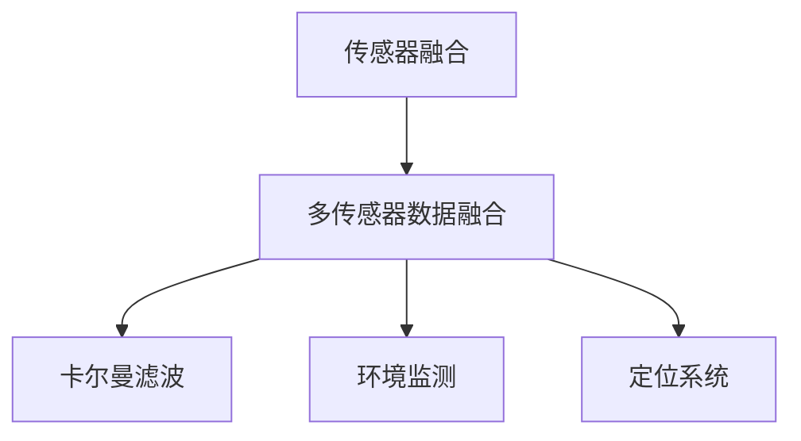

                 

# 传感器融合算法：获取准确的环境数据

> 关键词：传感器融合,环境感知,机器学习,卡尔曼滤波,多传感器数据融合,环境监测,定位系统

## 1. 背景介绍

### 1.1 问题由来
在智能驾驶、机器人导航、智能家居等众多应用场景中，环境感知能力至关重要。通过多传感器数据融合，可以大幅提升系统的环境监测和定位精度。传感器融合技术旨在整合多源数据，提取出准确的环境信息，为决策提供支撑。

然而，传感器数据往往存在异构性、不确定性和噪声，导致融合后的环境数据仍存在精度损失和误差。为了解决这个问题，本文将详细介绍传感器融合算法的基本原理、步骤和应用，为环境数据的高效融合提供指导。

### 1.2 问题核心关键点
本文的核心要点如下：
- 传感器融合的原理与核心算法：介绍卡尔曼滤波等经典融合方法，剖析算法机制。
- 融合算法的操作步骤：详细阐述数据预处理、多传感器数据融合、输出后处理等步骤。
- 融合算法的优缺点：全面评估融合算法在准确性、鲁棒性、实时性等方面的表现。
- 融合算法的应用领域：说明融合技术在环境监测、定位、导航等场景中的应用实例。

## 2. 核心概念与联系

### 2.1 核心概念概述

在介绍传感器融合算法之前，需要先明确几个核心概念：

- **传感器融合**：将多源传感器数据进行融合，提取出更加准确的环境信息。常见的传感器包括激光雷达(LiDAR)、摄像头、GPS、IMU等。

- **卡尔曼滤波**：一种线性递归滤波算法，用于估计离散数据系统的状态和输出。在传感器融合中，卡尔曼滤波可用于动态地更新环境状态估计，减少信息丢失和误差累积。

- **多传感器数据融合**：从多个传感器中提取信息，并将它们整合成一致的表示。多传感器数据融合是实现高精度环境感知的重要手段。

- **环境监测**：通过传感器数据获取环境中的静态和动态信息，如道路状况、障碍物位置、车辆速度等。

- **定位系统**：利用传感器数据，结合地图信息，确定系统在环境中的位置。

这些概念之间的逻辑关系可以通过以下Mermaid流程图来展示：



这个流程图展示了我文章的核心概念之间的联系：

1. 传感器融合是整个系统的基础，通过多源传感器数据融合，获得可靠的环境信息。
2. 卡尔曼滤波是传感器融合的核心技术，用于动态更新状态估计。
3. 多传感器数据融合是从多个传感器中提取信息，进行综合处理。
4. 环境监测和定位系统是传感器融合技术的应用场景。

## 3. 核心算法原理 & 具体操作步骤
### 3.1 算法原理概述

传感器融合的核心目标是，通过融合多源传感器数据，减少误差累积，提高环境监测和定位的精度。常用的融合算法包括卡尔曼滤波、加权平均法、最小二乘法等。本节重点介绍卡尔曼滤波算法。

卡尔曼滤波是一种递归的线性估计算法，用于估计动态系统状态。其核心思想是通过先验信息和观测信息，动态地更新状态估计。其数学模型为：

$$
\hat{x}_{k|k-1} = A_k \hat{x}_{k-1|k-1} + B_k u_k
$$

$$
\hat{P}_{k|k-1} = A_k \hat{P}_{k-1|k-1} A_k^T + Q_k
$$

$$
K_k = \hat{P}_{k|k-1} H_k^T (H_k \hat{P}_{k|k-1} H_k^T + R_k)^{-1}
$$

$$
\hat{x}_{k|k} = \hat{x}_{k|k-1} + K_k (z_k - H_k \hat{x}_{k|k-1})
$$

$$
\hat{P}_{k|k} = (I - K_k H_k) \hat{P}_{k|k-1}
$$

其中，$\hat{x}_{k|k-1}$ 和 $\hat{P}_{k|k-1}$ 分别表示上一时刻的状态估计和协方差矩阵。$A_k$ 和 $B_k$ 分别表示状态转移矩阵和控制矩阵。$u_k$ 是系统控制量。$z_k$ 是观测值。$H_k$ 是观测矩阵。$R_k$ 是观测噪声协方差矩阵。$K_k$ 是卡尔曼增益。

卡尔曼滤波通过递归计算，动态更新状态估计，减少误差累积。

### 3.2 算法步骤详解

传感器融合的实现步骤通常包括：

1. **数据预处理**：对传感器数据进行降噪、滤波等处理，确保数据质量。
2. **多传感器数据融合**：采用卡尔曼滤波等算法，对多个传感器数据进行融合。
3. **输出后处理**：对融合后的数据进行后处理，如数据裁剪、加权等。
4. **状态更新**：使用卡尔曼滤波等方法，动态更新环境状态估计。

### 3.3 算法优缺点

传感器融合算法具有以下优点：
- 通过融合多源数据，可以获得更可靠的环境信息，提高系统精度。
- 动态更新状态估计，适应环境变化。
- 减少信息丢失和误差累积，提高系统鲁棒性。

同时，也存在一些缺点：
- 算法复杂度高，计算量大，实时性可能不足。
- 对传感器数据质量要求高，需要保证数据可靠性和一致性。
- 需要准确建模系统动态，保证融合算法的正确性。

### 3.4 算法应用领域

传感器融合算法广泛应用于以下几个领域：

- **智能驾驶**：通过融合激光雷达、摄像头、GPS等传感器数据，实现环境监测和定位，辅助驾驶决策。
- **机器人导航**：利用多传感器数据，进行定位、避障和路径规划，提升机器人导航性能。
- **智能家居**：通过融合摄像头、传感器等数据，实现智能安防、环境监测等功能。
- **环境监测**：结合卫星遥感、地面传感器等数据，进行环境污染监测、灾害预警等。
- **定位系统**：在室内外环境下，融合GPS、IMU、Wi-Fi等数据，实现高精度定位。

## 4. 数学模型和公式 & 详细讲解 & 举例说明

### 4.1 数学模型构建

卡尔曼滤波的核心模型为状态空间模型，包含系统状态方程、观测方程和噪声协方差矩阵。定义系统状态向量为 $x_k \in \mathbb{R}^n$，观测向量为 $z_k \in \mathbb{R}^m$，控制向量为 $u_k \in \mathbb{R}^l$，状态转移矩阵为 $A_k \in \mathbb{R}^{n \times n}$，控制矩阵为 $B_k \in \mathbb{R}^{n \times l}$，观测矩阵为 $H_k \in \mathbb{R}^{m \times n}$，过程噪声协方差矩阵为 $Q_k \in \mathbb{R}^{n \times n}$，观测噪声协方差矩阵为 $R_k \in \mathbb{R}^{m \times m}$。

卡尔曼滤波的数学模型为：

$$
\begin{aligned}
\hat{x}_{k|k-1} &= A_k \hat{x}_{k-1|k-1} + B_k u_k \\
\hat{P}_{k|k-1} &= A_k \hat{P}_{k-1|k-1} A_k^T + Q_k \\
K_k &= \hat{P}_{k|k-1} H_k^T (H_k \hat{P}_{k|k-1} H_k^T + R_k)^{-1} \\
\hat{x}_{k|k} &= \hat{x}_{k|k-1} + K_k (z_k - H_k \hat{x}_{k|k-1}) \\
\hat{P}_{k|k} &= (I - K_k H_k) \hat{P}_{k|k-1}
\end{aligned}
$$

### 4.2 公式推导过程

卡尔曼滤波的核心在于递归计算状态估计和协方差矩阵，动态更新系统状态。

以状态空间模型为例，推导卡尔曼滤波的状态估计和协方差更新公式。设状态向量为 $x_k \in \mathbb{R}^n$，控制向量为 $u_k \in \mathbb{R}^l$，系统状态转移矩阵为 $A_k \in \mathbb{R}^{n \times n}$，控制矩阵为 $B_k \in \mathbb{R}^{n \times l}$，过程噪声协方差矩阵为 $Q_k \in \mathbb{R}^{n \times n}$。

1. **状态更新**：
   - 预测状态估计 $\hat{x}_{k|k-1} = A_k \hat{x}_{k-1|k-1} + B_k u_k$。
   - 预测协方差矩阵 $\hat{P}_{k|k-1} = A_k \hat{P}_{k-1|k-1} A_k^T + Q_k$。

2. **观测更新**：
   - 观测方程 $z_k = H_k x_k + v_k$，其中 $v_k \sim N(0, R_k)$。
   - 卡尔曼增益 $K_k = \hat{P}_{k|k-1} H_k^T (H_k \hat{P}_{k|k-1} H_k^T + R_k)^{-1}$。
   - 状态更新 $\hat{x}_{k|k} = \hat{x}_{k|k-1} + K_k (z_k - H_k \hat{x}_{k|k-1})$。
   - 协方差更新 $\hat{P}_{k|k} = (I - K_k H_k) \hat{P}_{k|k-1}$。

### 4.3 案例分析与讲解

以智能驾驶中的多传感器数据融合为例，详细讲解卡尔曼滤波的应用。

假设系统包含激光雷达(LiDAR)和摄像头两个传感器，分别用于检测道路情况和障碍物位置。两个传感器获取的数据可能存在延迟和误差，需要通过卡尔曼滤波进行融合。

设系统状态向量 $x_k = [d_k, v_k]^T$，其中 $d_k$ 为车与障碍物的距离，$v_k$ 为车速。设观测向量 $z_k = [y_k, y_l]^T$，其中 $y_k$ 为摄像头获取的障碍物位置，$y_l$ 为激光雷达获取的距离信息。

定义状态转移矩阵 $A_k = \begin{bmatrix} 1 & \Delta t \\ 0 & 1 \end{bmatrix}$，控制矩阵 $B_k = \begin{bmatrix} 0 \\ a \end{bmatrix}$，过程噪声协方差矩阵 $Q_k = \begin{bmatrix} (\Delta t)^2 & 0 \\ 0 & (\Delta t a)^2 \end{bmatrix}$，观测矩阵 $H_k = \begin{bmatrix} 1 & 0 \\ 0 & 1 \end{bmatrix}$，观测噪声协方差矩阵 $R_k = \begin{bmatrix} \sigma_y^2 & 0 \\ 0 & \sigma_l^2 \end{bmatrix}$。

根据卡尔曼滤波公式，计算状态估计和协方差矩阵：

$$
\hat{x}_{k|k-1} = \begin{bmatrix} 1 & \Delta t \\ 0 & 1 \end{bmatrix} \hat{x}_{k-1|k-1} + \begin{bmatrix} 0 \\ a \end{bmatrix} u_k
$$

$$
\hat{P}_{k|k-1} = \begin{bmatrix} 1 & \Delta t \\ 0 & 1 \end{bmatrix} \hat{P}_{k-1|k-1} \begin{bmatrix} 1 & \Delta t \\ 0 & 1 \end{bmatrix}^T + \begin{bmatrix} (\Delta t)^2 & 0 \\ 0 & (\Delta t a)^2 \end{bmatrix}
$$

$$
K_k = \hat{P}_{k|k-1} \begin{bmatrix} 1 & 0 \\ 0 & 1 \end{bmatrix}^T ( \begin{bmatrix} 1 & 0 \\ 0 & 1 \end{bmatrix} \hat{P}_{k|k-1} \begin{bmatrix} 1 & 0 \\ 0 & 1 \end{bmatrix}^T + \begin{bmatrix} \sigma_y^2 & 0 \\ 0 & \sigma_l^2 \end{bmatrix} )^{-1}
$$

$$
\hat{x}_{k|k} = \hat{x}_{k|k-1} + K_k (z_k - \begin{bmatrix} 1 & 0 \\ 0 & 1 \end{bmatrix} \hat{x}_{k|k-1})
$$

$$
\hat{P}_{k|k} = (I - K_k \begin{bmatrix} 1 & 0 \\ 0 & 1 \end{bmatrix}) \hat{P}_{k|k-1}
$$

通过卡尔曼滤波，可以动态更新车辆与障碍物的距离和速度估计，减少传感器数据的误差累积，提高环境监测的精度。

## 5. 项目实践：代码实例和详细解释说明

### 5.1 开发环境搭建

进行卡尔曼滤波项目实践前，需要搭建好开发环境。以下是使用Python和NumPy搭建卡尔曼滤波开发环境的流程：

1. 安装Anaconda：从官网下载并安装Anaconda，用于创建独立的Python环境。

2. 创建并激活虚拟环境：
```bash
conda create -n kalman_filter_env python=3.8 
conda activate kalman_filter_env
```

3. 安装相关库：
```bash
conda install numpy matplotlib scipy pandas
```

4. 安装Scikit-learn：
```bash
conda install scikit-learn
```

完成上述步骤后，即可在`kalman_filter_env`环境中开始卡尔曼滤波的开发实践。

### 5.2 源代码详细实现

下面是一个简单的卡尔曼滤波代码实现，用于融合激光雷达和摄像头数据：

```python
import numpy as np
import matplotlib.pyplot as plt

# 定义系统状态方程
def state_equation(x_k_minus_1, u_k):
    x_k = np.dot(A_k, x_k_minus_1) + np.dot(B_k, u_k)
    return x_k

# 定义观测方程
def observation_equation(z_k, x_k):
    y_k = np.dot(H_k, x_k)
    return y_k

# 定义过程噪声协方差矩阵
def process_noise_matrix(Q_k):
    return np.diag([(Q_k[0, 0] * delta_t**2), (Q_k[1, 1] * delta_t**2)])

# 定义观测噪声协方差矩阵
def observation_noise_matrix(R_k):
    return np.diag([R_k[0, 0], R_k[1, 1]])

# 定义卡尔曼滤波更新函数
def kalman_filter(x_k_minus_1, u_k, z_k, A_k, B_k, H_k, Q_k, R_k):
    # 初始化
    P_k_minus_1 = np.eye(2)
    K_k = np.zeros((2, 2))

    # 预测更新
    x_k = state_equation(x_k_minus_1, u_k)
    P_k = process_noise_matrix(Q_k) + np.dot(np.dot(P_k_minus_1, A_k), A_k.T)

    # 观测更新
    y_k = observation_equation(z_k, x_k)
    S_k = np.dot(H_k, P_k) + R_k
    K_k = np.dot(np.dot(P_k, H_k.T), np.linalg.inv(S_k))
    x_k = x_k + np.dot(K_k, z_k - y_k)
    P_k = np.dot(np.eye(2) - np.dot(K_k, H_k), P_k)

    return x_k, P_k

# 定义时间步长
delta_t = 0.1

# 定义系统参数
A_k = np.array([[1, delta_t], [0, 1]])
B_k = np.array([[0], [a]])
H_k = np.eye(2)
Q_k = np.diag([(delta_t)**2, (delta_t * a)**2])
R_k = np.diag([sigma_y**2, sigma_l**2])

# 定义输入数据
u_k = np.array([[0], [0]])
z_k = np.array([y_k, y_l])

# 定义初始状态
x_k_minus_1 = np.array([d_0, v_0])

# 初始化协方差矩阵
P_k_minus_1 = np.eye(2)

# 模拟数据
x_k = x_k_minus_1
P_k = P_k_minus_1

# 时间步骤
for k in range(num_steps):
    # 预测更新
    x_k = state_equation(x_k, u_k)
    P_k = process_noise_matrix(Q_k) + np.dot(np.dot(P_k, A_k), A_k.T)

    # 观测更新
    y_k = observation_equation(z_k, x_k)
    S_k = np.dot(H_k, P_k) + R_k
    K_k = np.dot(np.dot(P_k, H_k.T), np.linalg.inv(S_k))
    x_k = x_k + np.dot(K_k, z_k - y_k)
    P_k = np.dot(np.eye(2) - np.dot(K_k, H_k), P_k)

    # 输出状态估计
    print(f"Step {k+1}, State Estimate: {x_k}")

# 绘制状态估计轨迹
plt.plot(np.arange(num_steps), x_k[:, 0], label='Position')
plt.plot(np.arange(num_steps), x_k[:, 1], label='Speed')
plt.legend()
plt.show()
```

### 5.3 代码解读与分析

在上述代码中，`state_equation`函数表示状态方程，`observation_equation`函数表示观测方程，`process_noise_matrix`和`observation_noise_matrix`函数用于定义噪声协方差矩阵。`kalman_filter`函数实现卡尔曼滤波的递归更新过程。

代码中使用了NumPy库来处理矩阵运算，使得计算过程简洁高效。通过模拟数据，代码演示了卡尔曼滤波如何动态更新状态估计，减少误差累积。

## 6. 实际应用场景
### 6.1 智能驾驶

在智能驾驶中，卡尔曼滤波用于融合激光雷达、摄像头等传感器数据，进行环境监测和定位。通过动态更新车辆状态估计，可以实时感知道路状况和障碍物位置，辅助驾驶决策。

例如，在自动驾驶场景中，激光雷达用于获取道路点云数据，摄像头用于检测交通标志和行人。融合后的数据可以用于障碍物检测、车道线识别、车辆位置估计等任务，提升驾驶安全性。

### 6.2 机器人导航

机器人导航依赖多传感器数据融合，提升定位和路径规划的准确性。通过卡尔曼滤波，可以动态更新机器人的位置和速度估计，提高导航性能。

例如，在室内环境下，机器人同时配备激光雷达、IMU和摄像头等传感器。卡尔曼滤波可以将多源数据进行融合，减少信息丢失和误差累积，提高机器人的定位精度和稳定性。

### 6.3 智能家居

智能家居系统利用传感器数据进行环境监测和智能控制。通过卡尔曼滤波，可以实现对温度、湿度、光照等环境数据的动态监测，提升家居环境的舒适性和智能化水平。

例如，在智能安防中，摄像头用于监控室内外情况，红外传感器用于检测人体和异常行为。卡尔曼滤波可以将多源数据进行融合，提取环境特征，实现异常检测和预警。

### 6.4 未来应用展望

随着传感器技术的发展和应用场景的拓展，传感器融合技术将迎来更大的发展空间。未来，卡尔曼滤波等融合算法将在更多领域得到应用，如农业机械、医疗诊断、工业自动化等。

在农业机械领域，卡尔曼滤波可以用于融合传感器数据，进行作物生长监测、土壤湿度检测等，提升农业生产效率。在医疗诊断中，卡尔曼滤波可以用于融合不同影像数据，进行疾病检测和诊断，提高诊断准确性。在工业自动化中，卡尔曼滤波可以用于融合传感器数据，进行设备状态监测和预测性维护，提升生产效率和设备可靠性。

## 7. 工具和资源推荐
### 7.1 学习资源推荐

为了帮助开发者系统掌握卡尔曼滤波等传感器融合算法的理论基础和实践技巧，这里推荐一些优质的学习资源：

1. 《卡尔曼滤波详解》书籍：详细介绍了卡尔曼滤波的原理、应用和实例，适合初学者和进阶者。
2. 《多传感器数据融合》课程：斯坦福大学开设的多传感器数据融合课程，涵盖经典融合算法和实际案例。
3. 《深度学习与传感器融合》博客：由AI专家撰写，系统讲解了深度学习在传感器融合中的应用。
4. Coursera《信号处理与系统》课程：涵盖传感器数据处理的经典课程，包括信号滤波、傅里叶变换等内容。
5. 知乎《卡尔曼滤波》专栏：汇集了大量卡尔曼滤波相关文章，覆盖了算法原理、实践应用等。

通过这些资源的学习实践，相信你一定能够快速掌握传感器融合算法的精髓，并用于解决实际的传感数据融合问题。

### 7.2 开发工具推荐

高效的开发离不开优秀的工具支持。以下是几款用于卡尔曼滤波开发的常用工具：

1. Python：主流编程语言，适合卡尔曼滤波等数学计算任务。
2. NumPy：高性能数学计算库，提供高效的数组运算和矩阵操作。
3. Matplotlib：绘图库，用于可视化传感器数据和融合结果。
4. Scikit-learn：机器学习库，包含多种融合算法和评估工具。
5. ROS：机器人操作系统，提供传感器数据融合的内置支持。
6. OpenCV：计算机视觉库，用于摄像头数据处理和融合。

合理利用这些工具，可以显著提升传感器融合任务的开发效率，加快创新迭代的步伐。

### 7.3 相关论文推荐

卡尔曼滤波等传感器融合算法的研究历史悠久，近年来又有许多新的突破。以下是几篇奠基性的相关论文，推荐阅读：

1. Kalman Filtering: Theory and Practice（Kalman自传性论文）：卡尔曼滤波算法的发明者Rudolf Emil Kálmán撰写的经典论文，详细介绍了卡尔曼滤波的原理和应用。
2. Multisensor Fusion and Decision Making: Comprehensive Methods and Applications（多传感器融合经典书籍）：详细介绍了多种传感器融合算法，涵盖卡尔曼滤波、加权平均法等。
3. Multi-Sensor Fusion and Tracking with Extended Kalman Filters：介绍了扩展卡尔曼滤波在多传感器数据融合中的应用。
4. Kalman Filtering and State Estimation（Kalman滤波基础书籍）：适合初学者阅读的卡尔曼滤波入门书籍。
5. Sensor Fusion for Surveillance（传感器融合在监控中的应用）：介绍了传感器融合在智能监控系统中的应用。

这些论文代表了大模型微调技术的发展脉络。通过学习这些前沿成果，可以帮助研究者把握学科前进方向，激发更多的创新灵感。

## 8. 总结：未来发展趋势与挑战

### 8.1 研究成果总结

本文对卡尔曼滤波等传感器融合算法的基本原理、操作步骤和应用进行了详细讲解，为环境数据的融合提供了指导。通过案例分析，展示了卡尔曼滤波在智能驾驶、机器人导航等实际场景中的应用。推荐了丰富的学习资源和开发工具，帮助开发者系统掌握传感器融合技术。

### 8.2 未来发展趋势

未来的传感器融合技术将呈现以下几个发展趋势：

1. 多源数据融合：融合更多传感器数据，提升环境监测和定位的精度。
2. 数据预处理：采用先进的数据预处理技术，减少噪声和误差。
3. 实时性优化：优化算法结构，提高融合过程的实时性。
4. 智能融合算法：引入深度学习和强化学习等技术，提升融合效果和自适应能力。
5. 多模态融合：融合视觉、声音、温度等多模态数据，提升环境监测的多样性。
6. 边缘计算：在设备端进行数据预处理和融合，减少数据传输和计算负载。

### 8.3 面临的挑战

尽管卡尔曼滤波等传感器融合技术已经取得显著成效，但在实际应用中仍面临以下挑战：

1. 数据处理复杂：传感器数据格式和质量各异，需要预处理和校准。
2. 算法优化困难：卡尔曼滤波等算法计算复杂度较高，需要高效的优化方法。
3. 系统鲁棒性不足：传感器数据的噪声和误差可能导致融合结果的不稳定性。
4. 实时性要求高：融合算法需要快速响应用户需求，实时性要求高。
5. 数据安全性问题：多源数据融合可能涉及隐私和安全问题，需要加强数据保护。

### 8.4 研究展望

未来的传感器融合技术需要在以下几个方面寻求新的突破：

1. 算法简化：通过算法简化和优化，提升融合算法的实时性和鲁棒性。
2. 新算法探索：探索新的传感器融合算法，如粒子滤波、粒子流滤波等。
3. 跨领域融合：将传感器融合技术与其他技术结合，如机器学习、深度学习等。
4. 多模态融合：融合视觉、声音、温度等多模态数据，提升环境监测的多样性。
5. 边缘计算：在设备端进行数据预处理和融合，减少数据传输和计算负载。
6. 联邦学习：利用联邦学习技术，实现多源数据在云端和边缘端的协同融合。

## 9. 附录：常见问题与解答

**Q1：卡尔曼滤波的适用范围有哪些？**

A: 卡尔曼滤波适用于具有线性动态模型的系统，如车辆位置监测、机器人导航等。对于非线性系统，可以采用扩展卡尔曼滤波等方法进行扩展。

**Q2：如何选择合适的传感器？**

A: 传感器的选择应考虑数据类型、精度、成本等因素。通常选择具有高精度、低延迟、广覆盖范围的传感器，如激光雷达、摄像头、IMU等。

**Q3：卡尔曼滤波的参数如何选择？**

A: 卡尔曼滤波的参数需要根据具体应用场景进行调整。一般可以通过经验法、观测实验等方法确定。对于高精度应用，建议使用观测实验进行参数优化。

**Q4：卡尔曼滤波如何应对异常数据？**

A: 卡尔曼滤波可以采用迭代算法，对异常数据进行过滤和修正。例如，在观测更新环节，可以引入自适应卡尔曼滤波，动态调整滤波参数。

**Q5：卡尔曼滤波的计算复杂度如何？**

A: 卡尔曼滤波的计算复杂度较高，通常需要优化算法结构以提高实时性。例如，可以采用矩阵分解、迭代算法等方法减少计算量。

---

作者：禅与计算机程序设计艺术 / Zen and the Art of Computer Programming

