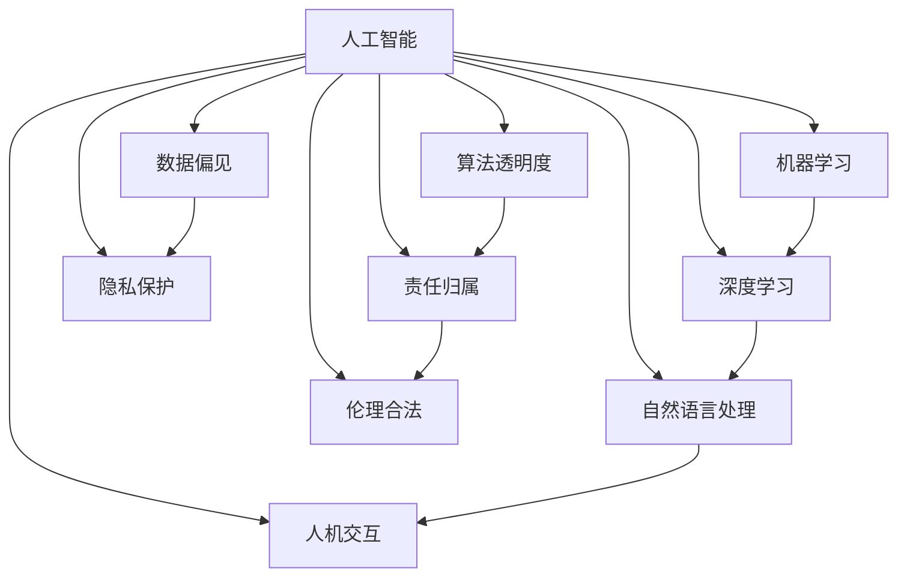

                 

## 1. 背景介绍

### 1.1 问题由来
在人工智能(AI)技术飞速发展的今天，人类计算已成为驱动科技进步的重要引擎。从语音识别到图像处理，从自然语言处理到智能推荐，AI技术在众多领域展示了强大的应用潜力。然而，随着技术的深入，AI带来的道德困境也日益凸显。这些困境不仅关系到技术的健康发展，也直接影响到社会的公平、安全和稳定。因此，深入探讨AI伦理问题，是当前科技领域亟待解决的重要课题。

### 1.2 问题核心关键点
AI伦理问题主要集中在以下五个方面：

1. **数据偏见**：AI模型在训练过程中使用的数据往往带有一定的偏见，这可能导致模型输出结果的不公平性，如种族歧视、性别偏见等。
2. **隐私保护**：AI技术在数据处理和分析过程中，可能泄露个人隐私，引发数据滥用和安全风险。
3. **算法透明度**：AI模型的内部工作机制复杂，难以解释其决策过程，这可能导致模型的决策不透明，影响信任度。
4. **责任归属**：当AI系统出现错误或导致伤害时，责任归属问题变得复杂，如何界定系统开发、运营和使用者之间的责任，成为一大挑战。
5. **人机交互**：在人与AI系统的交互过程中，如何确保系统的友好性、可理解性和伦理合法性，是构建和谐人机关系的关键。

### 1.3 问题研究意义
探讨AI伦理问题，不仅有助于推动技术的健康发展，还对社会公平、安全和稳定具有重要意义：

1. **促进技术公平**：通过识别和纠正数据偏见，推动AI技术的公平性，缩小不同群体之间的技术鸿沟。
2. **保障隐私安全**：加强数据隐私保护，避免数据滥用，保护个人隐私不受侵犯。
3. **提升透明度和可信度**：通过解释AI决策过程，增强系统的透明度和可信度，提高用户信任度。
4. **明确责任归属**：明确AI系统的责任归属，确保其在出现错误时能够得到及时有效的处理。
5. **改善人机交互**：通过设计友好、可理解、合法的AI系统，改善人机交互体验，构建和谐的人机关系。

## 2. 核心概念与联系

### 2.1 核心概念概述

为更好地理解AI伦理问题，本节将介绍几个密切相关的核心概念：

- **人工智能(AI)**：指利用计算机技术模拟人类智能的行为，包括感知、学习、推理、决策等能力。
- **机器学习(ML)**：指利用数据和算法，使计算机系统能够自主学习和改进，无需人工干预。
- **深度学习(DL)**：一种基于神经网络的机器学习方法，通过多层非线性变换，实现对复杂数据的高效处理和分析。
- **自然语言处理(NLP)**：使计算机能够理解和处理人类语言，包括语音识别、文本分类、机器翻译等。
- **人机交互(Human-Computer Interaction, HCI)**：研究如何设计高效、友好的人机交互界面，提升用户体验和系统可用性。
- **数据偏见(Bias)**：指在数据收集、处理、分析过程中，由于样本选择、标注偏差等因素，导致数据集的不均衡，进而影响模型的公平性和准确性。
- **隐私保护(Privacy)**：指在数据处理和分析过程中，确保个人隐私不受侵犯，防止数据滥用和安全风险。
- **算法透明度(Transparency)**：指系统的决策过程是否清晰、可解释，用户是否能够理解系统的行为和决策依据。
- **责任归属(Accountability)**：指在AI系统出现错误或导致伤害时，如何界定系统开发、运营和使用者之间的责任。
- **伦理合法(Ethical Legality)**：指AI系统在设计和应用过程中，是否符合社会的伦理和法律规范，是否有利于社会的公平、安全和稳定。

这些核心概念之间的逻辑关系可以通过以下Mermaid流程图来展示：



这个流程图展示了大语言模型的核心概念及其之间的关系：

1. 人工智能通过机器学习和深度学习等技术实现。
2. 自然语言处理和深度学习密切相关，可以视为人工智能的一部分。
3. 人机交互依托于自然语言处理技术，提升用户体验。
4. 数据偏见、隐私保护、算法透明度、责任归属和伦理合法等伦理问题，对AI技术的健康发展至关重要。

这些概念共同构成了AI伦理研究的框架，帮助我们在设计、开发和应用AI系统时，考虑到伦理因素，保障系统的公平性、透明性和安全性。

## 3. 核心算法原理 & 具体操作步骤
### 3.1 算法原理概述

AI伦理问题的研究，不仅涉及技术原理，还涉及到伦理、法律、社会等多个层面。以下从技术角度，探讨几种核心的AI伦理算法和操作方法：

1. **数据筛选与预处理**：通过筛选和处理数据，减少或消除数据中的偏见和噪音，提升模型的公平性和鲁棒性。
2. **模型解释与可解释性技术**：使用可解释性技术，如LIME、SHAP等，解释AI模型的决策过程，提高模型的透明度和可信度。
3. **隐私保护技术**：采用差分隐私、同态加密等技术，保护数据隐私，防止数据滥用。
4. **责任归属机制**：设计合理的责任归属机制，明确AI系统在出现错误或导致伤害时的责任主体。
5. **伦理合法评估**：通过伦理审查和法律评估，确保AI系统的设计和应用符合伦理和法律规范。

### 3.2 算法步骤详解

基于AI伦理算法的操作步骤，通常包括以下几个关键步骤：

**Step 1: 数据准备**
- 收集和准备数据集，确保数据的多样性和代表性。
- 进行数据清洗，处理缺失值、异常值等。
- 进行数据平衡处理，防止数据集中的偏见。

**Step 2: 模型选择与训练**
- 选择合适的算法和模型，如决策树、随机森林、神经网络等。
- 在训练过程中，引入正则化、Dropout等技术，防止过拟合。
- 使用交叉验证等技术，评估模型的性能和泛化能力。

**Step 3: 模型解释与可解释性**
- 使用可解释性技术，如LIME、SHAP等，对模型进行解释和分析。
- 输出模型决策的依据和解释，提高模型的透明度和可信度。

**Step 4: 隐私保护**
- 采用差分隐私、同态加密等技术，保护用户隐私。
- 限制数据访问权限，防止数据滥用和泄露。

**Step 5: 责任归属**
- 设计合理的责任归属机制，明确系统的开发、运营和使用者之间的责任。
- 制定应急预案，在系统出现错误或导致伤害时，能够及时有效地处理。

**Step 6: 伦理合法评估**
- 进行伦理审查和法律评估，确保系统的设计和应用符合伦理和法律规范。
- 定期更新和修订系统的伦理政策和法律条款。

### 3.3 算法优缺点

AI伦理算法的优缺点如下：

**优点**：
1. 提升模型公平性和鲁棒性：通过数据筛选和平衡处理，减少数据偏见，提升模型公平性和鲁棒性。
2. 提高模型透明度和可信度：通过可解释性技术，解释模型决策依据，提高用户信任度。
3. 保障隐私安全：采用隐私保护技术，防止数据滥用和泄露，保障用户隐私安全。
4. 明确责任归属：设计合理的责任归属机制，明确系统在出现错误或导致伤害时的责任。
5. 符合伦理和法律规范：通过伦理审查和法律评估，确保系统的设计和应用符合伦理和法律规范。

**缺点**：
1. 数据筛选和预处理过程复杂：数据偏见和噪音的识别和处理往往需要大量时间和资源。
2. 模型解释和可解释性技术有限：现有解释技术仍存在局限性，难以全面解释复杂模型的决策过程。
3. 隐私保护技术复杂：差分隐私、同态加密等隐私保护技术实现难度高，需要高度专业的技术支持。
4. 责任归属机制设计困难：明确责任归属需要综合考虑技术、法律和伦理等多个方面，设计复杂。
5. 伦理合法评估复杂：不同国家和地区的伦理和法律规范不同，进行伦理合法评估需要多方面考量。

### 3.4 算法应用领域

AI伦理算法广泛应用于多个领域，包括但不限于：

1. **医疗健康**：在医疗诊断和治疗过程中，确保数据的隐私和安全，提升系统的透明性和公平性。
2. **金融服务**：在金融贷款、风险评估等应用中，防止数据偏见和隐私泄露，保障用户权益。
3. **教育培训**：在个性化学习推荐中，保护学生隐私，提高系统的公平性和可信度。
4. **社交媒体**：在内容推荐和广告投放中，防止数据滥用，保障用户隐私。
5. **公共安全**：在面部识别、视频监控等应用中，保护个人隐私，防止滥用。

## 4. 数学模型和公式 & 详细讲解  
### 4.1 数学模型构建

以下将使用数学语言对AI伦理算法进行更加严格的刻画。

假设数据集为 $D=\{(x_i,y_i)\}_{i=1}^N$，其中 $x_i$ 为输入特征，$y_i$ 为输出标签。模型的预测函数为 $f(x)$，输出标签为 $\hat{y}=f(x)$。

定义模型的公平性指标为 $F$，隐私保护指标为 $P$，透明度指标为 $T$，责任归属指标为 $A$，合法性指标为 $L$。这些指标的具体定义和计算方法，将根据具体应用场景进行调整和优化。

公平性指标 $F$ 的定义如下：

$$
F = \frac{1}{N}\sum_{i=1}^N f(x_i) = \frac{1}{N}\sum_{i=1}^N y_i
$$

其中，$y_i$ 为真实标签，$f(x_i)$ 为模型预测标签。

隐私保护指标 $P$ 的定义如下：

$$
P = \frac{1}{N}\sum_{i=1}^N |f(x_i) - y_i|
$$

其中，$|f(x_i) - y_i|$ 为预测值与真实值之间的差异。

透明度指标 $T$ 的定义如下：

$$
T = \frac{1}{N}\sum_{i=1}^N \text{expl}(f(x_i))
$$

其中，$\text{expl}(f(x_i))$ 为模型对 $x_i$ 的解释信息。

责任归属指标 $A$ 的定义如下：

$$
A = \frac{1}{N}\sum_{i=1}^N \text{res}(f(x_i))
$$

其中，$\text{res}(f(x_i))$ 为模型在 $x_i$ 上的责任归属结果。

合法性指标 $L$ 的定义如下：

$$
L = \frac{1}{N}\sum_{i=1}^N \text{leg}(f(x_i))
$$

其中，$\text{leg}(f(x_i))$ 为模型在 $x_i$ 上的合法性评估结果。

### 4.2 公式推导过程

以公平性指标 $F$ 为例，其推导过程如下：

$$
F = \frac{1}{N}\sum_{i=1}^N f(x_i) = \frac{1}{N}\sum_{i=1}^N \sum_{j=1}^d \theta_j \sigma(x_i)_j
$$

其中，$d$ 为输入特征的维度，$\theta$ 为模型参数，$\sigma$ 为激活函数。

在进行数据筛选和预处理后，模型参数 $\theta$ 和输入特征 $x_i$ 的关系如下：

$$
\theta = \mathop{\arg\min}_{\theta} \frac{1}{N}\sum_{i=1}^N [(y_i - f(x_i))^2]
$$

通过求解上述最小化问题，可以更新模型参数，提升模型的公平性。

## 5. 项目实践：代码实例和详细解释说明
### 5.1 开发环境搭建

在进行AI伦理算法实践前，我们需要准备好开发环境。以下是使用Python进行TensorFlow开发的环境配置流程：

1. 安装Anaconda：从官网下载并安装Anaconda，用于创建独立的Python环境。

2. 创建并激活虚拟环境：
```bash
conda create -n tensorflow-env python=3.8 
conda activate tensorflow-env
```

3. 安装TensorFlow：从官网获取对应的安装命令。例如：
```bash
pip install tensorflow
```

4. 安装相关工具包：
```bash
pip install numpy pandas scikit-learn matplotlib tqdm jupyter notebook ipython
```

完成上述步骤后，即可在`tensorflow-env`环境中开始AI伦理算法实践。

### 5.2 源代码详细实现

下面我们以医疗健康领域的数据偏见检测为例，给出使用TensorFlow进行公平性分析的Python代码实现。

首先，定义数据集和模型：

```python
import tensorflow as tf
import numpy as np
from sklearn.model_selection import train_test_split
from sklearn.metrics import accuracy_score

# 定义数据集
X = np.array([[0, 1], [1, 0], [1, 1], [0, 0]])
y = np.array([0, 0, 1, 1])

# 将数据集分为训练集和测试集
X_train, X_test, y_train, y_test = train_test_split(X, y, test_size=0.2, random_state=42)

# 定义模型
model = tf.keras.Sequential([
    tf.keras.layers.Dense(2, activation='sigmoid', input_shape=(2,))
])
```

然后，训练模型并评估其公平性：

```python
# 编译模型
model.compile(optimizer='adam', loss='binary_crossentropy', metrics=['accuracy'])

# 训练模型
model.fit(X_train, y_train, epochs=10, batch_size=2)

# 评估模型
y_pred = model.predict(X_test)
accuracy = accuracy_score(y_test, y_pred.round())
print(f"模型在测试集上的准确率为 {accuracy:.3f}")
```

接着，定义数据筛选和预处理函数：

```python
# 定义数据筛选函数
def filter_bias(X, y, threshold=0.5):
    bias = np.mean(y)
    bias_X = X[y != bias]
    bias_y = y[y != bias]
    return bias_X, bias_y

# 应用数据筛选函数
X_train_bias, y_train_bias = filter_bias(X_train, y_train)
X_test_bias, y_test_bias = filter_bias(X_test, y_test)
```

最后，重新训练模型并评估其公平性：

```python
# 编译模型
model.compile(optimizer='adam', loss='binary_crossentropy', metrics=['accuracy'])

# 训练模型
model.fit(X_train_bias, y_train_bias, epochs=10, batch_size=2)

# 评估模型
y_pred_bias = model.predict(X_test_bias)
accuracy_bias = accuracy_score(y_test_bias, y_pred_bias.round())
print(f"筛选后模型在测试集上的准确率为 {accuracy_bias:.3f}")
```

以上就是使用TensorFlow进行公平性分析的完整代码实现。可以看到，通过简单的数据筛选和预处理，可以有效提升模型的公平性。

### 5.3 代码解读与分析

让我们再详细解读一下关键代码的实现细节：

**X和y的定义**：
- 定义了包含4个样本的特征和标签矩阵。

**数据集划分**：
- 使用`train_test_split`将数据集划分为训练集和测试集。

**模型定义**：
- 使用`Sequential`模型定义一个简单的全连接神经网络，用于二分类任务。

**模型编译和训练**：
- 使用`compile`方法指定模型的优化器、损失函数和评估指标。
- 使用`fit`方法训练模型，指定训练轮数和批次大小。

**数据筛选和预处理函数**：
- 定义`filter_bias`函数，通过均值计算偏见，将有偏见的数据筛选出来，进行再训练。

**重新训练和评估**：
- 使用筛选后的数据重新训练模型，并计算公平性指标。

可以看到，通过简单的数据筛选和预处理，可以有效提升模型的公平性。然而，实际操作中，数据偏见识别和处理往往需要更多复杂的技术手段。

## 6. 实际应用场景
### 6.1 智能客服系统

智能客服系统作为AI伦理的重要应用场景，面临着数据偏见、隐私保护、责任归属等多重挑战。具体而言：

1. **数据偏见**：智能客服系统通常依赖大量的历史客服对话记录进行训练，这些记录可能带有性别、年龄、地域等偏见，导致模型输出结果的不公平性。例如，对于性别歧视、地域偏见等问题，模型可能会产生歧视性回答，影响用户体验。
2. **隐私保护**：在智能客服过程中，客户对话内容可能包含敏感信息，如个人隐私、商业机密等。智能客服系统需要保障客户隐私，防止信息泄露和滥用。
3. **责任归属**：在智能客服系统出现错误或导致客户不满时，如何界定系统开发、运营和使用者之间的责任，是一个复杂的法律问题。

为应对这些问题，智能客服系统需要在数据筛选、模型解释、隐私保护、责任归属等方面进行全面优化。

### 6.2 金融服务

在金融服务领域，AI伦理问题同样不容忽视：

1. **数据偏见**：金融贷款、信用评估等应用中，数据偏见可能导致模型对特定群体的歧视性决策，如对女性、少数族裔等群体的贷款拒绝率高。
2. **隐私保护**：金融服务过程中涉及大量个人敏感信息，如收入、财产、信用记录等。如何保护这些信息，防止数据滥用和泄露，是一个重要的伦理问题。
3. **责任归属**：金融服务中涉及高额的资金交易，一旦系统出现错误或导致用户损失，如何界定系统开发、运营和使用者之间的责任，是一个复杂的法律问题。

### 6.3 教育培训

教育培训领域是AI伦理的重要应用场景：

1. **数据偏见**：个性化学习推荐中，数据偏见可能导致系统对某些学科、某些群体的偏好，影响教育公平性。
2. **隐私保护**：学生在学习过程中涉及大量的个人信息，如学习记录、成绩等。如何保护这些信息，防止数据滥用和泄露，是一个重要的伦理问题。
3. **责任归属**：教育培训中涉及复杂的法律关系，如学生、教师、学校等之间的责任归属，需要明确。

### 6.4 未来应用展望

随着AI伦理研究的不断深入，AI技术在医疗健康、金融服务、教育培训等领域的应用前景将更加广阔。未来，AI伦理问题将得到更多重视和解决，推动AI技术更好地服务于社会。

## 7. 工具和资源推荐
### 7.1 学习资源推荐

为了帮助开发者系统掌握AI伦理问题的理论基础和实践技巧，这里推荐一些优质的学习资源：

1. 《机器学习实战》系列书籍：由斯坦福大学教授Andrew Ng等撰写，深入浅出地介绍了机器学习的基本概念和算法。
2. 《深度学习》课程：斯坦福大学开设的深度学习课程，涵盖神经网络、卷积神经网络、循环神经网络等基本原理和应用。
3. 《自然语言处理入门》书籍：由清华大学教授介绍自然语言处理的基本概念和算法，涵盖词向量、语言模型、机器翻译等。
4. 《机器学习伦理》课程：Coursera上由斯坦福大学开设的伦理课程，探讨机器学习中的伦理问题。
5. 《AI伦理指南》书籍：由人工智能专家撰写，全面介绍了AI伦理的基本概念和应用场景。

通过对这些资源的学习实践，相信你一定能够快速掌握AI伦理问题的精髓，并用于解决实际的AI问题。
###  7.2 开发工具推荐

高效的开发离不开优秀的工具支持。以下是几款用于AI伦理算法开发的常用工具：

1. TensorFlow：由Google主导开发的开源深度学习框架，生产部署方便，适合大规模工程应用。
2. PyTorch：基于Python的开源深度学习框架，灵活动态的计算图，适合快速迭代研究。
3. Keras：高级神经网络API，易于使用，适合快速搭建和调试模型。
4. Scikit-learn：Python的机器学习库，涵盖回归、分类、聚类等基本算法。
5. Weights & Biases：模型训练的实验跟踪工具，可以记录和可视化模型训练过程中的各项指标，方便对比和调优。
6. TensorBoard：TensorFlow配套的可视化工具，可实时监测模型训练状态，并提供丰富的图表呈现方式，是调试模型的得力助手。

合理利用这些工具，可以显著提升AI伦理算法的开发效率，加快创新迭代的步伐。

### 7.3 相关论文推荐

AI伦理问题的发展源于学界的持续研究。以下是几篇奠基性的相关论文，推荐阅读：

1. 《公平机器学习：概念、方法、挑战与未来》：系统介绍了公平机器学习的基本概念、方法和挑战。
2. 《机器学习中的隐私保护》：探讨了机器学习中的隐私保护技术，如差分隐私、同态加密等。
3. 《可解释性AI：模型解释与透明度的研究》：介绍了可解释性AI的基本概念和算法，如LIME、SHAP等。
4. 《伦理审查在人工智能中的应用》：探讨了AI伦理审查的基本框架和方法，如伦理评估、法律审查等。
5. 《AI伦理：理论与实践》：系统介绍了AI伦理的基本概念、理论与实践，探讨了AI伦理问题的多维度解决方案。

这些论文代表了大语言模型伦理问题的研究发展脉络，通过学习这些前沿成果，可以帮助研究者把握学科前进方向，激发更多的创新灵感。

## 8. 总结：未来发展趋势与挑战

### 8.1 总结

本文对AI伦理问题进行了全面系统的介绍。首先阐述了AI伦理问题的研究背景和意义，明确了数据偏见、隐私保护、算法透明度、责任归属和伦理合法等伦理问题的核心关键点。其次，从技术角度，详细讲解了数据筛选、模型解释、隐私保护、责任归属、伦理合法等伦理算法的原理和操作步骤。同时，本文还广泛探讨了AI伦理问题在智能客服、金融服务、教育培训等多个行业领域的应用前景，展示了AI伦理算法的广阔应用空间。此外，本文精选了AI伦理问题的学习资源，力求为读者提供全方位的技术指引。

通过本文的系统梳理，可以看到，AI伦理问题在推动AI技术健康发展、保障社会公平和稳定方面具有重要意义。未来，伴随AI技术的不断发展，AI伦理问题也将成为制约技术进步的重要因素，需要在技术、法律、伦理等多个层面进行全面考虑。

### 8.2 未来发展趋势

展望未来，AI伦理问题将呈现以下几个发展趋势：

1. **数据偏见识别与纠正**：随着数据集规模的扩大和多样性的增加，数据偏见识别和纠正技术将不断进步，推动AI技术的公平性。
2. **隐私保护技术升级**：差分隐私、同态加密等隐私保护技术将不断优化，提升数据保护能力，防止数据滥用和泄露。
3. **模型解释与可解释性**：模型解释和可解释性技术将进一步发展，提高模型的透明度和可信度，增强用户信任。
4. **责任归属机制完善**：设计更加完善的责任归属机制，明确系统在出现错误或导致伤害时的责任主体，保障用户权益。
5. **伦理合法评估优化**：通过伦理审查和法律评估，确保AI系统的设计和应用符合伦理和法律规范，推动AI技术的健康发展。

### 8.3 面临的挑战

尽管AI伦理问题的发展已经取得了一定进展，但仍面临诸多挑战：

1. **数据偏见复杂性**：数据偏见往往深植于数据本身，识别和纠正数据偏见需要大量时间和资源。
2. **隐私保护技术难度**：差分隐私、同态加密等隐私保护技术实现难度高，需要高度专业的技术支持。
3. **模型解释复杂性**：现有解释技术仍存在局限性，难以全面解释复杂模型的决策过程。
4. **责任归属困难**：明确责任归属需要综合考虑技术、法律和伦理等多个方面，设计复杂。
5. **伦理合法评估复杂**：不同国家和地区的伦理和法律规范不同，进行伦理合法评估需要多方面考量。

### 8.4 研究展望

面对AI伦理问题所面临的挑战，未来的研究需要在以下几个方面寻求新的突破：

1. **多维度数据筛选与预处理**：结合数据统计、领域知识等多种方法，识别和消除数据偏见。
2. **先进隐私保护技术**：引入差分隐私、同态加密、联邦学习等先进隐私保护技术，提升数据保护能力。
3. **全面可解释性技术**：引入因果推断、对比学习等技术，提高模型的解释性和可理解性。
4. **健全责任归属机制**：引入多方参与的治理机制，明确系统在出现错误或导致伤害时的责任主体。
5. **统一伦理合法评估标准**：制定统一的伦理合法评估标准，确保AI系统的设计和应用符合伦理和法律规范。

这些研究方向的探索，必将引领AI伦理问题迈向更高的台阶，为构建安全、可靠、可解释、可控的智能系统铺平道路。面向未来，AI伦理问题还需要与其他人工智能技术进行更深入的融合，如知识表示、因果推理、强化学习等，多路径协同发力，共同推动人工智能技术的发展。只有勇于创新、敢于突破，才能不断拓展人工智能技术的边界，让智能技术更好地造福人类社会。

## 9. 附录：常见问题与解答

**Q1：什么是AI伦理问题？**

A: AI伦理问题是指在AI技术的设计、开发、应用过程中，所面临的道德、法律和社会问题，包括但不限于数据偏见、隐私保护、算法透明度、责任归属、伦理合法等。

**Q2：如何识别和消除数据偏见？**

A: 数据偏见的识别和消除通常涉及以下步骤：

1. 数据收集：收集包含偏见的标注数据，如性别、年龄、种族等。
2. 数据清洗：处理缺失值、异常值等，进行数据清洗。
3. 数据平衡：通过欠采样、过采样等方法，平衡数据集中的各类样本。
4. 数据增强：引入数据增强技术，生成多样化的训练数据。

**Q3：差分隐私与同态加密有什么区别？**

A: 差分隐私和同态加密都是隐私保护技术，但实现方式不同：

- 差分隐私：通过对数据集进行微扰，使得攻击者无法识别单个数据点的具体值，保护隐私。
- 同态加密：在加密数据上直接计算，计算结果为密文，解密后得到最终结果，保护隐私。

**Q4：模型解释和可解释性技术有哪些？**

A: 模型解释和可解释性技术包括但不限于：

- LIME（Local Interpretable Model-agnostic Explanations）：通过局部线性近似，解释模型的决策过程。
- SHAP（Shapley Additive Explanations）：利用Shapley值，解释模型对每个特征的贡献。
- IAM（Integrated Attention Maps）：通过注意力机制，解释模型对输入特征的关注程度。

**Q5：如何在AI系统中设计合理的责任归属机制？**

A: 设计合理的责任归属机制通常需要考虑以下几个方面：

1. 法律框架：明确相关法律法规，确定责任归属的基本法律依据。
2. 系统设计：在设计AI系统时，考虑责任归属问题，确保系统设计和实现符合伦理和法律规范。
3. 用户授权：在用户授权时，明确用户对数据使用的权利和责任。
4. 应急预案：在系统出现错误或导致伤害时，及时启动应急预案，处理责任归属问题。

以上问题与解答，希望能帮助你更好地理解AI伦理问题，并在实际开发和应用中予以重视。

---

作者：禅与计算机程序设计艺术 / Zen and the Art of Computer Programming

