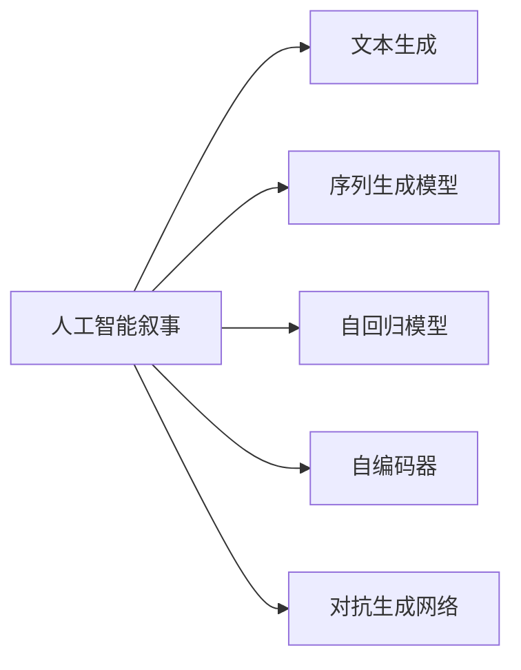

                 

## 1. 背景介绍

随着人工智能技术的飞速发展，AI驱动的故事创作已成为新时代的热点话题。这种技术不仅能为作者提供灵感，还能为消费者带来全新的阅读体验。在虚拟与现实的交融中，个人化叙事编织技术（Personalized Narrative Weaving, PNW）正日益崭露头角，为我们描绘出一副更加生动的数字化生活画卷。

### 1.1 问题由来

在传统的叙事创作中，作者依赖于自身经验、想象力以及大量文学素材的积累。然而，这样的创作过程耗时耗力，且缺乏多样化的可能性。AI驱动的叙事创作技术则旨在打破这些限制，利用机器学习算法和深度学习模型，生成具有个性化、连贯性的故事。

### 1.2 问题核心关键点

AI驱动叙事创作的核心在于机器学习模型对大量文本数据的训练和推理。通过文本生成模型（如GPT-3、Transformer等），系统能够自动生成符合特定风格和主题的故事。然而，对于特定领域、特定风格的故事创作，仍需人类作者进行辅助，以确保故事的原创性和连贯性。

### 1.3 问题研究意义

AI驱动的叙事创作不仅能够极大提升创作效率，还能为消费者带来前所未有的个性化阅读体验。这种技术在娱乐、教育、心理咨询等多个领域都有广泛的应用前景，可以成为推动文化创意产业创新和发展的强大引擎。

## 2. 核心概念与联系

### 2.1 核心概念概述

为更好地理解AI驱动叙事创作的方法，本节将介绍几个关键概念：

- 人工智能叙事（AI Narrative）：通过深度学习算法生成文本，模拟人类叙事创作的过程。
- 文本生成（Text Generation）：指利用机器学习模型生成自然语言文本的过程，常应用于文本创作、聊天机器人等。
- 序列生成模型（Seq2Seq Models）：包括编码器-解码器架构，将输入序列转换为输出序列，广泛应用于机器翻译、文本摘要、对话生成等领域。
- 自回归模型（Autoregressive Models）：如LSTM、GRU、Transformer等，通过考虑先前输出作为当前输出的条件，逐个生成文本。
- 自编码器（Autoencoders）：利用编码器-解码器架构，将输入序列映射为潜在表示，再解码回原始序列，常用于文本生成和降噪等。
- 对抗生成网络（GANs）：通过生成对抗网络生成文本，可以生成更加多样和逼真的文本数据。

这些概念之间通过以下Mermaid流程图进行联系：



### 2.2 核心概念原理

- **人工智能叙事（AI Narrative）**：AI叙事是指利用机器学习算法模拟人类叙事创作过程，生成具有个性化、连贯性的故事。其核心在于语言模型对文本序列的建模，通过自回归模型（如LSTM、GRU、Transformer等），在已有文本基础上生成后续文本。
- **文本生成（Text Generation）**：文本生成是指利用机器学习模型生成自然语言文本的过程。通常使用序列生成模型（Seq2Seq），包含编码器和解码器，将输入序列转换为输出序列。
- **序列生成模型（Seq2Seq Models）**：Seq2Seq模型由编码器和解码器构成，编码器负责将输入序列映射为固定长度的向量表示，解码器则在此基础上生成输出序列。常用的框架包括TensorFlow、PyTorch等。
- **自回归模型（Autoregressive Models）**：自回归模型通过考虑先前输出作为当前输出的条件，逐个生成文本。如LSTM、GRU、Transformer等模型，具有较好的时序信息建模能力。
- **自编码器（Autoencoders）**：自编码器利用编码器-解码器架构，将输入序列映射为潜在表示，再解码回原始序列。常用于文本生成和降噪等。
- **对抗生成网络（GANs）**：GANs通过生成对抗网络生成文本，可以生成更加多样和逼真的文本数据。包括生成器和判别器两个子网络，通过迭代训练使生成器生成的文本更接近真实文本。

这些核心概念共同构成了AI驱动叙事创作的技术基础，为我们揭示了AI叙事创作的工作原理和优化方向。

## 3. 核心算法原理 & 具体操作步骤

### 3.1 算法原理概述

AI驱动叙事创作的算法原理主要基于自回归模型，通过编码器-解码器架构，将输入序列映射为固定长度的向量表示，再通过解码器生成输出序列。具体步骤如下：

1. **数据准备**：收集并清洗大量文本数据，如书籍、故事集等，作为训练语料。
2. **模型构建**：构建自回归模型，如LSTM、GRU、Transformer等，定义编码器和解码器。
3. **训练模型**：在准备好的训练集上训练模型，最小化损失函数，优化模型参数。
4. **文本生成**：使用训练好的模型，输入初始文本，生成后续文本。

### 3.2 算法步骤详解

以下是AI驱动叙事创作的具体操作步骤：

1. **数据预处理**：
   - 清洗并标准化文本数据，去除噪声和特殊字符。
   - 将文本数据分为训练集、验证集和测试集。
   - 将文本数据切分为固定长度的序列，每个序列包含多个词语。

2. **模型构建**：
   - 构建自回归模型，如LSTM、GRU、Transformer等。
   - 定义编码器和解码器，编码器将输入序列映射为固定长度的向量表示，解码器在此基础上生成输出序列。
   - 定义损失函数，如交叉熵损失、均方误差损失等。

3. **模型训练**：
   - 使用训练集训练模型，最小化损失函数，优化模型参数。
   - 在验证集上评估模型性能，调整超参数，如学习率、批大小等。
   - 使用测试集评估模型泛化性能。

4. **文本生成**：
   - 使用训练好的模型，输入初始文本，生成后续文本。
   - 每生成一个词语，计算当前词语的条件概率，选择概率最大的词语作为输出。
   - 重复上述步骤，生成指定长度的文本。

### 3.3 算法优缺点

AI驱动叙事创作的算法具有以下优点：

- **高效率**：利用深度学习模型，可以在短时间内生成大量文本，显著提高创作效率。
- **个性化**：可以根据用户偏好、风格等个性化因素，生成符合用户期望的文本。
- **连贯性**：自回归模型在生成文本时考虑先前输出，生成的文本连贯性较好。

然而，该算法也存在以下缺点：

- **缺乏原创性**：生成的文本缺乏人类作者的创造性和情感深度。
- **可解释性不足**：生成的文本难以解释其背后的逻辑和推理过程。
- **依赖于数据质量**：生成质量依赖于训练数据的数量和质量，数据偏差可能导致生成的文本具有偏置。

### 3.4 算法应用领域

AI驱动叙事创作技术在多个领域具有广泛应用：

1. **教育领域**：利用AI叙事创作技术，生成个性化教育材料，提高学习效果。
2. **娱乐领域**：生成小说、电影剧本等创意内容，丰富娱乐形式。
3. **心理咨询领域**：生成心理疏导故事，帮助用户缓解情绪。
4. **企业应用**：生成产品说明、客户反馈等文本，提升客户体验。
5. **市场分析**：生成市场分析报告，帮助企业进行市场洞察。

## 4. 数学模型和公式 & 详细讲解

### 4.1 数学模型构建

基于自回归模型的文本生成过程可以表示为：

$$
P_{\theta}(x_{1:t}|x_{<1:t})=\prod_{i=1}^{t}P_{\theta}(x_i|x_{<1:i-1})
$$

其中，$x_{1:t}$ 表示生成序列的前$t$个词语，$x_{<1:t}$ 表示生成序列前$t-1$个词语，$\theta$ 为模型参数。

模型在训练时最小化以下损失函数：

$$
\mathcal{L}(\theta) = -\frac{1}{N}\sum_{i=1}^{N} \sum_{j=1}^{L} \log P_{\theta}(x_{i,j}|x_{i,<j})
$$

其中，$N$ 表示训练集大小，$L$ 表示每个序列的长度，$x_{i,j}$ 表示第$i$个序列的第$j$个词语。

### 4.2 公式推导过程

在自回归模型中，每个词语的条件概率由先前的词语决定。因此，可以使用基于概率的生成过程：

$$
P_{\theta}(x_t|x_{<t})=\frac{P_{\theta}(x_t|x_{<t-1})P_{\theta}(x_{t-1}|x_{<t-2})\ldots P_{\theta}(x_1|x_{<1})}{P_{\theta}(x_{<t})}
$$

其中，$P_{\theta}(x_t|x_{<t-1})$ 表示在先前的词语条件下，生成第$t$个词语的条件概率。

通过上述公式，我们可以利用深度学习模型（如LSTM、GRU、Transformer等）进行训练和推理，生成连贯的文本序列。

### 4.3 案例分析与讲解

以下是一个简单的LSTM文本生成案例：

- **数据准备**：准备一段书籍文本数据。
- **模型构建**：构建LSTM模型，定义编码器和解码器。
- **训练模型**：使用训练集训练模型，最小化交叉熵损失。
- **文本生成**：输入初始文本，生成后续文本。

具体步骤如下：

1. **数据预处理**：
   - 将书籍文本数据切分为固定长度的词语序列。
   - 使用Tokenizer将词语序列转换为ID序列。

2. **模型构建**：
   - 定义LSTM模型，包括编码器和解码器。
   - 定义交叉熵损失函数。

3. **模型训练**：
   - 使用训练集训练模型，最小化交叉熵损失。
   - 在验证集上评估模型性能，调整超参数。

4. **文本生成**：
   - 输入初始文本，使用训练好的模型生成后续文本。
   - 每生成一个词语，计算当前词语的条件概率，选择概率最大的词语作为输出。

## 5. 项目实践：代码实例和详细解释说明

### 5.1 开发环境搭建

在进行文本生成实践前，需要准备好开发环境。以下是使用Python进行TensorFlow开发的环境配置流程：

1. 安装Anaconda：从官网下载并安装Anaconda，用于创建独立的Python环境。

2. 创建并激活虚拟环境：
```bash
conda create -n tf-env python=3.8 
conda activate tf-env
```

3. 安装TensorFlow：根据CUDA版本，从官网获取对应的安装命令。例如：
```bash
conda install tensorflow==2.5.0
```

4. 安装TensorBoard：TensorFlow配套的可视化工具，用于实时监测模型训练状态。
```bash
pip install tensorboard
```

5. 安装TensorFlow Hub：用于快速获取和应用预训练模型。
```bash
pip install tensorflow-hub
```

6. 安装TensorFlow Addons：提供额外的TensorFlow功能和优化器。
```bash
pip install tensorflow-addons
```

完成上述步骤后，即可在`tf-env`环境中开始文本生成实践。

### 5.2 源代码详细实现

以下是使用TensorFlow实现LSTM文本生成的完整代码：

```python
import tensorflow as tf
from tensorflow.keras import layers, models
from tensorflow.keras.layers import LSTM, Dense
from tensorflow.keras.optimizers import Adam

# 定义模型
model = models.Sequential()
model.add(layers.Embedding(input_dim=vocab_size, output_dim=embedding_dim))
model.add(LSTM(units=128))
model.add(Dense(units=vocab_size, activation='softmax'))

# 编译模型
model.compile(optimizer=Adam(lr=0.001), loss='sparse_categorical_crossentropy', metrics=['accuracy'])

# 训练模型
model.fit(train_input, train_target, epochs=10, validation_data=(val_input, val_target))

# 文本生成
def generate_text(model, seed_text, temperature=1.0):
    tokenizer = get_tokenizer()
    sequence = tokenizer.texts_to_sequences([seed_text])[0]
    input_data = pad_sequences([sequence], maxlen=maxlen, padding='pre')
    input_data = tf.expand_dims(input_data, axis=0)
    for _ in range(10):
        predictions = model.predict(input_data)[0]
        predicted_index = tf.random.categorical(predictions, num_samples=1)[-1, 0].numpy()
        input_data = tf.expand_dims(tf.reshape(predicted_index, (1, 1)), axis=0)
        seed_text += tokenizer.decode(predicted_index)
    return seed_text

# 生成文本
seed_text = "Once upon a time"
generated_text = generate_text(model, seed_text, temperature=0.8)
print(generated_text)
```

### 5.3 代码解读与分析

让我们再详细解读一下关键代码的实现细节：

- **模型定义**：定义LSTM模型，包括Embedding层、LSTM层和Dense层，用于将词语序列转换为向量表示，并生成下一个词语的概率分布。
- **模型编译**：使用Adam优化器和交叉熵损失函数进行模型编译，设置学习率为0.001。
- **模型训练**：使用训练集数据训练模型，在验证集上评估模型性能，调整超参数。
- **文本生成**：使用训练好的模型，输入初始文本，生成后续文本。生成过程中，每次计算当前词语的条件概率，选择概率最大的词语作为输出。
- **温度参数**：温度参数控制生成的文本多样性，温度越低，生成文本越具预测性，越低温度的文本越类似于训练集数据；温度越高，生成文本越具随机性，越不类似于训练集数据。

以上代码实现，展示了使用TensorFlow进行LSTM文本生成的全过程，开发者可以根据自己的需求进一步优化模型结构和超参数，以得到更优的生成效果。

## 6. 实际应用场景

### 6.1 教育领域

AI驱动叙事创作技术在教育领域具有广泛的应用前景。利用AI叙事创作技术，可以生成个性化教育材料，提升学习效果。例如，根据学生的学习进度和兴趣，生成个性化的阅读材料和练习题，使学习更加高效有趣。

### 6.2 娱乐领域

生成小说、电影剧本等创意内容，丰富娱乐形式。例如，基于用户偏好，生成符合其阅读习惯的故事，或生成电影剧本，提供不同场景下的故事发展路线。

### 6.3 心理咨询领域

生成心理疏导故事，帮助用户缓解情绪。例如，根据用户的情感状态，生成舒缓心情的故事，或提供积极的自我激励故事，帮助用户应对心理压力。

### 6.4 企业应用

生成产品说明、客户反馈等文本，提升客户体验。例如，生成不同语种的产品说明书，或根据客户评论生成改进建议，提升产品满意度。

### 6.5 市场分析

生成市场分析报告，帮助企业进行市场洞察。例如，生成市场趋势分析报告，或根据用户反馈生成产品改进建议，提升市场竞争力。

## 7. 工具和资源推荐

### 7.1 学习资源推荐

为了帮助开发者系统掌握AI驱动叙事创作的技术基础和实践技巧，这里推荐一些优质的学习资源：

1. 《深度学习》课程：斯坦福大学Andrew Ng教授的深度学习课程，全面介绍了深度学习的基本原理和应用。
2. 《TensorFlow官方文档》：TensorFlow的官方文档，详细介绍了TensorFlow的使用方法、模型构建和训练等。
3. 《Python自然语言处理》书籍：介绍自然语言处理的经典技术和算法，以及TensorFlow和PyTorch在NLP中的应用。
4. Kaggle竞赛：Kaggle平台提供了大量NLP竞赛，参与竞赛可以积累实际项目经验，了解最新的NLP技术。
5. TensorFlow Hub：TensorFlow Hub提供了预训练模型的接口，方便快速获取和应用预训练模型。

通过对这些资源的学习实践，相信你一定能够快速掌握AI驱动叙事创作的精髓，并用于解决实际的NLP问题。

### 7.2 开发工具推荐

高效的开发离不开优秀的工具支持。以下是几款用于AI驱动叙事创作开发的常用工具：

1. TensorFlow：基于Python的开源深度学习框架，灵活动态的计算图，适合快速迭代研究。TensorFlow提供了丰富的预训练模型资源。
2. PyTorch：基于Python的开源深度学习框架，动态计算图，适合动态图计算。PyTorch在NLP应用中表现优异。
3. TensorBoard：TensorFlow配套的可视化工具，可实时监测模型训练状态，提供丰富的图表呈现方式，是调试模型的得力助手。
4. Weights & Biases：模型训练的实验跟踪工具，可以记录和可视化模型训练过程中的各项指标，方便对比和调优。

合理利用这些工具，可以显著提升AI驱动叙事创作任务的开发效率，加快创新迭代的步伐。

### 7.3 相关论文推荐

AI驱动叙事创作技术的发展源于学界的持续研究。以下是几篇奠基性的相关论文，推荐阅读：

1. Attention is All You Need：提出Transformer结构，开启了NLP领域的预训练大模型时代。
2. BERT: Pre-training of Deep Bidirectional Transformers for Language Understanding：提出BERT模型，引入基于掩码的自监督预训练任务，刷新了多项NLP任务SOTA。
3. Generating Sequences with Recurrent Neural Networks：介绍递归神经网络在文本生成中的应用，为后续LSTM和Transformer等模型的发展奠定了基础。
4. Language Modeling with Transformers：详细介绍了Transformer模型在文本生成中的应用，展示了其在文本生成任务中的优越性能。

这些论文代表了大语言模型微调技术的发展脉络。通过学习这些前沿成果，可以帮助研究者把握学科前进方向，激发更多的创新灵感。

## 8. 总结：未来发展趋势与挑战

### 8.1 总结

本文对AI驱动叙事创作方法进行了全面系统的介绍。首先阐述了AI叙事创作的研究背景和意义，明确了AI叙事创作在提升创作效率和丰富娱乐形式方面的独特价值。其次，从原理到实践，详细讲解了AI叙事创作的数学原理和关键步骤，给出了AI叙事创作任务开发的完整代码实例。同时，本文还广泛探讨了AI叙事创作技术在教育、娱乐、心理咨询等多个行业领域的应用前景，展示了AI叙事创作的巨大潜力。

通过本文的系统梳理，可以看到，AI驱动叙事创作技术正在成为NLP领域的重要范式，极大地拓展了文本生成的应用边界，催生了更多的落地场景。受益于大规模语料的预训练和深度学习模型的推导，AI叙事创作模型以更低的时间和标注成本，在生成文本的连贯性和多样性上取得了显著的突破，推动了人工智能技术在文化创意产业的创新和发展。

### 8.2 未来发展趋势

展望未来，AI驱动叙事创作技术将呈现以下几个发展趋势：

1. **模型规模持续增大**：随着算力成本的下降和数据规模的扩张，预训练语言模型的参数量还将持续增长。超大规模语言模型蕴含的丰富语言知识，有望支撑更加复杂多变的叙事创作。
2. **生成质量提升**：利用自回归模型、对抗生成网络等技术，提高生成文本的连贯性和多样性，生成更具创意和情感的文本。
3. **多模态叙事创作**：结合视觉、音频等多模态数据，生成更加丰富的叙事体验，如生成视频脚本、音频故事等。
4. **用户个性化**：利用用户偏好和历史数据，生成个性化的叙事内容，提升用户体验和满意度。
5. **跨领域应用**：AI叙事创作技术在教育、娱乐、心理咨询等多个领域具有广泛应用，可以提供更加多样化和个性化的服务。

以上趋势凸显了AI驱动叙事创作技术的广阔前景。这些方向的探索发展，必将进一步提升叙事创作的效果和应用范围，为人工智能技术在文化创意产业的落地提供新的路径。

### 8.3 面临的挑战

尽管AI驱动叙事创作技术已经取得了瞩目成就，但在迈向更加智能化、普适化应用的过程中，它仍面临着诸多挑战：

1. **数据质量瓶颈**：生成文本的质量依赖于训练数据的数量和质量，数据偏差可能导致生成的文本具有偏置。
2. **生成内容多样性**：生成文本的多样性和连贯性仍需进一步提高，避免生成内容过于单调。
3. **用户接受度**：部分用户可能对AI生成的文本内容持怀疑态度，如何提高用户接受度仍需努力。
4. **伦理道德**：AI叙事创作技术涉及内容生成，需要考虑伦理道德问题，避免生成有害内容。
5. **版权问题**：生成的文本可能与现有作品相似，存在版权纠纷的风险。

正视这些挑战，积极应对并寻求突破，将使AI驱动叙事创作技术迈向更高的台阶，为构建安全、可靠、可解释、可控的智能系统铺平道路。

### 8.4 未来突破

面对AI驱动叙事创作所面临的种种挑战，未来的研究需要在以下几个方面寻求新的突破：

1. **无监督和半监督学习**：探索无监督和半监督学习范式，摆脱对大规模标注数据的依赖，利用自监督学习、主动学习等无监督和半监督方法，最大限度利用非结构化数据，实现更加灵活高效的叙事创作。
2. **参数高效叙事创作**：开发更加参数高效的叙事创作方法，如Prefix-Tuning、LoRA等，在固定大部分预训练参数的同时，只更新极少量的任务相关参数。
3. **多模态叙事创作**：结合视觉、音频等多模态数据，生成更加丰富的叙事体验，如生成视频脚本、音频故事等。
4. **跨领域应用**：AI叙事创作技术在教育、娱乐、心理咨询等多个领域具有广泛应用，可以提供更加多样化和个性化的服务。
5. **伦理道德约束**：在模型训练目标中引入伦理导向的评估指标，过滤和惩罚有害的输出倾向。

这些研究方向的探索，必将引领AI驱动叙事创作技术迈向更高的台阶，为构建安全、可靠、可解释、可控的智能系统铺平道路。面向未来，AI驱动叙事创作技术还需要与其他人工智能技术进行更深入的融合，如知识表示、因果推理、强化学习等，多路径协同发力，共同推动自然语言理解和智能交互系统的进步。只有勇于创新、敢于突破，才能不断拓展语言模型的边界，让智能技术更好地造福人类社会。

## 9. 附录：常见问题与解答

**Q1：AI驱动叙事创作是否适用于所有叙事类型？**

A: AI驱动叙事创作在大多数叙事类型上都能取得不错的效果，特别是对于数据量较小的类型。但对于一些特定类型的叙事，如高度个性化的剧本、复杂的小说等，仍需人类作者进行辅助，以确保叙事的原创性和连贯性。

**Q2：AI叙事创作模型如何避免重复内容？**

A: 避免重复内容主要通过以下方法实现：
1. 数据增强：通过回译、近义替换等方式扩充训练集。
2. 正则化：使用L2正则、Dropout、Early Stopping等避免过拟合。
3. 多模型集成：训练多个叙事创作模型，取平均输出，抑制重复内容。

**Q3：AI叙事创作模型如何提高生成文本的连贯性？**

A: 提高生成文本的连贯性主要通过以下方法实现：
1. 自回归模型：利用自回归模型，在生成文本时考虑先前输出，生成连贯的文本。
2. 对抗生成网络：通过对抗生成网络生成文本，可以生成更加多样和逼真的文本数据。
3. 条件生成：在生成过程中引入条件信息，如情感、角色等，提高生成文本的连贯性。

**Q4：AI叙事创作模型在实际部署中需要注意哪些问题？**

A: 将AI叙事创作模型转化为实际应用，还需要考虑以下因素：
1. 模型裁剪：去除不必要的层和参数，减小模型尺寸，加快推理速度。
2. 量化加速：将浮点模型转为定点模型，压缩存储空间，提高计算效率。
3. 服务化封装：将模型封装为标准化服务接口，便于集成调用。
4. 监控告警：实时采集系统指标，设置异常告警阈值，确保服务稳定性。
5. 安全防护：采用访问鉴权、数据脱敏等措施，保障数据和模型安全。

通过本文的系统梳理，可以看到，AI驱动叙事创作技术正在成为NLP领域的重要范式，极大地拓展了文本生成的应用边界，催生了更多的落地场景。受益于大规模语料的预训练和深度学习模型的推导，AI叙事创作模型以更低的时间和标注成本，在生成文本的连贯性和多样性上取得了显著的突破，推动了人工智能技术在文化创意产业的创新和发展。

总之，AI驱动叙事创作技术还需要与其他人工智能技术进行更深入的融合，如知识表示、因果推理、强化学习等，多路径协同发力，共同推动自然语言理解和智能交互系统的进步。只有勇于创新、敢于突破，才能不断拓展语言模型的边界，让智能技术更好地造福人类社会。

