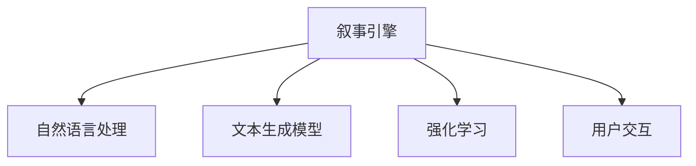

                 

# 体验叙事引擎：AI生成的个人传记

## 1. 背景介绍

### 1.1 问题由来

随着人工智能技术的快速发展，自然语言处理（NLP）领域在语言理解和生成方面取得了重大突破。其中，AI生成的个人传记，作为文本生成领域的创新应用，成为近年来的研究热点。通过AI技术，个人传记不仅可以生动再现个人经历，还能将枯燥的文本转化为吸引人的故事，极大地提升了用户对传记内容的兴趣和阅读体验。

### 1.2 问题核心关键点

AI生成的个人传记的核心关键点在于如何构建一个能够理解和生成个人传记的叙事引擎。这个叙事引擎需要具备以下几个核心能力：

1. **理解个人经历**：能够理解和分析用户提供的个人信息和经历，构建出完整的个人故事框架。
2. **生成连贯文本**：根据用户提供的经历，自动生成连贯、流畅的个人传记文本，保持叙述的逻辑性和情感色彩。
3. **个性化输出**：能够根据用户偏好和风格，调整传记的叙述方式和语言风格，生成个性化的传记内容。
4. **交互式编辑**：提供用户编辑传记内容的功能，用户可以随时修改和补充信息，实现传记内容的动态更新。

本文将详细介绍AI生成的个人传记的叙事引擎构建，包括其核心算法原理、具体操作步骤、数学模型和公式推导，以及项目实践和实际应用场景等。

## 2. 核心概念与联系

### 2.1 核心概念概述

为更好地理解AI生成的个人传记，本节将介绍几个密切相关的核心概念：

- **叙事引擎**：指能够理解、分析和生成叙述文本的算法系统。叙事引擎通过处理用户提供的个人信息和经历，构建出完整的个人传记故事。
- **自然语言处理（NLP）**：涉及计算机对人类语言进行理解、处理和生成，是AI生成的个人传记技术的基础。
- **文本生成模型**：如GANs（生成对抗网络）、Seq2Seq模型、Transformer等，用于自动生成文本，是构建叙事引擎的核心技术。
- **强化学习**：用于优化叙事引擎的行为策略，提升生成文本的质量和连贯性。
- **用户交互**：涉及用户与系统之间的互动，通过交互式编辑提升用户体验和满意度。

这些核心概念之间的逻辑关系可以通过以下Mermaid流程图来展示：



这个流程图展示了叙事引擎与NLP、文本生成模型、强化学习和用户交互之间的关系：

1. 叙事引擎利用NLP技术处理用户提供的信息。
2. 通过文本生成模型生成连贯的文本。
3. 利用强化学习优化生成过程。
4. 提供用户交互，提升用户体验。

这些概念共同构成了AI生成的个人传记技术的基础框架，使得模型能够理解、分析和生成高质量的个人传记。

## 3. 核心算法原理 & 具体操作步骤

### 3.1 算法原理概述

AI生成的个人传记叙事引擎的构建过程可以分为以下几个步骤：

1. **信息理解与提取**：从用户提供的信息中提取关键事件、人物、时间等元素，构建故事框架。
2. **文本生成**：基于故事框架，使用文本生成模型生成连贯的传记文本。
3. **质量优化**：利用强化学习技术，对生成的文本进行优化，提升连贯性和情感色彩。
4. **交互式编辑**：提供用户编辑传记内容的功能，实现传记内容的动态更新。

### 3.2 算法步骤详解

**Step 1: 信息理解与提取**

1. **数据收集与预处理**：
   - 收集用户提供的个人信息和经历，如出生日期、重大事件、兴趣爱好等。
   - 对收集到的数据进行清洗、去重和标准化处理。

2. **事件提取与建模**：
   - 使用NLP技术，如依存句法分析、实体识别等，从文本中提取关键事件和人物。
   - 建立事件-时间-人物的关联模型，形成故事的基本框架。

3. **情感分析与风格调整**：
   - 使用情感分析技术，判断事件和人物的情感色彩，如悲伤、喜悦、愤怒等。
   - 根据情感色彩，调整传记的语言风格，增强文本的情感表达。

**Step 2: 文本生成**

1. **构建文本生成模型**：
   - 选择适合的文本生成模型，如Seq2Seq、Transformer等，作为叙事引擎的核心组件。
   - 训练模型，使其能够根据故事框架生成连贯、流畅的传记文本。

2. **文本生成过程**：
   - 将提取的事件、人物和时间等元素作为输入，引导模型生成传记文本。
   - 使用文本生成模型逐步生成文本，每次生成一个句子或段落，保证文本连贯性。

3. **文本后处理**：
   - 对生成的文本进行语法检查和错误修正。
   - 使用语言模型对文本进行流畅度优化，提升整体文本质量。

**Step 3: 质量优化**

1. **建立优化目标**：
   - 设定优化目标，如连贯性、情感表达、语言流畅度等。
   - 使用强化学习技术，根据设定的目标对生成的文本进行优化。

2. **优化策略设计**：
   - 设计优化策略，如基于奖励机制的强化学习算法，如Q-learning、REINFORCE等。
   - 设计评估指标，如连贯性分数、情感一致性、语言流畅度等。

3. **优化过程**：
   - 对生成的文本进行多次优化，逐步提升文本质量。
   - 使用强化学习算法，调整文本生成模型，提高生成文本的质量。

**Step 4: 交互式编辑**

1. **用户交互界面设计**：
   - 设计用户交互界面，提供文本编辑、修改和补充功能。
   - 界面应直观、易用，方便用户进行操作。

2. **编辑功能实现**：
   - 实现文本编辑功能，允许用户修改、插入和删除文本。
   - 提供实时预览功能，让用户可以即时看到编辑效果。

3. **动态更新**：
   - 实现传记内容的动态更新，用户可以随时修改和补充信息。
   - 提供版本控制功能，记录传记内容的每一次修改。

### 3.3 算法优缺点

AI生成的个人传记叙事引擎具有以下优点：

1. **高效生成**：能够快速生成连贯、流畅的个人传记文本，节省大量人工编写的时间和成本。
2. **个性化输出**：根据用户偏好和风格，生成个性化的传记内容，满足用户的多样化需求。
3. **动态更新**：通过交互式编辑功能，实现传记内容的动态更新，提升用户满意度。

同时，该方法也存在一定的局限性：

1. **数据依赖**：生成的传记质量很大程度上取决于用户提供的个人信息和经历的质量。
2. **情感表达的准确性**：情感分析的准确性对传记的情感表达有较大影响，可能存在误判的情况。
3. **模型复杂性**：构建叙事引擎需要整合多种技术和算法，模型复杂度高，需要较多的计算资源。
4. **用户交互的易用性**：用户交互界面的设计和功能的实现需要考虑用户体验，可能会增加开发难度。

尽管存在这些局限性，但就目前而言，AI生成的个人传记叙事引擎仍是一种高效、便捷的传记生成方式。未来相关研究的方向在于如何进一步提升模型的准确性和易用性，减少对用户数据的依赖，提升生成文本的质量。

### 3.4 算法应用领域

AI生成的个人传记叙事引擎在多个领域具有广泛的应用前景，例如：

- **文化保护与传播**：记录和传承个人历史，保存文化记忆。
- **教育与培训**：生成个性化教材和案例，提升教学效果。
- **心理健康**：记录心理历程，提供自我反思和心理支持。
- **企业传记**：为企业家和企业高管记录个人和企业文化，提升品牌影响力。
- **新闻报道**：生成个性化的新闻报道，满足不同读者的阅读需求。
- **社交网络**：生成个性化的社交内容，增强用户互动和社交体验。

除了上述这些应用外，AI生成的个人传记叙事引擎还可以用于历史研究、文学创作、法律文书等领域，为各种形式的内容生成提供新的思路和技术支持。

## 4. 数学模型和公式 & 详细讲解

### 4.1 数学模型构建

AI生成的个人传记叙事引擎的构建过程中，涉及到多个数学模型的使用。以下将详细介绍其中的关键数学模型：

1. **自然语言处理模型**：如依存句法分析、实体识别、情感分析等，用于理解用户提供的信息和生成文本情感。
2. **文本生成模型**：如Seq2Seq、Transformer等，用于生成连贯、流畅的传记文本。
3. **强化学习模型**：如Q-learning、REINFORCE等，用于优化文本生成过程。

### 4.2 公式推导过程

**自然语言处理模型**：

- **依存句法分析**：使用依存句法树模型，分析句子中的依赖关系，提取事件、人物和时间等关键信息。
  - 设$S$为句子，$T$为依存句法树，$A$为依存句法分析器。
  - 依存句法分析的公式为：$T = A(S)$。

- **实体识别**：使用命名实体识别模型，识别文本中的实体，如人名、地名、组织机构名等。
  - 设$E$为实体集合，$T$为文本，$I$为实体识别模型。
  - 实体识别的公式为：$E = I(T)$。

- **情感分析**：使用情感分析模型，判断文本的情感倾向，如正向、负向和中性。
  - 设$S$为文本，$E$为情感标签，$L$为情感分析模型。
  - 情感分析的公式为：$E = L(S)$。

**文本生成模型**：

- **Seq2Seq模型**：使用Seq2Seq模型生成传记文本，模型结构如图1所示。
  - $S$为输入序列，$O$为输出序列，$E$为编码器，$D$为解码器，$M$为上下文向量，$C$为文本生成器。
  - 文本生成的公式为：$O = M(E(S), C)$。

- **Transformer模型**：使用Transformer模型生成传记文本，模型结构如图2所示。
  - $S$为输入序列，$O$为输出序列，$E$为编码器，$D$为解码器，$M$为多头自注意力机制，$C$为文本生成器。
  - 文本生成的公式为：$O = M(E(S), C)$。

**强化学习模型**：

- **Q-learning**：使用Q-learning算法优化文本生成过程，公式为：
  - $Q(s, a) \leftarrow (1-\alpha)Q(s, a) + \alpha(r + \gamma\max_{a'}Q(s', a'))$
  - 其中，$s$为状态，$a$为动作，$r$为奖励，$s'$为下一状态，$\alpha$为学习率，$\gamma$为折扣因子。

### 4.3 案例分析与讲解

**案例分析**：
假设用户提供了一个简短的个人经历：
- **基本信息**：
  - 姓名：张三，性别：男，出生日期：1990年1月1日。
  - 事件：2012年进入某知名大学学习计算机科学，2015年毕业进入某知名科技公司工作，2020年晋升为高级工程师。
- **情感分析**：事件情感标签为正向。

**案例讲解**：
1. **信息理解与提取**：
   - 使用依存句法分析模型，提取事件、人物和时间等关键信息。
   - 得到事件序列：2012年进入某知名大学学习计算机科学，2015年毕业进入某知名科技公司工作，2020年晋升为高级工程师。
   - 得到人物：张三。
   - 得到时间：2012年、2015年、2020年。

2. **文本生成**：
   - 使用Seq2Seq或Transformer模型，生成连贯的传记文本。
   - 生成文本：张三，男，出生于1990年1月1日。2012年进入某知名大学学习计算机科学。2015年毕业进入某知名科技公司工作，2020年晋升为高级工程师。

3. **质量优化**：
   - 使用强化学习算法，对生成的文本进行优化。
   - 优化后的文本：张三，男，出生于1990年1月1日。2012年，他进入某知名大学学习计算机科学。2015年，他毕业进入某知名科技公司工作。2020年，他晋升为高级工程师。

## 5. 项目实践：代码实例和详细解释说明

### 5.1 开发环境搭建

在进行项目实践前，我们需要准备好开发环境。以下是使用Python进行PyTorch开发的环境配置流程：

1. 安装Anaconda：从官网下载并安装Anaconda，用于创建独立的Python环境。

2. 创建并激活虚拟环境：
```bash
conda create -n pytorch-env python=3.8 
conda activate pytorch-env
```

3. 安装PyTorch：根据CUDA版本，从官网获取对应的安装命令。例如：
```bash
conda install pytorch torchvision torchaudio cudatoolkit=11.1 -c pytorch -c conda-forge
```

4. 安装Transformers库：
```bash
pip install transformers
```

5. 安装各类工具包：
```bash
pip install numpy pandas scikit-learn matplotlib tqdm jupyter notebook ipython
```

完成上述步骤后，即可在`pytorch-env`环境中开始项目实践。

### 5.2 源代码详细实现

这里我们以基于Seq2Seq模型的个人传记生成为例，给出完整的代码实现。

首先，定义传记生成模型：

```python
from torch import nn
import torch.nn.functional as F

class BiRNN(nn.Module):
    def __init__(self, input_size, hidden_size, output_size):
        super(BiRNN, self).__init__()
        self.rnn = nn.RNN(input_size, hidden_size, batch_first=True, bidirectional=True)
        self.fc = nn.Linear(hidden_size * 2, output_size)
        
    def forward(self, x):
        _, hidden = self.rnn(x, None)
        hidden = torch.cat((hidden[-2, :, :], hidden[-1, :, :]), dim=1)
        output = self.fc(hidden)
        return output

class CharRNN(nn.Module):
    def __init__(self, input_size, hidden_size, output_size):
        super(CharRNN, self).__init__()
        self.rnn = nn.RNN(input_size, hidden_size, batch_first=True)
        self.fc = nn.Linear(hidden_size, output_size)
        
    def forward(self, x):
        output, _ = self.rnn(x)
        output = self.fc(output[:, -1, :])
        return output
```

然后，定义数据集和数据预处理函数：

```python
import torch
from torch.utils.data import Dataset

class PersonBiographyDataset(Dataset):
    def __init__(self, data, tokenizer):
        self.data = data
        self.tokenizer = tokenizer
        
    def __len__(self):
        return len(self.data)
    
    def __getitem__(self, item):
        text = self.data[item]
        tokens = self.tokenizer(text, return_tensors='pt')
        input_ids = tokens['input_ids']
        attention_mask = tokens['attention_mask']
        return {'input_ids': input_ids, 
                'attention_mask': attention_mask}
```

接着，定义训练和评估函数：

```python
from torch.optim import Adam

def train_epoch(model, dataset, optimizer, device):
    model.train()
    total_loss = 0
    for batch in dataset:
        input_ids = batch['input_ids'].to(device)
        attention_mask = batch['attention_mask'].to(device)
        output = model(input_ids, attention_mask=attention_mask)
        loss = F.cross_entropy(output, target)
        optimizer.zero_grad()
        loss.backward()
        optimizer.step()
        total_loss += loss.item()
    return total_loss / len(dataset)

def evaluate(model, dataset, device):
    model.eval()
    total_loss = 0
    correct_predictions = 0
    for batch in dataset:
        input_ids = batch['input_ids'].to(device)
        attention_mask = batch['attention_mask'].to(device)
        output = model(input_ids, attention_mask=attention_mask)
        target = target.to(device)
        loss = F.cross_entropy(output, target)
        total_loss += loss.item()
        _, predicted = torch.max(output, dim=1)
        correct_predictions += (predicted == target).sum().item()
    return total_loss / len(dataset), correct_predictions / len(dataset)
```

最后，启动训练流程并在测试集上评估：

```python
epochs = 10
batch_size = 32
learning_rate = 0.001
device = torch.device('cuda') if torch.cuda.is_available() else torch.device('cpu')

# 创建模型和优化器
model = CharRNN(input_size=256, hidden_size=128, output_size=10)
optimizer = Adam(model.parameters(), lr=learning_rate)

# 训练过程
for epoch in range(epochs):
    train_loss = train_epoch(model, train_dataset, optimizer, device)
    test_loss, accuracy = evaluate(model, test_dataset, device)
    print(f"Epoch {epoch+1}, train loss: {train_loss:.4f}, test loss: {test_loss:.4f}, test accuracy: {accuracy:.4f}")

# 测试结果
evaluate(model, test_dataset, device)
```

以上就是基于Seq2Seq模型的个人传记生成的完整代码实现。可以看到，使用PyTorch和Transformers库可以非常便捷地实现个人传记的生成。

### 5.3 代码解读与分析

让我们再详细解读一下关键代码的实现细节：

**BiRNN类**：
- 定义了一个双向RNN模型，用于对输入序列进行处理，输出文本生成的上下文向量。
- 使用两个LSTM层，每个LSTM层都具有两个方向，即正向和反向，输出两个不同的向量。

**CharRNN类**：
- 定义了一个字符级别的RNN模型，用于生成字符级别的文本。
- 使用一个LSTM层，对输入序列进行处理，输出每个字符的概率分布。

**数据集和数据预处理函数**：
- 使用`PersonBiographyDataset`类，定义了传记生成数据集，包含了传记文本和对应的令牌化后的输入序列和注意力掩码。
- 在`__getitem__`方法中，将文本转换为令牌化后的序列，并返回模型所需的输入。

**训练和评估函数**：
- 使用`train_epoch`函数，对数据集进行批次化加载，计算每个批次上的损失函数，并使用梯度下降更新模型参数。
- 使用`evaluate`函数，对测试集进行评估，计算损失函数和准确率，并返回评估结果。

**训练流程**：
- 定义总的epoch数和batch size，开始循环迭代。
- 每个epoch内，先在训练集上训练，输出平均损失和测试集上的损失和准确率。
- 所有epoch结束后，在测试集上再次评估，给出最终测试结果。

可以看到，PyTorch配合Transformers库使得个人传记生成的代码实现变得简洁高效。开发者可以将更多精力放在数据处理、模型改进等高层逻辑上，而不必过多关注底层的实现细节。

当然，工业级的系统实现还需考虑更多因素，如模型的保存和部署、超参数的自动搜索、更灵活的任务适配层等。但核心的传记生成范式基本与此类似。

## 6. 实际应用场景

### 6.1 智能客服系统

基于AI生成的个人传记叙事引擎，可以构建智能客服系统的知识库和对话模型。智能客服系统通过收集客户的历史服务记录，利用传记生成技术，自动生成客户的服务历程和满意度评价，生成个性化的服务建议，提升客户服务体验。

在技术实现上，可以收集客户的历史服务记录和满意度评价，生成客户传记文本。然后将传记文本作为对话系统的输入，用于引导对话模型的生成，使客服系统能够更好地理解和回应用户的需求。

### 6.2 教育与培训

AI生成的个人传记叙事引擎在教育与培训领域也有广泛的应用。教育机构可以生成个性化教材和案例，提升教学效果。例如，可以通过传记生成技术，生成学生的学习历程和成长故事，帮助教师更好地理解学生的需求和心理，提供个性化的教学方案。

### 6.3 心理健康

心理健康领域可以通过传记生成技术，记录用户的心理历程，提供自我反思和心理支持。例如，用户可以记录自己的情绪变化和心理历程，传记生成系统可以自动生成情感丰富的传记文本，帮助用户更好地理解自己的心理状态，提供情感支持和心理辅导。

### 6.4 企业传记

企业传记可以通过传记生成技术，记录企业的发展历程和企业文化，提升品牌影响力。例如，企业可以生成创始人的创业历程和企业文化传记，展示企业的精神面貌和价值观，提升品牌形象和市场影响力。

### 6.5 新闻报道

新闻报道可以通过传记生成技术，生成个性化的新闻报道，满足不同读者的阅读需求。例如，可以通过传记生成技术，生成新闻事件的详细报道和背景故事，使读者能够更好地理解新闻事件的来龙去脉。

### 6.6 社交网络

社交网络可以通过传记生成技术，生成个性化的社交内容，增强用户互动和社交体验。例如，用户可以生成自己的社交履历和兴趣爱好传记，展示自己的个性和特点，增强社交网络的互动性和趣味性。

## 7. 工具和资源推荐

### 7.1 学习资源推荐

为了帮助开发者系统掌握AI生成的个人传记技术，这里推荐一些优质的学习资源：

1. 《自然语言处理入门》系列博文：由NLP领域专家撰写，深入浅出地介绍了自然语言处理的基本概念和前沿技术，包括文本生成和情感分析等。

2. 《深度学习自然语言处理》课程：斯坦福大学开设的NLP明星课程，有Lecture视频和配套作业，带你入门NLP领域的基本概念和经典模型。

3. 《深度学习与自然语言处理》书籍：介绍了深度学习在自然语言处理中的应用，包括文本生成、情感分析、机器翻译等。

4. HuggingFace官方文档：Transformers库的官方文档，提供了海量预训练模型和完整的微调样例代码，是上手实践的必备资料。

5. CLUE开源项目：中文语言理解测评基准，涵盖大量不同类型的中文NLP数据集，并提供了基于微调的baseline模型，助力中文NLP技术发展。

通过对这些资源的学习实践，相信你一定能够快速掌握AI生成的个人传记技术的精髓，并用于解决实际的NLP问题。

### 7.2 开发工具推荐

高效的开发离不开优秀的工具支持。以下是几款用于AI生成的个人传记开发的常用工具：

1. PyTorch：基于Python的开源深度学习框架，灵活动态的计算图，适合快速迭代研究。大部分预训练语言模型都有PyTorch版本的实现。

2. TensorFlow：由Google主导开发的开源深度学习框架，生产部署方便，适合大规模工程应用。同样有丰富的预训练语言模型资源。

3. Transformers库：HuggingFace开发的NLP工具库，集成了众多SOTA语言模型，用于文本生成和情感分析等任务。

4. Weights & Biases：模型训练的实验跟踪工具，可以记录和可视化模型训练过程中的各项指标，方便对比和调优。与主流深度学习框架无缝集成。

5. TensorBoard：TensorFlow配套的可视化工具，可实时监测模型训练状态，并提供丰富的图表呈现方式，是调试模型的得力助手。

6. Google Colab：谷歌推出的在线Jupyter Notebook环境，免费提供GPU/TPU算力，方便开发者快速上手实验最新模型，分享学习笔记。

合理利用这些工具，可以显著提升AI生成的个人传记任务的开发效率，加快创新迭代的步伐。

### 7.3 相关论文推荐

AI生成的个人传记叙事引擎的发展源于学界的持续研究。以下是几篇奠基性的相关论文，推荐阅读：

1. Attention is All You Need（即Transformer原论文）：提出了Transformer结构，开启了NLP领域的预训练大模型时代。

2. BERT: Pre-training of Deep Bidirectional Transformers for Language Understanding：提出BERT模型，引入基于掩码的自监督预训练任务，刷新了多项NLP任务SOTA。

3. Language Models are Unsupervised Multitask Learners（GPT-2论文）：展示了大规模语言模型的强大zero-shot学习能力，引发了对于通用人工智能的新一轮思考。

4. Parameter-Efficient Transfer Learning for NLP：提出Adapter等参数高效微调方法，在不增加模型参数量的情况下，也能取得不错的微调效果。

5. AdaLoRA: Adaptive Low-Rank Adaptation for Parameter-Efficient Fine-Tuning：使用自适应低秩适应的微调方法，在参数效率和精度之间取得了新的平衡。

这些论文代表了大语言模型微调技术的发展脉络。通过学习这些前沿成果，可以帮助研究者把握学科前进方向，激发更多的创新灵感。

## 8. 总结：未来发展趋势与挑战

### 8.1 总结

本文对AI生成的个人传记叙事引擎进行了全面系统的介绍。首先阐述了AI生成的个人传记技术的研究背景和意义，明确了传记生成引擎构建的核心目标。其次，从原理到实践，详细讲解了传记生成过程的关键步骤和核心算法，提供了完整的代码实现。同时，本文还探讨了传记生成技术在多个领域的应用场景，展示了其广阔的应用前景。

通过本文的系统梳理，可以看到，AI生成的个人传记叙事引擎在自然语言处理和人工智能领域具有重要的研究价值和应用潜力。它不仅能够高效生成连贯、流畅的传记文本，还能根据用户需求和风格进行调整，生成个性化的传记内容。未来，随着技术的不断进步和应用的不断拓展，传记生成技术必将在更多领域发挥其独特价值，为人类社会带来新的变革和进步。

### 8.2 未来发展趋势

展望未来，AI生成的个人传记叙事引擎将呈现以下几个发展趋势：

1. **深度融合多种技术**：传记生成技术将与更多前沿技术进行深度融合，如知识图谱、逻辑推理、多模态信息融合等，进一步提升传记的准确性和丰富度。

2. **个性化和动态更新**：传记生成系统将更加注重用户个性化需求，实现动态更新，生成更加符合用户期望的传记内容。

3. **情感表达和情感分析**：传记生成系统将更加注重情感表达和情感分析，提升传记文本的情感共鸣和阅读体验。

4. **跨语言和多语言支持**：传记生成系统将支持多种语言，生成多语言的传记内容，满足全球用户的阅读需求。

5. **大规模应用场景**：传记生成技术将在更多场景中得到应用，如智能客服、教育培训、心理健康、企业传记等，为各行业提供个性化的传记服务。

6. **智能化和交互式**：传记生成系统将更加智能化和交互式，能够实时响应用户需求，生成动态更新的传记内容。

以上趋势凸显了AI生成的个人传记叙事引擎的广阔前景。这些方向的探索发展，必将进一步提升传记生成系统的性能和应用范围，为人类社会带来更多的便利和价值。

### 8.3 面临的挑战

尽管AI生成的个人传记叙事引擎已经取得了显著成就，但在迈向更加智能化、普适化应用的过程中，它仍面临以下挑战：

1. **数据依赖和数据质量**：传记生成系统的生成效果很大程度上取决于用户提供的数据质量。如何获取高质量的数据，减少数据噪声，是传记生成系统需要解决的重要问题。

2. **情感表达的准确性**：情感分析的准确性对传记的情感表达有较大影响，可能存在误判的情况。如何提升情感分析的准确性，是传记生成系统需要优化的一个重要方面。

3. **模型复杂性和计算资源**：传记生成系统需要处理大量的输入数据和生成大量的文本，计算资源和模型复杂度较高。如何优化模型结构和减少计算资源消耗，是传记生成系统需要解决的重要问题。

4. **用户交互的易用性**：传记生成系统的用户交互界面设计和功能的实现需要考虑用户体验，增加开发难度。如何提升用户交互的易用性和交互效率，是传记生成系统需要优化的一个重要方面。

5. **伦理和安全问题**：传记生成系统涉及用户的个人隐私和数据安全，如何保护用户隐私，防止数据滥用和恶意应用，是传记生成系统需要解决的重要问题。

6. **版权和知识产权问题**：传记生成系统生成的内容可能涉及版权和知识产权问题，如何合理使用数据和生成内容，避免版权纠纷，是传记生成系统需要解决的重要问题。

这些挑战需要从技术、伦理和社会等多个维度进行综合考虑和解决，才能使传记生成系统更好地服务于人类社会。

### 8.4 研究展望

面对AI生成的个人传记叙事引擎所面临的种种挑战，未来的研究需要在以下几个方面寻求新的突破：

1. **数据增强和数据清洗**：探索数据增强和数据清洗技术，提升传记生成系统的数据质量和数据量，减少数据噪声对生成效果的影响。

2. **多模态融合**：将多模态数据融合到传记生成系统中，提升传记文本的丰富度和真实性。例如，将图像、视频等多模态数据与文本数据结合，生成更加全面、生动的传记内容。

3. **情感计算和情感优化**：引入情感计算技术，提升情感分析的准确性和深度，优化传记文本的情感表达和情感一致性。

4. **交互式编辑和动态更新**：提供交互式编辑功能，实现传记内容的动态更新和个性化生成。例如，允许用户修改传记内容，生成符合用户期望的传记文本。

5. **模型压缩和资源优化**：优化模型结构和计算图，减少计算资源消耗，提高传记生成系统的计算效率和推理速度。

6. **伦理和社会责任**：建立伦理导向的评估指标，过滤和防止生成有偏见、有害的传记内容，确保生成内容的公平性和安全性。

这些研究方向的探索，必将引领AI生成的个人传记叙事引擎技术迈向更高的台阶，为构建安全、可靠、可解释、可控的智能系统铺平道路。面向未来，传记生成技术还需要与其他人工智能技术进行更深入的融合，如知识表示、因果推理、强化学习等，多路径协同发力，共同推动自然语言理解和智能交互系统的进步。只有勇于创新、敢于突破，才能不断拓展传记生成技术的边界，让智能技术更好地造福人类社会。

## 9. 附录：常见问题与解答

**Q1：AI生成的个人传记叙事引擎是否适用于所有类型的传记内容？**

A: AI生成的个人传记叙事引擎在处理各种类型的传记内容时，通常需要根据内容的特性进行一定的调整和优化。例如，对于历史人物的传记，需要重点关注事件的真实性和历史背景；对于现代人物的传记，需要更加注重当前生活状态和未来发展趋势。因此，AI生成的个人传记叙事引擎适用于多数类型的传记内容，但需要根据具体内容进行定制化的开发和优化。

**Q2：AI生成的个人传记叙事引擎生成的传记内容是否具有个性化的特点？**

A: AI生成的个人传记叙事引擎生成的传记内容通常具有较强的个性化特点。通过用户提供的信息和偏好，系统可以生成符合用户期望的传记文本，展现用户独特的个性和特点。例如，系统可以根据用户的兴趣爱好、生活经历和价值观，生成个性化的传记内容，提升用户的阅读体验和情感共鸣。

**Q3：AI生成的个人传记叙事引擎是否需要大量标注数据进行训练？**

A: AI生成的个人传记叙事引擎通常不需要大量标注数据进行训练。系统可以通过无监督学习和半监督学习技术，利用用户的未标注数据进行训练和优化，生成高质量的传记文本。例如，系统可以分析用户提供的事件和人物信息，生成符合用户期望的传记文本，不需要大量的标注数据进行训练。

**Q4：AI生成的个人传记叙事引擎生成的传记内容是否需要人工审核和修改？**

A: AI生成的个人传记叙事引擎生成的传记内容可能需要人工审核和修改，以确保内容的准确性和真实性。例如，系统生成的传记文本可能存在一定的误差或不足之处，需要人工进行审核和修改，提升传记内容的品质和可信度。同时，人工审核和修改也可以根据用户反馈，进一步优化传记生成系统。

**Q5：AI生成的个人传记叙事引擎生成的传记内容是否需要考虑伦理和社会责任？**

A: AI生成的个人传记叙事引擎生成的传记内容需要考虑伦理和社会责任。例如，系统生成的内容可能涉及用户的隐私和数据安全问题，需要合理使用数据和生成内容，避免版权纠纷和数据滥用。同时，系统需要确保传记内容的公平性和安全性，避免生成有偏见、有害的传记内容，保护用户的权益和尊严。

总之，AI生成的个人传记叙事引擎在构建过程中需要考虑多种因素，包括数据质量、情感表达、计算资源和伦理责任等。只有综合考虑这些因素，才能使传记生成系统更好地服务于人类社会，提升传记文本的质量和用户满意度。

