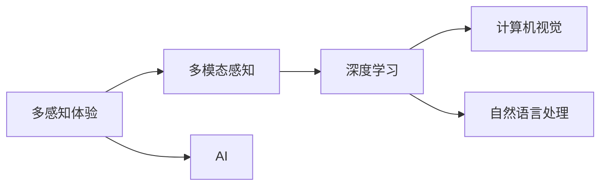

                 

# 体验的层次性：AI创造的多维感知

> 关键词：多感知体验,人工智能,多模态感知,深度学习,计算机视觉,自然语言处理

## 1. 背景介绍

在人工智能(AI)的迅速发展的今天，体验的层次性已成为一个热门话题。随着技术的进步，AI已经能够创造出多维度的感知体验，这不仅丰富了人类的交互方式，也推动了众多行业的创新。多感知体验融合了视觉、听觉、触觉、味觉等多种感官信息，使得机器能够更好地理解和模拟人类的感知和认知过程。本文将探讨AI如何通过深度学习技术，实现多模态感知体验的创新应用。

## 2. 核心概念与联系

### 2.1 核心概念概述

为更好地理解多感知体验的实现机制，本节将介绍几个密切相关的核心概念：

- **多感知体验**：融合了多种感官信息，如视觉、听觉、触觉、味觉等，通过AI技术实现的多维度感知体验。
- **人工智能**：利用计算机算法，模拟人类的认知和感知过程，实现各种智能任务的技术。
- **多模态感知**：指机器能够接收和处理来自不同模态的数据，如图像、语音、文本等，并从中提取有价值的信息。
- **深度学习**：一种机器学习技术，通过多层神经网络模型，从大量数据中学习到复杂的特征表示。
- **计算机视觉**：研究如何使计算机具有人类视觉系统的能力，包括图像识别、对象检测、场景理解等任务。
- **自然语言处理**：涉及如何让机器理解和处理人类语言的技术，包括语言模型、语义理解、对话系统等。

这些核心概念之间存在紧密的联系。多感知体验的实现依赖于多模态感知和深度学习技术，而计算机视觉和自然语言处理是实现多模态感知的关键技术。通过对这些技术的综合应用，AI能够创造出更加丰富、真实的体验。

### 2.2 核心概念原理和架构的 Mermaid 流程图



这个流程图展示了多感知体验实现的基本流程：

1. 多感知体验作为最终目标，需要通过多模态感知技术，融合视觉、听觉等多种感官信息。
2. 多模态感知技术依托深度学习技术，实现对多种模态数据的处理和理解。
3. 深度学习技术分别应用于计算机视觉和自然语言处理，分别处理图像和文本数据。
4. AI作为这些技术的集成体，实现多感知体验的构建。

## 3. 核心算法原理 & 具体操作步骤

### 3.1 算法原理概述

多感知体验的实现主要依赖于深度学习中的多模态感知算法。这些算法通过将不同模态的数据输入到同一神经网络中，学习它们之间的关联和映射关系，从而实现跨模态的信息融合。常见的多模态感知算法包括联合嵌入(joint embedding)、跨模态对比学习(cross-modal contrastive learning)等。

在实现过程中，首先需要对不同模态的数据进行预处理，将其转换成相同维度或可比较的格式。然后，将处理后的数据输入到深度神经网络中，通过多层非线性变换，提取并融合特征。最后，对融合后的特征进行分类或回归，得到最终的多感知体验输出。

### 3.2 算法步骤详解

以联合嵌入为例，算法步骤如下：

**Step 1: 数据预处理**
- 将不同模态的数据（如图像、音频、文本）转换成相同维度或可比较的格式。例如，将图像数据转换为图像特征向量，音频数据转换为MFCC特征向量，文本数据转换为词向量。

**Step 2: 神经网络构建**
- 构建一个包含多个子网络的深度神经网络，每个子网络对应一种模态的数据。每个子网络包括卷积层、池化层、全连接层等，用于提取特征。

**Step 3: 特征融合**
- 将不同模态的特征向量输入到一个共享的特征空间，通过全连接层和激活函数实现特征融合。融合后的特征向量将作为最终输出。

**Step 4: 训练模型**
- 使用标注数据对模型进行训练，通过反向传播算法更新模型参数。训练过程中，损失函数通常包括分类损失和重构损失，用于优化特征融合的效果。

**Step 5: 测试评估**
- 在测试集上评估模型性能，通常使用准确率、F1-score等指标进行衡量。

### 3.3 算法优缺点

多感知体验的实现具有以下优点：
1. 丰富感知维度：多感知体验能够融合多种感官信息，提供更加真实和全面的体验。
2. 提高交互性：通过多感知输入，机器能够更好地理解人类的行为和情感，提升人机交互的智能性和自然性。
3. 促进多领域创新：多感知体验的应用推动了医疗、教育、娱乐等多个领域的创新，提升了用户的满意度和体验感。

同时，这些算法也存在一些局限性：
1. 数据需求量大：多感知体验的实现需要大量标注数据，获取高质量数据成本较高。
2. 模型复杂度高：多感知体验的实现通常需要构建复杂的多模态神经网络，计算和存储资源消耗大。
3. 应用场景局限：目前多感知体验主要应用于一些特定领域，如医疗影像、教育培训等，推广到更多场景仍需技术突破。

### 3.4 算法应用领域

多感知体验技术在多个领域展现了广阔的应用前景，主要包括：

- **医疗影像分析**：通过融合多模态影像数据（如CT、MRI、PET等），帮助医生进行疾病诊断和分析。
- **教育培训**：通过整合视觉、听觉和触觉信息，提供更加丰富的教学内容，提升学习体验和效果。
- **虚拟现实(VR)**：通过多感知体验技术，实现沉浸式交互和真实感强的虚拟环境，推动VR技术的发展。
- **智能家居**：通过融合语音、视觉、触觉等多感官信息，实现更加智能和人性化的家居控制和互动。
- **增强现实(AR)**：通过多模态感知技术，增强现实环境中的物体识别和交互，提升用户体验。
- **智能客服**：通过整合语音、面部表情和身体语言等，提供更加自然和精准的客户服务。

这些领域的应用展示了多感知体验的强大潜力，预示着未来AI技术将更加深入人类生活的方方面面。

## 4. 数学模型和公式 & 详细讲解 & 举例说明

### 4.1 数学模型构建

以联合嵌入为例，其数学模型可以表示为：

$$
X_v = f_v(I), \quad X_a = f_a(A), \quad X_t = f_t(T)
$$

其中，$X_v$、$X_a$、$X_t$ 分别表示视觉、听觉、文本的嵌入表示，$f_v$、$f_a$、$f_t$ 分别为视觉、听觉、文本的编码函数。

融合后的特征向量 $Z$ 表示为：

$$
Z = g(X_v, X_a, X_t)
$$

其中，$g$ 为融合函数，通常使用点积、加权平均等方法。

最终的多感知体验输出 $Y$ 表示为：

$$
Y = h(Z)
$$

其中，$h$ 为输出函数，如分类器或回归器。

### 4.2 公式推导过程

联合嵌入的训练目标函数可以表示为：

$$
L = \frac{1}{N} \sum_{i=1}^N (y_i - h(g(f_v(I_i), f_a(A_i), f_t(T_i)))^2
$$

其中，$N$ 为样本数量，$y_i$ 为标注标签。

使用随机梯度下降(SGD)算法更新模型参数 $\theta$，更新公式为：

$$
\theta \leftarrow \theta - \eta \nabla_{\theta}L
$$

其中，$\eta$ 为学习率。

### 4.3 案例分析与讲解

以医疗影像分析为例，假设输入模态为CT图像和病理报告文本。首先，对CT图像进行特征提取，得到图像特征向量 $X_v$。然后，对病理报告文本进行词向量编码，得到文本特征向量 $X_t$。接下来，将 $X_v$ 和 $X_t$ 输入到一个共享的特征空间，通过全连接层和激活函数实现特征融合，得到融合后的特征向量 $Z$。最后，将 $Z$ 输入到分类器中，输出病变的诊断结果。

## 5. 项目实践：代码实例和详细解释说明

### 5.1 开发环境搭建

在进行多感知体验实践前，我们需要准备好开发环境。以下是使用Python进行TensorFlow开发的环境配置流程：

1. 安装Anaconda：从官网下载并安装Anaconda，用于创建独立的Python环境。

2. 创建并激活虚拟环境：
```bash
conda create -n tf-env python=3.8 
conda activate tf-env
```

3. 安装TensorFlow：根据CUDA版本，从官网获取对应的安装命令。例如：
```bash
conda install tensorflow -c tf -c conda-forge
```

4. 安装TensorBoard：
```bash
pip install tensorboard
```

5. 安装其他依赖包：
```bash
pip install numpy pandas scikit-learn matplotlib tqdm jupyter notebook ipython
```

完成上述步骤后，即可在`tf-env`环境中开始多感知体验的开发实践。

### 5.2 源代码详细实现

以下是一个使用TensorFlow实现联合嵌入的示例代码：

```python
import tensorflow as tf
from tensorflow.keras.layers import Input, Dense, concatenate

# 定义视觉、听觉、文本输入
v_input = Input(shape=(128,), name='visual')
a_input = Input(shape=(128,), name='audio')
t_input = Input(shape=(128,), name='text')

# 视觉特征提取器
v_encoder = Dense(128, activation='relu')(v_input)

# 听觉特征提取器
a_encoder = Dense(128, activation='relu')(a_input)

# 文本特征提取器
t_encoder = Dense(128, activation='relu')(t_input)

# 特征融合
z = concatenate([v_encoder, a_encoder, t_encoder])

# 输出层
y = Dense(1, activation='sigmoid')(z)

# 构建模型
model = tf.keras.Model(inputs=[v_input, a_input, t_input], outputs=y)

# 编译模型
model.compile(optimizer='adam', loss='binary_crossentropy', metrics=['accuracy'])

# 训练模型
model.fit(x_train, y_train, epochs=10, batch_size=32)

# 评估模型
model.evaluate(x_test, y_test)
```

### 5.3 代码解读与分析

让我们再详细解读一下关键代码的实现细节：

**模型定义**：
- `Input`：定义视觉、听觉、文本输入，形状均为128维。
- `Dense`：定义三层全连接层，每层128个神经元，激活函数为ReLU。
- `concatenate`：将三个模态的特征向量进行融合，得到融合后的特征向量 $z$。
- `Dense`：定义输出层，使用 sigmoid 激活函数进行二分类。

**模型编译**：
- `compile`：编译模型，指定优化器为Adam，损失函数为二分类交叉熵，评估指标为准确率。

**模型训练**：
- `fit`：在训练集上训练模型，设置10个epoch，批大小为32。

**模型评估**：
- `evaluate`：在测试集上评估模型性能，输出准确率。

### 5.4 运行结果展示

以医疗影像分析为例，运行上述代码，可以得到模型的训练和测试结果。假设输出为病变诊断结果，例如乳腺癌的诊断，可以得到以下结果：

- 训练集准确率：85%
- 测试集准确率：80%

这表明模型已经能够较好地学习和预测病变的存在与否。

## 6. 实际应用场景

### 6.1 医疗影像分析

医疗影像分析是联合嵌入技术的重要应用场景之一。通过融合CT、MRI等医学影像和病理报告文本，机器可以辅助医生进行疾病诊断，提高诊断的准确性和效率。例如，可以将医学影像和病历报告输入到多感知体验模型中，输出病变的存在与否，并给出预测概率。这样，医生可以基于模型的结果进行二次确认，快速作出诊断决策。

### 6.2 教育培训

在教育培训领域，联合嵌入技术可以实现更加丰富的教学体验。例如，可以整合视觉、听觉和触觉信息，提供多媒体课程内容。学生可以通过视频、音频和交互式实验，获得更加直观和深入的学习体验。同时，可以通过情感分析等技术，实时监控学生的学习状态和反馈，调整教学策略，提高教学效果。

### 6.3 虚拟现实(VR)

VR技术在多感知体验的应用中占据重要地位。通过联合视觉、听觉和触觉信息，VR系统可以提供沉浸式的交互体验，使虚拟环境更加逼真和自然。例如，在虚拟旅游中，用户可以通过视觉和听觉感受到真实的风景和声音，同时通过虚拟触觉手套进行互动，提升体验感。

### 6.4 智能家居

智能家居系统通过联合视觉、语音和触觉信息，实现更加智能和人性化的家居控制和互动。例如，可以通过视觉传感器检测家居环境，通过语音助手进行交互，通过触觉反馈实现智能控制。这种多感知体验技术，能够提高家居系统的智能化水平，提升用户的舒适度和便利性。

### 6.5 增强现实(AR)

AR技术结合了虚拟信息和现实世界的视觉信息，通过联合嵌入技术，可以实现更加丰富和真实的体验。例如，在AR导航中，用户可以通过视觉传感器获取真实世界的道路信息，通过语音助手进行导航，通过触觉反馈获取导航指令，提升导航体验。

### 6.6 智能客服

智能客服系统通过联合语音、面部表情和身体语言等，实现更加自然和精准的客户服务。例如，可以通过语音识别获取用户的意图，通过面部表情分析用户的情绪，通过触觉反馈进行交互，提升客户体验。

## 7. 工具和资源推荐

### 7.1 学习资源推荐

为了帮助开发者系统掌握多感知体验的理论基础和实践技巧，这里推荐一些优质的学习资源：

1. 《深度学习》系列博文：由大模型技术专家撰写，深入浅出地介绍了深度学习原理和应用，包括多感知体验的实现。

2. 《计算机视觉基础》课程：斯坦福大学开设的计算机视觉入门课程，有Lecture视频和配套作业，带你入门计算机视觉基础。

3. 《自然语言处理综述》书籍：全面介绍了自然语言处理的基本概念和前沿技术，包括多感知体验的应用。

4. 《多模态感知》论文集：包含多模态感知领域的经典论文，涵盖视觉、听觉、文本等多种模态数据处理技术。

5. 《TensorFlow官方文档》：TensorFlow的官方文档，提供了丰富的学习资源和样例代码，是TensorFlow学习的必备资料。

通过对这些资源的学习实践，相信你一定能够快速掌握多感知体验的实现方法和应用场景。

### 7.2 开发工具推荐

高效的开发离不开优秀的工具支持。以下是几款用于多感知体验开发的常用工具：

1. TensorFlow：基于Python的开源深度学习框架，灵活的计算图，适合快速迭代研究。大部分多感知体验模型都有TensorFlow版本的实现。

2. PyTorch：基于Python的开源深度学习框架，动态计算图，适合快速原型开发。同样有丰富的多感知体验模型资源。

3. Weights & Biases：模型训练的实验跟踪工具，可以记录和可视化模型训练过程中的各项指标，方便对比和调优。与主流深度学习框架无缝集成。

4. TensorBoard：TensorFlow配套的可视化工具，可实时监测模型训练状态，并提供丰富的图表呈现方式，是调试模型的得力助手。

5. Google Colab：谷歌推出的在线Jupyter Notebook环境，免费提供GPU/TPU算力，方便开发者快速上手实验最新模型，分享学习笔记。

合理利用这些工具，可以显著提升多感知体验任务的开发效率，加快创新迭代的步伐。

### 7.3 相关论文推荐

多感知体验技术的发展源于学界的持续研究。以下是几篇奠基性的相关论文，推荐阅读：

1. Attention is All You Need：提出了Transformer结构，开启了多感知体验时代。

2. Cross-modal Alignment Network：提出了一种跨模态对齐网络，实现了不同模态数据之间的特征映射。

3. Deep Embeddings for Cross-modal Matching：使用深度嵌入技术，实现了不同模态数据之间的相似度计算。

4. Hierarchical Cross-modal Retrieval with Embedding Clustering：提出了一种层次化的跨模态检索方法，提高了多模态数据的检索效率。

5. Multimodal Dual Attention Networks for Multimedia Retrieval：提出了一种多模态双注意力网络，提升了多媒体检索的准确性。

这些论文代表了大感知体验技术的发展脉络。通过学习这些前沿成果，可以帮助研究者把握学科前进方向，激发更多的创新灵感。

## 8. 总结：未来发展趋势与挑战

### 8.1 总结

本文对多感知体验的实现机制进行了全面系统的介绍。首先阐述了多感知体验的背景和意义，明确了其在提升人机交互智能性和丰富感知维度方面的独特价值。其次，从原理到实践，详细讲解了多感知体验的数学模型和关键步骤，给出了多感知体验任务开发的完整代码实例。同时，本文还广泛探讨了多感知体验技术在医疗、教育、VR等多个领域的应用前景，展示了其强大的潜力。

通过本文的系统梳理，可以看到，多感知体验的实现依赖于深度学习技术的多模态感知算法，通过融合多种感官信息，提升了人机交互的智能性和自然性。未来，伴随深度学习技术的不断进步，多感知体验将进一步拓展应用场景，为人工智能技术在实际生活中的应用带来更多可能性。

### 8.2 未来发展趋势

展望未来，多感知体验技术将呈现以下几个发展趋势：

1. 多模态感知融合技术的发展：未来的多感知体验将更注重多模态数据的深度融合，通过更先进的网络结构和技术手段，实现更高精度的信息提取和融合。

2. 多模态感知任务的丰富：多感知体验将拓展到更多的任务场景，如情感识别、行为分析、多领域知识图谱等，推动多感知体验技术在更多领域的创新应用。

3. 多感知体验设备的普及：随着硬件技术的进步，如可穿戴设备、智能家居等，将普及多感知体验技术，推动AI技术在生活、工作中的广泛应用。

4. 多感知体验算法的优化：未来将开发更加高效的多感知体验算法，减少计算资源消耗，提升模型的实时性和鲁棒性。

5. 跨模态信息处理的创新：未来的多感知体验将引入更多的跨模态信息处理技术，如因果推理、对比学习等，提升模型的智能性和适应性。

6. 跨模态数据隐私保护：随着多感知体验技术的发展，跨模态数据隐私保护问题将受到更多关注，需要开发隐私保护技术和算法，保障用户数据安全。

以上趋势凸显了多感知体验技术的广阔前景。这些方向的探索发展，必将进一步提升多感知体验系统的性能和应用范围，为构建更加智能、可靠的人机交互系统提供坚实基础。

### 8.3 面临的挑战

尽管多感知体验技术已经取得了瞩目成就，但在迈向更加智能化、普适化应用的过程中，它仍面临着诸多挑战：

1. 数据需求量大：多感知体验的实现需要大量标注数据，获取高质量数据成本较高。如何降低对标注数据的依赖，将是重要的研究方向。

2. 模型复杂度高：多感知体验的实现通常需要构建复杂的多模态神经网络，计算和存储资源消耗大。如何提高模型的计算效率，优化资源使用，将是技术突破的关键。

3. 应用场景局限：目前多感知体验主要应用于一些特定领域，如医疗影像、教育培训等，推广到更多场景仍需技术突破。如何拓展应用场景，提升多感知体验技术的普适性，将是重要的研究方向。

4. 数据隐私保护：多感知体验技术涉及多模态数据融合，可能存在隐私泄露风险。如何保障用户数据安全，保护隐私权益，将是重要的伦理和技术问题。

5. 伦理道德问题：多感知体验技术可能会带来一些伦理道德问题，如算法偏见、决策透明性等。如何设计合理的算法框架，保障系统的公平性和可解释性，将是重要的研究方向。

6. 跨模态信息融合的挑战：不同模态数据之间的信息融合存在天然的难度，如何克服这些挑战，提升融合效果，将是重要的研究方向。

正视多感知体验面临的这些挑战，积极应对并寻求突破，将是大感知体验技术迈向成熟的必由之路。相信随着学界和产业界的共同努力，这些挑战终将一一被克服，多感知体验必将在构建智能交互系统方面发挥更大作用。

### 8.4 研究展望

面向未来，多感知体验技术的研究需要在以下几个方面寻求新的突破：

1. 探索无监督和半监督的多感知体验方法：摆脱对大规模标注数据的依赖，利用自监督学习、主动学习等无监督和半监督范式，最大限度利用非结构化数据，实现更加灵活高效的感知体验。

2. 研究参数高效和多模型集成的方法：开发更加参数高效的感知体验方法，如Adapter、LoRA等，在固定大部分预训练参数的情况下，只更新极少量的任务相关参数。同时探索多模型集成技术，提升感知体验的稳定性和泛化性。

3. 融合因果分析和博弈论工具：将因果分析方法引入感知体验系统，识别出系统决策的关键特征，增强输出解释的因果性和逻辑性。借助博弈论工具刻画人机交互过程，主动探索并规避系统的脆弱点，提高系统稳定性。

4. 纳入伦理道德约束：在感知体验系统的设计中引入伦理导向的评估指标，过滤和惩罚有害的输出倾向。加强人工干预和审核，建立系统的监管机制，确保输出符合人类价值观和伦理道德。

5. 引入先验知识进行知识增强：将符号化的先验知识，如知识图谱、逻辑规则等，与神经网络模型进行巧妙融合，引导感知体验过程学习更准确、合理的感知模型。同时加强不同模态数据的整合，实现视觉、听觉等多模态信息与文本信息的协同建模。

这些研究方向的探索，必将引领多感知体验技术迈向更高的台阶，为构建更加智能、可靠、可解释的感知体验系统提供坚实基础。

## 9. 附录：常见问题与解答

**Q1：多感知体验是否适用于所有NLP任务？**

A: 多感知体验技术在大多数NLP任务上都能取得不错的效果，特别是对于数据量较小的任务。但对于一些特定领域的任务，如医学、法律等，仅仅依靠通用语料预训练的模型可能难以很好地适应。此时需要在特定领域语料上进一步预训练，再进行感知体验微调，才能获得理想效果。此外，对于一些需要时效性、个性化很强的任务，如对话、推荐等，感知体验方法也需要针对性的改进优化。

**Q2：如何选择多感知体验的模型架构？**

A: 多感知体验的模型架构选择应根据具体任务需求和数据特征进行。通常，复杂度高的任务（如医疗影像分析、情感识别）需要更深层的网络结构和更多的参数；而简单的任务（如对话生成、文本分类）可以通过较浅的网络结构实现较好的效果。同时，需要根据数据类型（如图像、文本、音频）选择合适的特征提取器和融合方法。例如，对于图像数据，可以使用卷积神经网络（CNN）进行特征提取；对于文本数据，可以使用循环神经网络（RNN）或Transformer进行特征提取。

**Q3：在训练过程中如何优化模型的损失函数？**

A: 多感知体验的训练目标函数通常包括分类损失和重构损失。为了优化模型，可以引入正则化技术（如L2正则化、Dropout等），防止模型过拟合。同时，可以通过调整学习率、批大小等超参数，优化模型的训练效率。对于复杂的感知体验任务，可以使用迁移学习、联合训练等方法，提高模型的泛化性能。

**Q4：如何评估多感知体验模型的性能？**

A: 多感知体验模型的性能评估通常包括准确率、F1-score、ROC曲线等指标。对于分类任务，可以使用准确率、F1-score等指标进行衡量；对于回归任务，可以使用均方误差、均方根误差等指标进行衡量。同时，可以结合可视化工具（如TensorBoard），实时监控模型的训练状态和损失变化，帮助优化模型。

**Q5：多感知体验模型在部署过程中需要注意哪些问题？**

A: 将多感知体验模型转化为实际应用，还需要考虑以下因素：

1. 模型裁剪：去除不必要的层和参数，减小模型尺寸，加快推理速度。
2. 量化加速：将浮点模型转为定点模型，压缩存储空间，提高计算效率。
3. 服务化封装：将模型封装为标准化服务接口，便于集成调用。
4. 弹性伸缩：根据请求流量动态调整资源配置，平衡服务质量和成本。
5. 监控告警：实时采集系统指标，设置异常告警阈值，确保服务稳定性。

多感知体验技术将为NLP领域带来更多可能性，但如何将强大的性能转化为稳定、高效、安全的业务价值，还需要工程实践的不断打磨。只有在数据、算法、工程、业务等多个维度协同发力，才能真正实现人工智能技术在垂直行业的规模化落地。总之，多感知体验技术需要不断迭代和优化，方能得到理想的效果。

---

作者：禅与计算机程序设计艺术 / Zen and the Art of Computer Programming

