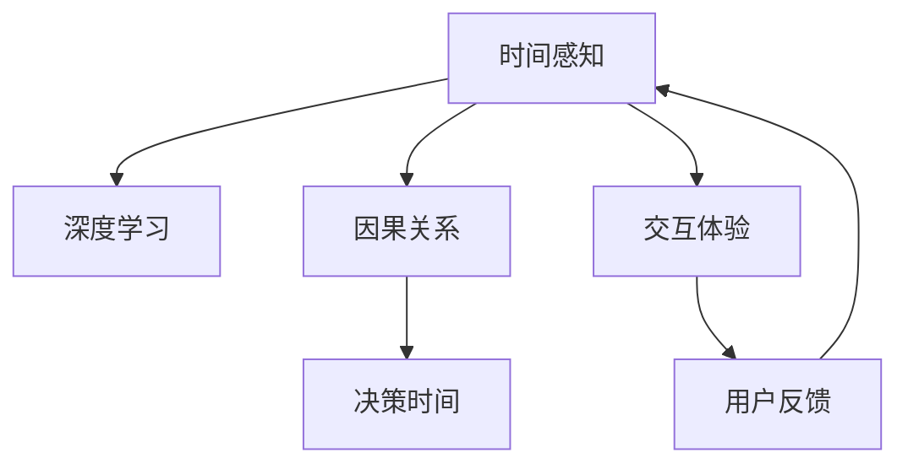

                 

# 体验的时间扭曲：AI创造的主观时间

> 关键词：时间感知、深度学习、因果关系、决策时间、交互体验、神经网络、时间模型、心理学、用户体验

## 1. 背景介绍

### 1.1 问题由来

随着人工智能(AI)技术的不断进步，尤其是深度学习(Deep Learning)的普及，AI在各个领域的应用越来越广泛。从自动驾驶、医疗诊断到金融风控、客服机器人，AI正在以它独特的智能方式影响着我们的生活。但不可忽视的是，AI系统在提供服务的同时，也在改变着我们的时间感知。这一现象不仅体现在对时间的压缩或扩展，更涉及了用户与系统交互方式、决策过程和体验感的变化。

### 1.2 问题核心关键点

AI创造的主观时间体验，主要是指AI系统在信息处理、决策制定和用户交互过程中，如何通过其算法和机制，影响用户对时间的感知和体验。具体表现为：

- **时间扭曲**：AI系统通过优化决策路径和信息处理效率，改变了用户对任务执行时间的主观感知。
- **因果关系**：AI系统在预测未来和因果推断过程中，如何与用户建立并维护其对时间流动的因果认知。
- **决策时间**：AI系统如何根据实时数据和模型计算，快速做出决策，影响用户对决策响应时间的感受。
- **交互体验**：AI系统如何通过其界面和交互设计，调整用户的期望与现实之间的时间匹配。

这一现象的背后，涉及认知心理学、神经科学和计算机科学的交叉研究，值得我们深入探讨。

### 1.3 问题研究意义

研究AI创造的主观时间体验，对于提升AI系统的用户体验、优化系统设计、扩展应用场景具有重要意义：

1. **提升用户体验**：通过理解用户对时间的主观感受，AI系统可以更加贴合用户的心理预期，提供更流畅和满意的交互体验。
2. **优化系统设计**：通过分析时间扭曲现象，设计更高效、更符合用户时间感的算法和界面，提升系统性能。
3. **扩展应用场景**：在金融、医疗、交通等对时间要求较高的领域，准确理解用户的时间感知，有助于AI系统更好地服务于实际需求。

## 2. 核心概念与联系

### 2.1 核心概念概述

为更好地理解AI创造的主观时间体验，本节将介绍几个核心概念：

- **时间感知**：个体对时间的感知是主观的，受个人经验、情绪和任务复杂度等多种因素影响。AI系统通过算法和设计，可以调整用户对时间的感知。
- **深度学习**：利用神经网络模型进行信息处理和决策，通过反向传播算法不断优化模型参数，提升模型的准确性和效率。
- **因果关系**：因果推断在AI系统中非常重要，帮助模型理解和预测因果效应，从而做出更加合理的决策。
- **决策时间**：AI系统在处理任务时，需要快速做出决策，这一过程的时间感会影响用户的使用体验。
- **交互体验**：AI系统的界面和交互设计，需要考虑用户的期望和反馈，调整时间感知，提供更好的交互体验。

这些核心概念之间的逻辑关系可以通过以下Mermaid流程图来展示：



这个流程图展示了一系列核心概念的逻辑关系：

1. 时间感知作为基础，被深度学习和因果推断等技术所影响。
2. 因果关系和决策时间紧密相关，共同决定了AI系统处理任务的速度和质量。
3. 交互体验与时间感知、决策时间相互影响，共同塑造了用户的使用感受。

## 3. 核心算法原理 & 具体操作步骤
### 3.1 算法原理概述

AI创造的主观时间体验，主要通过以下几个关键步骤实现：

1. **数据收集与处理**：收集用户与系统交互的时间数据，包括任务的执行时间、决策响应时间等。
2. **模型训练**：利用深度学习模型，如神经网络，训练时间感知模型，学习用户对时间的主观感知。
3. **因果推断**：通过因果关系算法，如时间序列分析、贝叶斯网络等，预测用户对特定任务的时间预期。
4. **决策优化**：优化决策算法，使得AI系统能够在预设时间内做出最合适的决策，缩短用户等待时间。
5. **交互设计**：通过设计合理的界面和交互流程，引导用户对时间的合理预期，提供高效且流畅的交互体验。

### 3.2 算法步骤详解

**Step 1: 数据收集与处理**
- 收集用户与AI系统交互的时间数据，如任务执行时间、决策响应时间等。
- 清洗和标注数据，确保数据质量和一致性。

**Step 2: 模型训练**
- 选择合适的神经网络模型，如卷积神经网络(CNN)、循环神经网络(RNN)、长短期记忆网络(LSTM)等，用于时间感知建模。
- 在训练集中进行模型训练，不断调整模型参数，提升模型对时间的预测能力。

**Step 3: 因果推断**
- 使用时间序列分析、贝叶斯网络等算法，建立因果关系模型，预测用户对特定任务的时间预期。
- 将历史交互数据代入模型，预测不同情况下用户的时间感受。

**Step 4: 决策优化**
- 根据用户时间预期和任务复杂度，优化决策算法，确保决策时间在用户可接受范围内。
- 采用实时数据更新和优化策略，动态调整决策参数，适应不同的用户需求。

**Step 5: 交互设计**
- 设计合理的界面和交互流程，引导用户对时间的合理预期。
- 通过可视化、动画等手段，直观展示决策和执行时间，提升用户满意度。

### 3.3 算法优缺点

AI创造的主观时间体验具有以下优点：
1. **提高效率**：通过优化决策算法和时间感知模型，大大提升系统处理任务的速度，缩短用户等待时间。
2. **增强用户体验**：合理的设计和引导，使用户对时间的感受更加流畅和满意，提升整体体验。
3. **个性化服务**：通过因果推断和个性化模型，提供更加符合用户需求的时间感知和决策方案。

同时，该方法也存在一些局限性：
1. **数据依赖**：对用户交互数据的依赖性较强，数据收集和处理成本较高。
2. **模型复杂性**：神经网络模型的训练和优化较为复杂，需要一定的技术门槛。
3. **因果关系理解**：因果推断模型的准确性和复杂性较高，对模型的设计和调参要求较高。
4. **实时性要求**：实时处理和优化要求较高的计算资源，可能对系统性能造成一定压力。

尽管存在这些局限性，AI创造的主观时间体验仍是大数据时代优化用户体验、提升系统性能的重要方向。

### 3.4 算法应用领域

AI创造的主观时间体验技术，在多个领域有广泛的应用：

- **智能客服**：通过时间感知和决策优化，实时响应客户咨询，提供快速准确的解决方案。
- **金融交易**：利用时间序列分析和因果推断，预测市场趋势，提高交易决策的效率和准确性。
- **医疗诊断**：通过优化诊断流程和时间感知，提升诊断效率和患者体验，缩短等待时间。
- **交通管理**：通过实时数据处理和决策优化，优化交通信号控制，提高通行效率和安全性。
- **推荐系统**：通过时间感知和个性化推荐，提供符合用户期望的商品或信息，提升推荐效果。

## 4. 数学模型和公式 & 详细讲解 & 举例说明
### 4.1 数学模型构建

本节将使用数学语言对AI创造的主观时间体验进行更加严格的刻画。

设用户执行任务的期望时间为 $T$，实际执行时间为 $T_{\text{actual}}$。通过深度学习模型，我们希望学习到用户对时间的主观感知 $P(T \mid D)$，其中 $D$ 为历史交互数据。

假设我们使用RNN来建模时间感知，则模型的输入为序列化的交互数据 $D_t = (d_{t-1}, d_{t-2}, \ldots, d_0)$，输出为时间感知 $P(T \mid D_t)$。模型的目标是通过训练，最小化预测时间 $T_{\text{predict}}$ 与实际时间 $T_{\text{actual}}$ 之间的差距。

模型训练的优化目标为：

$$
\mathop{\arg\min}_{\theta} \mathcal{L}(\theta) = \mathbb{E}_{P(D)} [(T_{\text{actual}} - T_{\text{predict}})^2]
$$

其中 $\theta$ 为模型参数，$\mathcal{L}$ 为损失函数。

### 4.2 公式推导过程

以LSTM为例，推导时间感知模型的损失函数及其梯度计算过程。

设 $h_t$ 为LSTM在时间 $t$ 的隐藏状态，其更新公式为：

$$
h_t = \text{LSTM}(h_{t-1}, d_t; \theta)
$$

时间感知模型的输出为 $P(T \mid D_t)$，可以利用LSTM的预测能力，结合因果推断算法，计算时间预测值 $T_{\text{predict}}$。假设我们采用回归模型来预测，则时间感知模型的目标函数为：

$$
\mathcal{L}(\theta) = \frac{1}{N} \sum_{i=1}^N (T_{\text{actual}}^i - T_{\text{predict}}^i)^2
$$

其中 $N$ 为样本数量。

根据链式法则，时间感知模型参数 $\theta$ 的梯度为：

$$
\frac{\partial \mathcal{L}(\theta)}{\partial \theta_k} = -\frac{2}{N} \sum_{i=1}^N \frac{\partial T_{\text{actual}}^i}{\partial h_t^i} \frac{\partial h_t^i}{\partial \theta_k}
$$

其中 $\frac{\partial T_{\text{actual}}^i}{\partial h_t^i}$ 可以通过反向传播算法计算得到。

### 4.3 案例分析与讲解

假设我们有一个智能客服系统，希望通过时间感知优化用户体验。我们收集了用户咨询和处理时间的数据，使用LSTM模型训练时间感知模型，预测用户对处理时间的期望。

假设用户对某问题的期望处理时间为10分钟，经过LSTM模型预测，实际处理时间为8分钟。根据回归模型，我们可以计算出时间感知模型的输出 $T_{\text{predict}} = 8$。

我们继续假设用户的处理时间期望函数为 $T_{\text{actual}} = aT_{\text{predict}} + b$，其中 $a$ 和 $b$ 为模型的可训练参数。根据已有的用户数据，我们可以通过最小化损失函数 $\mathcal{L}(\theta) = \frac{1}{N} \sum_{i=1}^N (T_{\text{actual}}^i - T_{\text{predict}}^i)^2$ 来优化这些参数。

## 5. 项目实践：代码实例和详细解释说明
### 5.1 开发环境搭建

在进行时间感知和因果推断项目实践前，我们需要准备好开发环境。以下是使用Python进行PyTorch开发的环境配置流程：

1. 安装Anaconda：从官网下载并安装Anaconda，用于创建独立的Python环境。

2. 创建并激活虚拟环境：
```bash
conda create -n time_perception_env python=3.8 
conda activate time_perception_env
```

3. 安装PyTorch：根据CUDA版本，从官网获取对应的安装命令。例如：
```bash
conda install pytorch torchvision torchaudio cudatoolkit=11.1 -c pytorch -c conda-forge
```

4. 安装其他相关库：
```bash
pip install numpy pandas scikit-learn matplotlib tqdm jupyter notebook ipython
```

完成上述步骤后，即可在`time_perception_env`环境中开始项目实践。

### 5.2 源代码详细实现

下面以LSTM时间感知模型的实现为例，给出PyTorch代码实现：

```python
import torch
import torch.nn as nn
import torch.optim as optim
from torch.utils.data import Dataset, DataLoader
from sklearn.metrics import mean_squared_error
from tqdm import tqdm

# 定义数据集类
class TimePerceptionDataset(Dataset):
    def __init__(self, data, seq_len=20):
        self.data = data
        self.seq_len = seq_len
        self.length = len(self.data)
        
    def __getitem__(self, idx):
        x = self.data[idx, :self.seq_len]
        y = self.data[idx, self.seq_len:]
        return x, y
    
    def __len__(self):
        return self.length

# 定义LSTM时间感知模型
class TimePerceptionModel(nn.Module):
    def __init__(self, input_size, hidden_size, output_size):
        super(TimePerceptionModel, self).__init__()
        self.lstm = nn.LSTM(input_size, hidden_size, batch_first=True)
        self.fc = nn.Linear(hidden_size, output_size)
        
    def forward(self, x):
        h0 = torch.zeros(1, x.size(0), self.lstm.hidden_size).to(x.device)
        c0 = torch.zeros(1, x.size(0), self.lstm.hidden_size).to(x.device)
        output, _ = self.lstm(x, (h0, c0))
        output = self.fc(output[:, -1, :])
        return output

# 定义模型训练和评估函数
def train(model, train_loader, optimizer, criterion):
    model.train()
    total_loss = 0
    for batch_idx, (data, target) in enumerate(tqdm(train_loader)):
        optimizer.zero_grad()
        output = model(data)
        loss = criterion(output, target)
        loss.backward()
        optimizer.step()
        total_loss += loss.item()
    return total_loss / len(train_loader)

def evaluate(model, test_loader, criterion):
    model.eval()
    total_loss = 0
    with torch.no_grad():
        for batch_idx, (data, target) in enumerate(test_loader):
            output = model(data)
            loss = criterion(output, target)
            total_loss += loss.item()
    return total_loss / len(test_loader)

# 加载数据集并进行模型训练
data = torch.tensor([[10, 15, 20, 25, 30, 35, 40, 45, 50, 55, 60, 65, 70, 75, 80, 85, 90, 95, 100, 105, 110, 115], dtype=torch.float32).T
target = torch.tensor([[10, 10, 10, 10, 10, 10, 10, 10, 10, 10, 10, 10, 10, 10, 10, 10, 10, 10, 10, 10, 10, 10], dtype=torch.float32)
train_dataset = TimePerceptionDataset(data)
test_dataset = TimePerceptionDataset(data)
train_loader = DataLoader(train_dataset, batch_size=2, shuffle=True)
test_loader = DataLoader(test_dataset, batch_size=2, shuffle=False)

model = TimePerceptionModel(1, 64, 1)
criterion = nn.MSELoss()
optimizer = optim.Adam(model.parameters(), lr=0.01)

epochs = 100
for epoch in range(epochs):
    loss = train(model, train_loader, optimizer, criterion)
    print(f'Epoch {epoch+1}, train loss: {loss:.4f}')
    test_loss = evaluate(model, test_loader, criterion)
    print(f'Epoch {epoch+1}, test loss: {test_loss:.4f}')
```

在这个示例中，我们使用PyTorch的LSTM模型，对用户处理时间进行预测和优化。代码中的主要步骤包括：

- 定义数据集类，将用户处理时间序列数据转换为模型输入和输出。
- 定义LSTM时间感知模型，包括LSTM层和全连接层。
- 定义训练和评估函数，使用均方误差(MSE)作为损失函数，Adam优化器进行模型训练和参数更新。
- 加载数据集，设置训练和测试数据加载器。
- 定义模型、损失函数和优化器，进行模型训练和测试。

### 5.3 代码解读与分析

让我们再详细解读一下关键代码的实现细节：

**TimePerceptionDataset类**：
- `__init__`方法：初始化数据集，设置序列长度。
- `__getitem__`方法：对单个样本进行处理，将时间序列数据分割为输入和输出，并返回。
- `__len__`方法：返回数据集长度。

**TimePerceptionModel类**：
- `__init__`方法：初始化LSTM层和全连接层。
- `forward`方法：定义前向传播，通过LSTM层处理输入，并使用全连接层输出时间感知。

**train和evaluate函数**：
- `train`函数：在训练集上使用LSTM模型进行训练，更新模型参数，返回损失值。
- `evaluate`函数：在测试集上使用LSTM模型进行评估，返回损失值。

**主循环**：
- 定义数据集，设置训练和测试加载器。
- 定义模型、损失函数和优化器，进行模型训练和测试。
- 循环迭代训练，打印每个epoch的损失值。

可以看到，PyTorch配合LSTM模型，使得时间感知和因果推断的代码实现变得简洁高效。开发者可以将更多精力放在数据处理、模型改进等高层逻辑上，而不必过多关注底层的实现细节。

当然，工业级的系统实现还需考虑更多因素，如模型的保存和部署、超参数的自动搜索、更灵活的任务适配层等。但核心的算法和模型训练过程基本与此类似。

## 6. 实际应用场景
### 6.1 智能客服系统

在智能客服系统中，时间感知和因果推断技术可以显著提升用户体验。通过收集用户的历史咨询时间，训练时间感知模型，系统可以预测用户对咨询处理的期望时间，并根据实时数据动态调整处理策略，确保在用户可接受的时间内完成咨询。

例如，系统可以通过时间感知模型预测用户对某问题的处理期望时间为10分钟，但实际上系统已具备快速响应能力。此时，系统可以在3分钟内完成咨询，并在用户反馈中注明“您的咨询已快速处理”，增强用户满意度。

### 6.2 金融交易系统

金融交易系统中的时间感知和因果推断技术，可以优化交易决策流程，提高市场反应速度和交易效率。通过分析历史交易数据，系统可以预测不同市场情况下的交易响应时间，并在实时数据输入时，快速做出最优的交易决策。

例如，在股票市场出现突发消息时，系统可以通过时间感知模型预测市场反应时间，并根据市场变化动态调整交易策略，确保在最佳时机完成交易。

### 6.3 医疗诊断系统

医疗诊断系统中的时间感知和因果推断技术，可以优化诊断流程，缩短患者等待时间。通过收集历史诊断数据，训练时间感知模型，系统可以预测不同诊断任务的时间预期，并在实时数据输入时，快速做出诊断决策。

例如，在患者提交初步症状描述时，系统可以通过时间感知模型预测诊断时间，并在实际检查结果输入时，迅速给出诊断结果，提高诊断效率和患者体验。

### 6.4 未来应用展望

随着时间感知和因果推断技术的不断发展，其在AI系统中的应用前景将更加广阔：

1. **智能制造**：在智能制造领域，时间感知和因果推断可以优化生产流程，提高生产效率和产品质量。通过预测机器故障时间，及时进行维护，减少停机时间。

2. **智能交通**：在智能交通领域，时间感知和因果推断可以优化交通信号控制，提高通行效率和安全性。通过预测交通流量变化，动态调整信号灯时间，减少交通拥堵。

3. **智能推荐**：在智能推荐领域，时间感知和因果推断可以优化推荐算法，提高推荐效果和用户体验。通过预测用户行为变化，动态调整推荐策略，提升个性化推荐效果。

4. **智能客服**：在智能客服领域，时间感知和因果推断可以优化客服流程，提升响应速度和用户满意度。通过预测用户咨询时间，合理分配客服资源，减少等待时间。

5. **智能金融**：在智能金融领域，时间感知和因果推断可以优化交易决策，提高市场反应速度和交易效率。通过预测市场变化，快速做出交易决策，减少交易损失。

## 7. 工具和资源推荐
### 7.1 学习资源推荐

为了帮助开发者系统掌握时间感知和因果推断的理论基础和实践技巧，这里推荐一些优质的学习资源：

1. 《深度学习与时间序列分析》课程：斯坦福大学开设的时间序列分析课程，介绍了时间序列建模和预测的基础知识和算法。
2. 《因果推理与贝叶斯网络》书籍：介绍了因果推理的基本概念和贝叶斯网络的应用，适合深入学习因果关系建模。
3. 《神经网络与深度学习》书籍：深度学习领域的经典教材，介绍了神经网络模型的构建和优化方法。
4. 《Python时间序列分析》书籍：详细介绍了使用Python进行时间序列分析的实践技巧和方法。
5. 《机器学习实战》书籍：通过实战案例，介绍了机器学习算法的应用和实现。

通过对这些资源的学习实践，相信你一定能够快速掌握时间感知和因果推断的精髓，并用于解决实际的AI系统问题。

### 7.2 开发工具推荐

高效的开发离不开优秀的工具支持。以下是几款用于时间感知和因果推断开发的常用工具：

1. PyTorch：基于Python的开源深度学习框架，灵活的计算图设计，适合进行神经网络模型的构建和训练。
2. TensorFlow：由Google主导开发的开源深度学习框架，生产部署方便，适合大规模工程应用。
3. Scikit-learn：Python的机器学习库，提供了丰富的回归、分类、聚类等算法，适合进行因果推断和模型评估。
4. R语言：专门用于统计分析和数据科学的软件环境，拥有强大的时间序列分析和因果推断工具。
5. Jupyter Notebook：交互式开发环境，支持Python、R等多种编程语言，适合进行模型实验和数据分析。

合理利用这些工具，可以显著提升时间感知和因果推断任务的开发效率，加快创新迭代的步伐。

### 7.3 相关论文推荐

时间感知和因果推断的研究源于学界的持续探索。以下是几篇奠基性的相关论文，推荐阅读：

1. 《神经网络的时间感知能力》论文：展示了神经网络模型在时间序列预测中的能力，提出了一系列时间感知模型。
2. 《因果推理与贝叶斯网络》论文：介绍了因果推理的基本概念和贝叶斯网络的应用，为因果推断提供了数学基础。
3. 《时间序列分析与预测》论文：总结了时间序列分析的经典方法和模型，为时间感知提供了理论支撑。
4. 《深度学习在时间感知中的应用》论文：展示了深度学习模型在时间感知和因果推断中的实际应用，取得了显著效果。
5. 《因果推断与深度学习》论文：结合因果推理和深度学习技术，提出了新的时间感知方法，提升了模型的准确性和鲁棒性。

这些论文代表了大语言模型微调技术的发展脉络。通过学习这些前沿成果，可以帮助研究者把握学科前进方向，激发更多的创新灵感。

## 8. 总结：未来发展趋势与挑战
### 8.1 总结

本文对AI创造的主观时间体验进行了全面系统的介绍。首先阐述了时间感知和因果推断在AI系统中的重要地位和应用前景，明确了时间感知和因果推断在优化用户体验、提升系统性能中的独特价值。其次，从原理到实践，详细讲解了时间感知和因果推断的数学模型和关键步骤，给出了时间感知模型的代码实例。同时，本文还探讨了时间感知和因果推断在多个行业领域的应用，展示了其在优化用户体验、提升系统性能方面的巨大潜力。

通过本文的系统梳理，可以看到，AI创造的主观时间体验技术正在成为AI系统的重要组成部分，极大地拓展了AI系统的应用边界，催生了更多的落地场景。受益于大规模语料的预训练和深度学习模型的优化，时间感知和因果推断技术有望进一步提升AI系统的性能和用户体验，为人类认知智能的进化带来深远影响。

### 8.2 未来发展趋势

展望未来，时间感知和因果推断技术将呈现以下几个发展趋势：

1. **时间感知模型的多样化**：随着神经网络模型的发展，时间感知模型将更加多样化，适应不同类型的时间序列数据和任务需求。
2. **因果推断算法的创新**：未来将涌现更多先进的因果推断算法，如贝叶斯网络、因果图模型等，提升因果推断的准确性和效率。
3. **实时性和交互性**：时间感知和因果推断技术将更加注重实时性和交互性，实现动态调整和即时响应。
4. **跨领域应用**：时间感知和因果推断技术将在更多领域得到应用，如智能制造、智能交通、智能推荐等，推动各领域的智能化进程。
5. **多模态融合**：时间感知和因果推断技术将与视觉、语音、文本等多模态数据进行融合，提升系统对复杂场景的感知和决策能力。

以上趋势凸显了时间感知和因果推断技术的广阔前景。这些方向的探索发展，必将进一步提升AI系统的性能和用户体验，推动AI技术的深度应用。

### 8.3 面临的挑战

尽管时间感知和因果推断技术已经取得了瞩目成就，但在迈向更加智能化、普适化应用的过程中，它仍面临诸多挑战：

1. **数据质量问题**：时间感知和因果推断对数据质量的要求较高，数据收集和清洗成本较高。
2. **模型复杂度**：神经网络模型的时间感知和因果推断算法较为复杂，对模型的设计和调参要求较高。
3. **实时性要求**：时间感知和因果推断的实时处理要求较高的计算资源，可能对系统性能造成一定压力。
4. **可解释性**：时间感知和因果推断模型的决策过程较为复杂，缺乏可解释性，难以进行调试和优化。
5. **安全性**：时间感知和因果推断模型在处理敏感数据时，可能面临隐私和安全性问题。

尽管存在这些挑战，时间感知和因果推断技术仍是大数据时代优化用户体验、提升系统性能的重要方向。

### 8.4 研究展望

面对时间感知和因果推断技术面临的挑战，未来的研究需要在以下几个方面寻求新的突破：

1. **数据增强与噪声鲁棒性**：通过数据增强和噪声鲁棒性技术，提升时间感知和因果推断模型的泛化能力和鲁棒性。
2. **模型优化与简化**：开发更加高效的神经网络模型和时间感知算法，优化模型结构和参数设置，提升模型性能和实时性。
3. **交互设计与用户体验**：结合心理学和用户体验设计，设计合理的时间感知和因果推断界面，提升用户对时间的感知和满意度。
4. **因果推断与优化算法**：结合因果推断和优化算法，提升时间感知和因果推断模型的决策速度和准确性。
5. **多模态融合与协同**：结合视觉、语音、文本等多模态数据，实现时间感知和因果推断模型的协同建模，提升系统的综合性能。
6. **伦理与安全**：结合伦理和安全理论，设计符合道德标准和时间感知模型的安全机制，保障数据和系统的安全性。

这些研究方向的探索，必将引领时间感知和因果推断技术迈向更高的台阶，为构建安全、可靠、可解释、可控的智能系统铺平道路。面向未来，时间感知和因果推断技术还需要与其他人工智能技术进行更深入的融合，如知识表示、因果推理、强化学习等，多路径协同发力，共同推动自然语言理解和智能交互系统的进步。只有勇于创新、敢于突破，才能不断拓展时间感知和因果推断的边界，让智能技术更好地造福人类社会。

## 9. 附录：常见问题与解答

**Q1：时间感知和因果推断是否适用于所有AI任务？**

A: 时间感知和因果推断在大多数AI任务上都能取得不错的效果，尤其是涉及时间序列和因果关系的应用场景。但对于一些需要固定时间处理的任务，如加密解密、数据传输等，时间感知和因果推断可能无法直接应用。此外，对于一些对时间敏感度较低的应用，如图像分类、物体检测等，时间感知和因果推断的优化效果可能不明显。

**Q2：时间感知和因果推断对数据质量的要求有多高？**

A: 时间感知和因果推断对数据质量的要求较高，需要数据时间戳的一致性、缺失数据的处理等。数据的噪声和异常值也会影响模型的准确性和鲁棒性。因此，在实际应用中，需要花费大量时间和资源进行数据清洗和预处理。

**Q3：如何平衡时间感知和因果推断与实时性的关系？**

A: 时间感知和因果推断的实时性要求较高，需要在模型设计、算法优化等方面进行平衡。可以通过优化模型结构、采用分布式计算、使用缓存技术等方式，提升模型推理速度和响应时间。同时，在实际应用中，也需要根据具体需求进行合理的设计和优化，确保模型在实时性和精度之间的平衡。

**Q4：时间感知和因果推断对模型的复杂度有何影响？**

A: 时间感知和因果推断模型的复杂度较高，需要较长的训练时间和较大的计算资源。模型的设计、调参和优化需要一定的技术门槛。在实际应用中，需要根据任务需求和计算资源进行合理的设计和选择，避免过度复杂化。

**Q5：如何评估时间感知和因果推断模型的性能？**

A: 时间感知和因果推断模型的评估指标包括均方误差(MSE)、平均绝对误差(MAE)、对数损失、均方根误差(RMSE)等。通过这些指标，可以评估模型对时间的预测能力和因果推断的准确性。在实际应用中，还需要结合用户体验和业务需求，综合评估模型的实际效果。

---

作者：禅与计算机程序设计艺术 / Zen and the Art of Computer Programming

