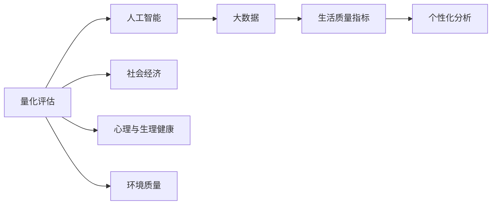

                 

# 体验量化革命先锋：AI驱动的生活质量评估专家

> 关键词：量化,人工智能,生活质量评估,数据分析,机器学习

## 1. 背景介绍

随着人类社会的快速发展和经济水平的不断提高，人们的物质生活条件得到了极大的改善。然而，生活质量的评估不仅包括物质条件，还涉及心理、环境、社会等多个维度。因此，如何全面、准确地衡量个人或群体的幸福感和生活满意度，成为了当下亟需解决的问题。

生活质量评估（Quality of Life, QoL）涉及大量的数据获取和分析，包括问卷调查、生理健康指标、社会经济数据等。传统的人工统计方法费时费力，且易受主观偏差的影响，难以实现精准评估。而人工智能技术的应用，尤其是量化分析与机器学习算法的介入，为高质量的生活质量评估提供了新的可能性。

本文将重点探讨基于人工智能的量化生活质量评估方法，介绍其核心概念、算法原理、实际应用和未来趋势，帮助读者全面理解这一领域的发展现状和应用前景。

## 2. 核心概念与联系

### 2.1 核心概念概述

生活质量评估是一个多维度的复杂问题，涉及到数据的多样性和异构性。其核心概念包括：

- **量化评估**：通过定量的数值来衡量生活质量的高低，避免了传统主观评价的不确定性。
- **人工智能**：包括机器学习、深度学习等技术手段，用于处理和分析大规模数据。
- **生活质量指标**：如心理健康、社会经济、生理健康、环境质量等，综合评估个人的幸福感和满意度。
- **大数据**：涉及个人健康数据、社会经济数据、环境数据等多个来源，需要先进的处理技术。
- **个性化分析**：考虑个体差异，提供针对性的生活质量评估报告。

这些概念之间的逻辑关系可以通过以下Mermaid流程图来展示：



## 3. 核心算法原理 & 具体操作步骤

### 3.1 算法原理概述

基于人工智能的生活质量评估算法，主要包括数据预处理、特征提取、模型训练和结果输出等步骤。其核心思想是通过量化的方法，将各类复杂的生活质量指标转换为可计算的数值，并通过机器学习算法对这些数值进行分析和预测。

形式化地，假设我们有 $n$ 个样本，每个样本有 $m$ 个特征 $x_i$，分别对应生活质量的 $m$ 个指标。目标是为每个样本计算出其生活质量 $Q_i$，并优化模型参数 $\theta$，使得损失函数 $\mathcal{L}$ 最小化。具体的计算过程如下：

1. 数据预处理：对原始数据进行清洗、归一化、特征选择等操作，减少噪声，提升模型训练的效率和效果。
2. 特征提取：将原始数据转化为机器学习算法能够处理的数值特征，如通过PCA等降维算法，简化数据维度。
3. 模型训练：选择合适的机器学习算法，如线性回归、支持向量机、随机森林、深度学习等，对提取后的特征进行训练。
4. 结果输出：根据训练好的模型，对新的样本进行预测，输出其生活质量数值。

### 3.2 算法步骤详解

以下是对基于人工智能的生活质量评估算法详细步骤的详细说明：

**Step 1: 数据预处理**

数据预处理是生活质量评估的重要环节，其目的在于清洗数据、减少噪声、提升数据质量。

- 数据清洗：剔除缺失值、异常值，处理重复数据，保证数据的完整性和准确性。
- 数据归一化：将数据转化为标准正态分布，以便机器学习算法能够处理。
- 特征选择：选择对生活质量有显著影响的特征，减少数据维度，提高模型的泛化能力。

**Step 2: 特征提取**

特征提取是将原始数据转化为机器学习算法能够处理的数值特征。常用的方法包括：

- 统计特征：如均值、中位数、标准差、偏度、峰度等，用于描述数据的基本分布情况。
- 降维算法：如主成分分析（PCA）、线性判别分析（LDA）、t-SNE等，用于减少特征维度，提升模型训练速度和效果。
- 文本分析：对文本数据进行词频统计、TF-IDF计算等操作，提取文本特征。

**Step 3: 模型训练**

选择合适的机器学习算法，并对提取后的特征进行训练。常用的算法包括：

- 线性回归：适用于连续型数据，可用于预测生活质量的数值。
- 支持向量机（SVM）：适用于分类和回归问题，可处理高维数据。
- 随机森林：适用于高维数据和复杂特征，具有较好的泛化能力和解释性。
- 深度学习：如神经网络、卷积神经网络（CNN）、循环神经网络（RNN）等，可处理非线性数据，适用于复杂的评估任务。

**Step 4: 结果输出**

模型训练完成后，对新的样本进行预测，输出其生活质量数值。具体的输出方法包括：

- 分数评估：根据预测结果，计算出每个生活质量指标的评分，如满意度、幸福感等。
- 可视化展示：将预测结果以图表形式展示，便于理解和比较。

### 3.3 算法优缺点

基于人工智能的生活质量评估算法具有以下优点：

1. **自动化程度高**：自动化处理数据清洗、归一化、特征选择等步骤，减少了人工干预。
2. **模型泛化能力强**：可处理大规模数据，具有较好的泛化能力，适用于不同的评估场景。
3. **结果可解释性**：通过特征工程和模型选择，可提高结果的可解释性，帮助用户理解评估结果。

但该方法也存在一些局限性：

1. **数据依赖性强**：评估结果高度依赖于数据的质量和数量，获取高质量数据成本较高。
2. **模型复杂度高**：深度学习模型结构复杂，训练和推理速度较慢，对计算资源要求较高。
3. **模型偏见**：模型可能会学习到数据中的偏见，导致评估结果有偏差。
4. **数据隐私问题**：涉及大量个人隐私数据，需要采取隐私保护措施。

## 4. 数学模型和公式 & 详细讲解 & 举例说明

### 4.1 数学模型构建

假设我们有一个包含 $n$ 个样本的数据集 $D=\{(x_1,y_1),(x_2,y_2),\cdots,(x_n,y_n)\}$，其中 $x_i$ 为特征向量，$y_i$ 为生活质量的评分。我们的目标是通过机器学习算法 $M_{\theta}$ 学习模型参数 $\theta$，使其能够对新样本 $x$ 进行准确的预测。

数学模型构建如下：

$$
\min_{\theta} \sum_{i=1}^n \ell(M_{\theta}(x_i),y_i)
$$

其中 $\ell$ 为损失函数，如均方误差（MSE）、交叉熵（CE）等，用于衡量预测值与真实值之间的差距。

### 4.2 公式推导过程

以线性回归模型为例，其基本公式为：

$$
y = \theta^T x + b
$$

其中 $x$ 为特征向量，$\theta$ 为模型参数，$b$ 为截距。目标是最小化损失函数：

$$
\mathcal{L}(\theta) = \frac{1}{2n} \sum_{i=1}^n (y_i - \theta^T x_i - b)^2
$$

通过梯度下降算法，求解最小化损失函数：

$$
\theta = \theta - \eta \nabla_{\theta} \mathcal{L}(\theta)
$$

其中 $\eta$ 为学习率，$\nabla_{\theta} \mathcal{L}(\theta)$ 为损失函数对参数 $\theta$ 的梯度。

### 4.3 案例分析与讲解

假设我们有一组关于心理健康的数据集，其中每个样本包含以下特征：年龄、性别、月收入、工作满意度、社交支持度等。我们的目标是通过这些数据评估个体的心理健康状况。

**Step 1: 数据预处理**

对数据进行清洗和归一化处理，如去除缺失值、异常值，将数据转换为标准正态分布。

**Step 2: 特征提取**

使用PCA对数据进行降维，选择对心理健康有显著影响的特征，如月收入、工作满意度、社交支持度等。

**Step 3: 模型训练**

选择线性回归模型，对提取后的特征进行训练，得到心理健康评分的线性预测公式。

**Step 4: 结果输出**

将新的样本输入模型，输出心理健康评分的预测值。

## 5. 项目实践：代码实例和详细解释说明

### 5.1 开发环境搭建

在进行生活质量评估的项目实践前，我们需要准备好开发环境。以下是使用Python进行PyTorch开发的环境配置流程：

1. 安装Anaconda：从官网下载并安装Anaconda，用于创建独立的Python环境。

2. 创建并激活虚拟环境：
```bash
conda create -n pytorch-env python=3.8 
conda activate pytorch-env
```

3. 安装PyTorch：根据CUDA版本，从官网获取对应的安装命令。例如：
```bash
conda install pytorch torchvision torchaudio cudatoolkit=11.1 -c pytorch -c conda-forge
```

4. 安装相关库：
```bash
pip install pandas numpy matplotlib scikit-learn torch
```

5. 安装TensorFlow：
```bash
pip install tensorflow
```

6. 安装TensorBoard：
```bash
pip install tensorboard
```

7. 安装Weights & Biases：
```bash
pip install weightsandbiases
```

完成上述步骤后，即可在`pytorch-env`环境中开始项目实践。

### 5.2 源代码详细实现

下面以线性回归模型为例，给出使用PyTorch进行生活质量评估的代码实现。

```python
import torch
import torch.nn as nn
import torch.optim as optim
import pandas as pd
from sklearn.model_selection import train_test_split
from sklearn.preprocessing import StandardScaler

# 加载数据
data = pd.read_csv('data.csv')
X = data.drop('quality', axis=1)
y = data['quality']
scaler = StandardScaler()
X = scaler.fit_transform(X)

# 划分训练集和测试集
X_train, X_test, y_train, y_test = train_test_split(X, y, test_size=0.2, random_state=42)

# 定义模型
class LinearRegression(nn.Module):
    def __init__(self, input_dim):
        super(LinearRegression, self).__init__()
        self.linear = nn.Linear(input_dim, 1)

    def forward(self, x):
        return self.linear(x)

# 训练模型
model = LinearRegression(X_train.shape[1])
criterion = nn.MSELoss()
optimizer = optim.SGD(model.parameters(), lr=0.01)
epochs = 1000

for epoch in range(epochs):
    optimizer.zero_grad()
    y_pred = model(X_train)
    loss = criterion(y_pred, y_train)
    loss.backward()
    optimizer.step()
    if (epoch+1) % 100 == 0:
        print(f'Epoch [{epoch+1}/{epochs}], Loss: {loss.item():.4f}')

# 测试模型
model.eval()
with torch.no_grad():
    y_pred = model(X_test)
    mse = criterion(y_pred, y_test).item()
    print(f'Test MSE: {mse:.4f}')
```

以上代码实现了基于线性回归模型的生活质量评估。

### 5.3 代码解读与分析

**线性回归模型类（LinearRegression）**：

- 定义了线性回归模型的基本结构，包含一个线性层和一个激活函数。

**数据预处理**：

- 使用Pandas库加载数据，并使用StandardScaler进行归一化处理。
- 通过train_test_split将数据集划分为训练集和测试集。

**模型训练**：

- 定义线性回归模型，选择均方误差作为损失函数，使用SGD优化器进行模型训练。
- 在每个epoch中，前向传播计算预测值，计算损失，反向传播更新模型参数。

**模型测试**：

- 使用测试集对模型进行测试，计算均方误差（MSE），评估模型性能。

## 6. 实际应用场景

### 6.1 智能健康管理

基于人工智能的生活质量评估技术，可以广泛应用于智能健康管理系统的构建。传统的健康管理系统往往依赖于手动填写问卷和定期体检，数据获取难度大、成本高。而使用生活质量评估模型，可以通过智能设备和传感器实时采集生理数据和生活行为数据，自动分析并输出健康评估报告。

在技术实现上，可以部署生活质量评估模型于智能穿戴设备中，如智能手表、智能手环等，实时监测用户的生理指标和生活行为，如心率、步数、睡眠质量等。通过模型对这些数据进行分析和评估，输出健康建议和生活改善建议，帮助用户保持健康状态，提升生活质量。

### 6.2 心理辅导与支持

生活质量评估模型可以结合心理辅导与支持系统，为心理疾病患者提供个性化治疗建议和情感支持。传统的心理治疗依赖于手动填写问卷和专业医生的面诊，治疗效果难以量化和评估。而使用生活质量评估模型，可以通过问卷调查和生理数据，量化评估患者的心理健康状态，自动生成心理治疗方案，辅助医生进行诊断和治疗。

具体而言，可以为心理疾病患者设置定期的心理健康问卷，收集其心理状态和生理数据。通过生活质量评估模型对这些数据进行分析，生成心理健康报告，并根据报告内容，生成个性化的心理治疗方案。患者可以通过APP或平台，获取个性化的心理支持和治疗建议，实时监测自己的心理健康状态，提升治疗效果。

### 6.3 社区健康管理

生活质量评估模型可以应用于社区健康管理，通过实时监测和分析社区居民的生活质量，提供健康管理建议，改善社区环境和生活质量。传统的社区健康管理依赖于人工统计和抽样调查，难以实现精细化管理。而使用生活质量评估模型，可以通过社区卫生服务中心的智能设备，实时监测居民的生活质量，自动生成健康管理报告，提供健康管理建议。

具体而言，可以在社区卫生服务中心部署生活质量评估模型，通过智能设备实时监测居民的生理数据和生活行为数据。模型对这些数据进行分析，生成健康报告，并根据报告内容，生成个性化的健康管理建议，如健康饮食、运动指导等。通过APP或平台，居民可以获取个性化的健康建议，实时监测自己的健康状态，提升生活质量。

### 6.4 未来应用展望

随着人工智能技术的发展，基于生活质量评估模型的应用将进一步拓展，为人类健康和生活质量带来深远影响。

- **智慧城市建设**：在智慧城市建设中，生活质量评估模型可以应用于公共健康监测、环境质量评估等方面，提高城市管理的智能化和精细化水平，构建更加宜居的城市环境。
- **企业人力资源管理**：在企业人力资源管理中，生活质量评估模型可以应用于员工心理健康评估、工作满意度调查等方面，帮助企业提升员工幸福感和工作效率，优化人力资源配置。
- **智能教育**：在智能教育领域，生活质量评估模型可以应用于学生心理健康评估、学习效果评估等方面，提供个性化的教育建议和学习支持，提升学生的学习效果和幸福感。

## 7. 工具和资源推荐

### 7.1 学习资源推荐

为了帮助开发者系统掌握基于人工智能的生活质量评估技术，这里推荐一些优质的学习资源：

1. 《深度学习》课程：由斯坦福大学开设，涵盖深度学习的基本概念和常用算法，适合入门学习。

2. 《Python机器学习》书籍：由Sebastian Raschka和Vahid Mirjalili合著，全面介绍了机器学习的基本流程和实用技巧。

3. 《机器学习实战》书籍：由Peter Harrington撰写，提供丰富的实践案例和代码示例，适合动手练习。

4. TensorFlow官方文档：提供了详细的API文档和教程，帮助开发者快速上手TensorFlow。

5. Weights & Biases官方文档：提供了模型训练的实验跟踪和可视化工具，帮助开发者监控模型训练过程。

通过这些学习资源的学习实践，相信你一定能够全面掌握基于人工智能的生活质量评估技术，并用于解决实际问题。

### 7.2 开发工具推荐

高效的开发离不开优秀的工具支持。以下是几款用于生活质量评估开发的常用工具：

1. PyTorch：基于Python的开源深度学习框架，灵活动态的计算图，适合快速迭代研究。

2. TensorFlow：由Google主导开发的开源深度学习框架，生产部署方便，适合大规模工程应用。

3. Weights & Biases：模型训练的实验跟踪工具，可以记录和可视化模型训练过程中的各项指标，方便对比和调优。

4. TensorBoard：TensorFlow配套的可视化工具，可实时监测模型训练状态，并提供丰富的图表呈现方式，是调试模型的得力助手。

5. Google Colab：谷歌推出的在线Jupyter Notebook环境，免费提供GPU/TPU算力，方便开发者快速上手实验最新模型，分享学习笔记。

合理利用这些工具，可以显著提升生活质量评估任务的开发效率，加快创新迭代的步伐。

### 7.3 相关论文推荐

基于人工智能的生活质量评估技术涉及诸多研究方向，以下是几篇奠基性的相关论文，推荐阅读：

1. "A Survey on Quality of Life: Towards Better Health Management"：一篇综述文章，系统总结了生活质量评估的研究现状和未来发展方向。

2. "Deep Learning for Health: A Review"：一篇关于深度学习在健康管理中应用的综述文章，介绍了深度学习在医学影像、生理监测等方面的应用。

3. "A Deep Learning Approach for Patient Monitoring in Healthcare"：介绍了一种基于深度学习的人体生理监测系统，利用卷积神经网络进行信号处理和分析。

4. "Health Monitoring and Smart Healthcare Services"：介绍了一种基于生活质量评估的智能健康管理系统，结合生理监测和心理辅导，提供个性化的健康管理建议。

这些论文代表了大规模生活质量评估技术的发展脉络。通过学习这些前沿成果，可以帮助研究者把握学科前进方向，激发更多的创新灵感。

## 8. 总结：未来发展趋势与挑战

### 8.1 总结

本文对基于人工智能的生活质量评估方法进行了全面系统的介绍。首先阐述了生活质量评估的复杂性和重要性，明确了人工智能技术在这一领域的应用前景和潜力。其次，从原理到实践，详细讲解了生活质量评估的数学模型和算法流程，给出了具体的生活质量评估代码实例。同时，本文还广泛探讨了生活质量评估在智能健康管理、心理辅导与支持、社区健康管理等多个行业领域的应用前景，展示了该技术的广泛应用潜力。此外，本文精选了生活质量评估技术的各类学习资源，力求为读者提供全方位的技术指引。

通过本文的系统梳理，可以看到，基于人工智能的生活质量评估方法正在成为医疗、健康、社会治理等领域的重要工具，极大地提升了生活质量评估的准确性和效率。未来，伴随人工智能技术的进一步发展，生活质量评估技术必将发挥更大的作用，为人类社会带来更深远的影响。

### 8.2 未来发展趋势

展望未来，基于人工智能的生活质量评估技术将呈现以下几个发展趋势：

1. **数据融合技术**：结合多源数据，如生理监测、环境监测、社会经济数据等，进行综合评估，提高评估的全面性和准确性。

2. **个性化评估技术**：利用深度学习技术，结合用户历史数据，进行个性化的生活质量评估，提供定制化的健康管理建议。

3. **跨模态评估技术**：结合文本数据、图像数据、音频数据等多种模态数据，进行跨模态评估，提升评估的准确性和鲁棒性。

4. **实时评估技术**：通过物联网技术，实时采集生理数据和生活行为数据，进行实时的健康监测和评估，提供即时反馈。

5. **分布式评估技术**：利用云计算和边缘计算技术，进行分布式评估，提高评估的效率和可用性。

6. **隐私保护技术**：利用差分隐私、联邦学习等技术，保护用户隐私，确保评估过程的透明和公正。

以上趋势凸显了基于人工智能的生活质量评估技术的广阔前景。这些方向的探索发展，必将进一步提升生活质量评估的精准性和实用性，为人类健康和生活质量带来深远影响。

### 8.3 面临的挑战

尽管基于人工智能的生活质量评估技术已经取得了瞩目成就，但在迈向更加智能化、普适化应用的过程中，它仍面临着诸多挑战：

1. **数据获取难度大**：高质量的生活质量数据获取难度大，需要广泛的数据采集和处理，成本较高。

2. **模型复杂度高**：深度学习模型结构复杂，训练和推理速度较慢，对计算资源要求较高。

3. **模型偏见问题**：模型可能会学习到数据中的偏见，导致评估结果有偏差，需注意算法的公平性和公正性。

4. **隐私保护问题**：涉及大量个人隐私数据，需采取隐私保护措施，确保数据安全。

5. **模型解释性不足**：深度学习模型黑盒特性较强，难以解释其内部工作机制，需提高模型的可解释性。

6. **模型鲁棒性不足**：模型在面对异常数据和复杂场景时，可能出现泛化性能下降，需提高模型的鲁棒性。

以上挑战需要研究者不断探索和解决，才能使基于人工智能的生活质量评估技术走向成熟和实用。

### 8.4 研究展望

面对基于人工智能的生活质量评估技术所面临的挑战，未来的研究需要在以下几个方面寻求新的突破：

1. **多源数据融合技术**：结合多种模态数据，进行综合评估，提升评估的全面性和准确性。

2. **个性化评估技术**：利用深度学习技术，结合用户历史数据，进行个性化的生活质量评估，提供定制化的健康管理建议。

3. **跨模态评估技术**：结合文本数据、图像数据、音频数据等多种模态数据，进行跨模态评估，提升评估的准确性和鲁棒性。

4. **实时评估技术**：通过物联网技术，实时采集生理数据和生活行为数据，进行实时的健康监测和评估，提供即时反馈。

5. **分布式评估技术**：利用云计算和边缘计算技术，进行分布式评估，提高评估的效率和可用性。

6. **隐私保护技术**：利用差分隐私、联邦学习等技术，保护用户隐私，确保评估过程的透明和公正。

这些研究方向将引领基于人工智能的生活质量评估技术迈向更高的台阶，为构建安全、可靠、可解释、可控的智能系统铺平道路。面向未来，生活质量评估技术还需要与其他人工智能技术进行更深入的融合，如知识表示、因果推理、强化学习等，多路径协同发力，共同推动自然语言理解和智能交互系统的进步。只有勇于创新、敢于突破，才能不断拓展人工智能技术在生活质量评估领域的边界，让智能技术更好地造福人类社会。

## 9. 附录：常见问题与解答

**Q1: 什么是生活质量评估（QoL）？**

A: 生活质量评估（QoL）是一种通过定量的数值来衡量个人或群体幸福感和满意度的评估方法，涉及心理、生理、社会、环境等多个维度。

**Q2: 如何选择合适的机器学习算法？**

A: 选择机器学习算法时，需考虑数据类型、任务类型、模型复杂度等因素。如分类任务可使用支持向量机（SVM）、随机森林等，回归任务可使用线性回归、神经网络等，复杂任务可使用深度学习等。

**Q3: 如何缓解数据偏见问题？**

A: 缓解数据偏见问题，可采用以下方法：

1. 数据清洗：去除异常值和偏差较大的数据，减少偏见影响。

2. 特征工程：选择与目标任务无关的特征，减少偏见来源。

3. 模型集成：结合多个模型的输出，降低单个模型的偏见风险。

4. 偏差校正：通过偏差校正技术，纠正模型中的偏见。

**Q4: 如何提高模型的解释性？**

A: 提高模型解释性，可采用以下方法：

1. 特征选择：选择与目标任务相关的特征，简化模型结构。

2. 可解释模型：选择可解释性较强的模型，如线性回归、决策树等。

3. 模型可视化：通过可视化工具，展示模型内部工作机制和决策路径。

4. 模型解释算法：利用模型解释算法，如LIME、SHAP等，生成模型的解释报告。

这些方法可以帮助提高模型的解释性，增强用户对模型输出的信任和理解。

**Q5: 如何处理异常数据？**

A: 处理异常数据，可采用以下方法：

1. 数据清洗：去除异常值和离群点，减少对模型的干扰。

2. 异常检测：使用异常检测算法，识别和处理异常数据。

3. 数据增强：通过数据增强技术，生成更多的训练样本，增强模型的鲁棒性。

4. 模型鲁棒性训练：通过鲁棒性训练技术，训练模型对异常数据具有较好的处理能力。

这些方法可以帮助提高模型的鲁棒性和稳定性，提升模型在复杂场景下的表现。

通过以上回答，相信你一定能够全面理解基于人工智能的生活质量评估技术，并掌握其核心原理和实际应用。未来，随着技术的发展和应用的深入，生活质量评估技术必将带来更加深刻的社会变革，为人类幸福和生活质量带来新的希望和机遇。

