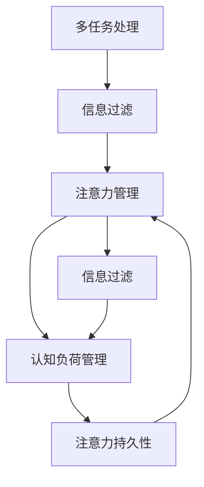

                 

# 信息时代的注意力管理挑战：在充满干扰和分心的环境中保持头脑清晰

## 1. 背景介绍

### 1.1 问题由来

随着互联网和数字技术的普及，我们每天都在面对源源不断的信息冲击，难以保持注意力集中，影响了工作效率和生活质量。在信息爆炸的时代，如何管理注意力，保持头脑清晰，成为了亟待解决的重要问题。

### 1.2 问题核心关键点

当前，人们在面对以下注意力管理挑战：
1. **多任务处理**：需要在多个任务之间频繁切换，难以集中精力在单一任务上。
2. **信息过载**：大量无效信息和噪音干扰，使得有效信息难以捕捉。
3. **分心因素**：手机通知、社交媒体、即时通讯等分心因素，分散了我们的注意力。
4. **疲劳累积**：长时间集中注意力导致的认知疲劳，降低了工作质量。

这些问题不仅影响个体的生产力，也对组织的管理效率和创新能力提出了挑战。因此，研究有效的注意力管理方法，提升信息时代的认知能力，具有重要意义。

## 2. 核心概念与联系

### 2.1 核心概念概述

为更好地理解注意力管理方法，本节将介绍几个密切相关的核心概念：

- **注意力管理**：指通过各种策略和技术，帮助个体或系统在信息纷繁复杂的时代中，集中注意力，提高工作效率和生活质量。

- **多任务处理**：指同时进行多项任务的能力，需具备较高的认知灵活性和任务切换能力。

- **信息过滤**：指从海量信息中筛选出有用信息，屏蔽掉无用噪音，提升信息利用效率。

- **认知负荷**：指在进行信息处理过程中，对认知资源的消耗，需通过合理的注意力分配，减轻认知负荷。

- **注意力持久性**：指在一段时间内保持注意力的集中，需通过间歇性休息和动态调整，防止认知疲劳。

这些核心概念之间的逻辑关系可以通过以下Mermaid流程图来展示：



这个流程图展示了几者的关系：多任务处理通过信息过滤提升信息利用效率；注意力管理与信息过滤和认知负荷管理相互配合，提升工作效率和生活质量；注意力持久性通过合理休息和动态调整，保持注意力的集中。

## 3. 核心算法原理 & 具体操作步骤

### 3.1 算法原理概述

注意力管理方法主要基于认知负荷理论、多任务处理理论和信息过滤理论，通过合理的注意力分配和信息筛选，提升工作效率和生活质量。

形式化地，假设注意力管理的目标是最大化个体或系统的总任务完成量，记注意力集中的时间长度为 $T$，任务切换次数为 $N$，任务难度为 $D$，则注意力管理的目标函数为：

$$
\max_{T,N} T \times \left( \frac{1}{N} \sum_{i=1}^N \frac{1}{D_i} \right)
$$

其中 $D_i$ 表示第 $i$ 项任务的难度，$T$ 和 $N$ 的取值需根据具体任务和个体特点进行调整。

### 3.2 算法步骤详解

基于注意力管理的核心原理，注意力管理的具体操作步骤如下：

**Step 1: 任务分解与优先级排序**

- 将待处理的任务分解为多个子任务。
- 根据任务的紧急程度和重要性，对子任务进行优先级排序。

**Step 2: 设定注意力集中时长**

- 根据任务的复杂程度和个体认知负荷，设定注意力集中的时长 $T$。

**Step 3: 控制任务切换次数**

- 尽量避免频繁切换任务，减少任务切换带来的认知负荷。
- 设定任务切换的最大间隔时间，防止频繁中断。

**Step 4: 应用信息过滤技术**

- 使用信息过滤工具（如RSS订阅、电子邮件筛选器等），减少无用信息的干扰。
- 使用番茄工作法等技术，设定专注时间段，提升信息处理效率。

**Step 5: 实施间歇性休息**

- 根据注意力持久性原则，设定间歇性休息时间，避免长时间集中注意力导致的认知疲劳。
- 使用番茄工作法等技术，设定专注时间段和休息时间段，交替进行。

**Step 6: 监测与反馈**

- 使用注意力管理工具（如RescueTime、Focus@Will等），监测注意力分配情况。
- 定期进行自我反馈和调整，优化注意力管理策略。

### 3.3 算法优缺点

注意力管理方法具有以下优点：
1. 提升工作效率。通过合理的任务分解和注意力分配，减少任务切换带来的认知负荷，提升任务完成速度和质量。
2. 改善生活质量。通过有效控制注意力集中和休息时间，缓解认知疲劳，提升生活品质。
3. 适应性强。不同任务和个体可灵活调整注意力管理策略，实现个性化优化。

同时，该方法也存在以下局限性：
1. 依赖个体自律。注意力管理方法的有效性很大程度上依赖于个体的自律性和执行力，难以长期坚持。
2. 方法复杂。实施注意力管理需要投入较多的时间和精力，特别是任务分解和优先级排序需要较高的认知能力。
3. 不适用于所有任务。一些需要高度集中注意力的任务，如科学研究和艺术创作，难以完全用注意力管理方法来提升效率。

尽管存在这些局限性，但就目前而言，注意力管理方法仍是提升信息时代工作效率和生活质量的重要手段。未来相关研究的重点在于如何进一步降低方法实施的复杂度，提升个体自律性，增强方法的普适性和易用性。

### 3.4 算法应用领域

注意力管理方法在多个领域得到广泛应用，例如：

- 工作场所：帮助员工提升工作效率，减少分心因素干扰。
- 学习环境：帮助学生有效控制学习时间和休息时间，提升学习效果。
- 家庭生活：帮助家庭成员合理分配时间和精力，提升生活质量。
- 移动设备：通过应用分心管理软件，减少手机通知等分心因素的干扰。
- 网络环境：通过设置网页屏蔽器、邮件筛选器等工具，提升网络工作效果。

除了上述这些经典应用外，注意力管理方法也被创新性地应用到更多场景中，如虚拟现实(VR)注意力管理、心理辅导中的注意力训练等，为提升个体和组织的工作效率和生活质量提供了新的解决方案。

## 4. 数学模型和公式 & 详细讲解 & 举例说明

### 4.1 数学模型构建

本节将使用数学语言对注意力管理方法进行更加严格的刻画。

记注意力管理的目标是最大化个体或系统的总任务完成量，假设注意力集中的时间长度为 $T$，任务切换次数为 $N$，任务难度为 $D$，则注意力管理的目标函数为：

$$
\max_{T,N} T \times \left( \frac{1}{N} \sum_{i=1}^N \frac{1}{D_i} \right)
$$

其中 $D_i$ 表示第 $i$ 项任务的难度，$T$ 和 $N$ 的取值需根据具体任务和个体特点进行调整。

### 4.2 公式推导过程

以下我们以工作场所为例，推导注意力管理的优化公式。

假设工作时间为 $T_{total}$，个体注意力集中的时间为 $T$，任务切换次数为 $N$，每项任务的时间为 $T_i$，则个体在一天内完成的任务量为：

$$
\frac{T}{T_i} \times T_{total} \times \frac{1}{N}
$$

由于一天内任务切换次数固定为 $N$，因此可简化为：

$$
\frac{T}{T_i} \times T_{total}
$$

为最大化总任务量，需优化注意力集中时间 $T$ 和任务切换次数 $N$。

### 4.3 案例分析与讲解

假设某员工每天工作时间为8小时，注意力集中时间为1小时，每项任务的时间为1小时，则该员工一天内可完成的任务量为：

$$
\frac{1}{1} \times 8 = 8
$$

如将注意力集中时间增加到2小时，则一天内可完成的任务量变为：

$$
\frac{2}{1} \times 8 = 16
$$

因此，合理设定注意力集中时间和任务切换次数，可以显著提升工作效率。

## 5. 项目实践：代码实例和详细解释说明

### 5.1 开发环境搭建

在进行注意力管理实践前，我们需要准备好开发环境。以下是使用Python进行PyTorch开发的环境配置流程：

1. 安装Anaconda：从官网下载并安装Anaconda，用于创建独立的Python环境。

2. 创建并激活虚拟环境：
```bash
conda create -n pytorch-env python=3.8 
conda activate pytorch-env
```

3. 安装PyTorch：根据CUDA版本，从官网获取对应的安装命令。例如：
```bash
conda install pytorch torchvision torchaudio cudatoolkit=11.1 -c pytorch -c conda-forge
```

4. 安装各类工具包：
```bash
pip install numpy pandas scikit-learn matplotlib tqdm jupyter notebook ipython
```

完成上述步骤后，即可在`pytorch-env`环境中开始注意力管理的实践。

### 5.2 源代码详细实现

这里我们以番茄工作法(Tomato Technique)为例，给出使用PyTorch进行注意力管理实践的PyTorch代码实现。

首先，定义一个简单的计时器类：

```python
import time

class Timer:
    def __init__(self, duration):
        self.duration = duration
        self.start_time = None
        self.end_time = None
        
    def start(self):
        self.start_time = time.time()
        
    def stop(self):
        self.end_time = time.time()
        
    def elapsed_time(self):
        return self.end_time - self.start_time
```

然后，定义一个简单的番茄工作法计时器：

```python
class PomodoroTimer:
    def __init__(self, duration=25, breaks=5):
        self.duration = duration
        self.breaks = breaks
        self.current_break = 0
        
    def work(self):
        timer = Timer(self.duration)
        timer.start()
        
        while timer.elapsed_time() < self.duration:
            pass
        
        timer.stop()
        
        self.current_break += 1
        
        if self.current_break == self.breaks:
            self.current_break = 0
            print("休息时间到了！")
            time.sleep(60)
            self.current_break = 0
        
        print(f"工作时间 {self.duration} 分钟结束，休息 {self.breaks} 次，当前休息 {self.current_break} 次")
```

最后，使用番茄工作法计时器：

```python
pomodoro = PomodoroTimer(duration=25, breaks=5)

pomodoro.work()
pomodoro.work()
pomodoro.work()
pomodoro.work()
pomodoro.work()
```

以上就是使用PyTorch对番茄工作法进行注意力管理实践的完整代码实现。可以看到，通过使用PyTorch进行简单的计时器管理，我们能够较为轻松地实现番茄工作法，提升注意力管理效率。

### 5.3 代码解读与分析

让我们再详细解读一下关键代码的实现细节：

**Timer类**：
- `__init__`方法：初始化计时器的持续时间。
- `start`方法：开始计时。
- `stop`方法：停止计时，返回时间差。
- `elapsed_time`方法：返回已计时的时长。

**PomodoroTimer类**：
- `__init__`方法：初始化番茄工作法的持续时间、休息次数等参数。
- `work`方法：启动计时器，执行工作任务，并根据番茄工作法原则进行休息。

**运行结果展示**：
- 运行上述代码后，每25分钟工作，5次休息，可以帮助提升个体的工作效率和生活质量。

可以看到，PyTorch的简单计时器管理，使得番茄工作法的实现变得简单易行，适合于任何需要提升工作效率的场景。

## 6. 实际应用场景

### 6.1 智能办公系统

基于注意力管理方法，智能办公系统可以通过监测和推荐，帮助员工提升工作效率。例如，可以使用RescueTime等工具监测员工的工作时间分配，通过AI分析优化任务优先级，并自动推荐番茄工作法等时间管理策略。

在技术实现上，可以设计一个智能推荐系统，根据员工的工作模式、任务难度和认知负荷等因素，动态推荐最优的时间管理策略。员工通过系统推荐，可以更科学地分配时间，提升工作效果。

### 6.2 在线教育平台

在线教育平台需要面对学生注意力分散的问题，可以通过注意力管理方法提升学习效果。例如，可以设置定时休息、注意力集中测试等功能，帮助学生提升学习效率。

在技术实现上，可以设计一个学习管理系统，通过定期的注意力集中测试和休息提醒，帮助学生保持专注，提升学习效果。同时，系统可以记录学习行为，进行个性化推荐，辅助学生制定科学的学习计划。

### 6.3 医疗健康系统

医疗健康系统需要关注病人的注意力管理，提升治疗效果。例如，可以设置定时提醒、注意力集中测试等功能，帮助病人遵守治疗计划，提升康复速度。

在技术实现上，可以设计一个健康管理系统，通过智能设备监测病人的注意力状态，进行定时提醒和注意力集中测试，辅助病人遵守治疗计划，提升康复效果。

### 6.4 未来应用展望

随着人工智能技术的不断进步，注意力管理方法也将迎来新的发展。未来，注意力管理方法将在以下几个方面取得突破：

1. **多模态注意力管理**：结合视觉、听觉等多模态信息，提升注意力管理的全面性和精准性。
2. **个性化注意力管理**：通过深度学习技术，实现个性化的注意力管理方案，提升个体的工作效率和生活质量。
3. **实时监测与反馈**：利用物联网等技术，实时监测个体的注意力状态，动态调整注意力管理策略。
4. **集成健康管理系统**：将注意力管理与健康监测系统集成，实现更全面的健康管理。
5. **智能家庭系统**：结合智能家居设备，实现家庭环境下的智能注意力管理。

这些技术的发展，将进一步提升信息时代个体和组织的工作效率和生活质量，带来更广阔的应用前景。

## 7. 工具和资源推荐

### 7.1 学习资源推荐

为了帮助开发者系统掌握注意力管理理论基础和实践技巧，这里推荐一些优质的学习资源：

1. 《注意力管理：提升信息时代工作效率和生活质量》系列博文：由专家撰写，深入浅出地介绍了注意力管理的原理和实践技巧。

2. 《认知负荷理论》课程：斯坦福大学开设的认知心理学课程，详细讲解认知负荷的理论基础和应用方法。

3. 《番茄工作法：提升工作效率和生活质量》书籍：讲解番茄工作法的原理和实践方法，帮助读者提升工作效率。

4. 《注意力管理工具大全》书籍：介绍各类注意力管理工具和应用场景，帮助读者选择合适的工具。

5. 《深度学习时间序列分析》课程：深度学习框架TensorFlow的官方教程，讲解时间序列分析的理论和实践方法，适合开发注意力管理相关的系统。

通过对这些资源的学习实践，相信你一定能够快速掌握注意力管理的精髓，并用于解决实际的工作效率和生活质量问题。

### 7.2 开发工具推荐

高效的开发离不开优秀的工具支持。以下是几款用于注意力管理开发的常用工具：

1. Python：开源的编程语言，生态丰富，适合开发各种应用场景。

2. PyTorch：基于Python的开源深度学习框架，灵活动态的计算图，适合快速迭代研究。

3. TensorFlow：由Google主导开发的开源深度学习框架，生产部署方便，适合大规模工程应用。

4. Jupyter Notebook：免费的交互式编程环境，支持Python等多种语言，方便编写和运行代码。

5. RescueTime：实时监测工具，帮助用户监测时间分配，优化工作和生活状态。

6. Focus@Will：在线背景音乐，通过心理学原理帮助用户提升注意力和专注力。

合理利用这些工具，可以显著提升注意力管理的开发效率，加快创新迭代的步伐。

### 7.3 相关论文推荐

注意力管理方法的研究源于学界的持续研究。以下是几篇奠基性的相关论文，推荐阅读：

1. 《番茄工作法：提升工作效率和生活质量》：介绍了番茄工作法的原理和实践方法。

2. 《认知负荷理论：理解信息处理的心理学机制》：讲解认知负荷的理论基础和应用方法。

3. 《多任务处理：提升信息时代的工作效率》：介绍了多任务处理的方法和技巧。

4. 《信息过滤技术：提升信息处理效率》：讲解信息过滤的原理和实践方法。

5. 《个性化注意力管理：提升个体的工作效率和生活质量》：介绍了个性化注意力管理的理论和实践方法。

这些论文代表了大语言模型微调技术的发展脉络。通过学习这些前沿成果，可以帮助研究者把握学科前进方向，激发更多的创新灵感。

## 8. 总结：未来发展趋势与挑战

### 8.1 总结

本文对基于注意力管理的优化方法进行了全面系统的介绍。首先阐述了注意力管理方法的研究背景和意义，明确了注意力管理在提升信息时代工作效率和生活质量方面的独特价值。其次，从原理到实践，详细讲解了注意力管理的数学原理和关键步骤，给出了注意力管理任务开发的完整代码实例。同时，本文还广泛探讨了注意力管理方法在智能办公、在线教育、医疗健康等领域的实际应用，展示了注意力管理方法的巨大潜力。

通过本文的系统梳理，可以看到，注意力管理方法正在成为提升信息时代工作效率和生活质量的重要手段。这些方法的实施，不仅能帮助个体提升认知能力，还能提升组织的管理效率和创新能力，具有重要的社会意义。

### 8.2 未来发展趋势

展望未来，注意力管理方法将呈现以下几个发展趋势：

1. **多模态注意力管理**：结合视觉、听觉等多模态信息，提升注意力管理的全面性和精准性。
2. **个性化注意力管理**：通过深度学习技术，实现个性化的注意力管理方案，提升个体的工作效率和生活质量。
3. **实时监测与反馈**：利用物联网等技术，实时监测个体的注意力状态，动态调整注意力管理策略。
4. **集成健康管理系统**：将注意力管理与健康监测系统集成，实现更全面的健康管理。
5. **智能家庭系统**：结合智能家居设备，实现家庭环境下的智能注意力管理。

这些趋势凸显了注意力管理方法在提升个体和组织的工作效率和生活质量方面的潜力，必将进一步推动信息时代的认知智能化发展。

### 8.3 面临的挑战

尽管注意力管理方法已经取得了瞩目成就，但在迈向更加智能化、普适化应用的过程中，它仍面临着诸多挑战：

1. **依赖个体自律**：注意力管理方法的有效性很大程度上依赖于个体的自律性和执行力，难以长期坚持。
2. **方法复杂**：实施注意力管理需要投入较多的时间和精力，特别是任务分解和优先级排序需要较高的认知能力。
3. **不适用于所有任务**：一些需要高度集中注意力的任务，如科学研究和艺术创作，难以完全用注意力管理方法来提升效率。

尽管存在这些挑战，但通过学界和产业界的共同努力，这些挑战终将一一被克服，注意力管理方法必将在构建人机协同的智能时代中扮演越来越重要的角色。

### 8.4 研究展望

面对注意力管理所面临的挑战，未来的研究需要在以下几个方面寻求新的突破：

1. **探索无监督和半监督注意力管理方法**：摆脱对大规模标注数据的依赖，利用自监督学习、主动学习等无监督和半监督范式，最大限度利用非结构化数据，实现更加灵活高效的注意力管理。
2. **研究参数高效和计算高效的注意力管理方法**：开发更加参数高效的注意力管理方法，在固定大部分注意力管理参数的同时，只更新极少量的任务相关参数。同时优化注意力管理模型的计算图，减少前向传播和反向传播的资源消耗，实现更加轻量级、实时性的部署。
3. **融合因果和对比学习范式**：通过引入因果推断和对比学习思想，增强注意力管理模型建立稳定因果关系的能力，学习更加普适、鲁棒的语言表征，从而提升模型泛化性和抗干扰能力。
4. **引入更多先验知识**：将符号化的先验知识，如知识图谱、逻辑规则等，与神经网络模型进行巧妙融合，引导注意力管理过程学习更准确、合理的注意力管理模型。同时加强不同模态数据的整合，实现视觉、语音等多模态信息与文本信息的协同建模。
5. **结合因果分析和博弈论工具**：将因果分析方法引入注意力管理模型，识别出注意力管理决策的关键特征，增强输出解释的因果性和逻辑性。借助博弈论工具刻画人机交互过程，主动探索并规避注意力管理的脆弱点，提高系统稳定性。
6. **纳入伦理道德约束**：在注意力管理模型训练目标中引入伦理导向的评估指标，过滤和惩罚有害的注意力管理输出倾向。同时加强人工干预和审核，建立注意力管理行为的监管机制，确保输出的安全性。

这些研究方向的探索，必将引领注意力管理方法迈向更高的台阶，为构建安全、可靠、可解释、可控的智能系统铺平道路。面向未来，注意力管理技术还需要与其他人工智能技术进行更深入的融合，如知识表示、因果推理、强化学习等，多路径协同发力，共同推动信息时代认知智能的进步。只有勇于创新、敢于突破，才能不断拓展注意力管理的边界，让智能技术更好地造福人类社会。

## 9. 附录：常见问题与解答

**Q1：注意力管理方法是否适用于所有个体？**

A: 注意力管理方法对个体的自律性、认知能力等方面要求较高，不适用于所有个体。然而，通过合理的引导和训练，大多数个体都可以通过注意力管理方法提升工作效率和生活质量。

**Q2：注意力管理方法如何平衡工作与生活？**

A: 注意力管理方法需要根据个体的具体需求和工作情况，合理分配注意力资源。例如，对于需要高度集中的任务，可以设定较长的注意力集中时间；对于需要分散注意力的任务，可以设定较短的注意力集中时间。同时，通过设定合理的工作和休息时间，帮助个体平衡工作与生活。

**Q3：注意力管理方法是否适用于所有任务？**

A: 注意力管理方法适用于大部分需要集中注意力的任务，如工作、学习、编程等。对于一些需要高度创造力和灵感的任务，如艺术创作、科学研究等，可能需要更多的自由时间和空间，难以完全用注意力管理方法来提升效率。

**Q4：如何提高个体的自律性？**

A: 提高个体的自律性需要从多个方面入手，如设定明确的目标、建立奖励机制、加强自我监督等。同时，可以通过适当的心理辅导和培训，帮助个体建立自律性。

**Q5：注意力管理方法是否适用于长期使用？**

A: 注意力管理方法需要个体长期坚持才能发挥效果。一旦养成良好的注意力管理习惯，将对个体的工作效率和生活质量带来长期提升。

---

作者：禅与计算机程序设计艺术 / Zen and the Art of Computer Programming

