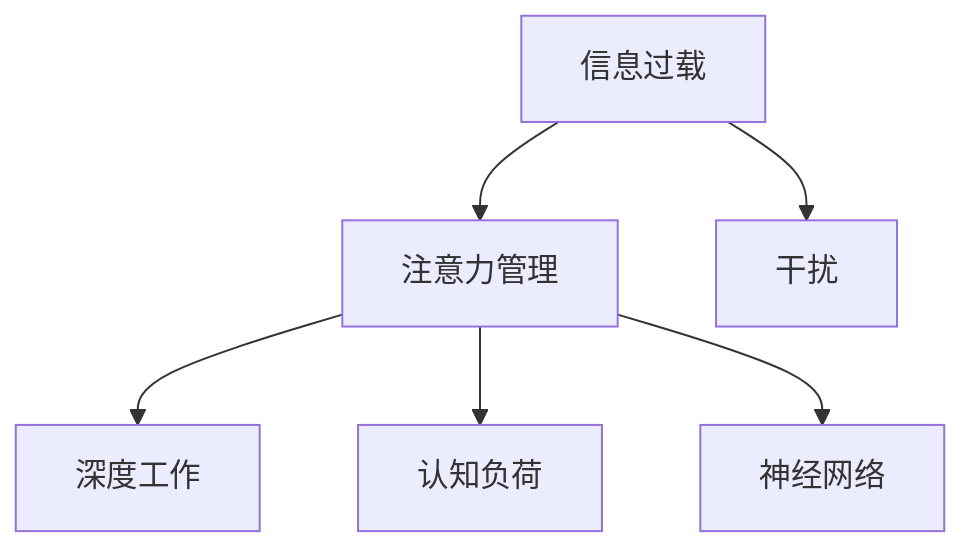

                 

# 信息时代的注意力管理策略：在干扰和信息过载中航行

> 关键词：信息过载, 注意力管理, 干扰, 深度工作, 认知负荷, 神经网络

## 1. 背景介绍

### 1.1 问题由来
随着互联网的普及和智能手机的广泛使用，我们生活在一个充满信息的世界。每天，我们接收着海量的信息，从新闻资讯到社交媒体，从电子邮件到即时消息，信息无所不在。然而，信息的泛滥也带来了注意力管理的挑战。人们往往被信息流所淹没，难以集中注意力完成复杂的认知任务。这对个人的工作效率、健康以及社会协作产生了深远影响。

### 1.2 问题核心关键点
在信息爆炸的时代，注意力管理已经成为我们提高生产力和幸福感的关键。注意力管理涉及到如何识别和筛选信息，如何分配和管理注意力，如何在干扰和信息过载中高效工作。本文将深入探讨这些问题，并提出基于深度学习的信息时代注意力管理策略。

## 2. 核心概念与联系

### 2.1 核心概念概述

为更好地理解信息时代的注意力管理策略，本节将介绍几个关键概念：

- **信息过载(Information Overload)**：指人们接收的信息量远远超出其处理能力，导致认知负荷过重，注意力难以集中。
- **注意力管理(Attention Management)**：指通过策略和方法，帮助个体有效识别和筛选信息，合理分配和管理注意力，以提升生产力和幸福感。
- **干扰(Interference)**：指外界因素对个体注意力和工作状态的不利影响，如噪音、通知、多任务处理等。
- **深度工作(Deep Work)**：指在无干扰的状态下，进行高认知需求的工作，以提升创造力和效率。
- **认知负荷(Cognitive Load)**：指个体在信息处理过程中所需投入的认知资源，过高的认知负荷会导致注意力分散。
- **神经网络(Neural Network)**：一种模拟人脑神经元网络的计算模型，能够通过大量数据学习复杂的模式和关系，在信息管理中具有广泛应用。

这些概念之间的逻辑关系可以通过以下Mermaid流程图来展示：



这个流程图展示了几大核心概念之间的联系：

1. 信息过载是注意力管理的背景和前提。
2. 深度工作是注意力管理的目标，通过减少干扰和认知负荷，提升认知任务的质量。
3. 神经网络是注意力管理的重要工具，帮助识别和筛选信息，优化注意力分配。
4. 干扰和认知负荷是深度工作的敌人，需要通过管理来克服。

## 3. 核心算法原理 & 具体操作步骤
### 3.1 算法原理概述

基于深度学习的信息时代注意力管理策略，是一种通过神经网络模型来识别和管理信息，以提升个体注意力和生产力的技术。其核心思想是：

1. **信息识别**：使用深度学习模型识别重要信息，忽略或屏蔽无关信息。
2. **注意力分配**：根据任务优先级和个体认知负荷，合理分配注意力资源。
3. **干扰过滤**：识别和过滤外部干扰因素，创建有利于深度工作的环境。

### 3.2 算法步骤详解

基于深度学习的信息时代注意力管理策略主要包括以下几个步骤：

**Step 1: 数据准备**
- 收集和标注大量的信息样本，包括文本、图片、音频等，标注其重要性和相关性。
- 选择合适的深度学习模型，如文本分类、图像识别等，用于信息识别。

**Step 2: 模型训练**
- 使用标注数据集训练神经网络模型，使其能够识别重要信息。
- 调整模型参数，以优化信息识别效果，如使用正则化、Dropout、早停等技术。

**Step 3: 注意力分配**
- 使用模型输出信息的重要性得分，结合任务优先级和个体认知负荷，计算注意力分配权重。
- 根据注意力分配权重，动态调整信息处理顺序和资源分配。

**Step 4: 干扰过滤**
- 使用模型识别外部干扰因素，如噪音、通知等，并对其进行过滤或屏蔽。
- 根据干扰频率和强度，动态调整干扰过滤策略。

**Step 5: 深度工作支持**
- 在信息处理过程中，提供深度工作模式，屏蔽干扰，增强专注度。
- 实时监测个体认知负荷，提供休息和调节建议。

### 3.3 算法优缺点

基于深度学习的信息时代注意力管理策略具有以下优点：

1. **高效性**：通过神经网络模型，能够快速识别和筛选信息，合理分配注意力，提升信息处理效率。
2. **适应性**：模型可以根据不同的任务和个体需求进行动态调整，适应性强。
3. **自动化**：通过自动化的信息管理和干扰过滤，减轻人工负担，提升工作效率。

同时，该方法也存在一定的局限性：

1. **数据依赖**：模型训练和优化依赖大量标注数据，数据获取成本高。
2. **计算资源需求高**：神经网络模型的训练和推理需要高性能计算资源。
3. **模型泛化能力**：模型在不同场景和环境中的泛化能力有限，需要持续优化。
4. **隐私和安全**：模型可能涉及个人隐私数据，数据安全和隐私保护是一个重要问题。

尽管存在这些局限性，但就目前而言，基于深度学习的信息时代注意力管理策略仍是大数据时代信息管理的最佳选择之一。未来相关研究的重点在于如何进一步降低数据依赖，提高模型的适应性和泛化能力，同时兼顾隐私保护和安全性等因素。

### 3.4 算法应用领域

基于深度学习的信息时代注意力管理策略已经在多个领域得到了应用，例如：

- **工作管理**：帮助职场人员识别和管理工作中的重要任务和信息，合理分配注意力，提升工作效率。
- **学习管理**：帮助学生识别和管理学习资源，避免信息过载，提升学习效果。
- **健康管理**：帮助用户识别和管理日常生活中的干扰因素，如噪音、通知等，提升生活质量。
- **教育培训**：在在线教育中，通过个性化推荐和干扰过滤，提升学习体验和效果。
- **安全监控**：在安防领域，通过识别和过滤干扰因素，提高监控系统的鲁棒性。

除了上述这些应用场景外，基于深度学习的信息时代注意力管理策略还将在更多领域得到应用，为人类信息处理带来新的突破。

## 4. 数学模型和公式 & 详细讲解 & 举例说明

### 4.1 数学模型构建

本节将使用数学语言对信息时代注意力管理策略进行更加严格的刻画。

设信息集为 $X=\{x_1, x_2, ..., x_n\}$，其中每个信息 $x_i$ 包含 $d$ 维特征向量。设每个信息的真实重要性得分为 $y_i \in [0,1]$，其中 $y_i=1$ 表示信息非常重要，$y_i=0$ 表示信息不重要。

定义神经网络模型为 $f: \mathbb{R}^d \rightarrow [0,1]$，其中 $f(x_i)$ 表示信息 $x_i$ 的重要性得分。设神经网络模型由 $L$ 层神经元组成，其中第 $l$ 层的神经元数为 $h_l$。

### 4.2 公式推导过程

假设神经网络模型采用多层感知机(MLP)结构，输入为 $x_i$，输出为 $f(x_i)$。模型的损失函数为均方误差：

$$
L(f) = \frac{1}{N}\sum_{i=1}^N (y_i - f(x_i))^2
$$

其中，$N$ 为样本数量。

神经网络模型采用反向传播算法进行训练，通过计算梯度更新参数。假设第 $l$ 层的权重矩阵为 $W_l$，偏置向量为 $b_l$，则参数更新公式为：

$$
W_l \leftarrow W_l - \alpha \nabla_{W_l}L(f)
$$

$$
b_l \leftarrow b_l - \alpha \nabla_{b_l}L(f)
$$

其中，$\alpha$ 为学习率。

### 4.3 案例分析与讲解

以文本分类为例，展示如何使用神经网络模型进行信息识别。

假设我们要识别一批新闻文章的重要性，将每篇文章的标题和摘要作为输入，使用BERT模型进行特征提取。然后，将提取的特征输入到一个全连接神经网络，用于计算每篇文章的重要性得分。

具体步骤如下：

1. 使用BERT模型对每篇文章的标题和摘要进行特征提取，得到 $d$ 维特征向量 $x_i$。
2. 将 $x_i$ 输入到一个全连接神经网络 $f(x_i)$，得到每篇文章的重要性得分。
3. 使用均方误差损失函数对模型进行训练，不断调整权重和偏置。
4. 训练结束后，对于新的输入文章，通过计算 $f(x_i)$ 的值，来判断其重要性，并将其分配到合适的注意力集中。

在实际应用中，还需要根据具体任务和需求，进行模型参数的调整和优化，以提升信息识别和注意力管理的精度和效率。

## 5. 项目实践：代码实例和详细解释说明

### 5.1 开发环境搭建

在进行信息时代注意力管理策略的实践前，我们需要准备好开发环境。以下是使用Python进行TensorFlow开发的环境配置流程：

1. 安装Anaconda：从官网下载并安装Anaconda，用于创建独立的Python环境。

2. 创建并激活虚拟环境：
```bash
conda create -n attention_env python=3.8 
conda activate attention_env
```

3. 安装TensorFlow：根据CUDA版本，从官网获取对应的安装命令。例如：
```bash
conda install tensorflow -c tf -c conda-forge
```

4. 安装Keras：用于构建深度学习模型。
```bash
conda install keras
```

5. 安装必要的库：
```bash
pip install numpy pandas sklearn tensorflow-io
```

完成上述步骤后，即可在`attention_env`环境中开始信息时代注意力管理策略的实践。

### 5.2 源代码详细实现

这里我们以文本分类为例，展示如何使用TensorFlow实现基于深度学习的信息时代注意力管理策略。

首先，定义文本分类任务的数据处理函数：

```python
import tensorflow as tf
from tensorflow.keras.preprocessing.text import Tokenizer
from tensorflow.keras.preprocessing.sequence import pad_sequences
from tensorflow.keras.utils import to_categorical

def load_data(file_path):
    with open(file_path, 'r', encoding='utf-8') as f:
        data = f.read().splitlines()
    X, y = [], []
    for line in data:
        tokens = line.split(',')
        X.append(tokens[0])
        y.append(tokens[1])
    return np.array(X), np.array(y)

def preprocess_data(X, y, max_len):
    tokenizer = Tokenizer(num_words=10000, oov_token='<OOV>')
    tokenizer.fit_on_texts(X)
    sequences = tokenizer.texts_to_sequences(X)
    padded_sequences = pad_sequences(sequences, maxlen=max_len)
    labels = to_categorical(y)
    return padded_sequences, labels

X_train, y_train = load_data('train.txt')
X_test, y_test = load_data('test.txt')
X_train, y_train = preprocess_data(X_train, y_train, max_len=100)
X_test, y_test = preprocess_data(X_test, y_test, max_len=100)
```

然后，定义模型和优化器：

```python
from tensorflow.keras.models import Sequential
from tensorflow.keras.layers import Dense, Embedding, Dropout, GlobalMaxPooling1D

model = Sequential([
    Embedding(input_dim=10000, output_dim=64, input_length=100),
    Dropout(0.2),
    GlobalMaxPooling1D(),
    Dense(64, activation='relu'),
    Dropout(0.2),
    Dense(2, activation='softmax')
])

optimizer = tf.keras.optimizers.Adam(lr=0.001)
```

接着，定义训练和评估函数：

```python
def train_epoch(model, X, y, batch_size, optimizer):
    model.compile(optimizer=optimizer, loss='categorical_crossentropy', metrics=['accuracy'])
    model.fit(X, y, batch_size=batch_size, epochs=10, validation_split=0.2)

def evaluate(model, X, y, batch_size):
    model.evaluate(X, y, batch_size=batch_size)
```

最后，启动训练流程并在测试集上评估：

```python
max_len = 100
X_train, y_train = preprocess_data(X_train, y_train, max_len)
X_test, y_test = preprocess_data(X_test, y_test, max_len)
train_epoch(model, X_train, y_train, batch_size=64, optimizer=optimizer)
evaluate(model, X_test, y_test, batch_size=64)
```

以上就是使用TensorFlow对文本分类任务进行信息时代注意力管理策略的完整代码实现。可以看到，得益于TensorFlow的强大封装，我们可以用相对简洁的代码完成模型训练和评估。

### 5.3 代码解读与分析

让我们再详细解读一下关键代码的实现细节：

**preprocess_data函数**：
- 定义文本预处理函数，将文本数据进行分词、向量化、填充等处理，使其适应模型输入要求。

**train_epoch函数**：
- 定义训练函数，将数据集分批次输入模型，前向传播计算损失函数，反向传播更新模型参数，并在验证集上评估模型性能。

**evaluate函数**：
- 定义评估函数，用于在测试集上评估模型性能。

**train流程**：
- 定义训练参数，启动模型训练，记录训练过程中损失函数和准确率的走势。

在实际应用中，还需要针对具体任务的特点，对信息识别和注意力管理的算法进行优化设计，如引入更多先验知识、调整模型结构、设计更智能的注意力分配策略等，以进一步提升模型的精度和效果。

## 6. 实际应用场景
### 6.1 智能客服系统

基于深度学习的信息时代注意力管理策略，可以广泛应用于智能客服系统的构建。传统客服往往需要配备大量人力，高峰期响应缓慢，且一致性和专业性难以保证。而使用注意力管理策略的客服系统，可以显著提高客服人员的效率和质量，提供更为个性化和高效的服务。

在技术实现上，可以收集企业内部的历史客服对话记录，将问题和最佳答复构建成监督数据，在此基础上训练注意力管理策略模型。训练后的模型能够自动理解用户意图，匹配最合适的答案模板进行回复。对于客户提出的新问题，还可以接入检索系统实时搜索相关内容，动态组织生成回答。如此构建的智能客服系统，能大幅提升客户咨询体验和问题解决效率。

### 6.2 金融舆情监测

金融机构需要实时监测市场舆论动向，以便及时应对负面信息传播，规避金融风险。传统的人工监测方式成本高、效率低，难以应对网络时代海量信息爆发的挑战。基于深度学习的信息时代注意力管理策略，可以应用于金融舆情监测，提高监测的效率和准确性。

具体而言，可以收集金融领域相关的新闻、报道、评论等文本数据，并对其进行主题标注和情感标注。在此基础上训练注意力管理策略模型，使其能够自动判断文本属于何种主题，情感倾向是正面、中性还是负面。将注意力管理策略模型应用到实时抓取的网络文本数据，就能够自动监测不同主题下的情感变化趋势，一旦发现负面信息激增等异常情况，系统便会自动预警，帮助金融机构快速应对潜在风险。

### 6.3 个性化推荐系统

当前的推荐系统往往只依赖用户的历史行为数据进行物品推荐，无法深入理解用户的真实兴趣偏好。基于深度学习的信息时代注意力管理策略，可以应用于个性化推荐系统，帮助系统更好地挖掘用户行为背后的语义信息，从而提供更精准、多样的推荐内容。

在实践中，可以收集用户浏览、点击、评论、分享等行为数据，提取和用户交互的物品标题、描述、标签等文本内容。将文本内容作为模型输入，用户的后续行为（如是否点击、购买等）作为监督信号，在此基础上训练注意力管理策略模型。训练后的模型能够从文本内容中准确把握用户的兴趣点。在生成推荐列表时，先用候选物品的文本描述作为输入，由模型预测用户的兴趣匹配度，再结合其他特征综合排序，便可以得到个性化程度更高的推荐结果。

### 6.4 未来应用展望

随着深度学习技术的不断发展，基于信息时代注意力管理策略的技术也将不断进步，在更多领域得到应用，为人类信息处理带来新的突破。

在智慧医疗领域，基于信息时代注意力管理策略的医疗问答、病历分析、药物研发等应用将提升医疗服务的智能化水平，辅助医生诊疗，加速新药开发进程。

在智能教育领域，信息时代注意力管理策略可应用于作业批改、学情分析、知识推荐等方面，因材施教，促进教育公平，提高教学质量。

在智慧城市治理中，信息时代注意力管理策略可应用于城市事件监测、舆情分析、应急指挥等环节，提高城市管理的自动化和智能化水平，构建更安全、高效的未来城市。

此外，在企业生产、社会治理、文娱传媒等众多领域，基于信息时代注意力管理策略的人工智能应用也将不断涌现，为经济社会发展注入新的动力。相信随着技术的日益成熟，信息时代注意力管理策略必将在构建人机协同的智能时代中扮演越来越重要的角色。

## 7. 工具和资源推荐
### 7.1 学习资源推荐

为了帮助开发者系统掌握信息时代注意力管理策略的理论基础和实践技巧，这里推荐一些优质的学习资源：

1. 《深度学习入门》系列书籍：由吴恩达教授和DeepLearning.AI团队撰写，全面介绍了深度学习的基本概念和实践技巧，适合初学者入门。

2. CS231n《卷积神经网络》课程：斯坦福大学开设的计算机视觉明星课程，深入讲解CNN结构，并结合实际项目进行实践，适合进阶学习。

3. 《Attention is All You Need》论文：Transformer原论文，介绍了注意力机制的基本原理和应用，是深度学习领域的经典之作。

4. 《Deep Learning with PyTorch》书籍：PyTorch官方出版，详细介绍PyTorch框架的使用方法，适合深度学习开发者。

5. TensorFlow官方文档：TensorFlow的官方文档，提供了完整的TensorFlow库和深度学习模型的使用指南，适合新手快速上手。

通过对这些资源的学习实践，相信你一定能够快速掌握信息时代注意力管理策略的精髓，并用于解决实际的NLP问题。

### 7.2 开发工具推荐

高效的开发离不开优秀的工具支持。以下是几款用于信息时代注意力管理策略开发的常用工具：

1. PyTorch：基于Python的开源深度学习框架，灵活动态的计算图，适合快速迭代研究。大部分深度学习模型都有PyTorch版本的实现。

2. TensorFlow：由Google主导开发的开源深度学习框架，生产部署方便，适合大规模工程应用。同样有丰富的深度学习模型资源。

3. Keras：高层次的深度学习库，适合初学者快速上手，提供了丰富的预训练模型和便捷的API。

4. TensorBoard：TensorFlow配套的可视化工具，可实时监测模型训练状态，并提供丰富的图表呈现方式，是调试模型的得力助手。

5. Weights & Biases：模型训练的实验跟踪工具，可以记录和可视化模型训练过程中的各项指标，方便对比和调优。与主流深度学习框架无缝集成。

6. Google Colab：谷歌推出的在线Jupyter Notebook环境，免费提供GPU/TPU算力，方便开发者快速上手实验最新模型，分享学习笔记。

合理利用这些工具，可以显著提升信息时代注意力管理策略的开发效率，加快创新迭代的步伐。

### 7.3 相关论文推荐

信息时代注意力管理策略的发展源于学界的持续研究。以下是几篇奠基性的相关论文，推荐阅读：

1. Attention is All You Need：提出了Transformer结构，开启了深度学习领域的自注意力机制时代。

2. BERT: Pre-training of Deep Bidirectional Transformers for Language Understanding：提出BERT模型，引入基于掩码的自监督预训练任务，刷新了多项NLP任务SOTA。

3. Deep Learning with PyTorch：PyTorch官方出版，详细介绍PyTorch框架的使用方法，适合深度学习开发者。

4. Understanding the Difficulties of Transfer Learning for Language Model Fine-Tuning：深入分析了预训练语言模型在大规模数据上微调时面临的挑战，提出了解决方法。

5. Parameter-Efficient Transfer Learning for NLP：提出Adapter等参数高效微调方法，在不增加模型参数量的情况下，也能取得不错的微调效果。

6. Attention-Based Capsule Network for Information Extraction：提出基于注意力的胶囊网络，用于信息提取任务，提升了信息识别的精度和泛化能力。

这些论文代表了大语言模型微调技术的发展脉络。通过学习这些前沿成果，可以帮助研究者把握学科前进方向，激发更多的创新灵感。

## 8. 总结：未来发展趋势与挑战

### 8.1 总结

本文对基于深度学习的信息时代注意力管理策略进行了全面系统的介绍。首先阐述了信息过载和注意力管理的研究背景和意义，明确了深度学习在信息时代注意力管理中的核心作用。其次，从原理到实践，详细讲解了信息时代注意力管理策略的数学模型和算法实现，给出了信息时代注意力管理策略的完整代码实例。同时，本文还广泛探讨了信息时代注意力管理策略在智能客服、金融舆情、个性化推荐等多个领域的应用前景，展示了信息时代注意力管理策略的巨大潜力。

通过本文的系统梳理，可以看到，基于深度学习的信息时代注意力管理策略已经成为信息时代不可或缺的重要工具，极大地提高了人类信息处理的效率和质量。未来，伴随深度学习技术的不断进步，基于信息时代注意力管理策略的技术也将不断演进，为信息处理带来新的突破。

### 8.2 未来发展趋势

展望未来，信息时代注意力管理策略将呈现以下几个发展趋势：

1. **多模态信息融合**：信息时代注意力管理策略将更多地融合图像、视频、语音等多模态信息，提升信息识别和处理的综合能力。
2. **动态注意力分配**：随着神经网络技术的进步，信息时代注意力管理策略将更加灵活地动态调整注意力分配，以适应复杂的认知任务。
3. **可解释性增强**：通过引入可解释性技术，如 attention 机制、可视化工具等，使信息时代注意力管理策略的决策过程更加透明和可理解。
4. **跨领域应用扩展**：信息时代注意力管理策略将在更多领域得到应用，如医疗、教育、金融等，为各个行业带来变革性影响。
5. **模型泛化能力提升**：通过更多的数据和更复杂的模型，信息时代注意力管理策略的泛化能力将进一步提升，能够在更广泛的应用场景中取得更好的效果。

以上趋势凸显了信息时代注意力管理策略的广阔前景。这些方向的探索发展，必将进一步提升信息时代注意力管理策略的性能和应用范围，为信息处理带来新的突破。

### 8.3 面临的挑战

尽管信息时代注意力管理策略已经取得了一定的进展，但在迈向更加智能化、普适化应用的过程中，它仍面临着诸多挑战：

1. **数据依赖**：信息时代注意力管理策略的训练和优化依赖大量标注数据，数据获取成本高。
2. **计算资源需求**：深度学习模型的训练和推理需要高性能计算资源，这对算力、内存和存储提出了较高要求。
3. **模型泛化能力**：模型在不同场景和环境中的泛化能力有限，需要持续优化。
4. **隐私和安全**：信息时代注意力管理策略涉及个人隐私数据，数据安全和隐私保护是一个重要问题。
5. **可解释性不足**：深度学习模型的决策过程通常缺乏可解释性，难以解释其内部工作机制和决策逻辑。
6. **资源优化**：信息时代注意力管理策略在实际部署时面临推理速度慢、内存占用大等效率问题，需要优化模型结构和资源利用。

这些挑战凸显了信息时代注意力管理策略的应用复杂性，需要研究人员和工程师共同努力，寻找解决方案。

### 8.4 研究展望

面对信息时代注意力管理策略所面临的挑战，未来的研究需要在以下几个方面寻求新的突破：

1. **无监督和半监督学习**：探索无监督和半监督学习方法，降低对标注数据的依赖，利用自监督学习、主动学习等方法，最大限度利用非结构化数据。
2. **计算资源优化**：开发更加高效和轻量级的深度学习模型，优化计算图，减少前向传播和反向传播的资源消耗。
3. **多模态信息融合**：引入多模态信息融合技术，提升信息识别和处理的综合能力，扩展信息时代注意力管理策略的应用范围。
4. **可解释性增强**：引入可解释性技术，如 attention 机制、可视化工具等，使信息时代注意力管理策略的决策过程更加透明和可理解。
5. **跨领域应用扩展**：将信息时代注意力管理策略应用于更多领域，如医疗、教育、金融等，为各个行业带来变革性影响。

这些研究方向的探索，必将引领信息时代注意力管理策略迈向更高的台阶，为信息处理带来新的突破。面向未来，信息时代注意力管理策略还需要与其他人工智能技术进行更深入的融合，如知识表示、因果推理、强化学习等，多路径协同发力，共同推动信息处理系统的进步。只有勇于创新、敢于突破，才能不断拓展信息时代注意力管理策略的边界，让智能技术更好地造福人类社会。

## 9. 附录：常见问题与解答

**Q1：信息时代注意力管理策略是否适用于所有NLP任务？**

A: 信息时代注意力管理策略在大多数NLP任务上都能取得不错的效果，特别是对于数据量较小的任务。但对于一些特定领域的任务，如医学、法律等，仅仅依靠通用语料预训练的模型可能难以很好地适应。此时需要在特定领域语料上进一步预训练，再进行微调，才能获得理想效果。此外，对于一些需要时效性、个性化很强的任务，如对话、推荐等，信息时代注意力管理策略也需要针对性的改进优化。

**Q2：信息时代注意力管理策略在实际部署时需要注意哪些问题？**

A: 将信息时代注意力管理策略转化为实际应用，还需要考虑以下因素：
1. 模型裁剪：去除不必要的层和参数，减小模型尺寸，加快推理速度。
2. 量化加速：将浮点模型转为定点模型，压缩存储空间，提高计算效率。
3. 服务化封装：将模型封装为标准化服务接口，便于集成调用。
4. 弹性伸缩：根据请求流量动态调整资源配置，平衡服务质量和成本。
5. 监控告警：实时采集系统指标，设置异常告警阈值，确保服务稳定性。
6. 安全防护：采用访问鉴权、数据脱敏等措施，保障数据和模型安全。

信息时代注意力管理策略在实际应用中需要综合考虑技术、业务、工程等多个方面，以确保其高效、安全、可靠的运行。

**Q3：如何缓解信息时代注意力管理策略中的过拟合问题？**

A: 过拟合是信息时代注意力管理策略面临的主要挑战，尤其是在标注数据不足的情况下。常见的缓解策略包括：
1. 数据增强：通过回译、近义替换等方式扩充训练集。
2. 正则化：使用L2正则、Dropout、早停等技术，防止模型过度适应小规模训练集。
3. 对抗训练：引入对抗样本，提高模型鲁棒性。
4. 参数高效微调：只调整少量参数，减小过拟合风险。
5. 多模型集成：训练多个模型，取平均输出，抑制过拟合。

这些策略往往需要根据具体任务和数据特点进行灵活组合。只有在数据、模型、训练、推理等各环节进行全面优化，才能最大限度地发挥信息时代注意力管理策略的威力。

**Q4：信息时代注意力管理策略在应用中如何保证数据安全和隐私？**

A: 信息时代注意力管理策略涉及个人隐私数据，数据安全和隐私保护是一个重要问题。在数据收集、存储、传输和使用等各个环节，都需要采取严格的措施，以确保数据安全和隐私保护。具体措施包括：
1. 数据匿名化：对用户数据进行匿名化处理，保护用户隐私。
2. 访问控制：采用访问鉴权、权限控制等措施，限制数据访问权限。
3. 数据加密：对数据进行加密处理，防止数据泄露。
4. 安全传输：采用安全传输协议，如TLS、HTTPS等，保护数据在传输过程中的安全。
5. 审计和监控：实时监控数据访问和操作，记录和审计数据使用情况，确保数据安全和合规。

通过综合采取这些措施，可以有效保护数据安全和隐私，保障信息时代注意力管理策略的健康运行。

---

作者：禅与计算机程序设计艺术 / Zen and the Art of Computer Programming

