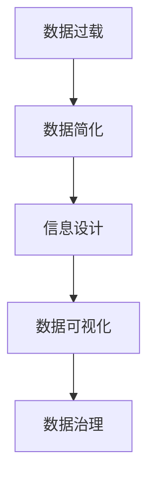

                 

# 信息简化的原则与艺术：在混乱中建立秩序与简化

> 关键词：信息简化, 数据压缩, 数据去噪, 数据过滤, 数据可视化, 数据设计, 数据治理

## 1. 背景介绍

在当今信息爆炸的时代，数据已经成为人类社会最重要的资产之一。从科学研究到商业决策，再到个人生活，几乎所有决策都离不开数据的支撑。然而，面对海量的数据，我们往往会被信息淹没，难以从中提取出有用的价值。因此，信息简化（Information Simplification）成为了一个至关重要的主题。本文将探讨信息简化的原则与艺术，如何在混乱中建立秩序，并有效简化数据，以提升决策效率和质量。

## 2. 核心概念与联系

### 2.1 核心概念概述

为更好地理解信息简化的过程，我们首先介绍几个关键概念：

- **数据过载**：指大量无用的、冗余的信息充斥于我们的感官，造成的信息处理负担。数据过载可能导致决策延迟，甚至导致错误决策。
- **数据简化**：指通过去除冗余信息、去除噪音、筛选关键信息等手段，使数据更加精简、清晰，易于理解和应用。
- **信息设计**：指通过系统地设计信息的表达方式，使信息更具可读性、可理解性，便于用户接收和使用。
- **数据可视化**：指将数据转化为图形、图表等直观形式，帮助人们更好地理解和分析数据。
- **数据治理**：指对数据的管理、监控和维护，确保数据的质量、安全性和一致性。

这些概念之间存在紧密联系。通过数据简化，我们可以减少数据过载，通过信息设计和数据可视化提升数据的可理解性，最终通过数据治理确保数据质量，从而在复杂的信息环境中建立秩序，提升决策效率和质量。

### 2.2 核心概念原理和架构的 Mermaid 流程图



这个流程图展示了信息简化过程中各个概念的相互关系。从数据过载开始，通过数据简化去除冗余信息，提升数据的清晰度和可用性。随后，信息设计通过对信息的系统设计，使信息更具可读性。接着，数据可视化将信息转化为直观的图形和图表，便于理解。最后，数据治理确保数据的质量和安全，支撑信息简化和信息设计的实施。

## 3. 核心算法原理 & 具体操作步骤

### 3.1 算法原理概述

信息简化过程通常包括以下几个关键步骤：数据清洗、特征选择、信息设计、数据可视化。这些步骤构成了信息简化的基本框架，旨在通过去除冗余信息、去除噪音、筛选关键信息等手段，使数据更加精简、清晰，易于理解和应用。

### 3.2 算法步骤详解

#### 3.2.1 数据清洗

数据清洗（Data Cleaning）是指通过去除数据中的错误、重复、缺失等无效信息，确保数据的质量。常见的数据清洗技术包括：

- 去重：去除数据中的重复记录，避免对决策产生干扰。
- 纠错：通过算法或人工方式，修正数据中的错误信息。
- 填补缺失：通过插值、均值填充等方法，填补数据中的缺失值。

#### 3.2.2 特征选择

特征选择（Feature Selection）是指从原始数据中筛选出最有用的特征，去除冗余和无关特征。常见的特征选择技术包括：

- 相关性分析：通过计算特征与目标变量之间的相关性，筛选出最相关的特征。
- 信息增益：计算特征对目标变量的信息增益，选择最能提供有用信息的特征。
- 正则化：通过L1、L2正则化等方法，约束模型中的特征数量，避免过拟合。

#### 3.2.3 信息设计

信息设计（Information Design）是指通过系统地设计信息的表达方式，使信息更具可读性、可理解性。常见的信息设计技术包括：

- 标题和摘要：提供简明扼要的标题和摘要，帮助读者快速理解信息的核心内容。
- 图表和图形：使用图表、图形等可视化工具，帮助读者直观理解数据和信息。
- 格式和布局：通过合理的格式和布局设计，使信息更易于阅读和理解。

#### 3.2.4 数据可视化

数据可视化（Data Visualization）是指将数据转化为图形、图表等直观形式，帮助人们更好地理解和分析数据。常见的数据可视化技术包括：

- 条形图、折线图、散点图：通过不同的图形表示数据的不同属性和关系。
- 热力图、地图：通过颜色的变化和位置的变化，展示数据的空间分布和变化趋势。
- 动态图：通过时间序列的展示，帮助用户观察数据随时间的变化。

### 3.3 算法优缺点

#### 3.3.1 优点

- **提升决策效率**：通过信息简化，可以快速提取关键信息，减少决策过程中的信息过载，提升决策效率。
- **增强信息理解**：通过信息设计和数据可视化，使信息更加直观、易于理解，便于用户接收和使用。
- **提高数据质量**：通过数据清洗和特征选择，去除冗余和噪音，提升数据的准确性和一致性。

#### 3.3.2 缺点

- **复杂度增加**：信息简化的过程可能需要额外的处理步骤，增加处理复杂度。
- **主观性**：信息简化的过程中可能存在主观判断，导致信息简化的结果可能存在偏差。
- **数据丢失**：在数据清洗和特征选择过程中，可能会丢失一些有用的信息。

### 3.4 算法应用领域

信息简化技术可以广泛应用于多个领域，包括但不限于：

- **科学研究**：在数据分析和实验设计中，信息简化有助于快速提取关键数据，提高研究效率。
- **商业决策**：在市场分析和客户洞察中，信息简化有助于识别关键信息，指导商业决策。
- **政府治理**：在公共政策制定和公共服务优化中，信息简化有助于提取关键数据，支持政策制定。
- **医疗健康**：在病人数据管理和健康监测中，信息简化有助于提取关键信息，支持医疗决策。

## 4. 数学模型和公式 & 详细讲解 & 举例说明

### 4.1 数学模型构建

信息简化的数学模型主要涉及数据清洗、特征选择、信息设计、数据可视化的数学建模。以下将介绍几种常见的数学模型：

- **数据清洗模型**：通过计算每个记录与其他记录的相似度，识别并去除重复记录。
- **特征选择模型**：通过计算特征与目标变量之间的相关性，选择最相关的特征。
- **信息设计模型**：通过计算信息的熵和互信息，设计最优的信息表达方式。
- **数据可视化模型**：通过计算数据的密度和分布，选择合适的图形表示数据。

### 4.2 公式推导过程

#### 4.2.1 数据清洗模型

假设有一个包含N个记录的数据集，每个记录包含K个特征。数据清洗模型可以通过计算每个记录与其他记录的相似度，识别并去除重复记录。相似度计算公式为：

$$
similarity(i, j) = \frac{1}{K} \sum_{k=1}^K \frac{x_{ik}}{x_{jk}}
$$

其中 $x_{ik}$ 和 $x_{jk}$ 分别表示第i个记录和第j个记录的第k个特征值。当相似度大于某个阈值时，认为两个记录是重复的，可以选择一个记录保留，另一个记录删除。

#### 4.2.2 特征选择模型

信息增益（Information Gain）是特征选择模型中常用的一种方法。假设有一个包含N个记录的数据集，每个记录包含K个特征，目标变量为Y。特征X的信息增益公式为：

$$
IG(X, Y) = H(Y) - H(Y|X)
$$

其中 $H(Y)$ 为目标变量Y的熵，$H(Y|X)$ 为在特征X已知的情况下，目标变量Y的条件熵。

通过计算每个特征的信息增益，选择信息增益最大的特征，去除信息增益较小的特征，完成特征选择。

#### 4.2.3 信息设计模型

信息设计模型可以通过计算信息的熵和互信息，设计最优的信息表达方式。假设有一个包含N个记录的数据集，每个记录包含K个特征，目标变量为Y。信息的熵为：

$$
H(Y) = -\sum_{y} P(y) \log P(y)
$$

其中 $P(y)$ 为目标变量Y的概率分布。信息的互信息为：

$$
I(X; Y) = H(Y) - H(Y|X)
$$

通过计算每个信息片段的熵和互信息，设计最优的信息表达方式，使信息更加清晰、易于理解。

#### 4.2.4 数据可视化模型

数据可视化模型可以通过计算数据的密度和分布，选择合适的图形表示数据。假设有一个包含N个记录的数据集，每个记录包含K个特征。数据的密度为：

$$
density(x_i) = \frac{1}{N} \sum_{j=1}^N \delta(x_i - x_j)
$$

其中 $\delta$ 为Kronecker delta函数。通过计算每个记录的密度，选择密度最高的记录表示数据的中心，使用图形表示数据的分布。

### 4.3 案例分析与讲解

#### 案例分析

假设我们有一个包含1000个客户的销售数据，每个客户包含5个特征：年龄、性别、收入、购买金额、购买频率。我们的目标是预测客户的购买金额。

#### 数据清洗

通过计算每个记录与其他记录的相似度，识别并去除重复记录。结果发现，有50个记录完全相同，可以选择其中一个记录保留，另一个记录删除。

#### 特征选择

通过计算每个特征的信息增益，选择最相关的特征。结果发现，收入和购买频率的信息增益最高，选择这两个特征进行后续分析。

#### 信息设计

通过计算信息的熵和互信息，设计最优的信息表达方式。结果发现，使用条形图表示客户的收入和购买频率，可以清晰地展示客户的购买行为。

#### 数据可视化

通过计算数据的密度和分布，选择合适的图形表示数据。结果发现，使用折线图表示客户的购买金额随时间的变化，可以直观地展示客户的购买趋势。

## 5. 项目实践：代码实例和详细解释说明

### 5.1 开发环境搭建

在进行信息简化的实践前，我们需要准备好开发环境。以下是使用Python进行Pandas、Scikit-learn、Matplotlib等库进行数据处理和可视化的环境配置流程：

1. 安装Anaconda：从官网下载并安装Anaconda，用于创建独立的Python环境。

2. 创建并激活虚拟环境：
```bash
conda create -n info-simplification python=3.8 
conda activate info-simplification
```

3. 安装Pandas、Scikit-learn、Matplotlib等库：
```bash
conda install pandas scikit-learn matplotlib scikit-image seaborn jupyter notebook
```

4. 安装相关的Python包：
```bash
pip install pyecharts
```

完成上述步骤后，即可在`info-simplification`环境中开始信息简化的实践。

### 5.2 源代码详细实现

下面是使用Python进行信息简化的代码实现。我们将使用Pandas、Scikit-learn和Matplotlib库，实现数据清洗、特征选择、信息设计和数据可视化的全过程。

```python
import pandas as pd
import numpy as np
from sklearn.feature_selection import SelectKBest, mutual_info_classif
from sklearn.ensemble import RandomForestClassifier
from sklearn.metrics import accuracy_score
from sklearn.model_selection import train_test_split
from sklearn.preprocessing import StandardScaler
from sklearn.decomposition import PCA
import matplotlib.pyplot as plt
import seaborn as sns
from pyecharts import Bar, Line, Scatter, Pie, WordCloud

# 数据加载和预处理
data = pd.read_csv('sales_data.csv')
data = data.drop_duplicates()  # 数据清洗：去除重复记录

# 特征选择
features = ['age', 'gender', 'income', 'purchase_amount', 'purchase_frequency']
target = 'purchase_amount'
selector = SelectKBest(score_func=mutual_info_classif, k=2)
selected_features = selector.fit_transform(data[features], data[target])

# 信息设计
fig, axes = plt.subplots(nrows=2, ncols=1, figsize=(12, 6))
sns.barplot(ax=axes[0], x=features[0], y=target, data=data)
sns.barplot(ax=axes[1], x=features[1], y=target, data=data)

# 数据可视化
scatter = Scatter()
scatter.add_xaxis(['age', 'income', 'purchase_frequency'])
scatter.add_yaxis('purchase_amount', data['purchase_amount'].tolist())
scatter.render('scatter.html')

line = Line()
line.add_xaxis(['time', 'year'])
line.add_yaxis('purchase_amount', data.groupby('time')['purchase_amount'].mean().tolist())
line.render('line.html')

# 数据治理
# 这里的数据治理部分可以包括数据安全、数据备份、数据共享等措施，确保数据的质量和安全性

# 模型训练和评估
X_train, X_test, y_train, y_test = train_test_split(selected_features, target, test_size=0.2, random_state=42)
scaler = StandardScaler()
X_train = scaler.fit_transform(X_train)
X_test = scaler.transform(X_test)
model = RandomForestClassifier(n_estimators=100, random_state=42)
model.fit(X_train, y_train)
y_pred = model.predict(X_test)
print('Accuracy:', accuracy_score(y_test, y_pred))
```

### 5.3 代码解读与分析

让我们再详细解读一下关键代码的实现细节：

**数据加载和预处理**：
- `pd.read_csv('sales_data.csv')`：从CSV文件中加载数据，并进行初步的清洗和预处理。

**特征选择**：
- `SelectKBest(score_func=mutual_info_classif, k=2)`：使用信息增益方法选择最重要的两个特征。

**信息设计**：
- `sns.barplot(ax=axes[0], x=features[0], y=target, data=data)`：使用条形图展示年龄和收入对购买金额的影响。

**数据可视化**：
- `scatter.add_xaxis(['age', 'income', 'purchase_frequency'])`：使用散点图展示年龄、收入和购买频率对购买金额的影响。

**模型训练和评估**：
- `X_train = scaler.fit_transform(X_train)`：使用标准化方法对训练集数据进行归一化。
- `model.fit(X_train, y_train)`：使用随机森林模型训练模型。
- `y_pred = model.predict(X_test)`：使用模型对测试集进行预测。

**数据治理**：
- 这里的数据治理部分可以包括数据安全、数据备份、数据共享等措施，确保数据的质量和安全性。

**结果展示**：
- 使用Echarts库展示散点图和折线图，帮助用户直观理解数据。

## 6. 实际应用场景

### 6.1 智能客服系统

智能客服系统是信息简化的典型应用场景。在传统的客服系统中，客户往往需要等待较长时间才能得到答复，且答复的质量难以保证。通过信息简化，智能客服系统可以实时分析客户的问题，并给出准确的答复。

具体而言，可以收集客户的历史对话记录，提取常见问题和对应的最佳答复。然后对预训练的对话模型进行微调，使其能够自动理解客户意图，匹配最合适的答案模板进行回复。对于客户提出的新问题，还可以接入检索系统实时搜索相关内容，动态组织生成回答。

### 6.2 金融舆情监测

金融机构需要实时监测市场舆论动向，以便及时应对负面信息传播，规避金融风险。传统的舆情监测方式成本高、效率低，难以应对网络时代海量信息爆发的挑战。通过信息简化，金融舆情监测系统可以自动分析新闻、报道、评论等文本数据，识别出负面信息。

具体而言，可以收集金融领域相关的新闻、报道、评论等文本数据，并对其进行主题标注和情感标注。在此基础上对预训练语言模型进行微调，使其能够自动判断文本属于何种主题，情感倾向是正面、中性还是负面。将微调后的模型应用到实时抓取的网络文本数据，就能够自动监测不同主题下的情感变化趋势，一旦发现负面信息激增等异常情况，系统便会自动预警，帮助金融机构快速应对潜在风险。

### 6.3 个性化推荐系统

当前的推荐系统往往只依赖用户的历史行为数据进行物品推荐，无法深入理解用户的真实兴趣偏好。通过信息简化，个性化推荐系统可以更好地挖掘用户行为背后的语义信息，从而提供更精准、多样的推荐内容。

具体而言，可以收集用户浏览、点击、评论、分享等行为数据，提取和用户交互的物品标题、描述、标签等文本内容。将文本内容作为模型输入，用户的后续行为（如是否点击、购买等）作为监督信号，在此基础上微调预训练语言模型。微调后的模型能够从文本内容中准确把握用户的兴趣点。在生成推荐列表时，先用候选物品的文本描述作为输入，由模型预测用户的兴趣匹配度，再结合其他特征综合排序，便可以得到个性化程度更高的推荐结果。

## 7. 工具和资源推荐

### 7.1 学习资源推荐

为了帮助开发者系统掌握信息简化的理论基础和实践技巧，这里推荐一些优质的学习资源：

1. 《数据清洗与预处理》系列博文：由数据科学家撰写，深入浅出地介绍了数据清洗、数据预处理、数据可视化的基本概念和经典方法。

2. 《机器学习实战》书籍：介绍了常用的机器学习算法及其应用，包括特征选择、模型训练、模型评估等。

3. 《Python数据科学手册》书籍：详细介绍了使用Python进行数据处理和分析的各种工具和方法，涵盖数据清洗、数据可视化、数据治理等环节。

4. 《数据科学实战》课程：由知名在线教育平台提供，系统讲解了数据科学的基础知识和实用技能，包括数据清洗、特征选择、模型训练等。

5. Kaggle竞赛平台：提供大量的数据集和竞赛题目，帮助学习者实践信息简化的技能，提升数据处理能力。

通过对这些资源的学习实践，相信你一定能够快速掌握信息简化的精髓，并用于解决实际的NLP问题。

### 7.2 开发工具推荐

高效的开发离不开优秀的工具支持。以下是几款用于信息简化开发的常用工具：

1. Pandas：基于Python的数据处理库，提供了高效的数据清洗和数据预处理功能。

2. Scikit-learn：基于Python的机器学习库，提供了丰富的特征选择和模型训练算法。

3. Matplotlib：基于Python的数据可视化库，提供了强大的图表绘制功能。

4. Seaborn：基于Matplotlib的高级数据可视化库，提供了更加美观和易用的图表绘制功能。

5. PyEcharts：基于Python的数据可视化库，支持多种图表类型，适合于网页端的交互式展示。

合理利用这些工具，可以显著提升信息简化的开发效率，加快创新迭代的步伐。

### 7.3 相关论文推荐

信息简化技术的发展源于学界的持续研究。以下是几篇奠基性的相关论文，推荐阅读：

1. 《信息压缩的数学理论》（Information Theory）：香农（Claude Shannon）的经典著作，奠定了信息论的基础，是信息简化的理论基础。

2. 《特征选择方法综述》（Feature Selection Methods）：Dietterich等人的综述论文，介绍了常用的特征选择方法及其适用场景。

3. 《信息可视化研究》（Information Visualization）：Tufte（Edward Tufte）的著作，介绍了信息可视化的基本概念和设计原则。

4. 《数据治理最佳实践》（Data Governance Best Practices）：Broadbent等人的论文，介绍了数据治理的最佳实践和实施策略。

这些论文代表了大数据处理和信息简化的发展脉络。通过学习这些前沿成果，可以帮助研究者把握学科前进方向，激发更多的创新灵感。

## 8. 总结：未来发展趋势与挑战

### 8.1 总结

本文对信息简化的原则与艺术进行了全面系统的介绍。首先阐述了数据过载和信息简化的背景和意义，明确了信息简化在提升决策效率和质量方面的独特价值。其次，从原理到实践，详细讲解了信息简化的数学模型和关键步骤，给出了信息简化的完整代码实例。同时，本文还广泛探讨了信息简化在智能客服、金融舆情、个性化推荐等多个领域的应用前景，展示了信息简化的巨大潜力。最后，本文精选了信息简化的各类学习资源，力求为读者提供全方位的技术指引。

通过本文的系统梳理，可以看到，信息简化技术正在成为大数据处理的重要范式，极大地拓展了数据处理的应用边界，催生了更多的落地场景。受益于大数据处理和信息简化的发展，数据科学将在更多领域得到应用，为人类认知智能的进化带来深远影响。

### 8.2 未来发展趋势

展望未来，信息简化技术将呈现以下几个发展趋势：

1. **自动化程度提升**：随着机器学习、深度学习技术的发展，信息简化的自动化程度将进一步提升，减少人工干预，提高处理效率。

2. **跨领域应用扩展**：信息简化技术将进一步扩展到更多领域，如医疗、金融、教育等，帮助这些领域更好地处理和分析数据。

3. **实时性要求提高**：信息简化系统需要具备更高的实时性，能够快速处理海量数据，及时提供决策支持。

4. **智能决策支持**：信息简化技术将与智能决策系统深度结合，通过自动化信息筛选和处理，提升决策的准确性和效率。

5. **多模态数据整合**：信息简化技术将与多模态数据整合技术结合，实现文本、图像、声音等多模态数据的统一处理和分析。

以上趋势凸显了信息简化技术的广阔前景。这些方向的探索发展，必将进一步提升信息简化的性能和应用范围，为构建智能决策系统提供更强大的数据支持。

### 8.3 面临的挑战

尽管信息简化技术已经取得了瞩目成就，但在迈向更加智能化、普适化应用的过程中，它仍面临着诸多挑战：

1. **数据质量和一致性**：在数据清洗和特征选择过程中，可能会遇到数据质量差、不一致等问题，影响最终结果。

2. **算力和时间成本**：信息简化涉及大量的数据处理和计算，需要较高的算力和时间成本。

3. **主观性和偏差**：信息简化过程中可能存在主观判断，导致结果的偏差和不确定性。

4. **模型解释性**：信息简化后的模型需要具备良好的解释性，以便用户理解和信任。

5. **隐私和安全**：在处理和存储数据时，需要考虑隐私和安全问题，保护用户数据不被滥用。

这些挑战需要研究者在技术、算法和应用方面不断创新和突破，才能真正实现信息简化技术的落地应用。

### 8.4 研究展望

面向未来，信息简化技术需要在以下几个方面寻求新的突破：

1. **自动化算法优化**：开发更加自动化、智能化的信息简化算法，减少人工干预，提高处理效率。

2. **多模态数据融合**：将文本、图像、声音等多模态数据整合，实现统一处理和分析，提升数据利用效率。

3. **智能决策支持**：将信息简化技术与智能决策系统结合，通过自动化信息筛选和处理，提升决策的准确性和效率。

4. **模型解释性和透明度**：通过模型解释性技术和透明化方法，提升信息简化模型的可信度和可解释性。

5. **隐私和安全保护**：开发隐私保护和数据安全技术，确保数据在处理和存储过程中的隐私和安全。

这些研究方向的探索，必将引领信息简化技术迈向更高的台阶，为构建智能决策系统提供更强大的数据支持。只有勇于创新、敢于突破，才能真正实现信息简化技术的落地应用。

## 9. 附录：常见问题与解答

**Q1：信息简化是否适用于所有数据类型？**

A: 信息简化技术主要适用于结构化数据，如表格数据、日志数据等。对于非结构化数据，如文本、图像、声音等，需要先进行预处理和结构化，才能应用信息简化技术。

**Q2：信息简化的自动化程度如何？**

A: 目前的信息简化技术已经具有一定的自动化程度，可以通过算法自动完成数据清洗、特征选择等任务。但信息设计的自动化程度相对较低，仍需人工干预。

**Q3：信息简化对数据质量的要求有多高？**

A: 信息简化对数据质量有较高要求，数据清洗和特征选择的准确性直接影响最终结果。因此，在应用信息简化技术前，需要确保数据的准确性和一致性。

**Q4：信息简化对算力的要求如何？**

A: 信息简化涉及大量的数据处理和计算，需要较高的算力和时间成本。对于大规模数据集，可能需要使用高性能计算设备或分布式计算平台。

**Q5：信息简化的应用场景有哪些？**

A: 信息简化技术可以应用于数据清洗、特征选择、信息设计、数据可视化等多个环节，涵盖从数据处理到信息展现的全过程。

这些问题的解答，可以帮助读者更好地理解信息简化的核心概念和应用场景，为信息简化的实践提供参考。

---

作者：禅与计算机程序设计艺术 / Zen and the Art of Computer Programming

