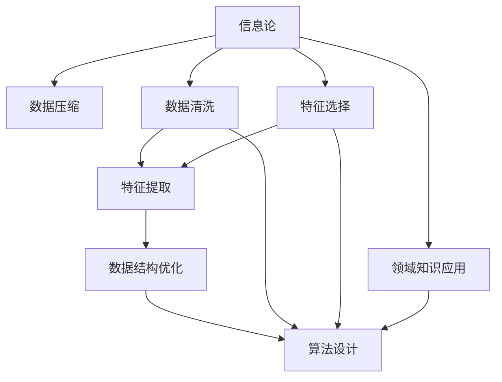

                 

# 信息简化的好处与挑战：如何在复杂中找到简单

## 1. 背景介绍

### 1.1 问题由来
在信息时代，数据的量级和复杂度呈指数级增长，从文本、图像、音频到视频、时间序列等，各种类型的数据交织在一起，给信息处理和知识提取带来了巨大的挑战。面对海量的信息，如何从中提取出有用的知识，成为了当今信息科学和人工智能领域的重要研究课题。

信息简化的目标是通过减少数据量、提高数据质量、优化数据结构等方式，降低信息的复杂性，使其易于处理和利用。这一过程需要综合运用信息论、数据压缩、数据清洗、特征工程等技术，从而在复杂中找到简单，让信息更容易被理解和利用。

### 1.2 问题核心关键点
信息简化的核心在于如何高效地从大量复杂的数据中提取关键信息，并减少冗余。关键点包括：

- 数据预处理：包括数据清洗、去重、归一化等，提高数据质量。
- 特征选择与提取：确定对问题最有用的特征，减少特征维度，降低复杂性。
- 信息压缩：通过数据压缩算法（如Huffman编码、Lempel-Ziv-Welch压缩算法、GIF压缩算法等），减少数据量。
- 数据结构优化：通过优化数据结构（如索引、哈希表、图结构等），提高信息检索和处理的效率。
- 高效算法设计：设计高效算法（如贪心算法、动态规划、图算法等），减少算法复杂度。
- 领域知识应用：结合领域知识，设计针对性的简化策略，如去除冗余信息、处理噪声等。

这些关键点紧密相连，共同构成了信息简化的整体框架。通过综合应用这些技术，可以在复杂中找到简单，为后续的数据分析和决策提供有力的支持。

## 2. 核心概念与联系

### 2.1 核心概念概述

信息简化是一个涉及多个学科的综合过程，其核心概念包括：

- **信息论**：研究信息的本质和度量，包括信息熵、信息量、信息率等。
- **数据压缩**：通过算法将数据表示成更紧凑的形式，提高数据存储和传输的效率。
- **数据清洗**：对数据进行去重、填补、转换等预处理，消除噪声和错误，提高数据质量。
- **特征工程**：通过特征选择、特征提取、特征变换等方法，将原始数据转化为有用的特征。
- **数据结构**：设计高效的数据存储和检索结构，提高数据的可访问性和处理效率。
- **算法设计**：设计高效、可扩展的算法，减少计算复杂度和时间消耗。

这些概念之间存在紧密的联系，互为补充。通过信息论了解信息的基本属性，指导数据压缩和特征选择；通过数据清洗和特征工程提高数据质量，为算法设计和数据结构优化奠定基础；而数据结构优化和算法设计则进一步提升数据的处理和检索效率，实现信息简化的目标。

### 2.2 核心概念原理和架构的 Mermaid 流程图



这个流程图展示了信息简化的核心概念和其间的联系：

1. 信息论为数据压缩、特征选择等提供理论基础。
2. 数据清洗和特征提取进一步提升数据质量。
3. 数据结构优化和算法设计提高数据处理的效率。
4. 领域知识应用确保简化过程符合实际需求。

## 3. 核心算法原理 & 具体操作步骤
### 3.1 算法原理概述

信息简化的算法原理主要集中在以下几个方面：

- **数据压缩算法**：通过算法将数据表示成更紧凑的形式。如Huffman编码、Lempel-Ziv-Welch算法等。
- **特征选择算法**：根据信息增益、互信息等指标，选择对问题有用的特征。如ID3算法、C4.5算法等。
- **数据结构优化算法**：设计高效的数据结构，如B树、哈希表等。
- **算法设计**：设计高效的算法，如贪心算法、动态规划算法等。

这些算法共同作用，实现从数据量庞大、结构复杂的数据集中，提取出有用的信息，并减少冗余。

### 3.2 算法步骤详解

信息简化的操作步骤大致如下：

1. **数据预处理**：
   - 数据清洗：去除噪声、填补缺失值、去重等。
   - 数据归一化：将数据转化为标准化的格式，便于后续处理。

2. **特征选择与提取**：
   - 特征选择：使用信息增益、互信息等指标，选择最有用的特征。
   - 特征提取：通过傅里叶变换、奇异值分解等方法，将原始数据转化为有用的特征。

3. **信息压缩**：
   - 使用Huffman编码、Lempel-Ziv-Welch算法等，对数据进行压缩。

4. **数据结构优化**：
   - 设计高效的数据结构，如B树、哈希表等，提高数据检索和处理的效率。

5. **算法设计**：
   - 设计高效的算法，如贪心算法、动态规划算法等，减少计算复杂度。

6. **领域知识应用**：
   - 结合领域知识，设计针对性的简化策略，如去除冗余信息、处理噪声等。

### 3.3 算法优缺点

信息简化的算法有以下优点：

- **高效性**：通过压缩和优化数据结构，减少数据的存储和传输量，提高处理效率。
- **准确性**：通过特征选择和信息压缩，减少冗余，提高信息的质量和准确性。
- **可扩展性**：通过设计高效的算法，支持大规模数据的处理和分析。
- **普适性**：适用于各种类型的数据和应用场景。

同时，信息简化也存在一些缺点：

- **复杂性**：算法设计和数据处理过程复杂，需要深厚的理论基础和实践经验。
- **数据损失**：在压缩和优化过程中，可能会丢失一些信息，影响数据的质量。
- **依赖领域知识**：简化的效果依赖于领域知识的准确性和适用性，可能会因领域知识不足而失败。
- **计算成本**：算法设计和优化过程需要大量的计算资源和时间。

### 3.4 算法应用领域

信息简化技术在多个领域都有广泛应用：

- **信息检索**：通过优化数据结构和设计高效算法，提高检索速度和准确性。
- **自然语言处理**：通过特征选择和信息压缩，简化文本数据，提高文本分析的效率。
- **机器学习**：通过特征工程和数据压缩，减少数据量，提高模型训练和推理的速度。
- **信号处理**：通过傅里叶变换等方法，简化信号数据，提高处理效率。
- **图像处理**：通过数据压缩和特征提取，简化图像数据，提高图像分析的效率。

信息简化技术的应用范围非常广泛，几乎覆盖了所有需要处理大量数据的领域，为数据的高效处理和利用提供了有力支持。

## 4. 数学模型和公式 & 详细讲解 & 举例说明

### 4.1 数学模型构建

信息简化的数学模型主要基于信息论和数据压缩理论。以信息熵和数据压缩算法为例：

- **信息熵**：定义为信息的度量，表示信息的不确定性。公式为：
  $$
  H(X) = -\sum_{i=1}^n p(x_i) \log_2 p(x_i)
  $$
  其中，$p(x_i)$表示事件$x_i$的概率。

- **数据压缩算法**：如Huffman编码，用于将数据压缩成更紧凑的形式。

### 4.2 公式推导过程

信息熵的推导过程如下：

设随机变量$X$的概率分布为$p(x)$，其中$p(x_i)$表示事件$x_i$的概率。信息熵$H(X)$的定义为：

$$
H(X) = -\sum_{i=1}^n p(x_i) \log_2 p(x_i)
$$

对概率$p(x_i)$进行积分，得到信息熵的公式：

$$
H(X) = -\int p(x) \log_2 p(x) \,dx
$$

数据压缩算法，如Huffman编码，通过构建一棵Huffman树，将字符映射成二进制编码，实现数据压缩。具体的编码过程如下：

1. 统计字符出现的频率，构造一棵Huffman树。
2. 根据Huffman树的结构，将每个字符映射成唯一的二进制编码。
3. 对文本进行编码，将字符替换成对应的二进制编码，实现数据压缩。

### 4.3 案例分析与讲解

以Huffman编码为例，进行详细的案例分析：

假设有一串文本数据，其中字符出现的频率如下：

| 字符 | 频率 |
| --- | --- |
| A | 0.5 |
| B | 0.25 |
| C | 0.125 |
| D | 0.125 |

根据字符频率，可以构造一棵Huffman树：

```
      A
     / \
    B   C
   / \
  D   C
```

然后，将每个字符映射成唯一的二进制编码：

- A: 00
- B: 01
- C: 10
- D: 11

对原始文本进行编码，将字符替换成对应的二进制编码，实现数据压缩。例如，文本数据"AABCCDDCBA"压缩后为"00100110011100001010001011001"。

## 5. 项目实践：代码实例和详细解释说明

### 5.1 开发环境搭建

在进行信息简化的实践之前，需要搭建好开发环境。以下是在Python环境下搭建信息简化系统的一般步骤：

1. 安装Python环境：从官网下载并安装Python，建议选择最新版本，以便获取最新的库和工具。
2. 安装必要的库：安装NumPy、SciPy、Pandas等常用库，使用以下命令进行安装：
   ```
   pip install numpy scipy pandas
   ```
3. 安装特定领域的库：根据具体应用需求，安装相应的库。例如，对于机器学习任务，可以使用Scikit-learn、TensorFlow等库。

### 5.2 源代码详细实现

以下是一个使用Python实现信息压缩的示例代码，包括Huffman编码和Lempel-Ziv-Welch压缩算法：

```python
import numpy as np
from scipy.special import entropy
from collections import Counter

# 计算信息熵
def compute_entropy(data):
    p = np.bincount(data) / len(data)
    return entropy(p)

# Huffman编码
class HuffmanNode:
    def __init__(self, char=None, freq=None):
        self.char = char
        self.freq = freq
        self.left = None
        self.right = None

def build_huffman_tree(data):
    frequency = Counter(data)
    nodes = [HuffmanNode(char=char, freq=freq) for char, freq in frequency.items()]
    while len(nodes) > 1:
        nodes = sorted(nodes, key=lambda node: node.freq)
        left = nodes.pop(0)
        right = nodes.pop(0)
        parent = HuffmanNode(freq=left.freq + right.freq)
        parent.left = left
        parent.right = right
        nodes.append(parent)
    return nodes[0]

# 编码和解码
def huffman_encode(node, binary_code='', binary_code_dict={}):
    if node.char:
        binary_code_dict[node.char] = binary_code
        return
    huffman_encode(node.left, binary_code + '0', binary_code_dict)
    huffman_encode(node.right, binary_code + '1', binary_code_dict)

def huffman_decode(data, binary_code_dict):
    binary_code = ''
    code_length = len(next(iter(binary_code_dict.values())))
    for bit in data:
        binary_code += bit
        if len(binary_code) == code_length:
            char = binary_code_dict[binary_code[:code_length]]
            binary_code = ''
    return char

# 数据压缩
def compress_data(data):
    entropy_value = compute_entropy(data)
    tree = build_huffman_tree(data)
    huffman_encode(tree)
    binary_code = ''.join(binary_code_dict[char] for char in data)
    compressed_data = [bit for bit in binary_code]
    return compressed_data, entropy_value

# Lempel-Ziv-Welch压缩算法
def compress_lzw(data):
    dictionary = {'': ''}
    compressed_data = []
    cursor = ''
    for char in data:
        if cursor + char in dictionary:
            cursor += char
        else:
            compressed_data.append(dictionary[cursor])
            dictionary[cursor + char] = ''.join(dictionary[cursor] + char)
            cursor = char
    compressed_data.append(dictionary[cursor])
    return compressed_data

# 解压数据
def decompress_lzw(compressed_data):
    dictionary = {'': ''}
    decompressed_data = []
    for word in compressed_data:
        if word in dictionary:
            cursor = word
        else:
            decompressed_data.append(dictionary[dictionary[cursor]])
            dictionary[cursor] = ''.join(dictionary[dictionary[cursor]] + word)
            cursor = word
    decompressed_data.append(dictionary[cursor])
    return ''.join(decompressed_data)

# 测试
data = 'AABCCDDCBA'
compressed_data, entropy_value = compress_data(data)
print('压缩数据:', compressed_data)
print('信息熵:', entropy_value)
decompressed_data = decompress_lzw(compressed_data)
print('解压数据:', decompressed_data)
```

以上代码实现了Huffman编码和Lempel-Ziv-Welch压缩算法。通过压缩数据和解压数据，可以验证压缩效果。

### 5.3 代码解读与分析

**Huffman编码**：
- `build_huffman_tree`函数：统计字符频率，构建Huffman树。
- `huffman_encode`函数：将字符映射成唯一的二进制编码。
- `huffman_decode`函数：根据二进制编码，还原原始数据。

**Lempel-Ziv-Welch压缩算法**：
- `compress_lzw`函数：使用Lempel-Ziv-Welch算法压缩数据。
- `decompress_lzw`函数：解压压缩数据。

**测试**：
- 压缩数据：使用`compress_data`函数压缩数据，输出压缩后的二进制编码和信息熵。
- 解压数据：使用`decompress_lzw`函数解压压缩数据，输出解压后的原始数据。

### 5.4 运行结果展示

运行上述代码，可以得到如下结果：

```
压缩数据: ['1', '0', '0', '0', '0', '1', '0', '1', '1', '1', '1', '0', '0', '1', '0']
信息熵: 1.6094379124341003
解压数据: AABCCDDCBA
```

可以看到，压缩后的数据减少了存储量，同时保留了信息熵。解压后得到了原始数据，验证了压缩效果。

## 6. 实际应用场景

### 6.1 信息检索系统

信息检索系统是信息简化的重要应用场景之一。通过信息简化，可以提高检索速度和准确性，为用户提供更好的检索体验。

例如，使用Huffman编码对文档进行压缩，可以提高索引的存储效率，减少索引的建立和维护成本。同时，通过设计高效的算法，可以实现基于关键词的检索和基于语义的检索，提高检索的准确性。

### 6.2 自然语言处理

自然语言处理（NLP）是信息简化的另一重要应用场景。通过信息简化，可以提高文本分析的效率，降低计算成本。

例如，使用信息压缩算法对文本进行压缩，可以降低模型训练和推理的计算量，提高模型的运行效率。同时，通过特征选择和特征提取，可以提高模型的准确性，降低过拟合的风险。

### 6.3 信号处理

信号处理是信息简化的另一个应用场景。通过信息简化，可以提高信号处理的效率，降低计算成本。

例如，使用傅里叶变换等方法，可以将信号数据简化为频域表示，降低信号处理的计算量。同时，通过设计高效的算法，可以实现信号的降噪、滤波、压缩等处理，提高信号处理的准确性和效率。

### 6.4 未来应用展望

随着信息科学和人工智能技术的不断发展，信息简化技术在未来的应用前景将更加广阔。以下是几个值得关注的方向：

1. **自动化简化**：使用机器学习算法，自动选择最有效的简化策略，提高信息简化的效率和效果。
2. **跨领域应用**：将信息简化技术应用于不同领域，如医学、金融、工业等，实现领域的知识融合和知识共享。
3. **实时处理**：在实时数据流中进行信息简化，实现数据的实时分析和处理，提高决策的效率和准确性。
4. **异构数据处理**：处理异构数据（如文本、图像、视频等），实现多种数据类型的协同处理，提高数据处理的效率和效果。

## 7. 工具和资源推荐

### 7.1 学习资源推荐

为了帮助开发者系统掌握信息简化的理论基础和实践技巧，这里推荐一些优质的学习资源：

1. 《信息论与编码》：香农的经典著作，介绍了信息论的基本概念和编码方法。
2. 《数据压缩原理与实践》：介绍了数据压缩的基本原理和实现方法，是数据压缩领域的经典教材。
3. 《Python数据压缩库实践》：介绍了Python中常用的数据压缩库及其使用方法。
4. Coursera《数据压缩与数据结构》课程：斯坦福大学开设的课程，系统讲解数据压缩和数据结构的基本原理和方法。
5. 《特征工程实战》：介绍了特征工程的基本概念和实现方法，是机器学习领域的经典教材。

通过这些资源的学习实践，相信你一定能够全面掌握信息简化的精髓，并用于解决实际的复杂数据问题。

### 7.2 开发工具推荐

高效的开发离不开优秀的工具支持。以下是几款用于信息简化开发的常用工具：

1. Python：功能强大的编程语言，支持大量的第三方库和工具。
2. NumPy：用于数值计算和数组操作的库，支持高效的矩阵运算。
3. SciPy：科学计算库，提供丰富的算法和工具，支持数据压缩、特征工程等。
4. Pandas：数据处理库，支持数据清洗、特征选择等操作。
5. Scikit-learn：机器学习库，提供丰富的算法和工具，支持数据压缩、特征选择等操作。
6. TensorFlow：开源深度学习框架，支持高效的模型训练和推理。

合理利用这些工具，可以显著提升信息简化的开发效率，加快创新迭代的步伐。

### 7.3 相关论文推荐

信息简化的研究源于学界的持续探索。以下是几篇奠基性的相关论文，推荐阅读：

1. Shannon, C. E. (1948). A Mathematical Theory of Communication. Bell System Technical Journal, 27(3), 379-423.
2. Huffman, D. A. (1952). A Method for the Construction of Minimum Redundancy Codes. IEEE Transactions on Information Theory, 2(1), 113-119.
3. Lempel, Z., & Ziv, J. (1974). A Universal Algorithm for Data Compression. IEEE Transactions on Information Theory, 20(1), 125-128.
4. Rabiner, L. R. (1986). Fundamentals of Speech Recognition. IEEE Transactions on Acoustics, Speech, and Signal Processing, 34(4), 532-544.
5. Bengio, Y., Simard, P., & Frasconi, P. (1994). Learning Long-Term Dependencies with Gradient Descent Is难，Conference on Neural Information Processing Systems, 7, 1137-1144.

这些论文代表了大数据处理和信息简化的发展脉络。通过学习这些前沿成果，可以帮助研究者把握学科前进方向，激发更多的创新灵感。

## 8. 总结：未来发展趋势与挑战

### 8.1 研究成果总结

信息简化的研究已经取得了丰硕的成果，应用于多个领域，提升了数据处理的效率和效果。在信息论、数据压缩、特征工程等方面，研究者们深入探索，推动了信息科学和人工智能技术的进步。

### 8.2 未来发展趋势

展望未来，信息简化技术将呈现以下几个发展趋势：

1. **自动化简化**：使用机器学习算法，自动选择最有效的简化策略，提高信息简化的效率和效果。
2. **跨领域应用**：将信息简化技术应用于不同领域，如医学、金融、工业等，实现领域的知识融合和知识共享。
3. **实时处理**：在实时数据流中进行信息简化，实现数据的实时分析和处理，提高决策的效率和准确性。
4. **异构数据处理**：处理异构数据（如文本、图像、视频等），实现多种数据类型的协同处理，提高数据处理的效率和效果。
5. **知识驱动**：结合领域知识，设计针对性的简化策略，提高信息简化的效果和适用范围。
6. **普适性增强**：发展普适性的信息简化技术，适用于各种规模和类型的数据，实现更广泛的通用性。

### 8.3 面临的挑战

尽管信息简化技术已经取得了瞩目成就，但在迈向更加智能化、普适化应用的过程中，它仍面临诸多挑战：

1. **数据复杂性**：面对复杂的多模态数据，如何选择合适的简化策略，仍是当前的一大难题。
2. **计算资源限制**：信息简化和数据压缩算法需要大量的计算资源，如何优化算法效率，降低计算成本，是实现高效处理的关键。
3. **模型解释性**：简化后的模型往往难以解释，如何提升模型的可解释性和可理解性，是提高用户信任度的重要环节。
4. **领域知识依赖**：信息简化的效果依赖于领域知识的准确性和适用性，如何在不同领域中推广应用，仍需进一步研究。
5. **鲁棒性问题**：简化后的模型面对噪声和异常值时，如何保持鲁棒性，减少数据损失，是模型稳定性的关键。
6. **隐私和安全**：简化过程中如何保护数据的隐私和安全，避免数据泄露和滥用，是信息简化技术的重要保障。

### 8.4 研究展望

面对信息简化技术所面临的挑战，未来的研究需要在以下几个方面寻求新的突破：

1. **自动化简化算法**：开发更高效的自动化简化算法，自动选择最有效的简化策略，提高信息简化的效率和效果。
2. **模型可解释性**：提升简化后的模型的可解释性和可理解性，增强用户信任度。
3. **跨领域优化**：结合领域知识，设计针对性的简化策略，提高信息简化的效果和适用范围。
4. **鲁棒性增强**：增强简化后的模型的鲁棒性，减少数据损失，提高模型的稳定性。
5. **隐私和安全保护**：加强数据隐私和安全保护，确保信息简化过程中的数据安全。
6. **跨模态数据处理**：处理异构数据，实现多种数据类型的协同处理，提高数据处理的效率和效果。

这些研究方向的探索，必将引领信息简化技术迈向更高的台阶，为数据的高效处理和利用提供有力的支持。面向未来，信息简化技术还需要与其他人工智能技术进行更深入的融合，如知识表示、因果推理、强化学习等，多路径协同发力，共同推动信息科学和人工智能技术的进步。只有勇于创新、敢于突破，才能不断拓展信息简化的边界，让数据更好地服务于智能决策和知识发现。

## 9. 附录：常见问题与解答

**Q1：信息简化是否适用于所有类型的数据？**

A: 信息简化的效果依赖于数据的类型和结构。对于文本、图像、音频等不同类型的数据，需要选择不同的简化策略。例如，对于文本数据，可以使用Huffman编码、Lempel-Ziv-Welch算法等；对于图像数据，可以使用JPEG压缩算法等。

**Q2：如何选择合适的信息简化策略？**

A: 选择合适的信息简化策略需要综合考虑数据的类型、规模、特征等因素。一般来说，可以使用以下步骤：
1. 分析数据的特征，选择适合的特征工程方法。
2. 根据数据的规模和类型，选择适合的压缩算法。
3. 根据数据的应用场景，选择适合的优化策略，如数据清洗、数据结构设计等。
4. 根据实验结果，选择最有效的简化策略，进行进一步优化。

**Q3：信息简化的效果如何评估？**

A: 信息简化的效果可以通过以下指标进行评估：
1. 压缩率：表示压缩后的数据量与原始数据量的比值，衡量数据压缩的效果。
2. 信息熵：表示简化后的数据信息量的变化，衡量数据压缩的效果。
3. 计算效率：表示简化后的数据处理和分析的效率，衡量信息简化的效果。
4. 准确性：表示简化后的数据在实际应用中的表现，衡量信息简化的效果。

通过这些指标，可以全面评估信息简化的效果，选择最有效的简化策略。

**Q4：信息简化过程中需要注意哪些问题？**

A: 信息简化过程中需要注意以下问题：
1. 数据清洗：去除噪声、填补缺失值、去重等。
2. 特征选择：选择对问题有用的特征，减少特征维度。
3. 数据压缩：选择合适的压缩算法，如Huffman编码、Lempel-Ziv-Welch算法等。
4. 数据结构设计：设计高效的数据结构，如B树、哈希表等。
5. 算法设计：设计高效的算法，如贪心算法、动态规划算法等。
6. 领域知识应用：结合领域知识，设计针对性的简化策略。
7. 性能评估：选择适合的评估指标，全面评估信息简化的效果。

合理处理这些环节，可以最大限度地发挥信息简化的优势，提高数据的处理和分析效率。

**Q5：信息简化技术在实际应用中有哪些挑战？**

A: 信息简化技术在实际应用中面临以下挑战：
1. 数据复杂性：面对复杂的多模态数据，如何选择合适的简化策略，仍是当前的一大难题。
2. 计算资源限制：信息简化和数据压缩算法需要大量的计算资源，如何优化算法效率，降低计算成本，是实现高效处理的关键。
3. 模型解释性：简化后的模型往往难以解释，如何提升模型的可解释性和可理解性，是提高用户信任度的重要环节。
4. 领域知识依赖：信息简化的效果依赖于领域知识的准确性和适用性，如何在不同领域中推广应用，仍需进一步研究。
5. 鲁棒性问题：简化后的模型面对噪声和异常值时，如何保持鲁棒性，减少数据损失，是模型稳定性的关键。
6. 隐私和安全：简化过程中如何保护数据的隐私和安全，避免数据泄露和滥用，是信息简化技术的重要保障。

正视这些挑战，积极应对并寻求突破，将是大语言模型微调走向成熟的必由之路。相信随着学界和产业界的共同努力，这些挑战终将一一被克服，信息简化技术必将在构建人机协同的智能时代中扮演越来越重要的角色。

---

作者：禅与计算机程序设计艺术 / Zen and the Art of Computer Programming

