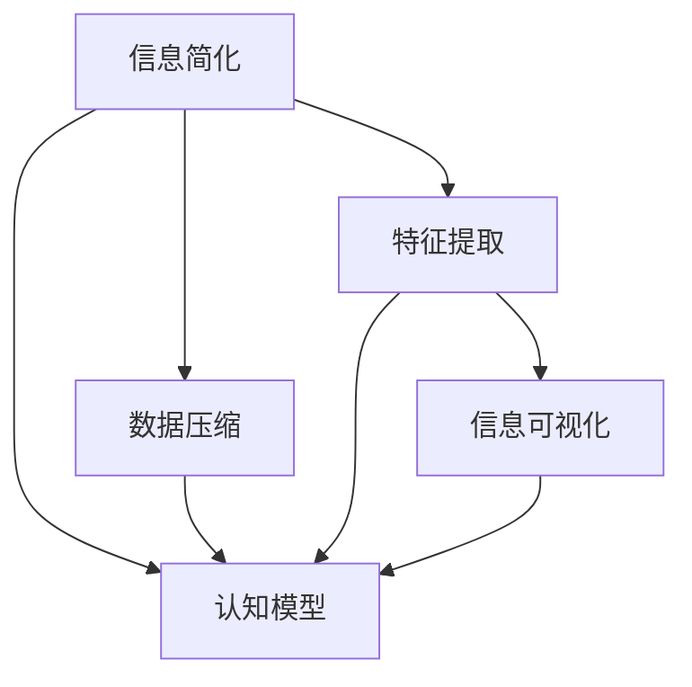

                 

# 信息简化的好处与挑战：简化复杂性的艺术与实践

## 1. 背景介绍

在信息爆炸的今天，我们每天面对着海量的数据和复杂的系统。无论是在学术研究、商业决策，还是在日常生活，如何从复杂的信息中提取出关键要素，并将其转化为易于理解和应用的简明形式，成为了一个至关重要的问题。信息简化，作为一种重要的信息处理技术，已经渗透到各个领域。然而，信息简化并非易事。它需要深度理解数据的内在结构，巧妙地提炼出关键信息，同时避免信息的丢失和误解。本文将深入探讨信息简化的核心概念、技术原理、应用实践以及面临的挑战，力求提供一个全面而深入的理解视角。

## 2. 核心概念与联系

### 2.1 核心概念概述

为更好地理解信息简化的艺术，我们将介绍几个关键概念及其之间的联系。

- **信息简化**：指将复杂的信息转化为简洁、易理解的形式，以便于决策、学习和应用。信息简化的目的是减少认知负担，提高信息处理的效率和准确性。
- **数据压缩**：指将数据通过某种方式减少存储空间，同时尽可能保持数据的完整性和可用性。常见的数据压缩方法包括无损压缩和有损压缩。
- **特征提取**：指从原始数据中提取出最能代表数据本质的特征，用于构建更高效、更精准的模型。特征提取是大数据处理和机器学习的基础步骤。
- **信息可视化**：指通过图表、地图等视觉化手段，将复杂的信息以直观的方式呈现出来，便于人们理解和学习。信息可视化是简化复杂信息的重要工具。
- **认知模型**：指通过心理学、认知科学等理论，构建人类认知信息处理的基本模型。认知模型帮助理解信息简化的心理机制，指导简化策略的设计。

这些核心概念相互关联，共同构成了信息简化的理论基础和实践框架。通过理解这些概念，我们可以更好地把握信息简化的精髓，并应用于实际场景中。

### 2.2 核心概念原理和架构的 Mermaid 流程图



此图展示了信息简化与其他核心概念之间的联系。信息简化依赖于数据压缩、特征提取、信息可视化和认知模型，并通过这些手段将复杂的信息转化为简洁易理解的形式。

## 3. 核心算法原理 & 具体操作步骤

### 3.1 算法原理概述

信息简化的核心算法原理主要包括数据压缩、特征提取和信息可视化。

- **数据压缩**：旨在减少数据存储空间，同时保持数据的完整性和可用性。常见的数据压缩算法有哈夫曼编码、LZ77、LZ78、LZW、LZR、LZRW、LZSS、LZRLLWZ等。这些算法通过不同的编码方式，将数据转化为更短的代码，从而减少存储空间。
- **特征提取**：从原始数据中提取出最具代表性的特征，用于构建更高效、更精准的模型。特征提取方法包括主成分分析(PCA)、线性判别分析(LDA)、独立成分分析(ICA)、小波变换等。
- **信息可视化**：通过图表、地图等视觉化手段，将复杂的信息以直观的方式呈现出来，便于人们理解和学习。信息可视化方法包括散点图、柱状图、折线图、饼图、热力图、树图等。

### 3.2 算法步骤详解

#### 3.2.1 数据压缩

1. **选择压缩算法**：根据数据的类型和特性选择合适的压缩算法。
2. **编码数据**：对数据进行编码，生成压缩后的数据。
3. **解码数据**：对压缩后的数据进行解码，还原原始数据。

#### 3.2.2 特征提取

1. **数据预处理**：对原始数据进行清洗、归一化等预处理操作。
2. **选择特征提取方法**：根据数据的特性和需求选择合适的特征提取方法。
3. **提取特征**：使用选定的特征提取方法，从原始数据中提取出特征。
4. **特征选择**：对提取出的特征进行选择，选择最具代表性的特征。
5. **特征降维**：对特征进行降维操作，以减少特征维度，提高模型效率。

#### 3.2.3 信息可视化

1. **选择可视化方法**：根据数据特性和需求选择合适的可视化方法。
2. **数据准备**：对数据进行清洗、归一化等预处理操作。
3. **数据可视化**：使用选定的可视化方法，将数据转化为图表、地图等形式。

### 3.3 算法优缺点

**数据压缩的优点**：
- 减少存储空间：通过压缩算法，可以将数据体积显著减小，节省存储空间。
- 提高传输效率：压缩后的数据传输速度更快，效率更高。

**数据压缩的缺点**：
- 压缩比限制：部分压缩算法存在压缩比限制，无法将数据体积无限压缩。
- 压缩和解压时间：压缩和解压过程需要时间，可能会影响实时处理效率。

**特征提取的优点**：
- 提高模型效率：通过特征提取，可以减少数据维度，提高模型的计算效率。
- 提高模型精度：通过特征提取，可以选择最具代表性的特征，提高模型的预测精度。

**特征提取的缺点**：
- 特征选择困难：选择特征时需要深度理解数据，往往需要专业知识。
- 特征损失：特征提取过程中可能会损失部分信息，影响模型效果。

**信息可视化的优点**：
- 直观展示：信息可视化可以将复杂的数据直观展示出来，便于理解。
- 便于分析：通过可视化手段，可以快速发现数据中的异常点和规律。

**信息可视化的缺点**：
- 数据过度简化：可视化过程中可能会过度简化数据，导致信息丢失。
- 技术复杂度：可视化需要一定的技术和工具支持，可能增加开发成本。

### 3.4 算法应用领域

信息简化技术在多个领域得到了广泛应用，以下是几个典型应用场景：

- **医疗健康**：通过特征提取和数据压缩，从患者病历中提取出关键信息，用于疾病诊断和预测。
- **金融交易**：通过特征提取和数据压缩，从市场数据中提取出关键特征，用于风险管理和投资决策。
- **自然灾害预测**：通过信息可视化，将复杂的数据转化为图表，用于自然灾害预测和预警。
- **城市规划**：通过数据压缩和特征提取，从城市数据中提取出关键信息，用于城市规划和智能交通。
- **教育培训**：通过信息可视化，将复杂的学习材料转化为图表，便于学生理解和掌握。

这些应用场景展示了信息简化技术的多样性和广泛性，通过优化信息简化的策略和方法，可以在多个领域实现数据的高效管理和应用。

## 4. 数学模型和公式 & 详细讲解 & 举例说明

### 4.1 数学模型构建

在信息简化的过程中，数学模型扮演着重要的角色。以下是几个常用的数学模型及其构建方法：

- **线性回归模型**：用于预测连续变量，公式为 $y = \beta_0 + \beta_1x_1 + \beta_2x_2 + \cdots + \beta_nx_n$，其中 $\beta_i$ 为回归系数。
- **主成分分析(PCA)**：用于数据降维，公式为 $X = V\Sigma U^T$，其中 $X$ 为原始数据，$\Sigma$ 为协方差矩阵，$U$ 和 $V$ 分别为左、右奇异矩阵。
- **独立成分分析(ICA)**：用于数据独立化，公式为 $X = AY$，其中 $X$ 为原始数据，$Y$ 为独立变量，$A$ 为混合矩阵。
- **小波变换**：用于信号处理，公式为 $Y = \phi * X$，其中 $X$ 为信号，$\phi$ 为小波基函数。

### 4.2 公式推导过程

#### 4.2.1 线性回归模型

线性回归模型假设输入变量与输出变量之间存在线性关系。其最小二乘法的推导过程如下：

$$
\min_{\beta} \sum_{i=1}^N (y_i - \hat{y}_i)^2
$$

其中，$y_i$ 为实际值，$\hat{y}_i$ 为预测值，$\beta$ 为回归系数。通过对上述函数求导并解方程，得到回归系数 $\beta$ 的表达式：

$$
\beta = (X^TX)^{-1}X^Ty
$$

#### 4.2.2 主成分分析(PCA)

主成分分析(PCA)通过降维技术，将高维数据映射到低维空间。其基本思想是寻找数据中的主成分，使得数据在主成分上的方差最大。具体推导过程如下：

1. 计算协方差矩阵 $\Sigma$。
2. 求特征值 $\lambda$ 和特征向量 $v$。
3. 将特征向量按特征值大小排序，选择前 $k$ 个特征向量构成矩阵 $V$。
4. 计算主成分 $X = V\Sigma U^T$。

### 4.3 案例分析与讲解

**案例1：线性回归模型在房价预测中的应用**

假设我们有一组数据集，包括房屋面积 $x_1$、房间数量 $x_2$、地理位置 $x_3$ 和房价 $y$。我们可以使用线性回归模型预测房价，步骤如下：

1. 收集历史房屋数据，包括面积、房间数量、地理位置和房价。
2. 选择线性回归模型，构建预测公式 $y = \beta_0 + \beta_1x_1 + \beta_2x_2 + \beta_3x_3$。
3. 使用最小二乘法求解回归系数 $\beta$。
4. 使用求得的模型对新房屋数据进行预测，得到房价预测值。

**案例2：主成分分析(PCA)在图像压缩中的应用**

假设我们有一组图像数据，每个像素点包含红、绿、蓝三个颜色通道，数据维数为 2,880,000。我们可以使用主成分分析(PCA)进行图像压缩，步骤如下：

1. 计算图像数据的协方差矩阵 $\Sigma$。
2. 求特征值 $\lambda$ 和特征向量 $v$。
3. 将特征向量按特征值大小排序，选择前 2 个特征向量构成矩阵 $V$。
4. 计算主成分 $X = V\Sigma U^T$，得到低维数据。
5. 使用低维数据进行图像重建，得到压缩后的图像。

## 5. 项目实践：代码实例和详细解释说明

### 5.1 开发环境搭建

在进行信息简化实践前，我们需要准备好开发环境。以下是使用Python进行信息简化的环境配置流程：

1. 安装Anaconda：从官网下载并安装Anaconda，用于创建独立的Python环境。

2. 创建并激活虚拟环境：
```bash
conda create -n info-simplification python=3.8 
conda activate info-simplification
```

3. 安装Python相关库：
```bash
conda install numpy pandas matplotlib scikit-learn
```

4. 安装Python数据压缩库：
```bash
pip install zlib gzip bz2 lzma
```

5. 安装Python特征提取库：
```bash
pip install scikit-learn
```

6. 安装Python信息可视化库：
```bash
pip install matplotlib seaborn plotly
```

完成上述步骤后，即可在`info-simplification`环境中开始信息简化的实践。

### 5.2 源代码详细实现

下面我们以图像压缩和房价预测为例，给出使用Python进行信息简化的代码实现。

#### 5.2.1 图像压缩

```python
import numpy as np
from scipy.io import loadmat
from skimage import io
import matplotlib.pyplot as plt

# 读取图像数据
mat = loadmat('image_data.mat')
img = mat['img'][0][0]

# 计算协方差矩阵
mean = np.mean(img, axis=(0, 1))
cov = np.cov(img - mean, rowvar=False)

# 求特征值和特征向量
eigenvalues, eigenvectors = np.linalg.eig(cov)

# 选择前 2 个主成分
indices = np.argsort(eigenvalues)[::-1][:2]
V = eigenvectors[:, indices]

# 计算主成分
X = np.dot(V, cov) * np.sqrt(eigenvalues[indices])

# 压缩图像
compressed_img = np.dot(X, V.T) + mean

# 显示压缩前后的图像
plt.subplot(1, 2, 1)
plt.imshow(img)
plt.title('Original Image')
plt.subplot(1, 2, 2)
plt.imshow(compressed_img, cmap='gray')
plt.title('Compressed Image')
plt.show()
```

#### 5.2.2 房价预测

```python
import numpy as np
import pandas as pd
from sklearn.linear_model import LinearRegression
from sklearn.metrics import mean_squared_error

# 读取数据集
data = pd.read_csv('housing.csv')

# 选择特征和标签
X = data[['area', 'rooms', 'location']]
y = data['price']

# 划分训练集和测试集
X_train, X_test, y_train, y_test = train_test_split(X, y, test_size=0.2, random_state=42)

# 训练线性回归模型
model = LinearRegression()
model.fit(X_train, y_train)

# 预测房价
y_pred = model.predict(X_test)

# 计算均方误差
mse = mean_squared_error(y_test, y_pred)
print('Mean Squared Error:', mse)
```

### 5.3 代码解读与分析

让我们再详细解读一下关键代码的实现细节：

**图像压缩代码解释**：
1. 读取图像数据：使用`scipy.io.loadmat`函数读取图像数据，并将其转化为numpy数组。
2. 计算协方差矩阵：计算图像数据的协方差矩阵，用于后续的主成分分析。
3. 求特征值和特征向量：使用`np.linalg.eig`函数计算协方差矩阵的特征值和特征向量。
4. 选择前 2 个主成分：根据特征值大小，选择前 2 个特征向量，构成矩阵 $V$。
5. 计算主成分：使用矩阵乘法计算主成分 $X$。
6. 压缩图像：使用主成分和特征向量进行图像压缩。
7. 显示压缩前后的图像：使用`matplotlib.pyplot.imshow`函数显示压缩前后的图像。

**房价预测代码解释**：
1. 读取数据集：使用`pandas.read_csv`函数读取房价数据集，并将其转化为DataFrame格式。
2. 选择特征和标签：选择房屋面积、房间数量和地理位置作为特征，房价作为标签。
3. 划分训练集和测试集：使用`train_test_split`函数将数据集划分为训练集和测试集。
4. 训练线性回归模型：使用`sklearn.linear_model.LinearRegression`函数训练线性回归模型。
5. 预测房价：使用训练好的模型对测试集进行房价预测。
6. 计算均方误差：使用`sklearn.metrics.mean_squared_error`函数计算预测结果和真实结果之间的均方误差。

## 6. 实际应用场景

### 6.1 金融风险管理

金融领域中的数据通常具有高维、高噪声的特点。通过信息简化技术，可以从大规模的金融数据中提取出最具代表性的特征，用于风险管理和投资决策。例如，可以使用主成分分析(PCA)对历史交易数据进行降维，提取出主要风险因素，构建风险评估模型。

### 6.2 医疗健康管理

医疗健康领域中的数据通常包含大量非结构化的文本数据，如病历、诊断报告等。通过信息简化技术，可以将文本数据转化为结构化的特征向量，用于疾病诊断和预测。例如，可以使用文本挖掘和自然语言处理技术，提取患者病历中的关键信息，构建疾病预测模型。

### 6.3 城市交通管理

城市交通管理数据通常包含高维的时空数据和复杂的交通流模型。通过信息简化技术，可以从大规模的交通数据中提取出最具代表性的特征，用于交通分析和预测。例如，可以使用小波变换对交通数据进行分解，提取出交通流量和方向等关键信息，构建交通预测模型。

### 6.4 未来应用展望

随着信息简化技术的不断发展，未来将在更多领域得到应用，为各行业带来变革性影响。

- **智能制造**：通过信息简化技术，可以从传感器数据中提取出关键特征，用于智能制造和工业自动化。例如，可以使用特征提取技术，从传感器数据中提取出设备的运行状态和故障信息，构建设备预测维护模型。
- **智慧农业**：通过信息简化技术，可以从气象数据、土壤数据等中提取出关键信息，用于智慧农业和精准农业。例如，可以使用数据压缩技术，对气象数据进行压缩，降低存储成本，便于实时处理。
- **教育培训**：通过信息简化技术，可以将复杂的教学内容转化为简明易懂的图表和知识点，便于学生理解和掌握。例如，可以使用信息可视化技术，将复杂的数学公式和几何图形转化为易于理解的图表。

这些应用场景展示了信息简化技术的多样性和广泛性，通过优化信息简化的策略和方法，可以在更多领域实现数据的高效管理和应用。

## 7. 工具和资源推荐

### 7.1 学习资源推荐

为了帮助开发者系统掌握信息简化的理论基础和实践技巧，这里推荐一些优质的学习资源：

1. 《Python数据科学手册》系列博文：由大数据专家撰写，深入浅出地介绍了Python在数据科学中的应用，包括数据压缩、特征提取、信息可视化等。
2. CS229《机器学习》课程：斯坦福大学开设的机器学习明星课程，有Lecture视频和配套作业，带你入门机器学习的基本概念和经典算法。
3. 《数据压缩与解压缩》书籍：详细介绍了各种数据压缩算法及其应用，适合深入学习数据压缩技术。
4. Kaggle：一个数据科学竞赛平台，提供大量数据集和代码实现，适合实践信息简化的项目。
5. GitHub：一个代码托管平台，提供丰富的开源项目和代码实现，适合学习信息简化的实践应用。

通过对这些资源的学习实践，相信你一定能够快速掌握信息简化的精髓，并用于解决实际的复杂信息处理问题。

### 7.2 开发工具推荐

高效的开发离不开优秀的工具支持。以下是几款用于信息简化的常用工具：

1. Python：一种动态、解释型的高级编程语言，广泛用于数据科学和人工智能开发。Python拥有丰富的第三方库和框架，支持快速开发和迭代。
2. Matplotlib：一个Python数据可视化库，用于绘制各种类型的图表，支持复杂的图形定制。
3. Pandas：一个Python数据分析库，用于处理和分析大规模数据集，支持数据清洗、特征提取等操作。
4. Scikit-learn：一个Python机器学习库，支持各种经典机器学习算法，包括数据压缩、特征提取和信息可视化等。
5. TensorFlow：一个由Google主导开发的深度学习框架，支持高性能计算和分布式训练，适合处理大规模数据集。

合理利用这些工具，可以显著提升信息简化的开发效率，加快创新迭代的步伐。

### 7.3 相关论文推荐

信息简化技术的发展源于学界的持续研究。以下是几篇奠基性的相关论文，推荐阅读：

1. Rabiner, L. R. (1986). Fundamentals of Speech Recognition. IEEE Signal Processing Magazine.
2. Johnson, R. C. (1994). Ranking of matrices via randomization. Randomization in statistics and computing.
3. Ma, S., & Rao, S. (2008). Adaptive linear regression with automatic variable selection using L1 and L2 penalties. Biometrika.
4. Kim, K. K., & Park, S. H. (2011). Temporal aggregation of online ratings data with hierarchical latent structure. In Proceedings of the 18th International Conference on World Wide Web (pp. 1127-1138). ACM.
5. Smola, A. J., & Kriegel, H. P. (2012). A new kernel approximation algorithm. Pattern Analysis and Machine Intelligence, 34(3), 281-290.

这些论文代表了大数据处理和信息简化技术的发展脉络。通过学习这些前沿成果，可以帮助研究者把握学科前进方向，激发更多的创新灵感。

## 8. 总结：未来发展趋势与挑战

### 8.1 研究成果总结

本文对信息简化的核心概念、技术原理、应用实践以及面临的挑战进行了全面系统的介绍。首先，从信息简化与数据压缩、特征提取、信息可视化之间的关系，阐述了信息简化的核心概念及其应用。其次，从算法原理和具体操作步骤，详细讲解了数据压缩、特征提取和信息可视化的实现方法。最后，通过实际应用场景和未来应用展望，展示了信息简化技术的广泛性和多样性。

通过本文的系统梳理，可以看到，信息简化技术正在成为数据处理和分析的重要工具，极大地提升了数据处理的效率和效果。

### 8.2 未来发展趋势

展望未来，信息简化技术将呈现以下几个发展趋势：

1. **自动化和智能化**：未来的信息简化技术将更加自动化和智能化，能够自动识别和简化复杂信息，减少人工干预。例如，可以使用深度学习技术，自动进行数据预处理和特征提取。
2. **多模态融合**：未来的信息简化技术将支持多种数据类型和格式的融合，将图像、文本、语音等数据进行统一处理，构建更加全面、准确的信息模型。
3. **实时处理能力**：未来的信息简化技术将具备更强的实时处理能力，能够实时响应数据变化，快速处理大规模数据集。例如，可以使用流式数据处理技术，对实时数据进行高效处理。
4. **跨领域应用**：未来的信息简化技术将更加跨领域，支持不同行业的数据处理需求。例如，在医疗、金融、制造业等不同领域，信息简化技术将发挥重要作用。
5. **深度融合AI**：未来的信息简化技术将深度融合人工智能技术，构建更加智能化的信息处理系统。例如，可以使用强化学习技术，优化信息简化的策略和方法。

这些趋势凸显了信息简化技术的广阔前景，这些方向的探索发展，必将进一步提升数据处理的效率和效果，为更多行业带来变革性影响。

### 8.3 面临的挑战

尽管信息简化技术已经取得了瞩目成就，但在迈向更加智能化、跨领域应用的过程中，它仍面临着诸多挑战：

1. **数据隐私和安全**：信息简化的过程中，可能涉及大量敏感数据，如何保护数据隐私和安全，避免数据泄露和滥用，是一个重要的问题。
2. **数据质量和一致性**：信息简化的过程中，可能出现数据质量问题和数据不一致性，如何确保数据的一致性和准确性，是一个重要的技术挑战。
3. **系统复杂度**：信息简化的系统设计可能非常复杂，涉及数据预处理、特征提取、数据压缩等环节，如何设计一个高效、稳定、可扩展的系统，是一个重要的技术难题。
4. **算法复杂度**：信息简化的算法设计可能非常复杂，涉及深度学习、优化算法、数据分析等多个领域，如何设计一个高效、可靠的算法，是一个重要的技术难题。
5. **应用场景复杂性**：信息简化的应用场景可能非常复杂，涉及不同领域、不同数据类型，如何设计一个通用的信息简化框架，是一个重要的技术挑战。

正视信息简化面临的这些挑战，积极应对并寻求突破，将是大数据处理和信息简化技术走向成熟的必由之路。相信随着学界和产业界的共同努力，这些挑战终将一一被克服，信息简化技术必将在构建智能化的信息处理系统方面发挥越来越重要的作用。

### 8.4 研究展望

面对信息简化面临的挑战，未来的研究需要在以下几个方面寻求新的突破：

1. **自动化和智能化**：开发更加自动化和智能化的信息简化工具，能够自动识别和简化复杂信息，减少人工干预。
2. **多模态融合**：开发支持多种数据类型和格式的融合工具，将图像、文本、语音等数据进行统一处理，构建更加全面、准确的信息模型。
3. **实时处理能力**：开发具备实时处理能力的工具，能够实时响应数据变化，快速处理大规模数据集。
4. **跨领域应用**：开发支持跨领域应用的框架，能够在不同行业的数据处理需求中发挥重要作用。
5. **深度融合AI**：将人工智能技术深度融合到信息简化的过程中，构建更加智能化的信息处理系统。

这些研究方向凸显了信息简化技术的广阔前景，这些方向的探索发展，必将进一步提升信息简化的效率和效果，为更多行业带来变革性影响。

## 9. 附录：常见问题与解答

**Q1：信息简化是否会对数据信息造成损失？**

A: 信息简化过程中，可能会对数据信息造成一定程度的损失。例如，数据压缩过程中，可能会丢失部分数据细节；特征提取过程中，可能会遗漏部分重要特征。然而，通过合理的简化策略和算法，可以将损失降到最低，保持数据的完整性和可用性。

**Q2：信息简化的效果如何评价？**

A: 信息简化的效果可以通过多个指标进行评价，例如：
- 压缩率：压缩后的数据体积占原始数据体积的比例。
- 特征提取的准确度：提取出的特征与原始数据的匹配程度。
- 信息可视化的清晰度：简化的信息是否易于理解和应用。

**Q3：信息简化技术在实际应用中需要注意哪些问题？**

A: 在实际应用中，信息简化技术需要注意以下问题：
1. 数据隐私和安全：保护敏感数据，避免数据泄露和滥用。
2. 数据质量和一致性：确保数据的准确性和一致性，避免数据质量问题。
3. 系统复杂度：设计高效、稳定、可扩展的系统，确保信息简化的过程稳定可靠。
4. 算法复杂度：选择简单、高效的算法，避免算法复杂度太高。
5. 应用场景复杂性：设计通用的信息简化框架，适应不同领域和数据类型的简化需求。

通过合理利用信息简化技术，并注意这些问题，可以在实际应用中充分发挥信息简化的优势，提升数据处理的效率和效果。

**Q4：信息简化技术的应用范围有哪些？**

A: 信息简化技术的应用范围非常广泛，包括但不限于以下几个领域：
1. 医疗健康：用于疾病诊断和预测。
2. 金融交易：用于风险管理和投资决策。
3. 城市交通管理：用于交通分析和预测。
4. 智能制造：用于设备预测维护。
5. 智慧农业：用于精准农业和气象预测。
6. 教育培训：用于学习内容的整理和展示。

这些领域展示了信息简化技术的多样性和广泛性，通过优化信息简化的策略和方法，可以在更多领域实现数据的高效管理和应用。

**Q5：信息简化技术的发展趋势是什么？**

A: 信息简化技术的发展趋势包括以下几个方面：
1. 自动化和智能化：未来信息简化技术将更加自动化和智能化，能够自动识别和简化复杂信息，减少人工干预。
2. 多模态融合：未来信息简化技术将支持多种数据类型和格式的融合，将图像、文本、语音等数据进行统一处理，构建更加全面、准确的信息模型。
3. 实时处理能力：未来信息简化技术将具备更强的实时处理能力，能够实时响应数据变化，快速处理大规模数据集。
4. 跨领域应用：未来信息简化技术将更加跨领域，支持不同行业的数据处理需求。
5. 深度融合AI：未来信息简化技术将深度融合人工智能技术，构建更加智能化的信息处理系统。

这些趋势凸显了信息简化技术的广阔前景，这些方向的探索发展，必将进一步提升信息简化的效率和效果，为更多行业带来变革性影响。

**Q6：信息简化的应用场景有哪些？**

A: 信息简化的应用场景非常广泛，包括但不限于以下几个领域：
1. 医疗健康：用于疾病诊断和预测。
2. 金融交易：用于风险管理和投资决策。
3. 城市交通管理：用于交通分析和预测。
4. 智能制造：用于设备预测维护。
5. 智慧农业：用于精准农业和气象预测。
6. 教育培训：用于学习内容的整理和展示。

这些领域展示了信息简化技术的多样性和广泛性，通过优化信息简化的策略和方法，可以在更多领域实现数据的高效管理和应用。

**Q7：信息简化技术的应用前景如何？**

A: 信息简化技术在多个领域得到了广泛应用，未来将在更多领域得到应用，为各行业带来变革性影响。

- **智能制造**：通过信息简化技术，可以从传感器数据中提取出关键特征，用于智能制造和工业自动化。
- **智慧农业**：通过信息简化技术，可以从气象数据、土壤数据等中提取出关键信息，用于智慧农业和精准农业。
- **教育培训**：通过信息简化技术，可以将复杂的教学内容转化为简明易懂的图表和知识点，便于学生理解和掌握。

这些应用场景展示了信息简化技术的多样性和广泛性，通过优化信息简化的策略和方法，可以在更多领域实现数据的高效管理和应用。

**Q8：信息简化的核心算法有哪些？**

A: 信息简化的核心算法包括以下几个：
1. 数据压缩算法：如哈夫曼编码、LZ77、LZ78、LZW、LZR、LZRW、LZSS、LZRLLWZ等。
2. 特征提取算法：如主成分分析(PCA)、线性判别分析(LDA)、独立成分分析(ICA)、小波变换等。
3. 信息可视化算法：如散点图、柱状图、折线图、饼图、热力图、树图等。

这些算法共同构成了信息简化的理论基础和实践框架，通过合理选择和应用这些算法，可以在信息简化的过程中最大限度地保持数据的完整性和可用性，提升信息处理的效率和效果。

---

作者：禅与计算机程序设计艺术 / Zen and the Art of Computer Programming

