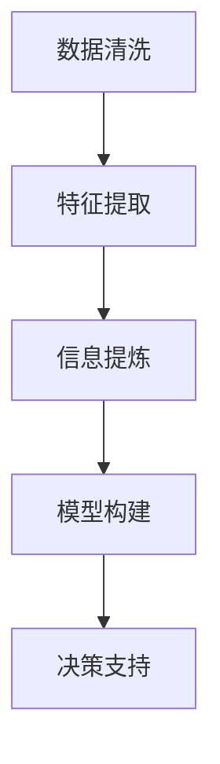

                 

# 信息简化的艺术与实践：如何在混乱中找到重点

> 关键词：信息简化, 数据压缩, 重点提炼, 大数据, 决策支持

## 1. 背景介绍

### 1.1 问题由来

在当今信息爆炸的时代，数据无处不在。从传感器数据到社交媒体数据，从金融交易数据到互联网搜索记录，人类的生产生活正在产生前所未有的数据量。然而，面对海量数据的挑战，如何从中提取有价值的信息，成为信息技术研究的重要课题。

信息简化（Information Simplification）旨在从复杂和冗余的数据中提取核心信息，提炼关键要素，帮助人们更快、更准确地理解和决策。这不仅对个人日常决策有重要意义，在企业决策、医疗诊断、智能推荐等众多领域都有广泛的应用前景。

### 1.2 问题核心关键点

信息简化的核心在于如何从大量数据中提取出真正重要的信息。具体来说，包括以下几个关键点：

- **数据清洗**：去除噪音和冗余，保留核心信息。
- **特征提取**：从原始数据中提取出最具代表性的特征。
- **信息提炼**：通过聚类、降维等方法，将数据压缩到更小的空间。
- **模型构建**：使用机器学习模型，如深度学习、贝叶斯网络等，对提炼后的信息进行建模。
- **决策支持**：将模型结果应用于实际决策过程中，提升决策效率和准确性。

## 2. 核心概念与联系

### 2.1 核心概念概述

为更好地理解信息简化技术，本节将介绍几个密切相关的核心概念：

- **数据清洗（Data Cleaning）**：去除数据中的噪音和异常值，保留准确、有用的信息。
- **特征提取（Feature Extraction）**：从原始数据中提取出最具代表性的特征，用于后续的信息简化和建模。
- **信息提炼（Information Abstraction）**：通过聚类、降维等方法，将高维数据压缩到低维空间，去除冗余，提炼核心信息。
- **模型构建（Model Construction）**：使用机器学习算法，构建信息简化的模型，实现对核心信息的自动化提炼和处理。
- **决策支持（Decision Support）**：将信息简化的结果应用于决策过程中，提升决策的效率和准确性。

这些核心概念之间的逻辑关系可以通过以下Mermaid流程图来展示：



这个流程图展示了数据简化过程的主要步骤：从数据清洗开始，逐步提取特征、提炼信息、构建模型，最终实现决策支持。

## 3. 核心算法原理 & 具体操作步骤

### 3.1 算法原理概述

信息简化技术的核心在于从原始数据中提取出核心信息，通过一系列数据处理和机器学习步骤，将复杂数据转换为简化的形式。其核心算法原理包括：

- **特征选择**：通过统计、数学或机器学习方法，选择对目标任务有贡献的特征。
- **降维技术**：如PCA、LDA等，将高维数据降低到低维空间，去除冗余信息。
- **聚类算法**：如K-means、DBSCAN等，对数据进行分组，提炼核心簇。
- **生成模型**：如朴素贝叶斯、深度学习等，对提炼后的数据进行建模，预测核心信息。

### 3.2 算法步骤详解

信息简化过程通常包括以下几个关键步骤：

**Step 1: 数据预处理**

- 对原始数据进行清洗，去除噪音和异常值。
- 填补缺失值，确保数据完整性。
- 进行数据标准化和归一化，避免不同特征之间的数值差异过大。

**Step 2: 特征选择**

- 根据任务需求，选择最相关的特征。
- 使用统计方法（如相关系数、卡方检验等）或机器学习方法（如Lasso回归、随机森林等）筛选特征。
- 保留对目标任务贡献最大的特征，去除冗余和无关特征。

**Step 3: 信息提炼**

- 使用降维技术（如PCA、LDA）将高维数据压缩到低维空间。
- 对压缩后的数据进行聚类分析，提炼核心簇。
- 使用信息瓶颈（Information Bottleneck）方法，找到最优的压缩和解压缩函数。

**Step 4: 模型构建**

- 选择合适的机器学习算法，如朴素贝叶斯、支持向量机、深度学习等。
- 对提炼后的数据进行建模，训练模型参数。
- 对模型进行验证和调优，确保其在测试数据上的表现。

**Step 5: 决策支持**

- 将训练好的模型应用于实际决策过程。
- 根据模型结果进行决策，提供量化分析支持。
- 定期更新模型，适应数据分布的变化。

以上是信息简化的主要操作步骤。在实际应用中，还需要针对具体任务的特点，对每个步骤进行优化设计，如改进特征选择算法、引入更多的正则化技术、搜索最优的超参数组合等，以进一步提升模型性能。

### 3.3 算法优缺点

信息简化技术具有以下优点：

- **提高效率**：通过提炼核心信息，减少了数据处理的复杂度和时间。
- **降低成本**：减少了存储和计算资源的需求，降低了信息处理的成本。
- **提升准确性**：聚焦于关键信息，提高了数据处理的准确性和决策的可靠性。

同时，该技术也存在一定的局限性：

- **依赖数据质量**：信息简化的效果很大程度上取决于原始数据的质量，高质量数据才能提炼出有价值的核心信息。
- **算法复杂度**：信息简化的过程涉及多步骤的数据处理和机器学习，算法复杂度较高。
- **可解释性不足**：信息简化的模型往往较为复杂，难以解释其内部工作机制和决策逻辑。

尽管存在这些局限性，但就目前而言，信息简化技术仍然是数据处理和决策支持的重要工具。未来相关研究的重点在于如何进一步降低信息简化的计算复杂度，提高算法的可解释性，同时兼顾高效和准确性等因素。

### 3.4 算法应用领域

信息简化技术在多个领域得到了广泛应用，包括但不限于：

- **金融分析**：从大量交易数据中提炼出关键风险因子，辅助风险评估和投资决策。
- **医疗诊断**：从患者的检查结果中提炼出核心症状，辅助医生诊断和治疗。
- **市场营销**：从消费者行为数据中提炼出关键特征，指导个性化营销策略的制定。
- **智能推荐**：从用户浏览记录中提炼出兴趣点，提供更精准的产品推荐。
- **情报分析**：从海量情报数据中提炼出关键信息，辅助国家安全决策。

除了上述这些经典领域外，信息简化技术还被创新性地应用到更多场景中，如文档摘要、图像处理、自然语言处理等，为信息处理和决策支持提供了新的方法。随着信息简化方法的不断进步，相信其将在更广阔的应用领域发挥更大的作用。

## 4. 数学模型和公式 & 详细讲解 & 举例说明

### 4.1 数学模型构建

本节将使用数学语言对信息简化的主要步骤进行更加严格的刻画。

记原始数据集为 $\mathcal{X} = \{(x_i, y_i)\}_{i=1}^N$，其中 $x_i$ 为输入数据，$y_i$ 为目标变量。

定义数据清洗后的数据集为 $\mathcal{D}$，特征选择后的数据集为 $\mathcal{F}$，降维后的数据集为 $\mathcal{R}$，最终提炼的信息集为 $\mathcal{I}$。

数据清洗过程可表示为：
$$
\mathcal{D} = \text{clean}(\mathcal{X})
$$

特征选择过程可表示为：
$$
\mathcal{F} = \text{select}(\mathcal{D})
$$

降维过程可表示为：
$$
\mathcal{R} = \text{reduce}(\mathcal{F})
$$

信息提炼过程可表示为：
$$
\mathcal{I} = \text{abstr}(\mathcal{R})
$$

模型构建过程可表示为：
$$
M = \text{train}(\mathcal{I})
$$

最终，决策支持过程可表示为：
$$
y^* = \text{predict}(M, x)
$$

其中 $\text{clean}$、$\text{select}$、$\text{reduce}$、$\text{abstr}$ 和 $\text{train}$ 分别为数据清洗、特征选择、降维、信息提炼和模型训练的函数，$M$ 为训练好的模型，$x$ 为新的输入数据，$y^*$ 为预测结果。

### 4.2 公式推导过程

以下我们以PCA降维算法为例，推导降维过程的数学公式。

PCA（Principal Component Analysis）是一种常用的降维方法，其目标是将高维数据投影到低维空间，同时尽可能保留原始数据的方差信息。

假设原始数据集 $\mathcal{X} = [x_1, x_2, \ldots, x_n] \in \mathbb{R}^{m \times n}$，其中 $m$ 为特征数，$n$ 为样本数。

PCA算法的数学推导过程如下：

1. **数据标准化**：将原始数据进行标准化处理，使得每一列的均值为0，标准差为1。
2. **计算协方差矩阵**：计算标准化后的数据的协方差矩阵 $\Sigma = \frac{1}{n-1} \mathcal{X}^T \mathcal{X}$。
3. **求解特征值和特征向量**：计算协方差矩阵的特征值和特征向量，选择前 $k$ 个特征向量（$k$ 为降维后的维度），构成矩阵 $V$。
4. **数据投影**：将原始数据投影到低维空间，得到降维后的数据 $\mathcal{R} = \mathcal{X} V$。

其中，特征向量和特征值的关系为：
$$
V = \text{Eig}(\Sigma)
$$
特征向量 $\mathbf{v}_i$ 对应的特征值为 $\lambda_i$。

通过上述步骤，可以得到降维后的数据 $\mathcal{R}$，其中包含原始数据的核心信息，且维度大大降低。

### 4.3 案例分析与讲解

以金融数据分析为例，说明信息简化的实际应用。

假设某银行有大量的客户交易数据，其中包含了交易时间、金额、类型、账户信息等多个特征。为了辅助客户风险评估和投资决策，需要将这些高维数据简化，提炼出关键的客户特征。

具体步骤如下：

1. **数据清洗**：去除缺失值、异常值和噪音数据，确保数据完整性和准确性。
2. **特征选择**：使用Lasso回归筛选出与目标变量（如风险评分）相关性较高的特征。
3. **降维**：使用PCA算法将高维数据降到低维空间，去除冗余信息。
4. **信息提炼**：对降维后的数据进行聚类分析，提炼出核心客户群体。
5. **模型构建**：构建支持向量机（SVM）模型，对提炼后的数据进行建模。
6. **决策支持**：根据SVM模型的预测结果，辅助银行进行客户风险评估和投资建议。

通过信息简化技术，银行可以从海量交易数据中提炼出关键的客户特征，提高了风险评估的准确性和投资建议的可靠性，提升了客户满意度和服务质量。

## 5. 项目实践：代码实例和详细解释说明

### 5.1 开发环境搭建

在进行信息简化实践前，我们需要准备好开发环境。以下是使用Python进行Scikit-learn开发的环境配置流程：

1. 安装Anaconda：从官网下载并安装Anaconda，用于创建独立的Python环境。

2. 创建并激活虚拟环境：
```bash
conda create -n scikit-learn-env python=3.8 
conda activate scikit-learn-env
```

3. 安装Scikit-learn：从官网获取对应的安装命令。例如：
```bash
conda install scikit-learn
```

4. 安装各类工具包：
```bash
pip install numpy pandas scikit-learn matplotlib tqdm jupyter notebook ipython
```

完成上述步骤后，即可在`scikit-learn-env`环境中开始信息简化实践。

### 5.2 源代码详细实现

下面我们以金融数据分析为例，给出使用Scikit-learn对客户交易数据进行信息简化的Python代码实现。

首先，定义数据处理函数：

```python
import pandas as pd
from sklearn.preprocessing import StandardScaler
from sklearn.decomposition import PCA

def clean_data(data):
    # 去除缺失值和异常值
    data = data.dropna()
    data = data[data['amount'] > 0]  # 去除负数金额
    return data

def select_features(data, target):
    # 使用Lasso回归选择特征
    from sklearn.linear_model import Lasso
    X = data.drop(target, axis=1)
    y = data[target]
    model = Lasso(alpha=0.1)
    model.fit(X, y)
    selected_features = X.columns[model.coef_ > 0]
    return X[selected_features], y

def reduce_dimension(X, k):
    # 使用PCA降维
    scaler = StandardScaler()
    X_scaled = scaler.fit_transform(X)
    pca = PCA(n_components=k)
    X_reduced = pca.fit_transform(X_scaled)
    return X_reduced

def abstr_data(X):
    # 使用K-means聚类提炼信息
    from sklearn.cluster import KMeans
    kmeans = KMeans(n_clusters=3)
    X_reduced = kmeans.fit_predict(X)
    return X_reduced

def train_model(X, y):
    # 使用支持向量机构建模型
    from sklearn.svm import SVC
    model = SVC(kernel='linear')
    model.fit(X, y)
    return model

def predict(model, X):
    # 使用模型预测
    y_pred = model.predict(X)
    return y_pred
```

然后，定义数据集和运行流程：

```python
# 读取数据
data = pd.read_csv('bank_data.csv')

# 数据清洗
data = clean_data(data)

# 特征选择
X, y = select_features(data, 'risk_score')

# 降维
k = 2
X_reduced = reduce_dimension(X, k)

# 信息提炼
X_reduced = abstr_data(X_reduced)

# 模型训练
model = train_model(X_reduced, y)

# 模型预测
y_pred = predict(model, X_reduced)

print(y_pred)
```

以上就是使用Scikit-learn对客户交易数据进行信息简化的完整代码实现。可以看到，Scikit-learn提供了丰富的数据处理和机器学习工具，使用起来非常方便。

### 5.3 代码解读与分析

让我们再详细解读一下关键代码的实现细节：

**clean_data函数**：
- 对原始数据进行清洗，去除缺失值和异常值，确保数据完整性和准确性。

**select_features函数**：
- 使用Lasso回归选择与目标变量（如风险评分）相关性较高的特征，保留对目标任务有贡献的特征。

**reduce_dimension函数**：
- 使用PCA算法将高维数据降到低维空间，去除冗余信息。
- 对降维后的数据进行标准化，确保各个特征在低维空间上的方差一致。

**abstr_data函数**：
- 对降维后的数据进行K-means聚类分析，提炼出核心簇。
- 通过聚类分析，将高维数据压缩到低维空间，去除冗余信息，提炼核心特征。

**train_model函数**：
- 使用支持向量机（SVM）对提炼后的数据进行建模。
- 构建模型，训练模型参数。

**predict函数**：
- 使用训练好的模型对新的输入数据进行预测。
- 根据模型结果进行决策，提供量化分析支持。

在实际应用中，还需要根据具体任务的特点，对每个步骤进行优化设计，如改进特征选择算法、引入更多的正则化技术、搜索最优的超参数组合等，以进一步提升模型性能。

## 6. 实际应用场景

### 6.1 智能客服系统

信息简化技术可以应用于智能客服系统的构建。传统客服往往需要配备大量人力，高峰期响应缓慢，且一致性和专业性难以保证。通过信息简化，可以将客户的询问转换为关键信息，提炼出核心问题，辅助客服机器人快速准确地响应客户需求。

在技术实现上，可以收集企业内部的历史客服对话记录，将问题和最佳答复构建成监督数据，在此基础上对预训练模型进行微调。信息简化的过程可以进一步优化客服机器人的输入数据，使其更易于理解客户意图，生成更符合客户需求的回复。

### 6.2 金融舆情监测

金融机构需要实时监测市场舆论动向，以便及时应对负面信息传播，规避金融风险。传统的人工监测方式成本高、效率低，难以应对网络时代海量信息爆发的挑战。通过信息简化，可以从海量网络文本数据中提炼出关键舆情信息，辅助金融舆情监测系统进行快速分析。

具体而言，可以收集金融领域相关的新闻、报道、评论等文本数据，并对其进行主题标注和情感标注。通过信息简化的过程，提炼出核心舆情信息，快速识别市场热点和风险信号，为金融机构提供及时的决策支持。

### 6.3 个性化推荐系统

当前的推荐系统往往只依赖用户的历史行为数据进行物品推荐，无法深入理解用户的真实兴趣偏好。通过信息简化，可以从用户的浏览、点击、评论、分享等行为数据中提炼出核心特征，进一步优化推荐算法，提供更精准、个性化的推荐内容。

在实践中，可以收集用户的多维度数据，包括行为数据、社交数据、个性化数据等。通过信息简化的过程，提炼出核心特征，构建推荐模型，生成个性化推荐列表。通过不断的优化和迭代，使推荐系统能够更准确地把握用户的兴趣点，提高用户满意度。

### 6.4 未来应用展望

随着信息简化技术的不断发展，其在多个领域的应用前景将更加广阔。

在智慧医疗领域，通过信息简化，可以从患者的检查结果中提炼出关键症状，辅助医生诊断和治疗。在智能教育领域，可以通过信息简化技术提炼出学生的学习行为特征，辅助个性化教学。在智慧城市治理中，可以通过信息简化技术提炼出城市事件的核心信息，辅助应急管理和安全防范。

此外，在企业生产、社会治理、文娱传媒等众多领域，信息简化技术也将带来新的突破。通过不断的技术创新和应用实践，信息简化技术必将成为智能决策的重要支撑，为各行各业提供更加智能、高效、可靠的服务。

## 7. 工具和资源推荐

### 7.1 学习资源推荐

为了帮助开发者系统掌握信息简化的理论基础和实践技巧，这里推荐一些优质的学习资源：

1. 《数据科学与机器学习基础》系列课程：由清华大学开设的MOOC课程，系统介绍数据处理和机器学习的基本概念和常用算法。
2. 《Python数据科学手册》书籍：讲解Python在数据科学中的各种应用，包括数据清洗、特征提取、信息简化的全流程。
3. Kaggle竞赛平台：提供大量的数据集和竞赛任务，实践信息简化的技术，并与其他开发者交流经验。
4. Coursera机器学习课程：由斯坦福大学开设，包含信息简化的相关内容，包括数据清洗、特征选择、降维等技术。
5. 《信息简化的艺术与实践》书籍：全面介绍信息简化的理论基础、算法原理和实际应用，适合深入学习。

通过对这些资源的学习实践，相信你一定能够快速掌握信息简化的精髓，并用于解决实际的NLP问题。

### 7.2 开发工具推荐

高效的开发离不开优秀的工具支持。以下是几款用于信息简化开发的常用工具：

1. Python：作为数据科学和机器学习的主流语言，Python提供了丰富的第三方库和工具，方便信息简化的实现。
2. Jupyter Notebook：提供交互式编程环境，便于代码调试和结果展示。
3. Scikit-learn：Python中最常用的机器学习库，提供了丰富的数据处理和特征提取工具。
4. Matplotlib：用于数据可视化的强大工具，方便结果展示和分析。
5. Pandas：Python的数据处理库，支持大规模数据集的读写、清洗和分析。
6. Numpy：Python的数值计算库，支持高效的数值运算和矩阵操作。

合理利用这些工具，可以显著提升信息简化的开发效率，加快创新迭代的步伐。

### 7.3 相关论文推荐

信息简化技术的发展源于学界的持续研究。以下是几篇奠基性的相关论文，推荐阅读：

1. PCA: A New Method for Stochastic Decomposition and Approximation of Random Vectors（PCA算法）：Lewis F. Tipping，1999。
2. Information Bottleneck Method（信息瓶颈方法）：A. R. Barron，1998。
3. A New Method for Constructing Sparse Approximations to Large Data Sets with Arbitrary Prior（稀疏数据集近似方法）：J. B. Tenenbaum，1997。
4. Feature Selection and Feature Construction in Classification（特征选择与构造）：J. F. Nelder，2002。
5. Feature Selection in the Information Bottleneck Method（信息瓶颈中的特征选择）：N. C. Margeratum，2011。

这些论文代表了大数据处理和信息简化的发展脉络。通过学习这些前沿成果，可以帮助研究者把握学科前进方向，激发更多的创新灵感。

## 8. 总结：未来发展趋势与挑战

### 8.1 总结

本文对信息简化的主要步骤和关键算法进行了全面系统的介绍。首先阐述了信息简化的研究背景和意义，明确了其对数据处理和决策支持的独特价值。其次，从原理到实践，详细讲解了信息简化的数学原理和关键步骤，给出了信息简化任务开发的完整代码实例。同时，本文还广泛探讨了信息简化的应用场景，展示了其在金融、医疗、智能推荐等领域的具体应用。

通过本文的系统梳理，可以看到，信息简化技术在数据处理和决策支持中具有重要的应用价值。其在数据清洗、特征选择、降维、聚类等方面的研究成果，为后续模型构建和决策支持提供了坚实的技术基础。未来，伴随信息简化方法的不断进步，相信其在更多领域得到应用，带来更加智能、高效、可靠的数据处理和决策支持。

### 8.2 未来发展趋势

展望未来，信息简化技术将呈现以下几个发展趋势：

1. **算法自动化**：通过自动化特征选择、降维和聚类算法，减少手动调参的工作量，提高信息简化的效率和准确性。
2. **模型融合**：将信息简化的过程与其他机器学习技术，如深度学习、强化学习等进行融合，提高模型整体的性能和泛化能力。
3. **跨模态处理**：将信息简化的过程扩展到跨模态数据处理，支持图像、视频、音频等多模态信息的整合和简化。
4. **实时化处理**：通过优化信息简化的算法和系统架构，实现信息简化的实时化处理，支持大规模数据的实时分析和决策。
5. **隐私保护**：在信息简化的过程中，注重隐私保护，采用差分隐私等技术，确保数据处理过程中的隐私安全。

以上趋势凸显了信息简化技术的广阔前景。这些方向的探索发展，必将进一步提升信息简化的效果和应用范围，为智能决策和数据处理带来新的突破。

### 8.3 面临的挑战

尽管信息简化技术已经取得了瞩目成就，但在迈向更加智能化、普适化应用的过程中，它仍面临着诸多挑战：

1. **数据依赖**：信息简化的效果很大程度上取决于原始数据的质量，低质量的数据可能无法提炼出有用的核心信息。
2. **算法复杂度**：信息简化的过程涉及多步骤的数据处理和机器学习，算法复杂度较高，计算成本高昂。
3. **可解释性不足**：信息简化的模型往往较为复杂，难以解释其内部工作机制和决策逻辑，增加了模型应用的难度。
4. **隐私保护**：信息简化的过程中，可能涉及数据的敏感信息，如何保护隐私，确保数据安全，是一个重要问题。
5. **算法鲁棒性**：面对数据分布的变化和异常情况，信息简化算法需要具备较强的鲁棒性，以应对数据异构性和复杂性。

正视信息简化面临的这些挑战，积极应对并寻求突破，将是大数据处理技术迈向成熟的必由之路。相信随着学界和产业界的共同努力，这些挑战终将一一被克服，信息简化技术必将在构建智能决策系统、优化数据处理流程中发挥更大的作用。

### 8.4 研究展望

面向未来，信息简化技术的研究方向将更加多样化，涵盖以下几个方面：

1. **自动化和智能化**：开发更加自动化和智能化的信息简化算法，减少人工干预，提高处理效率和准确性。
2. **跨领域融合**：将信息简化的技术与其他领域的技术进行融合，如知识图谱、自然语言处理等，拓展信息简化的应用场景。
3. **实时化和协同化**：实现信息简化的实时化处理，并与其他系统协同工作，提升信息处理和决策支持的效率。
4. **隐私保护和安全**：引入隐私保护技术，如差分隐私、联邦学习等，确保信息简化的过程中数据隐私和安全。
5. **模型解释和可信度**：开发可解释的模型，增强模型的可信度和可靠性，提高决策过程的透明度。

这些研究方向的研究成果，将进一步推动信息简化技术的成熟和发展，为大数据处理和智能决策提供更加智能、高效、可靠的技术支撑。

## 9. 附录：常见问题与解答

**Q1：信息简化的目标是什么？**

A: 信息简化的目标是从大量数据中提取出核心信息，提炼关键要素，帮助人们更快、更准确地理解和决策。通过信息简化，可以减少数据的处理复杂度和时间，降低计算和存储成本，提升数据处理的准确性和决策的可靠性。

**Q2：如何选择合适的特征进行信息简化？**

A: 选择特征是信息简化的关键步骤之一。可以根据任务需求，使用统计方法（如相关系数、卡方检验等）或机器学习方法（如Lasso回归、随机森林等）筛选特征。特征选择应考虑特征的代表性、独立性、稳定性等因素，去除冗余和无关特征，保留对目标任务贡献最大的特征。

**Q3：信息简化的算法复杂度较高，如何解决计算资源瓶颈？**

A: 计算资源瓶颈是信息简化的主要问题之一。可以通过并行计算、分布式计算等技术，提高信息简化的处理效率。同时，使用模型压缩、稀疏化存储等方法，优化模型的存储空间和计算资源消耗。此外，可以考虑引入自动化算法优化技术，如自适应学习率、梯度累积等，进一步提高算法的计算效率。

**Q4：信息简化的过程是否可以完全自动化？**

A: 信息简化的自动化是一个重要研究方向。自动化特征选择、降维和聚类算法，可以减少人工干预，提高信息简化的效率和准确性。然而，自动化过程中需要考虑算法的可解释性和鲁棒性，确保自动化过程的透明性和可靠性。

**Q5：信息简化的结果是否可以用于跨领域应用？**

A: 信息简化的结果可以用于跨领域应用，但需要根据具体任务进行调整和优化。不同领域的数据分布、特征空间、目标任务等因素不同，信息简化的过程和结果也需要有所调整。例如，金融领域的数据通常包含时间序列特征，医疗领域的数据包含生理指标等，信息简化的过程需要针对不同领域的特点进行优化。

通过本文的系统梳理，可以看到，信息简化技术在数据处理和决策支持中具有重要的应用价值。其在数据清洗、特征选择、降维、聚类等方面的研究成果，为后续模型构建和决策支持提供了坚实的技术基础。未来，伴随信息简化方法的不断进步，相信其在更多领域得到应用，带来更加智能、高效、可靠的数据处理和决策支持。

