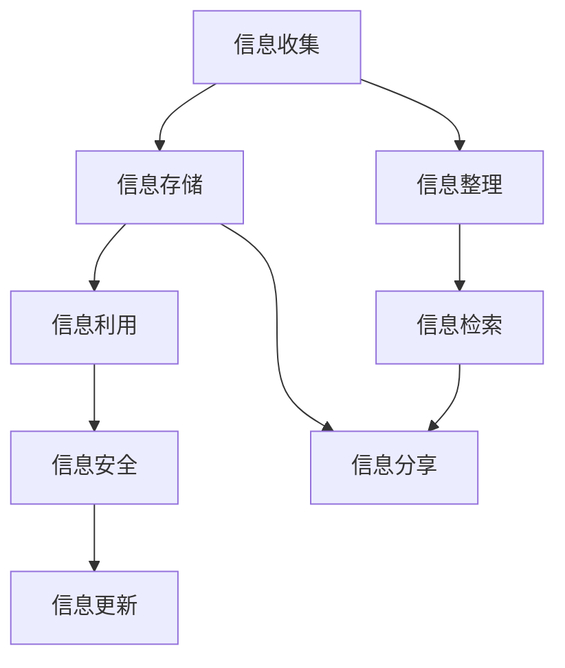

                 

## 1. 背景介绍

### 1.1 问题由来

在现代社会，信息爆炸已经成为了不可避免的趋势。无论是个人生活还是企业运营，信息的收集、存储、管理和利用都变得越来越重要。但与此同时，信息的爆炸也带来了信息过载、信息冗余、信息混乱等一系列问题，极大地影响了个人的工作效率和企业的经营决策。

面对信息的繁杂和无序，许多人常常感到“信息管理”无从下手。实际上，良好的信息管理不仅可以显著提高个人的工作效率，还能帮助企业降低运营成本，提升决策质量。因此，信息管理成为了一种艺术，需要技巧和智慧的共同努力。

### 1.2 问题核心关键点

信息管理的核心在于：

1. **信息的收集**：如何获取有效的信息源，确保信息的全面性和准确性。
2. **信息的存储**：如何高效地组织和存储信息，使其易于检索和使用。
3. **信息的利用**：如何利用信息提升个人工作效率和企业决策质量。
4. **信息的安全**：如何保护信息不被未经授权的访问和使用。
5. **信息的更新**：如何及时更新信息，确保信息的实时性和可靠性。

本文将围绕这些核心点，深入探讨信息管理的艺术，并给出具体的实践建议和解决方案。

## 2. 核心概念与联系

### 2.1 核心概念概述

- **信息管理**：通过系统化的方法，收集、存储、整理、利用信息，以提升个人效率和决策质量的过程。
- **信息收集**：识别、获取、筛选有效信息，是信息管理的基础。
- **信息存储**：利用数据库、文件系统等技术，合理组织信息，便于检索和利用。
- **信息利用**：将信息转化为具体的行动、决策或知识，实现信息价值的最大化。
- **信息安全**：通过加密、访问控制等措施，保护信息不被未授权访问和滥用。
- **信息更新**：及时更新信息，确保其时效性和可靠性，避免过时信息带来的误导。

这些概念之间相互联系，共同构成了信息管理的整体框架。通过了解和掌握这些概念，我们可以更好地管理和利用信息，提升个人和工作效率。

### 2.2 核心概念原理和架构的 Mermaid 流程图



## 3. 核心算法原理 & 具体操作步骤

### 3.1 算法原理概述

信息管理的算法原理主要围绕信息的收集、存储、整理、利用、安全、更新六个环节展开。每个环节都有其特定的算法和数据结构，用于高效地实现信息管理的目标。

- **信息收集**：使用爬虫技术、API接口等方式，从互联网、数据库等渠道收集信息。
- **信息存储**：利用数据库技术（如SQL、NoSQL），合理组织和管理信息，支持快速的查询和检索。
- **信息利用**：通过数据挖掘、机器学习等算法，将信息转化为具体的行动、决策或知识，支持智能化的决策支持系统。
- **信息安全**：采用加密技术、访问控制等手段，保护信息不被未授权访问和滥用。
- **信息更新**：使用数据同步、定时更新等策略，确保信息的实时性和可靠性。
- **信息整理**：通过分类、聚类等算法，整理和归档信息，便于后续管理和利用。
- **信息检索**：利用全文索引、倒排索引等技术，支持高效的文本检索。

### 3.2 算法步骤详解

以信息收集和存储为例，详细介绍信息管理的核心算法和具体操作步骤。

#### 信息收集

1. **选择信息源**：根据需求选择合适的信息源，如新闻网站、社交媒体、数据库等。
2. **设计爬虫脚本**：使用Python等编程语言编写爬虫脚本，自动化获取信息。
3. **处理重复信息**：通过哈希、指纹等算法，去除重复信息，保证信息的唯一性。
4. **存储到数据库**：将收集的信息存储到关系型数据库或NoSQL数据库中，便于后续处理和利用。

#### 信息存储

1. **选择数据库**：根据数据量、访问频率等因素选择合适的数据库，如MySQL、MongoDB等。
2. **设计数据表**：根据信息的特点，设计合理的数据表结构和字段，确保数据的完整性和一致性。
3. **插入数据**：使用SQL或NoSQL的插入语句，将信息存储到数据库中。
4. **索引优化**：使用索引技术（如B+树、哈希索引等），优化查询效率，加快检索速度。

### 3.3 算法优缺点

信息管理算法的优点包括：

- **高效性**：通过自动化工具和高效的数据结构，显著提升信息收集、存储、利用等环节的效率。
- **准确性**：通过去重、校正等技术，保证信息的准确性和完整性。
- **可扩展性**：使用分布式系统和大数据技术，支持大规模信息的管理和分析。

其缺点包括：

- **复杂性**：信息管理涉及多个环节和算法，设计和实现较为复杂。
- **资源消耗**：信息管理需要大量计算资源和存储空间，成本较高。
- **隐私风险**：信息存储和传输过程中，存在隐私泄露和数据安全风险。

### 3.4 算法应用领域

信息管理算法广泛应用在以下几个领域：

- **企业运营管理**：通过ERP系统、CRM系统等，实现信息的高效管理和利用，提升企业决策和运营效率。
- **个人生活管理**：通过TodoList应用、日历应用等，帮助个人规划和安排时间，提升生活和工作效率。
- **智能推荐系统**：通过大数据分析，实现个性化推荐，提升用户体验和满意度。
- **社交网络分析**：通过分析社交网络数据，发现关系网络中的关键节点和信息流动模式，支持社交网络管理。
- **市场分析**：通过数据挖掘和机器学习，分析市场趋势和用户需求，支持企业市场决策。

## 4. 数学模型和公式 & 详细讲解 & 举例说明

### 4.1 数学模型构建

信息管理中的数学模型主要涉及以下几类：

- **信息收集模型**：用于评估不同信息源的可靠性和覆盖范围。
- **信息存储模型**：用于优化数据存储和查询效率。
- **信息利用模型**：用于提取和分析信息中的知识。
- **信息安全模型**：用于评估和提升信息系统的安全性。
- **信息更新模型**：用于设计信息更新的策略和算法。

### 4.2 公式推导过程

以信息存储模型为例，推导数据的查询效率公式。

假设信息存储在关系型数据库中，查询条件为 $P(x)$，查询结果为 $R$，查询次数为 $t$。查询效率公式为：

$$
\text{效率} = \frac{t}{|R|}
$$

其中，$|R|$ 表示查询结果的数量。为了提高查询效率，我们需要优化查询条件 $P(x)$，减少查询次数 $t$，增加查询结果 $|R|$。

### 4.3 案例分析与讲解

以下是一个具体的案例分析：

某电商企业希望通过用户行为数据进行个性化推荐。通过爬虫技术，企业收集了用户的浏览、购买、评价等行为数据。将这些数据存储到MongoDB中，并使用倒排索引优化查询效率。同时，使用机器学习算法，分析用户行为中的潜在需求，生成个性化推荐列表。最终，通过企业运营管理系统（ERP）进行实时推送和展示，提升用户体验和转化率。

## 5. 项目实践：代码实例和详细解释说明

### 5.1 开发环境搭建

在信息管理项目开发中，常见的开发环境包括：

1. **Python编程环境**：使用Anaconda或Miniconda创建虚拟环境，安装Python及相关库。
2. **数据库管理系统**：安装MySQL、PostgreSQL或MongoDB，配置连接参数。
3. **爬虫工具**：安装Scrapy、BeautifulSoup等爬虫工具，支持信息自动收集。
4. **数据可视化工具**：安装Matplotlib、Seaborn等，支持数据可视化分析。

### 5.2 源代码详细实现

以下是一个信息收集和存储的Python代码实现：

```python
# 信息收集模块
import requests
from bs4 import BeautifulSoup
from hashlib import md5

def collect_info(url):
    response = requests.get(url)
    soup = BeautifulSoup(response.content, 'html.parser')
    # 提取需要的信息
    info = {}
    info['title'] = soup.title.string
    info['content'] = soup.find('div', {'class': 'content'}).text
    # 计算指纹
    info['fingerprint'] = md5(info['title'] + info['content']).hexdigest()
    return info

# 信息存储模块
import pymongo

def store_info(info, db_name, collection_name):
    client = pymongo.MongoClient('mongodb://localhost:27017')
    db = client[db_name]
    collection = db[collection_name]
    collection.insert_one(info)
```

### 5.3 代码解读与分析

以上代码实现了信息收集和存储的基本功能。

**信息收集模块**：使用requests和BeautifulSoup库，从指定URL中提取信息，计算指纹并返回。

**信息存储模块**：使用pymongo库，连接到MongoDB数据库，将信息插入到指定的集合中。

### 5.4 运行结果展示

运行上述代码，收集指定网站的信息，并存储到MongoDB中。可以通过MongoDB的客户端工具或编程接口，查看存储的信息，并进行进一步处理和分析。

## 6. 实际应用场景

### 6.1 企业运营管理

在企业运营管理中，信息管理可以显著提升企业的决策和运营效率。通过ERP系统、CRM系统等，实现信息的高效管理和利用，帮助企业做出更好的决策。

例如，某制造企业通过ERP系统，收集和分析供应链数据，优化生产计划和库存管理，提升供应链效率。通过CRM系统，收集和分析客户反馈，优化客户关系管理，提升客户满意度和忠诚度。

### 6.2 个人生活管理

在个人生活管理中，信息管理可以帮助个人规划和安排时间，提升生活和工作效率。

例如，通过TodoList应用，记录和整理日常任务，确保任务按时完成。通过日历应用，安排和调整日程，避免时间冲突。通过笔记应用，记录和整理知识，提升学习和工作效率。

### 6.3 智能推荐系统

在智能推荐系统中，信息管理可以提升用户体验和满意度。通过大数据分析，实现个性化推荐，提供符合用户兴趣和需求的内容。

例如，某视频网站通过用户行为数据，分析用户偏好和兴趣，推荐相关视频内容，提升用户粘性和观看时长。通过新闻应用，分析用户阅读习惯，推荐相关新闻内容，提升用户阅读体验。

### 6.4 未来应用展望

未来，信息管理技术将进一步发展，并在更多领域得到应用。例如：

- **智慧城市**：通过物联网设备收集和分析城市数据，提升城市管理和公共服务质量。
- **医疗健康**：通过医疗数据收集和分析，支持个性化医疗和健康管理。
- **金融科技**：通过金融数据收集和分析，支持智能投顾和风险管理。
- **教育科技**：通过学习数据收集和分析，支持个性化教育和智能教学。

## 7. 工具和资源推荐

### 7.1 学习资源推荐

为了掌握信息管理的艺术，推荐以下学习资源：

1. **《信息管理的艺术》书籍**：系统介绍了信息管理的理论、实践和案例。
2. **Coursera《数据科学导论》课程**：涵盖数据收集、数据存储、数据处理等基础知识。
3. **Kaggle平台**：通过参与数据竞赛，实践数据管理和分析技能。
4. **GitHub代码库**：查看和借鉴优秀的信息管理项目代码，提升编程能力。
5. **博客和论坛**：如CSDN、Stack Overflow，获取最新的信息管理技术和实践经验。

### 7.2 开发工具推荐

信息管理项目开发中，推荐以下开发工具：

1. **Python编程语言**：功能强大，适合信息管理算法的实现。
2. **Anaconda环境管理工具**：支持虚拟环境和包管理，方便工具和库的安装和更新。
3. **MongoDB数据库**：开源免费，支持大规模数据存储和查询。
4. **Scrapy爬虫框架**：支持网页数据的自动抓取和处理。
5. **PyCharm IDE**：支持Python开发，提供丰富的插件和工具，提升开发效率。

### 7.3 相关论文推荐

信息管理领域的相关论文推荐：

1. **《数据挖掘与信息管理》**：介绍数据挖掘和信息管理的经典算法和应用。
2. **《信息管理系统的设计与实现》**：详细阐述信息管理系统的设计思路和实现方法。
3. **《信息安全与隐私保护》**：探讨信息管理和信息安全之间的关联与挑战。
4. **《大数据与信息管理》**：分析大数据技术在信息管理中的应用和前景。
5. **《人工智能与信息管理》**：研究人工智能技术在信息管理中的应用和创新。

## 8. 总结：未来发展趋势与挑战

### 8.1 研究成果总结

本文对信息管理的艺术进行了全面系统的介绍，包括信息收集、存储、利用、安全、更新等多个环节，提供了具体的实践建议和解决方案。通过深入分析信息管理的核心概念和算法，帮助读者更好地理解和应用信息管理技术。

### 8.2 未来发展趋势

未来，信息管理技术将呈现出以下几个发展趋势：

1. **大数据技术的应用**：通过大数据技术，提升信息管理的效率和精度。
2. **人工智能的融合**：结合人工智能技术，提升信息分析和智能决策能力。
3. **边缘计算的普及**：利用边缘计算技术，实现信息管理的实时性和高效性。
4. **区块链技术的引入**：通过区块链技术，提升信息管理的透明性和安全性。
5. **云计算的广泛应用**：利用云计算平台，实现信息管理的分布式部署和弹性伸缩。

### 8.3 面临的挑战

信息管理技术虽然取得了很多进展，但在实际应用中仍然面临一些挑战：

1. **数据隐私和安全**：如何在保障数据隐私和安全的同时，实现高效的信息管理。
2. **数据质量和一致性**：如何确保数据的准确性和一致性，避免数据混乱和错误。
3. **系统复杂性**：信息管理系统涉及多个环节和算法，设计和实现较为复杂。
4. **资源消耗**：信息管理需要大量计算资源和存储空间，成本较高。
5. **用户接受度**：如何提升用户对信息管理系统的接受度和使用意愿。

### 8.4 研究展望

面对这些挑战，未来的研究需要在以下几个方面寻求新的突破：

1. **数据隐私保护**：研究隐私保护算法和技术，确保信息安全。
2. **数据质量和一致性**：研究数据清洗和校验算法，提升数据质量。
3. **系统复杂性**：研究模块化和组件化设计，简化系统实现。
4. **资源优化**：研究资源共享和分布式计算技术，降低资源消耗。
5. **用户体验**：研究用户友好设计和互动机制，提升用户接受度。

## 9. 附录：常见问题与解答

**Q1：信息管理算法的复杂性如何处理？**

A: 信息管理算法的复杂性可以通过模块化和组件化设计来处理。将信息管理的各个环节分解成多个模块，每个模块负责特定的功能，通过标准化的接口进行通信，从而简化系统设计和实现。

**Q2：信息管理系统中如何保护用户隐私？**

A: 在信息管理系统中，保护用户隐私可以通过以下措施：

1. 数据匿名化：对敏感信息进行脱敏处理，避免用户隐私泄露。
2. 访问控制：通过身份验证和授权机制，确保只有授权用户才能访问敏感信息。
3. 数据加密：对存储和传输的数据进行加密，防止数据被未授权访问和篡改。
4. 数据审计：记录和监控数据访问和使用情况，及时发现和处理异常行为。

**Q3：信息管理系统如何提升用户体验？**

A: 信息管理系统可以通过以下措施提升用户体验：

1. 界面友好设计：设计简洁、直观的用户界面，降低用户使用门槛。
2. 实时反馈机制：及时响应用户操作，提供实时反馈和提示，提升用户体验。
3. 个性化推荐：根据用户行为和偏好，推荐符合用户需求的内容和功能，提升用户满意度。
4. 用户互动设计：设计友好的互动机制，如搜索、过滤、排序等功能，提升用户操作便捷性。

**Q4：信息管理系统如何处理大规模数据？**

A: 信息管理系统可以通过以下措施处理大规模数据：

1. 分布式存储：使用分布式文件系统（如Hadoop、Ceph），存储和管理大规模数据。
2. 分布式计算：使用分布式计算框架（如Spark、Hadoop），提升数据处理和分析效率。
3. 数据分片：将数据分成多个片段，进行并行处理和查询，提升系统性能。
4. 缓存技术：使用缓存技术（如Redis），提升数据访问速度，减少系统延迟。

**Q5：信息管理系统如何保证数据一致性？**

A: 在信息管理系统中，保证数据一致性可以通过以下措施：

1. 数据校验：在数据存储和更新时，进行数据校验和检查，确保数据的准确性和一致性。
2. 事务处理：使用事务机制，确保数据操作的原子性和一致性。
3. 数据同步：使用数据同步技术，确保多个系统间数据的一致性。
4. 数据备份：定期备份数据，防止数据丢失和损坏。

---

作者：禅与计算机程序设计艺术 / Zen and the Art of Computer Programming

