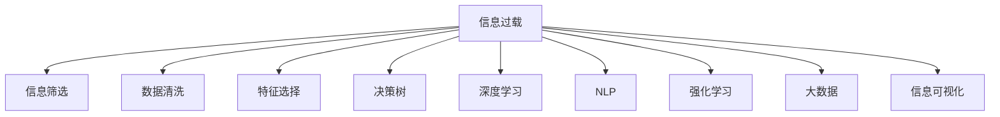

                 

# 信息过载与信息筛选策略与实践：在信息洪流中找到有价值的信息

> 关键词：信息过载,信息筛选,数据清洗,决策树,特征选择,深度学习,自然语言处理(NLP),强化学习,大数据,信息可视化

## 1. 背景介绍

在信息化社会，信息爆炸已成为不争的事实。从社交媒体、电子邮件到新闻网站、数据报告，每时每刻都有大量信息从不同渠道涌入我们的视野。信息过载（Information Overload）已经成为普遍现象，严重影响了人们的决策和认知。如何从浩如烟海的信息中筛选出有价值的内容，是当今数据科学与信息科学面临的一项重要挑战。

### 1.1 问题由来

信息过载问题的根源在于数据量的指数级增长和信息传播渠道的多样化。一方面，互联网的发展使得信息获取变得更加方便，但同时也导致了信息质量的参差不齐。另一方面，各种设备如智能手机、平板电脑等，使得信息获取随时随地成为可能，用户淹没在信息的海洋中。

### 1.2 问题核心关键点

信息过载问题主要体现在以下几个方面：

- **信息量巨大**：海量的信息充斥着各种渠道，用户需要花费大量时间去浏览和筛选。
- **信息质量参差不齐**：一些有价值的信息被海量的无用信息所淹没，难以发现。
- **信息冗余**：重复信息的大量存在，增加了用户筛选的负担。
- **信息不一致**：不同来源的信息可能存在差异甚至矛盾，增加了判断的难度。
- **信息更新速度快**：信息更新频繁，用户需要不断更新认知，才能跟上最新的趋势。

这些问题不仅影响用户的日常生活，更在企业和政府决策中产生重大影响。如果不能有效筛选信息，将会造成决策失误，导致资源浪费。

### 1.3 问题研究意义

研究信息筛选策略与实践，对于提升个人效率、优化决策过程、促进信息民主化具有重要意义：

- **提升个人效率**：通过有效的信息筛选，减少用户筛选无用信息的时间，提升工作效率。
- **优化决策过程**：有价值的信息能够帮助决策者做出更加明智的决策，提高决策质量。
- **促进信息民主化**：信息筛选技术能够帮助普通用户获得高质量信息，提升社会整体信息素养。

## 2. 核心概念与联系

### 2.1 核心概念概述

为了有效应对信息过载问题，我们引入了一些关键概念：

- **信息筛选（Information Filtering）**：从大量信息中挑选出有价值内容的过程，是信息过载问题的直接解决方法。
- **数据清洗（Data Cleaning）**：去除或修复数据中的噪声和错误，提高数据质量的过程。
- **特征选择（Feature Selection）**：从原始数据中挑选出最具有代表性的特征，提升模型性能和泛化能力。
- **决策树（Decision Tree）**：一种基于树形结构的分类算法，用于从数据中找出影响输出的关键因素。
- **深度学习（Deep Learning）**：一种基于神经网络的机器学习方法，能够从数据中自动提取高层次的抽象特征。
- **自然语言处理（NLP）**：处理和理解人类语言的技术，广泛用于信息检索、文本分类、问答系统等领域。
- **强化学习（Reinforcement Learning）**：通过智能体与环境的交互，学习最优策略的机器学习方法。
- **大数据（Big Data）**：处理和分析海量数据的技术和工具，是信息筛选与分析的基础。
- **信息可视化（Information Visualization）**：将信息转换为图形、图表等直观形式，帮助用户理解和分析数据。

这些概念之间的逻辑关系可以通过以下Mermaid流程图来展示：



这个流程图展示了从信息过载问题出发，通过信息筛选等技术，逐步提升信息质量和可用性，最终达到优化决策、提升效率的目的。

## 3. 核心算法原理 & 具体操作步骤
### 3.1 算法原理概述

信息筛选的核心目标是识别并提取信息集中的关键内容，去除噪声和不相关部分。其基本流程包括数据预处理、特征提取、模型训练和结果呈现。

数据预处理阶段，主要进行数据清洗和特征选择，去除噪声和冗余信息，提取最具代表性和区分性的特征。然后，使用决策树、深度学习等算法进行模型训练，构建筛选模型。最后，将模型应用于待筛选数据集，生成筛选结果。

### 3.2 算法步骤详解

#### 3.2.1 数据预处理

1. **数据清洗**：
   - 去重：去除数据集中的重复记录。
   - 修复：修正数据中的错误和噪声。
   - 标准化：将数据转换为标准格式，统一度量单位。

2. **特征选择**：
   - 过滤法：根据特征与目标变量之间的相关性，筛选出重要特征。
   - 包裹法：构建模型，评估每个特征对模型性能的贡献，选择重要特征。
   - 嵌入法：在模型训练过程中，自动学习最佳特征组合。

#### 3.2.2 特征提取

1. **文本特征提取**：
   - 词袋模型（Bag of Words）：将文本转换为词频向量。
   - TF-IDF（Term Frequency-Inverse Document Frequency）：考虑词频和词在文档中的重要性。
   - 词嵌入（Word Embedding）：将词转换为低维向量，保留语义信息。

2. **图像特征提取**：
   - SIFT（尺度不变特征转换）：提取图像的局部特征。
   - CNN（卷积神经网络）：从图像中自动学习高级特征。

#### 3.2.3 模型训练

1. **决策树**：
   - 构建决策树模型，将特征映射到分类结果。
   - 剪枝优化模型，避免过拟合。

2. **深度学习**：
   - 使用卷积神经网络（CNN）或循环神经网络（RNN）处理文本和图像数据。
   - 使用注意力机制（Attention）提升特征提取能力。

3. **强化学习**：
   - 设计强化学习环境，定义奖励函数。
   - 训练智能体（Agent），学习最优策略。

#### 3.2.4 结果呈现

1. **可视化展示**：
   - 使用图表、热图等形式，展示筛选结果。
   - 提供交互式界面，方便用户查看和筛选。

### 3.3 算法优缺点

#### 3.3.1 优点

- **高效性**：自动化数据处理和特征提取，减少人工干预。
- **准确性**：通过模型训练，能够自动识别重要信息。
- **可扩展性**：适用于多种数据类型和应用场景。

#### 3.3.2 缺点

- **数据依赖**：模型的效果依赖于数据质量，数据清洗和特征选择的重要性不言而喻。
- **模型复杂性**：深度学习等模型需要大量计算资源和时间，训练复杂。
- **可解释性不足**：部分模型如深度学习，其内部机制难以解释，用户难以理解模型决策。
- **泛化能力有限**：模型可能对新数据泛化能力不足，需要持续优化和更新。

### 3.4 算法应用领域

信息筛选技术在多个领域得到了广泛应用：

- **电商推荐**：根据用户历史行为和商品信息，筛选出用户可能感兴趣的商品。
- **新闻推荐**：从大量新闻中筛选出与用户兴趣匹配的内容，提供个性化推荐。
- **金融投资**：从海量市场数据中筛选出有价值的投资信息，辅助决策。
- **社交网络**：从社交媒体数据中筛选出重要信息，提升用户体验。
- **医疗诊断**：从电子病历中筛选出关键信息，辅助医生诊断。

## 4. 数学模型和公式 & 详细讲解
### 4.1 数学模型构建

信息筛选模型通常包括以下几个部分：

- **输入**：原始数据集，包括文本、图像、数值等。
- **预处理**：数据清洗、特征提取等预处理操作。
- **模型**：用于训练和筛选的算法模型。
- **输出**：筛选结果，用于展示和应用。

### 4.2 公式推导过程

#### 4.2.1 决策树模型

决策树模型基于信息熵和信息增益，通过不断分割数据集，构建树形结构。其基本公式如下：

$$
\mathcal{T} = \{T_1, T_2, ..., T_n\}
$$

其中 $T_i$ 表示第 $i$ 个决策树节点，包含子节点 $T_{i1}, T_{i2}, ..., T_{im}$，每个子节点表示一个特征的取值。决策树构建的公式为：

$$
\mathcal{T} = \arg\min_{\mathcal{T}} H(\mathcal{T})
$$

其中 $H(\mathcal{T})$ 表示决策树的熵，用于度量模型的不确定性。

#### 4.2.2 深度学习模型

深度学习模型通常使用反向传播算法训练，其基本公式为：

$$
\min_{\theta} \mathcal{L}(\theta)
$$

其中 $\theta$ 表示模型参数，$\mathcal{L}$ 表示损失函数。常用的损失函数包括均方误差（MSE）、交叉熵（Cross-Entropy）等。

### 4.3 案例分析与讲解

#### 4.3.1 电商推荐系统

假设电商网站有海量商品数据和用户历史行为数据，需要为用户推荐可能感兴趣的商品。可以使用协同过滤（Collaborative Filtering）或基于内容的推荐（Content-Based Recommendation）等方法。其中，协同过滤基于用户行为数据，构建用户-商品评分矩阵，通过相似度计算推荐商品。基于内容的推荐则使用商品属性作为特征，训练模型推荐相似商品。

#### 4.3.2 新闻推荐系统

新闻推荐系统通常使用基于内容的推荐，从新闻文章中提取关键词、作者、发布时间等特征，使用决策树或深度学习模型进行推荐。例如，可以使用LSTM（Long Short-Term Memory）网络处理文本数据，提取特征进行推荐。

## 5. 项目实践：代码实例和详细解释说明
### 5.1 开发环境搭建

为了进行信息筛选的实践，需要准备以下开发环境：

1. **Python环境**：安装Python 3.x，推荐使用Anaconda或Miniconda，方便创建和管理虚拟环境。

2. **深度学习框架**：选择TensorFlow或PyTorch作为深度学习框架，这两个框架都提供了丰富的预训练模型和工具。

3. **数据处理库**：使用Pandas、NumPy等库进行数据预处理和特征提取。

4. **模型训练库**：使用Scikit-Learn或TensorFlow等库进行模型训练。

5. **可视化工具**：使用Matplotlib、Seaborn等库进行数据可视化。

### 5.2 源代码详细实现

#### 5.2.1 电商推荐系统

```python
import pandas as pd
import numpy as np
from sklearn.model_selection import train_test_split
from sklearn.metrics import precision_score, recall_score
from sklearn.neighbors import NearestNeighbors
from sklearn.feature_extraction.text import TfidfVectorizer

# 数据读取和预处理
data = pd.read_csv('items.csv')
data = data.dropna()
items = data['item'].tolist()
ratings = data['rating'].tolist()

# 数据分割
X_train, X_test, y_train, y_test = train_test_split(items, ratings, test_size=0.2, random_state=42)

# 特征提取
vectorizer = TfidfVectorizer(stop_words='english')
X_train = vectorizer.fit_transform(X_train)
X_test = vectorizer.transform(X_test)

# 模型训练
knn = NearestNeighbors(n_neighbors=10, algorithm='ball_tree')
knn.fit(X_train, y_train)

# 推荐测试
def recommend(item, k=10):
    X = vectorizer.transform([item])
    distances, indices = knn.kneighbors(X, n_neighbors=k+1)
    return np.array(ratings)[indices[1:]][0]

# 测试推荐结果
recommend(item='item1', k=5)
```

#### 5.2.2 新闻推荐系统

```python
import pandas as pd
import numpy as np
from sklearn.model_selection import train_test_split
from sklearn.metrics import precision_score, recall_score
from sklearn.feature_extraction.text import TfidfVectorizer
from sklearn.ensemble import RandomForestClassifier
from sklearn.pipeline import Pipeline

# 数据读取和预处理
data = pd.read_csv('news.csv')
data = data.dropna()
news = data['news'].tolist()
tags = data['tag'].tolist()

# 数据分割
X_train, X_test, y_train, y_test = train_test_split(news, tags, test_size=0.2, random_state=42)

# 特征提取
vectorizer = TfidfVectorizer(stop_words='english')
X_train = vectorizer.fit_transform(X_train)
X_test = vectorizer.transform(X_test)

# 模型训练
model = Pipeline([
    ('vectorizer', TfidfVectorizer()),
    ('clf', RandomForestClassifier(n_estimators=100))
])
model.fit(X_train, y_train)

# 推荐测试
def recommend(news, k=5):
    X = vectorizer.transform([news])
    predictions = model.predict(X)
    return predictions

# 测试推荐结果
recommend('news1', k=3)
```

### 5.3 代码解读与分析

#### 5.3.1 电商推荐系统

在电商推荐系统中，使用了协同过滤方法。首先，对商品数据进行预处理，去除缺失值，然后提取商品描述文本特征。使用TfidfVectorizer进行文本向量化，将商品描述转换为向量表示。接着，使用NearestNeighbors模型进行相似度计算，推荐相似的商品。

#### 5.3.2 新闻推荐系统

在新闻推荐系统中，使用了基于内容的推荐方法。首先，对新闻数据进行预处理，去除缺失值，然后提取新闻标题作为特征。使用TfidfVectorizer进行文本向量化，将新闻标题转换为向量表示。接着，使用RandomForestClassifier模型进行特征选择和分类，推荐相关的新闻标签。

## 6. 实际应用场景
### 6.1 社交网络信息筛选

社交网络平台每天产生海量的信息，用户需要从中选择有价值的内容。基于信息筛选技术，社交网络可以推荐用户可能感兴趣的内容，减少用户筛选负担。例如，通过分析用户的历史点赞、评论、分享等行为，推荐相关的文章、视频、图片等内容。

### 6.2 金融投资信息筛选

金融市场信息复杂多样，包括股票、债券、商品等多种资产。基于信息筛选技术，投资公司可以筛选出有价值的投资信息，辅助决策。例如，通过分析市场新闻、公司财报、分析师评论等信息，筛选出对公司业绩和股票价格有影响的因素。

### 6.3 医疗诊断信息筛选

电子病历中包含大量医学信息，医生需要从中筛选出关键信息，辅助诊断。基于信息筛选技术，医院可以使用自然语言处理（NLP）技术，从电子病历中提取病情描述、治疗方案等信息，筛选出关键内容。

### 6.4 未来应用展望

未来，信息筛选技术将在更多领域得到应用，为人们提供更加高效、智能的信息获取方式：

- **智能助手**：基于信息筛选技术，智能助手可以自动推荐有价值的信息，辅助用户决策。
- **智能推荐系统**：在电商、新闻、音乐、视频等领域，智能推荐系统可以提供个性化的推荐内容。
- **数据可视化**：通过信息可视化技术，将信息转化为图形、图表等形式，帮助用户更直观地理解数据。
- **自动摘要**：自动摘要技术可以自动提取文本的核心内容，提高信息获取效率。

## 7. 工具和资源推荐
### 7.1 学习资源推荐

为了帮助开发者系统掌握信息筛选技术，这里推荐一些优质的学习资源：

1. **Coursera《Machine Learning》课程**：由斯坦福大学Andrew Ng教授开设，系统介绍机器学习的基本概念和算法。
2. **Udacity《Deep Learning》课程**：介绍深度学习的基本原理和应用，适合对深度学习感兴趣的学习者。
3. **Kaggle**：数据科学竞赛平台，提供大量真实世界的数据集和挑战，有助于实践和应用信息筛选技术。
4. **GitHub**：代码托管平台，可以找到大量信息筛选的代码示例和开源项目。
5. **Google Scholar**：学术搜索平台，可以查找信息筛选领域的最新研究成果和论文。

通过对这些资源的学习实践，相信你一定能够快速掌握信息筛选的精髓，并用于解决实际的NLP问题。

### 7.2 开发工具推荐

高效的开发离不开优秀的工具支持。以下是几款用于信息筛选开发的常用工具：

1. **Python环境**：使用Anaconda或Miniconda创建和管理虚拟环境。
2. **深度学习框架**：选择TensorFlow或PyTorch，提供了丰富的预训练模型和工具。
3. **数据处理库**：使用Pandas、NumPy等库进行数据预处理和特征提取。
4. **模型训练库**：使用Scikit-Learn或TensorFlow等库进行模型训练。
5. **可视化工具**：使用Matplotlib、Seaborn等库进行数据可视化。
6. **项目管理工具**：使用JIRA或Trello等工具进行项目管理。

合理利用这些工具，可以显著提升信息筛选任务的开发效率，加快创新迭代的步伐。

### 7.3 相关论文推荐

信息筛选技术的发展源于学界的持续研究。以下是几篇奠基性的相关论文，推荐阅读：

1. **PageRank算法**：由Google提出，用于网页排序和信息筛选，是信息检索领域的经典算法。
2. **协同过滤算法**：用于推荐系统中的信息筛选，通过用户行为数据进行推荐。
3. **文本分类算法**：用于文本信息筛选，通过分类算法提取重要特征。
4. **深度学习中的注意力机制**：通过注意力机制提升特征提取能力，用于信息筛选。

这些论文代表了大数据和机器学习技术在信息筛选领域的发展脉络。通过学习这些前沿成果，可以帮助研究者把握学科前进方向，激发更多的创新灵感。

## 8. 总结：未来发展趋势与挑战
### 8.1 总结

本文对信息筛选技术进行了全面系统的介绍。首先阐述了信息过载问题的背景和重要性，明确了信息筛选在提升效率、优化决策中的作用。其次，从原理到实践，详细讲解了信息筛选的数学模型和操作步骤，给出了信息筛选任务开发的完整代码实例。同时，本文还广泛探讨了信息筛选技术在多个领域的应用前景，展示了其广阔的应用前景。最后，精选了信息筛选技术的各类学习资源，力求为读者提供全方位的技术指引。

通过本文的系统梳理，可以看到，信息筛选技术已经成为应对信息过载问题的关键手段，极大地提升了信息获取和处理效率，推动了人工智能技术在各行业的应用。未来，伴随信息技术的不断发展，信息筛选技术必将在更多领域得到应用，为人类社会带来更加智能、高效的信息获取方式。

### 8.2 未来发展趋势

展望未来，信息筛选技术将呈现以下几个发展趋势：

1. **智能化**：基于深度学习和强化学习，信息筛选技术将更加智能化，能够自动学习最优策略。
2. **自动化**：自动化的数据清洗和特征选择技术将进一步提升信息筛选的效率和准确性。
3. **多模态**：融合多种数据类型（文本、图像、语音等）进行综合分析，提升信息筛选的全面性。
4. **实时化**：实时数据流分析技术将使信息筛选更加实时，满足快速决策的需求。
5. **交互化**：通过用户交互，动态调整信息筛选策略，提升用户体验。

这些趋势凸显了信息筛选技术的广阔前景，信息筛选技术将在更多领域得到应用，为社会带来更加智能、高效的信息获取方式。

### 8.3 面临的挑战

尽管信息筛选技术已经取得了瞩目成就，但在迈向更加智能化、普适化应用的过程中，它仍面临诸多挑战：

1. **数据质量问题**：数据清洗和特征选择的准确性直接影响信息筛选的效果。
2. **计算资源需求**：深度学习等模型的计算复杂度高，对计算资源需求大。
3. **模型可解释性不足**：部分模型的决策过程难以解释，用户难以理解其内部工作机制。
4. **泛化能力不足**：模型在新数据上的泛化能力有待提高，需要持续优化和更新。
5. **隐私和安全问题**：用户隐私和安全问题需要得到充分考虑，避免数据泄露和滥用。

正视信息筛选面临的这些挑战，积极应对并寻求突破，将是大数据和机器学习技术不断进步的必由之路。相信随着学界和产业界的共同努力，这些挑战终将一一被克服，信息筛选技术必将在构建智能社会中扮演越来越重要的角色。

### 8.4 研究展望

面对信息筛选技术所面临的挑战，未来的研究需要在以下几个方面寻求新的突破：

1. **自动化数据清洗和特征选择**：开发更加自动化的数据清洗和特征选择算法，提升信息筛选的效率和准确性。
2. **多模态信息融合**：融合多种数据类型进行综合分析，提升信息筛选的全面性。
3. **实时数据流分析**：发展实时数据流分析技术，满足快速决策的需求。
4. **可解释性增强**：提升模型的可解释性，使其内部决策过程更加透明。
5. **隐私和安全保护**：设计隐私保护和安全措施，确保用户数据的安全性。

这些研究方向将推动信息筛选技术不断进步，为人类社会带来更加智能、高效的信息获取方式。

## 9. 附录：常见问题与解答

**Q1：信息筛选是否适用于所有信息类型？**

A: 信息筛选技术适用于大部分信息类型，包括文本、图像、音频、视频等。但对于一些复杂的信息类型，如多模态数据，需要结合多种技术进行综合处理。

**Q2：信息筛选的准确性如何保障？**

A: 信息筛选的准确性依赖于数据质量、特征选择和模型训练等多个因素。数据清洗和特征选择能够提高数据质量，模型训练能够提升特征提取和筛选能力。需要综合考虑各个环节的优化。

**Q3：信息筛选的计算资源需求大，如何优化？**

A: 优化信息筛选的计算资源需求，可以从以下几个方面入手：
1. 使用GPU或TPU等高性能设备进行模型训练和推理。
2. 使用深度学习模型的压缩技术，如剪枝、量化等，减少计算量。
3. 采用分布式训练和推理，将计算任务分散到多台机器上。

**Q4：信息筛选的模型如何更新？**

A: 信息筛选的模型需要定期更新，以适应数据分布的变化。可以使用在线学习、增量学习等技术，实时更新模型参数，保持模型的最新状态。

**Q5：信息筛选的模型如何保护用户隐私？**

A: 信息筛选的模型保护用户隐私，需要采用数据脱敏、加密等技术。对于涉及用户隐私的信息，需要明确告知用户并取得其同意。同时，模型的训练和部署过程也需要符合相关的隐私法规和标准。

