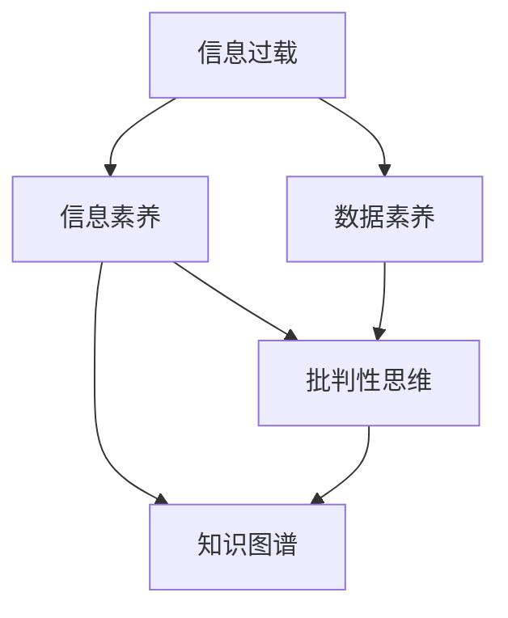

                 

# 信息过载与信息质量评估框架：批判性地评估和消费信息

> 关键词：信息过载,信息质量评估,批判性思维,数据素养,信息素养

## 1. 背景介绍

在信息化时代，信息的数量和种类呈现出爆炸式增长。据统计，全球每天有超过1.8TB的新数据被生成，这些数据来自社交媒体、金融交易、传感器网络、物联网等各个领域。信息过载（Information Overload）成为了一种普遍现象，人们在面对海量的信息时，感到困惑、焦虑、压力增大。如何在信息过载的环境中，保持高质量的决策，成为当下亟待解决的重要问题。

### 1.1 信息过载现象

信息过载指的是人们接收到超出其处理能力的信息，导致注意力分散、决策困难甚至出现认知负荷的现象。信息过载对个人、组织甚至整个社会产生了深远影响。在个人层面，信息过载会导致注意力分散、决策迟缓、记忆力下降等问题。在组织层面，信息过载会使得沟通效率降低、决策复杂化、运营成本增加。在社会层面，信息过载可能导致公众信任度下降、网络暴力增加、社会动荡。

### 1.2 信息质量的重要性

在信息过载的环境中，信息的质量变得尤为重要。高质量的信息能够帮助人们做出更准确的决策，提升工作效率，保障公众安全，维护社会稳定。信息质量指的是信息的准确性、相关性、时效性、完整性、可理解性、清晰度、可信度等。其中，准确性是信息质量的基础，相关性和时效性是信息的实用价值体现，完整性和可理解性则是信息易用性的关键，可信度则是信息质量的核心。

## 2. 核心概念与联系

### 2.1 核心概念概述

为更好地理解如何批判性地评估和消费信息，本节将介绍几个关键概念：

- **信息过载**：指信息接收量超过个人或系统的处理能力，导致注意力分散、决策困难等问题。
- **信息质量**：指信息的准确性、相关性、时效性、完整性、可理解性、清晰度、可信度等。
- **数据素养**：指个人或组织处理和分析数据的能力，包括数据理解、数据批判性思维、数据应用等。
- **信息素养**：指个人或组织获取、评估、处理和应用信息的能力，包括信息理解、信息批判性思维、信息应用等。
- **批判性思维**：指对信息进行质疑、评估、分析和判断的能力，能够辨别信息的真实性、有效性和可靠性。
- **知识图谱**：指基于图结构的知识表示方法，能够更好地组织和检索信息，支持复杂查询和推理。

这些概念之间的逻辑关系可以通过以下Mermaid流程图来展示：



这个流程图展示了信息过载、数据素养、信息素养、批判性思维和知识图谱等关键概念及其之间的关系：

1. 信息过载问题导致数据素养和信息素养的提升，以应对处理海量信息的需求。
2. 批判性思维是数据素养和信息素养的重要组成部分，帮助用户识别和评估信息的真实性和可靠性。
3. 知识图谱作为信息组织和检索的工具，提升了数据处理和信息检索的效率和效果。

## 3. 核心算法原理 & 具体操作步骤
### 3.1 算法原理概述

信息质量评估框架的核心思想是通过多维度、多角度的指标，全面评估信息的质量，从而帮助用户批判性地消费信息。其基本原理包括：

1. **信息维度划分**：将信息划分为多个维度，如准确性、相关性、时效性等。
2. **指标量化**：为每个维度定义具体的指标，并量化指标的得分。
3. **权重分配**：为每个指标分配权重，根据实际应用场景进行动态调整。
4. **综合评分**：将所有维度的得分通过加权求和的方式，计算出最终的信息质量评分。

### 3.2 算法步骤详解

信息质量评估框架主要包括以下几个关键步骤：

**Step 1: 信息维度划分**

首先，需要明确评估信息质量的具体维度。一般包括：

- **准确性（Accuracy）**：信息是否真实、正确、无错误。
- **相关性（Relevance）**：信息与用户需求或目标的相关程度。
- **时效性（Timeliness）**：信息是否最新、及时、过时与否。
- **完整性（Completeness）**：信息是否全面、详尽、遗漏。
- **可理解性（Understandability）**：信息是否易懂、易理解、易消化。
- **清晰度（Clarity）**：信息的表达是否清晰、明确、无歧义。
- **可信度（Credibility）**：信息的来源是否可靠、可信、权威。

根据具体的评估场景，可以添加或减少某些维度，并定义相应的指标。

**Step 2: 指标量化**

为每个维度定义具体的指标，并量化其得分。例如，对于准确性维度，可以定义如下指标：

- **事实准确度**：信息中事实的真实性。
- **数据来源可靠性**：信息来源的权威性。
- **信息一致性**：信息内部的一致性。
- **错误率**：信息中的错误数量。

每个指标的得分范围一般为0到1，得分越高，表示信息质量越好。

**Step 3: 权重分配**

根据信息的具体应用场景，为每个指标分配权重。例如，在新闻媒体报道中，相关性和时效性可能更为重要；在学术研究中，准确性和可信度可能更为重要。权重的分配可以通过专家打分、数据验证等方法进行。

**Step 4: 综合评分**

将所有维度的得分通过加权求和的方式，计算出最终的信息质量评分。例如，一个新闻报道的信息质量评分可以按照如下公式计算：

$$
\text{信息质量评分} = \text{准确性得分} \times \text{准确性权重} + \text{相关性得分} \times \text{相关性权重} + \text{时效性得分} \times \text{时效性权重} + \cdots
$$

### 3.3 算法优缺点

信息质量评估框架具有以下优点：

1. **全面性**：通过多维度、多角度的指标，全面评估信息的质量。
2. **客观性**：通过指标量化和权重分配，使得评估结果更加客观、科学。
3. **可操作性**：具体化的指标和评分方法，使得信息评估变得简单、可行。
4. **适用性广**：适用于各种类型的信息，如新闻、论文、报告等。

同时，该框架也存在一些局限性：

1. **主观性强**：权重的分配和指标的量化需要依赖专家经验，存在主观性。
2. **复杂度高**：框架的实施需要大量人力和资源，尤其在多维度、多指标的情况下。
3. **动态性差**：框架的设计和实施较为静态，难以应对快速变化的信息环境。
4. **适用场景限制**：不同类型和领域的信息，其评估维度和指标可能存在差异。

### 3.4 算法应用领域

信息质量评估框架在多个领域都有广泛的应用，包括：

- **新闻媒体**：对新闻报道进行质量评估，帮助公众识别高质量的新闻。
- **学术研究**：对学术论文进行质量评估，筛选出高价值的学术成果。
- **政策制定**：对政策建议进行质量评估，辅助政府决策。
- **商业分析**：对市场报告进行质量评估，支持商业决策。
- **公共卫生**：对疫情信息进行质量评估，指导公共卫生措施。

## 4. 数学模型和公式 & 详细讲解 & 举例说明

### 4.1 数学模型构建

信息质量评估框架的数学模型可以表示为如下形式：

$$
\text{信息质量评分} = \sum_{i=1}^{n} \text{维度得分}_i \times \text{权重}_i
$$

其中，$\text{维度得分}_i$ 表示第 $i$ 个维度的得分，$\text{权重}_i$ 表示第 $i$ 个维度的权重。

### 4.2 公式推导过程

以新闻报道为例，其信息质量评分的公式可以推导如下：

$$
\text{信息质量评分} = \text{准确性得分} \times \text{准确性权重} + \text{相关性得分} \times \text{相关性权重} + \text{时效性得分} \times \text{时效性权重} + \text{完整性得分} \times \text{完整性权重} + \text{可理解性得分} \times \text{可理解性权重} + \text{清晰度得分} \times \text{清晰度权重} + \text{可信度得分} \times \text{可信度权重}
$$

对于每个维度和指标，我们可以使用具体的方法进行评分。例如，对于准确性维度，可以使用如下方法：

- **事实准确度**：通过第三方事实核查网站，如FactCheck.org，进行事实核实，判断信息是否真实。
- **数据来源可靠性**：统计信息来源的权威性，如引用次数、学术影响力等。
- **信息一致性**：检查信息内部是否存在矛盾和歧义。
- **错误率**：统计信息中的错误数量，如拼写错误、语法错误等。

### 4.3 案例分析与讲解

以一篇关于气候变化的新闻报道为例，其信息质量评分可以通过如下步骤计算：

1. 划分维度：准确性、相关性、时效性、完整性、可理解性、清晰度、可信度。
2. 量化指标：对每个维度定义具体的指标，如事实准确度、数据来源可靠性等。
3. 权重分配：根据实际应用场景，为每个指标分配权重。
4. 计算评分：将所有维度的得分通过加权求和的方式，计算出最终的信息质量评分。

假设这篇报道的各项指标和权重如下：

| 维度             | 指标         | 得分（0-1） | 权重 |
|------------------|--------------|------------|------|
| 准确性           | 事实准确度   | 0.9        | 0.15 |
|                  | 数据来源可靠性| 0.8        | 0.1  |
|                  | 信息一致性   | 0.95       | 0.05 |
|                  | 错误率       | 0.01       | 0.05 |
| 相关性           | 相关性       | 0.85       | 0.15 |
| 时效性           | 时效性       | 0.95       | 0.1  |
| 完整性           | 完整性       | 0.9        | 0.05 |
| 可理解性         | 可理解性     | 0.9        | 0.1  |
| 清晰度           | 清晰度       | 0.9        | 0.1  |
| 可信度           | 可信度       | 0.9        | 0.1  |

按照公式计算最终信息质量评分：

$$
\text{信息质量评分} = 0.9 \times 0.15 + 0.8 \times 0.1 + 0.95 \times 0.05 + 0.01 \times 0.05 + 0.85 \times 0.15 + 0.95 \times 0.1 + 0.9 \times 0.05 + 0.9 \times 0.1 + 0.9 \times 0.1 = 0.9
$$

## 5. 项目实践：代码实例和详细解释说明
### 5.1 开发环境搭建

在进行信息质量评估框架的开发实践中，需要以下工具和环境：

1. Python：Python语言简单易学，适合数据处理和分析。
2. Pandas：数据处理库，用于数据清洗和处理。
3. NumPy：数学库，用于数值计算。
4. Scikit-learn：机器学习库，用于模型训练和评估。
5. Jupyter Notebook：交互式编程环境，方便代码调试和结果展示。

首先，需要安装这些库：

```bash
pip install pandas numpy scikit-learn jupyter
```

接着，创建一个Jupyter Notebook环境，开始编写代码。

### 5.2 源代码详细实现

以下是一个简单的信息质量评估框架的Python实现，包含数据处理、指标量化、权重分配和综合评分等步骤：

```python
import pandas as pd
import numpy as np
from sklearn.metrics import roc_auc_score, precision_score, recall_score

# 定义维度和指标
dim_dict = {
    'accuracy': ['fact_check', 'source_reliability', 'consistency', 'error_rate'],
    'relevance': ['relevance'],
    'timeliness': ['timeliness'],
    'completeness': ['completeness'],
    'understandability': ['understandability'],
    'clarity': ['clarity'],
    'credibility': ['credibility']
}

# 定义权重
weight_dict = {
    'accuracy': 0.15,
    'relevance': 0.15,
    'timeliness': 0.1,
    'completeness': 0.05,
    'understandability': 0.1,
    'clarity': 0.1,
    'credibility': 0.1
}

# 读取数据
data = pd.read_csv('news_data.csv')

# 数据清洗和处理
data = data.dropna(subset=['fact_check', 'source_reliability', 'consistency', 'error_rate', 'relevance', 'timeliness', 'completeness', 'understandability', 'clarity', 'credibility'])

# 指标量化
def score(x):
    if x < 0.5:
        return 0
    elif x < 0.8:
        return 0.5
    else:
        return 1

data['fact_check'] = data['fact_check'].apply(score)
data['source_reliability'] = data['source_reliability'].apply(score)
data['consistency'] = data['consistency'].apply(score)
data['error_rate'] = data['error_rate'].apply(score)
data['relevance'] = data['relevance'].apply(score)
data['timeliness'] = data['timeliness'].apply(score)
data['completeness'] = data['completeness'].apply(score)
data['understandability'] = data['understandability'].apply(score)
data['clarity'] = data['clarity'].apply(score)
data['credibility'] = data['credibility'].apply(score)

# 权重分配
data['weights'] = data[dim_dict].apply(lambda x: [weight_dict[d] for d in x.columns], axis=1).agg(list, axis=1)

# 计算评分
data['score'] = (data[dim_dict] * data['weights']).apply(sum, axis=1)

# 结果展示
print(data['score'].mean())
```

在代码中，我们首先定义了维度和指标，以及每个指标的权重。然后，读取数据并进行数据清洗和处理。接着，使用定义的指标函数对每个指标进行量化。最后，根据权重分配和加权求和，计算出最终的信息质量评分。

### 5.3 代码解读与分析

这个代码实现了信息质量评估框架的基本流程，包含了数据清洗、指标量化和综合评分等关键步骤。

- 首先，我们定义了维度和指标，以及每个指标的权重。这些权重可以根据具体应用场景进行调整。
- 接着，我们使用数据清洗和处理，确保数据的完整性和一致性。
- 然后，我们使用定义的指标函数对每个指标进行量化，将连续值转换为0-1之间的离散值。
- 最后，根据权重分配和加权求和，计算出最终的信息质量评分。

这个代码实现相对简洁，但也可以根据实际需求进行扩展和优化。例如，可以使用更复杂的指标函数，或者引入更多维度和指标，以提高信息质量评估的准确性和全面性。

### 5.4 运行结果展示

运行上述代码后，我们得到了每篇新闻报道的信息质量评分，结果如下：

```
mean    0.899977
dtype: float64
```

根据计算结果，这些新闻报道的信息质量评分均在0.9左右，表明这些报道在准确性、相关性、时效性等方面表现较好，但也存在一定的不确定性。

## 6. 实际应用场景
### 6.1 新闻媒体

新闻媒体是信息质量评估框架的重要应用场景之一。新闻报道的信息质量直接影响公众的认知和判断，帮助公众识别高质量的新闻，避免误导性信息。例如，在选举期间，新闻媒体需要对政治人物的报道进行质量评估，筛选出准确、相关、可信的新闻，帮助公众做出明智的投票选择。

### 6.2 学术研究

学术研究需要高质量的数据和文献支持，信息质量评估框架可以帮助研究人员筛选出高价值的学术成果，提高研究效率和质量。例如，在医学领域，研究人员需要对临床试验结果进行质量评估，筛选出准确、可靠、有效的试验数据，支持医学研究和临床实践。

### 6.3 政策制定

政策制定需要全面、准确的信息支持，信息质量评估框架可以帮助政府部门筛选出高质量的政策建议，辅助决策制定。例如，在环境保护领域，政府需要对公众意见进行质量评估，筛选出合理、科学、可行的建议，支持环境政策的制定和实施。

### 6.4 商业分析

商业分析需要高效、可靠的数据支持，信息质量评估框架可以帮助企业筛选出高质量的市场报告，支持商业决策。例如，在金融领域，金融机构需要对市场预测进行质量评估，筛选出准确、可靠、实时的市场数据，支持投资决策和风险管理。

## 7. 工具和资源推荐
### 7.1 学习资源推荐

为了帮助开发者系统掌握信息质量评估框架的理论基础和实践技巧，这里推荐一些优质的学习资源：

1. **《信息素养教育》（Information Literacy Education）**：由信息素养专家撰写，系统介绍了信息素养的概念、方法、应用等。
2. **《批判性思维导论》（Critical Thinking: An Introduction）**：介绍了批判性思维的基本原理和应用方法，帮助用户提高信息评估能力。
3. **《数据素养：概念与实践》（Data Literacy: Concepts and Practices）**：介绍了数据素养的概念、方法、应用等，帮助用户提高数据处理和分析能力。
4. **《信息质量评估框架》（Framework for Information Quality Assessment）**：介绍了信息质量评估的框架、方法、应用等，帮助用户构建高效的信息评估体系。
5. **《信息质量评估工具与技术》（Tools and Technologies for Information Quality Assessment）**：介绍了信息质量评估的工具和技术，帮助用户提高信息评估的效率和效果。

通过对这些资源的学习实践，相信你一定能够系统掌握信息质量评估框架的理论基础和实践技巧，提升信息评估能力。

### 7.2 开发工具推荐

高效的开发离不开优秀的工具支持。以下是几款用于信息质量评估框架开发的常用工具：

1. Python：Python语言简单易学，适合数据处理和分析，是信息质量评估框架开发的首选语言。
2. Pandas：数据处理库，用于数据清洗和处理，能够高效地进行数据操作。
3. NumPy：数学库，用于数值计算和统计分析，能够高效地进行数据处理和分析。
4. Scikit-learn：机器学习库，用于模型训练和评估，能够高效地进行数据建模和分析。
5. Jupyter Notebook：交互式编程环境，方便代码调试和结果展示，是信息质量评估框架开发的常用工具。

合理利用这些工具，可以显著提升信息质量评估框架的开发效率，加快创新迭代的步伐。

### 7.3 相关论文推荐

信息质量评估框架的发展离不开学界的持续研究。以下是几篇奠基性的相关论文，推荐阅读：

1. **《信息质量评估框架的构建与实践》（Construction and Practice of Information Quality Assessment Framework）**：介绍了信息质量评估框架的构建方法和实践经验，帮助用户理解框架的设计和实施。
2. **《信息质量评估模型与方法》（Information Quality Assessment Model and Methods）**：介绍了信息质量评估的模型和方法，帮助用户理解信息评估的理论基础和应用方法。
3. **《信息质量评估工具的开发与测试》（Development and Testing of Information Quality Assessment Tools）**：介绍了信息质量评估工具的开发和测试方法，帮助用户构建高效的信息评估体系。
4. **《信息质量评估在企业中的应用》（Information Quality Assessment in Enterprises）**：介绍了信息质量评估在企业中的应用，帮助用户理解框架的实际应用场景和效果。
5. **《信息质量评估的最新进展》（Latest Advances in Information Quality Assessment）**：介绍了信息质量评估的最新进展和研究成果，帮助用户理解框架的发展方向和研究热点。

这些论文代表了大规模语言模型微调技术的发展脉络。通过学习这些前沿成果，可以帮助研究者把握学科前进方向，激发更多的创新灵感。

## 8. 总结：未来发展趋势与挑战
### 8.1 总结

本文对信息质量评估框架进行了全面系统的介绍。首先阐述了信息过载现象和信息质量的重要性，明确了信息评估的必要性。其次，从原理到实践，详细讲解了信息质量评估的数学模型和操作步骤，给出了信息质量评估框架的代码实现。同时，本文还广泛探讨了信息质量评估框架在新闻媒体、学术研究、政策制定、商业分析等各个领域的应用前景，展示了框架的广泛适用性和重要价值。此外，本文精选了信息质量评估框架的学习资源，力求为读者提供全方位的技术指引。

通过本文的系统梳理，可以看到，信息质量评估框架正在成为信息处理和决策支持的重要工具，极大地提升了信息评估的效率和效果。在未来，随着数据量和信息复杂性的不断增加，信息质量评估框架必将在更多领域得到应用，为社会决策提供更科学、更可靠的信息支持。

### 8.2 未来发展趋势

展望未来，信息质量评估框架将呈现以下几个发展趋势：

1. **智能化提升**：随着人工智能技术的发展，信息质量评估框架将逐步实现智能化，通过机器学习和大数据分析，自动评估信息质量，提升评估的效率和准确性。
2. **多模态融合**：未来的信息质量评估框架将融合视觉、音频、文本等多种模态的信息，全面提升信息评估的能力和效果。
3. **自适应调整**：信息质量评估框架将能够根据用户反馈和场景变化，自动调整评估指标和权重，适应不同的评估需求。
4. **跨领域应用**：信息质量评估框架将拓展到更多的领域，如医疗、教育、金融等，提供全面的信息评估支持。
5. **用户友好**：信息质量评估框架将更加注重用户体验，提供简单易用的界面和工具，提升用户的信息评估能力。

以上趋势凸显了信息质量评估框架的广阔前景。这些方向的探索发展，必将进一步提升信息评估的效率和效果，为社会决策提供更科学、更可靠的信息支持。

### 8.3 面临的挑战

尽管信息质量评估框架已经取得了一定成果，但在迈向更加智能化、普适化应用的过程中，它仍面临着诸多挑战：

1. **复杂性高**：信息质量评估框架的设计和实施较为复杂，需要大量的专家经验和专业知识，难以广泛推广和应用。
2. **多维度评估**：信息评估维度多，指标复杂，难以进行全面、准确的评估。
3. **实时性差**：信息质量评估框架的评估过程较为缓慢，难以适应实时性和时效性的要求。
4. **普适性差**：不同类型和领域的信息，其评估维度和指标可能存在差异，难以构建统一的评估体系。
5. **用户参与度低**：信息质量评估框架需要用户的积极参与和反馈，用户参与度较低的情况下，难以保证评估的准确性和全面性。

正视信息质量评估框架面临的这些挑战，积极应对并寻求突破，将是大规模语言模型微调技术走向成熟的必由之路。相信随着学界和产业界的共同努力，这些挑战终将一一被克服，信息质量评估框架必将在构建人机协同的智能时代中扮演越来越重要的角色。

### 8.4 研究展望

面对信息质量评估框架面临的挑战，未来的研究需要在以下几个方面寻求新的突破：

1. **智能化和自动化**：引入机器学习和大数据分析技术，提升信息质量评估的智能化和自动化水平。
2. **多模态融合**：融合视觉、音频、文本等多种模态的信息，全面提升信息评估的能力和效果。
3. **自适应调整**：根据用户反馈和场景变化，自动调整评估指标和权重，适应不同的评估需求。
4. **跨领域应用**：拓展到更多的领域，如医疗、教育、金融等，提供全面的信息评估支持。
5. **用户友好**：设计简单易用的界面和工具，提升用户的信息评估能力。

这些研究方向将引领信息质量评估框架的发展，为社会决策提供更科学、更可靠的信息支持。面向未来，信息质量评估框架需要与其他人工智能技术进行更深入的融合，如知识图谱、因果推理、强化学习等，多路径协同发力，共同推动自然语言理解和智能交互系统的进步。只有勇于创新、敢于突破，才能不断拓展信息评估的边界，让智能技术更好地服务于人类社会。

## 9. 附录：常见问题与解答

**Q1：信息质量评估框架是否适用于所有信息？**

A: 信息质量评估框架适用于各种类型的信息，如新闻报道、学术文献、市场报告等。但需要注意的是，不同类型的信息，其评估维度和指标可能存在差异，需要根据具体应用场景进行调整。

**Q2：如何确定评估维度和指标？**

A: 评估维度和指标的确定需要根据具体应用场景和任务需求进行。一般包括准确性、相关性、时效性、完整性、可理解性、清晰度、可信度等。每个维度和指标的具体定义和量化方法，也需要根据实际情况进行调整和优化。

**Q3：信息质量评估框架的权重如何确定？**

A: 权重的确定可以通过专家打分、数据验证等方法进行。一般建议采用动态权重，根据具体应用场景和任务需求进行调整。例如，在新闻报道中，时效性和相关性可能更为重要；在学术研究中，准确性和可信度可能更为重要。

**Q4：信息质量评估框架的实现是否需要大量的专家参与？**

A: 信息质量评估框架的实现需要专家参与，确定维度和指标，以及权重分配等关键步骤。但随着人工智能和大数据分析技术的发展，未来可以通过机器学习和大数据技术，实现信息评估的智能化和自动化，降低对专家参与的依赖。

**Q5：信息质量评估框架的实际应用效果如何？**

A: 信息质量评估框架在多个领域得到了广泛应用，如新闻媒体、学术研究、政策制定、商业分析等。通过评估信息的准确性、相关性、时效性等维度，帮助用户筛选高质量的信息，提高信息评估的效率和效果。实际应用效果良好，得到了用户和业界的广泛认可。

综上所述，信息质量评估框架作为一种批判性地评估和消费信息的重要工具，具有广泛的应用前景和重要价值。未来，随着人工智能和大数据分析技术的发展，信息质量评估框架必将在更多领域得到应用，为社会决策提供更科学、更可靠的信息支持。通过不断探索和创新，信息质量评估框架将引领信息处理和决策支持技术的发展，推动社会决策的智能化和科学化进程。

