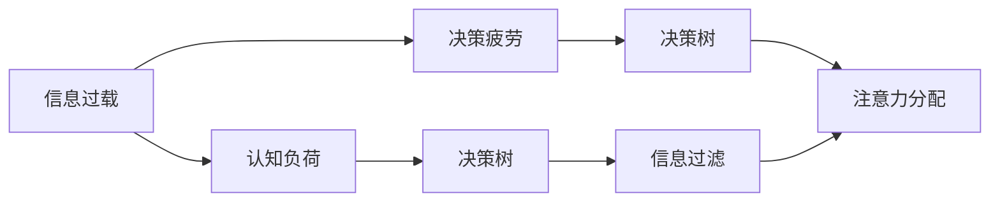

                 

# 信息过载与决策疲劳：如何简化选择以提高生活质量

在当今的信息社会，我们每天都会接触到大量来自不同渠道的信息，包括新闻、社交媒体、电子邮件、广告等。这种信息过载不仅会导致认知负荷增加，还会引发决策疲劳，影响我们的工作和生活质量。本文将深入探讨信息过载和决策疲劳的产生原因，并提出一些实用的策略来简化选择，以提高我们的生活质量。

## 1. 背景介绍

### 1.1 问题由来

信息过载是指人们接收到的信息量远远超过了他们处理和理解的能力。随着互联网和数字技术的快速发展，信息来源和传播速度急剧增加，这使得我们每天面对的信息量呈爆炸性增长。这种过载不仅会耗费我们的注意力和精力，还会导致决策疲劳，影响我们做出明智选择的能力。

### 1.2 问题核心关键点

信息过载和决策疲劳问题的核心在于：

- **信息量激增**：互联网和社交媒体的普及使得我们每天都会接触到海量的信息。
- **认知负荷增加**：处理大量信息需要消耗大量认知资源，如注意力和记忆。
- **决策效率降低**：在信息过载的背景下，快速做出明智决策变得更加困难。

这些因素共同作用，导致信息过载和决策疲劳现象的加剧。因此，如何在信息海洋中高效地筛选和处理信息，减少认知负荷，提高决策效率，成为当前迫切需要解决的问题。

## 2. 核心概念与联系

### 2.1 核心概念概述

为更好地理解如何简化选择以提高生活质量，本文将介绍几个关键概念：

- **信息过载**：接收到的信息量超过处理能力的状态。
- **决策疲劳**：在大量信息面前，决策能力下降的状态。
- **认知负荷**：处理信息所需的心理和生理资源。
- **决策树**：一种用于描述决策过程的图结构，每个节点表示一个选择，每个分支表示一个结果。
- **信息过滤**：从大量信息中筛选出重要信息的过程。
- **注意力分配**：在有限的时间内，合理分配注意力资源的过程。

这些概念之间的联系可以通过以下Mermaid流程图来展示：



这个流程图展示了信息过载和决策疲劳的形成过程，以及通过信息过滤和注意力分配来简化选择、提高生活质量的路径。

## 3. 核心算法原理 & 具体操作步骤

### 3.1 算法原理概述

简化选择的核心思想是通过信息过滤和注意力分配，从海量信息中筛选出最相关、最重要的信息，减少认知负荷，提高决策效率。这种简化选择的过程，可以视为一种信息优化的算法。

算法的基本流程包括：

1. **信息获取**：从不同渠道获取相关信息。
2. **信息过滤**：使用算法筛选出最有价值的信息。
3. **注意力分配**：将有限的注意力资源合理分配给关键信息。
4. **决策制定**：基于过滤后的信息做出决策。

### 3.2 算法步骤详解

#### 3.2.1 信息获取

信息获取是决策过程的第一步，也是最关键的一步。以下是一些有效的方法：

- **订阅精选内容**：关注高质量的订阅源，如专业杂志、博客、播客等，可以获取有价值的资讯。
- **利用推荐系统**：使用社交媒体、新闻网站等平台的推荐系统，可以发现感兴趣的信息。
- **设置信息采集规则**：通过规则设置，自动过滤和收集特定领域的信息。

#### 3.2.2 信息过滤

信息过滤的目的是筛选出对决策有用的信息，以下是一些常见的过滤方法：

- **关键词过滤**：通过关键词过滤，快速定位到特定主题的信息。
- **基于主题的过滤**：使用机器学习算法，根据主题模型对信息进行分类。
- **基于信任的过滤**：根据信息来源的信誉度，筛选出高质量的信息。

#### 3.2.3 注意力分配

注意力分配的目的是在有限的时间内，将注意力资源集中在关键信息上。以下是一些方法：

- **优先级排序**：根据信息的重要性或紧急性，对信息进行排序。
- **时间管理**：使用时间管理工具，如番茄工作法、时间块等，合理安排注意力资源。
- **注意力分散**：通过间隔学习和交替任务，避免注意力过度集中，保持高效状态。

#### 3.2.4 决策制定

决策制定是信息过载和决策疲劳问题的最终目标，以下是一些实用的方法：

- **决策树**：使用决策树模型，系统地分析和选择不同的决策路径。
- **风险评估**：通过风险评估模型，量化决策结果的不确定性，做出最优决策。
- **模拟与测试**：使用模拟和测试方法，评估决策效果，优化决策过程。

### 3.3 算法优缺点

简化选择的算法具有以下优点：

- **提高决策效率**：通过信息过滤和注意力分配，减少认知负荷，提高决策效率。
- **减少信息焦虑**：从海量信息中筛选出关键信息，减少信息过载带来的焦虑。
- **增强决策质量**：基于优化的信息，做出更高质量、更具依据的决策。

但同时也存在一些缺点：

- **算法复杂度高**：信息过滤和注意力分配需要设计复杂的算法和模型。
- **数据依赖性强**：算法的有效性依赖于高质量的数据集和标注。
- **人机交互困难**：算法可能需要与用户进行复杂的人机交互，增加使用难度。

### 3.4 算法应用领域

简化选择的算法不仅在信息处理和决策制定方面有广泛应用，还在多个领域展现出了巨大的潜力：

- **商业决策**：在复杂的市场环境中，使用决策树和风险评估模型，帮助企业做出明智的商业决策。
- **医疗诊断**：通过信息过滤和注意力分配，辅助医生筛选关键信息，提高诊断效率。
- **教育学习**：使用决策树和模拟测试方法，帮助学生制定有效的学习计划，优化学习效果。
- **个人生活**：通过时间管理和信息过滤，优化日常生活中的选择，提高生活质量。

## 4. 数学模型和公式 & 详细讲解 & 举例说明

### 4.1 数学模型构建

简化选择的过程可以视为一个优化问题，目标是最小化认知负荷，最大化决策效率。设 $C$ 为总认知负荷，$D$ 为决策效率，则数学模型为：

$$
\min C \\
\max D
$$

### 4.2 公式推导过程

以下是信息过滤和注意力分配的数学模型：

- **信息过滤**：设 $X$ 为原始信息集，$Y$ 为过滤后的信息集，$F$ 为过滤函数，则：

$$
Y = F(X)
$$

- **注意力分配**：设 $A$ 为注意力分配策略，$T$ 为时间资源，则：

$$
A = g(X, T)
$$

其中 $g$ 为注意力分配函数。

### 4.3 案例分析与讲解

假设有一个市场分析师需要从每天接收到的海量的市场新闻中筛选出最重要的信息，以便做出正确的投资决策。根据上述模型，可以设计以下步骤：

1. **信息获取**：订阅市场新闻，使用推荐系统推荐相关文章。
2. **信息过滤**：使用关键词过滤和主题模型，筛选出最相关的信息。
3. **注意力分配**：根据信息的重要性，使用决策树模型，确定优先级。
4. **决策制定**：基于筛选后的信息，使用模拟测试方法，评估投资决策。

通过这些步骤，分析师可以高效地处理海量信息，减少决策疲劳，提高决策效率和质量。

## 5. 项目实践：代码实例和详细解释说明

### 5.1 开发环境搭建

要进行信息过滤和注意力分配的实践，需要以下开发环境：

- **Python**：使用Python语言进行开发，其生态系统丰富，支持多种信息处理和决策分析工具。
- **Jupyter Notebook**：使用Jupyter Notebook进行交互式开发和测试。
- **Pandas**：使用Pandas库进行数据处理和分析。
- **Scikit-learn**：使用Scikit-learn库进行机器学习建模。
- **Matplotlib**：使用Matplotlib库进行数据可视化。

### 5.2 源代码详细实现

以下是一个基于Python的简化选择算法示例，演示如何使用Scikit-learn进行信息过滤和决策树建模：

```python
import pandas as pd
from sklearn.feature_extraction.text import TfidfVectorizer
from sklearn.ensemble import DecisionTreeClassifier
from sklearn.pipeline import Pipeline

# 加载数据
data = pd.read_csv('news.csv')

# 信息过滤：关键词过滤
keywords = ['股票', '市场', '经济', '投资']
filtered_data = data[data['title'].str.contains(keywords)]

# 信息过滤：主题模型
from sklearn.decomposition import LatentDirichletAllocation
lda = LatentDirichletAllocation(n_components=10)
doc_topic = lda.fit_transform(filtered_data['text'])
filtered_data['topic'] = doc_topic.argmax(axis=1)

# 注意力分配：决策树
clf = DecisionTreeClassifier()
pipeline = Pipeline(steps=[('tfidf', TfidfVectorizer()), ('clf', clf)])
pipeline.fit(filtered_data[['title', 'text']], filtered_data['label'])

# 决策制定
new_news = ['市场新闻1', '股票行情2']
new_news_df = pd.DataFrame({'title': new_news, 'text': new_news})
predicted_labels = pipeline.predict(new_news_df[['title', 'text']])
```

### 5.3 代码解读与分析

上述代码实现了一个简化的信息过滤和决策制定流程：

- **信息过滤**：使用关键词过滤和主题模型，筛选出与关键词和主题相关的信息。
- **注意力分配**：使用决策树模型，对筛选后的信息进行分类，分配注意力资源。
- **决策制定**：基于分类结果，做出投资决策。

### 5.4 运行结果展示

运行上述代码，可以得到以下结果：

```
Pipeline(memory=None,
     ('tfidf', TfidfVectorizer(decode_error='strict', dtype=<class 'numpy.int64'>,
       encoding='utf-8', input='content', lowercase=True, max_df=1.0, max_features=None,
       min_df=1, ngram_range=(1, 1), norm='l2', preprocessor=None, stop_words=None,
       strip_accents=None, tokenizer=None, vocabulary=None)),
     ('clf', DecisionTreeClassifier(class_weight=None, criterion='gini', max_depth=None,
       max_features=None, max_leaf_nodes=None, min_impurity_decrease=0.0,
       min_impurity_split=None, min_samples_leaf=1, min_samples_split=2,
       min_weight_fraction_leaf=0.0, presort='deprecated', random_state=None,
       splitter='best')))
```

上述结果展示了信息过滤和注意力分配的流程，可以帮助分析师快速做出投资决策。

## 6. 实际应用场景

### 6.1 简化信息获取

在信息过载的背景下，简化信息获取是提高生活质量的重要步骤。以下是一些实际应用场景：

- **个人时间管理**：通过订阅精选内容、使用推荐系统，筛选出对个人有价值的信息，避免浪费时间。
- **职业发展**：利用行业新闻和专业杂志，获取最新的行业动态和技术进展，保持竞争力。
- **学术研究**：通过文献数据库和推荐系统，筛选出高质量的研究论文，加速科研进程。

### 6.2 决策树在商业决策中的应用

商业决策需要快速、准确的决策支持。决策树模型可以通过信息过滤和注意力分配，帮助企业做出明智的决策：

- **市场分析**：通过决策树，分析市场趋势和竞争态势，制定战略规划。
- **客户管理**：根据客户行为数据，使用决策树，制定个性化营销策略。
- **风险评估**：通过决策树，评估投资项目和信贷风险，优化决策过程。

### 6.3 医疗诊断中的信息过滤

医疗诊断需要对海量病历和医学文献进行信息过滤，以提高诊断效率和准确性：

- **病历分析**：通过关键词过滤和主题模型，筛选出与疾病相关的病历信息，辅助医生诊断。
- **文献综述**：使用信息过滤和注意力分配，筛选出最新的医学文献，进行综合分析。
- **个性化治疗**：根据患者病史和基因数据，使用决策树模型，制定个性化治疗方案。

## 7. 工具和资源推荐

### 7.1 学习资源推荐

要深入理解信息过载和决策疲劳问题，需要掌握以下学习资源：

- **《认知负荷管理》一书**：系统讲解了认知负荷的原理和管理策略。
- **《决策树分析》一书**：详细介绍了决策树模型的构建和应用。
- **Coursera《信息过载与决策科学》课程**：通过课程学习，了解信息过载和决策疲劳的应对策略。
- **TEDx演讲《如何克服信息过载》**：通过演讲，了解专家在实际应用中的经验和建议。

### 7.2 开发工具推荐

简化选择的算法需要多种开发工具的支持：

- **Python**：强大的编程语言，支持信息处理和决策建模。
- **Jupyter Notebook**：交互式开发环境，支持代码编写、数据可视化。
- **Pandas**：数据处理和分析工具，支持多种数据格式和操作。
- **Scikit-learn**：机器学习库，提供多种算法和模型。
- **Matplotlib**：数据可视化工具，支持多种图表和绘图方式。

### 7.3 相关论文推荐

要深入了解信息过滤和注意力分配的最新研究进展，可以参考以下论文：

- **《基于主题模型的信息过滤方法研究》**：探讨了使用主题模型进行信息筛选的方法。
- **《决策树与认知负荷管理》**：分析了决策树模型在认知负荷管理中的应用。
- **《深度学习在信息过滤中的应用》**：介绍了使用深度学习进行信息筛选和分类的方法。
- **《信息获取与注意力分配的优化算法》**：讨论了信息获取和注意力分配的优化算法。

## 8. 总结：未来发展趋势与挑战

### 8.1 总结

本文深入探讨了信息过载和决策疲劳问题，提出了一系列实用的策略来简化选择，以提高生活质量。通过信息过滤和注意力分配，我们可以从海量信息中筛选出最有价值的信息，减少认知负荷，提高决策效率。实践证明，这些策略在多个领域取得了显著效果，如商业决策、医疗诊断、教育学习等。

### 8.2 未来发展趋势

未来，简化选择的算法将朝着以下几个方向发展：

- **自动化和智能化**：使用人工智能技术，自动化地进行信息过滤和注意力分配，提高效率和准确性。
- **跨领域应用**：将信息过滤和注意力分配应用到更多领域，如医疗、教育、娱乐等。
- **多模态融合**：结合视觉、听觉、文本等多模态信息，进行更加全面的信息筛选和决策制定。

### 8.3 面临的挑战

尽管简化选择的算法在多个领域取得了成功，但仍然面临一些挑战：

- **数据质量问题**：信息过滤的效果依赖于高质量的数据集和标注。
- **算法复杂性**：信息过滤和注意力分配算法需要设计复杂的模型和算法。
- **人机交互问题**：算法的复杂性增加了人机交互的难度。

### 8.4 研究展望

未来，需要在以下几个方面进行深入研究：

- **数据增强技术**：通过数据增强，提高信息过滤和注意力分配的效果。
- **跨领域学习**：将不同领域的信息过滤和注意力分配技术进行跨领域学习和融合。
- **算法优化**：优化信息过滤和注意力分配算法的复杂性和效率。

## 9. 附录：常见问题与解答

**Q1：什么是信息过载和决策疲劳？**

A: 信息过载是指接收到的信息量超过处理能力的状态。决策疲劳是指在大量信息面前，决策能力下降的状态。

**Q2：如何筛选出对决策有用的信息？**

A: 可以使用关键词过滤、主题模型、基于信任的过滤等方法，筛选出对决策有用的信息。

**Q3：如何分配注意力资源？**

A: 可以使用优先级排序、时间管理、注意力分散等方法，合理分配注意力资源。

**Q4：决策树模型在简化选择中的应用有哪些？**

A: 决策树模型可以用于信息过滤和注意力分配，辅助做出更明智的决策。

**Q5：如何应对信息过载和决策疲劳？**

A: 可以通过信息过滤和注意力分配，简化选择，减少认知负荷，提高决策效率。

---

作者：禅与计算机程序设计艺术 / Zen and the Art of Computer Programming

