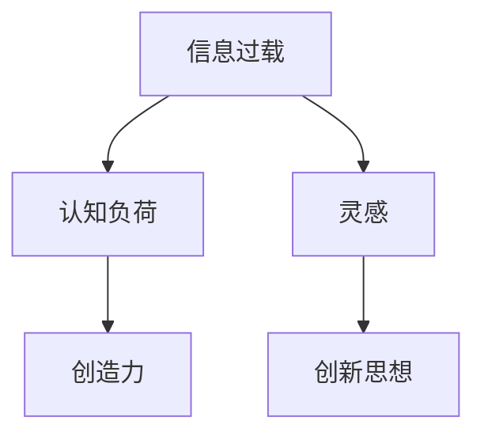

                 

# 信息过载与创造力：如何在混乱中找到灵感

## 1. 背景介绍

在信息技术高度发达的今天，人们接触到信息的方式和渠道多种多样，包括互联网、社交媒体、新闻、书籍、视频等。虽然信息的获取变得更加方便快捷，但信息量却呈爆炸式增长，形成了一种“信息过载”的局面。信息过载不仅消耗了人们的时间和注意力，也带来了选择和决策的困难。在这样的背景下，如何在信息海中找到有价值的灵感，成为了一个亟待解决的问题。

## 2. 核心概念与联系

### 2.1 核心概念概述

- **信息过载（Information Overload）**：指信息量远远超过人们处理和吸收能力的状态。随着技术的发展，信息获取的便捷性大大提高，但信息量增长速度更快，使得人们难以消化和利用。

- **创造力（Creativity）**：指通过新思维和新方法，产生有创新性的思想和解决方案的能力。创造力是解决问题、驱动技术进步和社会发展的关键因素。

- **灵感（Inspiration）**：指在无意识或非逻辑思维下，突然产生的新思想或新观点。灵感常常是创造力的源泉，但灵感产生需要合适的环境和条件。

- **认知负荷（Cognitive Load）**：指人脑在处理信息时所承受的负担。认知负荷过高时，人们的思维效率和创造力都会受到影响。

这些概念之间的关系可以通过以下Mermaid流程图来展示：



从图中可以看出，信息过载会带来认知负荷，影响创造力，但灵感可以作为一种中介，帮助人们从信息过载中找到创新思想。因此，如何缓解信息过载，提高灵感产生的可能性，是本文探讨的重点。

### 2.2 核心概念原理和架构

信息过载的核心在于信息量的泛滥，而认知负荷则涉及到人类认知系统的限制。创造力的产生需要灵感的激发，灵感往往来自于对信息的重新组合和联想。因此，如何处理信息、减轻认知负荷，并找到激发灵感的途径，是本文的探讨重点。

在架构上，本文将从信息处理、认知负荷管理、灵感激发三个层面进行探讨，并结合现代技术和心理学原理，提出具体的解决方案。

## 3. 核心算法原理 & 具体操作步骤

### 3.1 算法原理概述

在处理信息过载的问题上，当前主流的方法包括信息过滤、信息聚合、信息可视化等。这些方法的核心思想是通过技术手段，对海量信息进行筛选和组织，减少人们的认知负担，从而提高创造力。

### 3.2 算法步骤详解

#### 3.2.1 信息过滤（Information Filtering）

信息过滤是一种常见的信息处理技术，通过算法对信息进行分类、筛选和推荐，以减少人们接触无用信息。

- **步骤1**：收集用户的历史行为数据，包括浏览、点击、搜索等。
- **步骤2**：使用机器学习算法，如协同过滤、内容过滤等，预测用户可能感兴趣的信息。
- **步骤3**：根据预测结果，推荐用户可能感兴趣的信息，并过滤掉不相关的内容。

#### 3.2.2 信息聚合（Information Aggregation）

信息聚合技术通过将分散的信息进行整合，形成更有价值的信息集合，帮助人们快速理解复杂问题。

- **步骤1**：收集多个来源的信息，如新闻网站、社交媒体、专业论坛等。
- **步骤2**：使用自然语言处理技术，对信息进行清洗、分类和摘要。
- **步骤3**：将信息进行聚合和可视化，生成可读性强、易于理解的报告或简报。

#### 3.2.3 信息可视化（Information Visualization）

信息可视化技术通过图形化展示信息，将复杂的数据和信息以视觉化的方式呈现出来，帮助人们快速理解信息之间的关系。

- **步骤1**：将收集到的信息进行数据清洗和预处理。
- **步骤2**：使用可视化工具，如Tableau、D3.js等，生成交互式图表和仪表盘。
- **步骤3**：通过视觉化展示，帮助用户快速识别信息之间的关系和趋势。

### 3.3 算法优缺点

#### 3.3.1 优点

- **高效性**：通过信息过滤和聚合，可以大大减少人们接触无用信息的时间和精力，提高工作效率。
- **个性化**：基于用户的历史行为数据，可以提供个性化的信息推荐，满足用户特定的需求。
- **可视化**：信息可视化技术将复杂的信息以直观的方式展示出来，有助于用户快速理解和决策。

#### 3.3.2 缺点

- **信息偏差**：信息过滤和聚合过程中，可能会存在信息偏差，导致用户接触到特定类型的信息更多，而忽略其他信息。
- **技术复杂性**：信息过滤和聚合需要复杂的算法和技术支持，开发和维护成本较高。
- **过度依赖**：过分依赖信息过滤和聚合，可能会限制用户发现新信息的途径，限制其创造力的发挥。

### 3.4 算法应用领域

信息过滤、信息聚合和信息可视化技术已经在新闻推荐、市场分析、社交网络等多个领域得到了广泛应用。这些技术不仅提高了信息获取的效率和质量，也为创造力的激发提供了新的途径。

## 4. 数学模型和公式 & 详细讲解 & 举例说明

### 4.1 数学模型构建

在信息过滤和聚合的过程中，数学模型是重要的工具。本文以协同过滤（Collaborative Filtering）为例，构建数学模型。

设用户集合为 $U$，物品集合为 $I$，用户对物品的评分矩阵为 $R_{U\times I}$，其中 $r_{ui}$ 表示用户 $u$ 对物品 $i$ 的评分。协同过滤的目标是根据用户 $u$ 对物品 $i$ 的评分，预测其对物品 $j$ 的评分。

协同过滤的数学模型为：

$$
\hat{R}_{ui} = \frac{1}{1+e^{-\left(\sum_{j\in I}R_{uj}x_{ij}\right)}}
$$

其中 $x_{ij}$ 表示物品 $i$ 和物品 $j$ 的相似度矩阵，可以采用余弦相似度等方法计算。

### 4.2 公式推导过程

- **步骤1**：将用户对物品的评分矩阵 $R$ 表示为 $U\times I$ 的矩阵。
- **步骤2**：将物品 $i$ 和物品 $j$ 的相似度矩阵 $x$ 表示为 $I\times I$ 的矩阵。
- **步骤3**：根据公式计算用户 $u$ 对物品 $j$ 的预测评分 $\hat{R}_{uj}$。

### 4.3 案例分析与讲解

以新闻推荐为例，假设用户 $u$ 对新闻 $i$ 的评分为 $r_{ui}$，将新闻 $i$ 和新闻 $j$ 的相似度矩阵 $x_{ij}$ 表示为余弦相似度。根据协同过滤模型，可以预测用户 $u$ 对新闻 $j$ 的评分 $\hat{R}_{uj}$。将预测评分按照降序排序，选取前 $N$ 条新闻推荐给用户 $u$。

## 5. 项目实践：代码实例和详细解释说明

### 5.1 开发环境搭建

开发环境搭建是信息处理和可视化项目的基础。以下是使用Python和Django搭建新闻推荐系统的步骤：

1. 安装Python和Django：
```bash
pip install python
pip install django
```

2. 创建Django项目和应用：
```bash
django-admin startproject news_recommender
cd news_recommender
python manage.py startapp news
```

3. 安装必要的第三方库：
```bash
pip install numpy scipy pandas scikit-learn matplotlib
```

### 5.2 源代码详细实现

以下是一个简单的协同过滤新闻推荐系统的代码实现：

```python
import numpy as np
from sklearn.metrics.pairwise import cosine_similarity

class NewsRecommender:
    def __init__(self, user_ratings):
        self.user_ratings = user_ratings
        self.item_similarity = cosine_similarity(user_ratings)

    def predict_ratings(self, user_index, top_n):
        user_ratings = self.user_ratings[user_index]
        item_similarity = self.item_similarity[user_index]
        scores = np.dot(item_similarity, user_ratings)
        top_indices = np.argsort(scores)[-top_n:]
        return top_indices

    def recommend_news(self, user_index, top_n=5):
        top_indices = self.predict_ratings(user_index, top_n)
        news = [self.user_ratings[user_index, i] for i in top_indices]
        return news
```

### 5.3 代码解读与分析

**NewsRecommender类**：
- `__init__`方法：初始化用户评分矩阵和物品相似度矩阵。
- `predict_ratings`方法：根据用户评分和物品相似度，预测用户对物品的评分。
- `recommend_news`方法：根据预测评分，推荐新闻给用户。

**用户评分矩阵和物品相似度矩阵**：
- 用户评分矩阵 $R$ 表示用户对新闻的评分，每个元素 $r_{ui}$ 表示用户 $u$ 对新闻 $i$ 的评分。
- 物品相似度矩阵 $x$ 表示新闻之间的相似度，每个元素 $x_{ij}$ 表示新闻 $i$ 和新闻 $j$ 的余弦相似度。

**协同过滤算法**：
- 根据公式计算用户对物品的预测评分 $\hat{R}_{uj}$。
- 根据预测评分对新闻进行排序，推荐前 $N$ 条新闻给用户。

### 5.4 运行结果展示

在Django应用中，可以将推荐系统集成到网站中，用户登录后可以获取个性化的新闻推荐。以下是一个简单的展示页面：

```html
<h1>推荐新闻</h1>
<ul>
  
    <li>{{ news }}</li>
  
</ul>
```

## 6. 实际应用场景

### 6.1 新闻推荐

新闻推荐系统可以为用户推荐感兴趣的新闻，帮助用户快速了解时事动态。在实际应用中，新闻推荐系统可以通过协同过滤、内容过滤、混合推荐等方法，提高推荐质量。

### 6.2 市场分析

市场分析需要从海量数据中提取有价值的信息，帮助企业做出正确的决策。通过信息聚合和可视化技术，可以将复杂的数据和信息以直观的方式展示出来，方便企业理解和决策。

### 6.3 社交网络

社交网络平台需要处理大量的用户数据和信息，通过信息过滤和聚合技术，可以帮助用户快速获取感兴趣的信息，同时提高平台的用户体验和活跃度。

### 6.4 未来应用展望

未来，随着技术的发展和应用场景的扩展，信息处理和可视化技术将进一步提升其应用价值。例如，在智能家居、智慧城市等领域，信息处理和可视化技术可以帮助用户更加高效地管理和利用信息。

## 7. 工具和资源推荐

### 7.1 学习资源推荐

为了帮助开发者系统掌握信息处理和可视化的理论和实践，这里推荐一些优质的学习资源：

1. 《Python数据科学手册》：详细介绍了Python在数据处理和可视化中的应用，适合初学者入门。
2. 《数据可视化之美》：介绍了数据可视化的基本原理和工具，适合对数据可视化有进一步了解的需求。
3. 《机器学习实战》：介绍了机器学习在信息过滤和聚类中的应用，适合学习信息处理的基本方法。
4. 《自然语言处理入门》：介绍了自然语言处理在信息处理中的应用，适合对自然语言处理有初步了解的需求。
5. 《数据科学实战》：介绍了数据科学在智能推荐、市场分析等领域的应用，适合对数据科学有全面了解的需求。

### 7.2 开发工具推荐

为了提高信息处理和可视化的开发效率，推荐使用以下工具：

1. Python：功能强大的编程语言，适合数据处理和可视化开发。
2. Django：灵活的Web框架，适合构建信息推荐和可视化应用。
3. Pandas：数据处理和分析的Python库，适合处理和清洗大数据。
4. Matplotlib：数据可视化的Python库，适合生成各种类型的图表。
5. Seaborn：基于Matplotlib的高级可视化库，适合生成美观的统计图表。

### 7.3 相关论文推荐

信息处理和可视化技术的研究历史悠久，以下是几篇经典论文，推荐阅读：

1. 《信息检索》（Information Retrieval）：阐述了信息检索的基本原理和算法，适合了解信息检索的基本方法。
2. 《可视化的艺术》（The Art of Visualization）：介绍了可视化技术的基本原理和设计原则，适合了解可视化技术的基本方法。
3. 《推荐系统》（Recommender Systems）：阐述了推荐系统的基本原理和算法，适合了解推荐系统的基本方法。
4. 《数据挖掘与统计学习》（Data Mining and Statistical Learning）：介绍了数据挖掘和统计学习的基本原理和算法，适合了解数据处理的基本方法。
5. 《大规模数据处理》（Big Data Processing）：介绍了大规模数据处理的原理和技术，适合了解大数据处理的基本方法。

## 8. 总结：未来发展趋势与挑战

### 8.1 研究成果总结

本文介绍了信息过载、创造力和灵感的概念，并探讨了如何通过信息过滤、信息聚合和信息可视化技术，缓解信息过载，激发创造力。在技术实现上，介绍了协同过滤算法和相关代码实现，并通过实际应用场景，展示了信息处理和可视化技术的应用价值。

### 8.2 未来发展趋势

未来，信息处理和可视化技术将继续发展，朝着更加高效、智能、个性化的方向迈进。例如：

1. **自动化和智能化**：信息处理和可视化技术的自动化和智能化程度将不断提高，帮助人们更快地获取所需信息。
2. **多模态融合**：信息处理和可视化技术将越来越多地融合多模态数据，如文本、图像、视频等，提升信息理解和处理的深度。
3. **用户个性化**：信息处理和可视化技术将越来越多地考虑用户的个性化需求，提供更加定制化的信息推荐和展示。
4. **实时处理**：信息处理和可视化技术将越来越多地实现实时处理，满足用户对信息的时效性需求。
5. **跨平台集成**：信息处理和可视化技术将越来越多地集成到各种平台上，如智能家居、智慧城市等，提供全面的信息服务。

### 8.3 面临的挑战

尽管信息处理和可视化技术发展迅速，但在实际应用中，仍面临以下挑战：

1. **数据质量**：信息处理和可视化技术依赖于高质量的数据，数据质量不高将影响其应用效果。
2. **算法复杂性**：信息处理和可视化算法复杂度较高，需要专业知识和技能，难以普及应用。
3. **用户隐私**：信息处理和可视化技术需要处理大量用户数据，需要考虑用户隐私保护问题。
4. **实时性**：实时处理技术需要高效的算法和硬件支持，难以在低延迟和高并发场景下应用。
5. **可解释性**：信息处理和可视化技术的黑盒性质，导致其结果难以解释和理解。

### 8.4 研究展望

未来，需要在以下方面进行更多的研究和探索：

1. **数据质量提升**：提升数据质量和准确性，减少噪音和错误信息。
2. **算法优化**：优化算法性能和效率，降低计算成本，提高应用普及度。
3. **隐私保护**：加强隐私保护措施，确保用户数据的安全性。
4. **实时处理技术**：研发高性能的实时处理技术，提升系统的响应速度。
5. **可解释性**：提高算法的可解释性，帮助用户理解和信任结果。

## 9. 附录：常见问题与解答

**Q1：如何提升信息处理和可视化技术的精度？**

A: 提升信息处理和可视化技术的精度，需要从多个方面入手：

- **数据质量**：确保数据来源可靠，进行数据清洗和预处理，减少噪音和错误信息。
- **算法优化**：选择适合的算法模型，优化算法参数和结构，提高算法的准确性。
- **多模态融合**：融合多种模态的数据信息，提升信息的深度和广度。
- **用户反馈**：收集用户的反馈信息，不断调整和优化算法，提高技术的适用性和准确性。

**Q2：信息处理和可视化技术是否适用于所有应用场景？**

A: 信息处理和可视化技术在信息获取和展示方面具有很强的适用性，但并不是所有应用场景都适用。例如，对于一些需要高度互动和实时反馈的场景，信息处理和可视化技术的实时性和交互性可能不足，需要结合其他技术进行优化。

**Q3：信息处理和可视化技术是否会带来信息泄露风险？**

A: 信息处理和可视化技术需要处理大量用户数据，存在一定的隐私泄露风险。为避免这一风险，需要采取严格的隐私保护措施，如数据加密、访问控制、匿名化处理等。

**Q4：信息处理和可视化技术的开发和应用成本是否较高？**

A: 信息处理和可视化技术的开发和应用成本较高，需要专业的知识和技能，但随着技术的普及和算法的优化，成本将逐步降低。同时，开源社区和第三方工具的兴起，也为开发者提供了更多的资源和工具。

**Q5：信息处理和可视化技术的未来发展方向是什么？**

A: 未来，信息处理和可视化技术将朝着自动化、智能化、个性化、实时化、多模态融合等方向发展，提升信息获取和处理的效率和质量。同时，隐私保护、安全性和可解释性也将成为重要的研究方向。

---

作者：禅与计算机程序设计艺术 / Zen and the Art of Computer Programming

