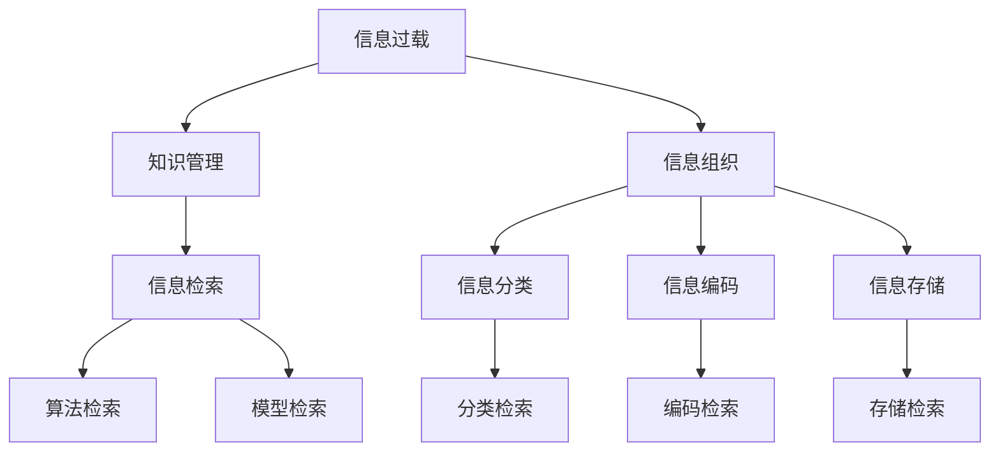

                 

# 信息过载与知识管理策略：有效组织和检索信息的指南

> 关键词：信息过载, 知识管理, 组织和检索, 大数据, 人工智能, 信息检索, 自动化

## 1. 背景介绍

### 1.1 问题由来
在数字化时代，信息爆炸式增长，人们每天都会接触到海量的数据和内容。无论是商务人士、科研人员，还是日常生活中的普通用户，都面临着信息过载的困扰。信息过载（Information Overload），指人们在接受信息时，所接收到信息的数量远远超出了其处理能力，导致认知负荷过重，无法有效利用这些信息，反而造成认知扭曲（Cognitive Distortion）和决策失误。

信息过载不仅浪费时间和精力，还可能误导决策，阻碍创新。知识管理的本质在于利用有效的策略和工具，组织和利用信息，使得信息的价值最大化。面对复杂多变的信息环境，传统的手工方式已无法满足需求，迫切需要自动化、智能化的知识管理工具。

## 2. 核心概念与联系

### 2.1 核心概念概述

- **信息过载（Information Overload）**：指个体在处理和分析信息时，所面对的信息量超过其处理能力，导致认知负荷过重。

- **知识管理（Knowledge Management）**：通过规划和控制知识获取、创造、组织、检索和使用，提高组织和个体获取知识的能力，促进知识共享和创新。

- **信息组织（Information Organization）**：对信息进行分类、编码、存储和检索的过程，使得信息有结构、易于访问。

- **信息检索（Information Retrieval）**：利用算法和模型从大量信息中提取和定位与用户需求相关的信息的过程。

这些概念紧密关联，构成了信息管理的整体框架。

**2.2 Mermaid 流程图**



## 3. 核心算法原理 & 具体操作步骤

### 3.1 算法原理概述

知识管理的目标是通过自动化和智能化手段，对信息进行高效组织和检索。核心算法包括信息分类、编码、存储和检索等多个环节，涉及的原理和算法包括：

- **信息分类**：使用自然语言处理（NLP）技术，对文本信息进行主题分类，帮助组织和归档信息。
- **信息编码**：将文本转换为结构化数据格式，便于存储和检索。
- **信息存储**：采用分布式存储系统（如Hadoop, Spark），确保大规模数据存储和管理。
- **信息检索**：使用信息检索算法和模型，如倒排索引（Inverted Index）、词向量（Word Embedding）、BERT等，快速定位所需信息。

### 3.2 算法步骤详解

**3.2.1 信息分类**

1. **文本预处理**：清洗文本、分词、去除停用词等，将原始文本转换为结构化形式。
2. **特征提取**：使用NLP技术提取文本特征，如TF-IDF、主题模型（Topic Modeling）等，表示文本的主题分布。
3. **分类器训练**：选择合适的分类算法，如朴素贝叶斯、支持向量机（SVM）、神经网络等，对文本进行分类。

**3.2.2 信息编码**

1. **文本向量表示**：将文本转换为向量形式，常见的方法包括TF-IDF、词嵌入（Word Embedding）、BERT等。
2. **向量表示**：将文本转换为结构化数据，如矩阵形式，便于存储和检索。

**3.2.3 信息存储**

1. **数据分区**：将数据分块存储，采用分布式系统（如Hadoop, Spark）进行管理。
2. **数据冗余和备份**：确保数据安全和可靠性，采用冗余和备份策略。

**3.2.4 信息检索**

1. **索引构建**：建立倒排索引，将关键词与文档关联起来。
2. **检索模型训练**：使用机器学习算法训练检索模型，如向量空间模型（VSM）、Latent Semantic Analysis（LSA）等。
3. **相似度计算**：计算查询与文档的相似度，使用余弦相似度、Jaccard相似度等方法。

### 3.3 算法优缺点

**3.3.1 优点**

1. **自动化**：使用自动化工具和算法，减少手工操作，提高效率。
2. **准确性**：使用机器学习算法，提高分类的准确性和检索的精确度。
3. **可扩展性**：分布式存储和检索系统，能够处理大规模数据。
4. **持续性**：通过算法和模型不断优化，保持知识管理的可持续性。

**3.3.2 缺点**

1. **依赖数据质量**：分类和检索的准确性高度依赖数据质量和特征提取。
2. **计算资源消耗**：大规模数据处理和模型训练需要大量计算资源。
3. **复杂性**：系统设计和实施较为复杂，需要专业知识和技术。
4. **隐私和伦理**：数据隐私保护和伦理问题需要特别注意。

### 3.4 算法应用领域

- **企业知识管理**：对企业内部和外部的各类信息进行分类、编码和存储，提升企业决策效率。
- **科研知识管理**：对科研文献进行分类、索引和检索，促进学术交流和创新。
- **商业智能（BI）**：通过数据分析和知识管理，支持商业决策和运营。
- **智能客服**：利用知识管理技术，提升客服系统的响应速度和质量。
- **个性化推荐**：基于用户行为和兴趣信息，提供个性化的内容推荐。

## 4. 数学模型和公式 & 详细讲解 & 举例说明

### 4.1 数学模型构建

信息管理过程中，涉及的数学模型包括文本分类、向量表示和检索模型等。

**4.2 公式推导过程**

1. **文本分类**：使用朴素贝叶斯分类器，对文本进行分类。公式如下：

$$
P(\text{类别}|文本) = \frac{P(\text{类别})P(文本|类别)}{P(文本)}
$$

其中 $P(\text{类别})$ 为先验概率，$P(文本|类别)$ 为条件概率，$P(文本)$ 为文本出现的概率。

2. **向量表示**：使用词嵌入（Word Embedding）方法，将文本转换为向量表示。公式如下：

$$
w_i = \sum_{j=1}^n w_{ij}T_j
$$

其中 $w_i$ 为第 $i$ 个单词的向量表示，$w_{ij}$ 为单词 $j$ 在文本 $i$ 中的权重，$T_j$ 为第 $j$ 个单词的向量表示。

3. **检索模型**：使用向量空间模型（VSM），计算查询与文档的相似度。公式如下：

$$
similarity(q, d) = \frac{q \cdot d}{\|q\|\|d\|}
$$

其中 $q$ 为查询向量，$d$ 为文档向量，$\cdot$ 表示向量点乘，$\|\cdot\|$ 表示向量范数。

### 4.3 案例分析与讲解

假设我们有一家电商公司，需要对客户评论进行分类和检索。

1. **文本预处理**：清洗文本、分词、去除停用词等，将原始评论转换为结构化形式。

2. **特征提取**：使用TF-IDF方法提取评论特征，表示评论的主题分布。

3. **分类器训练**：使用朴素贝叶斯算法，对评论进行分类，如正面评价、负面评价等。

4. **向量表示**：将评论转换为向量形式，使用Word Embedding方法进行表示。

5. **信息存储**：将评论数据存储在分布式系统中，如Hadoop或Spark。

6. **索引构建**：建立倒排索引，将关键词与评论关联起来。

7. **检索模型训练**：使用向量空间模型，训练检索模型，计算查询与评论的相似度。

8. **相似度计算**：计算查询与评论的相似度，使用余弦相似度方法。

通过以上步骤，可以快速对客户评论进行分类和检索，帮助公司提升客户满意度，优化产品和服务。

## 5. 项目实践：代码实例和详细解释说明

### 5.1 开发环境搭建

以下是使用Python和Numpy进行信息分类和检索的开发环境配置：

1. 安装Python：从官网下载并安装Python，配置环境变量。
2. 安装Numpy：使用pip安装Numpy库。
3. 安装Scikit-learn：使用pip安装Scikit-learn库。
4. 安装pandas：使用pip安装pandas库。
5. 安装Matplotlib：使用pip安装Matplotlib库。

### 5.2 源代码详细实现

以下是一个使用朴素贝叶斯算法进行文本分类的Python代码实现：

```python
from sklearn.datasets import fetch_20newsgroups
from sklearn.feature_extraction.text import CountVectorizer
from sklearn.feature_extraction.text import TfidfTransformer
from sklearn.naive_bayes import MultinomialNB
from sklearn.pipeline import make_pipeline

# 加载数据集
newsgroups_data = fetch_20newsgroups(subset='all')

# 定义特征提取器
vectorizer = CountVectorizer(stop_words='english')
transformer = TfidfTransformer()

# 定义分类器
clf = MultinomialNB()

# 定义管道
pipe = make_pipeline(vectorizer, transformer, clf)

# 训练模型
pipe.fit(newsgroups_data.data, newsgroups_data.target)

# 预测
preds = pipe.predict(newsgroups_data.data)

# 评估
accuracy = accuracy_score(newsgroups_data.target, preds)
print("Accuracy:", accuracy)
```

### 5.3 代码解读与分析

**代码解读**：

1. 使用Scikit-learn库，定义文本特征提取器（CountVectorizer）和转换器（TfidfTransformer）。
2. 使用朴素贝叶斯算法（MultinomialNB）进行分类。
3. 定义管道（make_pipeline），将特征提取、转换器和分类器串联起来。
4. 使用fit方法训练模型。
5. 使用predict方法预测新样本的分类结果。
6. 使用accuracy_score方法评估模型准确率。

**分析**：

1. 特征提取器CountVectorizer：将文本转换为词频矩阵，去除停用词。
2. 转换器TfidfTransformer：对词频矩阵进行TF-IDF转换，降低高频词的权重，提升重要词的权重。
3. 分类器MultinomialNB：使用朴素贝叶斯算法进行分类。
4. 管道make_pipeline：将多个组件串联起来，方便模型构建和维护。
5. 评估accuracy_score：使用准确率评估模型性能。

## 6. 实际应用场景

### 6.1 智能客服系统

智能客服系统需要快速处理和回复大量客户咨询。通过知识管理技术，可以高效组织和检索客户常见问题，提升客服响应速度和质量。

**6.1.1 数据收集和预处理**

1. 收集客户历史咨询记录，清洗和预处理数据，去除无关信息。
2. 使用TF-IDF方法提取问题特征，表示问题的主题分布。

**6.1.2 分类和存储**

1. 使用朴素贝叶斯算法对问题进行分类，如常见问题、复杂问题等。
2. 将分类结果和答案存储在分布式系统中，如Hadoop或Spark。

**6.1.3 检索和回复**

1. 使用倒排索引，建立关键词与问题关联。
2. 根据用户输入的问题，计算与问题库的相似度，选取最相关的答案。
3. 使用模板生成系统，自动生成回复内容。

### 6.2 科研知识管理

科研知识管理涉及大量的科研文献和实验数据，需要高效组织和检索。

**6.2.1 数据收集和预处理**

1. 收集科研文献和实验数据，清洗和预处理数据。
2. 使用TF-IDF方法提取文本特征，表示文本的主题分布。

**6.2.2 分类和存储**

1. 使用主题模型（如LDA）对文献进行分类，如基础研究、应用研究等。
2. 将分类结果和文献存储在分布式系统中，如Hadoop或Spark。

**6.2.3 检索和分析**

1. 使用倒排索引，建立关键词与文献关联。
2. 根据用户输入的关键词，计算与文献库的相似度，选取最相关的文献。
3. 使用数据分析工具，如Python的pandas库，进行文献分析，生成统计报告。

## 7. 工具和资源推荐

### 7.1 学习资源推荐

1. 《自然语言处理综论》：该书全面介绍了NLP的基础知识和前沿技术，适合初学者入门。
2. 《Python数据科学手册》：该书介绍了使用Python进行数据分析和处理的方法，包括Scikit-learn库的使用。
3. 《机器学习实战》：该书通过实际项目，讲解了机器学习的基本算法和应用，适合实践学习。
4. 《深度学习》：该书介绍了深度学习的基础知识和前沿技术，适合深入学习。
5. 《自然语言处理》课程：由斯坦福大学开设的NLP明星课程，有Lecture视频和配套作业，适合系统学习。

### 7.2 开发工具推荐

1. PyTorch：基于Python的开源深度学习框架，灵活动态的计算图，适合快速迭代研究。
2. TensorFlow：由Google主导开发的开源深度学习框架，生产部署方便，适合大规模工程应用。
3. Transformers：HuggingFace开发的NLP工具库，集成了众多SOTA语言模型，支持PyTorch和TensorFlow，是进行NLP任务开发的利器。
4. Weights & Biases：模型训练的实验跟踪工具，可以记录和可视化模型训练过程中的各项指标，方便对比和调优。
5. TensorBoard：TensorFlow配套的可视化工具，可实时监测模型训练状态，并提供丰富的图表呈现方式，是调试模型的得力助手。
6. Jupyter Notebook：交互式开发环境，适合快速迭代和调试代码。

### 7.3 相关论文推荐

1. "A Survey of Text Mining Techniques"：该论文全面综述了文本挖掘的各种技术，包括文本分类、信息检索等。
2. "Natural Language Processing with Python"：该论文介绍了使用Python进行NLP任务开发的方法和工具。
3. "Semantic Search Engine"：该论文介绍了搜索引擎中的信息检索技术。
4. "Information Retrieval: An Introduction"：该书籍全面介绍了信息检索的各种技术和方法。

## 8. 总结：未来发展趋势与挑战

### 8.1 研究成果总结

信息过载和知识管理技术已经取得了显著进展，主要体现在以下几个方面：

1. 自动化和智能化：使用机器学习和深度学习技术，实现了信息分类的自动化和检索的智能化。
2. 分布式存储和处理：采用分布式存储和处理系统，支持大规模数据管理和处理。
3. 多模态信息融合：将文本、图像、语音等多模态信息进行融合，提升信息管理和检索的准确性。
4. 上下文感知：利用上下文信息，提升信息检索和生成的精准度。

### 8.2 未来发展趋势

未来信息过载和知识管理技术将呈现以下几个发展趋势：

1. **深度学习和大规模预训练模型**：使用大规模预训练模型，提升信息分类和检索的准确性。
2. **多模态信息管理**：将文本、图像、语音等多模态信息进行融合，提升信息管理和检索的全面性和精准度。
3. **知识图谱和语义网络**：构建知识图谱和语义网络，提供更深入的知识组织和检索方式。
4. **自动化和智能化**：使用自动化和智能化技术，提升信息管理和检索的效率和效果。
5. **上下文感知**：利用上下文信息，提升信息检索和生成的精准度。

### 8.3 面临的挑战

尽管信息过载和知识管理技术已经取得了显著进展，但在迈向更加智能化、普适化应用的过程中，仍面临诸多挑战：

1. **数据质量和标注成本**：高质量标注数据的需求和获取成本，仍是信息管理和检索的瓶颈。
2. **算法复杂性和可解释性**：深度学习和自动化算法的复杂性，使得模型的可解释性降低，难以调试和优化。
3. **隐私和安全**：数据隐私保护和安全性问题，需要特别注意，以避免数据泄露和滥用。
4. **多模态融合**：多模态信息的融合和处理，需要复杂的算法和模型，难以实现。
5. **资源消耗**：大规模数据处理和深度学习模型的计算资源消耗，仍是技术瓶颈。

### 8.4 研究展望

未来信息过载和知识管理技术的研究方向将包括以下几个方面：

1. **无监督和半监督学习**：探索无监督和半监督学习算法，减少对标注数据的依赖。
2. **参数高效和计算高效**：开发参数高效和计算高效的模型和算法，提升信息管理和检索的效率。
3. **上下文感知**：利用上下文信息，提升信息检索和生成的精准度。
4. **多模态融合**：将文本、图像、语音等多模态信息进行融合，提升信息管理和检索的全面性和精准度。
5. **自动化和智能化**：使用自动化和智能化技术，提升信息管理和检索的效率和效果。

总之，信息过载和知识管理技术的发展，将推动NLP技术的不断进步，为人类社会的数字化和智能化进程提供有力支持。相信未来通过技术创新和应用实践，能够构建更加高效、智能、可靠的信息管理系统。

## 9. 附录：常见问题与解答

### Q1: 信息过载和知识管理有什么区别？

A: 信息过载是指个体在处理和分析信息时，所面对的信息量超过其处理能力，导致认知负荷过重。而知识管理是通过规划和控制知识获取、创造、组织、检索和使用，提高组织和个体获取知识的能力，促进知识共享和创新。

### Q2: 信息管理的主要技术手段有哪些？

A: 信息管理的主要技术手段包括：
1. 文本分类：使用自然语言处理（NLP）技术，对文本信息进行分类和归档。
2. 向量表示：将文本转换为向量形式，便于存储和检索。
3. 信息检索：使用算法和模型，从大量信息中提取和定位与用户需求相关的信息。

### Q3: 信息管理的主要应用场景有哪些？

A: 信息管理的主要应用场景包括：
1. 企业知识管理：对企业内部和外部的各类信息进行分类、编码和存储。
2. 科研知识管理：对科研文献进行分类、索引和检索。
3. 商业智能：通过数据分析和知识管理，支持商业决策和运营。
4. 智能客服：利用知识管理技术，提升客服系统的响应速度和质量。
5. 个性化推荐：基于用户行为和兴趣信息，提供个性化的内容推荐。

### Q4: 信息管理的主要工具有哪些？

A: 信息管理的主要工具包括：
1. Python：基于Python的编程语言，适合快速迭代和开发。
2. Scikit-learn：用于文本分类、特征提取和模型训练的库。
3. TensorFlow和PyTorch：用于深度学习模型训练和推理的框架。
4. Weights & Biases和TensorBoard：用于模型训练和实验跟踪的工具。

### Q5: 信息管理的主要研究趋势有哪些？

A: 信息管理的主要研究趋势包括：
1. 深度学习和大规模预训练模型：提升信息分类和检索的准确性。
2. 多模态信息管理：将文本、图像、语音等多模态信息进行融合。
3. 知识图谱和语义网络：提供更深入的知识组织和检索方式。
4. 自动化和智能化：提升信息管理和检索的效率和效果。
5. 上下文感知：利用上下文信息，提升信息检索和生成的精准度。

---

作者：禅与计算机程序设计艺术 / Zen and the Art of Computer Programming

