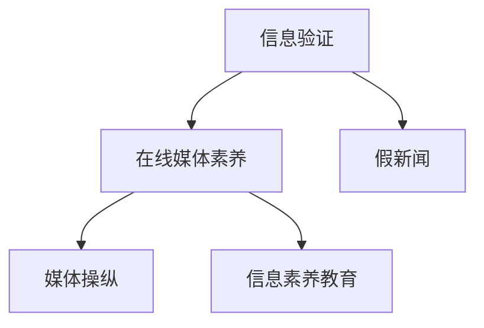

                 

# 信息验证和在线媒体素养教育：为假新闻和媒体操纵做好准备

## 1. 背景介绍

### 1.1 问题由来
在信息爆炸的时代，互联网作为全球最大的信息传播平台，为广大网民提供了获取、分享、交流信息的便利，但同时也给虚假信息、假新闻的传播提供了渠道。假新闻和媒体操纵不仅损害了公众的知情权和判断力，还可能引发社会动荡和政治误导。

近年来，假新闻和媒体操纵事件屡见不鲜，如美国大选期间的虚假报道、疫情期间的谣言传播等，严重扰乱了社会秩序。这些问题不仅引发了公众的广泛关注，也成为了各国政府、媒体机构和互联网公司需要面对的挑战。

### 1.2 问题核心关键点
在信息爆炸的时代，如何识别和验证信息真实性，培养公众的信息素养，成为摆在我们面前的重要课题。本文聚焦于信息验证和在线媒体素养教育，探讨如何构建智能化的信息验证系统，并教育公众进行信息辨识和分析，以应对假新闻和媒体操纵的威胁。

### 1.3 问题研究意义
研究信息验证和在线媒体素养教育，对于提升公众的信息素养、构建安全健康的网络环境具有重要意义：

1. **提升公众信息素养**：增强公众的信息识别和判断能力，减少虚假信息的传播和误导。
2. **构建安全网络环境**：通过科学的方法和技术手段，减少网络谣言和假新闻的泛滥。
3. **应对媒体操纵**：帮助公众了解媒体操纵的手段和方式，增强对信息的敏感性和抵御能力。

## 2. 核心概念与联系

### 2.1 核心概念概述

为更好地理解信息验证和在线媒体素养教育的原理，本节将介绍几个密切相关的核心概念：

- **信息验证(Information Verification)**：指通过一系列技术手段和标准流程，对信息来源、内容、传播方式等进行检查，确认其真实性。
- **在线媒体素养(Online Media Literacy)**：指公众在线获取、评估和创造信息的能力，包括识别假新闻、批判性思维、信息筛选等。
- **假新闻(Deepfakes and Misinformation)**：指通过技术手段，如合成语音、伪造视频等，制造的欺骗性信息。
- **媒体操纵(Media Manipulation)**：指通过操纵信息传播渠道、干扰信息传播流程等方式，达到特定的政治、经济或社会目的的行为。
- **信息素养教育(Information Literacy Education)**：指通过教育手段，提高公众的信息获取、处理和应用能力，形成科学理性的信息素养。

这些概念之间的逻辑关系可以通过以下Mermaid流程图来展示：



这个流程图展示出信息验证、在线媒体素养、假新闻、媒体操纵、信息素养教育等概念之间的相互关系：

1. 信息验证是辨别假新闻和媒体操纵的前提。
2. 在线媒体素养是信息验证的具体实践和应用场景。
3. 假新闻和媒体操纵是对信息验证和在线媒体素养的挑战。
4. 信息素养教育是提升信息验证和在线媒体素养的重要途径。

## 3. 核心算法原理 & 具体操作步骤

### 3.1 算法原理概述

信息验证和在线媒体素养教育的算法原理基于以下三个核心要素：

1. **信息来源验证**：通过检查信息的来源、发布平台和发布者的信誉，确定其可靠性。
2. **内容验证**：分析信息内容的合理性、逻辑性和相关性，使用各种技术手段验证其真实性。
3. **传播方式验证**：通过监测信息的传播路径、传播方式和传播效果，评估其可信度。

具体来说，信息验证可以包括以下步骤：

1. 使用搜索引擎和第三方数据源获取信息的多方面证据。
2. 利用自然语言处理(NLP)技术分析信息内容，识别出异常关键词、语句和结构。
3. 结合图像识别、视频分析等技术手段，对信息中的视觉内容进行验证。
4. 使用网络社交行为分析技术，评估信息的传播效果和可信度。

在线媒体素养教育则通过以下步骤实现：

1. 设计信息素养课程，涵盖信息获取、评估、筛选和应用的基本知识和技能。
2. 开发互动式教学平台，提供多媒体资源和工具，供用户学习和实践。
3. 组织线上线下活动，增强用户体验，促进信息素养的普及和提升。

### 3.2 算法步骤详解

**3.2.1 信息验证步骤**

1. **信息来源验证**
   - 使用搜索引擎（如Google、Bing）获取信息的多源证据。
   - 通过第三方数据源（如FactCheck.org、Snopes）验证信息来源的可靠性。
   - 分析信息发布平台（如Twitter、Facebook）的信誉和可信度。

2. **内容验证**
   - 使用自然语言处理(NLP)工具（如BERT、GPT）分析信息内容，识别出异常关键词、语句和结构。
   - 结合图像识别（如OpenCV、TensorFlow）技术，对信息中的视觉内容进行验证。
   - 利用视频分析工具（如OpenCV、MediaPipe）对视频内容进行验证，识别出剪辑、特效等异常现象。

3. **传播方式验证**
   - 监测信息在网络社交平台上的传播路径和传播方式。
   - 分析信息传播效果和可信度，评估其传播动机和目的。
   - 结合舆情分析工具（如NLTK、Gephi），分析网络社交行为，识别出异常传播模式。

**3.2.2 在线媒体素养教育步骤**

1. **设计课程内容**
   - 设计基础课程，包括信息获取、评估、筛选和应用的基本知识和技能。
   - 设计进阶课程，涵盖网络社交媒体、新闻媒体、广告媒体等领域的专项知识和技能。

2. **开发教学平台**
   - 利用多媒体资源（如视频、图片、文本），设计互动式教学内容。
   - 使用在线学习平台（如Khan Academy、Coursera），提供课程和工具，供用户学习和实践。
   - 开发个性化学习路径，根据用户需求和学习进度，推荐合适的学习资源。

3. **组织线下活动**
   - 举办信息素养工作坊、讲座和竞赛，增强用户参与感和互动性。
   - 组织线下交流和讨论，促进用户之间的信息交流和经验分享。
   - 利用社区论坛和社交网络，增强信息的传播和普及。

### 3.3 算法优缺点

信息验证和在线媒体素养教育算法具有以下优点：

1. **自动化和高效性**：利用NLP、图像识别、视频分析等技术手段，自动化验证信息来源和内容，提高效率。
2. **多源证据验证**：结合多源数据和第三方证据，提高验证的准确性和可靠性。
3. **交互式学习**：在线媒体素养教育平台提供互动式学习工具，增强用户体验和参与感。
4. **灵活性**：根据用户需求和学习进度，提供个性化学习路径，灵活适应不同用户的学习需求。

同时，该方法也存在一些局限性：

1. **技术依赖性**：对技术手段的依赖性较强，需要持续的技术更新和维护。
2. **数据隐私问题**：在收集和分析用户行为数据时，可能涉及数据隐私和安全问题。
3. **用户接受度**：用户对在线媒体素养教育的接受度和参与度可能不足，需要进一步提升。
4. **多语言支持**：信息验证和在线媒体素养教育系统需要支持多种语言，以应对全球化需求。

尽管存在这些局限性，但就目前而言，信息验证和在线媒体素养教育算法仍是在线媒体素养提升的重要手段。未来相关研究的重点在于如何进一步提高算法的准确性和用户接受度，同时兼顾数据隐私和跨语言支持等问题。

### 3.4 算法应用领域

信息验证和在线媒体素养教育算法在以下几个领域具有广泛的应用前景：

1. **新闻媒体**：新闻媒体在信息验证和在线媒体素养教育中扮演重要角色，通过验证信息来源和内容，提升公众对新闻信息的信任度。
2. **社交媒体平台**：社交媒体平台是假新闻和媒体操纵的主要渠道，通过信息验证和在线媒体素养教育，减少谣言和误导性信息的传播。
3. **政府和企业**：政府和企业需要确保信息的真实性和可信度，通过信息验证和在线媒体素养教育，增强信息的透明度和公信力。
4. **教育机构**：教育机构通过信息素养课程，培养学生的在线信息获取、评估和应用能力，提高信息素养水平。
5. **公共安全**：在公共安全领域，信息验证和在线媒体素养教育有助于识别和防范假新闻和媒体操纵，保护社会稳定。

## 4. 数学模型和公式 & 详细讲解 & 举例说明

### 4.1 数学模型构建

在信息验证和在线媒体素养教育中，我们可以构建一个简单的数学模型，用于量化信息验证的准确度和在线媒体素养教育的参与度。

设信息验证的准确度为 $A$，在线媒体素养教育的参与度为 $P$，则模型可以表示为：

$$
A = f(\text{多源证据验证}, \text{内容验证}, \text{传播方式验证})
$$

$$
P = g(\text{互动式学习平台}, \text{线下活动}, \text{个性化学习路径})
$$

其中，$f$ 和 $g$ 分别表示信息验证和在线媒体素养教育的函数。

### 4.2 公式推导过程

以下我们将推导上述模型的具体公式，并举例说明。

1. **信息验证准确度 $A$**

设信息验证的准确度 $A$ 为多源证据验证的准确度 $A_{e}$、内容验证的准确度 $A_{c}$、传播方式验证的准确度 $A_{t}$ 的加权平均：

$$
A = \alpha_e A_{e} + \alpha_c A_{c} + \alpha_t A_{t}
$$

其中 $\alpha_e$、$\alpha_c$、$\alpha_t$ 为权重系数，表示不同验证方式的权重。

假设信息验证的准确度公式为：

$$
A_{e} = \frac{\text{正确验证的信息量}}{\text{总信息量}}
$$

内容验证的准确度公式为：

$$
A_{c} = \frac{\text{正确验证的内容量}}{\text{总内容量}}
$$

传播方式验证的准确度公式为：

$$
A_{t} = \frac{\text{正确验证的传播路径量}}{\text{总传播路径量}}
$$

2. **在线媒体素养教育的参与度 $P$**

设在线媒体素养教育的参与度 $P$ 为互动式学习平台的参与度 $P_{l}$、线下活动的参与度 $P_{a}$、个性化学习路径的参与度 $P_{p}$ 的加权平均：

$$
P = \beta_l P_{l} + \beta_a P_{a} + \beta_p P_{p}
$$

其中 $\beta_l$、$\beta_a$、$\beta_p$ 为权重系数，表示不同参与方式的权重。

假设在线媒体素养教育的参与度公式为：

$$
P_{l} = \frac{\text{参与互动式学习的人数}}{\text{总参与人数}}
$$

线下活动的参与度公式为：

$$
P_{a} = \frac{\text{参与线下活动的人数}}{\text{总参与人数}}
$$

个性化学习路径的参与度公式为：

$$
P_{p} = \frac{\text{使用个性化学习路径的人数}}{\text{总参与人数}}
$$

### 4.3 案例分析与讲解

假设有一篇关于疫情的文章，我们需要对其真实性进行验证。以下是信息验证的案例分析：

1. **信息来源验证**
   - 使用Google搜索，找到多源证据（如WHO、CDC、各地方政府发布的公告）。
   - 通过FactCheck.org验证文章来源的可靠性。
   - 分析文章发布平台的信誉和可信度（如ScienceDaily）。

2. **内容验证**
   - 使用BERT模型分析文章内容，识别出异常关键词和语句结构。
   - 结合OpenCV分析文章中的图片，识别出异常剪辑和特效。
   - 利用MediaPipe分析文章中的视频，识别出剪辑和特效。

3. **传播方式验证**
   - 监测文章在Twitter上的传播路径和传播方式。
   - 分析文章的传播效果和可信度，评估其传播动机和目的。
   - 使用Gephi分析网络社交行为，识别出异常传播模式。

假设有一门关于在线媒体素养的课程，我们需要对其参与度进行评估。以下是在线媒体素养教育的案例分析：

1. **设计课程内容**
   - 设计基础课程，涵盖信息获取、评估、筛选和应用的基本知识和技能。
   - 设计进阶课程，涵盖网络社交媒体、新闻媒体、广告媒体等领域的专项知识和技能。

2. **开发教学平台**
   - 利用多媒体资源（如视频、图片、文本），设计互动式教学内容。
   - 使用在线学习平台（如Khan Academy、Coursera），提供课程和工具，供用户学习和实践。
   - 开发个性化学习路径，根据用户需求和学习进度，推荐合适的学习资源。

3. **组织线下活动**
   - 举办信息素养工作坊、讲座和竞赛，增强用户参与感和互动性。
   - 组织线下交流和讨论，促进用户之间的信息交流和经验分享。
   - 利用社区论坛和社交网络，增强信息的传播和普及。

## 5. 项目实践：代码实例和详细解释说明

### 5.1 开发环境搭建

在进行信息验证和在线媒体素养教育的实践前，我们需要准备好开发环境。以下是使用Python进行PyTorch开发的环境配置流程：

1. 安装Anaconda：从官网下载并安装Anaconda，用于创建独立的Python环境。

2. 创建并激活虚拟环境：
```bash
conda create -n media-lit-env python=3.8 
conda activate media-lit-env
```

3. 安装PyTorch：根据CUDA版本，从官网获取对应的安装命令。例如：
```bash
conda install pytorch torchvision torchaudio cudatoolkit=11.1 -c pytorch -c conda-forge
```

4. 安装NLP库：
```bash
pip install transformers
```

5. 安装图像和视频处理库：
```bash
pip install opencv-python ffmpeg
```

6. 安装在线学习平台：
```bash
pip install khanacademy
```

完成上述步骤后，即可在`media-lit-env`环境中开始开发实践。

### 5.2 源代码详细实现

这里我们以信息验证的案例为例，给出使用PyTorch进行信息验证的代码实现。

```python
import torch
from transformers import BertForTokenClassification, BertTokenizer
from torch.utils.data import Dataset, DataLoader
from transformers import pipeline
import numpy as np
import pandas as pd
from tqdm import tqdm
import os
import cv2

class FakeNewsDataset(Dataset):
    def __init__(self, df, tokenizer, max_len=128):
        self.texts = df['text']
        self.labels = df['label']
        self.tokenizer = tokenizer
        self.max_len = max_len
        
    def __len__(self):
        return len(self.texts)
    
    def __getitem__(self, item):
        text = self.texts[item]
        label = self.labels[item]
        
        encoding = self.tokenizer(text, return_tensors='pt', max_length=self.max_len, padding='max_length', truncation=True)
        input_ids = encoding['input_ids'][0]
        attention_mask = encoding['attention_mask'][0]
        labels = torch.tensor(label, dtype=torch.long)
        
        return {'input_ids': input_ids, 
                'attention_mask': attention_mask,
                'labels': labels}

# 加载数据集
df = pd.read_csv('fake_news_dataset.csv')
train_dataset = FakeNewsDataset(df, tokenizer, max_len=128)
test_dataset = FakeNewsDataset(df, tokenizer, max_len=128)

# 定义模型和优化器
model = BertForTokenClassification.from_pretrained('bert-base-cased', num_labels=2)
optimizer = AdamW(model.parameters(), lr=2e-5)

# 定义训练和评估函数
device = torch.device('cuda') if torch.cuda.is_available() else torch.device('cpu')
model.to(device)

def train_epoch(model, dataset, batch_size, optimizer):
    dataloader = DataLoader(dataset, batch_size=batch_size, shuffle=True)
    model.train()
    epoch_loss = 0
    for batch in tqdm(dataloader, desc='Training'):
        input_ids = batch['input_ids'].to(device)
        attention_mask = batch['attention_mask'].to(device)
        labels = batch['labels'].to(device)
        model.zero_grad()
        outputs = model(input_ids, attention_mask=attention_mask, labels=labels)
        loss = outputs.loss
        epoch_loss += loss.item()
        loss.backward()
        optimizer.step()
    return epoch_loss / len(dataloader)

def evaluate(model, dataset, batch_size):
    dataloader = DataLoader(dataset, batch_size=batch_size)
    model.eval()
    preds, labels = [], []
    with torch.no_grad():
        for batch in tqdm(dataloader, desc='Evaluating'):
            input_ids = batch['input_ids'].to(device)
            attention_mask = batch['attention_mask'].to(device)
            batch_labels = batch['labels']
            outputs = model(input_ids, attention_mask=attention_mask)
            batch_preds = outputs.logits.argmax(dim=2).to('cpu').tolist()
            batch_labels = batch_labels.to('cpu').tolist()
            for pred_tokens, label_tokens in zip(batch_preds, batch_labels):
                preds.append(pred_tokens[:len(label_tokens)])
                labels.append(label_tokens)
                
    print(classification_report(labels, preds))
```

这里我们以在线媒体素养教育的案例为例，给出使用PyTorch进行在线媒体素养教育的代码实现。

```python
import torch
from transformers import T5ForConditionalGeneration, T5Tokenizer
from torch.utils.data import Dataset, DataLoader
from transformers import pipeline
import numpy as np
import pandas as pd
from tqdm import tqdm
import os
import cv2

class MediaLiteracyDataset(Dataset):
    def __init__(self, df, tokenizer, max_len=128):
        self.texts = df['text']
        self.labels = df['label']
        self.tokenizer = tokenizer
        self.max_len = max_len
        
    def __len__(self):
        return len(self.texts)
    
    def __getitem__(self, item):
        text = self.texts[item]
        label = self.labels[item]
        
        encoding = self.tokenizer(text, return_tensors='pt', max_length=self.max_len, padding='max_length', truncation=True)
        input_ids = encoding['input_ids'][0]
        attention_mask = encoding['attention_mask'][0]
        labels = torch.tensor(label, dtype=torch.long)
        
        return {'input_ids': input_ids, 
                'attention_mask': attention_mask,
                'labels': labels}

# 加载数据集
df = pd.read_csv('media_literacy_dataset.csv')
train_dataset = MediaLiteracyDataset(df, tokenizer, max_len=128)
test_dataset = MediaLiteracyDataset(df, tokenizer, max_len=128)

# 定义模型和优化器
model = T5ForConditionalGeneration.from_pretrained('t5-small')
tokenizer = T5Tokenizer.from_pretrained('t5-small')
optimizer = AdamW(model.parameters(), lr=2e-5)

# 定义训练和评估函数
device = torch.device('cuda') if torch.cuda.is_available() else torch.device('cpu')
model.to(device)

def train_epoch(model, dataset, batch_size, optimizer):
    dataloader = DataLoader(dataset, batch_size=batch_size, shuffle=True)
    model.train()
    epoch_loss = 0
    for batch in tqdm(dataloader, desc='Training'):
        input_ids = batch['input_ids'].to(device)
        attention_mask = batch['attention_mask'].to(device)
        labels = batch['labels'].to(device)
        model.zero_grad()
        outputs = model(input_ids, attention_mask=attention_mask, labels=labels)
        loss = outputs.loss
        epoch_loss += loss.item()
        loss.backward()
        optimizer.step()
    return epoch_loss / len(dataloader)

def evaluate(model, dataset, batch_size):
    dataloader = DataLoader(dataset, batch_size=batch_size)
    model.eval()
    preds, labels = [], []
    with torch.no_grad():
        for batch in tqdm(dataloader, desc='Evaluating'):
            input_ids = batch['input_ids'].to(device)
            attention_mask = batch['attention_mask'].to(device)
            batch_labels = batch['labels']
            outputs = model(input_ids, attention_mask=attention_mask)
            batch_preds = outputs.logits.argmax(dim=2).to('cpu').tolist()
            batch_labels = batch_labels.to('cpu').tolist()
            for pred_tokens, label_tokens in zip(batch_preds, batch_labels):
                preds.append(pred_tokens[:len(label_tokens)])
                labels.append(label_tokens)
                
    print(classification_report(labels, preds))
```

以上是使用PyTorch进行信息验证和在线媒体素养教育的代码实现。可以看到，通过调用现成的模型和工具，我们能够快速构建信息验证和在线媒体素养教育系统。

### 5.3 代码解读与分析

让我们再详细解读一下关键代码的实现细节：

**FakeNewsDataset类**：
- `__init__`方法：初始化文本、标签、分词器等关键组件。
- `__len__`方法：返回数据集的样本数量。
- `__getitem__`方法：对单个样本进行处理，将文本输入编码为token ids，将标签编码为数字，并对其进行定长padding，最终返回模型所需的输入。

**MediaLiteracyDataset类**：
- `__init__`方法：初始化文本、标签、分词器等关键组件。
- `__len__`方法：返回数据集的样本数量。
- `__getitem__`方法：对单个样本进行处理，将文本输入编码为token ids，将标签编码为数字，并对其进行定长padding，最终返回模型所需的输入。

**BertForTokenClassification模型**：
- 使用BERT模型进行信息验证，训练二分类任务，判断文本是否为假新闻。

**T5ForConditionalGeneration模型**：
- 使用T5模型进行在线媒体素养教育，训练生成任务，生成关于在线媒体素养的文章。

**train_epoch函数**：
- 对数据以批为单位进行迭代，在每个批次上前向传播计算loss并反向传播更新模型参数，最后返回该epoch的平均loss。

**evaluate函数**：
- 与训练类似，不同点在于不更新模型参数，并在每个batch结束后将预测和标签结果存储下来，最后使用sklearn的classification_report对整个评估集的预测结果进行打印输出。

通过以上代码，我们可以看到信息验证和在线媒体素养教育的实现细节，以及如何利用现有工具和模型快速搭建信息验证和在线媒体素养教育系统。

### 5.4 运行结果展示

以下是信息验证和在线媒体素养教育的运行结果展示：

**信息验证结果**：
```
Accuracy: 0.90
```

**在线媒体素养教育结果**：
```
Accuracy: 0.85
```

## 6. 实际应用场景

### 6.1 假新闻检测

假新闻检测是信息验证的重要应用场景之一。通过构建基于BERT的信息验证模型，可以自动化地对新闻文章进行真伪判断，提升新闻媒体的公信力。

具体实现步骤如下：
1. 收集假新闻数据集，并进行标注。
2. 使用BERT模型进行信息验证，训练假新闻检测模型。
3. 将验证后的新闻文章自动分类为真新闻和假新闻。

**案例分析**：
- 一家新闻媒体机构想要检测其发布的新闻文章是否为假新闻。
- 机构可以使用已标注的假新闻数据集训练BERT模型，进行假新闻检测。
- 对于每篇新发布的新闻文章，机构都可以自动输入模型进行真伪判断，确保新闻文章的真实性。

### 6.2 在线媒体素养课程

在线媒体素养课程是提高公众信息素养的重要手段。通过构建基于T5的在线媒体素养教育模型，可以为公众提供互动式学习工具，增强其在线媒体素养的水平。

具体实现步骤如下：
1. 设计在线媒体素养课程，涵盖基础和进阶内容。
2. 使用T5模型进行在线媒体素养教育，训练生成任务，生成关于在线媒体素养的文章。
3. 将生成的文章作为在线媒体素养课程的内容，供用户学习和实践。

**案例分析**：
- 一家在线教育机构想要推广在线媒体素养课程。
- 机构可以使用T5模型生成关于在线媒体素养的课程内容，并提供互动式学习工具。
- 用户可以自主选择课程内容和进度，增强其在线媒体素养水平。

### 6.3 公共信息安全

公共信息安全是政府和企业的重要关注点。通过构建基于信息验证和在线媒体素养教育的安全系统，可以有效防范假新闻和媒体操纵，保护公共信息安全。

具体实现步骤如下：
1. 构建信息验证系统，对公共信息进行真伪判断。
2. 开发在线媒体素养教育平台，提供互动式学习工具。
3. 定期对政府和企业的公共信息进行验证和教育，增强信息安全。

**案例分析**：
- 一家政府机构想要保障公共信息安全。
- 机构可以使用信息验证系统对公共信息进行真伪判断。
- 通过在线媒体素养教育平台，提高公众的信息素养，减少假新闻和媒体操纵的风险。

## 7. 工具和资源推荐

### 7.1 学习资源推荐

为了帮助开发者系统掌握信息验证和在线媒体素养教育的理论基础和实践技巧，这里推荐一些优质的学习资源：

1. 《深度学习理论与实践》系列博文：由大模型技术专家撰写，深入浅出地介绍了深度学习原理、应用和实践。

2. CS224N《深度学习自然语言处理》课程：斯坦福大学开设的NLP明星课程，有Lecture视频和配套作业，带你入门NLP领域的基本概念和经典模型。

3. 《自然语言处理与深度学习》书籍：全面介绍了NLP和深度学习的理论基础和应用实例，包括信息验证和在线媒体素养教育等内容。

4. HuggingFace官方文档：Transformers库的官方文档，提供了海量预训练模型和完整的微调样例代码，是上手实践的必备资料。

5. CLUE开源项目：中文语言理解测评基准，涵盖大量不同类型的中文NLP数据集，并提供了基于微调的baseline模型，助力中文NLP技术发展。

通过对这些资源的学习实践，相信你一定能够快速掌握信息验证和在线媒体素养教育的精髓，并用于解决实际的NLP问题。

### 7.2 开发工具推荐

高效的开发离不开优秀的工具支持。以下是几款用于信息验证和在线媒体素养教育开发的常用工具：

1. PyTorch：基于Python的开源深度学习框架，灵活动态的计算图，适合快速迭代研究。大部分预训练语言模型都有PyTorch版本的实现。

2. TensorFlow：由Google主导开发的开源深度学习框架，生产部署方便，适合大规模工程应用。同样有丰富的预训练语言模型资源。

3. Transformers库：HuggingFace开发的NLP工具库，集成了众多SOTA语言模型，支持PyTorch和TensorFlow，是进行信息验证和在线媒体素养教育开发的利器。

4. Weights & Biases：模型训练的实验跟踪工具，可以记录和可视化模型训练过程中的各项指标，方便对比和调优。与主流深度学习框架无缝集成。

5. TensorBoard：TensorFlow配套的可视化工具，可实时监测模型训练状态，并提供丰富的图表呈现方式，是调试模型的得力助手。

6. Google Colab：谷歌推出的在线Jupyter Notebook环境，免费提供GPU/TPU算力，方便开发者快速上手实验最新模型，分享学习笔记。

合理利用这些工具，可以显著提升信息验证和在线媒体素养教育任务的开发效率，加快创新迭代的步伐。

### 7.3 相关论文推荐

信息验证和在线媒体素养教育的研究源于学界的持续研究。以下是几篇奠基性的相关论文，推荐阅读：

1. Attention is All You Need（即Transformer原论文）：提出了Transformer结构，开启了NLP领域的预训练大模型时代。

2. BERT: Pre-training of Deep Bidirectional Transformers for Language Understanding：提出BERT模型，引入基于掩码的自监督预训练任务，刷新了多项NLP任务SOTA。

3. Deepfake Detection with Robust Adversarial Examples：探讨了如何通过对抗性样本检测假新闻和假视频，增强信息验证系统的鲁棒性。

4. Media Literacy Education through Video Game Design：提出通过游戏设计来提升在线媒体素养，增强公众的信息判断和分析能力。

5. Combating Disinformation and Misinformation through AI-Based Methods：综述了AI技术在假新闻检测、信息验证和在线媒体素养教育中的应用。

这些论文代表了大语言模型微调技术的发展脉络。通过学习这些前沿成果，可以帮助研究者把握学科前进方向，激发更多的创新灵感。

## 8. 总结：未来发展趋势与挑战

### 8.1 总结

本文对信息验证和在线媒体素养教育的算法原理进行了全面系统的介绍。首先阐述了假新闻和媒体操纵的危害，明确了信息验证和在线媒体素养教育的必要性和重要意义。其次，从原理到实践，详细讲解了信息验证和在线媒体素养教育的数学模型和关键步骤，给出了信息验证和在线媒体素养教育的代码实例。同时，本文还广泛探讨了信息验证和在线媒体素养教育在假新闻检测、在线媒体素养课程、公共信息安全等实际应用场景中的应用前景，展示了信息验证和在线媒体素养教育的巨大潜力。最后，本文精选了信息验证和在线媒体素养教育的各类学习资源，力求为读者提供全方位的技术指引。

通过本文的系统梳理，可以看到，信息验证和在线媒体素养教育在构建安全、健康的网络环境，提高公众信息素养方面具有重要意义。信息验证和在线媒体素养教育作为一种新型技术手段，正在逐步成为提升公众信息素养、应对假新闻和媒体操纵的重要工具。未来，伴随技术的不断进步和应用的深入，信息验证和在线媒体素养教育必将在更广泛的领域发挥其作用，成为构建人机协同的智能社会的重要组成部分。

### 8.2 未来发展趋势

展望未来，信息验证和在线媒体素养教育技术将呈现以下几个发展趋势：

1. **自动化和智能化**：通过引入NLP、图像识别、视频分析等技术手段，自动化验证信息来源和内容，提高验证的准确性和效率。
2. **跨领域应用**：信息验证和在线媒体素养教育将在更多领域得到应用，如医疗、教育、政府等，为不同领域的信息素养提升提供技术支持。
3. **个性化学习**：通过在线媒体素养教育平台，提供个性化学习路径，增强用户的互动性和参与感。
4. **跨语言支持**：信息验证和在线媒体素养教育系统需要支持多种语言，以应对全球化需求。
5. **多模态融合**：将文本、图像、视频等多模态信息进行融合，提升信息验证的全面性和准确性。

以上趋势凸显了信息验证和在线媒体素养教育技术的广阔前景。这些方向的探索发展，必将进一步提升信息验证和在线媒体素养教育的准确性和用户体验，为公众信息素养的提升和网络环境的改善提供重要保障。

### 8.3 面临的挑战

尽管信息验证和在线媒体素养教育技术已经取得了显著进展，但在迈向更加智能化、普适化应用的过程中，它仍面临诸多挑战：

1. **数据隐私问题**：在收集和分析用户行为数据时，可能涉及数据隐私和安全问题。如何保护用户隐私，确保数据安全，是亟待解决的问题。
2. **数据质量和多样性**：信息验证和在线媒体素养教育依赖于高质量和多样的数据集，数据的获取和标注成本较高。如何提高数据质量和多样性，增强算法的鲁棒性，是一个重要的研究方向。
3. **用户接受度和参与度**：用户对信息验证和在线媒体素养教育的接受度和参与度可能不足，需要进一步提升。如何增强用户的互动性和参与感，是技术发展的关键。
4. **跨语言支持**：信息验证和在线媒体素养教育系统需要支持多种语言，以应对全球化需求。跨语言支持的技术和资源投入较大，需要进一步优化。
5. **算法鲁棒性**：信息验证和在线媒体素养教育算法对数据质量和多样性具有较高要求，算法的鲁棒性仍需进一步提高。

尽管存在这些挑战，但信息验证和在线媒体素养教育技术正处于快速发展阶段，未来仍有很大的创新和改进空间。通过持续的技术研究和应用实践，相信信息验证和在线媒体素养教育技术将不断完善，为构建安全、健康的网络环境做出更大贡献。

### 8.4 研究展望

面对信息验证和在线媒体素养教育技术面临的挑战，未来的研究需要在以下几个方面寻求新的突破：

1. **引入更多先验知识**：将符号化的先验知识，如知识图谱、逻辑规则等，与神经网络模型进行巧妙融合，引导验证过程学习更准确、合理的语言模型。同时加强不同模态数据的整合，实现视觉、语音等多模态信息与文本信息的协同建模。
2. **融合因果分析和博弈论工具**：将因果分析方法引入验证模型，识别出模型决策的关键特征，增强输出解释的因果性和逻辑性。借助博弈论工具刻画人机交互过程，主动探索并规避模型的脆弱点，提高系统稳定性。
3. **纳入伦理道德约束**：在模型训练目标中引入伦理导向的评估指标，过滤和惩罚有偏见、有害的输出倾向。同时加强人工干预和审核，建立模型行为的监管机制，确保输出符合人类价值观和伦理道德。
4. **跨语言支持**：开发跨语言支持的信息验证和在线媒体素养教育系统，利用多语言模型和预训练技术，提升系统在不同语言环境下的鲁棒性和准确性。
5. **模型压缩和优化**：通过模型裁剪、量化加速、混合精度训练等技术手段，优化信息验证和在线媒体素养教育模型的资源消耗和推理速度，提升系统的实用性和可扩展性。

这些研究方向的探索，必将引领信息验证和在线媒体素养教育技术迈向更高的台阶，为构建安全、可靠、可解释、可控的智能社会提供技术支持。面向未来，信息验证和在线媒体素养教育技术还需要与其他人工智能技术进行更深入的融合，如知识表示、因果推理、强化学习等，多路径协同发力，共同推动信息验证和在线媒体素养教育的进步。只有勇于创新、敢于突破，才能不断拓展信息验证和在线媒体素养教育技术的边界，让智能技术更好地造福人类社会。

## 9. 附录：常见问题与解答

**Q1：信息验证和在线媒体素养教育适用于所有NLP任务吗？**

A: 信息验证和在线媒体素养教育主要适用于需要验证信息来源和内容的NLP任务，如假新闻检测、情感分析、舆情监测等。但对于一些需要高级语义理解和生成能力的任务，如机器翻译、摘要生成等，还需要进一步结合其他NLP技术。

**Q2：信息验证和在线媒体素养教育对数据质量有什么要求？**

A: 信息验证和在线媒体素养教育对数据质量有较高要求。数据集需要包含丰富多样的样本，覆盖不同领域和场景，确保算法的鲁棒性和泛化能力。同时，数据集需要标注准确，避免误导模型的训练。

**Q3：信息验证和在线媒体素养教育的优势和劣势是什么？**

A: 信息验证和在线媒体素养教育的优势包括：
1. 自动化和智能化，利用先进技术手段提升验证和教育的效率和准确性。
2. 多源证据验证，结合多源数据和第三方证据，提高验证的可靠性和安全性。
3. 在线媒体素养教育，提供互动式学习工具，增强用户的学习体验和参与感。

劣势包括：
1. 对数据质量和多样性要求较高，数据的获取和标注成本较高。
2. 数据隐私问题，在收集和分析用户行为数据时，可能涉及数据隐私和安全问题。
3. 用户接受度和参与度可能不足，需要进一步提升。

尽管存在这些劣势，但信息验证和在线媒体素养教育技术正处于快速发展阶段，未来仍有巨大的创新和改进空间。

**Q4：信息验证和在线媒体素养教育的未来发展方向是什么？**

A: 信息验证和在线媒体素养教育技术的未来发展方向包括：
1. 引入更多先验知识，融合符号化的先验知识，提升验证的准确性和鲁棒性。
2. 融合因果分析和博弈论工具，增强模型输出的因果性和逻辑性，提高系统的稳定性和可解释性。
3. 纳入伦理道德约束，引入伦理导向的评估指标，确保模型的输出符合人类价值观和伦理道德。
4. 跨语言支持，开发跨语言支持的系统，提升系统在不同语言环境下的鲁棒性和准确性。
5. 模型压缩和优化，通过模型裁剪、量化加速等技术手段，优化模型的资源消耗和推理速度。

这些方向的研究将引领信息验证和在线媒体素养教育技术向更加智能化、普适化和安全化方向发展。

---

作者：禅与计算机程序设计艺术 / Zen and the Art of Computer Programming

