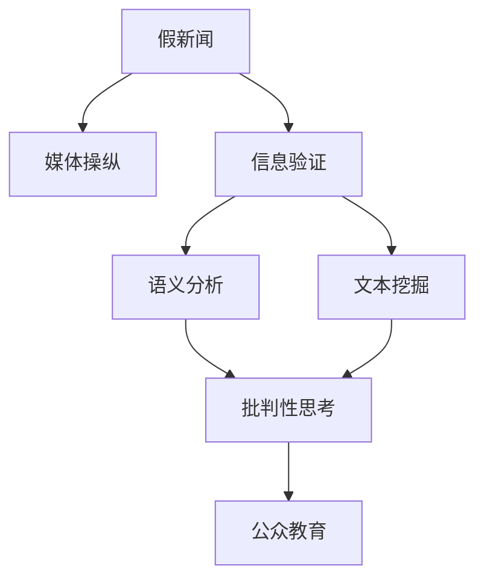

                 

# 信息验证和批判性思考指南与实践：在假新闻和媒体操纵时代导航

## 1. 背景介绍

### 1.1 问题由来
在当今社会，假新闻和媒体操纵已经成为信息传播的主要问题之一。它们不仅混淆了公众的认知，破坏了信息环境，还对社会稳定和国家安全构成了威胁。面对这种现象，我们急需一种能够有效识别和验证信息真伪的技术手段，以及培养公众批判性思考能力的教育方法。基于这一需求，本文将探讨一种结合人工智能和传统信息学方法，用于信息验证和批判性思考的技术框架。

### 1.2 问题核心关键点
信息验证和批判性思考的核心关键点在于：
- 如何通过数据驱动的方法识别信息真伪，特别是在假新闻检测和舆情监测等领域。
- 如何通过算法和教育手段提升公众的信息识别能力和批判性思维。
- 如何结合人工智能和大数据分析技术，构建信息验证平台，提供智能化的信息筛选和甄别服务。

### 1.3 问题研究意义
研究信息验证和批判性思考方法，对于构建健康的信息环境、维护社会稳定和国家安全、以及促进公众理性认知具有重要意义。它不仅可以帮助公众辨别真伪，还能够在假新闻泛滥的时代中，提供一种可靠的信息来源，减少社会恐慌和谣言传播。

## 2. 核心概念与联系

### 2.1 核心概念概述

本节将介绍几个密切相关的核心概念：

- **信息验证（Information Verification）**：指通过算法和技术手段，对网络信息进行筛选、甄别和验证的过程。
- **批判性思考（Critical Thinking）**：指培养公众对信息的质疑、分析和评估能力，提高其辨识真伪和筛选信息的能力。
- **假新闻（Fake News）**：指通过编造、篡改、拼凑等手段，传播的虚假、误导性信息。
- **媒体操纵（Media Manipulation）**：指利用信息传播手段，有意无意地扭曲、误导公众视听的行为。
- **语义分析（Semantic Analysis）**：指通过自然语言处理技术，分析和理解文本的意义。
- **文本挖掘（Text Mining）**：指从大量文本数据中提取有用的信息，如实体识别、情感分析、主题建模等。

这些核心概念之间的逻辑关系可以通过以下Mermaid流程图来展示：



这个流程图展示了核心概念之间的关系：

1. 假新闻通过媒体操纵传播。
2. 信息验证技术对假新闻进行甄别。
3. 语义分析和文本挖掘技术对信息进行更深层次的理解。
4. 批判性思考提升公众的信息识别能力。
5. 公众教育结合技术手段，形成良性互动。

## 3. 核心算法原理 & 具体操作步骤
### 3.1 算法原理概述

信息验证和批判性思考的核心算法原理主要包括以下几个方面：

- **自然语言处理（NLP）**：通过语义分析和文本挖掘技术，对信息进行自动化处理和分析。
- **机器学习（Machine Learning）**：利用有监督或无监督学习算法，构建假新闻检测和信息筛选模型。
- **深度学习（Deep Learning）**：通过神经网络模型，进一步提升假新闻检测和信息验证的精度。
- **数据挖掘（Data Mining）**：从海量数据中挖掘有价值的信息，如舆情分析、情感倾向等。

### 3.2 算法步骤详解

信息验证和批判性思考的算法步骤主要包括以下几个关键步骤：

**Step 1: 数据准备**
- 收集包含假新闻和真实新闻的文本数据集。
- 进行文本预处理，如分词、去除停用词等。

**Step 2: 特征提取**
- 使用NLP技术提取文本的特征，如TF-IDF、词向量、情感分析等。
- 应用深度学习模型，提取高维语义特征，如BERT、GPT等。

**Step 3: 模型训练**
- 选择假新闻检测算法，如基于分类器的算法（SVM、随机森林），或基于神经网络的算法（CNN、RNN、Transformer）。
- 使用有标注的训练数据集，训练假新闻检测模型。
- 优化模型超参数，如学习率、迭代次数等。

**Step 4: 模型评估与优化**
- 使用验证集和测试集评估模型性能。
- 调整模型参数，进行模型优化。

**Step 5: 模型应用**
- 将训练好的模型应用于实时的新闻文本验证。
- 结合公众反馈，不断改进模型。

### 3.3 算法优缺点

信息验证和批判性思考算法具有以下优点：
1. 自动化程度高，能够处理大规模数据。
2. 精确度高，能够在假新闻检测和舆情监测中取得优异效果。
3. 可扩展性强，能够快速适应新数据和新任务。

同时，该算法也存在一定的局限性：
1. 数据依赖性强，需要高质量的标注数据。
2. 算法复杂度高，对计算资源要求较高。
3. 鲁棒性不足，对未见过的信息检测效果有限。
4. 可解释性差，模型决策过程不透明。

尽管存在这些局限性，但就目前而言，信息验证和批判性思考算法仍是大数据时代信息处理的重要手段。未来相关研究的重点在于如何进一步降低算法对标注数据的依赖，提高模型的鲁棒性和可解释性，同时兼顾精度和效率。

### 3.4 算法应用领域

信息验证和批判性思考技术已经在以下领域得到广泛应用：

- **新闻媒体**：构建假新闻检测系统，提升媒体机构的新闻质量。
- **社交平台**：开发社交媒体信息验证工具，减少假新闻的传播。
- **公共服务**：建立政府和企业的信息筛选系统，提高公共服务的准确性。
- **学术研究**：应用于科研论文的文本审查，提升科研成果的真实性。
- **教育培训**：开发批判性思考教育平台，提升公众的信息辨识能力。

此外，信息验证和批判性思考技术还在更多场景中得到应用，如医疗、金融、法律等，为社会各界的信息处理提供可靠保障。

## 4. 数学模型和公式 & 详细讲解  
### 4.1 数学模型构建

本节将使用数学语言对信息验证和批判性思考技术的数学模型进行更加严格的刻画。

记假新闻数据集为 $D=\{(x_i, y_i)\}_{i=1}^N$，其中 $x_i$ 为新闻文本，$y_i \in \{0, 1\}$ 表示该文本是否为假新闻（0为真实，1为假新闻）。设 $M$ 为假新闻检测模型，其预测函数为 $M(x_i)$，输出为0或1。

定义模型的损失函数为：

$$
\mathcal{L}(M) = \frac{1}{N}\sum_{i=1}^N \ell(M(x_i), y_i)
$$

其中 $\ell$ 为交叉熵损失函数，即：

$$
\ell(M(x_i), y_i) = -y_i\log M(x_i) - (1-y_i)\log(1-M(x_i))
$$

模型的目标是最小化损失函数 $\mathcal{L}(M)$，即找到最优的模型参数 $M$。

### 4.2 公式推导过程

以下我们以二分类任务为例，推导假新闻检测模型的损失函数及其梯度的计算公式。

设模型 $M$ 在输入 $x_i$ 上的输出为 $\hat{y}=M(x_i) \in [0,1]$，表示模型认为该文本为假新闻的概率。真实标签 $y \in \{0,1\}$。则二分类交叉熵损失函数定义为：

$$
\ell(M(x_i),y) = -[y\log \hat{y} + (1-y)\log(1-\hat{y})]
$$

将其代入经验风险公式，得：

$$
\mathcal{L}(M) = -\frac{1}{N}\sum_{i=1}^N [y_i\log M(x_i)+(1-y_i)\log(1-M(x_i))]
$$

根据链式法则，损失函数对模型参数 $M$ 的梯度为：

$$
\frac{\partial \mathcal{L}(M)}{\partial M_k} = -\frac{1}{N}\sum_{i=1}^N (\frac{y_i}{M(x_i)}-\frac{1-y_i}{1-M(x_i)}) \frac{\partial M(x_i)}{\partial M_k}
$$

其中 $\frac{\partial M(x_i)}{\partial M_k}$ 可进一步递归展开，利用自动微分技术完成计算。

在得到损失函数的梯度后，即可带入参数更新公式，完成模型的迭代优化。重复上述过程直至收敛，最终得到适应假新闻检测的最优模型参数 $M^*$。

## 5. 项目实践：代码实例和详细解释说明
### 5.1 开发环境搭建

在进行信息验证和批判性思考实践前，我们需要准备好开发环境。以下是使用Python进行PyTorch开发的环境配置流程：

1. 安装Anaconda：从官网下载并安装Anaconda，用于创建独立的Python环境。

2. 创建并激活虚拟环境：
```bash
conda create -n pytorch-env python=3.8 
conda activate pytorch-env
```

3. 安装PyTorch：根据CUDA版本，从官网获取对应的安装命令。例如：
```bash
conda install pytorch torchvision torchaudio cudatoolkit=11.1 -c pytorch -c conda-forge
```

4. 安装Transformers库：
```bash
pip install transformers
```

5. 安装各类工具包：
```bash
pip install numpy pandas scikit-learn matplotlib tqdm jupyter notebook ipython
```

完成上述步骤后，即可在`pytorch-env`环境中开始信息验证和批判性思考实践。

### 5.2 源代码详细实现

下面我们以假新闻检测任务为例，给出使用Transformers库进行信息验证的PyTorch代码实现。

首先，定义假新闻数据集：

```python
from torch.utils.data import Dataset, DataLoader
from transformers import AutoTokenizer, AutoModelForSequenceClassification
import torch
import numpy as np

class NewsDataset(Dataset):
    def __init__(self, texts, labels):
        self.texts = texts
        self.labels = labels
        self.tokenizer = AutoTokenizer.from_pretrained('bert-base-cased')
        self.max_len = 512
        
    def __len__(self):
        return len(self.texts)
    
    def __getitem__(self, item):
        text = self.texts[item]
        label = self.labels[item]
        
        encoding = self.tokenizer(text, return_tensors='pt', max_length=self.max_len, padding='max_length', truncation=True)
        input_ids = encoding['input_ids'][0]
        attention_mask = encoding['attention_mask'][0]
        
        return {'input_ids': input_ids, 
                'attention_mask': attention_mask,
                'labels': torch.tensor(label, dtype=torch.long)}
```

然后，定义模型和优化器：

```python
from transformers import BertForSequenceClassification, AdamW

model = BertForSequenceClassification.from_pretrained('bert-base-cased', num_labels=2)

optimizer = AdamW(model.parameters(), lr=2e-5)
```

接着，定义训练和评估函数：

```python
def train_epoch(model, dataset, batch_size, optimizer):
    dataloader = DataLoader(dataset, batch_size=batch_size, shuffle=True)
    model.train()
    epoch_loss = 0
    for batch in dataloader:
        input_ids = batch['input_ids'].to(device)
        attention_mask = batch['attention_mask'].to(device)
        labels = batch['labels'].to(device)
        model.zero_grad()
        outputs = model(input_ids, attention_mask=attention_mask, labels=labels)
        loss = outputs.loss
        epoch_loss += loss.item()
        loss.backward()
        optimizer.step()
    return epoch_loss / len(dataloader)

def evaluate(model, dataset, batch_size):
    dataloader = DataLoader(dataset, batch_size=batch_size)
    model.eval()
    preds, labels = [], []
    with torch.no_grad():
        for batch in dataloader:
            input_ids = batch['input_ids'].to(device)
            attention_mask = batch['attention_mask'].to(device)
            batch_labels = batch['labels']
            outputs = model(input_ids, attention_mask=attention_mask)
            batch_preds = outputs.logits.argmax(dim=1).to('cpu').tolist()
            batch_labels = batch_labels.to('cpu').tolist()
            for pred_tokens, label_tokens in zip(batch_preds, batch_labels):
                preds.append(pred_tokens)
                labels.append(label_tokens)
                
    print(f"Accuracy: {np.mean(np.array(preds) == np.array(labels)):.2f}")
```

最后，启动训练流程并在测试集上评估：

```python
epochs = 5
batch_size = 16

device = torch.device('cuda') if torch.cuda.is_available() else torch.device('cpu')
model.to(device)

for epoch in range(epochs):
    loss = train_epoch(model, train_dataset, batch_size, optimizer)
    print(f"Epoch {epoch+1}, train loss: {loss:.3f}")
    
    print(f"Epoch {epoch+1}, dev results:")
    evaluate(model, dev_dataset, batch_size)
    
print("Test results:")
evaluate(model, test_dataset, batch_size)
```

以上就是使用PyTorch对BERT进行假新闻检测的完整代码实现。可以看到，得益于Transformers库的强大封装，我们可以用相对简洁的代码完成BERT模型的加载和验证。

### 5.3 代码解读与分析

让我们再详细解读一下关键代码的实现细节：

**NewsDataset类**：
- `__init__`方法：初始化新闻文本、标签、分词器等关键组件。
- `__len__`方法：返回数据集的样本数量。
- `__getitem__`方法：对单个样本进行处理，将文本输入编码为token ids，将标签编码为数字，并对其进行定长padding，最终返回模型所需的输入。

**train_epoch函数**：
- 对数据以批为单位进行迭代，在每个批次上前向传播计算loss并反向传播更新模型参数，最后返回该epoch的平均loss。

**evaluate函数**：
- 与训练类似，不同点在于不更新模型参数，并在每个batch结束后将预测和标签结果存储下来，最后使用精确率指标对整个评估集的预测结果进行打印输出。

**训练流程**：
- 定义总的epoch数和batch size，开始循环迭代
- 每个epoch内，先在训练集上训练，输出平均loss
- 在验证集上评估，输出精确率
- 所有epoch结束后，在测试集上评估，给出最终测试结果

可以看到，PyTorch配合Transformers库使得BERT验证的代码实现变得简洁高效。开发者可以将更多精力放在数据处理、模型改进等高层逻辑上，而不必过多关注底层的实现细节。

当然，工业级的系统实现还需考虑更多因素，如模型的保存和部署、超参数的自动搜索、更灵活的任务适配层等。但核心的验证范式基本与此类似。

## 6. 实际应用场景
### 6.1 社交媒体平台

社交媒体平台是假新闻传播的重要渠道。通过信息验证技术，可以构建假新闻检测系统，识别和屏蔽恶意信息，减少误导性内容的传播。

具体而言，社交平台可以引入信息验证模块，实时对用户上传的内容进行审核。对于疑似的假新闻，系统可以自动标记，并通过人工审核后删除或限制传播。同时，平台可以基于用户行为数据，对潜在的假新闻制造者进行标记和屏蔽，减少假新闻的产生。

### 6.2 政府和公共服务

政府和公共服务机构需要处理大量的信息，识别和验证信息真伪是保证服务质量的关键。基于信息验证技术，可以构建智能信息筛选系统，自动过滤掉假新闻和误导性信息，提升服务效率和准确性。

例如，在突发公共事件中，信息验证系统可以及时识别和排除谣言和假新闻，确保公众获取准确、及时的信息，避免社会恐慌和误解。

### 6.3 学术和科研机构

学术和科研机构需要对科研成果进行严谨审核，避免假数据和伪结果的传播。基于信息验证技术，可以构建学术论文的文本审查系统，自动检测论文中的假新闻和数据造假行为。

系统可以结合专家知识和规则，识别出具有高度可疑性的论文，并提醒相关专家进行人工审查。这样既能提高审查效率，又能保证科研成果的真实性和可信度。

### 6.4 教育培训

信息验证技术在教育培训中也有广泛应用。通过构建批判性思考教育平台，可以帮助学生提高信息辨识能力，培养批判性思维。

平台可以提供大量假新闻和真实新闻，让学生进行分类和验证。系统可以自动分析学生的回答，提供反馈和建议，帮助学生学习如何识别和评估信息。同时，平台还可以结合情景模拟，让学生在虚拟环境中进行信息验证和决策，提升其综合能力。

## 7. 工具和资源推荐
### 7.1 学习资源推荐

为了帮助开发者系统掌握信息验证和批判性思考的理论基础和实践技巧，这里推荐一些优质的学习资源：

1. 《深度学习与NLP》系列博文：由大模型技术专家撰写，深入浅出地介绍了深度学习在NLP中的应用，包括信息验证和批判性思考。

2. Coursera《自然语言处理》课程：斯坦福大学开设的NLP明星课程，涵盖NLP的基础概念和高级技术，包括假新闻检测等。

3. 《自然语言处理综述》书籍：综述性书籍，介绍了NLP领域的核心技术和最新进展，包括信息验证和批判性思考。

4. HuggingFace官方文档：Transformers库的官方文档，提供了海量预训练模型和完整的验证样例代码，是上手实践的必备资料。

5. FactCheck.org：世界著名的假新闻检测平台，提供大量真实的假新闻案例，帮助用户了解和学习信息验证技术。

通过对这些资源的学习实践，相信你一定能够快速掌握信息验证和批判性思考的精髓，并用于解决实际的信息问题。

### 7.2 开发工具推荐

高效的开发离不开优秀的工具支持。以下是几款用于信息验证和批判性思考开发的常用工具：

1. PyTorch：基于Python的开源深度学习框架，灵活动态的计算图，适合快速迭代研究。大部分预训练语言模型都有PyTorch版本的实现。

2. TensorFlow：由Google主导开发的开源深度学习框架，生产部署方便，适合大规模工程应用。同样有丰富的预训练语言模型资源。

3. Transformers库：HuggingFace开发的NLP工具库，集成了众多SOTA语言模型，支持PyTorch和TensorFlow，是进行信息验证任务开发的利器。

4. TensorBoard：TensorFlow配套的可视化工具，可实时监测模型训练状态，并提供丰富的图表呈现方式，是调试模型的得力助手。

5. Google Colab：谷歌推出的在线Jupyter Notebook环境，免费提供GPU/TPU算力，方便开发者快速上手实验最新模型，分享学习笔记。

合理利用这些工具，可以显著提升信息验证和批判性思考任务的开发效率，加快创新迭代的步伐。

### 7.3 相关论文推荐

信息验证和批判性思考技术的发展源于学界的持续研究。以下是几篇奠基性的相关论文，推荐阅读：

1. SnLI：Stanford Natural Language Inference Dataset：首个大规模NLI数据集，为假新闻检测提供了大量训练样本。

2. FactGuard：Counterfact检测系统：通过深度学习模型，检测新闻文章中的假新闻行为，取得了显著的效果。

3. MemeVerse：假新闻检测与生成系统：通过生成对抗网络，构建假新闻生成模型，辅助训练假新闻检测模型。

4. Truth Evaluator：信息验证模型：使用BERT和DeBERTa模型，对新闻文章进行真实性评估。

5. Liescape：假新闻检测系统：通过集成多模型，构建高效、鲁棒的信息验证系统。

这些论文代表了大规模信息验证和批判性思考技术的发展脉络。通过学习这些前沿成果，可以帮助研究者把握学科前进方向，激发更多的创新灵感。

## 8. 总结：未来发展趋势与挑战

### 8.1 总结

本文对信息验证和批判性思考方法进行了全面系统的介绍。首先阐述了信息验证和批判性思考的研究背景和意义，明确了其在假新闻检测、舆情监测、公共服务、教育培训等领域的独特价值。其次，从原理到实践，详细讲解了信息验证和批判性思考的数学原理和关键步骤，给出了信息验证任务开发的完整代码实例。同时，本文还广泛探讨了信息验证方法在多个行业领域的应用前景，展示了其广泛的应用潜力。

通过本文的系统梳理，可以看到，信息验证和批判性思考技术正在成为信息时代的重要手段，极大地提升了信息处理的准确性和效率，为公众提供了可靠的信息来源。未来，伴随信息验证和批判性思考技术的不断演进，我们将在更加复杂、多样、智能的信息环境中，构建健康、透明、可信的信息环境。

### 8.2 未来发展趋势

展望未来，信息验证和批判性思考技术将呈现以下几个发展趋势：

1. 自动化程度更高。随着人工智能技术的不断进步，信息验证和批判性思考将更加自动化，能够处理更复杂、更大规模的数据。

2. 精度和鲁棒性提升。深度学习和多模型融合将进一步提升信息验证的精度和鲁棒性，减少假新闻的误判率。

3. 跨领域应用拓展。信息验证和批判性思考将结合其他领域的知识，如知识图谱、逻辑推理等，提升模型的综合能力和泛化能力。

4. 公众教育普及。通过智能化教育平台，将批判性思考的知识普及到更多用户，提升全社会的理性认知能力。

5. 技术透明化。模型和算法的透明性将进一步提高，用户能够理解和信任信息验证的过程和结果。

6. 算法公平性保障。算法设计和训练过程中，将更加重视公平性和无偏见，避免对特定群体的歧视和误判。

这些趋势凸显了信息验证和批判性思考技术的广阔前景。这些方向的探索发展，必将进一步提升信息验证和批判性思考的准确性和实用性，为构建健康、透明、可信的信息环境提供坚实的基础。

### 8.3 面临的挑战

尽管信息验证和批判性思考技术已经取得了显著进展，但在迈向更加智能化、普适化应用的过程中，它仍面临诸多挑战：

1. 数据质量问题。假新闻检测需要大量高质量的标注数据，而实际数据往往存在噪声和偏见，如何提高数据质量是一大难题。

2. 算法复杂度问题。深度学习和多模型融合需要高强度的计算资源，如何降低算法复杂度，提高计算效率，是一大挑战。

3. 鲁棒性和泛化性问题。当前模型对未见过的信息检测效果有限，如何在多领域、多模态数据上取得泛化能力，是一大挑战。

4. 透明性和可解释性问题。模型决策过程不透明，用户难以理解和信任，如何提高算法的透明性和可解释性，是一大挑战。

5. 安全性问题。信息验证和批判性思考涉及大量的数据和模型，如何确保数据和模型的安全，避免泄露和滥用，是一大挑战。

6. 公平性和无偏见问题。模型训练和应用过程中，如何避免对特定群体或观点的歧视，是一大挑战。

这些挑战表明，信息验证和批判性思考技术仍需持续改进和发展。只有在数据、算法、工程、伦理等多个维度协同发力，才能真正实现信息验证和批判性思考的广泛应用。

### 8.4 研究展望

面对信息验证和批判性思考技术面临的种种挑战，未来的研究需要在以下几个方面寻求新的突破：

1. 探索数据增强和合成数据生成技术，提高数据质量。

2. 开发更加高效、轻量级的信息验证算法，降低计算资源需求。

3. 结合多领域、多模态数据，提升模型的泛化能力。

4. 引入因果推理和公平性约束，提高模型的透明性和公平性。

5. 探索可解释性强的模型架构和训练方法，提升算法的透明性和可信度。

6. 加强数据安全和隐私保护，确保信息验证和批判性思考的可靠性和安全性。

这些研究方向的探索，必将引领信息验证和批判性思考技术迈向更高的台阶，为构建健康、透明、可信的信息环境提供坚实的基础。面向未来，信息验证和批判性思考技术还需要与其他人工智能技术进行更深入的融合，如知识表示、因果推理、强化学习等，多路径协同发力，共同推动信息验证和批判性思考的进步。只有勇于创新、敢于突破，才能不断拓展信息验证和批判性思考技术的边界，让智能技术更好地服务于社会。

## 9. 附录：常见问题与解答

**Q1：信息验证技术是否适用于所有信息类型？**

A: 信息验证技术主要适用于文本和图像等可自动化的信息类型。对于语音、视频等非结构化数据，目前还处于初步探索阶段，需要结合其他技术手段进行辅助验证。

**Q2：如何提高假新闻检测的精度？**

A: 提高假新闻检测的精度需要综合考虑数据、模型、算法等多个因素：
1. 收集高质量的标注数据，减少数据噪声和偏见。
2. 选择适合的任务模型，如BERT、GPT等。
3. 应用先进的深度学习技术，如多模型融合、对抗训练等。
4. 优化模型参数，进行超参数调优。
5. 结合上下文信息，提高模型的语义理解能力。

**Q3：批判性思考教育如何提升公众的理性认知能力？**

A: 批判性思考教育需要结合实际案例，培养公众的质疑、分析和评估能力。通过设计互动式学习模块，模拟信息验证场景，让学生在实践中掌握信息辨识技巧。同时，引入专家知识库，提供实证数据和逻辑推理，帮助学生深入理解信息来源和验证过程。

**Q4：如何确保信息验证和批判性思考的安全性？**

A: 信息验证和批判性思考的安全性需要从多个维度进行保障：
1. 加强数据加密和访问控制，保护数据隐私。
2. 引入模型解释性和透明度，增强用户信任。
3. 应用安全审计和漏洞扫描，及时发现和修复安全漏洞。
4. 建立多级备份和灾难恢复机制，确保系统稳定运行。

这些措施可以有效提升信息验证和批判性思考的安全性，确保其在实际应用中的可靠性和有效性。

**Q5：信息验证和批判性思考技术在教育培训中的应用前景如何？**

A: 信息验证和批判性思考技术在教育培训中具有广阔的应用前景：
1. 培养学生的批判性思维，提升其理性认知能力。
2. 提供实证数据和逻辑推理，帮助学生深入理解信息来源和验证过程。
3. 结合专家知识库，提供个性化推荐和建议，提高教学效果。
4. 通过情景模拟和互动学习，提升学生的综合能力和实践技能。

通过教育培训，信息验证和批判性思考技术可以广泛普及，提升公众的信息辨识能力，构建健康、透明、可信的信息环境。

---

作者：禅与计算机程序设计艺术 / Zen and the Art of Computer Programming

