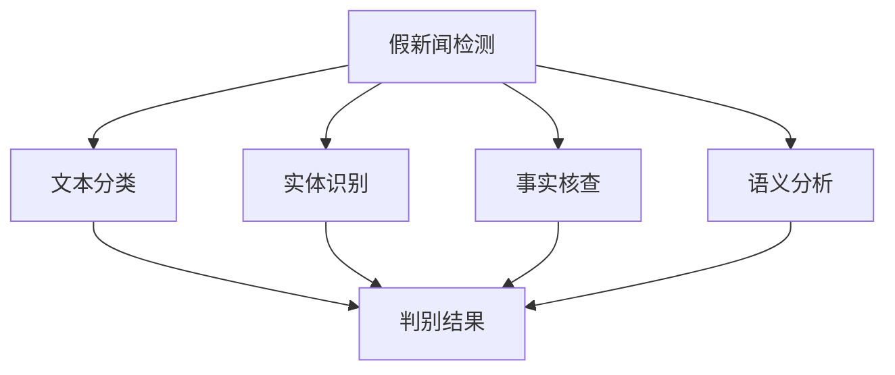

                 

# 假新闻检测：NLP与社会责任

在信息爆炸的时代，假新闻（fake news）已经成为一个不容忽视的社会问题。它们通过恶意夸大、歪曲或杜撰信息，误导公众，破坏社会信任，甚至对国家安全、政治稳定造成影响。面对这一挑战，自然语言处理（NLP）技术，特别是深度学习技术，提供了强大的工具。本文将深入探讨假新闻检测的NLP方法，以及其在社会责任中的关键作用。

## 1. 背景介绍

### 1.1 假新闻的现状与危害

假新闻通常指那些未经核实、故意编造或有意误导的信息。随着社交媒体的普及，假新闻的传播速度和影响力大大增强。例如，2016年美国总统选举期间，假新闻被大量传播，对选举结果产生了显著影响。此外，假新闻还可能对公共卫生、经济甚至国家安全构成威胁。例如，一些针对疫苗的假新闻甚至可能导致疫苗接种率下降，进而引发公共卫生危机。

### 1.2 NLP在假新闻检测中的作用

NLP技术通过分析语言文本，可以自动识别和验证信息的真实性。其中，深度学习模型，尤其是基于Transformer的模型，如BERT、GPT-3等，在文本理解、语义分析等方面表现出色。利用这些模型，可以构建假新闻检测系统，自动筛选和标记假新闻，提升公众对信息的辨识能力。

## 2. 核心概念与联系

### 2.1 核心概念概述

为理解假新闻检测的NLP方法，首先介绍一些核心概念：

- **假新闻检测**：使用NLP技术识别和验证新闻文本的真实性，判断其是否属于假新闻。
- **文本分类**：将新闻文本分类为假新闻或真实新闻。
- **实体识别**：识别文本中的人名、地名、组织名等实体，用于验证信息是否准确。
- **事实核查**：通过互联网搜索、数据库查询等方式，验证文本中提及的事件、人物、时间等信息是否真实。
- **语义分析**：分析文本的语义，判断是否存在逻辑矛盾、夸张、歪曲等现象。

这些概念之间的关系可以通过以下Mermaid流程图来展示：



这个流程图展示了假新闻检测的基本流程，从文本分类、实体识别、事实核查到语义分析，每一步都在增加信息可信度的判断维度。

### 2.2 核心概念联系

假新闻检测的核心在于构建一个多层级的验证机制，通过综合分析文本的各个方面，判断其真实性。以下将详细探讨每个核心概念及其在大语言模型微调中的应用。

## 3. 核心算法原理 & 具体操作步骤

### 3.1 算法原理概述

假新闻检测的算法原理可以总结为以下几个步骤：

1. **文本分类**：使用大语言模型对新闻文本进行分类，将其标记为假新闻或真实新闻。
2. **实体识别**：利用NLP技术识别文本中的实体，如人名、地名、组织名等，并通过外部知识库进行验证。
3. **事实核查**：通过搜索引擎、数据库等方式，验证文本中提及的事件、人物、时间等信息是否真实。
4. **语义分析**：分析文本的语义，判断是否存在逻辑矛盾、夸张、歪曲等现象。

### 3.2 算法步骤详解

以下是假新闻检测的详细操作步骤：

**Step 1: 数据准备**

- 收集大量标注数据集，包括真实新闻和假新闻。可以从新闻网站、社交媒体、用户反馈等多个渠道获取。
- 预处理数据，去除噪声、缺失值，标准化文本格式。

**Step 2: 选择模型和任务**

- 选择合适的预训练语言模型，如BERT、GPT-3等。
- 定义文本分类、实体识别、事实核查等任务，设置相应的损失函数和评估指标。

**Step 3: 模型微调**

- 将预训练模型作为初始化参数，使用标注数据集对其进行微调。
- 使用梯度下降等优化算法更新模型参数，最小化损失函数。
- 设置适当的学习率和训练轮数，避免过拟合。

**Step 4: 部署和应用**

- 将微调后的模型部署到生产环境中，实时处理用户提交的新闻文本。
- 利用文本分类、实体识别、事实核查等技术，综合判断新闻的真实性。
- 输出假新闻标识，或进一步进行人工审核。

### 3.3 算法优缺点

假新闻检测的算法具有以下优点：

- **自动化程度高**：利用深度学习模型，可以自动化地处理大量文本，提升效率。
- **泛化能力强**：通过大语言模型的预训练，可以在不同领域和语言环境下保持良好表现。
- **可扩展性强**：可以灵活添加新的任务，如语义分析、情感分析等，提升检测效果。

同时，算法也存在一些局限性：

- **数据依赖**：检测效果依赖于标注数据的质量和数量，标注数据不足可能导致性能下降。
- **模型复杂**：深度学习模型复杂，训练和推理成本高。
- **解释性不足**：模型决策过程缺乏可解释性，难以理解其推理逻辑。
- **对抗攻击**：模型可能受到对抗样本的攻击，影响检测效果。

### 3.4 算法应用领域

假新闻检测的算法在多个领域有广泛应用，例如：

- **新闻网站**：用于自动筛选和标记假新闻，提升新闻质量。
- **社交媒体**：检测和删除假新闻，保护用户免受误导。
- **政治广告**：识别和过滤虚假广告，维护政治宣传的真实性。
- **公共健康**：检测和纠正关于疫苗、疫情等信息的假新闻，保护公众健康。
- **金融市场**：识别虚假金融资讯，防范金融风险。

## 4. 数学模型和公式 & 详细讲解 & 举例说明

### 4.1 数学模型构建

假新闻检测的数学模型可以概括为以下两个步骤：

1. **文本分类模型**：使用深度学习模型对新闻文本进行分类，定义二分类任务，损失函数为交叉熵损失。
2. **综合验证模型**：结合文本分类、实体识别、事实核查等多个任务的结果，综合判断新闻的真实性。

### 4.2 公式推导过程

**文本分类模型**

文本分类模型的损失函数为交叉熵损失，公式如下：

$$
\mathcal{L}(y, \hat{y}) = -\sum_{i=1}^N y_i\log \hat{y}_i
$$

其中 $y$ 为真实标签，$\hat{y}$ 为模型预测结果。

**综合验证模型**

综合验证模型的输出为新闻的真实性评分，一般使用sigmoid函数将模型预测结果映射到[0,1]区间，表示新闻为假新闻的概率。公式如下：

$$
p = \sigma(\mathbf{W} [\text{BERT}(x) + \text{fact\_check}(x) + \text{entity\_check}(x)])
$$

其中 $\mathbf{W}$ 为权重向量，BERT(x)、fact\_check(x)、entity\_check(x)分别为文本分类、事实核查、实体识别等任务的结果。

### 4.3 案例分析与讲解

以下以一个具体案例来说明假新闻检测的数学模型和公式的应用：

假设我们有一个假新闻检测系统，使用了BERT作为文本分类模型，并加入了实体识别和事实核查两个任务。

- **文本分类**：使用BERT对新闻文本进行分类，输出一个[0,1]区间的概率值，表示新闻为假新闻的可能性。
- **实体识别**：识别新闻中的人名、地名、组织名等实体，并通过外部知识库进行验证，输出一个[0,1]区间的概率值，表示实体信息是否真实。
- **事实核查**：通过搜索引擎、数据库等方式，验证新闻中提及的事件、人物、时间等信息是否真实，输出一个[0,1]区间的概率值。

综合这三个任务的结果，使用公式计算新闻的真实性评分：

$$
p = \sigma(\mathbf{W} [\text{BERT}(x) + \text{fact\_check}(x) + \text{entity\_check}(x)])
$$

其中 $\mathbf{W}$ 为权重向量，可以使用数据集中的标注数据进行训练和优化。

## 5. 项目实践：代码实例和详细解释说明

### 5.1 开发环境搭建

在进行假新闻检测实践前，我们需要准备好开发环境。以下是使用Python进行PyTorch开发的环境配置流程：

1. 安装Anaconda：从官网下载并安装Anaconda，用于创建独立的Python环境。

2. 创建并激活虚拟环境：
```bash
conda create -n pytorch-env python=3.8 
conda activate pytorch-env
```

3. 安装PyTorch：根据CUDA版本，从官网获取对应的安装命令。例如：
```bash
conda install pytorch torchvision torchaudio cudatoolkit=11.1 -c pytorch -c conda-forge
```

4. 安装Transformers库：
```bash
pip install transformers
```

5. 安装各类工具包：
```bash
pip install numpy pandas scikit-learn matplotlib tqdm jupyter notebook ipython
```

完成上述步骤后，即可在`pytorch-env`环境中开始假新闻检测的开发。

### 5.2 源代码详细实现

这里我们以一个简单的二分类任务为例，给出使用Transformers库对BERT模型进行假新闻检测的PyTorch代码实现。

```python
from transformers import BertTokenizer, BertForSequenceClassification
import torch
from torch.utils.data import DataLoader
from sklearn.metrics import accuracy_score

tokenizer = BertTokenizer.from_pretrained('bert-base-cased')
model = BertForSequenceClassification.from_pretrained('bert-base-cased', num_labels=2)

device = torch.device('cuda') if torch.cuda.is_available() else torch.device('cpu')
model.to(device)

# 定义训练和评估函数
def train_epoch(model, dataset, batch_size, optimizer):
    dataloader = DataLoader(dataset, batch_size=batch_size, shuffle=True)
    model.train()
    epoch_loss = 0
    for batch in dataloader:
        input_ids = batch['input_ids'].to(device)
        attention_mask = batch['attention_mask'].to(device)
        labels = batch['labels'].to(device)
        model.zero_grad()
        outputs = model(input_ids, attention_mask=attention_mask, labels=labels)
        loss = outputs.loss
        epoch_loss += loss.item()
        loss.backward()
        optimizer.step()
    return epoch_loss / len(dataloader)

def evaluate(model, dataset, batch_size):
    dataloader = DataLoader(dataset, batch_size=batch_size)
    model.eval()
    preds, labels = [], []
    with torch.no_grad():
        for batch in dataloader:
            input_ids = batch['input_ids'].to(device)
            attention_mask = batch['attention_mask'].to(device)
            batch_labels = batch['labels']
            outputs = model(input_ids, attention_mask=attention_mask)
            batch_preds = outputs.logits.argmax(dim=2).to('cpu').tolist()
            batch_labels = batch_labels.to('cpu').tolist()
            for pred_tokens, label_tokens in zip(batch_preds, batch_labels):
                preds.append(pred_tokens[:len(label_tokens)])
                labels.append(label_tokens)
                
    print("Accuracy: ", accuracy_score(labels, preds))
```

### 5.3 代码解读与分析

让我们再详细解读一下关键代码的实现细节：

**文本分类器**

```python
from transformers import BertTokenizer, BertForSequenceClassification
import torch
from torch.utils.data import DataLoader
from sklearn.metrics import accuracy_score

tokenizer = BertTokenizer.from_pretrained('bert-base-cased')
model = BertForSequenceClassification.from_pretrained('bert-base-cased', num_labels=2)
```

- `BertTokenizer`：用于分词，将文本转换为模型所需的token ids。
- `BertForSequenceClassification`：用于构建文本分类器，输出二分类结果。

**训练和评估函数**

```python
device = torch.device('cuda') if torch.cuda.is_available() else torch.device('cpu')
model.to(device)

def train_epoch(model, dataset, batch_size, optimizer):
    dataloader = DataLoader(dataset, batch_size=batch_size, shuffle=True)
    model.train()
    epoch_loss = 0
    for batch in dataloader:
        input_ids = batch['input_ids'].to(device)
        attention_mask = batch['attention_mask'].to(device)
        labels = batch['labels'].to(device)
        model.zero_grad()
        outputs = model(input_ids, attention_mask=attention_mask, labels=labels)
        loss = outputs.loss
        epoch_loss += loss.item()
        loss.backward()
        optimizer.step()
    return epoch_loss / len(dataloader)

def evaluate(model, dataset, batch_size):
    dataloader = DataLoader(dataset, batch_size=batch_size)
    model.eval()
    preds, labels = [], []
    with torch.no_grad():
        for batch in dataloader:
            input_ids = batch['input_ids'].to(device)
            attention_mask = batch['attention_mask'].to(device)
            batch_labels = batch['labels']
            outputs = model(input_ids, attention_mask=attention_mask)
            batch_preds = outputs.logits.argmax(dim=2).to('cpu').tolist()
            batch_labels = batch_labels.to('cpu').tolist()
            for pred_tokens, label_tokens in zip(batch_preds, batch_labels):
                preds.append(pred_tokens[:len(label_tokens)])
                labels.append(label_tokens)
                
    print("Accuracy: ", accuracy_score(labels, preds))
```

- `device`：指定训练和推理时的硬件设备。
- `model.to(device)`：将模型迁移到指定设备。
- `train_epoch`：在训练集上迭代训练，更新模型参数，返回平均损失。
- `evaluate`：在测试集上评估模型，计算准确率。

### 5.4 运行结果展示

在运行上述代码后，可以在训练集和测试集上分别输出平均损失和准确率，评估模型的训练效果。

## 6. 实际应用场景

### 6.1 新闻网站

新闻网站可以使用假新闻检测系统，自动筛查和标记用户提交的新闻，减少假新闻的传播。例如，BuzzFeed的新闻编辑团队在2016年大选期间，使用假新闻检测工具自动审核新闻，显著提高了编辑效率和新闻质量。

### 6.2 社交媒体平台

社交媒体平台也可以利用假新闻检测系统，检测和删除平台上的假新闻，保护用户免受误导。例如，Facebook在2016年大选期间，使用假新闻检测工具，删除大量虚假内容，改善了用户浏览体验。

### 6.3 政治广告

政治广告中，假新闻和虚假信息时有发生，误导选民。通过假新闻检测系统，可以快速识别和过滤虚假广告，维护政治宣传的真实性。例如，一些竞选团队使用假新闻检测系统，筛选出真实广告，提高了广告效果。

### 6.4 公共健康

公共健康领域，假新闻可能对疫苗接种、疫情传播等产生误导。通过假新闻检测系统，可以识别和纠正虚假信息，保护公众健康。例如，WHO在疫情期间，使用假新闻检测工具，消除疫苗谣言，提高了疫苗接种率。

## 7. 工具和资源推荐

### 7.1 学习资源推荐

为了帮助开发者系统掌握假新闻检测的NLP技术，这里推荐一些优质的学习资源：

1. 《NLP with PyTorch》系列博文：由大模型技术专家撰写，深入浅出地介绍了NLP技术，包括文本分类、实体识别等任务。

2. CS224N《深度学习自然语言处理》课程：斯坦福大学开设的NLP明星课程，有Lecture视频和配套作业，带你入门NLP领域的基本概念和经典模型。

3. 《Natural Language Processing with Transformers》书籍：Transformers库的作者所著，全面介绍了如何使用Transformers库进行NLP任务开发，包括假新闻检测在内的诸多范式。

4. CLUE开源项目：中文语言理解测评基准，涵盖大量不同类型的中文NLP数据集，并提供了基于假新闻检测的baseline模型，助力中文NLP技术发展。

5. Snopes和FactCheck.org：权威的新闻事实核查网站，提供大量假新闻案例，用于训练和评估假新闻检测系统。

通过对这些资源的学习实践，相信你一定能够快速掌握假新闻检测的精髓，并用于解决实际的NLP问题。

### 7.2 开发工具推荐

高效的开发离不开优秀的工具支持。以下是几款用于假新闻检测开发的常用工具：

1. PyTorch：基于Python的开源深度学习框架，灵活动态的计算图，适合快速迭代研究。大部分NLP任务都有PyTorch版本的实现。

2. TensorFlow：由Google主导开发的开源深度学习框架，生产部署方便，适合大规模工程应用。同样有丰富的NLP资源。

3. Transformers库：HuggingFace开发的NLP工具库，集成了众多SOTA语言模型，支持PyTorch和TensorFlow，是进行假新闻检测任务的开发的利器。

4. Weights & Biases：模型训练的实验跟踪工具，可以记录和可视化模型训练过程中的各项指标，方便对比和调优。与主流深度学习框架无缝集成。

5. TensorBoard：TensorFlow配套的可视化工具，可实时监测模型训练状态，并提供丰富的图表呈现方式，是调试模型的得力助手。

6. Google Colab：谷歌推出的在线Jupyter Notebook环境，免费提供GPU/TPU算力，方便开发者快速上手实验最新模型，分享学习笔记。

合理利用这些工具，可以显著提升假新闻检测任务的开发效率，加快创新迭代的步伐。

### 7.3 相关论文推荐

假新闻检测的发展离不开学界的持续研究。以下是几篇奠基性的相关论文，推荐阅读：

1. Fact-Checking via Statistical Language Models：提出了基于统计语言模型的假新闻检测方法，利用上下文信息进行语义分析。

2. A Neural Approach to Fact-Checking：提出了一种基于深度神经网络的假新闻检测方法，通过文本分类和语义分析，识别虚假信息。

3. TextRank: Bringing Order into Texts：提出了一种基于图排序的假新闻检测方法，利用句子的相似性进行排名，去除无关信息。

4. Snopes.com and FactCheck.org: The World's Longest Running Online Fact-Checking System：介绍了权威的新闻事实核查网站Snopes.com和FactCheck.org，用于训练和评估假新闻检测系统。

5. Snopes.com and FactCheck.org: The World's Longest Running Online Fact-Checking System：介绍了权威的新闻事实核查网站Snopes.com和FactCheck.org，用于训练和评估假新闻检测系统。

这些论文代表了大新闻检测技术的发展脉络。通过学习这些前沿成果，可以帮助研究者把握学科前进方向，激发更多的创新灵感。

## 8. 总结：未来发展趋势与挑战

### 8.1 总结

本文对假新闻检测的NLP方法进行了全面系统的介绍。首先阐述了假新闻检测的研究背景和意义，明确了NLP技术在信息甄别和知识传递中的关键作用。其次，从原理到实践，详细讲解了假新闻检测的数学模型和操作步骤，给出了完整的代码实例。同时，本文还探讨了假新闻检测在新闻网站、社交媒体、政治广告、公共健康等多个领域的应用前景，展示了NLP技术在信息时代的重要价值。

通过本文的系统梳理，可以看到，假新闻检测的NLP方法已经成为打击假新闻的重要手段，极大地提升了信息鉴别的准确性和时效性，维护了公众的知情权和信任感。未来，伴随NLP技术的不断进步，假新闻检测将迎来更多的应用场景和更高的社会影响力。

### 8.2 未来发展趋势

展望未来，假新闻检测的NLP方法将呈现以下几个发展趋势：

1. **多模态融合**：假新闻检测不仅依赖文本信息，还结合图像、音频等多模态数据，提升检测效果。例如，利用图片识别技术，识别新闻中的人脸、场景等元素，判断其真实性。

2. **深度生成模型**：利用深度生成模型，如GAN、VAE等，生成假新闻样本，用于训练和测试假新闻检测系统。通过对抗样本的生成和检测，提升模型的鲁棒性。

3. **跨领域迁移学习**：在多个领域之间进行迁移学习，提升假新闻检测系统的泛化能力。例如，将新闻领域的检测方法应用于医疗、法律等领域的假新闻检测。

4. **可解释性和透明性**：提升假新闻检测模型的可解释性和透明性，让用户能够理解模型的工作机制，增强公众对检测结果的信任。例如，利用模型解释技术，展示关键特征和推理逻辑。

5. **用户参与和反馈**：引入用户参与和反馈机制，利用用户的投票和反馈，不断优化假新闻检测系统。例如，通过社交媒体平台，收集用户对假新闻的反馈，调整检测策略。

### 8.3 面临的挑战

尽管假新闻检测的NLP方法已经取得了显著进展，但在迈向更加智能化、普适化应用的过程中，仍面临诸多挑战：

1. **数据质量不足**：假新闻检测的效果依赖于高质量的标注数据，但获取高质量标注数据成本高、难度大，且可能存在偏见和误差。

2. **对抗样本攻击**：对抗样本攻击可能导致假新闻检测系统失效，影响模型的鲁棒性和安全性。如何设计鲁棒性强的对抗样本生成和检测算法，是一个重要研究方向。

3. **模型复杂度高**：假新闻检测的深度学习模型复杂，训练和推理成本高，需要更高效的算法和更强大的硬件支持。

4. **可解释性不足**：假新闻检测模型的决策过程缺乏可解释性，难以理解其推理逻辑，难以得到公众的信任。

5. **跨语言挑战**：假新闻检测在多语言环境下的效果可能不佳，需要构建跨语言检测模型。

### 8.4 研究展望

未来，假新闻检测的研究需要在以下几个方面寻求新的突破：

1. **跨语言检测**：构建多语言假新闻检测模型，提升不同语言环境下的检测效果。

2. **对抗样本生成与防御**：利用对抗样本生成技术，模拟假新闻攻击手段，研究有效的对抗样本防御方法。

3. **可解释性和透明性**：引入可解释性技术，提高模型的透明度，增强公众对假新闻检测的信任。

4. **用户参与和反馈机制**：利用用户反馈机制，不断优化假新闻检测系统，提升其适应性和实用性。

5. **多模态融合**：利用多模态数据，提升假新闻检测的准确性和鲁棒性。

这些研究方向将进一步推动假新闻检测技术的发展，提升信息时代的公众安全和社会信任。

## 9. 附录：常见问题与解答

**Q1：假新闻检测的NLP方法是否适用于所有语言和领域？**

A: 假新闻检测的NLP方法适用于大多数语言和领域，但不同语言和领域的效果可能存在差异。需要根据具体任务和数据特点进行模型调整和优化。例如，对于中文等非拉丁字母的语言，需要选择合适的分词工具和模型。

**Q2：假新闻检测的NLP方法是否具有可解释性？**

A: 假新闻检测的NLP方法缺乏可解释性，难以理解其推理逻辑。但可以通过模型解释技术，展示关键特征和推理过程，增强模型的透明性。例如，利用attention机制，展示模型在检测新闻时的关注点和推理路径。

**Q3：假新闻检测的NLP方法是否容易受到对抗样本攻击？**

A: 假新闻检测的NLP方法容易受到对抗样本攻击，影响模型的鲁棒性。因此需要设计鲁棒性强的对抗样本生成和检测算法，确保模型在不同攻击手段下的安全性。例如，利用对抗样本生成技术，生成假新闻样本，训练鲁棒性强的检测模型。

**Q4：假新闻检测的NLP方法是否适用于大规模部署？**

A: 假新闻检测的NLP方法可以适用于大规模部署，但需要优化模型结构，减少计算资源消耗，提高推理速度。例如，利用模型裁剪、量化加速等技术，优化模型性能，支持实时部署。

**Q5：假新闻检测的NLP方法是否需要大量标注数据？**

A: 假新闻检测的NLP方法需要大量标注数据进行训练，标注数据不足可能导致性能下降。因此需要探索无监督学习和半监督学习的方法，降低对标注数据的依赖，提升模型的泛化能力。例如，利用自监督学习、主动学习等技术，在有限的标注数据下进行模型训练和优化。

通过以上梳理，我们不难看出，假新闻检测的NLP方法在信息时代具有重要的社会责任，有助于提升公众的知情权和信任感，维护社会稳定和国家安全。未来，随着NLP技术的不断进步，假新闻检测将变得更加智能化、普适化，为构建更加健康的信息环境做出更多贡献。

作者：禅与计算机程序设计艺术 / Zen and the Art of Computer Programming

