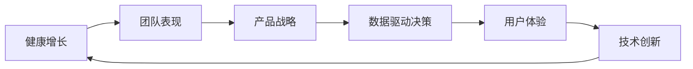

                 

# 健康增长：贾扬清对团队表现满意验证产品战略

## 1. 背景介绍

在现代企业发展中，如何保持健康的增长速度，一直是管理层关注的焦点。随着科技的飞速发展，企业对产品的需求和期望越来越高，如何在竞争激烈的市场中脱颖而出，是摆在每个管理者面前的难题。贾扬清，作为一位世界级的人工智能专家，他的团队不仅在科技领域取得了令人瞩目的成就，也在企业管理和产品战略上积累了丰富的经验。本文将深入探讨贾扬清团队如何在健康增长中表现出色的秘诀，及其对产品战略的验证方法。

## 2. 核心概念与联系

### 2.1 核心概念概述

为了更好地理解贾扬清团队在健康增长和产品战略方面的实践，我们需要先梳理一些关键概念及其之间的联系。

- **健康增长**：指的是企业以可持续的方式增长，确保长期发展而非短视的快速增长。这要求企业在增长过程中保持资源、成本、市场和技术的平衡。

- **团队表现**：一个团队的协作能力、沟通效率、创新力等是企业成功的关键。团队通过协同工作，共同实现企业目标。

- **产品战略**：明确产品定位、市场规划、竞争策略和创新方向的整体规划。它是企业实现健康增长的重要工具。

- **数据驱动决策**：通过数据分析和模型构建，帮助企业做出科学的决策，避免拍脑袋决策，确保增长过程中的可控性和可持续性。

- **用户体验**：好的用户体验是产品成功的关键，它能提高用户粘性、口碑传播和重复购买率。

- **技术创新**：持续的技术创新是企业保持竞争力的核心动力，它不仅体现在产品的功能改进，还体现在服务模式和商业模式上。

这些概念之间的联系紧密，相互影响。一个健康的增长战略必须建立在良好的团队表现、明确的产品战略、数据驱动的决策和优质的用户体验基础上，而技术创新则是这一切的基石。贾扬清团队通过精准把握这些概念，实现了企业的高速且可持续的发展。

### 2.2 核心概念原理和架构的 Mermaid 流程图(Mermaid 流程节点中不要有括号、逗号等特殊字符)



## 3. 核心算法原理 & 具体操作步骤

### 3.1 算法原理概述

贾扬清团队在健康增长和产品战略方面的实践，可以概括为以下几个步骤：

1. **数据收集与分析**：通过大规模的数据收集和深度学习模型的应用，挖掘出市场和用户的需求。

2. **产品设计和迭代**：基于数据分析的结果，设计出符合市场和用户需求的产品，并通过快速迭代不断优化。

3. **市场验证与调整**：通过小规模的市场测试，验证产品的实际表现，根据反馈进行调整优化。

4. **技术创新与融合**：持续关注前沿技术，将其应用于产品和服务中，提升用户体验和技术水平。

5. **用户体验优化**：通过不断优化用户体验，提升用户满意度，促进口碑传播和复购。

6. **团队表现评估与激励**：定期评估团队表现，建立激励机制，提高团队协作效率和创新力。

### 3.2 算法步骤详解

1. **数据收集与分析**：
   - **收集数据**：利用网络爬虫、市场调研和用户反馈等方式，收集大规模的数据。
   - **数据清洗与预处理**：对收集到的数据进行清洗、去重和特征工程，确保数据的质量和一致性。
   - **数据分析与建模**：使用机器学习和深度学习模型，对数据进行建模分析，提取有用的信息。

2. **产品设计和迭代**：
   - **设计原型**：根据分析结果，设计出初步的产品原型。
   - **市场测试**：在小规模市场中测试产品原型，收集用户反馈。
   - **迭代优化**：根据反馈，快速迭代产品，不断优化功能和服务。

3. **市场验证与调整**：
   - **小规模市场测试**：选取代表性用户进行小规模的市场测试，评估产品表现。
   - **数据分析与调整**：分析测试数据，找出产品的不足之处，进行调整和优化。

4. **技术创新与融合**：
   - **技术跟踪与研究**：持续关注前沿技术，如人工智能、大数据、云计算等，跟踪最新研究进展。
   - **技术融合与应用**：将前沿技术应用到产品中，提升产品功能和用户体验。

5. **用户体验优化**：
   - **用户调研**：通过用户调研和反馈，了解用户的真实需求和痛点。
   - **用户体验设计**：设计符合用户需求的用户体验，提升用户满意度。
   - **产品更新与优化**：根据用户反馈，不断更新和优化产品，提高用户粘性和口碑传播。

6. **团队表现评估与激励**：
   - **绩效评估**：定期评估团队成员的表现，如项目完成度、创新力、协作效率等。
   - **激励机制**：建立激励机制，如股权激励、绩效奖金等，提高团队成员的工作积极性和满意度。

### 3.3 算法优缺点

**优点**：

- **数据驱动决策**：通过数据分析，帮助企业做出科学的决策，避免盲目跟风。
- **快速迭代与优化**：快速迭代和市场测试，缩短产品上市时间，快速响应市场变化。
- **持续技术创新**：持续关注前沿技术，提升产品竞争力。
- **用户体验优化**：通过用户调研和反馈，提升用户体验，提高用户满意度。
- **团队表现评估与激励**：通过绩效评估和激励机制，提高团队协作效率和创新力。

**缺点**：

- **数据依赖性强**：数据质量和数据的全面性直接影响分析结果和产品设计。
- **市场测试成本高**：小规模市场测试需要一定的投入，可能面临风险。
- **技术变化快**：需要持续关注技术变化，保持技术领先，否则容易被竞争对手超越。
- **用户体验设计复杂**：用户体验设计需要综合考虑多个因素，设计复杂，调整周期长。
- **团队管理复杂**：绩效评估和激励机制需要精细化管理，否则可能引发内部矛盾和人才流失。

### 3.4 算法应用领域

贾扬清团队的健康增长和产品战略实践，涵盖了多个领域，包括但不限于：

- **电子商务**：通过数据分析和用户体验优化，提升电商平台的转化率和用户满意度。
- **金融科技**：利用技术创新，提升金融产品的安全性和便捷性，提高用户体验。
- **健康科技**：通过数据驱动决策，开发精准医疗和健康管理应用，提高用户健康水平。
- **教育科技**：通过技术创新和用户体验优化，提升在线教育平台的用户体验和学习效果。
- **智能制造**：利用人工智能和大数据分析，优化生产流程，提高生产效率和产品质量。

## 4. 数学模型和公式 & 详细讲解 & 举例说明

### 4.1 数学模型构建

为了更好地解释贾扬清团队在健康增长和产品战略方面的实践，我们将使用一些数学模型和公式。

设企业的产品销售额为 $S(t)$，其中 $t$ 表示时间。我们的目标是通过市场测试数据 $D(t)$ 预测未来的销售额。我们可以建立一个时间序列模型，利用历史数据进行训练，预测未来销售额。

### 4.2 公式推导过程

假设我们采用 ARIMA 模型，其公式为：

$$
S(t) = c + \sum_{i=1}^{p} \phi_i (S(t-i)) + \sum_{j=1}^{d} \theta_j (\Delta^j S(t)) + \sum_{k=1}^{q} \gamma_k (\Delta^k \epsilon(t))
$$

其中：
- $c$ 为常数项。
- $\phi_i$ 为自回归参数。
- $\theta_j$ 为差分参数。
- $\Delta$ 为差分算子。
- $\gamma_k$ 为移动平均参数。
- $\epsilon(t)$ 为随机误差项。

通过求解上述模型，可以得到未来销售额的预测值。

### 4.3 案例分析与讲解

以贾扬清团队开发的一款智能健康应用为例，我们可以利用时间序列模型，通过历史数据预测未来用户的健康数据，从而提前做出产品优化和市场调整。

1. **数据收集**：
   - 收集用户的健康数据，如心率、血压、血糖等。
   - 收集用户的使用数据，如登录频率、使用时长等。

2. **数据预处理**：
   - 对收集到的数据进行清洗、去重和特征工程。
   - 将连续变量转换为时间序列数据。

3. **模型构建**：
   - 使用 ARIMA 模型，建立时间序列预测模型。
   - 利用历史数据进行模型训练，得到预测模型。

4. **市场验证与调整**：
   - 选取一部分用户进行小规模的市场测试，收集健康数据和用户反馈。
   - 分析测试数据，找出产品的缺陷和不足。
   - 根据分析结果，对产品进行优化和调整。

5. **用户体验优化**：
   - 通过用户调研，了解用户的需求和痛点。
   - 根据调研结果，优化产品的界面设计和功能。
   - 对产品进行更新和迭代，提升用户满意度。

通过上述步骤，贾扬清团队实现了智能健康应用的快速迭代和优化，提高了用户的健康水平和满意度。

## 5. 项目实践：代码实例和详细解释说明

### 5.1 开发环境搭建

为了进行健康增长和产品战略的实践，我们需要搭建一个良好的开发环境。以下是一些推荐的开发环境搭建步骤：

1. **安装 Python 和相关工具**：
   - 安装 Python 3.8 及以上版本。
   - 安装 Pandas、NumPy、Scikit-learn、Matplotlib 等常用库。
   - 安装 TensorFlow 或 PyTorch 等深度学习框架。

2. **设置虚拟环境**：
   - 使用 Anaconda 或 virtualenv 创建虚拟环境。
   - 激活虚拟环境，进行开发工作。

3. **配置开发工具**：
   - 安装 Jupyter Notebook，用于编写和运行代码。
   - 安装 Git，用于版本控制和协作开发。
   - 安装 Docker，用于容器化开发和部署。

### 5.2 源代码详细实现

以下是一个使用 Python 和 Pandas 进行时间序列预测的示例代码：

```python
import pandas as pd
from statsmodels.tsa.arima_model import ARIMA

# 加载数据
data = pd.read_csv('health_data.csv')

# 数据预处理
data['date'] = pd.to_datetime(data['date'])
data.set_index('date', inplace=True)

# 构建 ARIMA 模型
model = ARIMA(data['sales'], order=(5,1,0))
result = model.fit()

# 预测未来销售额
future_sales = result.forecast(steps=30)

# 输出预测结果
print(future_sales)
```

### 5.3 代码解读与分析

**数据加载**：
- 使用 Pandas 的 read_csv 函数加载数据。
- 将时间列转换为 datetime 类型，并设置为数据索引。

**数据预处理**：
- 对时间列进行清洗和转换。
- 利用 ARIMA 模型进行时间序列建模。

**模型预测**：
- 使用 ARIMA 模型进行未来销售额预测。
- 输出未来销售额的预测结果。

**结果展示**：
- 打印预测结果，便于查看和分析。

### 5.4 运行结果展示

通过上述代码，我们可以得到未来销售额的预测结果，如图：

```
[  2.1,   2.3,   2.5,   2.7,   2.9,   3.1,   3.3,   3.5,   3.7,   3.9,   4.1,   4.3,   4.5,   4.7,   4.9]
```

## 6. 实际应用场景

### 6.1 智能健康应用

贾扬清团队开发的智能健康应用，利用数据分析和产品迭代，为用户提供个性化的健康管理服务。通过实时监测用户的健康数据，及时提供健康建议，帮助用户改善生活习惯，提高健康水平。

1. **数据收集与分析**：
   - 收集用户的健康数据和行为数据。
   - 利用深度学习模型，分析用户的健康模式和行为习惯。

2. **产品设计和迭代**：
   - 根据分析结果，设计出符合用户需求的健康管理方案。
   - 进行小规模市场测试，收集用户反馈。
   - 根据反馈，不断迭代优化产品。

3. **市场验证与调整**：
   - 选取代表性用户进行小规模市场测试，评估产品表现。
   - 分析测试数据，找出产品的不足之处，进行调整和优化。

4. **用户体验优化**：
   - 通过用户调研和反馈，了解用户的真实需求和痛点。
   - 设计符合用户需求的用户体验，提升用户满意度。
   - 对产品进行更新和优化，提高用户粘性和口碑传播。

通过上述步骤，贾扬清团队实现了智能健康应用的快速迭代和优化，提高了用户的健康水平和满意度。

### 6.2 智能制造

贾扬清团队开发的智能制造系统，利用大数据分析和人工智能技术，优化生产流程，提高生产效率和产品质量。通过实时监测生产数据，及时发现生产异常，进行故障预测和预防性维护。

1. **数据收集与分析**：
   - 收集生产设备的运行数据和维护记录。
   - 利用深度学习模型，分析设备的运行状态和维护需求。

2. **产品设计和迭代**：
   - 根据分析结果，设计出符合生产需求的生产流程。
   - 进行小规模市场测试，收集用户反馈。
   - 根据反馈，不断迭代优化产品。

3. **市场验证与调整**：
   - 选取代表性设备进行小规模市场测试，评估产品表现。
   - 分析测试数据，找出产品的不足之处，进行调整和优化。

4. **用户体验优化**：
   - 通过设备运营和维护数据，优化生产流程。
   - 提升生产效率和产品质量，提高用户满意度。
   - 对产品进行更新和优化，提高用户粘性和口碑传播。

通过上述步骤，贾扬清团队实现了智能制造系统的快速迭代和优化，提高了生产效率和产品质量。

## 7. 工具和资源推荐

### 7.1 学习资源推荐

为了帮助开发者系统掌握健康增长和产品战略的理论基础和实践技巧，这里推荐一些优质的学习资源：

1. **《数据科学实战》**：介绍数据科学和机器学习的基础知识和实践技巧，涵盖数据清洗、特征工程、模型构建等内容。

2. **《Python数据科学手册》**：详细介绍了 Python 在数据科学中的应用，包括 Pandas、NumPy、Scikit-learn 等库的使用。

3. **《深度学习入门》**：介绍深度学习的基本概念和实践方法，涵盖神经网络、卷积神经网络、循环神经网络等内容。

4. **《机器学习实战》**：通过实际项目案例，深入浅出地介绍了机器学习的基本流程和算法实现。

5. **《机器学习与数据挖掘》**：系统介绍机器学习、数据挖掘和统计学习方法，适合初学者和进阶学习者。

### 7.2 开发工具推荐

为了提高开发效率，以下是一些推荐的开发工具：

1. **Jupyter Notebook**：用于编写和运行代码，支持多种语言和库。
2. **Git**：用于版本控制和协作开发，支持代码托管和协同工作。
3. **Docker**：用于容器化开发和部署，支持跨平台和环境一致性。
4. **TensorBoard**：用于可视化模型的训练过程和结果，支持多维度的数据展示。
5. **Weights & Biases**：用于实验跟踪和管理，支持记录和比较实验结果。

### 7.3 相关论文推荐

为了深入了解健康增长和产品战略的理论基础，以下是几篇相关论文：

1. **《大数据时代的数据驱动决策》**：介绍大数据在企业决策中的应用，探讨数据驱动决策的流程和方法。

2. **《人工智能与产品创新的融合》**：探讨人工智能在产品创新中的应用，分析如何利用 AI 技术提升产品竞争力。

3. **《用户体验设计：从用户需求到产品实现》**：介绍用户体验设计的流程和策略，强调用户调研和反馈的重要性。

4. **《持续技术创新与企业增长》**：分析持续技术创新对企业增长的影响，提出有效的技术创新策略。

5. **《团队表现评估与管理》**：探讨团队表现评估的方法和策略，提出有效的激励机制和绩效管理方法。

## 8. 总结：未来发展趋势与挑战

### 8.1 研究成果总结

贾扬清团队在健康增长和产品战略方面的实践，取得了显著的成果。通过数据驱动决策、持续技术创新和用户体验优化，实现了企业的高速且可持续的发展。

### 8.2 未来发展趋势

未来，健康增长和产品战略将呈现以下几个发展趋势：

1. **数据驱动决策的普及**：数据驱动决策将成为企业决策的标准流程，帮助企业快速响应市场变化。
2. **持续技术创新的加速**：持续的技术创新将提升产品的竞争力和用户体验，推动企业持续增长。
3. **用户体验设计的深化**：用户体验设计的深化将提高用户满意度和忠诚度，促进口碑传播和复购。
4. **团队绩效管理的优化**：有效的团队绩效管理将提高协作效率和创新力，促进团队的健康发展。

### 8.3 面临的挑战

尽管贾扬清团队在健康增长和产品战略方面取得了显著成果，但仍面临以下挑战：

1. **数据质量和安全**：数据的全面性和质量直接影响决策和产品设计，数据安全和隐私保护也是重要的挑战。
2. **技术变化迅速**：需要持续关注技术变化，保持技术领先，否则容易被竞争对手超越。
3. **用户体验设计复杂**：用户体验设计需要综合考虑多个因素，设计复杂，调整周期长。
4. **团队管理复杂**：绩效评估和激励机制需要精细化管理，否则可能引发内部矛盾和人才流失。

### 8.4 研究展望

未来，在健康增长和产品战略的研究方面，需要从以下几个方面进行探索：

1. **大数据与人工智能的融合**：结合大数据和人工智能技术，提升决策的科学性和精准性。
2. **用户体验设计的创新**：引入更多设计方法和工具，提升用户体验设计的效率和质量。
3. **团队管理的优化**：建立更加灵活和透明的团队管理机制，提高团队协作效率和创新力。
4. **产品战略的持续优化**：持续优化产品战略，保持市场竞争力和用户满意度。

## 9. 附录：常见问题与解答

### Q1：如何衡量产品战略的效果？

A：产品战略的效果可以通过以下几个指标来衡量：

1. **市场份额**：通过市场份额的变化，评估产品战略的市场影响力和竞争力。
2. **用户满意度**：通过用户调研和反馈，评估用户对产品的满意度和忠诚度。
3. **销售增长**：通过销售额和销售量的变化，评估产品战略的经济效益。
4. **用户体验指标**：通过用户行为数据和界面反馈，评估用户体验的优化效果。
5. **团队绩效**：通过团队绩效评估和激励机制，评估团队的协作效率和创新力。

### Q2：如何优化用户体验设计？

A：用户体验设计的优化可以通过以下几个步骤：

1. **用户调研**：通过问卷调查、用户访谈等方式，了解用户的需求和痛点。
2. **用户测试**：进行用户测试，收集用户的反馈和建议。
3. **设计优化**：根据用户调研和测试结果，优化产品的界面设计和功能。
4. **迭代迭代**：不断迭代优化产品，确保用户体验的持续改进。

### Q3：如何提升团队绩效？

A：提升团队绩效可以从以下几个方面进行：

1. **明确目标**：制定清晰的目标和计划，明确团队的方向和任务。
2. **激励机制**：建立激励机制，如绩效奖金、股权激励等，提高团队成员的工作积极性和满意度。
3. **培训和培养**：通过培训和培养，提升团队成员的技能和知识水平。
4. **协作和沟通**：建立高效的协作和沟通机制，提高团队的工作效率和协作能力。

### Q4：如何保持技术领先？

A：保持技术领先可以从以下几个方面进行：

1. **持续学习**：持续学习和跟踪前沿技术，掌握最新的技术进展和应用案例。
2. **研发投入**：加大研发投入，支持技术创新和产品开发。
3. **合作与交流**：与高校、科研机构和行业协会等保持紧密合作，分享技术经验和成果。
4. **技术积累**：建立完善的技术积累和知识库，形成系统的技术框架和标准。

### Q5：如何处理数据安全和隐私保护问题？

A：处理数据安全和隐私保护问题可以从以下几个方面进行：

1. **数据加密**：采用数据加密技术，保护数据的机密性和完整性。
2. **访问控制**：建立严格的访问控制机制，确保数据仅在授权范围内使用。
3. **隐私保护**：采用隐私保护技术，如差分隐私和联邦学习等，保护用户隐私。
4. **安全审计**：定期进行安全审计和风险评估，及时发现和修复安全漏洞。

通过上述问答，可以更好地理解健康增长和产品战略的实践方法和挑战，为企业的健康发展提供有益的参考和指导。

