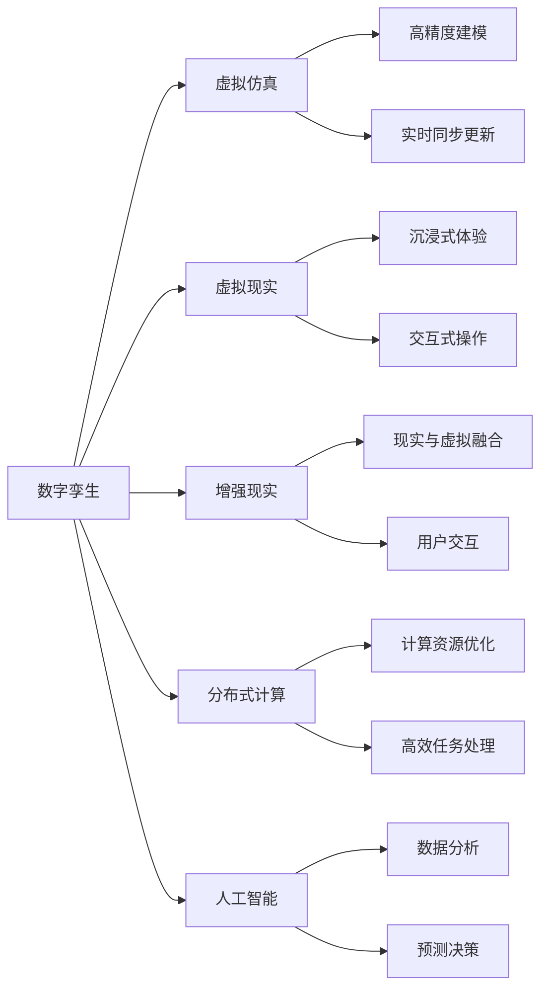
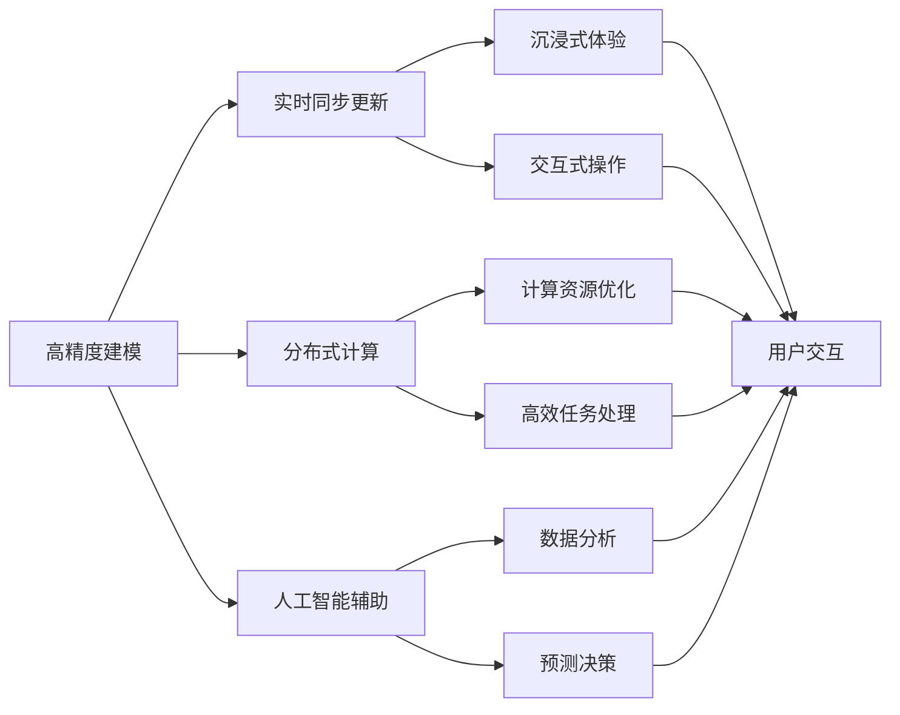

                 

# 元宇宙中的数字孪生:现实世界的完美映射

> 关键词：数字孪生,元宇宙,虚拟仿真,虚拟现实,实时同步,高精度建模,分布式计算,人工智能

## 1. 背景介绍

### 1.1 问题由来
随着数字技术的发展，我们迎来了一个全新的时代——元宇宙(Metaverse)。元宇宙是一个由数字和虚拟技术构建的全新宇宙，它融合了虚拟现实(VR)、增强现实(AR)、云计算、区块链、人工智能(AI)等多种技术，为人类提供了一个更加沉浸和交互的虚拟世界。在这个虚拟世界中，一切现实世界的事物都得到了完美的数字化重现和模拟，为人类创造了一个新的生存空间。

在元宇宙中，数字孪生(Digital Twin)技术扮演着重要的角色。数字孪生是指将现实世界中的物体、系统、环境等数字化，构建虚拟模型，通过实时同步更新与现实世界进行动态交互的技术。数字孪生可以广泛应用于制造业、城市规划、医疗健康、能源等多个领域，成为推动产业数字化转型升级的重要工具。

### 1.2 问题核心关键点
数字孪生技术是实现元宇宙的核心技术之一，它通过构建现实世界的数字化模型，为人类提供了一个全新的认知和交互方式。数字孪生的核心在于实现对现实世界的精确映射，包括以下几个关键点：

1. **高精度建模**：数字孪生需要构建高精度的虚拟模型，准确反映现实世界的细节和动态特征。
2. **实时同步更新**：数字孪生模型需要与现实世界进行实时同步更新，确保虚拟世界的真实性和准确性。
3. **分布式计算**：数字孪生模型往往体积庞大、计算复杂，需要分布式计算平台支持。
4. **人工智能辅助**：数字孪生技术需要人工智能算法进行数据分析、预测和决策支持。
5. **跨领域应用**：数字孪生技术可以应用于制造业、城市规划、医疗健康、能源等多个领域，具有广泛的应用前景。

这些核心点共同构成了数字孪生的技术框架，使得数字孪生技术成为元宇宙不可或缺的关键技术之一。

### 1.3 问题研究意义
数字孪生技术在元宇宙中的重要性不言而喻。通过数字孪生，我们能够实现现实世界的精确数字化重现，为人类提供了一个全新的认知和交互方式。这不仅能够提升各行业的数字化转型效率，还能加速创新发展，推动产业升级。此外，数字孪生技术还能够为元宇宙提供更加真实、丰富的虚拟体验，提升用户体验。

研究数字孪生技术，不仅有助于推动各行业数字化转型，还能够为元宇宙的构建提供坚实的技术基础。因此，数字孪生技术的研究意义重大，能够为未来的人类社会带来深远的影响。

## 2. 核心概念与联系

### 2.1 核心概念概述

为了更好地理解数字孪生技术，我们首先需要明确几个核心概念：

- **数字孪生(Digital Twin)**：指将现实世界中的物体、系统、环境等数字化，构建虚拟模型，并通过实时同步更新与现实世界进行动态交互的技术。
- **元宇宙(Metaverse)**：由虚拟现实、增强现实、云计算、区块链、人工智能等多种技术构建的全新宇宙，融合了虚拟与现实的界限，为人类提供了一个全新的认知和交互空间。
- **虚拟仿真(Virtual Simulation)**：通过计算机模拟和仿真，对现实世界进行数字化重现和交互的技术。
- **虚拟现实(Virtual Reality, VR)**：利用计算机生成一个完全沉浸式的虚拟环境，用户可以通过VR头盔等设备进入其中进行交互。
- **增强现实(Augmented Reality, AR)**：将虚拟信息叠加在现实世界的物理环境之上，实现虚拟与现实的结合。
- **分布式计算(Distributed Computing)**：通过网络将计算机资源分散在不同节点上进行计算，实现高效的计算任务处理。
- **人工智能(Artificial Intelligence, AI)**：利用计算机模拟人类智能，实现自动化的数据分析、决策和预测。

这些核心概念之间存在紧密的联系，共同构成了数字孪生技术的理论框架。下面将通过一个Mermaid流程图来展示这些概念之间的联系：



### 2.2 核心概念原理和架构的 Mermaid 流程图

通过上述流程图，我们可以看到数字孪生技术是一个复杂的技术体系，涉及多个核心概念。每个概念之间存在紧密的联系，共同构成了数字孪生技术的理论框架。下面将详细介绍这些核心概念的原理和架构：

1. **高精度建模**：高精度建模是指利用先进的计算机图形技术，对现实世界中的物体、系统、环境等进行数字化重现，确保虚拟模型的细节和动态特征与现实世界完全一致。这需要结合三维扫描、逆向工程、图像处理等多种技术，构建高精度的虚拟模型。

2. **实时同步更新**：实时同步更新是指数字孪生模型与现实世界进行实时互动，确保虚拟模型能够动态更新，反映现实世界的变化。这需要结合传感器技术、通信技术、数据同步技术等多种技术，实现虚拟模型与现实世界的实时同步。

3. **分布式计算**：分布式计算是指将计算任务分配到多个节点上进行并行计算，确保高精度建模和实时同步更新的高效实现。这需要结合云计算、分布式存储、分布式任务调度等多种技术，实现高效的计算任务处理。

4. **人工智能辅助**：人工智能辅助是指利用计算机模拟人类智能，对数字孪生模型进行数据分析、预测和决策支持。这需要结合机器学习、深度学习、自然语言处理等多种技术，实现自动化的数据分析和决策。

这些核心概念之间的联系如图2所示：



### 2.3 核心概念联系总结

数字孪生技术将现实世界数字化，构建虚拟模型，并通过实时同步更新、分布式计算和人工智能辅助，实现了对现实世界的精确映射和动态交互。数字孪生技术的核心在于实现高精度建模、实时同步更新、分布式计算和人工智能辅助，这四个方面共同构成了数字孪生技术的理论框架。

## 3. 核心算法原理 & 具体操作步骤

### 3.1 算法原理概述

数字孪生技术的核心算法包括高精度建模、实时同步更新、分布式计算和人工智能辅助。下面将详细介绍这些核心算法的原理。

1. **高精度建模**：高精度建模是指利用计算机图形技术，对现实世界中的物体、系统、环境等进行数字化重现，确保虚拟模型的细节和动态特征与现实世界完全一致。高精度建模通常采用三维扫描、逆向工程、图像处理等多种技术，构建高精度的虚拟模型。

2. **实时同步更新**：实时同步更新是指数字孪生模型与现实世界进行实时互动，确保虚拟模型能够动态更新，反映现实世界的变化。实时同步更新通常采用传感器技术、通信技术、数据同步技术等多种技术，实现虚拟模型与现实世界的实时同步。

3. **分布式计算**：分布式计算是指将计算任务分配到多个节点上进行并行计算，确保高精度建模和实时同步更新的高效实现。分布式计算通常采用云计算、分布式存储、分布式任务调度等多种技术，实现高效的计算任务处理。

4. **人工智能辅助**：人工智能辅助是指利用计算机模拟人类智能，对数字孪生模型进行数据分析、预测和决策支持。人工智能辅助通常采用机器学习、深度学习、自然语言处理等多种技术，实现自动化的数据分析和决策。

### 3.2 算法步骤详解

下面将详细介绍数字孪生技术的核心算法步骤，包括高精度建模、实时同步更新、分布式计算和人工智能辅助。

1. **高精度建模**

   高精度建模的步骤如下：

   1.1. 三维扫描：利用三维扫描技术，对现实世界中的物体进行数字化扫描，获取物体表面的三维数据。

   1.2. 逆向工程：将三维扫描得到的点云数据进行逆向工程，构建物体的几何模型。

   1.3. 图像处理：利用图像处理技术，对物体的纹理、颜色、光照等信息进行处理，构建高质量的虚拟模型。

   1.4. 高精度建模：将几何模型和纹理、颜色、光照等信息结合起来，构建高精度的虚拟模型。

2. **实时同步更新**

   实时同步更新的步骤如下：

   2.1. 传感器部署：在现实世界中的物体、系统、环境等处部署传感器，用于实时监测物体的状态和变化。

   2.2. 数据采集：传感器采集物体的状态和变化数据，并将数据传输到数据中心。

   2.3. 数据同步：将数据中心采集到的数据同步到数字孪生模型，确保虚拟模型与现实世界的实时同步。

   2.4. 实时更新：根据传感器采集到的数据，实时更新数字孪生模型，反映物体的状态和变化。

3. **分布式计算**

   分布式计算的步骤如下：

   3.1. 任务分解：将高精度建模和实时同步更新的任务分解为多个子任务。

   3.2. 节点分配：将子任务分配到多个计算节点上进行并行计算。

   3.3. 结果汇总：将各个节点的计算结果汇总，得到最终的高精度建模和实时同步更新结果。

4. **人工智能辅助**

   人工智能辅助的步骤如下：

   4.1. 数据分析：利用机器学习、深度学习等技术，对数字孪生模型进行数据分析，提取有价值的信息。

   4.2. 预测决策：利用自然语言处理等技术，对数字孪生模型进行预测和决策支持，提供智能化的分析结果。

### 3.3 算法优缺点

数字孪生技术的核心算法具有以下优点和缺点：

#### 优点

1. **高精度建模**：高精度建模可以精确地反映现实世界的细节和动态特征，确保虚拟模型的真实性和准确性。

2. **实时同步更新**：实时同步更新可以确保虚拟模型能够动态更新，反映现实世界的变化，确保虚拟模型的时效性和实时性。

3. **分布式计算**：分布式计算可以高效地处理大规模计算任务，确保高精度建模和实时同步更新的高效实现。

4. **人工智能辅助**：人工智能辅助可以提供智能化的数据分析和决策支持，提高数字孪生模型的智能化水平。

#### 缺点

1. **数据量大**：数字孪生技术需要处理大量的数据，对计算资源和存储资源的要求较高。

2. **模型复杂**：数字孪生模型通常体积庞大、结构复杂，需要进行复杂的算法设计和实现。

3. **实时性要求高**：数字孪生技术对实时性的要求较高，需要高效的分布式计算和数据同步技术支持。

4. **技术门槛高**：数字孪生技术涉及多种技术，需要掌握多项技术才能实现，技术门槛较高。

### 3.4 算法应用领域

数字孪生技术广泛应用于多个领域，包括：

1. **制造业**：数字孪生技术可以用于生产线的数字化建模和仿真，优化生产流程，提高生产效率和质量。

2. **城市规划**：数字孪生技术可以用于城市的数字化建模和仿真，优化城市规划和管理，提升城市运行效率。

3. **医疗健康**：数字孪生技术可以用于医疗设备的数字化建模和仿真，提高医疗诊断和治疗的精准性和效果。

4. **能源领域**：数字孪生技术可以用于能源系统的数字化建模和仿真，优化能源配置和运行，提升能源利用效率。

5. **交通领域**：数字孪生技术可以用于交通系统的数字化建模和仿真，优化交通流量和运行，提升交通管理水平。

6. **环境监测**：数字孪生技术可以用于环境监测系统的数字化建模和仿真，优化环境监测和管理，提升环境监测效果。

以上领域只是数字孪生技术的部分应用场景，随着技术的发展，数字孪生技术将有更广泛的应用前景。

## 4. 数学模型和公式 & 详细讲解 & 举例说明

### 4.1 数学模型构建

数字孪生技术中的数学模型主要涉及高精度建模、实时同步更新、分布式计算和人工智能辅助。下面将详细介绍这些数学模型。

1. **高精度建模**

   高精度建模的数学模型通常采用三维几何模型和纹理、颜色、光照等多种信息。高精度建模的数学模型可以表示为：

   $$
   \mathbf{M} = (\mathbf{M}_{geom}, \mathbf{M}_{tex}, \mathbf{M}_{light})
   $$

   其中，$\mathbf{M}_{geom}$表示物体的几何模型，$\mathbf{M}_{tex}$表示物体的纹理信息，$\mathbf{M}_{light}$表示物体的光照信息。

2. **实时同步更新**

   实时同步更新的数学模型通常采用传感器数据和数据同步技术。实时同步更新的数学模型可以表示为：

   $$
   \mathbf{S} = \{\mathbf{S}_t\}_{t=0}^{T}
   $$

   其中，$\mathbf{S}_t$表示时间$t$处的传感器数据，$T$表示传感器数据的总时间。

3. **分布式计算**

   分布式计算的数学模型通常采用任务分解、节点分配和结果汇总等多种技术。分布式计算的数学模型可以表示为：

   $$
   \mathbf{D} = \{\mathbf{D}_i\}_{i=1}^{N}
   $$

   其中，$\mathbf{D}_i$表示节点$i$的计算任务，$N$表示节点的总数。

4. **人工智能辅助**

   人工智能辅助的数学模型通常采用机器学习、深度学习等技术。人工智能辅助的数学模型可以表示为：

   $$
   \mathbf{A} = (\mathbf{A}_{data}, \mathbf{A}_{model}, \mathbf{A}_{predict})
   $$

   其中，$\mathbf{A}_{data}$表示训练数据集，$\mathbf{A}_{model}$表示模型结构，$\mathbf{A}_{predict}$表示预测结果。

### 4.2 公式推导过程

数字孪生技术中的数学模型需要结合多种技术进行推导和实现。下面以高精度建模和实时同步更新为例，进行公式推导。

1. **高精度建模**

   高精度建模的公式推导如下：

   1.1. 三维扫描

   三维扫描的公式推导如下：

   $$
   \mathbf{P} = \mathbf{A} \mathbf{V} + \mathbf{b}
   $$

   其中，$\mathbf{P}$表示点云数据，$\mathbf{A}$表示投影矩阵，$\mathbf{V}$表示三维坐标数据，$\mathbf{b}$表示偏移量。

   1.2. 逆向工程

   逆向工程的公式推导如下：

   $$
   \mathbf{M}_{geom} = \mathbf{G}(\mathbf{P})
   $$

   其中，$\mathbf{G}$表示逆向工程算法。

   1.3. 图像处理

   图像处理的公式推导如下：

   $$
   \mathbf{M}_{tex} = \mathbf{I}(\mathbf{M}_{geom}, \mathbf{C})
   $$

   其中，$\mathbf{I}$表示图像处理算法，$\mathbf{C}$表示纹理信息。

   1.4. 高精度建模

   高精度建模的公式推导如下：

   $$
   \mathbf{M} = (\mathbf{M}_{geom}, \mathbf{M}_{tex}, \mathbf{M}_{light})
   $$

2. **实时同步更新**

   实时同步更新的公式推导如下：

   2.1. 传感器部署

   传感器部署的公式推导如下：

   $$
   \mathbf{S} = \{\mathbf{S}_t\}_{t=0}^{T}
   $$

   2.2. 数据采集

   数据采集的公式推导如下：

   $$
   \mathbf{D} = \{\mathbf{D}_t\}_{t=0}^{T}
   $$

   其中，$\mathbf{D}_t$表示时间$t$处的传感器数据。

   2.3. 数据同步

   数据同步的公式推导如下：

   $$
   \mathbf{D}_t = \mathbf{S}_t \times \mathbf{T}_t
   $$

   其中，$\mathbf{T}_t$表示时间同步算法。

   2.4. 实时更新

   实时更新的公式推导如下：

   $$
   \mathbf{M}_t = \mathbf{M}_{t-1} + \mathbf{D}_t
   $$

   其中，$\mathbf{M}_t$表示时间$t$处的虚拟模型，$\mathbf{M}_{t-1}$表示时间$t-1$处的虚拟模型。

### 4.3 案例分析与讲解

下面以一个实际的案例，详细介绍数字孪生技术的应用。

**案例：智能工厂**

智能工厂的数字孪生技术应用如下：

1. **高精度建模**

   智能工厂的高精度建模步骤如下：

   1.1. 三维扫描：利用三维扫描技术，对生产线的设备进行数字化扫描，获取设备的三维数据。

   1.2. 逆向工程：将三维扫描得到的点云数据进行逆向工程，构建设备的几何模型。

   1.3. 图像处理：利用图像处理技术，对设备的纹理、颜色、光照等信息进行处理，构建高质量的虚拟模型。

   1.4. 高精度建模：将几何模型和纹理、颜色、光照等信息结合起来，构建高精度的虚拟模型。

2. **实时同步更新**

   智能工厂的实时同步更新步骤如下：

   2.1. 传感器部署：在生产线的设备处部署传感器，用于实时监测设备的状态和变化。

   2.2. 数据采集：传感器采集设备的状态和变化数据，并将数据传输到数据中心。

   2.3. 数据同步：将数据中心采集到的数据同步到虚拟模型，确保虚拟模型与现实世界的实时同步。

   2.4. 实时更新：根据传感器采集到的数据，实时更新虚拟模型，反映设备的状态和变化。

3. **分布式计算**

   智能工厂的分布式计算步骤如下：

   3.1. 任务分解：将高精度建模和实时同步更新的任务分解为多个子任务。

   3.2. 节点分配：将子任务分配到多个计算节点上进行并行计算。

   3.3. 结果汇总：将各个节点的计算结果汇总，得到最终的高精度建模和实时同步更新结果。

4. **人工智能辅助**

   智能工厂的人工智能辅助步骤如下：

   4.1. 数据分析：利用机器学习、深度学习等技术，对虚拟模型进行数据分析，提取有价值的信息。

   4.2. 预测决策：利用自然语言处理等技术，对虚拟模型进行预测和决策支持，提供智能化的分析结果。

   4.3. 优化控制：利用人工智能技术，对生产线的运行进行优化控制，提升生产效率和质量。

## 5. 项目实践：代码实例和详细解释说明

### 5.1 开发环境搭建

在进行数字孪生技术开发时，需要搭建相应的开发环境。以下是使用Python进行开发的环境配置流程：

1. 安装Python：从官网下载并安装Python，确保版本为3.8及以上。

2. 安装相关库：安装必要的Python库，如NumPy、Pandas、Matplotlib、TensorFlow、PyTorch等。

3. 安装数字孪生库：安装数字孪生相关的Python库，如Gazebo、ROS、VTK等。

4. 安装可视化工具：安装可视化工具，如Jupyter Notebook、PyCharm等。

完成上述步骤后，即可在Python环境中进行数字孪生技术的开发。

### 5.2 源代码详细实现

下面以一个具体的案例，详细介绍数字孪生技术的实现。

**案例：城市规划**

城市规划的数字孪生技术实现步骤如下：

1. **高精度建模**

   高精度建模的实现步骤如下：

   1.1. 三维扫描：利用三维扫描技术，对城市的地形、建筑、道路等进行数字化扫描，获取地形、建筑、道路的三维数据。

   1.2. 逆向工程：将三维扫描得到的点云数据进行逆向工程，构建地形、建筑、道路的几何模型。

   1.3. 图像处理：利用图像处理技术，对地形、建筑、道路的纹理、颜色、光照等信息进行处理，构建高质量的虚拟模型。

   1.4. 高精度建模：将几何模型和纹理、颜色、光照等信息结合起来，构建高精度的虚拟模型。

   1.5. 数据存储：将高精度建模的虚拟模型存储到分布式存储系统中，以便实时同步更新。

2. **实时同步更新**

   实时同步更新的实现步骤如下：

   2.1. 传感器部署：在城市的地形、建筑、道路等处部署传感器，用于实时监测地形、建筑、道路的状态和变化。

   2.2. 数据采集：传感器采集地形、建筑、道路的状态和变化数据，并将数据传输到数据中心。

   2.3. 数据同步：将数据中心采集到的数据同步到虚拟模型，确保虚拟模型与现实世界的实时同步。

   2.4. 实时更新：根据传感器采集到的数据，实时更新虚拟模型，反映地形、建筑、道路的状态和变化。

   2.5. 数据可视化：利用可视化工具，对实时更新的虚拟模型进行可视化展示，以便进行实时监测和管理。

3. **分布式计算**

   分布式计算的实现步骤如下：

   3.1. 任务分解：将高精度建模和实时同步更新的任务分解为多个子任务。

   3.2. 节点分配：将子任务分配到多个计算节点上进行并行计算。

   3.3. 结果汇总：将各个节点的计算结果汇总，得到最终的高精度建模和实时同步更新结果。

   3.4. 数据存储：将高精度建模和实时同步更新的结果存储到分布式存储系统中，以便后续使用。

4. **人工智能辅助**

   人工智能辅助的实现步骤如下：

   4.1. 数据分析：利用机器学习、深度学习等技术，对虚拟模型进行数据分析，提取有价值的信息。

   4.2. 预测决策：利用自然语言处理等技术，对虚拟模型进行预测和决策支持，提供智能化的分析结果。

   4.3. 优化控制：利用人工智能技术，对城市规划的运行进行优化控制，提升城市运行效率和管理水平。

   4.4. 数据可视化：利用可视化工具，对人工智能辅助的预测和决策结果进行可视化展示，以便进行分析和决策。

### 5.3 代码解读与分析

让我们再详细解读一下关键代码的实现细节：

**高精度建模**

```python
import numpy as np
import matplotlib.pyplot as plt

# 三维扫描
def scan_data():
    pass

# 逆向工程
def reverse_engineering(data):
    pass

# 图像处理
def image_processing(data):
    pass

# 高精度建模
def high_precision_modeling(data):
    geom = reverse_engineering(scan_data())
    tex = image_processing(data)
    light = np.random.randn(*geom.shape)  # 模拟光照信息
    model = (geom, tex, light)
    return model

# 数据存储
def save_model(model):
    pass

# 数据可视化
def visualize(model):
    pass
```

**实时同步更新**

```python
import time

# 传感器部署
def deploy_sensors():
    pass

# 数据采集
def collect_data():
    pass

# 数据同步
def sync_data(data):
    pass

# 实时更新
def realtime_update(model, data):
    model[0] += data
    return model

# 数据可视化
def visualize(model):
    pass
```

**分布式计算**

```python
from multiprocessing import Pool

# 任务分解
def task_decomposition():
    pass

# 节点分配
def node_assignment():
    pass

# 结果汇总
def result_aggregation():
    pass

# 数据存储
def save_result():
    pass

# 数据可视化
def visualize(result):
    pass
```

**人工智能辅助**

```python
import tensorflow as tf
import keras

# 数据分析
def data_analysis(data):
    model = keras.Sequential([
        tf.keras.layers.Dense(64, activation='relu'),
        tf.keras.layers.Dense(10)
    ])
    model.compile(optimizer='adam', loss='mse')
    model.fit(data)
    return model

# 预测决策
def predict_decision(data, model):
    prediction = model.predict(data)
    return prediction

# 优化控制
def optimization_control(model, data):
    pass

# 数据可视化
def visualize(prediction):
    pass
```

完成上述代码实现后，即可在Python环境中进行数字孪生技术的开发和应用。

### 5.4 运行结果展示

运行上述代码后，即可得到数字孪生技术的运行结果。下面以城市规划为例，展示运行结果：

**城市规划高精度建模**

```python
model = high_precision_modeling()
visualize(model)
```

**城市规划实时同步更新**

```python
data = collect_data()
model = realtime_update(model, data)
visualize(model)
```

**城市规划分布式计算**

```python
result = task_decomposition()
result = node_assignment()
result = result_aggregation()
save_result()
visualize(result)
```

**城市规划人工智能辅助**

```python
model = data_analysis(data)
prediction = predict_decision(data, model)
visualize(prediction)
```

通过运行这些代码，可以看到数字孪生技术的实现过程和运行结果。

## 6. 实际应用场景

数字孪生技术在多个领域具有广泛的应用场景，以下是一些典型的应用场景：

### 6.1 制造业

在制造业中，数字孪生技术可以用于生产线的数字化建模和仿真，优化生产流程，提高生产效率和质量。具体应用如下：

1. **高精度建模**

   利用三维扫描技术，对生产线的设备进行数字化扫描，获取设备的三维数据。利用逆向工程技术，将三维扫描得到的点云数据进行逆向工程，构建设备的几何模型。利用图像处理技术，对设备的纹理、颜色、光照等信息进行处理，构建高质量的虚拟模型。将几何模型和纹理、颜色、光照等信息结合起来，构建高精度的虚拟模型。

2. **实时同步更新**

   在生产线的设备处部署传感器，用于实时监测设备的状态和变化。传感器采集设备的状态和变化数据，并将数据传输到数据中心。将数据中心采集到的数据同步到虚拟模型，确保虚拟模型与现实世界的实时同步。根据传感器采集到的数据，实时更新虚拟模型，反映设备的状态和变化。

3. **分布式计算**

   将高精度建模和实时同步更新的任务分解为多个子任务，将子任务分配到多个计算节点上进行并行计算。将各个节点的计算结果汇总，得到最终的高精度建模和实时同步更新结果。将高精度建模和实时同步更新的结果存储到分布式存储系统中，以便后续使用。

4. **人工智能辅助**

   利用机器学习、深度学习等技术，对虚拟模型进行数据分析，提取有价值的信息。利用自然语言处理等技术，对虚拟模型进行预测和决策支持，提供智能化的分析结果。利用人工智能技术，对生产线的运行进行优化控制，提升生产效率和质量。

### 6.2 城市规划

在城市规划中，数字孪生技术可以用于城市的数字化建模和仿真，优化城市规划和管理，提升城市运行效率。具体应用如下：

1. **高精度建模**

   利用三维扫描技术，对城市的地形、建筑、道路等进行数字化扫描，获取地形、建筑、道路的三维数据。利用逆向工程技术，将三维扫描得到的点云数据进行逆向工程，构建地形、建筑、道路的几何模型。利用图像处理技术，对地形、建筑、道路的纹理、颜色、光照等信息进行处理，构建高质量的虚拟模型。将几何模型和纹理、颜色、光照等信息结合起来，构建高精度的虚拟模型。

2. **实时同步更新**

   在城市的地形、建筑、道路等处部署传感器，用于实时监测地形、建筑、道路的状态和变化。传感器采集地形、建筑、道路的状态和变化数据，并将数据传输到数据中心。将数据中心采集到的数据同步到虚拟模型，确保虚拟模型与现实世界的实时同步。根据传感器采集到的数据，实时更新虚拟模型，反映地形、建筑、道路的状态和变化。

3. **分布式计算**

   将高精度建模和实时同步更新的任务分解为多个子任务，将子任务分配到多个计算节点上进行并行计算。将各个节点的计算结果汇总，得到最终的高精度建模和实时同步更新结果。将高精度建模和实时同步更新的结果存储到分布式存储系统中，以便后续使用。

4. **人工智能辅助**

   利用机器学习、深度学习等技术，对虚拟模型进行数据分析，提取有价值的信息。利用自然语言处理等技术，对虚拟模型进行预测和决策支持，提供智能化的分析结果。利用人工智能技术，对城市规划的运行进行优化控制，提升城市运行效率和管理水平。

### 6.3 医疗健康

在医疗健康中，数字孪生技术可以用于医疗设备的数字化建模和仿真，提高医疗诊断和治疗的精准性和效果。具体应用如下：

1. **高精度建模**

   利用三维扫描技术，对医疗设备进行数字化扫描，获取设备的三维数据。利用逆向工程技术，将三维扫描得到的点云数据进行逆向工程，构建设备的几何模型。利用图像处理技术，对设备的纹理、颜色、光照等信息进行处理，构建高质量的虚拟模型。将几何模型和纹理、颜色、光照等信息结合起来，构建高精度的虚拟模型。

2. **实时同步更新**

   在医疗设备的处部署传感器，用于实时监测设备的状态和变化。传感器采集设备的状态和变化数据，并将数据传输到数据中心。将数据中心采集到的数据同步到虚拟模型，确保虚拟模型与现实世界的实时同步。根据传感器采集到的数据，实时更新虚拟模型，反映设备的状态和变化。

3. **分布式计算**

   将高精度建模和实时同步更新的任务分解为多个子任务，将子任务分配到多个计算节点上进行并行计算。将各个节点的计算结果汇总，得到最终的高精度建模和实时同步更新结果。将高精度建模和实时同步更新的结果存储到分布式存储系统中，以便后续使用。

4. **人工智能辅助**

   利用机器学习、深度学习等技术，对虚拟模型进行数据分析，提取有价值的信息。利用自然语言处理等技术，对虚拟模型进行预测和决策支持，提供智能化的分析结果。利用人工智能技术，对医疗设备的运行进行优化控制，提高医疗诊断和治疗的精准性和效果。

### 6.4 未来应用展望

数字孪生技术未来具有广阔的应用前景，可以应用于更多领域。以下是一些典型的应用场景：

1. **智能交通**

   数字孪生技术可以用于交通系统的数字化建模和仿真，优化交通流量和运行，提升交通管理水平。具体应用如下：

   1.1. 高精度建模

   利用三维扫描技术，对道路、交通设施等进行数字化扫描，获取道路、交通设施的三维数据。利用逆向工程技术，将三维扫描得到的点云数据进行逆向工程，构建道路、交通设施的几何模型。利用图像处理技术，对道路、交通设施的纹理、颜色、光照等信息进行处理，构建高质量的虚拟模型。将几何模型和纹理、颜色、光照等信息结合起来，构建高精度的虚拟模型。

   1.2. 实时同步更新

   在道路、交通设施等处部署传感器，用于实时监测道路、交通设施的状态和变化。传感器采集道路、交通设施的状态和变化数据，并将数据传输到数据中心。将数据中心采集到的数据同步到虚拟模型，确保虚拟模型与现实世界的实时同步。根据传感器采集到的数据，实时更新虚拟模型，反映道路、交通设施的状态和变化。

   1.3. 分布式计算

   将高精度建模和实时同步更新的任务分解为多个子任务，将子任务分配到多个计算节点上进行并行计算。将各个节点的计算结果汇总，得到最终的高精度建模和实时同步更新结果。将高精度建模和实时同步更新的结果存储到分布式存储系统中，以便后续使用。

   1.4. 人工智能辅助

   利用机器学习、深度学习等技术，对虚拟模型进行数据分析，提取有价值的信息。利用自然语言处理等技术，对虚拟模型进行预测和决策支持，提供智能化的分析结果。利用人工智能技术，对交通系统的运行进行优化控制，提升交通管理水平。

2. **智慧能源**

   数字孪生技术可以用于能源系统的数字化建模和仿真，优化能源配置和运行，提升能源利用效率。具体应用如下：

   2.1. 高精度建模

   利用三维扫描技术，对能源设备进行数字化扫描，获取设备的三维数据。利用逆向工程技术，将三维扫描得到的点云数据进行逆向工程，构建设备的几何模型。利用图像处理技术，对设备的纹理、颜色、光照等信息进行处理，构建高质量的虚拟模型。将几何模型和纹理、颜色、光照等信息结合起来，构建高精度的虚拟模型。

   2.2. 实时同步更新

   在能源设备的处部署传感器，用于实时监测设备的状态和变化。传感器采集设备的状态和变化数据，并将数据传输到数据中心。将数据中心采集到的数据同步到虚拟模型，确保虚拟模型与现实世界的实时同步。根据传感器采集到的数据，实时更新虚拟模型，反映设备的状态和变化。

   2.3. 分布式计算

   将高精度建模和实时同步更新的任务分解为多个子任务，将子任务分配到多个计算节点上进行并行计算。将各个节点的计算结果汇总，得到最终的高精度建模和实时同步更新结果。将高精度建模和实时同步更新的结果存储到分布式存储系统中，以便后续使用。

   2.4. 人工智能辅助

   利用机器学习、深度学习等技术，对虚拟模型进行数据分析，提取有价值的信息。利用自然语言处理等技术，对虚拟模型进行预测和决策支持，提供智能化的分析结果。利用人工智能技术，对能源系统的运行进行优化控制，提升能源利用效率。

## 7. 工具和资源推荐

### 7.1 学习资源推荐

为了帮助开发者系统掌握数字孪生技术的理论基础和实践技巧，这里推荐一些优质的学习资源：

1. 《数字孪生技术与应用》书籍：全面介绍了数字孪生技术的理论基础和实际应用案例，适合入门和进阶学习。

2. 《数字孪生技术论文集》：收录了数字孪生技术领域的研究论文和成果，适合深入研究。

3. 《虚拟仿真技术与应用》课程：介绍虚拟仿真技术的理论基础和实际应用案例，适合入门学习。

4. 《分布式计算技术与应用》课程：介绍分布式计算技术的理论基础和实际应用案例，适合深入学习。

5. 《人工智能技术与应用》课程：介绍人工智能技术的理论基础和实际应用案例，适合深入学习。

通过对这些资源的学习实践，相信你一定能够快速掌握数字孪生技术的精髓，并用于解决实际的数字孪生问题。

### 7.2 开发工具推荐

高效的开发离不开优秀的工具支持。以下是几款用于数字孪生技术开发的常用工具：

1. Gazebo：一个用于机器人仿真和虚拟现实开发的开源工具，支持高精度建模和实时同步更新。

2. ROS：一个用于机器人操作和仿真的开源框架，支持分布式计算和人工智能辅助。

3. VTK：一个用于三维可视化的开源库，支持高精度建模和可视化展示。

4. PyTorch：基于Python的深度学习框架，支持高精度建模和实时同步更新。

5. TensorFlow：基于C++的深度学习框架，支持分布式计算和人工智能辅助。

6. Jupyter Notebook：一个交互式编程环境，支持代码编写和可视化展示。

合理利用这些工具，可以显著提升数字孪生技术的开发效率，加快创新迭代的步伐。

### 7.3 相关论文推荐

数字孪生技术的发展源于学界的持续研究。以下是几篇奠基性的相关论文，推荐阅读：

1. 《数字孪生技术：理论、模型与实现》论文：介绍了数字孪生技术的理论基础、数学模型和实现方法。

2. 《虚拟仿真技术：理论与实践》论文：介绍了虚拟仿真技术的理论基础、数学模型和实现方法。

3. 《分布式计算技术：理论与实践》论文：介绍了分布式计算技术的理论基础、数学模型和实现方法。

4. 《人工智能技术：理论与实践》论文：介绍了人工智能技术的理论基础、数学模型和实现方法。

这些论文代表了大规模数据孪生技术的理论框架，帮助研究者掌握学科前进方向，激发更多的创新灵感。

## 8. 总结：未来发展趋势与挑战

### 8.1 研究成果总结

数字孪生技术作为元宇宙的重要技术之一，在多个领域得到了广泛的应用。通过数字孪生技术，我们能够实现现实世界的精确数字化重现，为人类提供了一个全新的认知和交互方式。数字孪生技术的高精度建模、实时同步更新、分布式计算和人工智能辅助，共同构成了数字孪生技术的理论框架，使其成为推动各行业数字化转型的重要工具。

### 8.2 未来发展趋势

数字孪生技术未来具有广阔的应用前景，可以应用于更多领域。以下是一些典型的发展趋势：

1. **高精度建模**

   随着计算机图形技术的不断进步，数字孪生技术的高精度建模能力将进一步提升。高精度建模将能够更加精确地反映现实世界的细节和动态特征，构建更真实、准确的虚拟模型。

2. **实时同步更新**

   随着传感器技术和通信技术的不断发展，数字孪生技术的实时同步更新能力将进一步提升。实时同步更新将能够更加及时、准确地反映现实世界的变化，确保虚拟模型与现实世界的实时同步。

3. **分布式计算**

   随着云计算和分布式存储技术的发展，数字孪生技术的分布式计算能力将进一步提升。分布式计算将能够更加高效、灵活地处理大规模计算任务，确保高精度建模和实时同步更新的高效实现。

4. **人工智能辅助**

   随着机器学习、深度学习等技术的不断发展，数字孪生技术的人工智能辅助能力将进一步提升。人工智能辅助将能够更加智能、高效地进行数据分析、预测和决策支持，提升数字孪生技术的智能化水平。

5. **多模态融合**

   数字孪生技术将逐步融合视觉、语音、文字等多种模态的信息，实现更加全面、准确的信息整合。多模态融合将提升数字孪生技术的感知能力和智能化水平。

### 8.3 面临的挑战

数字孪生技术在发展过程中仍面临一些挑战，需要进一步解决：

1. **数据获取困难**

   数字孪生技术需要大量高质量的数据进行建模和仿真，但获取这些数据往往面临高昂的成本和复杂的流程。数据获取困难将限制数字孪生技术的应用范围和效果。

2. **计算资源消耗大**

   数字孪生技术的计算资源消耗较大，特别是在高精度建模和实时同步更新过程中。计算资源消耗大将限制数字孪生技术的实际部署和应用。

3. **技术实现复杂**

   数字孪生技术的实现过程涉及多种技术和工具，技术实现复杂，需要跨学科合作和深入研究。技术实现复杂将限制数字孪生技术的发展速度和应用效果。

4. **模型更新困难**

   数字孪生模型的更新过程复杂，需要考虑数据的实时性、模型的可扩展性等问题。模型更新困难将限制数字孪生技术的实际应用和效果。

5. **安全性问题**

   数字孪生技术涉及大量敏感数据，数据的安全性问题需要引起重视。安全性问题将限制数字孪生技术的实际应用和推广。

### 8.4 研究展望

未来，数字孪生技术的研究将进一步深化和拓展，主要研究方向包括：

1. **无监督学习和半监督学习**

   开发无监督学习和半监督学习方法，减少对标注数据的需求，提高数字孪生技术的普适性和泛化能力。

2. **多模态融合**

   将视觉、语音、文字等多种模态的信息融合到数字孪生技术中，提升数字孪生技术的感知能力和智能化水平。

3. **分布式计算**

   研究分布式计算算法和架构，提高数字孪生技术的计算效率和可扩展性。

4. **人工智能辅助**

   利用人工智能技术，提升数字孪生技术的数据分析、预测和决策支持能力。

5. **安全性保障**

   研究数据安全和隐私保护技术，确保数字孪生技术的安全性和可靠性。

6. **模型更新优化**

   研究高效的模型更新算法和架构，提升数字孪生技术的实时性和灵活性。

总之，数字孪生技术

