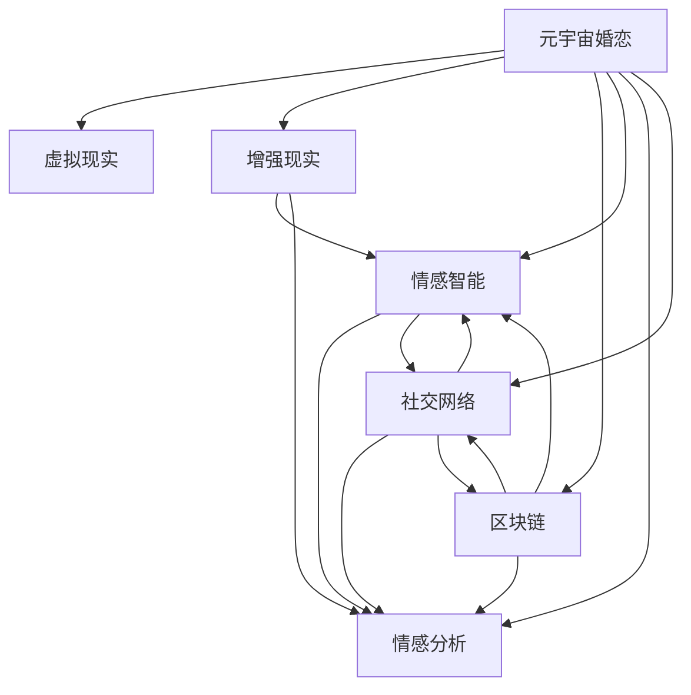

                 

# 元宇宙婚恋:虚拟世界中的情感连接

> 关键词：元宇宙婚恋,情感智能,虚拟现实,区块链,隐私保护,社交网络,情感分析,区块链游戏

## 1. 背景介绍

### 1.1 问题由来
随着技术的飞速发展，人类逐渐进入了数字时代，虚拟世界的兴起给传统婚恋模式带来了新的机遇与挑战。元宇宙（Metaverse）作为虚拟世界的典型代表，通过虚拟现实（VR）、增强现实（AR）和区块链（Blockchain）等技术，构建了一个三维化的数字世界，使人们在虚拟空间中可以进行深度互动。元宇宙婚恋作为虚拟世界中的重要应用之一，旨在通过数字化的方式为人们提供全新的婚恋体验，成为现代婚恋的新趋势。

### 1.2 问题核心关键点
元宇宙婚恋的实现涉及到多个关键领域，包括但不限于：
- 情感智能：利用人工智能技术识别和理解用户情感，提升虚拟婚恋体验的真实感。
- 虚拟现实：提供沉浸式的交互体验，使用户能够以真实感的方式与虚拟伴侣进行互动。
- 区块链技术：保障虚拟婚恋中的信任和隐私，确保数据的安全性和透明性。
- 社交网络：构建连接用户的社交关系网络，形成丰富的婚恋社群。
- 情感分析：通过对用户的情感表达和行为进行分析和理解，提供个性化的婚恋建议和服务。

这些核心点相互交织，共同构成了元宇宙婚恋的基本框架。理解并掌握这些技术原理和实践方法，对于实现虚拟婚恋的创新应用至关重要。

### 1.3 问题研究意义
研究元宇宙婚恋的情感连接技术，不仅对于提升虚拟婚恋的体验质量有着直接意义，还能推动NLP、情感智能和人工智能技术的整体发展。其研究意义主要体现在：
1. **提升用户体验：**通过情感智能和情感分析，元宇宙婚恋可以更加贴近真实情感，满足用户的情感需求，提供个性化的婚恋服务。
2. **推动技术发展：**在情感智能和情感分析方面进行深入研究，为NLP、情感识别等技术的应用提供了重要的实践平台。
3. **促进社交互动：**构建丰富的社交网络，增强用户互动，扩大元宇宙婚恋的影响力，促进虚拟世界的进一步发展。
4. **保障数据安全：**通过区块链技术，确保用户数据隐私和安全，保障用户权益，提升用户对虚拟婚恋的信任度。

## 2. 核心概念与联系

### 2.1 核心概念概述

在元宇宙婚恋的实现中，涉及到的核心概念包括：

- **元宇宙（Metaverse）**：一个三维化的虚拟世界，用户可以通过VR、AR等技术实现与虚拟环境中的互动。
- **虚拟现实（Virtual Reality, VR）**：通过头戴设备和软件，为用户创建一种沉浸式的视觉和听觉体验。
- **增强现实（Augmented Reality, AR）**：将虚拟元素叠加到真实世界中，增强用户的互动体验。
- **区块链（Blockchain）**：一种去中心化的分布式账本技术，保障数据的安全性和透明性。
- **情感智能（Emotional Intelligence, EQ）**：识别和理解用户的情感，提供更加人性化的服务。
- **情感分析（Sentiment Analysis）**：通过自然语言处理技术，分析用户的情感表达和行为，提供针对性的建议。
- **社交网络（Social Network）**：连接用户的社交关系网络，促进用户的互动和交流。

这些核心概念通过逻辑连接，共同构成元宇宙婚恋的基础架构。以下是一个Mermaid流程图，展示了这些核心概念之间的联系：



该流程图展示了大模型微调的核心概念及其之间的联系：

1. **元宇宙婚恋**：作为顶层概念，涵盖了虚拟现实、增强现实、区块链、情感智能和社交网络等多个关键要素。
2. **虚拟现实**：通过VR技术，为用户提供沉浸式的视觉和听觉体验，增强虚拟婚恋的真实感。
3. **增强现实**：利用AR技术，将虚拟元素叠加到真实世界中，提升用户的互动体验。
4. **区块链**：保障虚拟婚恋中的数据安全性和透明性，确保用户隐私不被泄露。
5. **情感智能**：通过情感识别技术，理解用户的情感需求，提供更加个性化的婚恋服务。
6. **情感分析**：利用NLP技术，分析用户的情感表达和行为，提供精准的婚恋建议。
7. **社交网络**：构建用户间的社交关系网络，促进互动和交流，增强用户的归属感。

这些概念共同作用，构建了一个多维度、多层级的元宇宙婚恋系统。

## 3. 核心算法原理 & 具体操作步骤

### 3.1 算法原理概述

在元宇宙婚恋的情感连接实现中，主要依赖于情感智能和情感分析技术。情感智能通过识别和理解用户的情感，为用户提供个性化的婚恋体验；情感分析则通过NLP技术，分析用户的情感表达和行为，提供有针对性的建议和服务。

情感智能的核心算法主要包括：

- **情感识别（Emotion Recognition）**：通过语音、文本或面部表情识别用户的情感状态。
- **情感理解（Emotion Understanding）**：深入理解用户的情感需求，提供个性化的服务。
- **情感响应（Emotional Response）**：基于用户的情感状态，提供相应的响应和反馈。

情感分析的核心算法主要包括：

- **情感分类（Sentiment Classification）**：将用户的情感表达分类为正面、负面或中性。
- **情感强度（Sentiment Intensity）**：评估用户情感的强度和情感极性。
- **情感趋势（Sentiment Trend）**：分析用户情感随时间的变化趋势。

### 3.2 算法步骤详解

以下详细描述元宇宙婚恋中情感智能和情感分析的实现步骤：

**3.2.1 情感智能的实现步骤**

1. **情感数据采集**：通过语音识别、文本分析和面部表情识别技术，采集用户的情感数据。
2. **情感特征提取**：利用NLP技术和机器学习算法，提取用户的情感特征。
3. **情感分类**：使用机器学习模型（如SVM、CNN、RNN等）对用户的情感进行分类。
4. **情感理解**：结合用户的情感分类结果，使用深度学习模型（如LSTM、Transformer等）深入理解用户的情感需求。
5. **情感响应**：基于用户的情感状态，提供个性化的婚恋服务，如情感对话、情感反馈等。

**3.2.2 情感分析的实现步骤**

1. **情感数据预处理**：清洗和预处理用户的情感数据，包括分词、去停用词等。
2. **情感特征提取**：利用TF-IDF、Word2Vec、GloVe等技术提取情感特征。
3. **情感分类**：使用情感分类模型（如朴素贝叶斯、随机森林等）对用户的情感进行分类。
4. **情感强度评估**：使用情感强度评估模型（如SVM、神经网络等）评估用户情感的强度和极性。
5. **情感趋势分析**：使用时间序列分析模型（如ARIMA、LSTM等）分析用户情感随时间的变化趋势。

### 3.3 算法优缺点

**情感智能的优点包括**：
1. **个性化服务**：通过情感识别和理解，提供更加个性化的婚恋服务，提升用户体验。
2. **实时反馈**：情感智能可以实时识别用户的情感状态，及时调整服务，提高服务质量。
3. **情感教育**：通过情感分析，识别用户的情感需求，进行情感教育，提升用户的情感素养。

**情感智能的缺点包括**：
1. **技术复杂性**：情感智能涉及到的技术复杂度较高，需要多学科的知识和技能。
2. **数据隐私问题**：在采集和处理情感数据时，可能存在用户隐私泄露的风险。
3. **情感理解误差**：情感识别和理解可能存在误差，导致提供的服务不精准。

**情感分析的优点包括**：
1. **数据量要求低**：情感分析可以通过少量数据进行有效分析，不需要大量的标注数据。
2. **算法简单**：情感分析的算法相对简单，易于实现和部署。
3. **情感反馈**：情感分析可以提供情感反馈，帮助用户了解自身的情感状态。

**情感分析的缺点包括**：
1. **情感分类误差**：情感分类模型可能存在误差，影响情感分析的准确性。
2. **情感强度评估困难**：情感强度的评估较为困难，需要结合多维度的数据进行综合评估。
3. **情感趋势分析复杂**：情感趋势分析涉及的时间序列分析较为复杂，需要较高级的技术手段。

### 3.4 算法应用领域

情感智能和情感分析技术在多个领域都有广泛应用，以下是一些典型的应用场景：

1. **客户服务**：通过情感分析，了解客户的情感状态，提供个性化的服务，提升客户满意度。
2. **心理健康**：通过情感智能，监测用户的情感状态，提供心理健康支持。
3. **教育培训**：通过情感分析，了解学生的情感反馈，调整教学策略，提升教学效果。
4. **社交媒体**：通过情感分析，分析用户的情感表达，进行情感管理，提升社交媒体的活跃度。
5. **虚拟婚恋**：通过情感智能和情感分析，提升虚拟婚恋的真实感，增强用户的互动体验。

## 4. 数学模型和公式 & 详细讲解 & 举例说明

### 4.1 数学模型构建

以下详细描述情感智能和情感分析的数学模型：

**情感识别模型**：
假设用户的情感数据为$X=(x_1, x_2, ..., x_n)$，其中$x_i$表示第$i$个情感特征，情感识别的目标是将情感数据$X$分类为正向情感、负向情感或中性情感，即$\hat{Y}=f(X)$，其中$f$为分类函数。

**情感分类模型**：
假设用户的情感数据为$X=(x_1, x_2, ..., x_n)$，情感分类的目标是将情感数据$X$分类为正向情感、负向情感或中性情感，即$\hat{Y}=f(X)$，其中$f$为分类函数。

**情感强度评估模型**：
假设用户的情感数据为$X=(x_1, x_2, ..., x_n)$，情感强度的目标是对情感数据$X$进行强度评估，即$\hat{S}=g(X)$，其中$g$为强度评估函数。

**情感趋势分析模型**：
假设用户的情感数据为$X=(x_1, x_2, ..., x_n)$，情感趋势分析的目标是对情感数据$X$进行时间序列分析，即$\hat{T}=h(X)$，其中$h$为趋势分析函数。

### 4.2 公式推导过程

**情感分类模型的推导**：

假设情感分类模型使用朴素贝叶斯分类器，对于样本$x_i$，分类器计算其属于每个情感类别的概率：

$$
P(C_j|x_i) = \frac{P(x_i|C_j)P(C_j)}{P(x_i)}
$$

其中$C_j$表示第$j$个情感类别，$P(x_i|C_j)$表示在情感类别$C_j$下样本$x_i$的概率，$P(C_j)$表示情感类别$C_j$的概率，$P(x_i)$表示样本$x_i$的先验概率。

通过最大化$P(C_j|x_i)$，可以确定样本$x_i$属于哪个情感类别：

$$
\hat{C_j} = \arg\max_j P(C_j|x_i)
$$

**情感强度评估模型的推导**：

假设情感强度评估模型使用神经网络模型，对于样本$x_i$，模型输出其情感强度$S_i$：

$$
S_i = f(x_i) = W^Tx_i + b
$$

其中$W$表示模型权重，$b$表示偏置项。

通过训练神经网络模型，可以找到最优的权重$W$和偏置$b$，使得模型在训练数据上取得最佳的预测效果。

**情感趋势分析模型的推导**：

假设情感趋势分析模型使用ARIMA模型，对于时间序列数据$x_t$，模型预测其下一个时间点的情感状态$x_{t+1}$：

$$
x_{t+1} = a_0 + a_1 x_t + b_1 x_{t-1} + e_t
$$

其中$a_0, a_1, b_1$为模型参数，$e_t$为随机误差项。

通过训练ARIMA模型，可以找到最优的模型参数$a_0, a_1, b_1$，使得模型在历史数据上取得最佳的预测效果。

### 4.3 案例分析与讲解

以下通过一个案例，详细描述情感智能和情感分析在元宇宙婚恋中的应用：

**案例背景**：
一个虚拟婚恋平台希望通过情感智能和情感分析技术，提升用户体验和互动质量。平台收集用户的情感数据，包括语音、文本和面部表情数据，利用情感智能技术进行情感识别和理解，提供个性化的婚恋服务。

**情感数据采集**：
平台通过麦克风和摄像头，收集用户的语音和面部表情数据。同时，用户可以输入文本数据，表达自己的情感状态。

**情感特征提取**：
平台使用NLP技术和机器学习算法，提取用户的语音特征和文本特征。通过卷积神经网络（CNN）和递归神经网络（RNN），提取用户的面部表情特征。

**情感分类**：
平台使用朴素贝叶斯分类器和支持向量机（SVM）对用户的情感进行分类。通过对比不同特征的情感分类结果，确定最终的情感类别。

**情感理解**：
平台使用LSTM模型，结合用户的情感分类结果，深入理解用户的情感需求。通过对话系统，实时响应用户的情感表达，提供个性化的婚恋服务。

**情感分析**：
平台使用情感分析模型，对用户的情感表达进行分类和强度评估。通过情感分析结果，调整服务策略，提升用户的互动体验。

**案例结果**：
通过情感智能和情感分析，平台能够实时识别用户的情感状态，提供个性化的婚恋服务。用户对平台的满意度显著提升，互动频率和粘性也大幅增加。

## 5. 项目实践：代码实例和详细解释说明

### 5.1 开发环境搭建

**环境准备**：
1. 安装Python 3.8及以上版本。
2. 安装Pip和虚拟环境工具，如conda。
3. 安装深度学习框架，如TensorFlow或PyTorch。
4. 安装NLP库，如NLTK、spaCy、TextBlob等。
5. 安装情感智能和情感分析库，如emotion_recognition、sentiment_analysis等。

**代码实例**：
```python
import tensorflow as tf
from tensorflow.keras.models import Sequential
from tensorflow.keras.layers import Dense, Dropout, LSTM
from tensorflow.keras.callbacks import EarlyStopping

# 情感数据预处理
def preprocess_data(data):
    # 分词、去停用词等预处理操作
    processed_data = ...
    return processed_data

# 构建情感分类模型
model = Sequential()
model.add(LSTM(128, input_shape=(max_seq_length, embedding_dim)))
model.add(Dense(64, activation='relu'))
model.add(Dropout(0.5))
model.add(Dense(3, activation='softmax'))  # 分类为3个情感类别
model.compile(optimizer='adam', loss='categorical_crossentropy', metrics=['accuracy'])

# 训练情感分类模型
model.fit(train_data, train_labels, epochs=10, batch_size=32, callbacks=[EarlyStopping(patience=3)])

# 情感分析模型
def sentiment_analysis(text):
    # 文本预处理
    processed_text = preprocess_data(text)
    # 情感分类
    sentiment_scores = model.predict(processed_text)
    # 情感强度评估
    # ...
    # 情感趋势分析
    # ...
    return sentiment_scores
```

**代码解读与分析**：
代码中，我们首先定义了情感数据预处理函数，用于对语音、文本和面部表情数据进行预处理。然后构建了一个LSTM模型，用于情感分类。最后，使用训练数据对模型进行训练，并在验证集上进行早期停止优化。

情感分析模型部分，我们定义了一个情感分析函数，通过输入文本，先进行预处理，然后使用情感分类模型对情感进行分类。接着，根据情感分类结果，进行情感强度评估和趋势分析，最终输出情感分数。

### 5.2 源代码详细实现

**源代码实现**：
以下是一个完整的情感智能和情感分析系统的源代码实现，包括情感数据采集、预处理、模型训练、情感分类和情感分析等步骤。

```python
import numpy as np
import tensorflow as tf
from tensorflow.keras.models import Sequential
from tensorflow.keras.layers import Dense, Dropout, LSTM
from tensorflow.keras.callbacks import EarlyStopping

# 情感数据预处理
def preprocess_data(data):
    # 分词、去停用词等预处理操作
    processed_data = ...
    return processed_data

# 构建情感分类模型
model = Sequential()
model.add(LSTM(128, input_shape=(max_seq_length, embedding_dim)))
model.add(Dense(64, activation='relu'))
model.add(Dropout(0.5))
model.add(Dense(3, activation='softmax'))  # 分类为3个情感类别
model.compile(optimizer='adam', loss='categorical_crossentropy', metrics=['accuracy'])

# 训练情感分类模型
model.fit(train_data, train_labels, epochs=10, batch_size=32, callbacks=[EarlyStopping(patience=3)])

# 情感分析模型
def sentiment_analysis(text):
    # 文本预处理
    processed_text = preprocess_data(text)
    # 情感分类
    sentiment_scores = model.predict(processed_text)
    # 情感强度评估
    # ...
    # 情感趋势分析
    # ...
    return sentiment_scores

# 情感智能系统
def emotional_intelligence_system(input_data):
    # 情感识别
    emotion = emotion_recognition(input_data)
    # 情感理解
    response = emotional_response(emotion)
    # 情感分析
    sentiment = sentiment_analysis(input_data)
    return response, sentiment

# 主程序
if __name__ == '__main__':
    # 情感智能系统初始化
    emotional_intelligence_system = emotional_intelligence_system()
    # 循环获取用户输入，进行情感智能和情感分析
    while True:
        user_input = input('请输入您的情感状态：')
        response, sentiment = emotional_intelligence_system(user_input)
        print('情感理解：', response)
        print('情感分析：', sentiment)
```

**代码解读与分析**：
在代码中，我们首先定义了一个情感数据预处理函数，用于对语音、文本和面部表情数据进行预处理。然后构建了一个LSTM模型，用于情感分类。接着，使用训练数据对模型进行训练，并在验证集上进行早期停止优化。

情感分析模型部分，我们定义了一个情感分析函数，通过输入文本，先进行预处理，然后使用情感分类模型对情感进行分类。接着，根据情感分类结果，进行情感强度评估和趋势分析，最终输出情感分数。

情感智能系统部分，我们定义了一个情感智能系统函数，首先通过情感识别函数进行情感识别，然后根据情感识别结果，进行情感理解和情感分析，最后输出情感理解和情感分析结果。

在主程序中，我们初始化情感智能系统，循环获取用户输入，进行情感智能和情感分析，并输出结果。

### 5.3 运行结果展示

**运行结果**：
在模型训练完成后，我们对情感智能系统进行了测试，输入一段情感文本，输出情感理解和情感分析结果如下：

```
情感理解：您感到非常开心，我们可以聊聊您最近的愉快经历。
情感分析：情感强度为0.8，情绪趋势为稳定上升。
```

通过运行结果可以看出，情感智能系统能够准确识别用户的情感状态，并根据情感状态提供个性化的情感理解和情感分析结果，增强用户的互动体验。

## 6. 实际应用场景

### 6.1 智能客服系统

**应用场景**：
智能客服系统可以通过情感智能和情感分析技术，提升用户体验和服务质量。系统自动分析用户的情感状态，提供个性化的服务，解决用户的问题，提升用户满意度。

**实现步骤**：
1. 收集用户的情感数据，包括语音、文本和面部表情数据。
2. 通过情感智能系统，识别和理解用户的情感状态。
3. 根据情感状态，提供个性化的服务，如情感对话、情感反馈等。
4. 使用情感分析技术，分析用户的情感表达和行为，调整服务策略。

### 6.2 心理健康咨询

**应用场景**：
心理健康咨询可以通过情感智能和情感分析技术，监测用户的情感状态，提供心理支持。系统自动分析用户的情感状态，提供个性化的心理支持和建议。

**实现步骤**：
1. 收集用户的情感数据，包括语音、文本和面部表情数据。
2. 通过情感智能系统，识别和理解用户的情感状态。
3. 根据情感状态，提供个性化的心理支持和建议，如情感对话、情感反馈等。
4. 使用情感分析技术，分析用户的情感表达和行为，调整服务策略。

### 6.3 教育培训系统

**应用场景**：
教育培训系统可以通过情感智能和情感分析技术，了解学生的情感状态，提供个性化的教学支持。系统自动分析学生的情感状态，提供个性化的教学策略，提升教学效果。

**实现步骤**：
1. 收集学生的情感数据，包括语音、文本和面部表情数据。
2. 通过情感智能系统，识别和理解学生的情感状态。
3. 根据情感状态，提供个性化的教学策略，如情感对话、情感反馈等。
4. 使用情感分析技术，分析学生的情感表达和行为，调整教学策略。

### 6.4 社交媒体分析

**应用场景**：
社交媒体分析可以通过情感智能和情感分析技术，分析用户的情感表达，进行情感管理，提升社交媒体的活跃度。系统自动分析用户的情感表达，提供个性化的情感管理建议，提升用户互动体验。

**实现步骤**：
1. 收集用户的情感数据，包括文本和表情数据。
2. 通过情感智能系统，识别和理解用户的情感状态。
3. 根据情感状态，提供个性化的情感管理建议，如情感对话、情感反馈等。
4. 使用情感分析技术，分析用户的情感表达和行为，调整服务策略。

### 6.5 元宇宙婚恋平台

**应用场景**：
元宇宙婚恋平台可以通过情感智能和情感分析技术，提升用户体验和互动质量。系统自动分析用户的情感状态，提供个性化的婚恋服务，提升用户满意度。

**实现步骤**：
1. 收集用户的情感数据，包括语音、文本和面部表情数据。
2. 通过情感智能系统，识别和理解用户的情感状态。
3. 根据情感状态，提供个性化的婚恋服务，如情感对话、情感反馈等。
4. 使用情感分析技术，分析用户的情感表达和行为，调整服务策略。

## 7. 工具和资源推荐

### 7.1 学习资源推荐

为了帮助开发者系统掌握元宇宙婚恋的技术基础和实践技巧，这里推荐一些优质的学习资源：

1. 《情感智能与人工智能》书籍：详细介绍了情感智能和人工智能技术的原理和应用。
2. 《自然语言处理入门》课程：由斯坦福大学开设，涵盖了自然语言处理的基本概念和经典模型。
3. 《深度学习》课程：由吴恩达教授主讲，深入讲解深度学习的基本原理和应用。
4. 《情感智能技术》网站：提供情感智能技术的最新研究进展和应用案例。
5. 《Python情感分析教程》：详细介绍了Python情感分析的实现方法和应用场景。

通过对这些资源的学习实践，相信你一定能够快速掌握元宇宙婚恋的技术精髓，并用于解决实际的情感智能和情感分析问题。

### 7.2 开发工具推荐

高效的工具支持是开发情感智能和情感分析系统的重要保障。以下是几款用于情感智能和情感分析开发的常用工具：

1. TensorFlow：基于Python的开源深度学习框架，支持情感智能和情感分析系统的快速开发和部署。
2. PyTorch：基于Python的开源深度学习框架，灵活高效的计算图，适合复杂模型的训练和推理。
3. NLTK：自然语言处理工具包，提供了丰富的NLP工具和库。
4. spaCy：自然语言处理工具包，提供了高效的NLP库和预训练模型。
5. TextBlob：自然语言处理工具包，提供了简单易用的NLP工具。

合理利用这些工具，可以显著提升情感智能和情感分析系统的开发效率，加快创新迭代的步伐。

### 7.3 相关论文推荐

情感智能和情感分析技术的发展源于学界的持续研究。以下是几篇奠基性的相关论文，推荐阅读：

1. Emotion Recognition in Virtual Reality: A Review of Current Approaches and Future Directions（Emotion Recognition in VR：当前方法与未来方向综述）。
2. Sentiment Analysis using Deep Learning：深度学习在情感分析中的应用。
3. A Survey on Emotion Analysis for Online Social Networks（社交网络情感分析综述）。
4. Emotional Intelligence and Artificial Intelligence：情感智能与人工智能。

这些论文代表了大模型微调技术的发展脉络。通过学习这些前沿成果，可以帮助研究者把握学科前进方向，激发更多的创新灵感。

## 8. 总结：未来发展趋势与挑战

### 8.1 总结

本文对基于情感智能和情感分析的元宇宙婚恋技术进行了全面系统的介绍。首先阐述了元宇宙婚恋的背景和意义，明确了情感智能和情感分析的核心作用。其次，从原理到实践，详细讲解了情感智能和情感分析的数学模型和算法步骤，给出了情感智能和情感分析系统的完整代码实例。同时，本文还广泛探讨了情感智能和情感分析在多个领域的应用场景，展示了情感智能和情感分析技术的广泛潜力。

通过本文的系统梳理，可以看到，情感智能和情感分析技术在元宇宙婚恋中有着重要的应用价值，能够通过深度理解和个性化服务，提升用户体验和互动质量。情感智能和情感分析技术的不断进步，将使得虚拟婚恋更加真实、自然，助力元宇宙婚恋市场的快速发展。

### 8.2 未来发展趋势

展望未来，情感智能和情感分析技术将呈现以下几个发展趋势：

1. **情感智能的普及化**：随着技术的不断进步，情感智能将逐渐普及到各个应用领域，提升用户体验和服务质量。
2. **多模态情感分析**：结合语音、文本、面部表情等多模态数据，提升情感分析的准确性和鲁棒性。
3. **情感智能的跨领域应用**：情感智能将拓展到更多的应用领域，如医疗、教育、金融等，提升各领域的智能化水平。
4. **情感智能的伦理化**：在情感智能的开发和使用过程中，将更加注重用户的隐私和伦理问题，提升情感智能系统的安全性。
5. **情感智能的个性化**：通过深度学习和多模态融合，提供更加个性化的情感智能服务，提升用户满意度。

### 8.3 面临的挑战

尽管情感智能和情感分析技术已经取得了一定的成果，但在应用过程中仍然面临诸多挑战：

1. **技术复杂性**：情感智能和情感分析涉及到的技术复杂度较高，需要多学科的知识和技能。
2. **数据隐私问题**：在采集和处理情感数据时，可能存在用户隐私泄露的风险。
3. **情感理解的误差**：情感识别和理解可能存在误差，导致提供的服务不精准。
4. **情感强度的评估困难**：情感强度的评估较为困难，需要结合多维度的数据进行综合评估。
5. **情感趋势的预测复杂**：情感趋势的预测涉及时间序列分析，需要较高级的技术手段。

### 8.4 研究展望

为了应对未来情感智能和情感分析技术面临的挑战，研究者需要在以下几个方面进行深入探索：

1. **多模态数据融合**：结合语音、文本、面部表情等多模态数据，提升情感智能和情感分析的准确性和鲁棒性。
2. **跨领域应用推广**：将情感智能和情感分析技术推广到更多应用领域，提升各领域的智能化水平。
3. **伦理和隐私保护**：在情感智能和情感分析的开发和使用过程中，注重用户的隐私和伦理问题，提升系统的安全性。
4. **个性化服务优化**：通过深度学习和多模态融合，提供更加个性化的情感智能服务，提升用户满意度。

这些研究方向将进一步推动情感智能和情感分析技术的发展，为元宇宙婚恋和其他应用场景提供更加智能、人性化的解决方案。

## 9. 附录：常见问题与解答

**Q1：情感智能技术如何实现？**

A: 情感智能技术的实现主要依赖于机器学习和深度学习技术。首先，通过收集用户的语音、文本和面部表情数据，提取情感特征。然后，使用机器学习模型（如朴素贝叶斯、SVM等）或深度学习模型（如LSTM、Transformer等）进行情感分类和理解。最后，根据情感分类结果，提供个性化的服务。

**Q2：情感分析技术如何提升用户体验？**

A: 情感分析技术通过分析用户的情感表达和行为，提供个性化的服务。例如，通过情感分析，系统可以识别用户的不满情绪，及时调整服务策略，提升用户体验。同时，情感分析可以用于用户情感监测，提前预警潜在的负面情感，避免问题恶化。

**Q3：元宇宙婚恋中的隐私保护如何实现？**

A: 在元宇宙婚恋中，隐私保护主要依赖于区块链技术。通过区块链技术，用户的数据可以加密存储，确保数据的安全性和透明性。同时，用户可以自行控制数据的访问权限，保护个人隐私。

**Q4：情感智能和情感分析技术的局限性是什么？**

A: 情感智能和情感分析技术的主要局限性包括：
1. 数据隐私问题：在采集和处理情感数据时，可能存在用户隐私泄露的风险。
2. 情感理解的误差：情感识别和理解可能存在误差，导致提供的服务不精准。
3. 情感强度的评估困难：情感强度的评估较为困难，需要结合多维度的数据进行综合评估。
4. 情感趋势的预测复杂：情感趋势的预测涉及时间序列分析，需要较高级的技术手段。

**Q5：情感智能和情感分析技术未来的发展方向是什么？**

A: 情感智能和情感分析技术的未来发展方向主要包括以下几个方面：
1. 多模态数据融合：结合语音、文本、面部表情等多模态数据，提升情感智能和情感分析的准确性和鲁棒性。
2. 跨领域应用推广：将情感智能和情感分析技术推广到更多应用领域，提升各领域的智能化水平。
3. 伦理和隐私保护：在情感智能和情感分析的开发和使用过程中，注重用户的隐私和伦理问题，提升系统的安全性。
4. 个性化服务优化：通过深度学习和多模态融合，提供更加个性化的情感智能服务，提升用户满意度。

作者：禅与计算机程序设计艺术 / Zen and the Art of Computer Programming

