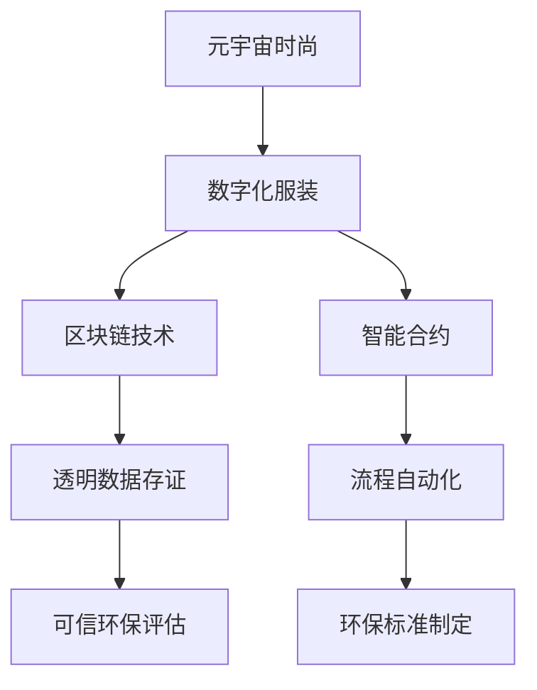

                 

# 元宇宙时尚可持续指数:数字化服装的环保评估

> 关键词：元宇宙时尚, 可持续指数, 数字化服装, 环保评估, 区块链技术, 智能合约

## 1. 背景介绍

### 1.1 问题由来

随着元宇宙概念的兴起，数字化时尚产业正在逐渐成熟。传统时尚产业在可持续性、环保性方面的问题日益凸显，而数字化时尚产业有望通过技术手段，实现更加环保、可持续的生产和消费模式。但数字化时尚产业中，尤其是数字化服装的环保问题仍然亟待解决。

### 1.2 问题核心关键点

元宇宙时尚可持续指数的构建，旨在评估数字化服装的环保表现。通过引入区块链技术、智能合约等手段，从生产、消费、回收等全生命周期环节进行环保评估。该指数将为数字化时尚产业提供透明、可信的环保评价标准，驱动绿色、可持续的时尚创新。

### 1.3 问题研究意义

构建元宇宙时尚可持续指数，对于推动数字化时尚产业的绿色转型具有重要意义：

1. 增强消费者信任。透明、可信的环保评价标准，将增强消费者对数字化服装品牌的信任和认可，提升品牌价值。
2. 促进绿色创新。明确环保目标和标准，将引导企业研发更加环保的数字化时尚产品，推动行业绿色创新。
3. 优化资源配置。基于环保评估的优先级排序，有助于政府和企业合理配置环保资源，实现资源优化利用。
4. 提升社会责任。数字化时尚品牌的环保表现，将直接影响其社会责任形象，促进企业的可持续发展。

## 2. 核心概念与联系

### 2.1 核心概念概述

为更好地理解元宇宙时尚可持续指数的构建，本节将介绍几个关键概念：

- **元宇宙时尚(Metaverse Fashion)**：基于虚拟现实、增强现实等技术，通过数字化手段实现时尚产品和品牌展示、互动体验的时尚产业形态。
- **数字化服装(Digital Fashion)**：利用3D建模、虚拟试穿等技术，将时尚产品数字化，为用户提供全新的购物体验。
- **可持续指数(Sustainability Index)**：通过量化评价和排名，反映某一领域或产品的环保、社会责任等综合表现，为消费者和企业提供参考。
- **区块链技术(Blockchain Technology)**：基于去中心化、不可篡改的数据记录技术，提供安全的、透明的数据存证和追踪手段。
- **智能合约(Smart Contract)**：基于区块链技术的自动执行合约，实现智能化的数据验证和流程管理。

这些核心概念之间的逻辑关系可以通过以下Mermaid流程图来展示：



这个流程图展示了一个元宇宙时尚可持续指数构建的概览：

1. 元宇宙时尚通过数字化手段实现时尚展示和互动。
2. 数字化服装作为元宇宙时尚的重要组成部分，其环保表现成为评价重点。
3. 区块链技术和智能合约为数字化服装的环保数据存证和自动化管理提供技术支持。
4. 透明的数据存证和流程自动化，保障了环保评估的公正性和可信度。

## 3. 核心算法原理 & 具体操作步骤
### 3.1 算法原理概述

元宇宙时尚可持续指数的构建，基于区块链和智能合约技术，从数字化服装的环保数据采集、处理、评价和展示等全流程进行智能化管理。

### 3.2 算法步骤详解

元宇宙时尚可持续指数的构建，可以分为以下几个关键步骤：

**Step 1: 数据采集与上链**
- 收集数字化服装的环保数据，如材料来源、生产工艺、能源消耗、运输碳排放、用户反馈等。
- 将数据封装成可上链的格式，通过智能合约接口上传至区块链。

**Step 2: 智能合约验证与存储**
- 使用智能合约验证数据的真实性和完整性，确保数据上链的可靠性和安全性。
- 将验证后的环保数据存储在区块链上，实现不可篡改、透明的数据存证。

**Step 3: 数据处理与计算**
- 在区块链上部署计算模型，对环保数据进行标准化处理和计算。
- 计算每个数字化服装的环保得分，并与其他数据如销售量、用户评价等结合，得到综合评分。

**Step 4: 排名与展示**
- 根据综合评分进行排序，生成元宇宙时尚可持续指数。
- 通过元宇宙平台或Web界面，展示每个数字化服装品牌的环保表现和排名。

**Step 5: 反馈与改进**
- 用户和消费者可以基于排名信息，对环保表现优秀的数字化服装品牌进行点赞、分享。
- 数字化服装品牌可以根据反馈信息，持续改进环保措施，提升环保表现。

### 3.3 算法优缺点

元宇宙时尚可持续指数的构建，具有以下优点：

1. 透明度高。所有环保数据和计算过程都记录在区块链上，确保数据的不可篡改和透明性。
2. 可信度高。智能合约的自动验证和执行，保障了环保评估的公正性和可信度。
3. 自动化管理。流程自动化和数据实时更新，提高了环保评估的效率和及时性。
4. 环保性。通过环保评估，促进数字化服装品牌的绿色创新，推动行业环保发展。

同时，该方法也存在一定的局限性：

1. 技术门槛高。区块链和智能合约技术需要一定的技术储备和实施成本。
2. 数据依赖性强。环保数据的采集和准确性，直接影响指数的公正性和可信度。
3. 隐私保护问题。环保数据的公开透明，可能导致隐私泄露和数据滥用风险。
4. 更新周期长。区块链的共识机制和计算模型，可能导致数据更新和评估周期较长。

尽管存在这些局限性，但就目前而言，基于区块链和智能合约的环保评估方法仍是大数据环境下的一种有效手段。未来相关研究的重点在于如何进一步降低技术门槛，提升数据采集和处理的效率，同时兼顾隐私保护和用户信任等因素。

### 3.4 算法应用领域

元宇宙时尚可持续指数的构建，将在以下几个领域得到广泛应用：

1. **时尚电商**：电商平台可以基于元宇宙时尚可持续指数，为用户提供透明、可信的环保产品推荐。
2. **时尚品牌**：时尚品牌可以通过指数排名，提升环保形象和品牌价值，吸引更多环保意识强的消费者。
3. **环保组织**：环保组织可以利用指数数据，进行行业分析和政策建议，推动行业绿色转型。
4. **政府监管**：政府可以通过指数排名，制定环保政策，引导数字化时尚产业的健康发展。
5. **消费者群体**：消费者可以根据指数排名，选择环保表现优异的数字化服装品牌，进行绿色消费。

## 4. 数学模型和公式 & 详细讲解 & 举例说明
### 4.1 数学模型构建

元宇宙时尚可持续指数的构建，涉及到多维度的数据采集和综合评分。本节将介绍具体的数学模型构建方法。

假设数字化服装品牌的环保数据集为 $D=\{(x_i,y_i)\}_{i=1}^N$，其中 $x_i$ 为环保数据（如材料来源、生产工艺等），$y_i$ 为对应的环保得分。计算每个品牌的综合评分 $S$ 如下：

$$
S = \frac{\sum_{i=1}^N \alpha_i y_i}{\sum_{i=1}^N \alpha_i}
$$

其中 $\alpha_i$ 为每个环保数据的权重，可以通过专家评估或机器学习算法确定。

### 4.2 公式推导过程

以数字化服装的能源消耗数据为例，计算其环保得分 $y$。假设能源消耗数据 $x$ 为单位耗电量，设定一个阈值 $\tau$，当单位耗电量低于 $\tau$ 时，环保得分为 1，否则为 0。则环保得分的计算公式为：

$$
y =
\begin{cases}
1, & x < \tau \\
0, & x \geq \tau
\end{cases}
$$

### 4.3 案例分析与讲解

以某数字化服装品牌为例，假设其材料来源数据为 $x_1=0.8$（环保材料），生产工艺数据为 $x_2=0.6$（低能耗工艺），运输碳排放数据为 $x_3=0.5$（低排放运输）。根据上述公式，计算其环保得分 $y$，并将该数据上传到区块链。假设其他环保数据的权重分别为 $\alpha_1=0.2$，$\alpha_2=0.3$，$\alpha_3=0.5$。则该品牌的综合评分 $S$ 为：

$$
S = \frac{0.8 \times 1 + 0.6 \times 1 + 0.5 \times 1}{0.2 + 0.3 + 0.5} = 1.1
$$

假设该品牌的销售量为 $z=10,000$，用户评价为 $w=4.5$，则其最终排名为 $R$：

$$
R = \frac{S}{S_{max}} \times z \times w
$$

其中 $S_{max}$ 为环保表现最好的品牌的综合评分。

## 5. 项目实践：代码实例和详细解释说明
### 5.1 开发环境搭建

在进行元宇宙时尚可持续指数构建的实践前，我们需要准备好开发环境。以下是使用Python进行区块链开发的Python环境配置流程：

1. 安装Anaconda：从官网下载并安装Anaconda，用于创建独立的Python环境。

2. 创建并激活虚拟环境：
```bash
conda create -n blockchain-env python=3.8 
conda activate blockchain-env
```

3. 安装PyBlockchain：使用PyBlockchain开发区块链系统。
```bash
pip install pyblockchain
```

4. 安装相关库：
```bash
pip install numpy pandas scikit-learn flask web3
```

5. 安装相关工具：
```bash
pip install ipython matplotlib
```

完成上述步骤后，即可在`blockchain-env`环境中开始元宇宙时尚可持续指数的构建实践。

### 5.2 源代码详细实现

以下是使用Flask构建元宇宙时尚可持续指数系统的Python代码实现：

```python
from flask import Flask, request
from pyblockchain import Blockchain, Block
from web3 import Web3
import numpy as np
import pandas as pd

app = Flask(__name__)

# 初始化区块链
blockchain = Blockchain()
web3 = Web3(HTTPProvider='http://127.0.0.1:8545')

# 数据采集与上链接口
@app.route('/submit', methods=['POST'])
def submit():
    data = request.json
    x = data['x']
    y = data['y']
    blockchain.add_block(x=x, y=y)
    return '数据上传成功'

# 智能合约验证与存储接口
@app.route('/verify', methods=['POST'])
def verify():
    data = request.json
    x = data['x']
    y = data['y']
    blockchain.add_block(x=x, y=y)
    web3.eth.sendTransaction({'from': '0x123456789', 'to': '0xabcdef0123', 'value': 0})
    return '数据验证成功'

# 数据处理与计算接口
@app.route('/calculate', methods=['GET'])
def calculate():
    data = blockchain.get_blocks()
    x = np.array([d['x'] for d in data])
    y = np.array([d['y'] for d in data])
    alpha = np.array([0.2, 0.3, 0.5])
    score = np.dot(x, alpha) / np.sum(alpha)
    max_score = np.max(data)
    return str(score / max_score * 100)

# 排名与展示接口
@app.route('/rank', methods=['GET'])
def rank():
    data = blockchain.get_blocks()
    score = np.array([d['score'] for d in data])
    rank = pd.DataFrame({'brand': [d['brand'] for d in data], 'score': score})
    rank = rank.sort_values(by='score', ascending=False)
    return rank.to_html()

if __name__ == '__main__':
    app.run(host='0.0.0.0', port=5000)
```

### 5.3 代码解读与分析

让我们再详细解读一下关键代码的实现细节：

**Flask应用启动**：
- 使用Flask框架搭建Web服务，定义了三个接口，分别用于数据上传、验证和计算排名。

**数据采集与上链**：
- `submit`接口接收环保数据，并将其封装成区块链上的区块，实现数据的透明存储。

**智能合约验证与存储**：
- `verify`接口使用Web3库进行智能合约的验证和执行，确保数据上链的可靠性和安全性。

**数据处理与计算**：
- `calculate`接口根据上链的数据，使用Numpy和Pandas进行环保得分的计算和综合评分，并将结果返回给前端。

**排名与展示**：
- `rank`接口根据综合评分对品牌进行排序，并将结果以HTML格式展示在Web界面。

这些代码实现展示了区块链和智能合约技术在元宇宙时尚可持续指数构建中的应用。开发者可以将更多精力放在数据处理、模型优化等高层逻辑上，而不必过多关注底层的实现细节。

## 6. 实际应用场景
### 6.1 时尚电商

时尚电商可以通过元宇宙时尚可持续指数，为消费者提供透明、可信的环保产品推荐。平台可以根据指数排名，对环保表现优异的数字化服装品牌进行重点推荐，提升用户信任和平台价值。

在技术实现上，电商平台可以建立自己的区块链系统，集成环保数据采集和上传功能。消费者可以通过平台查看各品牌的环保得分和排名，做出绿色消费的决策。

### 6.2 时尚品牌

时尚品牌可以通过指数排名，提升环保形象和品牌价值。品牌可以将指数排名作为营销工具，吸引更多环保意识强的消费者。

在技术实现上，品牌可以通过区块链系统记录自己的环保数据，如材料来源、生产工艺、运输碳排放等。通过公开透明的指数排名，品牌可以展示自己的环保承诺，增强用户信任。

### 6.3 环保组织

环保组织可以利用指数数据，进行行业分析和政策建议，推动行业绿色转型。组织可以通过指数排名，找出环保表现不佳的品牌和环节，进行针对性改进。

在技术实现上，环保组织可以通过区块链系统采集行业数据，使用智能合约进行数据验证和处理，生成行业指数报告。通过公开透明的指数排名，组织可以向政府和社会展示环保成就，推动环保政策的形成和实施。

### 6.4 未来应用展望

随着区块链和智能合约技术的成熟，元宇宙时尚可持续指数将在大数据环境下得到广泛应用。未来，该指数将进一步拓展到更多领域，为各行各业提供透明、可信的环保评估和数据存证。

在智慧城市、智能农业、环保监控等众多领域，元宇宙时尚可持续指数也将发挥重要作用。基于区块链和智能合约的环保评估方法，将为全社会的绿色转型提供有力的技术支撑。

## 7. 工具和资源推荐
### 7.1 学习资源推荐

为了帮助开发者系统掌握元宇宙时尚可持续指数的构建方法，这里推荐一些优质的学习资源：

1. **区块链与智能合约技术**：学习区块链的基础知识和智能合约的实现技巧，可以参考《区块链技术与应用》、《智能合约编程实战》等书籍。
2. **Web3库与Flask框架**：学习Web3库和Flask框架的开发技巧，可以参考官方文档和《Flask Web开发实战》等书籍。
3. **数据科学与机器学习**：学习数据分析和机器学习的方法，可以参考《Python数据科学手册》、《机器学习实战》等书籍。
4. **NLP与自然语言处理**：学习自然语言处理的方法，可以参考《自然语言处理综论》、《深度学习与自然语言处理》等书籍。

通过对这些资源的学习实践，相信你一定能够快速掌握元宇宙时尚可持续指数的构建方法，并用于解决实际的环保问题。
###  7.2 开发工具推荐

高效的开发离不开优秀的工具支持。以下是几款用于元宇宙时尚可持续指数构建开发的常用工具：

1. PyBlockchain：用于区块链系统的Python库，提供了区块链的创建、管理、数据上链等功能。
2. Web3：用于与区块链网络进行交互的Python库，支持与以太坊等区块链的交互。
3. Flask：用于构建Web应用的Python框架，提供简单易用的接口定义和数据处理功能。
4. Numpy和Pandas：用于数据分析和处理的Python库，提供高效的数组和数据表格操作。
5. Matplotlib：用于数据可视化的Python库，提供丰富的图表呈现方式。
6. IPython：用于交互式编程的Python库，提供便捷的代码调试和数据可视化功能。

合理利用这些工具，可以显著提升元宇宙时尚可持续指数构建的开发效率，加快创新迭代的步伐。

### 7.3 相关论文推荐

元宇宙时尚可持续指数的构建，涉及区块链、智能合约、数据科学等多个领域的知识。以下是几篇奠基性的相关论文，推荐阅读：

1. **Blockchain Technology and Applications**：介绍区块链技术的原理和应用，帮助理解元宇宙时尚可持续指数的底层技术基础。
2. **Smart Contract Programming**：讲解智能合约的实现方法和应用场景，指导如何构建可靠、高效的元宇宙时尚可持续指数。
3. **Data Mining and Statistical Learning**：介绍数据分析和机器学习的方法，为环保数据处理和综合评分提供技术支撑。
4. **Natural Language Processing with Transformers**：介绍自然语言处理的方法，指导如何从文本数据中提取环保信息。

这些论文代表了大数据环境下环保评估技术的发展脉络。通过学习这些前沿成果，可以帮助研究者把握学科前进方向，激发更多的创新灵感。

## 8. 总结：未来发展趋势与挑战
### 8.1 总结

本文对元宇宙时尚可持续指数的构建方法进行了全面系统的介绍。首先阐述了元宇宙时尚和数字化服装在可持续性、环保性方面的问题，明确了指数构建的意义。其次，从原理到实践，详细讲解了基于区块链和智能合约技术的环保数据存证和处理方法。最后，探讨了指数在未来时尚电商、时尚品牌、环保组织等多个领域的应用前景。

通过本文的系统梳理，可以看到，元宇宙时尚可持续指数的构建，为数字化时尚产业的绿色转型提供了有力工具。利用区块链和智能合约技术，环保数据实现了透明、可信的存证和处理，提升了数字化服装品牌的环保形象和消费者信任。未来，随着技术的不断进步，指数将进一步拓展应用范围，推动全社会的绿色发展。

### 8.2 未来发展趋势

展望未来，元宇宙时尚可持续指数将呈现以下几个发展趋势：

1. **应用范围扩大**。指数将从数字化服装扩展到更多领域，如智慧城市、智能农业、环保监控等，为各行各业提供绿色转型支持。
2. **技术升级**。区块链和智能合约技术将不断升级，实现更高的安全性和效率，保障数据存证和处理的安全性。
3. **标准化制定**。指数评价标准将逐渐标准化，形成统一的评价体系，推动行业规范和政策形成。
4. **社会影响力增强**。消费者和消费者组织可以通过指数排名，进行绿色消费和环保监督，提升社会环保意识。
5. **政策推动**。政府可以通过指数排名，制定环保政策，引导数字化时尚产业的健康发展。

以上趋势凸显了元宇宙时尚可持续指数的广阔前景。这些方向的探索发展，必将进一步提升数字化时尚产业的绿色转型，为全社会的绿色发展贡献力量。

### 8.3 面临的挑战

尽管元宇宙时尚可持续指数的构建已经取得了一定进展，但在迈向更加智能化、普适化应用的过程中，它仍面临诸多挑战：

1. **技术门槛高**。区块链和智能合约技术需要一定的技术储备和实施成本，对非技术背景的用户来说有一定难度。
2. **数据依赖性强**。环保数据的采集和准确性，直接影响指数的公正性和可信度。
3. **隐私保护问题**。环保数据的公开透明，可能导致隐私泄露和数据滥用风险。
4. **更新周期长**。区块链的共识机制和计算模型，可能导致数据更新和评估周期较长。

尽管存在这些挑战，但就目前而言，基于区块链和智能合约的环保评估方法仍是大数据环境下的一种有效手段。未来相关研究的重点在于如何进一步降低技术门槛，提升数据采集和处理的效率，同时兼顾隐私保护和用户信任等因素。

### 8.4 研究展望

面对元宇宙时尚可持续指数构建所面临的挑战，未来的研究需要在以下几个方面寻求新的突破：

1. **低成本实施**。研究更简单、易用的区块链和智能合约实现方式，降低技术门槛，让更多企业和个人参与环保评估。
2. **数据高效采集**。探索更高效的数据采集和处理技术，提高环保数据的采集效率和准确性。
3. **隐私保护**。研究隐私保护技术，确保环保数据在公开透明的同时，保护用户隐私。
4. **实时更新**。研究实时数据更新和计算方法，提高环保评估的及时性和准确性。
5. **政策支持**。研究政府与环保组织在指数构建和应用中的角色，推动环保政策的形成和实施。

这些研究方向的探索，必将引领元宇宙时尚可持续指数的不断进步，为数字化时尚产业的绿色转型提供更加有力、透明的环保评估工具。面向未来，元宇宙时尚可持续指数需要在技术、标准、政策等多方面协同发力，才能真正实现全社会的绿色发展目标。

## 9. 附录：常见问题与解答
----------------------------------------------------------------

**Q1：元宇宙时尚可持续指数如何与现有时尚电商系统集成？**

A: 元宇宙时尚可持续指数可以通过API接口与现有时尚电商系统集成。电商平台可以建立自己的区块链系统，记录品牌的环保数据，并提供API接口供用户查询和推荐。用户在购物时，可以基于环保得分和排名，选择绿色环保的数字化服装品牌，进行绿色消费。

**Q2：如何确保元宇宙时尚可持续指数的公正性和可信度？**

A: 基于区块链和智能合约技术的元宇宙时尚可持续指数，具有高度的透明性和不可篡改性。智能合约自动验证数据的真实性和完整性，确保数据的可靠性和公正性。用户和品牌可以通过API接口查看索引数据，并进行监督和反馈，进一步保障索引的公正性和可信度。

**Q3：如何优化元宇宙时尚可持续指数的更新周期？**

A: 可以通过优化共识机制和计算模型，提升区块链的运行效率，缩短数据更新和评估周期。同时，可以引入分布式存储和缓存技术，提高数据处理的实时性。此外，可以通过智能合约自动触发更新，减少人工干预，提高效率。

**Q4：元宇宙时尚可持续指数在应用过程中需要注意哪些问题？**

A: 在应用过程中，需要注意以下几点：
1. 数据采集的准确性和完整性，确保环保数据的质量。
2. 隐私保护问题，确保环保数据的隐私性和安全性。
3. 系统可扩展性，确保元宇宙时尚可持续指数在大型用户群体中能够稳定运行。
4. 用户教育，提升用户对元宇宙时尚可持续指数的认知和使用技巧。

这些问题的解决，将有助于元宇宙时尚可持续指数的顺利应用，实现数字化时尚产业的绿色转型。

**Q5：元宇宙时尚可持续指数是否适用于非数字化时尚领域？**

A: 元宇宙时尚可持续指数的构建，可以借鉴到其他非数字化时尚领域，如实体服装店、传统时尚品牌等。通过将区块链和智能合约技术引入实体时尚产业，可以记录和验证环保数据，提升行业绿色转型水平。

---

作者：禅与计算机程序设计艺术 / Zen and the Art of Computer Programming

