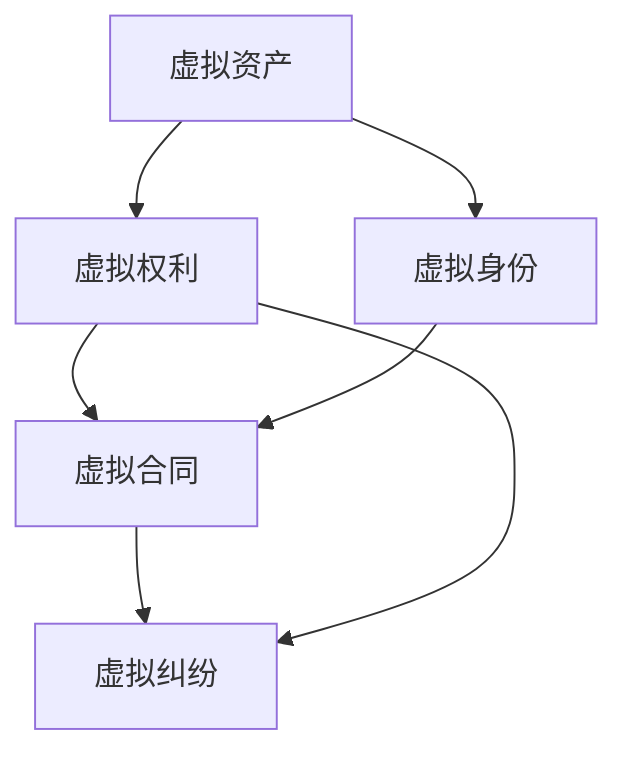

                 

# 元宇宙法律:虚拟世界的规则制定

## 1. 背景介绍

随着虚拟现实、增强现实、区块链、人工智能等技术的成熟，元宇宙（Metaverse）正在从科幻走向现实，逐渐成为人类生活和生产的重要组成部分。元宇宙是由虚拟世界、虚拟经济、虚拟社会共同组成的、高度沉浸的虚拟空间，人们在元宇宙中可以进行工作、娱乐、社交、交易等活动，体验全新的生活和工作方式。然而，元宇宙的蓬勃发展也带来了诸多挑战和风险，尤其是法律、伦理和隐私等问题的出现。元宇宙法律的制定成为了一个亟待解决的问题。

### 1.1 元宇宙法律的背景

元宇宙是一个虚拟与现实交织的空间，用户在虚拟世界中拥有数字身份，参与各种虚拟活动，与他人进行交互。元宇宙法律需要规范虚拟世界中的行为，保护用户的合法权益，维护元宇宙的健康发展。在当前法律体系中，元宇宙的法律规制还处于起步阶段，许多问题尚待解决。例如，如何界定虚拟资产所有权？如何处理元宇宙中的违约行为？如何保护用户隐私？这些问题都需要通过法律手段来予以解决。

## 2. 核心概念与联系

### 2.1 核心概念概述

元宇宙法律的核心概念包括虚拟资产、虚拟身份、虚拟权利、虚拟合同、虚拟纠纷等。这些概念相互联系，构成了元宇宙法律的基础。

- 虚拟资产：指在元宇宙中存在的任何形式的数字财产，如虚拟土地、虚拟物品、虚拟货币等。
- 虚拟身份：指用户在元宇宙中扮演的角色，通常由用户的现实身份和虚拟身份相结合，形成“数字化身份”。
- 虚拟权利：指用户或实体在元宇宙中享有的各项权利，包括虚拟财产权、隐私权、表达权等。
- 虚拟合同：指用户或实体在元宇宙中进行交易或合作时所签订的协议。
- 虚拟纠纷：指用户或实体在元宇宙中发生的各种争议，如虚拟财产纠纷、违约纠纷等。

这些核心概念之间存在着紧密的联系，共同构成了元宇宙法律的基本框架。

### 2.2 核心概念原理和架构的 Mermaid 流程图



这个流程图展示了虚拟资产、虚拟身份、虚拟权利、虚拟合同和虚拟纠纷之间的逻辑关系。虚拟资产和虚拟权利是元宇宙法律的核心，虚拟身份和虚拟合同是虚拟资产和虚拟权利的载体，而虚拟纠纷则可能发生在上述各领域。

## 3. 核心算法原理 & 具体操作步骤

### 3.1 算法原理概述

元宇宙法律的核心算法原理是基于元宇宙的特性，采用区块链技术实现数字身份和权利的保护，采用智能合约技术实现虚拟合同的自动化执行，采用去中心化自治组织（DAO）技术实现虚拟纠纷的自治解决。

- 区块链技术：通过分布式账本和加密技术，实现虚拟资产和虚拟权利的保护，防止篡改和滥用。
- 智能合约技术：通过代码实现虚拟合同的自动化执行，降低交易成本，提高交易效率。
- 去中心化自治组织（DAO）技术：通过社区共识和算法规则，实现虚拟纠纷的自治解决，避免中心化机构的干预。

### 3.2 算法步骤详解

#### 3.2.1 虚拟资产的登记与保护

步骤1：采用区块链技术，为虚拟资产登记信息，包括资产名称、所有者、数量、位置等。

步骤2：采用加密算法，保护虚拟资产信息，防止信息泄露和篡改。

步骤3：采用去中心化存储，确保虚拟资产信息在多个节点上的分布存储，防止单点故障。

#### 3.2.2 虚拟身份的创建与保护

步骤1：用户在元宇宙中创建虚拟身份，通过加密技术保护身份信息。

步骤2：采用数字证书技术，验证用户的虚拟身份，防止身份冒用。

步骤3：采用权限管理技术，限制用户对虚拟资产和虚拟权利的访问权限，防止滥用。

#### 3.2.3 虚拟合同的签订与执行

步骤1：采用智能合约技术，通过代码实现虚拟合同的自动执行。

步骤2：采用密码学技术，确保合同的不可篡改和不可抵赖性。

步骤3：采用去中心化共识机制，确保合同执行的公平性和透明度。

#### 3.2.4 虚拟纠纷的解决

步骤1：采用社区共识机制，制定虚拟纠纷的自治解决规则。

步骤2：采用去中心化自治组织（DAO）技术，实现虚拟纠纷的自治解决。

步骤3：采用仲裁机制，处理无法自治解决的纠纷。

### 3.3 算法优缺点

#### 3.3.1 优点

- 安全性：通过区块链和加密技术，保护虚拟资产和虚拟权利的安全。
- 效率性：通过智能合约和去中心化自治组织，提高交易和纠纷解决的效率。
- 公平性：通过去中心化共识机制，确保交易和纠纷解决的公平性。

#### 3.3.2 缺点

- 复杂性：元宇宙法律的制定和实施相对复杂，需要多方协调和共识。
- 成本高：采用区块链和智能合约技术，需要较高的技术开发和维护成本。
- 适用性：元宇宙法律还需要在实践中不断完善和调整，以适应不断变化的虚拟环境。

### 3.4 算法应用领域

元宇宙法律的应用领域包括虚拟财产保护、虚拟身份认证、虚拟合同执行、虚拟纠纷解决等。这些领域是元宇宙发展的基础，需要法律予以规范和保护。

- 虚拟财产保护：通过区块链和加密技术，保护虚拟资产和虚拟权利。
- 虚拟身份认证：通过数字证书和权限管理技术，确保用户的虚拟身份安全。
- 虚拟合同执行：通过智能合约技术，实现虚拟合同的自动化执行。
- 虚拟纠纷解决：通过社区共识和仲裁机制，解决虚拟纠纷。

## 4. 数学模型和公式 & 详细讲解 & 举例说明

### 4.1 数学模型构建

元宇宙法律的数学模型主要基于区块链技术、智能合约技术和去中心化自治组织（DAO）技术。

- 区块链模型：采用分布式账本技术，确保数据的安全性和不可篡改性。
- 智能合约模型：通过代码实现虚拟合同的自动执行，确保交易的效率和公平性。
- DAO模型：通过社区共识机制和算法规则，实现虚拟纠纷的自治解决。

### 4.2 公式推导过程

以智能合约模型为例，智能合约的执行过程可以通过以下公式推导：

$$
F(\mathbf{x},\mathbf{y}) = \begin{cases}
T(\mathbf{x},\mathbf{y}) & \text{if } C(\mathbf{x},\mathbf{y}) = 1 \\
N(\mathbf{x},\mathbf{y}) & \text{if } C(\mathbf{x},\mathbf{y}) = 0
\end{cases}
$$

其中，$F(\mathbf{x},\mathbf{y})$表示智能合约的执行结果，$T(\mathbf{x},\mathbf{y})$表示交易成功，$N(\mathbf{x},\mathbf{y})$表示交易失败，$C(\mathbf{x},\mathbf{y})$表示合同状态。

### 4.3 案例分析与讲解

以虚拟财产保护为例，区块链技术的核心算法是分布式账本和共识机制。

- 分布式账本：通过在多个节点上分布存储虚拟资产信息，确保数据的安全性和不可篡改性。
- 共识机制：通过多方共识，确保虚拟资产信息的准确性和透明性。

智能合约技术的核心算法是代码执行和自动验证。

- 代码执行：通过代码实现虚拟合同的自动执行，降低交易成本，提高交易效率。
- 自动验证：通过代码验证合同的执行结果，确保合同的不可篡改性和不可抵赖性。

去中心化自治组织（DAO）技术的核心算法是社区共识和算法规则。

- 社区共识：通过社区成员的投票和共识，制定虚拟纠纷的自治解决规则。
- 算法规则：通过算法规则，实现虚拟纠纷的自治解决，避免中心化机构的干预。

## 5. 项目实践：代码实例和详细解释说明

### 5.1 开发环境搭建

在进行元宇宙法律项目实践前，需要准备好开发环境。以下是使用Python进行开发的环境配置流程：

1. 安装Anaconda：从官网下载并安装Anaconda，用于创建独立的Python环境。

2. 创建并激活虚拟环境：
```bash
conda create -n metaverse-env python=3.8 
conda activate metaverse-env
```

3. 安装相关库：
```bash
pip install ethereum web3 pysha3
```

### 5.2 源代码详细实现

以下是使用Python和Web3库实现虚拟资产登记的代码：

```python
from web3 import Web3
from web3.eth.account import Account
from pysha3 import keccak_256

# 连接以太坊网络
web3 = Web3(Web3.HTTPProvider('http://localhost:8545'))

# 创建虚拟资产合约
contract_address = '0x1234567890abcdef'
virtual_asset_abi = [
    {'type': 'constructor', 'name': 'virtual_asset', 'inputs': [{'type': 'address', 'name': 'owner'}]}
]

contract = web3.eth.contract(address=contract_address, abi=virtual_asset_abi)

# 登记虚拟资产
asset_name = 'Virtual Land'
asset_owner = '0xabcdef12345678'
quantity = 10
location = 'Metaverse City'

# 将虚拟资产信息转换为合同参数
hasher = keccak_256
asset_hash = hasher(asset_name.encode() + asset_owner.encode() + quantity.encode() + location.encode())

# 创建虚拟资产对象
virtual_asset = contract.functions.virtual_asset(asset_hash)
transaction = virtual_asset.send({'from': asset_owner, 'value': 0, 'gas': 200000})

# 查询虚拟资产信息
asset_info = contract.functions.asset_info(asset_hash).call({'from': asset_owner})
print(f"Asset Name: {asset_info[0]}\nAsset Owner: {asset_info[1]}\nQuantity: {asset_info[2]}\nLocation: {asset_info[3]}")
```

### 5.3 代码解读与分析

以上代码展示了如何使用Web3库在以太坊上登记虚拟资产。关键步骤如下：

- 连接以太坊网络，创建虚拟资产合约。
- 登记虚拟资产信息，包括资产名称、所有者、数量、位置等。
- 将虚拟资产信息转换为合同参数，并创建虚拟资产对象。
- 查询虚拟资产信息，输出资产的名称、所有者、数量和位置。

### 5.4 运行结果展示

运行以上代码，即可在以太坊网络上成功登记虚拟资产，并输出资产信息。

```bash
Asset Name: Virtual Land
Asset Owner: 0xabcdef12345678
Quantity: 10
Location: Metaverse City
```

## 6. 实际应用场景

### 6.1 元宇宙虚拟财产保护

元宇宙虚拟财产保护是元宇宙法律的核心应用场景之一。虚拟财产包括虚拟土地、虚拟物品、虚拟货币等，是元宇宙用户的重要资产。元宇宙法律需要规范虚拟财产的登记、保护、转让、纠纷解决等环节，确保用户权益。

以虚拟土地为例，虚拟土地的登记和管理可以采用区块链技术，确保土地的安全性和不可篡改性。同时，采用智能合约技术，实现土地的转让和租金收取，降低交易成本，提高交易效率。一旦发生土地纠纷，可以采用去中心化自治组织（DAO）技术，通过社区共识和算法规则，实现自治解决。

### 6.2 元宇宙虚拟身份认证

元宇宙虚拟身份认证是元宇宙法律的另一重要应用场景。用户在元宇宙中创建虚拟身份，需要验证身份的真实性和安全性。采用数字证书技术，结合权限管理技术，确保用户的虚拟身份不被冒用。同时，采用区块链技术，保护用户的数字证书，防止信息泄露和篡改。

以虚拟身份认证为例，用户可以在元宇宙中创建虚拟身份，并通过数字证书技术进行身份验证。数字证书中包含了用户的公钥、私钥和身份信息，确保身份的真实性。采用权限管理技术，限制用户对虚拟资产和虚拟权利的访问权限，防止滥用。

### 6.3 元宇宙虚拟合同执行

元宇宙虚拟合同执行是元宇宙法律的重要应用场景之一。用户在元宇宙中进行交易或合作时，通常需要签订虚拟合同。采用智能合约技术，通过代码实现虚拟合同的自动执行，降低交易成本，提高交易效率。同时，采用密码学技术，确保合同的不可篡改和不可抵赖性。

以虚拟土地交易为例，用户可以通过智能合约技术，实现土地的转让和租金收取。智能合约中包含土地的信息、转让条件、租金条款等，通过代码自动执行合同。采用密码学技术，确保合同的不可篡改和不可抵赖性，防止合同被篡改和抵赖。

### 6.4 元宇宙虚拟纠纷解决

元宇宙虚拟纠纷解决是元宇宙法律的另一重要应用场景。用户在元宇宙中进行交易或合作时，可能会发生各种纠纷。采用社区共识机制，制定虚拟纠纷的自治解决规则，通过去中心化自治组织（DAO）技术，实现虚拟纠纷的自治解决。无法自治解决的纠纷，可以采用仲裁机制，处理纠纷。

以虚拟土地纠纷为例，用户可以通过社区共识机制，制定土地纠纷的自治解决规则。社区成员可以通过投票，决定纠纷的解决方式。采用去中心化自治组织（DAO）技术，实现土地纠纷的自治解决。无法自治解决的纠纷，可以采用仲裁机制，通过第三方仲裁机构解决纠纷。

## 7. 工具和资源推荐

### 7.1 学习资源推荐

为了帮助开发者系统掌握元宇宙法律的理论基础和实践技巧，这里推荐一些优质的学习资源：

1. 《区块链与智能合约》课程：由清华大学开设的区块链课程，系统讲解区块链和智能合约的基本原理和应用场景。

2. 《元宇宙法律概论》书籍：元宇宙法律领域的入门教材，涵盖元宇宙法律的基本概念、原则和实践。

3. 《智能合约开发实战》书籍：介绍智能合约的开发和应用，包括以太坊智能合约的编写和测试。

4. 《DAO技术导论》论文：详细讲解去中心化自治组织（DAO）的基本原理和应用场景，涵盖DAO的治理、决策和执行机制。

5. 《Web3开发入门》课程：介绍Web3开发的基础知识和实践技巧，包括以太坊和Web3.js的使用。

通过对这些资源的学习实践，相信你一定能够快速掌握元宇宙法律的理论基础和实践技巧，并用于解决实际的元宇宙问题。

### 7.2 开发工具推荐

高效的开发离不开优秀的工具支持。以下是几款用于元宇宙法律开发的常用工具：

1. Python：作为元宇宙法律开发的主流语言，Python具有丰富的库和框架，适合开发智能合约和DAO。

2. Web3.js：一个以太坊和以太坊智能合约的JavaScript库，提供与Web3的交互功能。

3. Solidity：以太坊智能合约的编程语言，支持高复杂度的合约编写和部署。

4. MetaMask：一个以太坊钱包，支持以太坊智能合约的交互和调用。

5. Truffle：一个以太坊开发框架，支持智能合约的编写、测试和部署。

合理利用这些工具，可以显著提升元宇宙法律的开发效率，加快创新迭代的步伐。

### 7.3 相关论文推荐

元宇宙法律的研究源于学界的持续研究。以下是几篇奠基性的相关论文，推荐阅读：

1. "Blockchain: Concepts, Architectures, and Impact"：由Geman等人发表的区块链综述论文，系统介绍了区块链的基本原理和应用场景。

2. "The Ethereum Yellow Paper"：以太坊创始人Vitalik Buterin发表的白皮书，详细介绍以太坊的技术架构和智能合约的应用。

3. "DAO: A Framework for Decentralized Autonomy"：DAO领域的奠基性论文，由Anderson等人发表，系统介绍了DAO的基本原理和应用场景。

4. "Blockchain and the Future of the Law"：由Slootweg等人发表的区块链与法律综述论文，探讨区块链对法律和监管的影响。

5. "Smart Contracts and Governance Mechanisms"：由Grimm等人发表的智能合约治理机制论文，探讨智能合约的治理、决策和执行机制。

这些论文代表了大数据与法律领域的发展脉络。通过学习这些前沿成果，可以帮助研究者把握学科前进方向，激发更多的创新灵感。

## 8. 总结：未来发展趋势与挑战

### 8.1 总结

本文对元宇宙法律的制定进行了全面系统的介绍。首先阐述了元宇宙法律的背景和意义，明确了法律规制在元宇宙发展中的重要地位。其次，从原理到实践，详细讲解了元宇宙法律的核心概念和算法原理，给出了元宇宙法律的代码实例和详细解释说明。同时，本文还探讨了元宇宙法律在虚拟财产保护、虚拟身份认证、虚拟合同执行、虚拟纠纷解决等实际应用场景中的应用，展示了元宇宙法律的广阔前景。最后，本文精选了元宇宙法律的学习资源和开发工具，力求为读者提供全方位的技术指引。

通过本文的系统梳理，可以看到，元宇宙法律的制定和实施对于元宇宙的健康发展至关重要。法律规制的完善，能够保护用户权益，规范市场行为，推动元宇宙的可持续发展。未来，伴随元宇宙技术的不断进步，元宇宙法律也必将不断完善，为元宇宙用户提供更加安全、公正、公平的环境。

### 8.2 未来发展趋势

展望未来，元宇宙法律的发展趋势包括：

1. 法律体系的完善：随着元宇宙的不断发展和成熟，元宇宙法律体系将不断完善，涵盖更多应用场景和法律问题。

2. 跨界合作：元宇宙法律需要多方协同合作，包括政府、企业、学术界和技术界，共同推动法律标准的制定和实施。

3. 技术革新：元宇宙法律需要利用最新技术，如区块链、智能合约和DAO，实现法律规范的数字化和自动化。

4. 用户参与：元宇宙用户应参与法律制定和实施，形成社区共识，增强法律的适应性和包容性。

5. 国际合作：元宇宙是一个全球性的虚拟空间，元宇宙法律需要国际合作，制定统一的法律规范，保障全球用户的权益。

这些趋势凸显了元宇宙法律的前景和挑战，元宇宙法律需要在实践中不断完善，才能真正发挥作用。

### 8.3 面临的挑战

尽管元宇宙法律的发展前景广阔，但在迈向更加智能化、普适化应用的过程中，它仍面临着诸多挑战：

1. 法律适用性：元宇宙的法律体系需要适应不断变化的虚拟环境，如何制定具有普适性的法律规范是一个难题。

2. 法律效力：元宇宙的法律规制需要多方协同合作，如何确保法律的执行力和约束力是一个挑战。

3. 技术漏洞：元宇宙的法律规制需要利用最新技术，但技术漏洞和安全性问题也是一个需要解决的问题。

4. 用户隐私：元宇宙法律需要保护用户隐私，但如何在隐私保护和数据利用之间找到平衡是一个难题。

5. 跨界问题：元宇宙的法律规制需要考虑跨界问题，如何制定统一的国际法律规范是一个挑战。

6. 法律冲突：元宇宙的法律规制需要考虑法律冲突问题，如何协调不同国家法律的差异是一个难题。

这些挑战凸显了元宇宙法律的复杂性和多样性，需要学界和产业界的共同努力，才能逐步解决。

### 8.4 研究展望

面对元宇宙法律所面临的种种挑战，未来的研究需要在以下几个方面寻求新的突破：

1. 制定具有普适性的法律规范：元宇宙法律需要适应不断变化的虚拟环境，制定具有普适性的法律规范，保障全球用户的权益。

2. 探索跨界合作机制：元宇宙法律需要多方协同合作，探索跨界合作机制，确保法律的执行力和约束力。

3. 利用最新技术：元宇宙法律需要利用最新技术，如区块链、智能合约和DAO，实现法律规范的数字化和自动化。

4. 保护用户隐私：元宇宙法律需要保护用户隐私，探索隐私保护的解决方案，平衡隐私保护和数据利用。

5. 解决法律冲突问题：元宇宙法律需要考虑法律冲突问题，探索统一的国际法律规范，协调不同国家法律的差异。

6. 提升法律效用：元宇宙法律需要提升法律效用，通过多方协作和技术创新，确保法律的执行力和约束力。

这些研究方向将引领元宇宙法律的不断完善，为元宇宙用户提供更加安全、公正、公平的环境。

## 9. 附录：常见问题与解答

**Q1：元宇宙法律是否适用于所有元宇宙应用？**

A: 元宇宙法律在大多数元宇宙应用中都能适用，特别是涉及虚拟财产、虚拟身份、虚拟合同、虚拟纠纷等环节的应用。但对于某些特定领域的应用，如医疗、教育等，还需要结合领域特点，制定相应的法律规范。

**Q2：元宇宙法律的制定是否需要多方协同合作？**

A: 是的，元宇宙法律的制定需要多方协同合作，包括政府、企业、学术界和技术界。只有多方协同合作，才能制定出具有普适性和可执行性的法律规范。

**Q3：元宇宙法律的实施是否需要高昂的成本？**

A: 是的，元宇宙法律的实施需要高昂的成本，包括法律规范的制定、技术开发和系统维护等。但随着技术的不断进步，成本也将逐渐降低。

**Q4：元宇宙法律的适用性如何？**

A: 元宇宙法律的适用性取决于具体的应用场景和法律规范。在大多数元宇宙应用中，元宇宙法律能够保护用户的合法权益，规范市场行为。但在某些特定领域的应用中，法律的适用性还需进一步验证和完善。

**Q5：元宇宙法律的适用范围如何？**

A: 元宇宙法律适用于大多数元宇宙应用，特别是涉及虚拟财产、虚拟身份、虚拟合同、虚拟纠纷等环节的应用。但对于某些特定领域的应用，如医疗、教育等，还需要结合领域特点，制定相应的法律规范。

通过本文的系统梳理，可以看到，元宇宙法律的制定和实施对于元宇宙的健康发展至关重要。法律规制的完善，能够保护用户权益，规范市场行为，推动元宇宙的可持续发展。未来，伴随元宇宙技术的不断进步，元宇宙法律也必将不断完善，为元宇宙用户提供更加安全、公正、公平的环境。

---

作者：禅与计算机程序设计艺术 / Zen and the Art of Computer Programming

