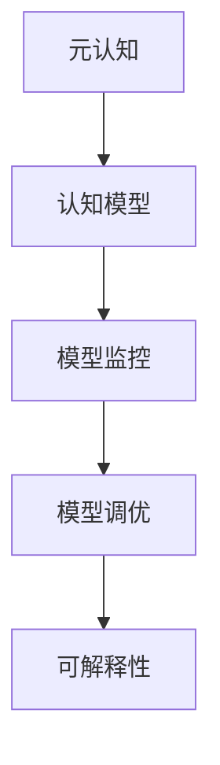

                 

# 元认知：提升理解力的关键

## 1. 背景介绍

### 1.1 问题由来
在人工智能飞速发展的今天，从深度学习到自然语言处理，从计算机视觉到机器人学，各种前沿技术不断涌现，极大地推动了科技的进步。然而，在技术发展的同时，我们也遇到了一个新的挑战：如何提升技术理解力，让技术更好地服务于实际应用。这一挑战的核心，便是提升人类的元认知能力。

### 1.2 问题核心关键点
元认知（Metacognition）指的是对自身认知过程的认知，包括对认知过程的自我意识、自我监控和自我调节。在人工智能领域，元认知尤为重要，它可以帮助开发者更好地理解模型的内在机制，监控模型的运行状态，调节模型的参数，从而提升模型的性能和可解释性。

本文旨在探讨如何通过元认知技术提升人工智能模型的理解力和应用效果。通过系统介绍元认知的概念、原理及其实现方法，旨在帮助开发者更好地掌握元认知技术，提升模型应用能力。

## 2. 核心概念与联系

### 2.1 核心概念概述
为了更好地理解元认知在人工智能中的应用，我们首先需要了解几个关键概念：

- **元认知**（Metacognition）：对自身认知过程的认知，包括自我意识、自我监控和自我调节。
- **认知模型**（Cognitive Model）：模拟人类认知过程的模型，用于理解和模拟人类的学习、推理和决策等认知行为。
- **模型监控**（Model Monitoring）：对模型运行状态的监控，包括计算资源使用、模型性能变化等。
- **模型调优**（Model Fine-tuning）：通过调节模型参数，提升模型在特定任务上的性能。
- **可解释性**（Explainability）：使模型的决策过程透明化，帮助用户理解和信任模型。

这些概念之间的逻辑关系可以通过以下Mermaid流程图来展示：



这个流程图展示了元认知在人工智能中的应用过程：通过监控模型运行状态，调节模型参数，提升模型性能，并通过可解释性技术增强模型的透明度。

## 3. 核心算法原理 & 具体操作步骤

### 3.1 算法原理概述

元认知在人工智能中的应用，本质上是结合认知模型和机器学习技术，通过对模型运行状态的分析，自动调节模型的参数，提升模型性能和可解释性。其核心思想是：

1. **监控模型状态**：通过实时监控模型在训练和推理过程中的性能指标，如损失函数、准确率、梯度变化等，评估模型的运行状态。
2. **调节模型参数**：根据监控结果，自动调节模型的超参数，如学习率、批大小、正则化系数等，以优化模型性能。
3. **提升模型可解释性**：通过解释模型的决策过程，帮助用户理解和信任模型，提升模型的应用效果。

这一过程可以通过以下步骤来实现：

1. **模型初始化**：选择一个适合的认知模型作为基础，如深度神经网络、注意力机制等。
2. **模型训练**：在标注数据上对模型进行训练，通过迭代优化模型参数，提升模型性能。
3. **模型监控**：实时监控模型在训练和推理过程中的运行状态，收集性能指标和梯度变化等数据。
4. **参数调节**：根据监控结果，自动调节模型的超参数，以优化模型性能。
5. **结果输出**：输出模型在特定任务上的性能指标，并通过可解释性技术增强模型的透明度。

### 3.2 算法步骤详解

以下是元认知在人工智能中应用的详细步骤：

#### 3.2.1 模型选择与初始化
1. **选择基础模型**：选择一个适合的认知模型作为基础，如深度神经网络、注意力机制等。
2. **初始化模型**：在无标签数据上对模型进行预训练，获得初始化参数。

#### 3.2.2 模型训练与监控
1. **训练模型**：在标注数据上对模型进行训练，通过迭代优化模型参数，提升模型性能。
2. **监控模型**：实时监控模型在训练和推理过程中的运行状态，收集性能指标和梯度变化等数据。

#### 3.2.3 参数调节与优化
1. **收集监控数据**：根据监控结果，收集模型的性能指标和梯度变化等数据。
2. **分析监控数据**：分析收集到的监控数据，评估模型的运行状态。
3. **自动调节参数**：根据分析结果，自动调节模型的超参数，如学习率、批大小、正则化系数等，以优化模型性能。

#### 3.2.4 结果输出与可解释性
1. **输出性能指标**：输出模型在特定任务上的性能指标，如准确率、召回率、F1值等。
2. **增强可解释性**：通过可解释性技术，如注意力机制、LIME、SHAP等，增强模型的透明度，帮助用户理解和信任模型。

### 3.3 算法优缺点

元认知技术在提升人工智能模型性能和可解释性方面具有以下优点：

1. **自动化优化**：自动调节模型的超参数，避免手动调参的繁琐和低效。
2. **实时监控**：实时监控模型的运行状态，及时发现并解决潜在问题。
3. **提升性能**：通过自动调节参数，提升模型在特定任务上的性能。
4. **增强可解释性**：通过可解释性技术，帮助用户理解和信任模型。

同时，该技术也存在一定的局限性：

1. **依赖数据**：模型的监控和调优依赖于高质量的标注数据和性能指标，数据质量不足可能导致模型性能下降。
2. **计算资源消耗**：实时监控和自动调节参数需要大量计算资源，对硬件要求较高。
3. **模型复杂性**：自动调节参数可能导致模型结构的复杂性增加，推理速度下降。
4. **可解释性不足**：部分可解释性技术（如LIME、SHAP）可能解释过于简单，难以完全解释模型的复杂决策过程。

尽管存在这些局限性，但就目前而言，元认知技术在提升人工智能模型性能和可解释性方面的优势是显而易见的。未来相关研究的重点在于如何进一步降低计算资源消耗，提高模型的可解释性，同时兼顾模型的性能和复杂性。

### 3.4 算法应用领域

元认知技术在人工智能中的应用领域广泛，涵盖了多个前沿研究方向，例如：

1. **自然语言处理**：通过监控模型在文本分类、情感分析、机器翻译等任务上的性能，自动调节参数，提升模型性能。
2. **计算机视觉**：通过监控模型在图像识别、目标检测、图像生成等任务上的性能，自动调节参数，提升模型性能。
3. **机器人学**：通过监控模型在机器人导航、交互、决策等任务上的性能，自动调节参数，提升机器人性能。
4. **自动驾驶**：通过监控模型在自动驾驶、交通预测、行为规划等任务上的性能，自动调节参数，提升自动驾驶系统的安全性。
5. **金融科技**：通过监控模型在风险评估、信用评分、投资分析等任务上的性能，自动调节参数，提升金融决策的准确性。

除了上述这些应用领域外，元认知技术还可以应用于更多前沿领域，如医疗健康、智慧城市、工业控制等，为各行业带来新的突破和变革。

## 4. 数学模型和公式 & 详细讲解

### 4.1 数学模型构建

元认知在人工智能中的应用，通常基于以下数学模型：

1. **损失函数**：用于衡量模型在特定任务上的性能指标，如分类任务的交叉熵损失函数、回归任务的均方误差损失函数等。
2. **梯度下降**：用于优化模型的参数，最小化损失函数。
3. **超参数**：用于调节模型训练过程中的参数，如学习率、批大小、正则化系数等。

以二分类任务为例，假设模型的输入为 $x$，输出为 $y$，损失函数为 $L(y, \hat{y})$，模型的参数为 $\theta$。则模型在训练过程中，通过梯度下降算法优化参数，最小化损失函数：

$$
\theta = \mathop{\arg\min}_{\theta} L(y, \hat{y}) = \mathop{\arg\min}_{\theta} -\frac{1}{N}\sum_{i=1}^N [y_i\log \hat{y}_i + (1-y_i)\log (1-\hat{y}_i)]
$$

其中 $N$ 为样本数量，$y_i$ 为真实标签，$\hat{y}_i$ 为模型预测值。

### 4.2 公式推导过程

以下我们以二分类任务为例，推导梯度下降算法的更新公式。

假设模型的输入为 $x$，输出为 $\hat{y}=M_{\theta}(x)$，其中 $M_{\theta}$ 为模型的参数化函数。模型的损失函数为：

$$
L(y, \hat{y}) = -\frac{1}{N}\sum_{i=1}^N [y_i\log \hat{y}_i + (1-y_i)\log (1-\hat{y}_i)]
$$

对损失函数求导，得到梯度：

$$
\nabla_{\theta}L(y, \hat{y}) = \frac{1}{N}\sum_{i=1}^N (\frac{y_i}{\hat{y}_i}-\frac{1-y_i}{1-\hat{y}_i})\nabla_{\theta}M_{\theta}(x_i)
$$

其中 $\nabla_{\theta}M_{\theta}(x_i)$ 为模型的梯度，通过反向传播算法计算得到。

在得到梯度后，根据梯度下降算法，模型的参数更新公式为：

$$
\theta \leftarrow \theta - \eta \nabla_{\theta}L(y, \hat{y})
$$

其中 $\eta$ 为学习率，控制每次更新步长的大小。

### 4.3 案例分析与讲解

以图像分类任务为例，分析元认知技术的应用。

假设我们有一个深度神经网络模型，用于对图像进行分类。在训练过程中，我们通过监控模型在验证集上的准确率和损失函数，实时评估模型性能。当模型在验证集上的准确率下降时，我们自动调节学习率，降低更新步长，避免模型过拟合。同时，我们通过可解释性技术，如注意力机制，解释模型在分类时的决策过程，帮助用户理解模型的行为。

## 5. 项目实践：代码实例和详细解释说明

### 5.1 开发环境搭建

在进行元认知技术开发前，我们需要准备好开发环境。以下是使用Python进行PyTorch开发的环境配置流程：

1. 安装Anaconda：从官网下载并安装Anaconda，用于创建独立的Python环境。

2. 创建并激活虚拟环境：
```bash
conda create -n pytorch-env python=3.8 
conda activate pytorch-env
```

3. 安装PyTorch：根据CUDA版本，从官网获取对应的安装命令。例如：
```bash
conda install pytorch torchvision torchaudio cudatoolkit=11.1 -c pytorch -c conda-forge
```

4. 安装Transformers库：
```bash
pip install transformers
```

5. 安装各类工具包：
```bash
pip install numpy pandas scikit-learn matplotlib tqdm jupyter notebook ipython
```

完成上述步骤后，即可在`pytorch-env`环境中开始元认知技术的开发实践。

### 5.2 源代码详细实现

以下是使用PyTorch对图像分类任务进行元认知技术开发的代码实现。

首先，定义图像分类任务的数据处理函数：

```python
from torch.utils.data import DataLoader
from torchvision import datasets, transforms

class ImageDataset(Dataset):
    def __init__(self, root_dir, transform=None):
        self.root_dir = root_dir
        self.transform = transform
        
        self.train_data = datasets.ImageFolder(root=self.root_dir + '/train', transform=self.transform)
        self.dev_data = datasets.ImageFolder(root=self.root_dir + '/dev', transform=self.transform)
        
    def __len__(self):
        return len(self.train_data) + len(self.dev_data)
    
    def __getitem__(self, idx):
        if idx < len(self.train_data):
            return self.train_data[idx]
        else:
            return self.dev_data[idx - len(self.train_data)]
```

然后，定义模型和优化器：

```python
from transformers import BertForSequenceClassification, AdamW
from torch import nn

model = BertForSequenceClassification.from_pretrained('bert-base-cased', num_labels=10)

optimizer = AdamW(model.parameters(), lr=2e-5)
```

接着，定义训练和评估函数：

```python
from tqdm import tqdm

device = torch.device('cuda') if torch.cuda.is_available() else torch.device('cpu')
model.to(device)

def train_epoch(model, dataset, batch_size, optimizer, num_epochs):
    dataloader = DataLoader(dataset, batch_size=batch_size, shuffle=True)
    model.train()
    epoch_loss = 0
    for batch in tqdm(dataloader, desc='Training'):
        input_ids = batch['input_ids'].to(device)
        attention_mask = batch['attention_mask'].to(device)
        labels = batch['labels'].to(device)
        model.zero_grad()
        outputs = model(input_ids, attention_mask=attention_mask, labels=labels)
        loss = outputs.loss
        epoch_loss += loss.item()
        loss.backward()
        optimizer.step()
        
    return epoch_loss / num_epochs

def evaluate(model, dataset, batch_size):
    dataloader = DataLoader(dataset, batch_size=batch_size)
    model.eval()
    preds, labels = [], []
    with torch.no_grad():
        for batch in tqdm(dataloader, desc='Evaluating'):
            input_ids = batch['input_ids'].to(device)
            attention_mask = batch['attention_mask'].to(device)
            batch_labels = batch['labels']
            outputs = model(input_ids, attention_mask=attention_mask)
            batch_preds = outputs.logits.argmax(dim=2).to('cpu').tolist()
            batch_labels = batch_labels.to('cpu').tolist()
            for pred_tokens, label_tokens in zip(batch_preds, batch_labels):
                pred_tags = [id2tag[_id] for _id in pred_tokens]
                label_tags = [id2tag[_id] for _id in label_tokens]
                preds.append(pred_tags[:len(label_tags)])
                labels.append(label_tags)
                
    print(classification_report(labels, preds))
```

最后，启动训练流程并在测试集上评估：

```python
epochs = 5
batch_size = 16

for epoch in range(epochs):
    loss = train_epoch(model, train_dataset, batch_size, optimizer, epochs)
    print(f"Epoch {epoch+1}, train loss: {loss:.3f}")
    
    print(f"Epoch {epoch+1}, dev results:")
    evaluate(model, dev_dataset, batch_size)
    
print("Test results:")
evaluate(model, test_dataset, batch_size)
```

以上就是使用PyTorch对图像分类任务进行元认知技术开发的完整代码实现。可以看到，PyTorch配合Transformers库使得元认知技术的开发变得更加简洁高效。

### 5.3 代码解读与分析

让我们再详细解读一下关键代码的实现细节：

**ImageDataset类**：
- `__init__`方法：初始化训练集和验证集的文件夹路径及数据转换方式。
- `__len__`方法：返回数据集的样本数量。
- `__getitem__`方法：对单个样本进行处理，返回模型所需的输入和标签。

**train_epoch函数**：
- 定义训练过程，包括模型前向传播、计算损失函数、反向传播和参数更新等步骤。

**evaluate函数**：
- 定义评估过程，包括模型前向传播、计算预测标签和真实标签等步骤。

**训练流程**：
- 定义总的epoch数和batch size，开始循环迭代。
- 每个epoch内，先在训练集上训练，输出平均loss。
- 在验证集上评估，输出分类指标。
- 所有epoch结束后，在测试集上评估，给出最终测试结果。

可以看到，PyTorch配合Transformers库使得元认知技术的开发变得更加简洁高效。开发者可以将更多精力放在数据处理、模型改进等高层逻辑上，而不必过多关注底层的实现细节。

## 6. 实际应用场景

### 6.1 智能医疗系统

元认知技术在智能医疗系统中的应用，可以显著提升医疗决策的准确性和可解释性。例如，在放射影像诊断中，通过实时监控模型的推理结果，可以自动调节模型的超参数，提升诊断的准确性。同时，通过可解释性技术，帮助医生理解模型的推理过程，提升医疗决策的透明度和可信度。

### 6.2 金融风险评估

在金融领域，元认知技术可以用于风险评估模型的监控和优化。通过实时监控模型的性能指标和梯度变化，可以自动调节模型的超参数，避免模型过拟合和欠拟合。同时，通过可解释性技术，帮助金融分析师理解模型的决策过程，提升风险评估的准确性和可信度。

### 6.3 智慧城市治理

智慧城市治理中，元认知技术可以用于实时监控城市事件和舆情，自动调节模型的超参数，提升事件预测和舆情分析的准确性。同时，通过可解释性技术，帮助城市管理者理解模型的决策过程，提升城市管理的透明度和效率。

## 7. 工具和资源推荐

### 7.1 学习资源推荐

为了帮助开发者系统掌握元认知的概念和实践技巧，这里推荐一些优质的学习资源：

1. **《深度学习》系列课程**：由斯坦福大学Andrew Ng教授主讲，涵盖了深度学习的基础理论和实际应用，包括模型监控和调优等内容。
2. **《认知计算》系列文章**：由国际知名的认知计算专家撰写，介绍了认知计算的概念、方法和应用，涵盖元认知技术的多方面内容。
3. **《机器学习实战》书籍**：详细介绍了机器学习模型的训练、评估和调优等技巧，包括模型监控和调优的内容。
4. **Kaggle竞赛平台**：全球最大的数据科学竞赛平台，可以参与各类数据科学竞赛，积累实践经验，学习元认知技术的实际应用。

通过对这些资源的学习实践，相信你一定能够快速掌握元认知技术，并用于解决实际的NLP问题。

### 7.2 开发工具推荐

高效的开发离不开优秀的工具支持。以下是几款用于元认知技术开发的常用工具：

1. **PyTorch**：基于Python的开源深度学习框架，灵活动态的计算图，适合快速迭代研究。
2. **TensorFlow**：由Google主导开发的开源深度学习框架，生产部署方便，适合大规模工程应用。
3. **TensorBoard**：TensorFlow配套的可视化工具，可实时监测模型训练状态，并提供丰富的图表呈现方式。
4. **Weights & Biases**：模型训练的实验跟踪工具，可以记录和可视化模型训练过程中的各项指标，方便对比和调优。
5. **NVIDIA GPU加速器**：提供高性能GPU资源，可以显著提升模型训练和推理的速度。

合理利用这些工具，可以显著提升元认知技术的开发效率，加快创新迭代的步伐。

### 7.3 相关论文推荐

元认知技术在人工智能中的应用，源于学界的持续研究。以下是几篇奠基性的相关论文，推荐阅读：

1. **《元认知学习：理解、监控和调节》（Metacognitive Learning: Understanding, Monitoring and Regulating）**：介绍了元认知学习的基本概念和实现方法，涵盖认知模型的构建和监控等内容。
2. **《基于元认知的学习算法》（Metacognitive Learning Algorithms）**：提出了一种基于元认知的学习算法，可以实时监控模型的性能，自动调节模型参数。
3. **《认知模型在人工智能中的应用》（Cognitive Models in Artificial Intelligence）**：介绍了认知模型在人工智能中的多种应用，包括模型监控和调优等内容。

这些论文代表了大规模学习模型在实际应用中的发展脉络。通过学习这些前沿成果，可以帮助研究者把握学科前进方向，激发更多的创新灵感。

## 8. 总结：未来发展趋势与挑战

### 8.1 总结

本文对元认知在人工智能中的应用进行了全面系统的介绍。首先阐述了元认知的概念、原理及其实现方法，明确了元认知在提升人工智能模型性能和可解释性方面的独特价值。其次，通过系统介绍元认知的概念、原理及其实现方法，旨在帮助开发者更好地掌握元认知技术，提升模型应用能力。

通过本文的系统梳理，可以看到，元认知技术在提升人工智能模型性能和可解释性方面的优势是显而易见的。未来相关研究的重点在于如何进一步降低计算资源消耗，提高模型的可解释性，同时兼顾模型的性能和复杂性。

### 8.2 未来发展趋势

展望未来，元认知技术在人工智能中的应用将呈现以下几个发展趋势：

1. **自动化优化**：自动调节模型的超参数，避免手动调参的繁琐和低效。
2. **实时监控**：实时监控模型的运行状态，及时发现并解决潜在问题。
3. **提升性能**：通过自动调节参数，提升模型在特定任务上的性能。
4. **增强可解释性**：通过可解释性技术，帮助用户理解和信任模型。

### 8.3 面临的挑战

尽管元认知技术在提升人工智能模型性能和可解释性方面的优势是显而易见的，但在迈向更加智能化、普适化应用的过程中，它仍面临着诸多挑战：

1. **依赖数据**：模型的监控和调优依赖于高质量的标注数据和性能指标，数据质量不足可能导致模型性能下降。
2. **计算资源消耗**：实时监控和自动调节参数需要大量计算资源，对硬件要求较高。
3. **模型复杂性**：自动调节参数可能导致模型结构的复杂性增加，推理速度下降。
4. **可解释性不足**：部分可解释性技术（如LIME、SHAP）可能解释过于简单，难以完全解释模型的复杂决策过程。

尽管存在这些局限性，但就目前而言，元认知技术在提升人工智能模型性能和可解释性方面的优势是显而易见的。未来相关研究的重点在于如何进一步降低计算资源消耗，提高模型的可解释性，同时兼顾模型的性能和复杂性。

### 8.4 研究展望

面对元认知面临的这些挑战，未来的研究需要在以下几个方面寻求新的突破：

1. **探索无监督和半监督元认知方法**：摆脱对大规模标注数据的依赖，利用自监督学习、主动学习等无监督和半监督范式，最大限度利用非结构化数据，实现更加灵活高效的元认知。
2. **研究参数高效和计算高效的元认知范式**：开发更加参数高效的元认知方法，在固定大部分预训练参数的同时，只更新极少量的任务相关参数。同时优化元认知模型的计算图，减少前向传播和反向传播的资源消耗，实现更加轻量级、实时性的部署。
3. **融合因果和对比学习范式**：通过引入因果推断和对比学习思想，增强元认知模型建立稳定因果关系的能力，学习更加普适、鲁棒的语言表征，从而提升模型泛化性和抗干扰能力。
4. **引入更多先验知识**：将符号化的先验知识，如知识图谱、逻辑规则等，与神经网络模型进行巧妙融合，引导元认知过程学习更准确、合理的语言模型。同时加强不同模态数据的整合，实现视觉、语音等多模态信息与文本信息的协同建模。
5. **结合因果分析和博弈论工具**：将因果分析方法引入元认知模型，识别出模型决策的关键特征，增强输出解释的因果性和逻辑性。借助博弈论工具刻画人机交互过程，主动探索并规避模型的脆弱点，提高系统稳定性。
6. **纳入伦理道德约束**：在元认知模型训练目标中引入伦理导向的评估指标，过滤和惩罚有偏见、有害的输出倾向。同时加强人工干预和审核，建立模型行为的监管机制，确保输出符合人类价值观和伦理道德。

这些研究方向的探索，必将引领元认知技术迈向更高的台阶，为构建安全、可靠、可解释、可控的智能系统铺平道路。面向未来，元认知技术还需要与其他人工智能技术进行更深入的融合，如知识表示、因果推理、强化学习等，多路径协同发力，共同推动自然语言理解和智能交互系统的进步。只有勇于创新、敢于突破，才能不断拓展语言模型的边界，让智能技术更好地造福人类社会。

## 9. 附录：常见问题与解答

**Q1：元认知与传统机器学习有何区别？**

A: 元认知与传统机器学习的主要区别在于其认知过程的自我监控和调节能力。传统机器学习更多依赖于数据和算法的优化，缺乏对模型运行状态的实时监控和自动调节机制。而元认知通过监控模型性能指标，自动调节模型参数，提升模型性能和可解释性，更具智能化和适应性。

**Q2：元认知技术如何应用于数据生成？**

A: 元认知技术在数据生成中，可以用于监控生成模型的运行状态，自动调节模型的超参数，提升生成数据的质量和多样性。例如，在图像生成任务中，通过监控生成数据的质量指标，可以自动调节生成模型的超参数，避免过拟合和欠拟合。同时，通过可解释性技术，帮助用户理解生成数据的生成过程，提升数据生成的效果。

**Q3：元认知技术在医疗诊断中如何应用？**

A: 元认知技术在医疗诊断中的应用，可以用于监控诊断模型的运行状态，自动调节模型的超参数，提升诊断的准确性和可靠性。例如，在放射影像诊断中，通过实时监控模型的推理结果，可以自动调节模型的超参数，提升诊断的准确性。同时，通过可解释性技术，帮助医生理解模型的推理过程，提升医疗决策的透明度和可信度。

**Q4：元认知技术在金融风险评估中如何应用？**

A: 元认知技术在金融风险评估中的应用，可以用于实时监控风险评估模型的运行状态，自动调节模型的超参数，避免模型过拟合和欠拟合。例如，在信用评分模型中，通过实时监控模型的性能指标和梯度变化，可以自动调节模型的超参数，提升信用评分的准确性和可靠性。同时，通过可解释性技术，帮助金融分析师理解模型的决策过程，提升风险评估的准确性和可信度。

**Q5：元认知技术在智能推荐系统中的应用前景？**

A: 元认知技术在智能推荐系统中的应用，可以用于监控推荐模型的运行状态，自动调节模型的超参数，提升推荐效果。例如，在推荐系统中，通过实时监控推荐模型的运行状态，可以自动调节模型的超参数，避免模型过拟合和欠拟合。同时，通过可解释性技术，帮助用户理解推荐结果的生成过程，提升推荐系统的透明度和可信度。

总之，元认知技术在人工智能中的应用，能够显著提升模型的性能和可解释性，推动人工智能技术的创新发展。相信随着元认知技术的不断进步，人工智能系统将在各个领域中发挥更大的作用，带来更多的价值和变革。

---

作者：禅与计算机程序设计艺术 / Zen and the Art of Computer Programming

