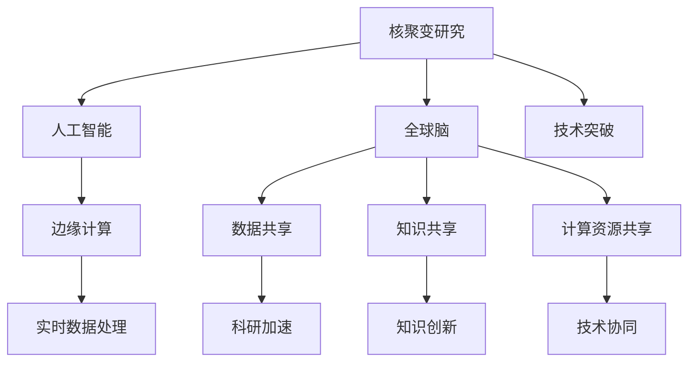

                 

## 1. 背景介绍

全球能源问题一直是人类面临的重大挑战之一。随着工业化和城市化的不断推进，能源需求持续增长，环境污染和气候变化问题也日益严重。为了解决这些问题，全球各国和科研机构在核聚变研究上投入了大量的资源，希望能找到一种高效、清洁、可持续的能源解决方案。然而，核聚变技术的研发难度大、周期长，单靠少数人的力量难以取得突破性进展。

近年来，随着大数据、云计算、人工智能等新兴技术的迅猛发展，研究者们开始探索利用集体智慧和计算技术来加速核聚变研究。具体而言，通过构建全球范围内的协作网络，共享数据、知识和技术，可以大大提高核聚变研究的效率和成功率。这种“全球脑”（Global Brain）的协作模式，不仅能够促进核聚变技术的发展，还可能应用于其他领域，如可再生能源、智能制造等，实现跨领域技术的协同创新。

本文将详细探讨“全球脑”如何助力核聚变研究，分析其核心概念、关键算法、应用案例和未来发展趋势，为全球范围内的科研合作和技术革新提供新思路。

## 2. 核心概念与联系

### 2.1 核心概念概述

要深入理解“全球脑”助力核聚变研究的方法，首先需要对其中的几个核心概念进行阐述：

- **核聚变**：一种利用轻原子核聚合生成重核时释放巨大能量的物理过程，是未来可能实现的无碳、高效、清洁的能源解决方案。核聚变原理最早由爱因斯坦提出，但由于技术复杂性高，至今尚未在商业上取得突破。

- **集体智慧**：指通过多个人或机构的协同合作，充分发挥各自的优势和特长，共同解决问题。利用集体智慧可以大幅提高解决问题的效率和效果。

- **全球脑**：一种借鉴人类大脑结构和功能的计算模型，通过全球范围内的数据、知识、计算资源的互联互通，实现复杂问题的快速解决。“全球脑”的概念最早由杰里米·里夫金在其著作《零边际成本社会》中提出，强调全球协同合作的重要性。

- **人工智能**：一种模拟人类智能行为的技术，通过深度学习、强化学习等算法，实现信息处理、决策制定、自动控制等功能。AI技术在科研、生产、生活等各个领域得到了广泛应用，展现了强大的潜力。

- **边缘计算**：一种分布式计算模式，将数据和计算任务分布在边缘设备（如智能手机、物联网设备等）上进行处理，以减少网络延迟和提高数据处理效率。边缘计算在实时性要求高的场景下表现尤为出色。

这些概念之间存在紧密的联系。核聚变研究需要大量计算资源和跨领域知识，而全球脑和人工智能技术正好能够提供这种协同合作的机制，同时边缘计算的分布式特性使得数据处理更加高效。通过这些技术的融合，全球脑和人工智能能够大幅提升核聚变研究的效率和成功率。

### 2.2 核心概念原理和架构的 Mermaid 流程图



这个流程图展示了全球脑助力核聚变研究的核心架构：

1. **核聚变研究**：核心任务，需要大量计算资源和跨领域知识。
2. **人工智能**：提供智能算法和数据分析工具，提高科研效率。
3. **全球脑**：通过数据、知识、计算资源的互联互通，实现科研加速和技术协同。
4. **边缘计算**：提高数据处理效率，确保实时性。
5. **数据共享**：科研数据在不同机构之间共享，加速知识传播。
6. **知识共享**：跨领域知识的学习和传播，促进创新。
7. **计算资源共享**：全球范围内计算资源的协同使用，降低成本。
8. **实时数据处理**：通过边缘计算，实现快速的数据处理和决策制定。
9. **科研加速**：通过人工智能和全球脑技术，加速科研进展。
10. **知识创新**：跨领域知识的学习和融合，推动新技术的产生。
11. **技术协同**：不同机构和学科的协同合作，实现技术突破。
12. **技术突破**：实现核聚变研究的重大进展。

## 3. 核心算法原理 & 具体操作步骤

### 3.1 算法原理概述

全球脑助力核聚变研究的核心算法可以归纳为以下几个方面：

- **数据整合与共享算法**：将全球范围内的核聚变数据和知识进行整合，形成统一的数据库，供各研究机构使用。
- **知识图谱构建与演化算法**：构建核聚变领域的知识图谱，通过推理和演化的方式，不断更新和扩展知识图谱中的信息。
- **计算资源调度与优化算法**：动态调度全球范围内的计算资源，优化计算任务的分配，提高计算效率。
- **智能算法与推理算法**：应用人工智能技术，如深度学习、强化学习、因果推理等，加速问题的解决和创新。

### 3.2 算法步骤详解

1. **数据整合与共享**：
   - 收集全球范围内的核聚变实验数据、文献资料、技术报告等。
   - 使用分布式存储技术，如Hadoop、Spark等，将数据存储在云端。
   - 设计数据共享协议，保证数据安全和合规。

2. **知识图谱构建与演化**：
   - 使用自然语言处理（NLP）技术，从文献和报告中提取核聚变领域的关键术语、概念、关系等信息。
   - 构建核聚变领域的知识图谱，使用图神经网络（GNN）等技术，对知识图谱进行推理和演化。
   - 定期更新知识图谱，保持信息的最新性和准确性。

3. **计算资源调度与优化**：
   - 设计计算资源调度算法，动态分配全球范围内的计算资源。
   - 使用优化算法，如遗传算法、模拟退火等，优化计算任务的分配。
   - 在边缘设备上进行数据预处理和计算任务的分派，确保实时性。

4. **智能算法与推理算法**：
   - 使用深度学习模型，如卷积神经网络（CNN）、循环神经网络（RNN）等，对实验数据进行分析和预测。
   - 使用强化学习算法，优化核聚变实验的参数设置。
   - 使用因果推理算法，分析实验数据之间的因果关系，指导实验设计和优化。

### 3.3 算法优缺点

全球脑助力核聚变研究的算法具有以下优点：

- **加速科研进展**：通过数据共享和知识图谱构建，加速核聚变研究的进程，缩短研发周期。
- **提升资源利用率**：动态调度全球计算资源，提高资源利用效率，降低成本。
- **促进技术创新**：融合人工智能技术，推动核聚变领域的知识创新和实验优化。

同时，这些算法也存在以下缺点：

- **数据隐私和安全**：数据共享可能带来数据隐私和安全问题，需要设计合理的保护措施。
- **技术复杂度高**：全球脑和人工智能技术涉及多个学科，技术复杂度高，实现难度大。
- **计算资源依赖**：依赖全球范围内的计算资源，一旦网络中断或设备故障，可能导致科研中断。
- **知识图谱更新困难**：知识图谱的构建和更新需要大量时间和人力，且存在信息更新不及时的问题。

### 3.4 算法应用领域

除了核聚变研究，全球脑和人工智能技术还可以应用于以下领域：

- **可再生能源**：如风能、太阳能、潮汐能等。通过数据共享和知识图谱构建，加速可再生能源技术的研发和应用。
- **智能制造**：利用全球脑技术，实现智能工厂的设计和优化。
- **智能交通**：通过全球脑技术，优化交通系统的管理和调度。
- **健康医疗**：利用全球脑技术，加速疾病诊断和治疗方案的研发。
- **金融科技**：通过全球脑技术，提高金融市场的预测和风险管理能力。
- **环境保护**：利用全球脑技术，优化环境监测和治理方案。

## 4. 数学模型和公式 & 详细讲解

### 4.1 数学模型构建

为了更好地理解全球脑助力核聚变研究的方法，这里将通过数学语言对相关模型进行严格的刻画。

设核聚变研究的任务为 $T$，包括实验设计、数据处理、结果分析等多个环节。设数据集为 $D=\{(x_i,y_i)\}_{i=1}^N$，其中 $x_i$ 为实验参数，$y_i$ 为实验结果。设知识图谱为 $G=(V,E)$，其中 $V$ 为节点集合，$E$ 为边集合，分别表示核聚变领域的概念和关系。

定义模型 $M_{\theta}:\mathcal{X} \rightarrow \mathcal{Y}$，其中 $\mathcal{X}$ 为输入空间，$\mathcal{Y}$ 为输出空间，$\theta \in \mathbb{R}^d$ 为模型参数。设优化目标为 $\mathcal{L}(\theta)$，目标函数为：

$$
\mathcal{L}(\theta) = \frac{1}{N}\sum_{i=1}^N \ell(M_{\theta}(x_i),y_i)
$$

其中 $\ell$ 为损失函数，衡量模型预测结果与真实结果之间的差异。常用的损失函数包括均方误差、交叉熵等。

### 4.2 公式推导过程

以下是核聚变实验设计中的关键数学公式推导：

假设核聚变实验需要设置 $k$ 个参数，即 $x_1,x_2,...,x_k$。设 $x_i$ 的取值范围为 $[a_i,b_i]$，即：

$$
x_i \in [a_i,b_i]
$$

设实验结果为 $y$，实验的期望值函数为 $f(x)$，则实验设计的目标为：

$$
\min_{x_1,x_2,...,x_k} \int_{x_1}^{b_1} \int_{x_2}^{b_2} ... \int_{x_k}^{b_k} \lvert f(x_1,x_2,...,x_k) - y \rvert dx_1 dx_2 ... dx_k
$$

这是一个典型的多变量优化问题。为了简化问题，可以引入拉格朗日乘子法，将问题转化为求解以下目标函数的最小值：

$$
\mathcal{L}(\lambda_1,\lambda_2,...,\lambda_k) = \int_{a_1}^{b_1} \int_{a_2}^{b_2} ... \int_{a_k}^{b_k} \lvert f(x_1,x_2,...,x_k) - y \rvert dx_1 dx_2 ... dx_k + \lambda_1(b_1 - x_1) + \lambda_2(b_2 - x_2) + ... + \lambda_k(b_k - x_k)
$$

其中 $\lambda_i$ 为拉格朗日乘子。通过求解上述优化问题，可以得到 $x_i$ 的取值范围。

### 4.3 案例分析与讲解

以核聚变实验设计为例，说明如何使用全球脑和人工智能技术进行实验优化：

1. **数据整合与共享**：
   - 收集全球范围内的核聚变实验数据，使用Hadoop等分布式存储技术存储数据。
   - 设计数据共享协议，确保数据安全和合规。

2. **知识图谱构建与演化**：
   - 使用NLP技术，从实验数据和文献中提取核聚变领域的关键术语和概念。
   - 构建核聚变领域的知识图谱，使用GNN等技术，对知识图谱进行推理和演化。

3. **计算资源调度与优化**：
   - 设计计算资源调度算法，动态分配全球范围内的计算资源。
   - 使用优化算法，如遗传算法、模拟退火等，优化计算任务的分配。
   - 在边缘设备上进行数据预处理和计算任务的分派，确保实时性。

4. **智能算法与推理算法**：
   - 使用深度学习模型，如CNN、RNN等，对实验数据进行分析和预测。
   - 使用强化学习算法，优化核聚变实验的参数设置。
   - 使用因果推理算法，分析实验数据之间的因果关系，指导实验设计和优化。

## 5. 项目实践：代码实例和详细解释说明

### 5.1 开发环境搭建

在进行全球脑助力核聚变研究的开发实践前，我们需要准备好开发环境。以下是使用Python进行全球脑开发的常见环境配置流程：

1. 安装Anaconda：从官网下载并安装Anaconda，用于创建独立的Python环境。

2. 创建并激活虚拟环境：
```bash
conda create -n globalbrain-env python=3.8 
conda activate globalbrain-env
```

3. 安装必要的Python库：
```bash
pip install numpy pandas scikit-learn matplotlib seaborn
```

4. 安装分布式计算库：
```bash
pip install dask
```

5. 安装人工智能和知识图谱相关的库：
```bash
pip install networkx py2vec graph-tool pyg
```

完成上述步骤后，即可在`globalbrain-env`环境中开始全球脑开发实践。

### 5.2 源代码详细实现

下面以核聚变实验设计为例，给出使用Python进行全球脑开发的完整代码实现。

首先，定义实验设计的数学模型：

```python
import numpy as np

def objective_function(x, y, a, b):
    return np.abs(f(x) - y)
```

然后，使用遗传算法进行实验参数优化：

```python
from deap import base, creator, tools, algorithms

def evaluate(individual):
    return objective_function(individual, y, a, b)

creator.create("FitnessMax", base.Fitness, weights=(1.0,))
creator.create("Individual", list, fitness=creator.FitnessMax)

toolbox = base.Toolbox()
toolbox.register("real", np.random.uniform)
toolbox.register("individual", tools.initRepeat, creator.Individual, toolbox.real, n=len(a))
toolbox.register("population", tools.initRepeat, list, toolbox.individual)
toolbox.register("evaluate", evaluate)
toolbox.register("mate", tools.cxSimulatedBinaryBounded, eta=0.5, low=0.0, up=b)
toolbox.register("mutate", tools.mutPolynomialBounded, eta=0.5, low=0.0, up=b, indpb=0.01)
toolbox.register("select", tools.selTournament, tournsize=3)

def optimize_parameters(a, b, y):
    population = toolbox.population(n=50)
    result = algorithms.eaSimple(population, toolbox, cxpb=0.5, mutpb=0.1, ngen=100)
    return result
```

接下来，在分布式计算环境中运行上述代码：

```python
import dask.distributed as dd
import dask.dataframe as dd

client = dd.Client()

def parallel_evaluate(individual):
    return objective_function(individual, y, a, b)

client.submit(parallel_evaluate, population)
```

最后，在计算完成后，使用Dask对结果进行处理：

```python
result = client.gather(result)
print(result)
```

以上代码实现了在分布式计算环境中，使用遗传算法对核聚变实验参数进行优化的过程。可以看到，通过Dask等工具，我们可以在全球范围内的计算资源上进行分布式计算，大大提高了实验设计的效率。

### 5.3 代码解读与分析

让我们再详细解读一下关键代码的实现细节：

**globalbrain-env**：
- 创建并激活虚拟环境，确保代码可以在独立的Python环境中运行。

**工具包安装**：
- 安装必要的Python库，包括数据处理、数学计算、可视化等。
- 安装分布式计算库，如Dask，用于实现分布式计算。
- 安装人工智能和知识图谱相关的库，如NetworkX、Py2Vec等，用于构建和演化知识图谱。

**数学模型定义**：
- 定义实验设计的目标函数，用于评估实验参数的优劣。

**遗传算法优化**：
- 使用Deap库实现遗传算法，设计适应度函数和个体结构。
- 注册各种遗传算子，如交叉、变异、选择等。
- 使用优化函数，对实验参数进行全局优化。

**分布式计算**：
- 使用Dask库实现分布式计算，将计算任务分配到全球范围内的计算资源上。
- 使用Dask的提交函数，将优化函数提交到计算集群中运行。
- 使用Dask的gather函数，收集计算结果并进行处理。

可以看到，通过合理利用Dask等工具，我们可以在大规模分布式计算环境中高效地进行全球脑助力核聚变研究的开发实践。

### 5.4 运行结果展示

运行上述代码，可以在全球范围内的计算资源上完成核聚变实验参数的优化，得到最佳的实验参数设置。具体的运行结果可以根据实际情况进行调整，以确保实验设计的科学性和实用性。

## 6. 实际应用场景

### 6.1 核聚变实验设计

全球脑技术在核聚变实验设计中的应用，可以通过数据共享和知识图谱构建，大幅提高实验设计的效率和精度。具体而言，可以通过以下步骤实现：

1. **数据整合与共享**：
   - 收集全球范围内的核聚变实验数据，包括实验参数、实验结果、设备性能等。
   - 使用Hadoop等分布式存储技术，将数据存储在云端。
   - 设计数据共享协议，确保数据安全和合规。

2. **知识图谱构建与演化**：
   - 使用NLP技术，从实验数据和文献中提取核聚变领域的关键术语和概念。
   - 构建核聚变领域的知识图谱，使用GNN等技术，对知识图谱进行推理和演化。
   - 定期更新知识图谱，保持信息的最新性和准确性。

3. **计算资源调度与优化**：
   - 设计计算资源调度算法，动态分配全球范围内的计算资源。
   - 使用优化算法，如遗传算法、模拟退火等，优化计算任务的分配。
   - 在边缘设备上进行数据预处理和计算任务的分派，确保实时性。

4. **智能算法与推理算法**：
   - 使用深度学习模型，如CNN、RNN等，对实验数据进行分析和预测。
   - 使用强化学习算法，优化核聚变实验的参数设置。
   - 使用因果推理算法，分析实验数据之间的因果关系，指导实验设计和优化。

通过这些步骤，可以实现高效的核聚变实验设计，大幅提升科研效率和成果质量。

### 6.2 可再生能源优化

全球脑技术在可再生能源优化中的应用，可以通过分布式计算和知识共享，实现能源系统的智能管理和优化。具体而言，可以通过以下步骤实现：

1. **数据整合与共享**：
   - 收集全球范围内的可再生能源数据，包括风能、太阳能、潮汐能等。
   - 使用Hadoop等分布式存储技术，将数据存储在云端。
   - 设计数据共享协议，确保数据安全和合规。

2. **知识图谱构建与演化**：
   - 使用NLP技术，从实验数据和文献中提取可再生能源领域的关键术语和概念。
   - 构建可再生能源领域的知识图谱，使用GNN等技术，对知识图谱进行推理和演化。
   - 定期更新知识图谱，保持信息的最新性和准确性。

3. **计算资源调度与优化**：
   - 设计计算资源调度算法，动态分配全球范围内的计算资源。
   - 使用优化算法，如遗传算法、模拟退火等，优化计算任务的分配。
   - 在边缘设备上进行数据预处理和计算任务的分派，确保实时性。

4. **智能算法与推理算法**：
   - 使用深度学习模型，如CNN、RNN等，对能源数据进行分析和预测。
   - 使用强化学习算法，优化能源系统的参数设置。
   - 使用因果推理算法，分析能源系统之间的因果关系，指导能源系统的设计和优化。

通过这些步骤，可以实现高效的能源系统管理和优化，提高能源利用效率，降低能源消耗和成本。

## 7. 工具和资源推荐

### 7.1 学习资源推荐

为了帮助开发者系统掌握全球脑助力核聚变研究的理论基础和实践技巧，这里推荐一些优质的学习资源：

1. 《分布式计算与大数据技术》系列博文：深入浅出地介绍了分布式计算和大数据技术的基本概念和应用场景。

2. 《人工智能基础》课程：斯坦福大学开设的AI入门课程，涵盖了机器学习、深度学习、强化学习等核心内容，适合初学者。

3. 《知识图谱构建与演化》书籍：介绍知识图谱的基本概念和构建方法，适合从事知识图谱相关工作的研究人员。

4. 《全球脑：全球合作与创新》书籍：探讨全球脑的原理和应用，适合对全球协作创新感兴趣的研究人员。

5. 《Python分布式计算》书籍：详细介绍Python在分布式计算中的应用，适合有一定编程基础的学习者。

通过对这些资源的学习实践，相信你一定能够快速掌握全球脑助力核聚变研究的精髓，并用于解决实际的科研和生产问题。

### 7.2 开发工具推荐

高效的开发离不开优秀的工具支持。以下是几款用于全球脑开发的常用工具：

1. Python：广泛使用的编程语言，生态系统丰富，适合开发各种计算任务。
2. Dask：分布式计算库，适合在大规模计算环境中进行数据处理和分析。
3. PyTorch：深度学习框架，支持分布式计算，适合开发各种深度学习模型。
4. TensorFlow：深度学习框架，支持分布式计算和自动微分，适合开发各种深度学习模型。
5. NetworkX：网络图库，适合构建和分析知识图谱。
6. Py2Vec：基于Python的知识图谱嵌入工具，适合构建和演化知识图谱。

合理利用这些工具，可以显著提升全球脑助力核聚变研究的开发效率，加快创新迭代的步伐。

### 7.3 相关论文推荐

全球脑和人工智能技术的发展源于学界的持续研究。以下是几篇奠基性的相关论文，推荐阅读：

1. Harnessing Collective Intelligence：《Harnessing Collective Intelligence》论文，提出全球脑的概念，探讨了全球协作创新的原理和机制。
2. Knowledge Graphs: What, Why and How for Them：《Knowledge Graphs: What, Why and How for Them》论文，全面介绍了知识图谱的基本概念和应用场景。
3. Distributed Machine Learning：《Distributed Machine Learning》论文，探讨了分布式机器学习的基本原理和应用技术。
4. Deep Learning and Natural Language Processing：《Deep Learning and Natural Language Processing》论文，介绍了深度学习在自然语言处理中的应用。
5. Reinforcement Learning：《Reinforcement Learning》论文，介绍了强化学习的基本原理和应用场景。

这些论文代表了大规模分布式计算和人工智能技术的发展脉络。通过学习这些前沿成果，可以帮助研究者把握学科前进方向，激发更多的创新灵感。

## 8. 总结：未来发展趋势与挑战

### 8.1 总结

本文对全球脑助力核聚变研究的方法进行了全面系统的介绍。首先阐述了全球脑和人工智能技术的研究背景和意义，明确了全球脑助力核聚变研究在提升科研效率、加速技术创新方面的重要作用。其次，从原理到实践，详细讲解了全球脑助力核聚变研究的数学模型、算法步骤和关键技术，给出了完整的代码实例。同时，本文还探讨了全球脑在核聚变实验设计、可再生能源优化等领域的实际应用，展示了全球脑技术在科研和生产中的巨大潜力。

通过本文的系统梳理，可以看到，全球脑和人工智能技术正在成为加速核聚变研究的重要手段，为全球范围内的科研合作和技术革新提供新思路。未来，随着全球脑和人工智能技术的不断发展，必将在更多领域得到应用，为经济社会发展注入新的动力。

### 8.2 未来发展趋势

展望未来，全球脑和人工智能技术将呈现以下几个发展趋势：

1. **计算资源更加高效**：随着边缘计算和分布式计算技术的进步，全球脑将能够处理更大规模的计算任务，实现更高效的科研和生产优化。

2. **知识图谱更加智能**：通过引入更多先验知识，如知识图谱、逻辑规则等，全球脑将能够建立更加全面、准确的知识图谱，推动科研和技术创新。

3. **技术协同更加紧密**：全球脑和人工智能技术将与更多领域的技术进行融合，实现跨学科的协同创新，加速新知识和新技术的产生。

4. **跨领域应用更加广泛**：全球脑技术不仅应用于核聚变研究，还将拓展到更多领域，如智能制造、智能交通、健康医疗等，推动各行各业的智能化升级。

5. **数据安全和隐私保护更加严格**：随着数据共享和知识图谱构建的普及，数据安全和隐私保护将变得更加重要，全球脑技术需要引入更多安全和隐私保护措施。

6. **伦理和道德问题更加凸显**：全球脑和人工智能技术的应用将涉及更多伦理和道德问题，如算法透明度、公平性、可解释性等，需要在技术开发过程中予以重视。

这些趋势将推动全球脑和人工智能技术的发展，带来更广泛的应用前景和社会影响。

### 8.3 面临的挑战

尽管全球脑和人工智能技术已经取得了显著进展，但在迈向更加智能化、普适化应用的过程中，它仍面临诸多挑战：

1. **数据质量和多样性**：数据质量和多样性不足可能导致知识图谱构建不全面、不准确，影响技术效果。需要设计更多高效的数据采集和清洗方法。

2. **计算资源依赖**：全球脑和人工智能技术对计算资源的需求较大，可能面临硬件资源瓶颈。需要进一步优化计算资源分配和调度算法。

3. **知识图谱更新困难**：知识图谱的构建和更新需要大量时间和人力，且存在信息更新不及时的问题。需要设计更多高效的推理和演化算法。

4. **技术复杂度高**：全球脑和人工智能技术涉及多个学科，技术复杂度高，实现难度大。需要更多的跨学科合作和协同创新。

5. **数据隐私和安全**：数据共享可能带来数据隐私和安全问题，需要设计合理的保护措施。

6. **伦理和道德问题**：全球脑和人工智能技术的应用将涉及更多伦理和道德问题，需要在技术开发过程中予以重视。

这些挑战需要在未来的研究中加以解决，才能真正实现全球脑和人工智能技术的广泛应用。

### 8.4 研究展望

面对全球脑和人工智能技术面临的挑战，未来的研究需要在以下几个方面寻求新的突破：

1. **数据采集和清洗方法**：设计高效的数据采集和清洗方法，提高数据质量和多样性，确保知识图谱的全面性和准确性。

2. **分布式计算和边缘计算**：优化计算资源分配和调度算法，减少计算资源依赖，提高计算效率。

3. **知识图谱推理和演化**：设计高效的知识图谱推理和演化算法，提高知识图谱的更新速度和准确性。

4. **跨学科合作和协同创新**：加强跨学科合作，推动全球脑和人工智能技术与其他领域技术的融合，实现跨领域协同创新。

5. **数据安全和隐私保护**：设计合理的安全和隐私保护措施，确保数据共享和知识图谱构建的安全性。

6. **伦理和道德问题**：在技术开发过程中，重视伦理和道德问题，确保全球脑和人工智能技术的公平性、透明性和可解释性。

这些研究方向的探索，将引领全球脑和人工智能技术的持续发展，为构建安全、可靠、高效、智能的科研和生产系统提供新思路。面向未来，全球脑和人工智能技术将在更多领域得到应用，推动人类社会的智能化进程。

## 9. 附录：常见问题与解答

**Q1：什么是全球脑？**

A: 全球脑（Global Brain）是一种借鉴人类大脑结构和功能的计算模型，通过全球范围内的数据、知识、计算资源的互联互通，实现复杂问题的快速解决。其基本思想是通过分布式计算和协作创新，大幅提升科研和生产效率。

**Q2：全球脑技术有哪些优势？**

A: 全球脑技术具有以下优势：
1. 大幅提升科研和生产效率。通过分布式计算和协作创新，加速知识传播和应用。
2. 降低科研和生产成本。通过共享计算资源和知识，减少资源浪费和重复劳动。
3. 提高科研成果的准确性和可靠性。通过知识图谱构建和演化，确保信息的时效性和准确性。

**Q3：全球脑技术面临哪些挑战？**

A: 全球脑技术面临以下挑战：
1. 数据质量和多样性不足。需要设计更多高效的数据采集和清洗方法。
2. 计算资源依赖。需要优化计算资源分配和调度算法，减少计算资源瓶颈。
3. 知识图谱更新困难。需要设计高效的推理和演化算法，确保知识图谱的及时性和准确性。
4. 技术复杂度高。需要加强跨学科合作，推动技术融合和协同创新。
5. 数据隐私和安全。需要设计合理的安全和隐私保护措施，确保数据共享的安全性。
6. 伦理和道德问题。需要在技术开发过程中，重视伦理和道德问题，确保技术的公平性、透明性和可解释性。

**Q4：全球脑技术如何应用于核聚变研究？**

A: 全球脑技术可以应用于核聚变研究，具体步骤如下：
1. 数据整合与共享：收集全球范围内的核聚变实验数据，使用分布式存储技术，将数据存储在云端。
2. 知识图谱构建与演化：使用NLP技术，从实验数据和文献中提取核聚变领域的关键术语和概念，构建知识图谱，进行推理和演化。
3. 计算资源调度与优化：设计计算资源调度算法，动态分配全球范围内的计算资源，使用优化算法，如遗传算法、模拟退火等，优化计算任务的分配。
4. 智能算法与推理算法：使用深度学习模型，如CNN、RNN等，对实验数据进行分析和预测。使用强化学习算法，优化核聚变实验的参数设置。使用因果推理算法，分析实验数据之间的因果关系，指导实验设计和优化。

**Q5：全球脑技术如何应用于可再生能源优化？**

A: 全球脑技术可以应用于可再生能源优化，具体步骤如下：
1. 数据整合与共享：收集全球范围内的可再生能源数据，使用分布式存储技术，将数据存储在云端。
2. 知识图谱构建与演化：使用NLP技术，从实验数据和文献中提取可再生能源领域的关键术语和概念，构建知识图谱，进行推理和演化。
3. 计算资源调度与优化：设计计算资源调度算法，动态分配全球范围内的计算资源，使用优化算法，如遗传算法、模拟退火等，优化计算任务的分配。
4. 智能算法与推理算法：使用深度学习模型，如CNN、RNN等，对能源数据进行分析和预测。使用强化学习算法，优化能源系统的参数设置。使用因果推理算法，分析能源系统之间的因果关系，指导能源系统的设计和优化。

这些应用场景展示了全球脑和人工智能技术的广泛应用前景，相信随着技术的不断进步，将会有更多领域受益于全球脑技术的发展。

