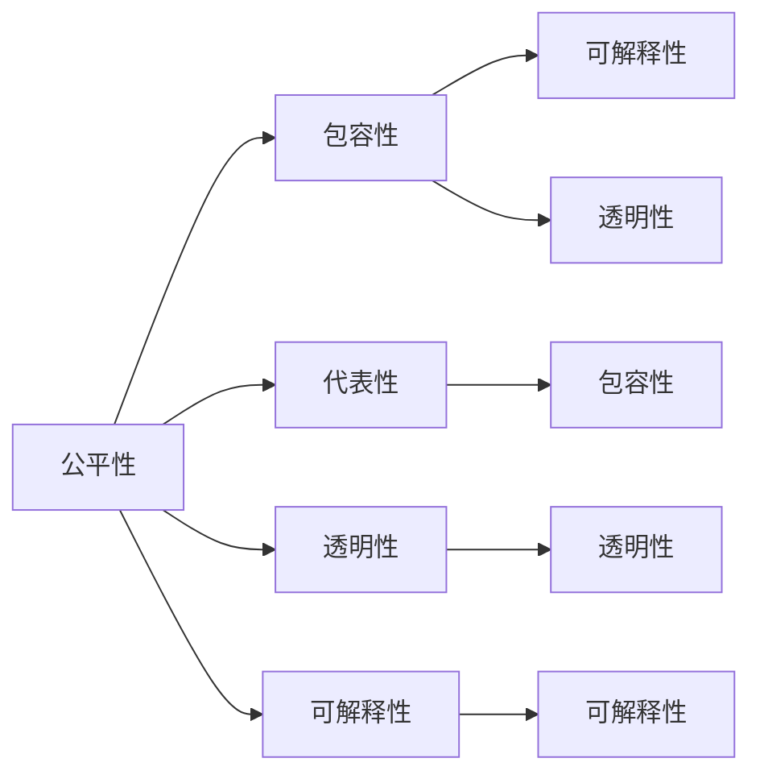
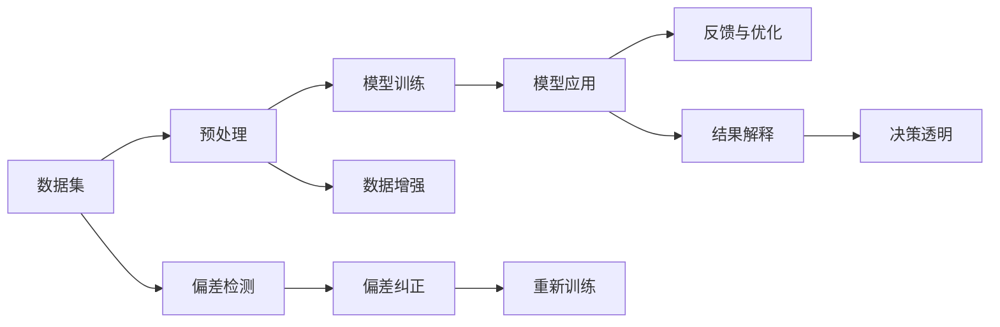

                 

# 公平与包容：构建平等参与的人类计算

在数字化浪潮席卷全球的今天，计算机科学已经渗透到社会的方方面面。然而，技术带来的进步与公正并不总是同步。我们常常看到，技术的不平等使用使得部分人群受益而另一部分人群被边缘化，甚至在某些情况下，技术本身成为了加剧社会不公的工具。为了构建一个公平、包容的计算环境，确保每个人都能平等参与到技术的创新与应用中，本文将探讨如何在算法设计和实践中实现公平与包容的原则。

## 1. 背景介绍

### 1.1 问题由来

随着人工智能（AI）和机器学习（ML）技术的快速发展，大数据和深度学习模型的应用越来越广泛，从金融、医疗到教育、娱乐等各个领域都有涉及。然而，这些技术的应用并非总是令人满意的。研究表明，AI系统在决策过程中可能存在偏见，且在面对特定种族、性别、年龄、经济地位等群体时表现不佳，这些问题被称为“算法偏见”（Algorithmic Bias）。

算法偏见不仅会损害特定群体的利益，还可能导致对整个社会的误解和反感，进而阻碍技术的广泛应用和普及。因此，实现算法设计中的公平与包容，确保计算技术能服务于更广泛的群体，成为当前研究者和实践者亟需解决的问题。

### 1.2 问题核心关键点

在计算技术的应用中，实现公平与包容的原则需要从多个层面进行考虑，包括但不限于：
- 数据集的代表性：确保数据来源的多样性和广泛性，避免数据偏差。
- 算法的透明性与可解释性：使算法的决策过程和输出结果透明，便于验证和监督。
- 模型的公平性与包容性：保证模型在面对不同群体时能公平处理，避免对特定群体的不公平待遇。
- 伦理与社会责任：算法开发者和使用者需要对技术可能产生的社会影响负责，确保技术应用不违背道德和法律规定。

为了系统地探讨这些关键点，本文将通过多章逐步深入，涵盖从理论到实践的各个方面，最终构建出一套全面的公平与包容的计算框架。

## 2. 核心概念与联系

### 2.1 核心概念概述

- **公平性（Fairness）**：在数据分析、模型训练和应用过程中，确保不同群体的需求和利益得到公正的考虑和处理。
- **包容性（Inclusivity）**：设计能广泛包容不同背景、能力和需求的用户，使他们能够平等参与和使用计算技术。
- **代表性（Representativeness）**：数据集能够充分反映社会的多样性，避免单一视角的偏差。
- **透明性（Transparency）**：算法决策过程和输出结果应具有可解释性，便于理解、验证和改进。
- **可解释性（Explainability）**：模型和算法应具备可解释性，便于用户和监管者理解和信任。

这些概念之间相互关联，共同构成了公平与包容计算的核心框架。本节将通过以下Mermaid流程图，展示这些核心概念之间的关系：



### 2.2 核心概念原理和架构的 Mermaid 流程图



## 3. 核心算法原理 & 具体操作步骤

### 3.1 算法原理概述

公平与包容的计算技术设计，本质上是追求在算法中反映和满足所有用户的利益，确保技术决策和应用过程中不对任何群体产生偏见或歧视。这一过程通常包括以下几个步骤：

1. **数据准备**：收集具有代表性的数据集，涵盖不同种族、性别、年龄、经济地位等背景的用户。
2. **模型设计**：设计能够适应不同群体的算法和模型，避免任何形式的偏见。
3. **模型训练**：在带有偏差检测和纠正机制的框架下，进行模型训练和优化。
4. **结果验证**：通过多样性和公平性评估，确保模型输出符合公平与包容的原则。
5. **反馈与改进**：基于反馈数据和用户反馈，不断改进模型和算法。

### 3.2 算法步骤详解

#### 3.2.1 数据准备与预处理

数据准备是公平与包容计算的第一步，其目标是构建一个具有代表性、多样性的数据集。具体步骤包括：

- **数据收集**：从不同来源和渠道收集数据，涵盖不同背景的用户群体。
- **数据清洗**：去除数据中的噪声和异常值，确保数据的准确性和一致性。
- **数据增强**：通过数据扩充和平衡处理，增强数据集的代表性。
- **数据标注**：对数据进行详细的标注，包括特征和标签信息，便于后续的模型训练和评估。

#### 3.2.2 模型设计

在模型设计阶段，应采用公平和包容的原则，避免算法偏见。具体方法包括：

- **公平性约束**：在模型设计中加入公平性约束，确保模型在不同群体上的表现一致。
- **算法透明**：选择具有可解释性的模型，使其决策过程透明。
- **对抗训练**：通过对抗训练增强模型对偏见和噪声的鲁棒性。
- **可解释性设计**：采用可解释性模型和工具，便于理解模型行为。

#### 3.2.3 模型训练与优化

模型训练阶段是实现公平与包容计算的核心步骤，主要包括以下几个环节：

- **偏差检测**：在模型训练过程中，实时监测和检测数据偏差和算法偏见。
- **偏差纠正**：通过调整模型参数和数据处理方式，纠正检测到的偏差。
- **公平性评估**：使用公平性指标评估模型在不同群体上的表现，确保公平性。
- **模型优化**：根据评估结果和反馈数据，不断优化模型参数和结构。

#### 3.2.4 结果验证与改进

结果验证是确保公平与包容计算效果的关键步骤，主要通过以下方式进行：

- **公平性评估**：使用公平性指标和评估工具，验证模型的输出是否公平。
- **包容性测试**：通过多样性和包容性测试，确保模型能够包容不同背景的用户。
- **用户反馈**：收集用户反馈，了解模型应用中的问题和不满意之处。
- **持续改进**：根据验证结果和用户反馈，不断改进模型和算法。

### 3.3 算法优缺点

#### 3.3.1 优点

- **公平性与包容性**：在模型设计和训练中，考虑不同群体的需求和利益，确保技术公平和包容。
- **透明性与可解释性**：模型设计透明，便于理解和监督。
- **抗干扰能力**：通过偏差检测和纠正机制，增强模型对偏见和噪声的鲁棒性。

#### 3.3.2 缺点

- **复杂性高**：在模型设计和训练过程中，需要考虑多个因素，增加了复杂性和难度。
- **数据需求大**：构建具有代表性的数据集，需要大量时间和资源。
- **实施成本高**：对抗训练、公平性评估等技术，需要额外的计算资源和专业知识。

### 3.4 算法应用领域

公平与包容的计算技术已经在多个领域得到了应用，主要包括：

- **金融领域**：在信用评分、贷款申请等场景中，确保算法公平处理不同群体的申请。
- **医疗健康**：在诊断、治疗等医疗决策中，避免因性别、种族等因素导致的偏差。
- **教育培训**：在学生评估、课程推荐等场景中，确保教育资源公平分配。
- **就业招聘**：在招聘和职业发展评估中，确保机会公平，避免偏见。
- **公共服务**：在公共服务资源分配中，确保服务的公平性和包容性。

## 4. 数学模型和公式 & 详细讲解 & 举例说明

### 4.1 数学模型构建

公平与包容计算的核心在于确保模型在不同群体上的公平表现。常用的公平性指标包括：

- **均值差异（Mean Difference）**：衡量不同群体之间输出的均值差异。
- **最小最大差异（Minimum/Maximum Difference）**：衡量不同群体之间输出的最小值和最大值差异。
- **卡方统计（Chi-Square Statistic）**：衡量不同群体之间输出的分布差异。
- **公平误差率（Equalized Odds）**：衡量不同群体在正负样本上的预测错误率是否一致。

### 4.2 公式推导过程

以均值差异为例，其计算公式为：

$$
\text{Mean Difference} = \frac{1}{N} \sum_{i=1}^N |y_i - \hat{y}_i|
$$

其中 $y_i$ 为真实标签，$\hat{y}_i$ 为模型预测结果。通过计算不同群体间的均值差异，可以评估模型在不同群体上的表现是否一致。

### 4.3 案例分析与讲解

在金融领域，贷款申请审批模型是一个典型的公平性问题。假设模型根据客户的收入、信用记录等信息，预测其是否会违约。如果模型对高收入群体的预测准确率远高于低收入群体，则模型存在偏见。

为解决这个问题，我们可以使用均值差异指标进行评估。具体步骤如下：

1. **数据收集**：收集不同收入群体的贷款申请数据，涵盖不同收入水平的客户。
2. **模型训练**：使用收入和信用记录作为特征，训练贷款审批模型。
3. **偏差检测**：使用均值差异指标，检测模型在不同收入群体上的表现。
4. **偏差纠正**：通过调整模型参数或引入公平性约束，纠正检测到的偏差。
5. **公平性评估**：使用均值差异指标，评估修正后的模型表现。

## 5. 项目实践：代码实例和详细解释说明

### 5.1 开发环境搭建

为了进行公平与包容的计算实践，需要搭建相应的开发环境。以下是一个简单的Python开发环境搭建流程：

1. **安装Python**：从官网下载并安装Python，选择最新稳定版本。
2. **安装必要的包**：使用pip或conda安装必要的Python包，如scikit-learn、pandas、numpy等。
3. **配置开发环境**：设置虚拟环境，安装相关的开发工具和库。
4. **准备数据集**：收集和准备所需的数据集，确保数据的多样性和代表性。

### 5.2 源代码详细实现

以下是一个使用scikit-learn库实现公平性评估的Python代码示例：

```python
from sklearn.model_selection import train_test_split
from sklearn.linear_model import LogisticRegression
from sklearn.metrics import mean_difference

# 准备数据集
X_train, X_test, y_train, y_test = train_test_split(X, y, test_size=0.2, random_state=42)

# 训练模型
model = LogisticRegression()
model.fit(X_train, y_train)

# 评估模型公平性
y_pred = model.predict(X_test)
md = mean_difference(y_test, y_pred, fairness='prevalence')
print(f"Mean Difference: {md:.4f}")
```

### 5.3 代码解读与分析

上述代码使用scikit-learn库实现了基于均值差异的公平性评估。具体步骤如下：

1. **数据准备**：使用train_test_split函数将数据集划分为训练集和测试集。
2. **模型训练**：使用LogisticRegression模型训练贷款审批模型。
3. **结果评估**：使用mean_difference函数计算均值差异，评估模型在不同收入群体上的表现。

### 5.4 运行结果展示

运行上述代码，输出均值差异的结果，以便评估模型的公平性。

## 6. 实际应用场景

### 6.1 金融领域

在金融领域，公平与包容的计算技术可以应用于贷款审批、信用评分、反欺诈检测等场景。例如，在贷款审批中，使用公平性评估指标，确保模型在不同收入群体上的表现一致，避免因收入差距导致的偏见。

### 6.2 医疗健康

在医疗健康领域，公平与包容的计算技术可以应用于疾病诊断、治疗方案推荐、资源分配等场景。例如，在疾病诊断中，使用公平性评估指标，确保模型对不同种族、性别、年龄群体的诊断准确率一致。

### 6.3 教育培训

在教育培训领域，公平与包容的计算技术可以应用于学生评估、课程推荐、作业批改等场景。例如，在学生评估中，使用公平性评估指标，确保评估标准对不同性别、种族、经济背景的学生公平。

### 6.4 公共服务

在公共服务领域，公平与包容的计算技术可以应用于公共资源分配、政策制定、服务质量评估等场景。例如，在公共资源分配中，使用公平性评估指标，确保服务资源在不同社区之间的公平分配。

## 7. 工具和资源推荐

### 7.1 学习资源推荐

为了帮助开发者系统掌握公平与包容计算的理论基础和实践技巧，这里推荐一些优质的学习资源：

1. **《机器学习伦理》（Ethical Machine Learning）**：这本书系统地介绍了机器学习中的伦理和公平问题，涵盖数据偏见、算法公平性、隐私保护等多个方面。
2. **《公平机器学习》（Fairness in Machine Learning）**：该课程详细讲解了机器学习中的公平性问题，包括数据处理、模型训练、结果评估等。
3. **《机器学习中的公平性》（Fairness in Machine Learning）**：这是一篇综述论文，总结了当前机器学习中公平性的研究和应用。
4. **《公平与包容的计算》（Fair and Inclusive Computing）**：这是一本关于公平与包容计算的书籍，介绍了如何在计算技术中实现公平与包容的原则。

### 7.2 开发工具推荐

为了帮助开发者高效地进行公平与包容计算的开发，这里推荐一些常用的开发工具：

1. **scikit-learn**：这是一个流行的Python机器学习库，提供了各种公平性评估和模型优化工具。
2. **TensorFlow**：这是一个广泛使用的深度学习框架，支持公平性评估和模型训练。
3. **PyTorch**：这是一个灵活的深度学习框架，支持公平性评估和模型优化。
4. **Weights & Biases**：这是一个模型实验跟踪工具，可以记录和可视化模型训练过程中的各项指标。
5. **TensorBoard**：这是TensorFlow的可视化工具，可以实时监测模型训练状态，提供丰富的图表呈现方式。

### 7.3 相关论文推荐

为了深入了解公平与包容计算的研究进展和前沿技术，这里推荐一些相关论文：

1. **《公平性与包容性的机器学习》（Fairness and Inclusivity in Machine Learning）**：这篇论文总结了机器学习中的公平性与包容性问题，提出了多种公平性评估和优化方法。
2. **《对抗训练：提高深度神经网络的鲁棒性》（Adversarial Training: Improving the Robustness of Deep Neural Networks）**：这篇论文介绍了对抗训练技术，增强深度学习模型的鲁棒性。
3. **《公平性与包容性计算》（Fairness and Inclusive Computing）**：这篇综述论文总结了公平性与包容性计算的研究现状和未来方向。
4. **《公平机器学习》（Fair Machine Learning）**：这篇论文介绍了公平机器学习的基本概念、方法和应用。

## 8. 总结：未来发展趋势与挑战

### 8.1 总结

本文系统介绍了如何通过公平与包容的计算技术，确保技术应用中不同群体的利益得到公正处理。从理论到实践，探讨了数据准备、模型设计、偏差检测和纠正等多个环节，提供了全面的方法论。

通过这些措施，可以构建更加公平、包容的计算环境，使技术能够服务于更广泛的群体。公平与包容的计算技术不仅有助于减少技术偏见，还能促进社会的和谐与进步。

### 8.2 未来发展趋势

未来，公平与包容的计算技术将呈现以下几个发展趋势：

1. **数据治理与隐私保护**：随着数据治理和隐私保护意识的增强，数据收集和使用过程中将更加注重公平与包容原则，确保数据的安全和隐私。
2. **模型透明性与可解释性**：更多的公平与包容模型将被设计出来，其决策过程和输出结果将更加透明和可解释。
3. **跨领域应用拓展**：公平与包容计算技术将应用于更多领域，如交通、物流、能源等，推动各领域的公平与包容发展。
4. **智能化决策支持**：通过智能化决策支持系统，帮助政策制定者和监管者更好地理解和处理公平与包容问题。
5. **伦理与社会责任**：计算技术开发者和使用者将更加重视伦理和社会责任，确保技术应用符合道德和法律规定。

### 8.3 面临的挑战

尽管公平与包容计算技术取得了显著进展，但仍面临一些挑战：

1. **数据偏差问题**：数据偏差是实现公平与包容计算的最大障碍之一，需要持续改进数据收集和处理方式。
2. **模型复杂性**：公平与包容模型设计复杂，需要更多的资源和时间进行开发和优化。
3. **计算成本高**：对抗训练、公平性评估等技术，需要大量的计算资源和计算能力。
4. **模型可解释性**：如何设计更加可解释的模型，使其决策过程透明，仍是一个难题。
5. **法律法规不完善**：现有法律法规对公平与包容计算的监管和约束还不够完善，需要进一步制定和完善相关规定。

### 8.4 研究展望

为了应对这些挑战，未来的研究方向可以从以下几个方面进行：

1. **数据治理与隐私保护**：开发更加自动化的数据治理工具，确保数据的多样性和代表性，同时保护用户隐私。
2. **模型简化与优化**：设计更加高效和可解释的公平与包容模型，减少计算成本和复杂性。
3. **多模态数据融合**：将文本、图像、声音等多模态数据进行融合，提升模型的泛化能力和公平性。
4. **法律法规完善**：制定和完善相关法律法规，规范公平与包容计算的应用和监管。
5. **伦理与社会责任**：加强对计算技术开发者和使用者的伦理和社会责任教育，确保技术应用符合道德和法律规定。

## 9. 附录：常见问题与解答

### 9.1 常见问题

**Q1: 如何检测模型中的偏见？**

A: 模型偏见可以通过以下步骤进行检测：
1. 数据准备：确保数据集具有代表性，涵盖不同背景的用户。
2. 偏差检测：使用统计方法和指标，如均值差异、卡方统计等，检测模型在不同群体上的表现。
3. 偏差纠正：通过调整模型参数或引入公平性约束，纠正检测到的偏差。
4. 结果验证：使用公平性评估指标，验证修正后的模型表现。

**Q2: 如何提升模型的可解释性？**

A: 提升模型可解释性可以从以下方面入手：
1. 选择可解释性强的模型，如决策树、线性回归等。
2. 引入可解释性工具，如LIME、SHAP等，帮助理解模型行为。
3. 设计透明的模型架构，确保模型决策过程透明。
4. 记录和解释模型训练过程，增加模型的可解释性。

**Q3: 如何处理数据偏差？**

A: 处理数据偏差可以采取以下措施：
1. 数据收集：确保数据集具有代表性，涵盖不同背景的用户。
2. 数据增强：通过数据扩充和平衡处理，增强数据集的代表性。
3. 数据预处理：去除数据中的噪声和异常值，确保数据的准确性和一致性。
4. 数据清洗：对数据进行详细的标注，确保数据的完整性和一致性。

**Q4: 如何确保模型在不同群体上的公平性？**

A: 确保模型在不同群体上的公平性可以采取以下步骤：
1. 数据准备：确保数据集具有代表性，涵盖不同背景的用户。
2. 模型设计：在模型设计中加入公平性约束，确保模型在不同群体上的表现一致。
3. 偏差检测：在模型训练过程中，实时监测和检测数据偏差和算法偏见。
4. 偏差纠正：通过调整模型参数或引入公平性约束，纠正检测到的偏差。
5. 结果验证：使用公平性指标和评估工具，验证模型的输出是否公平。

**Q5: 如何设计公平与包容的计算系统？**

A: 设计公平与包容的计算系统可以从以下方面入手：
1. 数据治理：确保数据的多样性和代表性，保护用户隐私。
2. 模型设计：选择可解释性强的模型，确保模型决策过程透明。
3. 偏差检测：使用统计方法和指标，检测模型在不同群体上的表现。
4. 偏差纠正：通过调整模型参数或引入公平性约束，纠正检测到的偏差。
5. 结果验证：使用公平性评估指标，验证模型的输出是否公平。

**Q6: 如何实现公平与包容计算的自动化？**

A: 实现公平与包容计算的自动化可以从以下方面入手：
1. 自动化数据治理工具：开发自动化的数据治理工具，确保数据的多样性和代表性。
2. 自动化模型训练与评估：使用自动化工具，如AutoML、FairML等，自动训练和评估公平与包容模型。
3. 自动化偏差检测与纠正：引入自动化工具，实时监测和纠正模型偏差。
4. 自动化模型优化：使用自动化工具，优化公平与包容模型的性能和可解释性。

### 9.2 答案解析

通过以上常见问题的解析，我们可以看到，实现公平与包容计算的关键在于数据的治理、模型的设计和训练、偏差检测和纠正等多个环节。只有在各个环节中严格执行公平与包容的原则，才能构建出真正公平、包容的计算环境，确保技术应用中不同群体的利益得到公正处理。

---

作者：禅与计算机程序设计艺术 / Zen and the Art of Computer Programming

