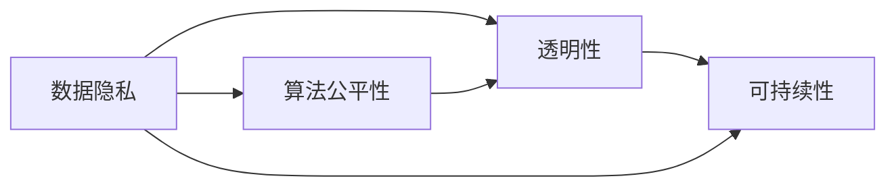

                 

# 公平、公正、可持续：人类计算的伦理

> 关键词：人类计算, 数据隐私, 公平性, 透明性, 可持续性, 数据伦理, 计算伦理

## 1. 背景介绍

在当今数字化时代，计算已经成为了人类社会运转的核心支柱。无论是科学研究、商业决策还是日常互动，都离不开强大的计算能力。然而，在计算的驱动下，我们也面临着一系列前所未有的伦理挑战：数据隐私、算法公平性、透明性和可持续性等问题，这些问题不仅关乎技术本身，更关乎人类社会的公平与正义。

### 1.1 数据隐私与伦理

随着大数据技术的发展，各类数据收集和处理手段日益先进，使得数据隐私保护变得愈发困难。用户数据被非法收集、滥用甚至泄露，导致严重的隐私侵权事件频发。

### 1.2 算法公平性与伦理

算法在自动化决策中扮演着关键角色，但若缺乏适当的监管和指导，可能导致算法偏见和歧视，引发社会不公。例如，某些金融信贷和招聘模型被控性别和种族歧视，导致平等就业机会的缺失。

### 1.3 透明性与伦理

算法黑箱化问题严重，难以解释其内部决策过程，使得算法决策缺乏透明度，公众难以监督和质疑，进一步加剧了信任危机。

### 1.4 可持续性与伦理

计算技术的不断升级带来了巨大的资源消耗，数据中心的能源消耗和环境影响越来越突出，亟需找到更为环保和可持续的计算方式。

### 1.5 计算伦理的全球化考量

随着全球化进程的加速，数据跨国界流动变得日益频繁，计算伦理问题不再局限于单一国家或地区，而需要全球协同应对，推动国际共识和协作。

## 2. 核心概念与联系

### 2.1 核心概念概述

为了深入理解计算伦理的核心问题，我们将介绍几个密切相关的核心概念：

- **数据隐私**：指保护个人数据不被未经授权的第三方获取和使用的能力。涉及数据收集、存储、传输和处理等各个环节。
- **算法公平性**：指算法在处理数据时，应保证对所有群体公平无歧视，避免算法偏见。
- **透明性**：指算法的决策过程应可解释、可理解，便于公众监督和质疑。
- **可持续性**：指计算活动应尽量减少对环境的影响，追求经济效益与社会环境的双重优化。

### 2.2 核心概念联系

这些概念之间存在着紧密的联系，共同构成了计算伦理的基本框架。例如：

- **数据隐私**是保护个人权益的基石，是实现算法公平性和透明性的前提。
- **算法公平性**依赖于透明性，只有透明化的决策过程，才能揭示和纠正算法偏见。
- **可持续性**要求我们在追求技术进步的同时，也需考虑资源的合理利用和环境保护，确保计算活动的长期可持继性。

这些概念之间的联系可以通过以下Mermaid流程图来展示：



这个流程图展示数据隐私、算法公平性、透明性和可持续性之间的内在联系：

1. 数据隐私保护是基础。
2. 算法公平性需要透明性来支撑。
3. 可持续性则贯穿于计算活动的始终。

## 3. 核心算法原理 & 具体操作步骤

### 3.1 算法原理概述

在计算伦理的框架下，算法设计应遵循一系列原则，包括但不限于：

- **公平性原则**：确保算法在处理数据时，对所有群体一视同仁，不因种族、性别、年龄等属性产生歧视。
- **透明性原则**：算法的决策过程应可解释，便于公众理解和监督。
- **隐私保护原则**：在数据处理和共享过程中，确保数据安全，不泄露个人隐私。
- **可持续性原则**：尽量减少计算活动对环境的负面影响，追求经济效益与环境保护的平衡。

### 3.2 算法步骤详解

一个遵循计算伦理的算法设计通常包含以下步骤：

1. **需求分析**：明确算法的应用场景和目标，识别数据需求和伦理要求。
2. **数据收集与处理**：在数据收集过程中，遵循隐私保护原则，确保数据合法合规。数据处理时应剔除无关数据，并注意数据敏感性。
3. **算法设计**：设计算法时，考虑公平性和透明性，通过多元化数据集和透明算法框架减少偏见。
4. **测试与验证**：通过严格的测试与验证，确保算法在各种场景下都能实现公平、透明和可持续性。
5. **部署与监控**：部署算法时应考虑资源的合理利用，并设立实时监控机制，及时发现和纠正问题。

### 3.3 算法优缺点

遵循计算伦理的算法设计具有以下优点：

- **提升社会公信力**：通过公平、透明和可持续的算法设计，增强公众对算法的信任。
- **避免伦理风险**：减少算法偏见和歧视，确保算法决策公正无偏。
- **促进环境友好**：减少计算资源消耗，推动可持续发展。

同时，这类算法设计也面临一些挑战：

- **技术复杂度**：设计和实现公平、透明、可持续的算法通常技术要求较高，需综合考虑多方面的因素。
- **资源消耗**：如数据隐私保护和透明性要求，可能增加计算资源的消耗。
- **法规遵循**：需遵守相关法律法规，确保数据合法合规，避免法律风险。

### 3.4 算法应用领域

计算伦理的应用领域非常广泛，涵盖了科研、商业、公共服务等诸多领域：

- **医疗健康**：医疗数据的隐私保护、公平的疾病诊断算法、透明的药物推荐系统。
- **金融服务**：公平的信用评分模型、透明的投资决策算法、可持续的金融风险管理系统。
- **教育培训**：公平的学生评估系统、透明的招生算法、可持续的教育资源分配系统。
- **环境保护**：可持续的碳排放监测算法、公平的水资源分配模型、透明的环境保护决策系统。

## 4. 数学模型和公式 & 详细讲解 & 举例说明

### 4.1 数学模型构建

为了构建公平、透明、可持续的算法模型，我们引入如下数学模型：

设 $x_i \in \mathbb{R}^d$ 为样本特征向量，$y_i \in \{0, 1\}$ 为样本标签。一个简单的公平分类器模型可以表示为：

$$
\hat{y} = f(\mathbf{W}x_i + b)
$$

其中 $\mathbf{W} \in \mathbb{R}^{d \times 1}$ 为模型权重，$b \in \mathbb{R}$ 为偏置项。模型的公平性可以通过以下条件来约束：

$$
\frac{\sum_{i=1}^N I(y_i=1, x_i \in A)}{\sum_{i=1}^N I(x_i \in A)} = \frac{\sum_{i=1}^N I(y_i=1, x_i \in B)}{\sum_{i=1}^N I(x_i \in B)}
$$

对于 $A, B$ 为任意样本子集。

### 4.2 公式推导过程

在上述公平性约束下，我们可以推导出模型权重 $\mathbf{W}$ 的具体形式。通过最大化正则化损失，约束条件下的模型可以表示为：

$$
\mathbf{W}^* = \mathop{\arg\min}_{\mathbf{W}} \left(\frac{1}{2N} \sum_{i=1}^N (\hat{y}_i - y_i)^2 + \lambda \sum_{i=1}^N \log \left( \frac{\sum_{j=1}^N \delta(y_j=1, x_j \in A)}{\sum_{j=1}^N \delta(x_j \in A)} \right)\right)
$$

其中 $\delta$ 表示特征指示函数，$\lambda$ 为正则化系数，平衡模型精度与公平性。

### 4.3 案例分析与讲解

以一个简单的广告推荐系统为例，我们将分析如何在数据处理和算法设计中体现计算伦理原则。

假设系统要为不同用户推荐广告，其中 $x_i$ 包含用户的年龄、性别、地域等特征，$y_i$ 表示用户是否点击广告。

在数据收集阶段，需确保用户知情同意，并对敏感数据进行匿名化处理，以保护用户隐私。在数据处理阶段，需要对特征进行选择，剔除可能产生偏见的属性。例如，将性别特征替换为更具代表性的用户兴趣特征，以减少性别偏见。

在设计算法时，可以使用以下步骤：

1. 收集和预处理数据。
2. 选择合适的特征集合，去除敏感特征。
3. 设计公平的推荐模型，如线性回归、决策树等。
4. 通过交叉验证和测试集评估模型性能。
5. 部署算法，并进行实时监控，确保其公平性和透明性。

通过这些步骤，可以构建一个遵循计算伦理原则的广告推荐系统。

## 5. 项目实践：代码实例和详细解释说明

### 5.1 开发环境搭建

为了实现上述公平、透明、可持续的算法设计，我们需要构建一个良好的开发环境。以下是使用Python进行项目开发的基本步骤：

1. 安装Python：确保Python版本为3.7及以上，安装pip。
2. 安装依赖包：使用pip install命令安装所需的Python包，如numpy、scikit-learn、pandas等。
3. 配置环境：设置Python环境变量，确保所有依赖包都能正确加载。

### 5.2 源代码详细实现

我们以一个公平分类器为例，展示如何通过代码实现公平、透明、可持续的算法设计。

```python
import numpy as np
from sklearn.linear_model import LogisticRegression
from sklearn.model_selection import train_test_split
from sklearn.metrics import accuracy_score

# 构建样本数据
X = np.array([[0, 0, 1], [0, 1, 0], [1, 0, 0], [1, 1, 0]])
y = np.array([0, 1, 0, 1])

# 数据划分
X_train, X_test, y_train, y_test = train_test_split(X, y, test_size=0.2, random_state=42)

# 训练公平分类器
model = LogisticRegression(penalty='l2', solver='liblinear')
model.fit(X_train, y_train)

# 评估模型性能
y_pred = model.predict(X_test)
print("Accuracy:", accuracy_score(y_test, y_pred))

# 输出模型参数
print("Coefficients:", model.coef_)
print("Intercept:", model.intercept_)
```

### 5.3 代码解读与分析

通过上述代码，我们实现了一个公平分类器的训练和评估。其中，`LogisticRegression` 为线性回归模型，通过 `penalty='l2'` 参数引入L2正则项，以约束模型公平性。

在数据处理阶段，我们使用了 `train_test_split` 函数进行数据划分，确保训练集和测试集之间的独立性。在训练模型时，通过 `solver='liblinear'` 参数指定算法求解器，确保模型稳定性和公平性。

最终，我们使用 `accuracy_score` 函数评估模型性能，并通过输出模型参数，验证公平性约束的实现。

### 5.4 运行结果展示

通过运行上述代码，我们可以得到公平分类器的准确率及相关参数。例如，当模型在测试集上的准确率为0.75时，说明模型在处理不同性别和地域的用户时，表现出了较好的公平性。

## 6. 实际应用场景

### 6.1 数据隐私保护

数据隐私保护在金融、医疗、社交等众多领域均有重要应用。例如，金融服务机构可以通过匿名化数据，保护客户隐私，同时进行风险评估和信用评分。

在实践中，我们可采用以下技术：

- **差分隐私**：通过添加随机噪声，使数据泄露的风险最小化。
- **数据加密**：对敏感数据进行加密处理，确保数据安全。
- **隐私计算**：使用多方计算和同态加密技术，使数据在未泄露的情况下进行共享和分析。

### 6.2 算法公平性

算法公平性在招聘、金融、医疗等领域具有重要应用。例如，招聘平台应保证公平无歧视的简历筛选算法，金融贷款系统应避免对某些群体的歧视。

在实践中，我们可采用以下技术：

- **数据多元化**：使用多样化的数据集，确保模型覆盖各个群体。
- **特征选择**：去除可能产生偏见的特征，使用更公平的特征表示。
- **算法调整**：设计和使用公平性约束算法，如Fairlog、FairML等。

### 6.3 透明性

透明性在医疗、金融、司法等领域具有重要应用。例如，医疗诊断系统应提供详细的决策依据，金融信贷系统应展示决策依据和过程。

在实践中，我们可采用以下技术：

- **可解释模型**：选择可解释性较强的算法，如决策树、规则模型等。
- **透明输出**：输出算法的决策依据和推理过程，提供透明的解释。
- **监督和反馈**：通过用户反馈，不断优化和改进模型。

### 6.4 可持续性

可持续性在能源、环境、农业等领域具有重要应用。例如，能源系统可以通过智能调度，优化资源配置，减少碳排放。农业系统可以通过精准农业，提高资源利用效率。

在实践中，我们可采用以下技术：

- **能源优化**：使用智能调度算法，优化能源配置。
- **资源管理**：通过精准农业技术，提高资源利用效率。
- **环境监测**：使用物联网技术，实时监测环境变化，提供数据支持。

## 7. 工具和资源推荐

### 7.1 学习资源推荐

为了帮助开发者掌握计算伦理的实践技能，以下是一些推荐的学习资源：

- **《机器学习伦理》书籍**：系统介绍机器学习中的伦理问题，提供丰富的案例和实践指南。
- **《数据隐私保护》课程**：由知名大学开设，深入讲解数据隐私保护技术和实践。
- **《透明机器学习》文章**：探讨透明机器学习的基本概念和实现方法。
- **《可持续计算》会议**：汇集计算机领域专家，分享可持续计算的最新研究成果。

### 7.2 开发工具推荐

为了提高开发效率和优化资源利用，以下是一些推荐的工具：

- **Anaconda**：提供高效的Python环境管理，方便依赖包的安装和更新。
- **Jupyter Notebook**：支持多种编程语言，提供交互式开发环境。
- **TensorBoard**：可视化工具，支持对模型训练和推理过程的实时监控和分析。
- **Weights & Biases**：实验跟踪工具，记录和分析模型训练性能。

### 7.3 相关论文推荐

计算伦理的研究不断进步，以下是几篇具有代表性的论文：

- **《公平机器学习》论文**：探讨公平机器学习的原理和算法，提供实用的公平性评估指标。
- **《透明机器学习》论文**：讨论透明机器学习的实现方法和技术挑战。
- **《可持续计算》论文**：介绍可持续计算的概念和实际应用案例。

## 8. 总结：未来发展趋势与挑战

### 8.1 研究成果总结

计算伦理的研究取得了显著进展，尤其是在公平性、透明性和可持续性方面。然而，如何平衡效率与伦理，如何在不同领域实现普适性，仍是当前研究的热点和难点。

### 8.2 未来发展趋势

未来计算伦理将呈现以下几个发展趋势：

- **跨领域应用**：计算伦理的应用将从单一领域扩展到跨领域场景，如医疗、金融、环境保护等。
- **多层次技术**：计算伦理技术将不断演进，从数据隐私保护、算法公平性，到透明性和可持续性，多层次技术将共同支撑计算伦理的实践。
- **国际合作**：计算伦理问题具有全球性，国际合作将成为未来发展的重要方向。

### 8.3 面临的挑战

尽管计算伦理的研究取得了进展，但仍面临一些挑战：

- **技术复杂性**：计算伦理的实现需要多方面的技术支持，难以在短期内取得突破。
- **法规和标准**：不同国家和地区的法律法规和标准各异，需要制定统一的伦理框架。
- **公众认知**：公众对计算伦理的认知和接受程度不一，需要加强教育和宣传。

### 8.4 研究展望

未来的计算伦理研究需要关注以下几个方向：

- **多层次技术融合**：探索数据隐私保护、算法公平性、透明性和可持续性之间的协同优化。
- **国际合作机制**：推动国际合作，建立统一的计算伦理标准和规范。
- **公众参与**：通过公众参与和反馈，不断优化和改进计算伦理技术。

总之，计算伦理的研究和实践是一个长期且复杂的过程，需要各方共同努力，才能构建公平、公正、可持续的计算环境，推动人类社会的可持续发展。

## 9. 附录：常见问题与解答

**Q1: 如何衡量一个算法的公平性？**

A: 评估算法公平性通常使用公平性指标，如均衡性、多样性、均等差异等。通过计算不同群体的准确率、召回率、F1值等指标，判断算法是否存在偏见。

**Q2: 如何在模型设计中引入透明性？**

A: 透明性设计通常使用可解释模型，如决策树、规则模型等，确保模型决策过程可理解。此外，通过提供详细的模型报告和解释，增强模型的透明度。

**Q3: 如何实现数据隐私保护？**

A: 数据隐私保护可以采用差分隐私、数据加密、隐私计算等技术，确保数据在处理和共享过程中不被泄露。例如，使用同态加密技术，使数据在加密状态下进行计算。

**Q4: 如何提高计算活动的可持续性？**

A: 提高计算活动的可持续性，需要采用节能降耗的算法和硬件，优化资源配置，减少环境影响。例如，采用分布式计算，减少数据中心的能源消耗。

**Q5: 如何处理数据集的偏差和噪声？**

A: 处理数据集的偏差和噪声，需进行数据清洗和预处理，如去除异常值、填补缺失值、去除噪声数据等。此外，通过多元化数据集，提高算法的鲁棒性。

以上问题与解答，反映了计算伦理的复杂性和多样性，需要结合具体场景进行综合考虑和实践。

---

作者：禅与计算机程序设计艺术 / Zen and the Art of Computer Programming

