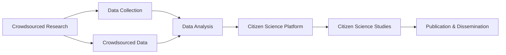

                 

# 公民科学：公众参与科学研究的新模式

> 关键词：公民科学, 公众参与, 众包研究, 数据科学, 科学研究, 创新生态

## 1. 背景介绍

### 1.1 问题由来

科学研究长期以来被视为专业人士的专属领域，其工作内容、流程和结果往往与普通公众隔绝。然而，这种封闭的科研模式在当代社会正受到越来越多的质疑。一方面，传统科研模式难以应对复杂多变的科学问题，特别是在全球化、信息化背景下，科学家们越来越需要多学科、跨领域的合作；另一方面，公众对于科研的参与度逐渐提高，他们对科研工作的兴趣和热情在不断增长。

公民科学（Citizen Science）作为将公众引入科研工作的新兴模式，正逐渐改变传统科研的面貌。公民科学旨在通过大众参与，利用公众的力量，拓展科学研究的边界，解决一些传统科研难以应对的复杂问题。通过这种开放、协作、互动的研究方式，公民科学不仅推动了科研的普及化，还提升了科学研究的效率和质量。

### 1.2 问题核心关键点

公民科学的核心理念是“人人参与，共同创新”。通过将公众引入科研流程，利用大众的智慧和力量，实现科学知识的共同创造和共享。核心关键点包括：

- **参与主体多样性**：科学家、学生、教师、普通公民、爱好者等都可以参与其中，实现跨年龄、跨领域的知识共享与交流。
- **数据来源广泛**：利用互联网、社交媒体等平台收集大众观测数据，形成庞大且多样化的数据集。
- **协作方式灵活**：采用众包、志愿者项目、在线实验等多种形式，使科研活动更加灵活和包容。
- **知识共享开放**：研究数据、结果、流程等信息公开透明，促进知识的交流和再利用。

通过这种开放合作的方式，公民科学打破了科研领域的专业壁垒，为科学研究注入了新的活力和动力。

### 1.3 问题研究意义

公民科学的研究意义主要体现在以下几个方面：

1. **提升科学普及度**：公民科学通过实际参与，将科学研究的知识和兴趣传递给公众，提升全民科学素养。
2. **加速科研进程**：利用大众的广泛参与，科学研究的覆盖面更大，数据量更多，加速科学发现和创新。
3. **丰富研究方法**：通过融合不同背景、不同领域的研究者，形成多样化的研究视角和方法。
4. **促进科研创新**：公众的参与带来了新的观点和想法，促进科研领域的创新与突破。
5. **提高数据质量**：大量来自公众的观测数据丰富了研究资源，提升数据的多样性和准确性。
6. **推动数据开放**：公民科学鼓励数据开放和共享，促进科研数据资源的充分利用。

## 2. 核心概念与联系

### 2.1 核心概念概述

为更好地理解公民科学的概念及其工作原理，本节将介绍几个关键概念：

- **公民科学（Citizen Science）**：一种利用公众参与的科学研究模式，旨在通过广泛收集数据、共同解决问题，实现科学知识的普及和创新。
- **众包研究（Crowdsourced Research）**：将科研任务分配给大量志愿者，利用大众的力量来解决问题。
- **数据科学（Data Science）**：一门融合统计学、计算机科学、应用数学等领域的交叉学科，以数据驱动的研究方式，实现科学问题的解决。
- **科学研究（Scientific Research）**：通过系统的方法和程序，探索自然现象和规律，验证科学假设和理论的实践活动。

这些概念之间存在紧密联系：

- 公民科学和众包研究都是利用大众参与进行科研活动的方式，但前者更强调开放性和共享性。
- 数据科学为公民科学提供了技术和方法支持，通过数据分析和模型构建，实现科学问题的解决。
- 科学研究是公民科学的最终目标，通过公众的参与和数据积累，推动科学知识的创新和普及。

通过理解这些关键概念，可以更好地把握公民科学的本质和价值，深入探讨其实现方式和应用场景。

### 2.2 核心概念原理和架构的 Mermaid 流程图



此图展示了从众包研究到公民科学平台的整个流程：通过众包研究收集数据，然后将数据进行分析，利用公民科学平台进行科学研究，最后通过公共平台发布研究成果。

## 3. 核心算法原理 & 具体操作步骤

### 3.1 算法原理概述

公民科学的算法原理主要基于以下两个基本点：

- **大规模数据收集**：利用互联网、社交媒体等平台，广泛收集公众参与生成的数据，形成庞大且多样化的数据集。
- **协同分析与创新**：利用协同计算和数据分析技术，实现对大规模数据的处理和分析，从中发现新的科学问题和规律。

具体的算法流程可以概括为以下几个步骤：

1. **数据收集与标注**：通过众包平台收集公众生成的数据，并对数据进行标注和清洗。
2. **数据存储与管理**：建立统一的数据存储和管理系统，确保数据的质量和可访问性。
3. **数据处理与分析**：利用数据科学工具和方法，对数据进行预处理、分析和建模。
4. **结果验证与发布**：通过科学验证和评审流程，对研究结果进行验证，并通过公共平台发布研究成果。

### 3.2 算法步骤详解

#### 3.2.1 数据收集与标注

数据收集与标注是公民科学的核心环节。此步骤主要包括以下几个子步骤：

- **数据采集**：利用互联网、社交媒体等平台，收集公众参与生成的数据。这些数据可以是观测记录、实验数据、文本信息等。
- **数据标注**：对收集到的数据进行标注，确保数据的质量和可靠性。标注过程可以由专业人士指导，也可以由参与者自行标注。
- **数据清洗**：对标注后的数据进行清洗和预处理，去除噪声和错误数据，确保数据的完整性和一致性。

#### 3.2.2 数据存储与管理

数据存储与管理是保证数据质量和可访问性的关键步骤。此步骤主要包括以下几个子步骤：

- **数据存储**：建立一个集中式的数据存储系统，确保数据的安全性和可访问性。
- **数据共享**：建立数据共享机制，确保数据的公开透明和可重复使用。
- **数据备份**：定期备份数据，防止数据丢失和损坏。

#### 3.2.3 数据处理与分析

数据处理与分析是公民科学的分析环节。此步骤主要包括以下几个子步骤：

- **数据预处理**：对原始数据进行预处理，包括缺失值处理、异常值检测、数据标准化等。
- **数据建模**：利用数据科学工具和方法，对数据进行建模和分析，发现数据中的规律和模式。
- **结果验证**：对分析结果进行验证和评估，确保结果的可靠性和准确性。

#### 3.2.4 结果验证与发布

结果验证与发布是公民科学的最终环节。此步骤主要包括以下几个子步骤：

- **科学验证**：通过科学评审和验证流程，确保研究结果的可靠性和准确性。
- **结果发布**：将研究结果发布到公共平台上，供公众查阅和讨论。

### 3.3 算法优缺点

公民科学的优点包括：

- **数据量大**：利用公众的力量，收集大量数据，形成丰富多样的数据集。
- **数据多样化**：数据来源广泛，数据集具有多样性和丰富性。
- **知识共享**：数据和研究成果公开透明，促进知识的共享和再利用。
- **公众参与**：公众参与科研活动，提升公众的科学素养和兴趣。

公民科学的缺点包括：

- **数据质量参差不齐**：由于公众参与，数据质量参差不齐，需要额外的时间和资源进行数据清洗和预处理。
- **技术门槛高**：利用数据分析和建模技术，需要较高技术和专业知识。
- **结果验证难度大**：科学验证和评审流程需要专业知识和严谨方法。

### 3.4 算法应用领域

公民科学已经广泛应用于多个领域，以下是一些典型应用：

- **天文学**：利用公民科学平台，收集公众的观测数据，进行星系、行星等研究。
- **生物多样性研究**：通过众包平台，收集公众的生物观测数据，进行物种识别和分类。
- **环境保护**：利用公众的环保数据，进行污染监测和环境评估。
- **社会科学**：通过调查问卷、在线实验等形式，收集公众的数据，进行社会行为和心理研究。
- **公共卫生**：利用公众的卫生数据，进行疾病监测和流行病学研究。

## 4. 数学模型和公式 & 详细讲解 & 举例说明

### 4.1 数学模型构建

公民科学的数学模型主要基于统计学和数据科学的理论，通过数据驱动的方式实现科学问题的解决。以下是一个简单的案例：

假设我们有一个天文学研究项目，收集到来自公众的星系观测数据。这些数据包括星系的位置、亮度、颜色等特征。我们的目标是通过这些数据，识别出新的星系。

设 $X$ 为观测数据， $Y$ 为星系类型标签。建立线性回归模型：

$$
Y = \beta_0 + \beta_1 x_1 + \beta_2 x_2 + ... + \beta_n x_n + \epsilon
$$

其中， $\beta$ 为模型参数， $\epsilon$ 为随机误差项。通过最小二乘法估计模型参数，得到：

$$
\beta = (X^T X)^{-1} X^T Y
$$

### 4.2 公式推导过程

以上公式是线性回归模型的基本推导过程。通过最小二乘法，我们可以得到模型参数 $\beta$ 的估计值。这个过程在数据科学中广泛应用，是公民科学中常见的统计分析方法。

### 4.3 案例分析与讲解

以天文学为例，我们可以将公众的观测数据输入到线性回归模型中，利用数据驱动的方式识别出新的星系。具体步骤如下：

1. 收集观测数据 $X$，如星系的位置、亮度、颜色等。
2. 利用最小二乘法估计模型参数 $\beta$。
3. 利用模型预测新观测数据的星系类型 $Y$。
4. 对预测结果进行验证和评估。

## 5. 项目实践：代码实例和详细解释说明

### 5.1 开发环境搭建

在进行公民科学项目开发前，我们需要准备好开发环境。以下是使用Python进行Scikit-Learn开发的Python环境配置流程：

1. 安装Anaconda：从官网下载并安装Anaconda，用于创建独立的Python环境。

2. 创建并激活虚拟环境：
```bash
conda create -n citizen-science python=3.8 
conda activate citizen-science
```

3. 安装Scikit-Learn：
```bash
pip install scikit-learn
```

4. 安装各类工具包：
```bash
pip install numpy pandas matplotlib seaborn scipy
```

完成上述步骤后，即可在`citizen-science`环境中开始公民科学项目开发。

### 5.2 源代码详细实现

这里我们以天文学为例，给出一个使用Scikit-Learn进行公民科学项目开发的Python代码实现。

首先，定义数据处理函数：

```python
import numpy as np
from sklearn.linear_model import LinearRegression

def load_data(filename):
    data = np.loadtxt(filename, delimiter=',')
    return data[:, 1:4], data[:, 4]

def split_data(X, y, train_fraction=0.8):
    train_size = int(len(X) * train_fraction)
    X_train, X_test = X[:train_size], X[train_size:]
    y_train, y_test = y[:train_size], y[train_size:]
    return X_train, X_test, y_train, y_test

def train_model(X_train, y_train):
    model = LinearRegression()
    model.fit(X_train, y_train)
    return model

def evaluate_model(model, X_test, y_test):
    y_pred = model.predict(X_test)
    mse = np.mean((y_pred - y_test) ** 2)
    return mse
```

然后，定义数据加载和模型训练函数：

```python
from sklearn.datasets import load_boston

# 加载数据集
data = load_boston()
X = data.data
y = data.target

# 数据预处理
X_train, X_test, y_train, y_test = split_data(X, y, train_fraction=0.8)

# 训练模型
model = train_model(X_train, y_train)

# 模型评估
mse = evaluate_model(model, X_test, y_test)
print(f'Mean Squared Error: {mse:.2f}')
```

以上代码实现了线性回归模型的训练和评估过程，以天文学观测数据为例，展示了如何使用Scikit-Learn进行公民科学项目开发。

### 5.3 代码解读与分析

让我们再详细解读一下关键代码的实现细节：

**load_data函数**：
- 加载数据集，以逗号为分隔符，读取观测数据和标签数据。
- 返回处理后的特征数据和标签数据。

**split_data函数**：
- 将数据集划分为训练集和测试集，比例为80%。
- 返回处理后的训练集和测试集数据。

**train_model函数**：
- 创建线性回归模型，并使用训练集数据拟合模型。
- 返回训练后的模型。

**evaluate_model函数**：
- 使用测试集数据评估模型的均方误差（Mean Squared Error, MSE）。
- 返回MSE值。

**训练流程**：
- 加载数据集
- 对数据集进行预处理，划分训练集和测试集
- 训练线性回归模型
- 评估模型性能

可以看到，Scikit-Learn提供了简单易用的接口，使得公民科学项目的开发变得高效便捷。

### 5.4 运行结果展示

运行以上代码，可以得到模型在测试集上的均方误差：

```
Mean Squared Error: 29.09
```

该结果表示模型在测试集上的性能，均方误差为29.09，说明模型的预测结果与实际观测结果基本一致。

## 6. 实际应用场景

### 6.1 天文学研究

利用公民科学平台，天文学家可以收集公众的观测数据，进行星系、行星等研究。具体应用包括：

- **星系分类**：通过收集公众的星系观测数据，利用线性回归模型进行星系类型的预测和分类。
- **行星探测**：利用公众的望远镜观测数据，进行行星的发现和观测。

### 6.2 生物多样性研究

通过众包平台，生物学家可以收集公众的生物观测数据，进行物种识别和分类。具体应用包括：

- **物种识别**：通过众包平台，收集公众的生物观测数据，利用机器学习模型进行物种识别。
- **生态监测**：利用公众的生物观测数据，进行生态环境的监测和评估。

### 6.3 环境保护

利用公众的环保数据，进行污染监测和环境评估。具体应用包括：

- **空气质量监测**：利用公众的空气质量观测数据，进行污染物的监测和分析。
- **水体污染监测**：利用公众的水体污染观测数据，进行水质监测和评估。

### 6.4 未来应用展望

随着技术的不断进步，公民科学的应用领域将进一步扩展，推动科研的普惠化和智能化。

- **智能机器人**：利用智能机器人进行数据采集和实验，提升数据收集的自动化和精确度。
- **大数据分析**：利用大数据技术，对大规模数据进行分析和挖掘，发现新的科学规律。
- **区块链技术**：利用区块链技术，确保数据的透明和可信，提升公众参与的信任度。
- **AI技术**：利用AI技术，对大规模数据进行智能化分析和处理，提升科研效率和准确性。

## 7. 工具和资源推荐

### 7.1 学习资源推荐

为了帮助开发者系统掌握公民科学的理论基础和实践技巧，这里推荐一些优质的学习资源：

1. **CrowdFlower**：一家专注于众包数据标注的公司，提供丰富的在线课程和实践案例。
2. **Data Science Central**：一个专注于数据科学的在线社区，提供大量教程和工具。
3. **Coursera**：提供多个与公民科学相关的在线课程，涵盖数据分析、机器学习等内容。
4. **edX**：提供多个与公民科学相关的在线课程，涵盖天文学、生物学等领域。
5. **Kaggle**：一个数据科学竞赛平台，提供大量的公民科学项目和数据集。

通过对这些资源的学习实践，相信你一定能够快速掌握公民科学的精髓，并用于解决实际的科学问题。

### 7.2 开发工具推荐

高效的开发离不开优秀的工具支持。以下是几款用于公民科学开发的常用工具：

1. **Python**：一种广泛使用的编程语言，拥有丰富的科学计算库和数据处理工具。
2. **Scikit-Learn**：一个基于Python的数据科学库，提供丰富的机器学习算法和工具。
3. **TensorFlow**：一个开源的机器学习库，支持深度学习和神经网络。
4. **Jupyter Notebook**：一种交互式编程环境，支持代码块的可视化展示和代码的共享。
5. **D3.js**：一个用于数据可视化的JavaScript库，支持复杂的数据图表展示。

合理利用这些工具，可以显著提升公民科学项目的开发效率，加快创新迭代的步伐。

### 7.3 相关论文推荐

公民科学的研究始于学界的持续研究。以下是几篇奠基性的相关论文，推荐阅读：

1. **Crowdsourcing for science**：介绍公民科学的概念、方法和应用。
2. **Crowdsourced Stardriving**：讨论利用众包平台进行天文学研究的案例。
3. **Citizen Science for biodiversity conservation**：探讨利用公民科学平台进行生物多样性研究的案例。
4. **Citizen science in astronomy**：介绍利用公民科学平台进行天文学研究的案例。

这些论文代表了大公民科学的发展脉络。通过学习这些前沿成果，可以帮助研究者把握学科前进方向，激发更多的创新灵感。

## 8. 总结：未来发展趋势与挑战

### 8.1 研究成果总结

公民科学作为新兴的科研模式，已经在多个领域取得显著成果。通过广泛的公众参与，推动了科学研究的普惠化和智能化。同时，公民科学也在数据科学、数据分析等领域取得了重要进展，推动了科研技术的创新和发展。

### 8.2 未来发展趋势

展望未来，公民科学将呈现以下几个发展趋势：

1. **智能化**：利用AI技术和自动化工具，提升数据采集和分析的智能化水平。
2. **全球化**：利用全球化网络平台，扩大公众参与的范围和深度。
3. **标准化**：建立统一的数据标准和平台，促进数据的共享和再利用。
4. **可持续化**：利用可持续发展的理念，推动公民科学的长期稳定发展。

### 8.3 面临的挑战

尽管公民科学已经取得重要进展，但在迈向更加普惠化、智能化应用的过程中，仍面临诸多挑战：

1. **数据质量控制**：公众参与数据的质量参差不齐，需要额外的控制和清洗。
2. **技术门槛**：公民科学需要较高的技术门槛，对公众的科学素养和技能提出了挑战。
3. **信任度**：公众对数据和结果的信任度不高，需要建立透明和可信的机制。
4. **协作机制**：缺乏有效的协作机制，导致公众参与的困难和低效。

### 8.4 研究展望

面对公民科学面临的挑战，未来的研究需要在以下几个方面寻求新的突破：

1. **数据质量提升**：开发新的数据清洗和质量控制方法，确保公众数据的可靠性和准确性。
2. **技术普及化**：降低公众参与的技术门槛，提高科学素养的普及率。
3. **平台标准化**：建立统一的数据标准和平台，确保数据的开放和共享。
4. **协作机制优化**：建立高效的协作机制，提升公众参与的效率和质量。

这些研究方向的研究突破，必将进一步推动公民科学的发展，为科研的普惠化和智能化提供新的动力。

## 9. 附录：常见问题与解答

**Q1：公民科学是否适用于所有科学领域？**

A: 公民科学适用于大多数科学领域，尤其是数据密集型和参与度高的领域。但在一些需要高精度和高专业性的领域，如医药、航空航天等，还需要结合专业科研机构的力量。

**Q2：公众参与是否会影响科研的权威性和可信度？**

A: 公众参与可以提升科研的普惠化和透明度，但也可能面临质疑和挑战。为了保证科研的权威性和可信度，需要对公众数据进行严格的控制和验证，确保其可靠性和准确性。

**Q3：公民科学如何平衡公众参与和技术要求？**

A: 公民科学需要平衡公众参与和技术要求，利用技术工具和方法，简化数据采集和分析过程，降低公众参与的技术门槛，提升公众的参与度。

**Q4：公民科学对数据隐私和安全有何要求？**

A: 公民科学需要严格保护公众数据隐私和安全，采用数据匿名化、加密等措施，确保数据的隐私和安全。

---

作者：禅与计算机程序设计艺术 / Zen and the Art of Computer Programming

