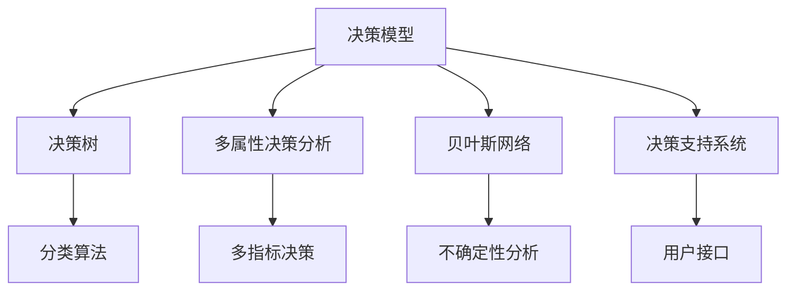

                 

# 决策管理：提高判断力和决策质量

## 1. 背景介绍

### 1.1 问题由来
决策是人类社会和组织活动中最为核心的环节之一。在商业管理、公共治理、科研创新等多个领域，正确的决策直接关系到目标的实现和绩效的提升。然而，在实际决策过程中，人们往往面临信息不完备、资源有限、利益冲突等多重约束，决策质量和效果常常不尽如人意。如何提高个人和组织的决策力，成为当今社会的一项重大挑战。

### 1.2 问题核心关键点
决策管理问题的核心关键点在于如何在信息不完整、资源有限和利益冲突的环境下，通过科学方法和工具，增强决策的准确性和效率。具体来说，需要关注以下方面：
- 信息收集与处理：收集高质量的信息，处理海量数据，确保信息的准确性和完整性。
- 模型选择与构建：选择合适的决策模型，构建高效的算法，提高决策的科学性和客观性。
- 反馈与调整：建立有效的反馈机制，及时调整决策策略，优化决策效果。
- 团队协同与沟通：促进团队协作，共享知识和经验，形成高效的决策共识。
- 风险评估与管理：评估决策的风险和不确定性，制定风险管理策略，保障决策的稳健性。

### 1.3 问题研究意义
研究决策管理问题，对于提升个人和组织的决策能力、优化决策过程、增强决策效果的系统性和可靠性，具有重要意义：

1. **提升决策质量**：通过科学方法和工具，可以有效降低决策过程中的主观性和随意性，提高决策的客观性和准确性。
2. **增强决策效率**：优化决策流程，减少信息过载和资源浪费，加快决策速度和响应速度。
3. **促进创新**：建立科学合理的决策机制，鼓励创新思维和探索精神，推动新方法、新技术的研发和应用。
4. **增强风险管理**：通过系统的风险评估和管理，提高决策的稳健性和抗干扰性，减少决策失误带来的损失。
5. **支持公共治理**：提供科学的决策工具和方法，提升政府和组织的治理能力，构建公正透明、高效务实的公共治理体系。

## 2. 核心概念与联系

### 2.1 核心概念概述

为更好地理解决策管理方法，本节将介绍几个密切相关的核心概念：

- **决策模型（Decision Model）**：用于描述决策过程的数学模型，包括决策树、多属性决策分析、贝叶斯网络等。通过模型，可以系统地处理信息和数据，制定决策方案。
- **决策树（Decision Tree）**：一种基于树形结构的分类算法，通过递归地将样本集划分到不同的决策节点，形成一条路径，最终输出预测结果。决策树易于解释，适合处理离散型数据。
- **多属性决策分析（Multi-Attribute Decision Analysis, MADA）**：一种集成多指标、多维度数据的决策方法，适用于处理复杂的决策问题。MADA通过权重赋值、排序和加权平均等方法，综合多个决策指标，得出最优方案。
- **贝叶斯网络（Bayesian Network）**：一种基于贝叶斯定理的图形模型，用于描述变量之间的因果关系和概率分布。贝叶斯网络能够处理不确定性和不完全信息，适用于复杂系统的决策分析。
- **决策支持系统（Decision Support System, DSS）**：一种集成数据、模型和用户接口的系统，旨在辅助决策者进行决策。DSS提供数据分析、模拟和预测功能，支持用户定制决策方案。

这些核心概念之间的逻辑关系可以通过以下Mermaid流程图来展示：



这个流程图展示了决策模型的主要分支和应用场景：

1. 决策模型作为核心概念，通过不同的子模型进行处理和分析。
2. 决策树和贝叶斯网络用于分类和不确定性分析。
3. 多属性决策分析用于多指标决策。
4. 决策支持系统集成上述工具，形成完整的决策支持流程。

这些概念共同构成了决策管理的基础框架，有助于理解和优化决策过程。

## 3. 核心算法原理 & 具体操作步骤
### 3.1 算法原理概述

决策管理方法的核心在于通过数学模型和算法，系统地处理信息、数据和决策变量，得出最优或满意的决策方案。常见的决策算法包括：

- **决策树算法**：通过递归地对样本进行划分，构建决策树结构，实现分类预测。
- **多属性决策分析算法**：通过对多指标数据进行权重赋值、排序和加权平均，综合多个决策指标，得出最优方案。
- **贝叶斯网络算法**：利用贝叶斯定理计算变量之间的条件概率，构建概率图模型，进行不确定性分析和决策推断。
- **决策支持系统算法**：通过集成的用户接口和数据模型，辅助决策者进行决策，提供数据分析、模拟和预测功能。

这些算法通常需要大量的数据和计算资源，因此如何在高效计算的同时，保证决策的科学性和准确性，是一个重要问题。

### 3.2 算法步骤详解

决策管理方法的典型步骤包括：

**Step 1: 数据准备与预处理**
- 收集决策所需的相关数据，包括定量数据（如统计数据、实验结果）和定性数据（如专家意见、历史案例）。
- 进行数据清洗和预处理，确保数据质量和一致性。

**Step 2: 模型选择与构建**
- 根据决策问题的特点和数据类型，选择合适的决策模型。
- 构建模型，输入数据，设置参数和超参数。

**Step 3: 数据建模与训练**
- 将数据输入模型进行训练，通过迭代优化模型参数，提高模型预测精度。
- 使用交叉验证等技术评估模型性能，避免过拟合和欠拟合。

**Step 4: 结果分析与解释**
- 对模型输出进行分析和解释，评估决策效果和模型鲁棒性。
- 利用可视化工具和报告，呈现决策结果和分析结论。

**Step 5: 决策部署与反馈**
- 将模型部署到实际决策环境中，进行决策实践。
- 建立反馈机制，及时调整决策策略，优化决策效果。

### 3.3 算法优缺点

决策管理方法的优点包括：
- 系统性：通过数学模型和算法，系统地处理信息、数据和决策变量，提高决策的科学性和客观性。
- 灵活性：适用于多种类型的决策问题，可以处理不确定性和不完全信息。
- 可解释性：模型输出易于解释，便于用户理解和接受。

同时，这些方法也存在一些局限性：
- 依赖高质量数据：决策模型的性能很大程度上取决于数据的质量和完整性。
- 计算复杂度高：构建和训练复杂模型需要大量计算资源和时间。
- 用户参与度低：模型通常由数据和算法驱动，用户参与度较低，可能导致决策结果与用户期望不符。

### 3.4 算法应用领域

决策管理方法在多个领域中得到了广泛应用，例如：

- **商业决策**：在企业中，决策管理用于制定投资策略、市场推广计划、产品开发等。
- **公共治理**：在政府和公共机构中，决策管理用于政策制定、风险评估、公共安全等。
- **医疗健康**：在医疗领域，决策管理用于患者诊断、治疗方案选择、资源分配等。
- **教育培训**：在教育中，决策管理用于课程设计、学生评估、师资分配等。
- **环境保护**：在环境保护中，决策管理用于环境监测、污染控制、资源管理等。

这些应用场景展示了决策管理方法的多样性和广泛性，同时也反映了其在提升决策质量和效率方面的重要价值。

## 4. 数学模型和公式 & 详细讲解 & 举例说明

### 4.1 数学模型构建

决策管理方法涉及多个数学模型和公式，以下是几种常见的模型和公式：

**决策树模型**
决策树是一种基于树形结构的分类算法，通过递归地将样本集划分到不同的决策节点，形成一条路径，最终输出预测结果。

**多属性决策分析模型**
多属性决策分析模型用于处理多个指标、多维度数据，通过权重赋值、排序和加权平均等方法，综合多个决策指标，得出最优方案。

**贝叶斯网络模型**
贝叶斯网络是一种基于贝叶斯定理的图形模型，用于描述变量之间的因果关系和概率分布。

### 4.2 公式推导过程

**决策树公式**
决策树的构建过程包括选择划分特征、划分点、递归划分等步骤。假设样本集为 $D=\{(x_i, y_i)\}_{i=1}^N$，其中 $x_i$ 为特征向量，$y_i$ 为标签。

$$
\text{决策树} = \text{tree}(D)
$$

其中，$\text{tree}(D)$ 表示对样本集 $D$ 进行划分，构建决策树的过程。

**多属性决策分析公式**
多属性决策分析通过构建加权平均模型，对多个指标进行综合评估。假设决策指标为 $c_1, c_2, ..., c_m$，权值为 $w_1, w_2, ..., w_m$，决策结果为 $A$。

$$
A = \sum_{i=1}^{m} w_i \times \text{score}(c_i)
$$

其中，$\text{score}(c_i)$ 表示决策指标 $c_i$ 的评估得分。

**贝叶斯网络公式**
贝叶斯网络通过贝叶斯定理计算变量之间的条件概率，构建概率图模型。假设变量集为 $X = \{x_1, x_2, ..., x_n\}$，条件概率为 $P(x_i|x_1, x_2, ..., x_{i-1}, x_{i+1}, ..., x_n)$，先验概率为 $P(x_i)$。

$$
P(x_i|x_1, x_2, ..., x_{i-1}, x_{i+1}, ..., x_n) = \frac{P(x_i) \times \prod_{j=1}^{n} P(x_j|x_i)}{\sum_{i'=1}^{n} P(x_i') \times \prod_{j=1}^{n} P(x_j|x_i')}
$$

### 4.3 案例分析与讲解

**案例一：企业投资决策**
某企业需决定是否投资一个新项目。收集项目的相关数据，包括市场规模、竞争态势、技术成熟度、预期收益等。构建决策树模型，对各项指标进行划分和评估，得出最终决策方案。

**案例二：公共安全决策**
政府需制定公共安全策略，确保城市运行安全。收集历史数据，包括事故发生次数、事故类型、天气因素等，构建贝叶斯网络模型，预测不同天气条件下的事故概率，制定安全措施。

## 5. 项目实践：代码实例和详细解释说明

### 5.1 开发环境搭建

在进行决策管理项目实践前，需要准备好开发环境。以下是使用Python进行决策树和贝叶斯网络开发的常用环境配置流程：

1. 安装Anaconda：从官网下载并安装Anaconda，用于创建独立的Python环境。

2. 创建并激活虚拟环境：
```bash
conda create -n decision-env python=3.8 
conda activate decision-env
```

3. 安装相关库：
```bash
conda install pandas numpy scikit-learn matplotlib
```

4. 安装决策树和贝叶斯网络库：
```bash
pip install scikit-learn pydot graphviz
```

完成上述步骤后，即可在`decision-env`环境中开始项目实践。

### 5.2 源代码详细实现

下面我们以企业投资决策为例，给出使用Scikit-learn库构建决策树的PyTorch代码实现。

```python
import pandas as pd
from sklearn.tree import DecisionTreeClassifier
from sklearn.model_selection import train_test_split
from sklearn.metrics import accuracy_score
import matplotlib.pyplot as plt
import seaborn as sns

# 加载数据集
data = pd.read_csv('investment_data.csv')

# 数据预处理
X = data.drop(['investment'], axis=1)
y = data['investment']

# 划分训练集和测试集
X_train, X_test, y_train, y_test = train_test_split(X, y, test_size=0.3, random_state=42)

# 构建决策树模型
clf = DecisionTreeClassifier(max_depth=3, random_state=42)
clf.fit(X_train, y_train)

# 预测并评估模型
y_pred = clf.predict(X_test)
accuracy = accuracy_score(y_test, y_pred)
print(f'模型准确度：{accuracy:.2f}')

# 可视化决策树
dot_data = export_graphviz(clf, out_file=None, feature_names=X.columns, class_names=['Yes', 'No'], filled=True)
graph = Digraph()
graph.add_graph(dot_data)
graph.render("decision_tree.dot", format="png")
plt.figure(figsize=(10, 8))
sns.set_style("whitegrid")
plt.title("决策树")
plt.show()
```

### 5.3 代码解读与分析

让我们再详细解读一下关键代码的实现细节：

**数据加载与预处理**
- 使用Pandas库加载企业投资数据，并进行数据清洗和特征选择。

**模型构建与训练**
- 使用Scikit-learn库中的DecisionTreeClassifier构建决策树模型，并设置最大深度为3，确保模型不过拟合。
- 使用train_test_split将数据集划分为训练集和测试集，并设置随机种子为42，确保结果可复现。
- 调用fit方法对训练集进行模型训练，并设置参数随机状态为42，确保模型训练的可复现性。

**模型评估与可视化**
- 使用accuracy_score评估模型在测试集上的准确度，并打印输出。
- 使用export_graphviz将决策树导出为DOT格式，并使用Graphviz库可视化。
- 使用SNS库绘制决策树的可视化图，展示决策树的节点和分支。

通过上述代码，可以构建一个简单的决策树模型，用于企业投资决策的评估和可视化。

## 6. 实际应用场景
### 6.1 企业投资决策

在企业投资决策中，决策管理方法可以帮助企业评估投资项目的风险和收益，做出更加科学合理的决策。

企业可以通过收集项目相关的市场数据、技术数据、财务数据等，构建决策树模型，对各指标进行递归划分，得出最优的投资方案。通过可视化工具展示决策树，企业管理层可以直观了解各个因素对决策的影响，从而做出更有信心的决策。

### 6.2 公共安全决策

公共安全决策是政府和公共机构面临的重要任务。通过决策管理方法，可以建立贝叶斯网络模型，预测不同环境因素下的事故概率，制定相应的安全措施。

例如，政府可以收集历史交通事故数据，包括时间、地点、天气等因素，构建贝叶斯网络模型，预测不同天气条件下的交通事故概率。根据预测结果，制定针对性的交通管理措施，降低事故发生率。

### 6.3 医疗健康决策

医疗健康领域决策管理方法的应用也非常广泛。医疗决策涉及病人的诊断、治疗方案选择、药物选择等多个方面。通过多属性决策分析，综合考虑病人的病情、治疗效果、成本等因素，制定最优的医疗方案。

例如，医院可以通过收集病人的病历数据、诊断结果、治疗效果等，构建多属性决策模型，综合评估不同治疗方案的效果和成本，选择最优的治疗方案。

### 6.4 未来应用展望

随着数据科学和人工智能技术的发展，决策管理方法的应用将更加广泛和深入。未来，决策管理将在以下几个方面得到进一步发展：

1. **大数据与AI的融合**：结合大数据分析和人工智能技术，决策管理将更加智能化和自动化。
2. **多学科融合**：将经济学、社会学、心理学等多个学科的知识和方法，融入决策管理模型中，提高决策的全面性和科学性。
3. **实时决策与动态优化**：利用物联网和实时数据分析技术，实现动态优化和实时决策，提高决策的效率和灵活性。
4. **智能决策辅助**：通过机器学习和自然语言处理技术，构建智能决策辅助系统，提升决策的准确性和效率。

这些趋势展示了决策管理方法的广阔前景，也反映了其在提升决策质量和效率方面的重要价值。

## 7. 工具和资源推荐
### 7.1 学习资源推荐

为了帮助开发者系统掌握决策管理的方法和工具，这里推荐一些优质的学习资源：

1. 《数据科学导论》：由数据科学专家撰写，全面介绍了数据科学的基本概念和常用方法，适合初学者入门。
2. 《决策树与随机森林》：详细讲解决策树算法原理和应用，适合深入学习决策树模型。
3. 《多属性决策分析》：系统介绍多属性决策分析的理论和应用，适合处理复杂的多指标决策问题。
4. 《贝叶斯网络入门与实践》：介绍贝叶斯网络的原理和应用，适合学习和实践贝叶斯网络模型。
5. 《决策支持系统与决策分析》：系统介绍决策支持系统的设计和应用，适合了解和开发决策支持系统。

通过对这些资源的学习实践，相信你一定能够快速掌握决策管理的方法和工具，并应用于实际的决策场景中。

### 7.2 开发工具推荐

高效的决策管理项目开发需要依托优秀的工具支持。以下是几款用于决策管理开发的常用工具：

1. Python：Python是一门功能强大的编程语言，具有丰富的数据处理和分析库，如Pandas、NumPy、Scikit-learn等，适合决策管理的开发。
2. R语言：R语言是专门用于数据分析和统计分析的编程语言，具有丰富的数据处理和分析库，如dplyr、ggplot2等，适合多属性决策分析和贝叶斯网络模型的开发。
3. SQL：SQL是用于数据库管理和查询的编程语言，适合处理和分析大量的结构化数据。
4. Tableau：Tableau是一款数据可视化工具，可以高效地将数据转换为图表和报表，支持决策分析的可视化展示。
5. Power BI：Power BI是微软推出的数据可视化工具，可以与Excel等办公软件无缝集成，支持实时数据分析和决策支持。

合理利用这些工具，可以显著提升决策管理项目的开发效率，加快创新迭代的步伐。

### 7.3 相关论文推荐

决策管理的研究源于学界的持续研究。以下是几篇奠基性的相关论文，推荐阅读：

1. "Decision Trees and Their Applications"：介绍决策树算法的原理和应用，是决策树领域的重要文献。
2. "Multi-Attribute Decision Making"：详细讨论多属性决策分析的理论和应用，是决策分析领域的经典著作。
3. "Bayesian Networks and Classical Probability Theory"：介绍贝叶斯网络的原理和应用，是贝叶斯网络领域的奠基之作。
4. "Decision Support Systems"：全面介绍决策支持系统的理论和方法，是决策支持系统领域的经典著作。
5. "Theory and Methods of Decision Making"：介绍决策理论和方法的全面综述，是决策管理领域的经典著作。

这些论文代表了大决策管理技术的发展脉络。通过学习这些前沿成果，可以帮助研究者把握学科前进方向，激发更多的创新灵感。

## 8. 总结：未来发展趋势与挑战
### 8.1 总结

本文对决策管理方法进行了全面系统的介绍。首先阐述了决策管理问题的背景和核心关键点，明确了决策管理在提升决策质量和效率方面的重要价值。其次，从原理到实践，详细讲解了决策管理方法的数学模型和算法实现。通过具体案例和代码实例，展示了决策管理方法在实际应用中的广泛应用。

通过本文的系统梳理，可以看到，决策管理方法正在成为提升决策质量的重要手段，极大地优化了决策过程和结果。未来，伴随数据科学和人工智能技术的不断进步，决策管理方法必将迎来更加广阔的应用前景，深刻影响人类的生产生活方式。

### 8.2 未来发展趋势

展望未来，决策管理方法将呈现以下几个发展趋势：

1. **数据科学和人工智能的融合**：结合大数据分析和人工智能技术，决策管理将更加智能化和自动化。
2. **多学科融合**：将经济学、社会学、心理学等多个学科的知识和方法，融入决策管理模型中，提高决策的全面性和科学性。
3. **实时决策与动态优化**：利用物联网和实时数据分析技术，实现动态优化和实时决策，提高决策的效率和灵活性。
4. **智能决策辅助**：通过机器学习和自然语言处理技术，构建智能决策辅助系统，提升决策的准确性和效率。

以上趋势凸显了决策管理方法的广阔前景，也反映了其在提升决策质量和效率方面的重要价值。

### 8.3 面临的挑战

尽管决策管理方法已经取得了重要进展，但在迈向更加智能化、普适化应用的过程中，仍面临诸多挑战：

1. **数据质量与完整性**：决策管理方法依赖高质量的数据，如何确保数据的质量和完整性，是决策管理的一个重要挑战。
2. **模型复杂度**：构建复杂的决策模型需要大量的计算资源和时间，如何平衡模型复杂度和决策效率，是一大难题。
3. **用户参与度**：模型通常由数据和算法驱动，用户参与度较低，可能导致决策结果与用户期望不符。
4. **决策透明度**：决策模型通常被视为"黑盒"系统，用户难以理解和解释其内部工作机制和决策逻辑。
5. **伦理与安全**：决策模型可能学习到有偏见、有害的信息，如何确保决策模型的伦理和安全，是一大挑战。

正视这些挑战，积极应对并寻求突破，将使决策管理方法更加成熟和可靠。相信随着学界和产业界的共同努力，决策管理方法必将在构建安全、可靠、可解释、可控的智能系统方面发挥重要作用。

### 8.4 研究展望

未来，决策管理方法需要在以下几个方面寻求新的突破：

1. **数据驱动与知识驱动的结合**：结合数据驱动和知识驱动，构建更加全面、准确的决策模型。
2. **模型解释性与可解释性**：开发可解释性强的决策模型，确保用户理解和接受决策结果。
3. **动态决策与学习决策**：结合动态系统和学习系统，构建能够实时调整和优化的决策模型。
4. **跨领域应用**：将决策管理方法应用于更多领域，如医疗、教育、金融等，推动各个领域的智能化发展。

这些研究方向将使决策管理方法更加成熟和全面，为人类社会的智能化转型提供新的技术支持。

## 9. 附录：常见问题与解答
----------------------------------------------------------------

**Q1: 什么是决策管理？**

A: 决策管理是一种通过数据、模型和算法，系统地处理信息、数据和决策变量，得出最优或满意的决策方案的方法。

**Q2: 决策管理有哪些常用的方法？**

A: 决策管理常用的方法包括决策树、多属性决策分析、贝叶斯网络等。

**Q3: 决策管理在实际应用中有哪些优势？**

A: 决策管理在实际应用中具有以下优势：
- 系统性：通过数学模型和算法，系统地处理信息、数据和决策变量，提高决策的科学性和客观性。
- 灵活性：适用于多种类型的决策问题，可以处理不确定性和不完全信息。
- 可解释性：模型输出易于解释，便于用户理解和接受。

**Q4: 如何构建决策树模型？**

A: 构建决策树模型的主要步骤如下：
1. 收集数据，并进行数据预处理。
2. 选择合适的划分特征，确定划分点。
3. 递归地对样本进行划分，构建决策树结构。
4. 使用模型进行预测，并进行评估。

**Q5: 多属性决策分析的原理是什么？**

A: 多属性决策分析通过构建加权平均模型，对多个指标进行综合评估。

**Q6: 贝叶斯网络的原理是什么？**

A: 贝叶斯网络是一种基于贝叶斯定理的图形模型，用于描述变量之间的因果关系和概率分布。

**Q7: 决策管理在企业投资决策中的应用有哪些？**

A: 在企业投资决策中，决策管理方法可以帮助企业评估投资项目的风险和收益，做出更加科学合理的决策。

**Q8: 决策管理在公共安全决策中的应用有哪些？**

A: 在公共安全决策中，决策管理方法可以建立贝叶斯网络模型，预测不同环境因素下的事故概率，制定相应的安全措施。

**Q9: 决策管理在医疗健康决策中的应用有哪些？**

A: 在医疗健康决策中，决策管理方法可以通过多属性决策分析，综合考虑病人的病情、治疗效果、成本等因素，制定最优的医疗方案。

**Q10: 决策管理在未来有哪些发展趋势？**

A: 决策管理在未来的发展趋势包括大数据与AI的融合、多学科融合、实时决策与动态优化、智能决策辅助等。

通过这些问题的解答，可以帮助读者更全面地理解决策管理的方法和应用，进一步提升决策质量和管理效率。

