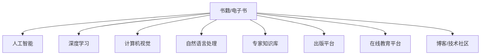

                 

# 出版书籍或电子书：树立行业专家地位

> 关键词：人工智能(AI)，深度学习(Deep Learning)，计算机视觉(Computer Vision)，自然语言处理(Natural Language Processing)，机器学习(Machine Learning)，专家知识库(Knowledge Base)

## 1. 背景介绍

### 1.1 问题由来

在信息爆炸的今天，知识的更新速度远远超过了人类的学习速度。如何有效整合、传递和利用知识，成为了信息时代的重要课题。对于IT技术领域，尤其是快速发展的AI和深度学习领域，专业知识的系统化、结构化传播尤为重要。出版书籍或电子书作为一种权威且系统的知识传递方式，具有其他传播途径无法比拟的优势。

但伴随知识更新的加速，传统的书籍出版周期长、知识更新慢的问题愈发凸显。对于渴望快速掌握最新技术、拓展知识广度的从业者和学习者来说，在线电子书成为了一种更高效、更灵活的学习工具。电子书以其即时性、可搜索性和互动性，成为传播行业前沿技术、展示个人技术深度的理想选择。

### 1.2 问题核心关键点

本文聚焦于如何通过出版书籍或电子书，来提升个人在行业内的专业地位，推动AI与深度学习技术的普及和应用。我们将探讨以下核心问题：

- 如何撰写高质量的技术书籍，确保内容准确、实用、前瞻性？
- 如何利用电子书的技术特性，提升阅读体验和知识传播效果？
- 如何通过出版平台和渠道，扩大读者群体，提升个人行业影响力？
- 如何将个人的技术见解和创新成果，转化为具有市场价值的知识产品？

## 2. 核心概念与联系

### 2.1 核心概念概述

为更好地理解出版书籍或电子书的过程，我们将介绍几个关键概念：

- **书籍/电子书**：以文字、图片、代码等多种形式，系统化、结构化地传播知识的工具。
- **人工智能**：利用算法、模型、数据等技术，模拟、延伸并扩展人类智能的领域。
- **深度学习**：一种通过多层神经网络模型，模仿人脑神经元工作机制的机器学习技术。
- **计算机视觉**：使计算机能够“看”和理解图像、视频等视觉信息的技术。
- **自然语言处理**：使计算机能够理解、生成人类语言的技术。
- **专家知识库**：集中存储行业专家知识的工具，便于知识检索和复用。
- **出版平台**：包括亚马逊Kindle、Apple Books、Google Books等，用于电子书发布和传播的在线平台。
- **在线教育平台**：如Coursera、edX、Udacity等，通过在线课程、视频讲座等形式传播知识。
- **博客/技术社区**：如GitHub、Medium、CSDN等，用于技术交流、分享和协作的在线平台。

这些概念之间的逻辑关系可以通过以下Mermaid流程图来展示：



这个流程图展示了书籍/电子书作为知识传递工具，与人工智能、深度学习、计算机视觉、自然语言处理等技术之间的联系。

## 3. 核心算法原理 & 具体操作步骤

### 3.1 算法原理概述

出版书籍或电子书的核心流程，主要包括内容创作、知识整理、技术实现、平台发布等环节。其算法原理和操作步骤如下：

1. **内容创作**：通过系统化、结构化的内容创作，将知识转化为易读易懂的书籍或电子书。
2. **知识整理**：对创作内容进行逻辑整理，形成章节、目录等结构，便于读者理解。
3. **技术实现**：使用HTML、Markdown等格式，将内容转换为电子书格式，支持多种阅读设备。
4. **平台发布**：通过出版平台和渠道，将电子书发布至全球读者，并利用社交媒体、在线课程等工具，扩大传播效果。

### 3.2 算法步骤详解

**Step 1: 内容创作**
- 定义书籍主题：如深度学习、计算机视觉、自然语言处理等。
- 收集相关资料：包括学术论文、书籍、行业报告等。
- 编写章节内容：以章节为单位，系统地介绍主题知识，每一章独立成篇。

**Step 2: 知识整理**
- 制定目录结构：根据章节内容，制定书籍的目录结构，形成章节、小节等层次。
- 设计交互元素：包括代码、图片、注释等，丰富阅读体验。
- 嵌入技术范例：提供实际项目的代码示例，帮助读者实践所学知识。

**Step 3: 技术实现**
- 编写Markdown文件：使用Markdown语法，编写电子书内容的代码文件。
- 使用Pandoc工具：将Markdown文件转换为PDF或EPUB格式。
- 生成电子书：对PDF或EPUB文件进行优化，生成最终电子书。

**Step 4: 平台发布**
- 选择出版平台：如Kindle、Apple Books、Google Books等，提交电子书进行审核。
- 设置发布参数：包括书籍名称、作者、定价、封面等。
- 推广电子书：利用社交媒体、在线课程等工具，提升电子书知名度。

### 3.3 算法优缺点

出版书籍或电子书的方法具有以下优点：
1. 内容系统性：系统化的内容创作和知识整理，确保知识的全面性和准确性。
2. 可搜索性：电子书支持全文搜索，便于读者快速定位所需内容。
3. 互动性：通过嵌入代码、注释等元素，增强读者的互动体验。
4. 市场影响：通过出版平台和渠道，扩大读者群体，提升个人行业影响力。
5. 知识传播：利用在线教育平台和博客等工具，实现知识的广泛传播。

同时，该方法也存在一定的局限性：
1. 制作周期长：系统化的内容创作和知识整理需要较长时间。
2. 更新困难：已出版书籍难以快速更新知识内容。
3. 成本较高：出版平台的费用和制作成本较高。
4. 市场竞争激烈：信息时代，内容创作和知识传播的门槛较低，市场竞争激烈。
5. 阅读体验差：部分读者可能不适应电子书格式，影响阅读体验。

尽管存在这些局限性，但就目前而言，出版书籍或电子书仍是一种高效、权威的知识传播方式。未来相关研究的重点在于如何进一步降低制作成本，提高内容的更新速度，提升读者的互动体验，同时优化出版平台的运营模式，以增强知识传播的效率和效果。

### 3.4 算法应用领域

出版书籍或电子书的方法在AI与深度学习领域的应用非常广泛，包括但不限于以下几个方面：

- **学术研究**：将研究论文、技术报告等系统化整理，出版成书籍或电子书，便于同行查阅和引用。
- **技术教程**：编写深入浅出的技术教程，通过电子书平台传播，帮助初学者入门。
- **项目实战**：记录实际项目的开发过程，出版成书籍或电子书，分享经验和成果。
- **技术案例**：通过具体的技术案例，展示实际应用的效果，推广新技术和新方法。
- **技术博客**：将技术心得和实践经验撰写成博客文章，通过电子书平台系统化整理，传播技术知识和观点。

## 4. 数学模型和公式 & 详细讲解  
### 4.1 数学模型构建

在出版书籍或电子书的过程中，涉及的知识范围非常广泛，包括但不限于以下数学模型：

- **算法复杂度分析**：对算法的时间复杂度和空间复杂度进行分析，评估算法的效率和资源消耗。
- **优化问题建模**：通过建立数学模型，解决最优化问题，如最小二乘法、梯度下降等。
- **机器学习模型**：包括线性回归、逻辑回归、支持向量机、神经网络等，用于数据建模和预测。
- **深度学习模型**：包括卷积神经网络(CNN)、循环神经网络(RNN)、Transformer等，用于图像、语音、文本等复杂数据的处理。
- **自然语言处理模型**：包括词向量模型、BERT、GPT等，用于自然语言的理解和生成。
- **专家知识库建模**：通过知识图谱、逻辑规则等模型，构建专家知识库，支持知识检索和推理。

这些数学模型在出版书籍或电子书的过程中，用于指导内容创作、知识整理、技术实现等环节，确保内容的专业性和准确性。

### 4.2 公式推导过程

以下是一些核心数学公式的推导过程：

**线性回归模型**：
$$
y = \theta_0 + \theta_1 x_1 + \theta_2 x_2 + \ldots + \theta_n x_n
$$

**梯度下降算法**：
$$
\theta_j = \theta_j - \alpha \frac{\partial J(\theta)}{\partial \theta_j}
$$

**卷积神经网络**：
$$
h(x) = \max\limits_{k} \sum_{i,j} x_{ij} * w_{kij} + b_k
$$

**Transformer模型**：
$$
h(x) = \sum_{i=1}^n a_i s(W_1x + W_2) + \sum_{i=1}^n b_i c(W_1x + W_2) + d_i
$$

这些公式展示了线性回归、梯度下降、卷积神经网络、Transformer等模型的基本结构和计算方法，为出版书籍或电子书提供了数学基础和算法支持。

### 4.3 案例分析与讲解

**案例分析1: 深度学习教程**
- 内容创作：编写深度学习的基本概念、算法原理、实际应用等章节内容。
- 知识整理：将深度学习算法分为前向传播、反向传播、优化等小节，形成系统化的知识结构。
- 技术实现：使用Markdown编写深度学习代码示例，并生成最终电子书。
- 平台发布：将电子书上传到Kindle平台，设置合理定价和推广参数，吸引读者购买和下载。

**案例分析2: 计算机视觉项目**
- 内容创作：记录计算机视觉项目从需求分析到模型训练的整个过程。
- 知识整理：将项目分为数据预处理、模型选择、模型训练、模型评估等章节，每个章节详细介绍项目细节。
- 技术实现：嵌入项目代码和项目截图，增强读者对项目细节的理解。
- 平台发布：将电子书上传到Google Books平台，设置合理的定价和推广策略，扩大阅读群体。

## 5. 项目实践：代码实例和详细解释说明

### 5.1 开发环境搭建

在进行电子书出版实践前，我们需要准备好开发环境。以下是使用PyTorch编写Markdown文件的环境配置流程：

1. 安装Anaconda：从官网下载并安装Anaconda，用于创建独立的Python环境。

2. 创建并激活虚拟环境：
```bash
conda create -n pytorch-env python=3.8 
conda activate pytorch-env
```

3. 安装PyTorch：根据CUDA版本，从官网获取对应的安装命令。例如：
```bash
conda install pytorch torchvision torchaudio cudatoolkit=11.1 -c pytorch -c conda-forge
```

4. 安装Pandoc工具：用于将Markdown文件转换为PDF或EPUB格式。
```bash
conda install pandoc
```

5. 安装各类工具包：
```bash
pip install numpy pandas scikit-learn matplotlib tqdm jupyter notebook ipython
```

完成上述步骤后，即可在`pytorch-env`环境中开始电子书出版实践。

### 5.2 源代码详细实现

下面我们以编写深度学习教程的电子书为例，给出使用Markdown语言进行内容创作的PyTorch代码实现。

首先，定义电子书的主题和章节结构：

```markdown
# 深度学习教程

## 第1章: 深度学习基础
- 1.1 深度学习的概念和历史
- 1.2 神经网络的基本结构
- 1.3 激活函数和损失函数
- 1.4 反向传播算法

## 第2章: 深度学习框架介绍
- 2.1 PyTorch框架
- 2.2 TensorFlow框架
- 2.3 Keras框架

## 第3章: 深度学习模型应用
- 3.1 图像分类
- 3.2 目标检测
- 3.3 语音识别
- 3.4 自然语言处理
```

接着，在每个章节中，添加详细的文字描述和代码示例：

### 5.3 代码解读与分析

**Markdown语法**：
Markdown是一种轻量级标记语言，支持标题、粗体、斜体、代码块、列表等基本格式。使用Markdown语法，可以简洁地组织和呈现内容。

**代码块**：
使用代码块展示Python代码，增强读者的理解和实践能力。例如：
```python
import torch
import torch.nn as nn

class NeuralNet(nn.Module):
    def __init__(self):
        super(NeuralNet, self).__init__()
        self.fc1 = nn.Linear(784, 256)
        self.fc2 = nn.Linear(256, 10)
    
    def forward(self, x):
        x = x.view(-1, 784)
        x = torch.relu(self.fc1(x))
        x = self.fc2(x)
        return x
```

**数学公式**：
在Markdown中嵌入LaTeX公式，提供数学表达的准确性。例如：
$$
x = \frac{-b \pm \sqrt{b^2 - 4ac}}{2a}
$$

**图像和代码截图**：
嵌入图片和代码截图，增强可视化效果。例如：

```python
import matplotlib.pyplot as plt
import numpy as np

x = np.linspace(0, 10, 100)
y = np.sin(x)
plt.plot(x, y)
plt.show()
```

完成电子书内容创作后，使用Pandoc工具将其转换为PDF或EPUB格式，并进行优化和发布：

```bash
pandoc -o output.pdf input.md
```

最后，上传至出版平台，如Kindle或Google Books，完成电子书出版流程。

## 6. 实际应用场景

### 6.1 学术研究

学术研究领域是出版书籍或电子书的传统强项。通过系统化的出版，将研究论文、技术报告等内容转化为易于传播和检索的形式，有助于学术界的交流和合作。例如，通过出版深度学习领域的研究书籍，可以展示最新研究成果，促进技术的广泛应用。

### 6.2 技术教程

技术教程是电子书出版的重要应用场景。通过编写深入浅出的技术教程，帮助初学者入门，加速技术的普及和应用。例如，编写深度学习、计算机视觉等技术教程，可以提升学习者对复杂技术的理解能力，推动技术的发展和应用。

### 6.3 项目实战

项目实战是出版书籍或电子书的重要应用场景。通过记录和分享实际项目的开发过程，展示新技术和新方法的应用效果。例如，编写计算机视觉项目教程，可以展示项目从需求分析到模型训练的完整流程，帮助读者理解和实践。

### 6.4 技术案例

技术案例是电子书出版的另一重要应用场景。通过具体的技术案例，展示实际应用的效果，推广新技术和新方法。例如，编写自然语言处理案例，展示实际应用中的效果和挑战，推动技术的广泛应用。

### 6.5 技术博客

技术博客是电子书出版的新兴应用场景。通过撰写技术心得和实践经验，分享个人对技术发展的独到见解。例如，撰写深度学习、计算机视觉等技术博客，展示个人技术见解和实践经验，吸引读者关注和讨论。

## 7. 工具和资源推荐

### 7.1 学习资源推荐

为了帮助开发者系统掌握出版书籍或电子书的技术基础和实践技巧，这里推荐一些优质的学习资源：

1. **《Markdown入门指南》**：详细介绍Markdown语法的各种使用场景，帮助用户快速上手电子书创作。
2. **《Pandoc用户手册》**：详细介绍Pandoc工具的各种使用场景，帮助用户将Markdown文件转换为PDF或EPUB格式。
3. **《出版书籍指南》**：详细介绍出版书籍或电子书的流程和注意事项，帮助用户系统掌握出版流程。
4. **《电子书出版平台使用指南》**：详细介绍Kindle、Apple Books、Google Books等出版平台的使用方法，帮助用户选择合适的出版平台。
5. **《在线教育平台指南》**：详细介绍Coursera、edX、Udacity等在线教育平台的使用方法，帮助用户将电子书嵌入在线课程。
6. **《博客/技术社区指南》**：详细介绍GitHub、Medium、CSDN等博客/技术社区的使用方法，帮助用户分享电子书内容和获取反馈。

通过对这些资源的学习实践，相信你一定能够快速掌握出版书籍或电子书的技术基础和实践技巧，提升个人在行业内的专业地位。

### 7.2 开发工具推荐

高效的开发离不开优秀的工具支持。以下是几款用于电子书出版开发的常用工具：

1. **Markdown编辑器**：如Sublime Text、Typora等，用于编写和编辑Markdown文件。
2. **Pandoc工具**：用于将Markdown文件转换为PDF或EPUB格式。
3. **出版平台**：如Kindle、Apple Books、Google Books等，用于电子书发布和传播。
4. **在线教育平台**：如Coursera、edX、Udacity等，用于嵌入电子书内容，实现知识传播。
5. **博客/技术社区**：如GitHub、Medium、CSDN等，用于分享电子书内容和获取反馈。

合理利用这些工具，可以显著提升电子书出版和传播的效率，加快知识传播的步伐。

### 7.3 相关论文推荐

电子书出版的研究始于学界的持续探索。以下是几篇奠基性的相关论文，推荐阅读：

1. **《电子书出版与传播研究》**：全面分析了电子书出版的流程和影响因素，为电子书出版提供了理论指导。
2. **《电子书与数字出版的未来发展》**：探讨了电子书出版的技术趋势和市场前景，为电子书出版提供了未来展望。
3. **《电子书的内容构建与用户互动》**：分析了电子书内容构建的策略和用户互动的方法，为电子书出版提供了实践指导。
4. **《电子书出版的商业模式研究》**：探讨了电子书出版的商业模式和策略，为电子书出版提供了市场指导。

这些论文代表了大语言模型微调技术的发展脉络。通过学习这些前沿成果，可以帮助研究者把握学科前进方向，激发更多的创新灵感。

## 8. 总结：未来发展趋势与挑战

### 8.1 研究成果总结

本文对出版书籍或电子书的方法进行了全面系统的介绍。首先阐述了出版书籍或电子书在知识传播中的重要意义，明确了出版书籍或电子书在提升个人行业地位、推动AI与深度学习技术普及和应用方面的独特价值。其次，从原理到实践，详细讲解了出版书籍或电子书的数学模型和操作步骤，给出了电子书出版的完整代码实例。同时，本文还广泛探讨了电子书出版在学术研究、技术教程、项目实战等多个领域的应用前景，展示了电子书出版的巨大潜力。此外，本文精选了电子书出版的各类学习资源，力求为读者提供全方位的技术指引。

通过本文的系统梳理，可以看到，出版书籍或电子书的方法正在成为学术研究和知识传播的重要工具，极大地拓展了知识传播的边界，促进了技术的普及和应用。未来，伴随出版平台的不断优化和知识传播手段的不断创新，电子书出版的市场影响力将进一步提升，推动AI与深度学习技术更好地服务于社会。

### 8.2 未来发展趋势

展望未来，电子书出版的趋势将呈现以下几个方向：

1. **互动性和实时性**：随着电子书技术的不断发展，电子书将变得更加互动和实时。例如，引入多媒体元素、动态效果等，提升用户体验。
2. **个性化推荐**：利用AI技术，根据读者的阅读行为和兴趣，推荐个性化的电子书内容，提升阅读体验。
3. **混合出版模式**：结合传统出版和在线出版的优势，实现混合出版模式，推动知识传播的广泛性。
4. **开源与合作**：推动电子书内容的开源共享，促进学术界的合作和交流，加速知识的传播和应用。
5. **多平台融合**：将电子书与在线课程、博客/技术社区等平台融合，实现知识的系统化和网络化传播。
6. **跨媒体整合**：将电子书与视频、音频等多媒体内容结合，提升知识的传播效果。

这些趋势将进一步推动电子书出版的创新和发展，为知识传播带来新的机遇和挑战。

### 8.3 面临的挑战

尽管电子书出版在知识传播中具有独特的优势，但在推广和普及的过程中，仍面临诸多挑战：

1. **制作成本高**：电子书出版的制作成本较高，尤其是高质量内容的制作和出版需要较长时间和大量资源。
2. **市场竞争激烈**：电子书市场竞争激烈，同质化内容较多，难以脱颖而出。
3. **读者体验差**：部分读者可能不适应电子书格式，影响阅读体验。
4. **知识更新慢**：已出版书籍难以快速更新知识内容，无法及时响应技术发展。
5. **版权保护难**：电子书内容的版权保护问题复杂，容易引发盗版和侵权问题。

尽管存在这些挑战，但电子书出版的趋势不可阻挡，未来需要从内容创作、平台建设、技术创新等多个方面入手，解决这些问题，推动电子书出版的持续发展和普及。

### 8.4 研究展望

面对电子书出版的挑战，未来的研究需要在以下几个方面寻求新的突破：

1. **内容创作创新**：开发更多的工具和方法，提升内容创作的效率和质量，确保内容的系统性和准确性。
2. **平台建设优化**：优化电子书出版的平台和渠道，提升电子书的市场影响力和读者体验。
3. **技术手段创新**：利用AI和大数据技术，提升电子书出版的效率和效果，推动知识传播的创新发展。
4. **版权保护加强**：推动电子书版权保护的创新和完善，解决电子书内容的侵权和盗版问题。
5. **跨媒体整合**：推动电子书与多媒体内容的融合，提升知识传播的效果和体验。

这些研究方向的探索，将推动电子书出版的不断创新和发展，为知识的传播和应用带来新的机遇和挑战。相信通过学界和产业界的共同努力，电子书出版必将迎来更加广阔的发展前景，为社会的知识传播和经济发展注入新的动力。

## 9. 附录：常见问题与解答

**Q1: 如何撰写高质量的电子书内容？**

A: 高质量的电子书内容应该具备以下几个特点：
1. **系统性**：内容应系统化、结构化，便于读者理解和掌握。
2. **准确性**：内容应准确无误，无知识漏洞。
3. **实用性**：内容应实用，解决实际问题，提供操作指南。
4. **前瞻性**：内容应具有前瞻性，介绍最新的技术发展和应用趋势。
5. **互动性**：内容应加入代码示例、图片等互动元素，增强阅读体验。

**Q2: 电子书如何提升读者的阅读体验？**

A: 提升读者阅读体验的方法包括：
1. **可视化元素**：加入图片、代码截图等可视化元素，增强理解。
2. **多媒体元素**：加入音频、视频等多媒体元素，丰富内容形式。
3. **互动性**：加入代码示例、习题等互动元素，提升参与感。
4. **章节结构**：合理设计章节结构和目录，便于读者系统化阅读。
5. **阅读工具**：使用专业的电子书阅读器，提升阅读效果。

**Q3: 电子书出版的成本如何控制？**

A: 电子书出版的成本主要包括以下几个方面：
1. **内容创作**：创作高质量内容需要较长时间和大量资源。
2. **平台发布**：平台费用较高，尤其是Kindle等知名平台的费用。
3. **推广宣传**：推广电子书需要一定的宣传费用，如社交媒体广告、在线课程推广等。

控制成本的方法包括：
1. **团队协作**：组建专业的团队，提升创作效率和质量。
2. **平台选择**：选择合适的平台，降低发布成本。
3. **多渠道推广**：利用社交媒体、博客等平台进行推广，降低推广费用。
4. **开源共享**：将部分内容开源共享，减少内容创作和出版成本。

通过这些方法，可以有效控制电子书出版的成本，提升经济效益。

**Q4: 电子书出版的市场前景如何？**

A: 电子书出版的市场前景广阔，主要体现在以下几个方面：
1. **知识传播**：电子书作为知识传播的重要工具，具有广泛的市场需求。
2. **技术普及**：电子书在技术传播中具有独特优势，帮助技术普及和应用。
3. **在线教育**：电子书与在线教育平台的结合，推动知识传播的创新发展。
4. **版权保护**：电子书版权保护技术的发展，保障内容安全。
5. **跨媒体整合**：电子书与多媒体内容的整合，提升知识传播效果。

通过这些优势，电子书出版的市场前景广阔，具有广阔的发展空间。

---

作者：禅与计算机程序设计艺术 / Zen and the Art of Computer Programming

