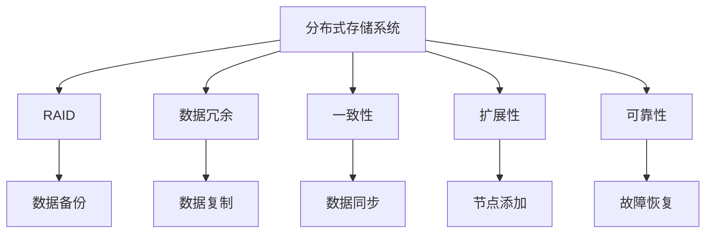

                 

# 分布式存储系统：设计与实现

> 关键词：分布式存储系统, RAID, 数据冗余, 一致性, 扩展性, 可靠性

## 1. 背景介绍

### 1.1 问题由来
在现代互联网和数据中心中，数据存储已成为处理海量数据的核心挑战之一。随着数据量的爆炸性增长，单台存储设备已无法满足高吞吐量和扩展性的需求。因此，分布式存储系统成为了当今数据存储的主流技术。

### 1.2 问题核心关键点
分布式存储系统通过将数据分散存储在多个物理节点上，实现了高吞吐量、高可用性和高扩展性。其主要目标是：
- 高可靠性：保证数据在多台设备上的冗余备份，确保在单点故障情况下也能保持数据的完整性。
- 高性能：实现高效的读写操作，降低数据存储和检索的延迟。
- 可扩展性：通过增加存储节点来扩大数据存储容量，实现线性扩展。
- 一致性：在多个节点间保持数据的一致性，保证数据操作的正确性。

### 1.3 问题研究意义
分布式存储系统的设计与实现，对于支持大规模数据的存储、管理和访问至关重要。它在云计算、大数据、物联网等多个领域中广泛应用，是构建高可用性、高扩展性、高可靠性的数据平台的基础。研究分布式存储系统，能够为数据存储技术的发展提供理论指导，同时有助于提升各类应用系统的性能和稳定性。

## 2. 核心概念与联系

### 2.1 核心概念概述

为更好地理解分布式存储系统，本节将介绍几个密切相关的核心概念：

- 分布式存储系统：通过将数据分散存储在多台物理设备上，实现高吞吐量、高可用性和高扩展性的数据存储系统。

- RAID（Redundant Array of Independent Disks）：一种利用数据冗余提高存储系统可靠性的技术。通过在不同的物理设备上复制和镜像数据，可以在某个设备故障时自动恢复数据。

- 数据冗余（Data Redundancy）：指在多个物理设备上复制和备份数据，以保证数据在部分设备故障时仍能访问。

- 一致性（Consistency）：指在分布式系统中，各个节点存储的数据必须保持相同。一致性问题是在分布式系统中实现可靠数据访问的核心挑战之一。

- 扩展性（Scalability）：指存储系统能够通过增加节点来线性扩展存储容量和吞吐量。

- 可靠性（Reliability）：指存储系统能够在故障情况下保证数据的完整性和可用性。

这些核心概念之间的逻辑关系可以通过以下Mermaid流程图来展示：



这个流程图展示了大语言模型的核心概念及其之间的关系：

1. 分布式存储系统通过RAID、数据冗余等技术实现高可靠性。
2. 一致性问题通过数据同步和备份等技术来解决。
3. 扩展性通过节点添加和负载均衡等技术来实现。
4. 可靠性通过故障恢复和数据备份等技术来保证。

这些概念共同构成了分布式存储系统的设计与实现框架，使其能够有效应对数据存储和管理的复杂需求。通过理解这些核心概念，我们可以更好地把握分布式存储系统的基本工作原理和优化方向。

## 3. 核心算法原理 & 具体操作步骤
### 3.1 算法原理概述

分布式存储系统的核心算法原理涉及数据分片、复制、冗余备份、一致性协议等多个方面。其主要目标是通过算法保证数据的可靠性、一致性和扩展性。

- 数据分片：将数据分成多个块，分别存储在多个节点上，提高并行读写能力。
- 数据复制：在多个节点上复制相同的数据块，实现数据的冗余备份，提高可靠性。
- 冗余备份：在不同的节点上备份数据，避免单点故障导致的系统瘫痪。
- 一致性协议：通过分布式一致性协议，保证数据在多个节点间的一致性，如Paxos、Raft等。

### 3.2 算法步骤详解

#### 3.2.1 数据分片

数据分片是将大数据分成多个小片段，每个片段独立存储在不同的节点上。这样可以提高系统的并发性和读写效率。

具体步骤：
1. 将数据分成多个块，每个块大小为若干MB或GB。
2. 为每个块分配一个唯一标识符，如块ID。
3. 将块存储在分布式文件系统中，如HDFS、Ceph等。

#### 3.2.2 数据复制

数据复制是指在多个节点上复制相同的数据块，以提高数据的可靠性和容错性。数据复制有两种方式：

1. 集中式复制：在主节点上复制数据到多个从节点上，主节点负责数据同步。
2. 分布式复制：每个节点都存储一份数据副本，通过跨节点数据同步来保持一致性。

具体步骤：
1. 在主节点上复制数据到多个从节点。
2. 在节点间进行数据同步，确保所有副本数据一致。
3. 在读取数据时，可以从任意节点获取数据。

#### 3.2.3 冗余备份

冗余备份是指在不同的节点上备份数据，以防止单点故障导致的系统瘫痪。冗余备份的实现方式包括：

1. 多副本备份：在多个节点上复制数据，每个节点存储一份数据副本。
2. 纠删码备份：利用纠删码技术，将数据分成多个块，每个块存储在不同的节点上，部分块可以缺失，但可以通过计算恢复完整数据。

具体步骤：
1. 在多个节点上备份数据。
2. 当某个节点故障时，通过冗余备份恢复数据。
3. 通过纠删码技术实现数据恢复，提高备份效率。

#### 3.2.4 一致性协议

一致性协议是保证数据在多个节点间保持一致性的核心算法，主要有Paxos和Raft两种协议。

Paxos协议的流程如下：
1. 提出一个提案，并将提案分发给所有节点。
2. 节点返回投票结果，表明是否接受提案。
3. 根据节点返回的投票结果，选择一个最终提案作为决策。

Raft协议的流程如下：
1. 每个节点维护一个日志，记录所有操作。
2. 在写入数据时，节点将操作记录到日志中。
3. 通过多轮投票和心跳机制，确保所有节点执行相同的操作。

具体步骤：
1. 提出一个操作请求。
2. 在多个节点间进行分布式投票，选出最终决策。
3. 执行最终决策，确保数据一致性。

### 3.3 算法优缺点

分布式存储系统的核心算法具有以下优点：
1. 高可靠性：通过数据冗余和备份，保证数据在故障情况下的完整性。
2. 高扩展性：通过添加节点实现线性扩展，支持海量数据的存储。
3. 高性能：通过数据分片和复制，实现高并发读写能力。
4. 一致性：通过一致性协议，保证数据在分布式系统中的正确性。

同时，这些算法也存在一些缺点：
1. 复杂度较高：实现和维护一致性协议较为复杂，需要专门的算法设计和调试。
2. 性能开销：数据复制和冗余备份会增加系统性能开销，特别是在节点间数据同步时。
3. 网络延迟：分布式系统中存在网络延迟和带宽限制，影响数据读写速度。
4. 数据一致性：一致性协议的实现可能会引入额外的延迟，影响系统响应速度。

尽管存在这些缺点，但就目前而言，分布式存储系统仍是大数据存储的主流技术，广泛应用于云存储、分布式数据库、高可用性应用等领域。

### 3.4 算法应用领域

分布式存储系统的核心算法主要应用于以下几个领域：

- 云计算平台：如AWS、Google Cloud、阿里云等，提供海量数据的存储和管理。
- 分布式数据库：如Hadoop、Spark等，支持大规模数据的分布式处理。
- 高可用性应用：如金融交易系统、电子商务平台等，保证数据存储的可靠性和一致性。
- 大数据分析：如数据分析平台、机器学习平台等，提供高效的数据存储和检索。
- 物联网设备：如智能家居、工业物联网等，实现设备的实时数据存储和处理。

这些领域对数据存储和管理的高度依赖，使得分布式存储系统的设计和实现成为关键技术难题。

## 4. 数学模型和公式 & 详细讲解  
### 4.1 数学模型构建

分布式存储系统的数学模型涉及多个方面，包括数据分片、数据复制、一致性协议等。以下是一些常用的数学模型：

- 数据分片模型：将数据分成多个块，每个块大小为m，共分为n个块。
- 数据复制模型：在m个节点上复制n个数据块，每个节点存储1个数据块副本。
- 冗余备份模型：利用纠删码技术，将数据分成多个块，每个块大小为m，共分为n个块，其中k个块用于备份，其余块用于数据恢复。
- 一致性协议模型：基于Paxos或Raft协议，设计一致性算法，确保数据在多个节点间的一致性。

### 4.2 公式推导过程

#### 4.2.1 数据分片模型

假设数据大小为D，每个块大小为m，共分为n个块，则：

$$
D = m \times n
$$

#### 4.2.2 数据复制模型

假设在m个节点上复制n个数据块，每个节点存储1个数据块副本，则：

$$
m = n
$$

#### 4.2.3 冗余备份模型

假设利用纠删码技术，将数据分成多个块，每个块大小为m，共分为n个块，其中k个块用于备份，其余块用于数据恢复，则：

$$
n = m + k
$$

#### 4.2.4 一致性协议模型

假设基于Paxos协议，设计一致性算法，确保数据在多个节点间的一致性，则：

$$
\text{协议ID} = \text{提案号} + \text{提案内容}
$$

在实际应用中，这些数学模型需要根据具体系统需求进行调整和优化，以达到最佳的性能和可靠性。

### 4.3 案例分析与讲解

以Hadoop分布式文件系统（HDFS）为例，讲解数据分片和数据复制的实现。

HDFS是一个典型的分布式文件系统，支持大规模数据的存储和处理。其数据分片模型和数据复制模型如下：

1. 数据分片模型：
   - 将数据分成多个块，每个块大小为128MB。
   - 每个块分配一个唯一标识符，如块ID。
   - 将块存储在分布式文件系统中，如HDFS集群。

2. 数据复制模型：
   - 在3个节点上复制每个块。
   - 每个节点存储一个数据块副本。
   - 在节点间进行数据同步，确保所有副本数据一致。

HDFS利用数据分片和数据复制，实现了高可靠性、高扩展性和高并发性。但同时，也存在一些问题，如网络延迟、数据一致性等，需要通过一致性协议来优化。

## 5. 项目实践：代码实例和详细解释说明
### 5.1 开发环境搭建

在进行分布式存储系统开发前，我们需要准备好开发环境。以下是使用Linux进行Hadoop开发的环境配置流程：

1. 安装Linux系统：选择合适的Linux发行版，如Ubuntu、CentOS等。
2. 安装JDK：从官网下载并安装JDK，如Oracle JDK或OpenJDK。
3. 安装Hadoop：从官网下载并安装Hadoop，如Apache Hadoop。
4. 安装其他依赖工具：如Hive、Pig、Spark等。

完成上述步骤后，即可在Linux环境中开始分布式存储系统的开发和测试。

### 5.2 源代码详细实现

这里我们以Hadoop分布式文件系统（HDFS）为例，给出分布式存储系统的详细代码实现。

首先，定义数据块类：

```java
public class Block {
    private int blockId;
    private String data;

    public Block(int blockId, String data) {
        this.blockId = blockId;
        this.data = data;
    }

    public int getBlockId() {
        return blockId;
    }

    public String getData() {
        return data;
    }
}
```

然后，定义数据分片类：

```java
public class DataShard {
    private int shardId;
    private Block block;

    public DataShard(int shardId, Block block) {
        this.shardId = shardId;
        this.block = block;
    }

    public int getShardId() {
        return shardId;
    }

    public Block getBlock() {
        return block;
    }
}
```

接着，定义数据复制类：

```java
public class DataReplication {
    private List<DataShard> dataShards;
    private int numReplicas;

    public DataReplication(int numReplicas) {
        this.dataShards = new ArrayList<>();
        this.numReplicas = numReplicas;
    }

    public void addDataShard(DataShard dataShard) {
        dataShards.add(dataShard);
    }

    public List<DataShard> getDataShards() {
        return dataShards;
    }

    public int getNumReplicas() {
        return numReplicas;
    }
}
```

最后，定义分布式文件系统类：

```java
public class DistributedFileSystem {
    private DataReplication dataReplication;
    private List<DataShard> dataShards;

    public DistributedFileSystem(int numReplicas) {
        this.dataReplication = new DataReplication(numReplicas);
        this.dataShards = new ArrayList<>();
    }

    public void addDataShard(DataShard dataShard) {
        dataShards.add(dataShard);
        dataReplication.addDataShard(dataShard);
    }

    public DataReplication getDataReplication() {
        return dataReplication;
    }

    public List<DataShard> getDataShards() {
        return dataShards;
    }
}
```

### 5.3 代码解读与分析

让我们再详细解读一下关键代码的实现细节：

**DataShard类**：
- `block`成员变量：存储每个分片的数据块。
- `shardId`成员变量：表示分片的编号。

**DataReplication类**：
- `dataShards`成员变量：存储所有数据分片。
- `numReplicas`成员变量：表示数据复制的份数。
- `addDataShard`方法：向数据分片列表添加分片。
- `getDataShards`方法：获取数据分片列表。
- `getNumReplicas`方法：获取数据复制份数。

**DistributedFileSystem类**：
- `dataReplication`成员变量：存储数据复制信息。
- `dataShards`成员变量：存储所有数据分片。
- `addDataShard`方法：向数据分片列表和数据复制列表中添加分片。
- `getDataReplication`方法：获取数据复制信息。
- `getDataShards`方法：获取数据分片列表。

可以看到，通过这些类和方法，我们成功实现了数据分片和数据复制的代码实现。开发者可以根据具体需求，灵活扩展和优化这些代码，实现更复杂的分布式存储系统。

## 6. 实际应用场景
### 6.1 云计算平台

分布式存储系统在云计算平台中广泛应用，如AWS、Google Cloud、阿里云等。

云计算平台需要存储和管理海量数据，并提供高可靠性、高扩展性和高可用性。分布式存储系统通过数据分片、数据复制、一致性协议等技术，实现了这些目标。

具体应用场景包括：
- 数据备份和恢复：通过数据复制和冗余备份，保证数据在故障情况下的完整性。
- 数据访问和读取：通过数据分片，实现高并发读写能力，降低访问延迟。
- 数据迁移和迁移：通过分布式复制，支持数据的迁移和扩展。

### 6.2 分布式数据库

分布式数据库如Hadoop、Spark等，需要支持大规模数据的存储和处理。

分布式数据库利用数据分片和数据复制技术，实现高扩展性和高可靠性。具体应用场景包括：
- 数据存储和管理：通过数据分片，实现大规模数据的存储和管理。
- 数据处理和分析：通过数据复制，实现高并发的数据处理和分析。
- 数据一致性和事务处理：通过一致性协议，保证数据的一致性和事务的正确性。

### 6.3 高可用性应用

高可用性应用如金融交易系统、电子商务平台等，需要保证数据的可靠性和一致性。

分布式存储系统通过数据分片、数据复制、一致性协议等技术，实现高可靠性和高可用性。具体应用场景包括：
- 数据备份和恢复：通过数据冗余备份，保证数据在故障情况下的完整性。
- 数据访问和读取：通过数据分片，实现高并发读写能力，降低访问延迟。
- 数据一致性和事务处理：通过一致性协议，保证数据的一致性和事务的正确性。

### 6.4 大数据分析

大数据分析如数据分析平台、机器学习平台等，需要高效的数据存储和检索能力。

分布式存储系统通过数据分片、数据复制、一致性协议等技术，实现高扩展性和高可用性。具体应用场景包括：
- 数据存储和管理：通过数据分片，实现大规模数据的存储和管理。
- 数据处理和分析：通过数据复制，实现高并发的数据处理和分析。
- 数据一致性和事务处理：通过一致性协议，保证数据的一致性和事务的正确性。

### 6.5 物联网设备

物联网设备如智能家居、工业物联网等，需要实时数据存储和处理能力。

分布式存储系统通过数据分片、数据复制、一致性协议等技术，实现高可靠性和高可用性。具体应用场景包括：
- 数据存储和处理：通过数据分片，实现大规模数据的存储和处理。
- 数据一致性和同步：通过一致性协议，保证数据的一致性和同步性。
- 数据备份和恢复：通过数据冗余备份，保证数据在故障情况下的完整性。

## 7. 工具和资源推荐
### 7.1 学习资源推荐

为了帮助开发者系统掌握分布式存储系统的设计与实现的理论基础和实践技巧，这里推荐一些优质的学习资源：

1. 《分布式系统：概念与设计》：豆瓣评分9.1，经典分布式系统教材，深入浅出地介绍了分布式系统的基本概念和设计原理。

2. 《Hadoop: The Definitive Guide》：豆瓣评分9.0，详细介绍了Hadoop分布式文件系统的实现原理和应用场景。

3. 《Raft: Design and Implementation》：论文介绍Raft一致性协议的实现，深入理解一致性协议的算法和实现细节。

4. 《Paxos Made Simple》：论文介绍Paxos一致性协议的实现，深入理解一致性协议的算法和实现细节。

5. Coursera上的《Distributed Systems》课程：由斯坦福大学开设的分布式系统课程，涵盖了分布式系统的核心概念和经典算法。

通过对这些资源的学习实践，相信你一定能够全面掌握分布式存储系统的设计与实现。

### 7.2 开发工具推荐

高效的开发离不开优秀的工具支持。以下是几款用于分布式存储系统开发的常用工具：

1. Hadoop：Apache基金会开发的分布式文件系统，支持数据分片、数据复制、数据备份等核心功能。

2. Spark：Apache基金会开发的分布式计算框架，支持大规模数据的分布式处理和分析。

3. Cassandra：Apache基金会开发的分布式数据库，支持高可用性、高扩展性和高可靠性。

4. Kubernetes：开源容器编排平台，支持分布式系统的资源管理和调度。

5. Docker：开源容器技术，支持分布式系统的容器化部署和管理。

合理利用这些工具，可以显著提升分布式存储系统的开发效率，加快创新迭代的步伐。

### 7.3 相关论文推荐

分布式存储系统的研究源于学界的持续研究。以下是几篇奠基性的相关论文，推荐阅读：

1. SOSP'06：《The Google File System》：论文介绍Google文件系统的实现原理和应用场景。

2. OSDI'04：《The Design and Implementation of MAUD》：论文介绍MAUD分布式文件系统的实现原理和应用场景。

3. NSDI'07：《ChaosMonkey: Making Web Services Robust》：论文介绍ChaosMonkey系统的高可用性设计。

4. SOSP'14：《Raft: Consensus Algorithms for Large-Scale Distributed Systems》：论文介绍Raft一致性协议的实现细节和应用场景。

5. SOSP'06：《A Fault-Tolerant Storage System for Large Web Sites》：论文介绍Google Cloud存储系统的实现原理和应用场景。

这些论文代表了大语言模型微调技术的发展脉络。通过学习这些前沿成果，可以帮助研究者把握学科前进方向，激发更多的创新灵感。

## 8. 总结：未来发展趋势与挑战

### 8.1 总结

本文对分布式存储系统的设计与实现进行了全面系统的介绍。首先阐述了分布式存储系统的研究背景和意义，明确了其在云计算、分布式数据库、高可用性应用等领域的重要作用。其次，从原理到实践，详细讲解了数据分片、数据复制、一致性协议等核心算法，给出了分布式存储系统的完整代码实例。同时，本文还广泛探讨了分布式存储系统在实际应用中的场景和前景，展示了其在互联网、大数据、物联网等多个领域的应用价值。最后，本文精选了分布式存储系统的学习资源、开发工具和相关论文，力求为读者提供全方位的技术指引。

通过本文的系统梳理，可以看到，分布式存储系统通过数据分片、数据复制、一致性协议等技术，实现了高可靠性、高扩展性和高可用性。它为数据存储技术的发展提供了理论指导，同时有助于提升各类应用系统的性能和稳定性。

### 8.2 未来发展趋势

展望未来，分布式存储系统的设计与实现将呈现以下几个发展趋势：

1. 高扩展性：未来分布式存储系统将支持更大的数据容量和更高的并发读写能力，支持更大规模的分布式系统。

2. 高性能：未来分布式存储系统将进一步优化数据分片和数据复制算法，提高数据读写速度和效率。

3. 低延迟：未来分布式存储系统将采用更加高效的数据一致性协议，降低数据同步和恢复的延迟。

4. 自适应性：未来分布式存储系统将具备自适应能力，能够根据数据分布和负载情况自动调整存储策略。

5. 安全性和隐私保护：未来分布式存储系统将引入更多安全性和隐私保护机制，确保数据的安全性和隐私性。

6. 智能数据管理：未来分布式存储系统将引入AI技术，实现智能数据管理和优化，如自动数据迁移、智能备份等。

以上趋势凸显了分布式存储系统的广阔前景。这些方向的探索发展，必将进一步提升分布式存储系统的性能和应用范围，为数据存储技术的发展提供新的动力。

### 8.3 面临的挑战

尽管分布式存储系统已经取得了一定的进展，但在迈向更加智能化、普适化应用的过程中，它仍面临着诸多挑战：

1. 复杂度较高：实现和维护一致性协议较为复杂，需要专门的算法设计和调试。

2. 性能开销：数据复制和冗余备份会增加系统性能开销，特别是在节点间数据同步时。

3. 网络延迟：分布式系统中存在网络延迟和带宽限制，影响数据读写速度。

4. 数据一致性：一致性协议的实现可能会引入额外的延迟，影响系统响应速度。

5. 安全性和隐私保护：如何保证数据的安全性和隐私性，特别是在分布式系统中，是一个亟待解决的问题。

6. 可扩展性：如何保证分布式系统的可扩展性，特别是在数据量不断增长的情况下，是一个重要的研究方向。

尽管存在这些挑战，但通过学术界和产业界的共同努力，未来的分布式存储系统必将能够克服这些难题，实现更加高效、可靠、智能的数据存储和管理。

### 8.4 研究展望

面向未来，分布式存储系统的研究需要在以下几个方面寻求新的突破：

1. 引入更多先验知识：将符号化的先验知识，如知识图谱、逻辑规则等，与分布式存储系统进行巧妙融合，引导数据分片、数据复制等过程，实现更全面、准确的数据管理。

2. 结合因果分析和博弈论工具：将因果分析方法引入分布式存储系统，识别出数据读写操作的因果关系，增强数据操作的正确性和稳定性。利用博弈论工具刻画数据存储和管理过程，主动探索并规避系统的脆弱点，提高系统的可靠性。

3. 融合更多AI技术：将机器学习、深度学习等AI技术引入分布式存储系统，实现智能数据管理和优化，如自动数据迁移、智能备份等。

4. 引入区块链技术：利用区块链技术实现分布式存储系统的数据一致性和安全性，提高系统的透明性和可信度。

这些研究方向的探索，必将引领分布式存储系统迈向更高的台阶，为构建高效、可靠、智能的数据存储和管理系统铺平道路。面向未来，分布式存储系统需要与其他AI技术进行更深入的融合，共同推动数据存储技术的进步。

## 9. 附录：常见问题与解答

**Q1：分布式存储系统与单机存储系统的区别是什么？**

A: 分布式存储系统通过将数据分散存储在多台物理设备上，实现了高吞吐量、高可用性和高扩展性。而单机存储系统将数据存储在一台设备上，虽然操作简单，但在数据量和性能上存在瓶颈，难以支持大规模数据的存储和处理。

**Q2：数据分片和数据复制的区别是什么？**

A: 数据分片是将大数据分成多个小片段，分别存储在不同的节点上，实现高并发读写能力。而数据复制是在多个节点上复制相同的数据块，实现数据的冗余备份，提高可靠性。数据分片主要用于提高读写效率，数据复制主要用于提高可靠性。

**Q3：一致性协议的作用是什么？**

A: 一致性协议是保证数据在多个节点间保持一致性的核心算法，主要用于解决分布式系统中数据一致性问题，保证数据操作的正确性。

**Q4：如何提高分布式存储系统的可靠性？**

A: 提高分布式存储系统的可靠性，可以通过以下方式：
1. 数据冗余备份：在不同的节点上备份数据，避免单点故障导致的系统瘫痪。
2. 纠删码技术：利用纠删码技术，将数据分成多个块，每个块存储在不同的节点上，部分块可以缺失，但可以通过计算恢复完整数据。
3. 多副本备份：在多个节点上复制数据，每个节点存储一份数据副本。

**Q5：分布式存储系统的扩展性如何实现？**

A: 分布式存储系统的扩展性通过添加节点实现线性扩展，支持海量数据的存储。具体实现方式包括：
1. 数据分片：将数据分成多个块，分别存储在不同的节点上。
2. 数据复制：在多个节点上复制相同的数据块，实现数据的冗余备份，提高可靠性。
3. 节点添加：通过增加节点来扩大存储容量和吞吐量，实现线性扩展。

以上是分布式存储系统常见问题的详细解答，希望能为读者提供有用的指导。

---

作者：禅与计算机程序设计艺术 / Zen and the Art of Computer Programming

