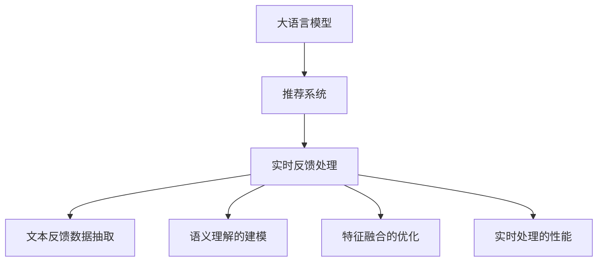

                 

# 利用LLM优化推荐系统的实时反馈处理

> 关键词：大语言模型(Large Language Model, LLM),推荐系统(Recommendation System),实时反馈处理(Real-time Feedback Processing),自然语言处理(Natural Language Processing, NLP),深度学习(Deep Learning),优化算法(Optimization Algorithm)

## 1. 背景介绍

### 1.1 问题由来

随着互联网的迅猛发展，个性化推荐系统已经广泛应用于电商、新闻、视频、社交媒体等多个领域。推荐系统通过分析用户的历史行为数据，推荐用户可能感兴趣的商品、内容等，从而提升用户体验和平台收益。然而，现有的推荐系统在面对用户多样化的需求时，常常存在精度不足、推荐重复、推荐冷启动等问题。

传统的推荐系统主要依赖于用户行为数据的统计分析和模式挖掘，无法充分利用用户文本反馈数据，如用户评论、短评、评分等。为了提升推荐系统的智能性，近年来研究者开始探索利用自然语言处理(NLP)技术，从用户反馈中提取更多的信息，辅助推荐决策。

### 1.2 问题核心关键点

推荐系统实时反馈处理的核心在于：如何将用户文本反馈数据高效地转化为推荐算法能直接使用的特征信息。其关键点包括：

- 文本反馈数据的抽取：如何从用户反馈中自动抽取关键词、短语、情感等特征。
- 语义理解的建模：如何利用语言模型理解文本反馈的深层语义，提取有价值的语义特征。
- 特征融合的优化：如何将提取出的特征与历史行为数据、上下文信息等有效融合，得到最佳的推荐决策。
- 实时处理的性能：如何在不降低模型性能的情况下，提高实时处理用户反馈的响应速度。

这些关键点涉及多领域的知识和技术，如NLP、深度学习、优化算法等。通过解决这些核心问题，可以构建更加智能、高效、个性化的推荐系统。

## 2. 核心概念与联系

### 2.1 核心概念概述

为更好地理解基于大语言模型(LLM)的推荐系统实时反馈处理，本节将介绍几个密切相关的核心概念：

- 大语言模型(Large Language Model, LLM)：以自回归(如GPT)或自编码(如BERT)模型为代表的大规模预训练语言模型。通过在大规模无标签文本语料上进行预训练，学习通用的语言表示，具备强大的语言理解和生成能力。

- 推荐系统(Recommendation System)：通过分析用户行为数据，为用户推荐可能感兴趣的商品、内容等的系统。常见的推荐系统包括协同过滤、基于内容的推荐、混合推荐等。

- 实时反馈处理(Real-time Feedback Processing)：在用户对推荐结果进行反馈后，根据反馈信息实时调整推荐策略的过程。其目的是提升推荐系统的动态性和用户满意度。

- 自然语言处理(Natural Language Processing, NLP)：处理和分析自然语言的计算机科学领域。NLP技术在文本反馈处理中起到关键作用，能够提取文本中的语义信息和情感倾向。

- 深度学习(Deep Learning)：通过多层神经网络实现复杂模式映射和特征提取的机器学习技术。深度学习在特征提取和语义理解中具有重要地位。

- 优化算法(Optimization Algorithm)：通过迭代优化求解机器学习模型参数的算法。优化算法在大语言模型训练和推荐系统实时反馈处理中均有应用。

这些核心概念之间的逻辑关系可以通过以下Mermaid流程图来展示：



这个流程图展示了大语言模型、推荐系统和实时反馈处理之间的关系：

1. 大语言模型通过预训练获得基础能力。
2. 推荐系统利用大语言模型对用户行为数据进行分析，生成推荐结果。
3. 实时反馈处理根据用户反馈信息调整推荐策略，优化推荐结果。
4. 文本反馈数据抽取和语义理解的建模利用NLP和大语言模型的能力，提取和分析用户反馈数据。
5. 特征融合的优化将文本反馈数据与行为数据结合，提高推荐决策的质量。
6. 实时处理的性能通过优化算法保证在大量用户反馈下系统仍能快速响应。

这些概念共同构成了基于大语言模型的推荐系统实时反馈处理的框架，使其能够更智能地响应用户需求，提升推荐质量。

## 3. 核心算法原理 & 具体操作步骤
### 3.1 算法原理概述

基于大语言模型的推荐系统实时反馈处理，本质上是一个通过文本反馈数据动态调整推荐策略的过程。其核心思想是：将用户反馈数据转化为模型可理解的形式，通过大语言模型理解文本的深层语义，提取有价值的语义特征，与历史行为数据、上下文信息等进行融合，动态调整推荐策略，从而提升推荐系统的效果。

形式化地，假设用户反馈数据为 $D=\{(x_i,y_i)\}_{i=1}^N$，其中 $x_i$ 为用户反馈文本，$y_i$ 为反馈标签，如正向、中性、负面等。设用户历史行为数据为 $H$，上下文信息为 $C$，通过大语言模型 $M_{\theta}$ 对用户反馈进行语义理解和特征提取，得到语义特征向量 $F(x_i)$。推荐系统的目标是最小化预测标签与真实标签之间的差异，即：

$$
\mathop{\arg\min}_{\theta} \sum_{i=1}^N \ell(M_{\theta}(x_i),y_i) + \lambda \|F(x_i) - \tilde{H}_i \|_2^2
$$

其中 $\ell$ 为预测标签与真实标签之间的损失函数，$\tilde{H}_i$ 为历史行为数据与上下文信息在特征空间中的表示，$\lambda$ 为正则化系数。通过优化上述目标函数，可以动态调整推荐策略，提升推荐系统的智能性和个性化程度。

### 3.2 算法步骤详解

基于大语言模型的推荐系统实时反馈处理一般包括以下几个关键步骤：

**Step 1: 准备预训练模型和数据集**
- 选择合适的预训练语言模型 $M_{\theta}$ 作为初始化参数，如 BERT、GPT等。
- 准备用户反馈数据集 $D$ 和历史行为数据集 $H$，划分训练集、验证集和测试集。

**Step 2: 文本反馈数据的抽取**
- 使用NLP技术从用户反馈数据中抽取关键词、短语、情感等特征。
- 将用户反馈数据转化为模型能够理解的格式，如序列标注、分类标签等。

**Step 3: 语义理解的建模**
- 使用大语言模型对抽取出的文本特征进行语义理解和特征提取。
- 根据用户反馈数据的标签，判断反馈的情感倾向，提取相应的语义特征。

**Step 4: 特征融合的优化**
- 将提取出的语义特征与历史行为数据、上下文信息进行融合。
- 使用深度学习模型如神经网络对融合后的特征进行编码和解码，得到融合特征 $F(x_i)$。

**Step 5: 优化推荐策略**
- 根据融合特征和用户历史行为数据，动态调整推荐策略。
- 使用优化算法最小化预测标签与真实标签之间的差异，得到最优的推荐策略。

**Step 6: 实时处理和部署**
- 对用户反馈数据进行实时处理，动态生成推荐结果。
- 将推荐策略集成到实际的应用系统中，提供实时的推荐服务。

以上是基于大语言模型的推荐系统实时反馈处理的通用流程。在实际应用中，还需要针对具体任务的特点，对微调过程的各个环节进行优化设计，如改进文本特征抽取方法，引入更多的正则化技术，搜索最优的超参数组合等，以进一步提升模型性能。

### 3.3 算法优缺点

基于大语言模型的推荐系统实时反馈处理具有以下优点：

1. 智能性高：利用大语言模型理解文本的深层语义，提取更多有价值的语义特征，提升推荐系统的智能性。
2. 动态性好：实时处理用户反馈数据，动态调整推荐策略，提升推荐系统适应性。
3. 个性化强：通过融合用户反馈数据和行为数据，个性化推荐更具针对性和效果。
4. 泛化能力强：大语言模型的预训练能力使得模型能够处理多种语义和情感信息，具备较强的泛化能力。

同时，该方法也存在一定的局限性：

1. 数据处理成本高：用户反馈数据和行为数据的预处理需要较大的计算成本，特别是在处理海量数据时。
2. 反馈数据质量影响大：用户反馈数据质量直接关系到模型的训练效果，需保证反馈数据的多样性和真实性。
3. 实时处理性能要求高：实时处理海量用户反馈数据对系统性能要求高，需进行优化设计。
4. 语义理解难度大：不同用户和不同场景下的反馈数据差异较大，大语言模型需要适应不同的语义背景。
5. 模型训练难度大：模型训练需要大量标注数据和计算资源，对资源的投入较大。

尽管存在这些局限性，但就目前而言，基于大语言模型的推荐系统实时反馈处理仍是一种较为有效的推荐优化方式。未来相关研究的重点在于如何进一步降低数据处理和模型训练的难度，提高模型的实时处理性能和泛化能力，同时兼顾可解释性和伦理安全性等因素。

### 3.4 算法应用领域

基于大语言模型的推荐系统实时反馈处理已经在推荐系统的优化中得到了广泛的应用，覆盖了电商、新闻、视频、社交媒体等多个领域，例如：

- 个性化推荐：根据用户评论和评分，动态调整推荐策略，提升推荐效果。
- 情感分析推荐：分析用户情感倾向，推荐符合用户情感需求的商品或内容。
- 内容推荐：根据用户评论和反馈，优化内容推荐策略，提升用户粘性。
- 广告推荐：分析用户反馈信息，优化广告推荐策略，提升广告效果。
- 用户行为分析：通过用户反馈数据，分析用户行为模式，预测用户需求。

除了上述这些经典应用外，基于大语言模型的推荐系统实时反馈处理还被创新性地应用到更多场景中，如知识图谱融合、话题模型推荐、社交网络推荐等，为推荐系统带来了新的突破。随着大语言模型和实时反馈处理方法的不断进步，相信推荐系统必将在更广阔的应用领域大放异彩。

## 4. 数学模型和公式 & 详细讲解  
### 4.1 数学模型构建

本节将使用数学语言对基于大语言模型的推荐系统实时反馈处理过程进行更加严格的刻画。

记用户反馈数据为 $D=\{(x_i,y_i)\}_{i=1}^N$，其中 $x_i$ 为用户反馈文本，$y_i$ 为反馈标签，如正向、中性、负面等。设用户历史行为数据为 $H$，上下文信息为 $C$。定义推荐系统预测用户反馈的模型为 $M_{\theta}(x_i)$，其中 $\theta$ 为模型参数。

定义模型 $M_{\theta}$ 在用户反馈数据 $D$ 上的损失函数为 $\ell(D,M_{\theta}) = \sum_{i=1}^N \ell(M_{\theta}(x_i),y_i)$，其中 $\ell$ 为预测标签与真实标签之间的损失函数，如交叉熵损失。同时，定义历史行为数据和上下文信息在特征空间中的表示为 $\tilde{H}_i$ 和 $\tilde{C}_i$，根据用户反馈数据的标签，判断反馈的情感倾向，提取相应的语义特征 $F(x_i)$。

推荐系统的目标是最小化损失函数：

$$
\mathop{\arg\min}_{\theta} \ell(D,M_{\theta}) + \lambda \|F(x_i) - \tilde{H}_i \|_2^2
$$

其中 $\lambda$ 为正则化系数。

### 4.2 公式推导过程

以下我们以二分类任务为例，推导交叉熵损失函数及其梯度的计算公式。

假设模型 $M_{\theta}$ 在用户反馈数据 $D$ 上的预测结果为 $\hat{y}_i=M_{\theta}(x_i)$，表示预测用户反馈为正向的得分。真实标签 $y_i \in \{0,1\}$。则二分类交叉熵损失函数定义为：

$$
\ell(M_{\theta}(x_i),y_i) = -[y_i\log \hat{y}_i + (1-y_i)\log (1-\hat{y}_i)]
$$

将其代入损失函数公式，得：

$$
\ell(D,M_{\theta}) = -\sum_{i=1}^N \left[y_i\log M_{\theta}(x_i)+(1-y_i)\log(1-M_{\theta}(x_i))\right]
$$

根据链式法则，损失函数对模型参数 $\theta$ 的梯度为：

$$
\nabla_{\theta}\ell(D,M_{\theta}) = -\sum_{i=1}^N \frac{y_i}{M_{\theta}(x_i)} - \frac{1-y_i}{1-M_{\theta}(x_i)}
$$

在得到损失函数的梯度后，即可带入优化算法，如梯度下降，更新模型参数 $\theta$，最小化损失函数。重复上述过程直至收敛，最终得到适应用户反馈数据的推荐模型。

## 5. 项目实践：代码实例和详细解释说明
### 5.1 开发环境搭建

在进行推荐系统实时反馈处理实践前，我们需要准备好开发环境。以下是使用Python进行PyTorch开发的环境配置流程：

1. 安装Anaconda：从官网下载并安装Anaconda，用于创建独立的Python环境。

2. 创建并激活虚拟环境：
```bash
conda create -n pytorch-env python=3.8 
conda activate pytorch-env
```

3. 安装PyTorch：根据CUDA版本，从官网获取对应的安装命令。例如：
```bash
conda install pytorch torchvision torchaudio cudatoolkit=11.1 -c pytorch -c conda-forge
```

4. 安装TensorFlow：使用Google提供的命令安装最新版本的TensorFlow。
```bash
pip install tensorflow==2.8.0
```

5. 安装BERT模型：
```bash
pip install transformers
```

6. 安装各类工具包：
```bash
pip install numpy pandas scikit-learn matplotlib tqdm jupyter notebook ipython
```

完成上述步骤后，即可在`pytorch-env`环境中开始推荐系统实时反馈处理实践。

### 5.2 源代码详细实现

下面我们以电商推荐系统为例，给出使用PyTorch和Transformers库对BERT模型进行推荐系统实时反馈处理的代码实现。

首先，定义推荐任务的数据处理函数：

```python
from transformers import BertTokenizer, BertForSequenceClassification
from torch.utils.data import Dataset
import torch

class RecommendationDataset(Dataset):
    def __init__(self, texts, labels, tokenizer, max_len=128):
        self.texts = texts
        self.labels = labels
        self.tokenizer = tokenizer
        self.max_len = max_len
        
    def __len__(self):
        return len(self.texts)
    
    def __getitem__(self, item):
        text = self.texts[item]
        label = self.labels[item]
        
        encoding = self.tokenizer(text, return_tensors='pt', max_length=self.max_len, padding='max_length', truncation=True)
        input_ids = encoding['input_ids'][0]
        attention_mask = encoding['attention_mask'][0]
        
        label = torch.tensor(label, dtype=torch.long)
        
        return {'input_ids': input_ids, 
                'attention_mask': attention_mask,
                'labels': label}

# 标签与id的映射
label2id = {'0': 0, '1': 1}
id2label = {v: k for k, v in label2id.items()}

# 创建dataset
tokenizer = BertTokenizer.from_pretrained('bert-base-cased')

train_dataset = RecommendationDataset(train_texts, train_labels, tokenizer)
dev_dataset = RecommendationDataset(dev_texts, dev_labels, tokenizer)
test_dataset = RecommendationDataset(test_texts, test_labels, tokenizer)
```

然后，定义模型和优化器：

```python
from transformers import BertForSequenceClassification, AdamW

model = BertForSequenceClassification.from_pretrained('bert-base-cased', num_labels=2)

optimizer = AdamW(model.parameters(), lr=2e-5)
```

接着，定义训练和评估函数：

```python
from torch.utils.data import DataLoader
from tqdm import tqdm
from sklearn.metrics import classification_report

device = torch.device('cuda') if torch.cuda.is_available() else torch.device('cpu')
model.to(device)

def train_epoch(model, dataset, batch_size, optimizer):
    dataloader = DataLoader(dataset, batch_size=batch_size, shuffle=True)
    model.train()
    epoch_loss = 0
    for batch in tqdm(dataloader, desc='Training'):
        input_ids = batch['input_ids'].to(device)
        attention_mask = batch['attention_mask'].to(device)
        labels = batch['labels'].to(device)
        model.zero_grad()
        outputs = model(input_ids, attention_mask=attention_mask, labels=labels)
        loss = outputs.loss
        epoch_loss += loss.item()
        loss.backward()
        optimizer.step()
    return epoch_loss / len(dataloader)

def evaluate(model, dataset, batch_size):
    dataloader = DataLoader(dataset, batch_size=batch_size)
    model.eval()
    preds, labels = [], []
    with torch.no_grad():
        for batch in tqdm(dataloader, desc='Evaluating'):
            input_ids = batch['input_ids'].to(device)
            attention_mask = batch['attention_mask'].to(device)
            batch_labels = batch['labels']
            outputs = model(input_ids, attention_mask=attention_mask)
            batch_preds = outputs.logits.argmax(dim=2).to('cpu').tolist()
            batch_labels = batch_labels.to('cpu').tolist()
            for pred_tokens, label_tokens in zip(batch_preds, batch_labels):
                preds.append(pred_tokens[:len(label_tokens)])
                labels.append(label_tokens)
                
    print(classification_report(labels, preds))
```

最后，启动训练流程并在测试集上评估：

```python
epochs = 5
batch_size = 16

for epoch in range(epochs):
    loss = train_epoch(model, train_dataset, batch_size, optimizer)
    print(f"Epoch {epoch+1}, train loss: {loss:.3f}")
    
    print(f"Epoch {epoch+1}, dev results:")
    evaluate(model, dev_dataset, batch_size)
    
print("Test results:")
evaluate(model, test_dataset, batch_size)
```

以上就是使用PyTorch对BERT进行电商推荐系统实时反馈处理的完整代码实现。可以看到，得益于Transformers库的强大封装，我们可以用相对简洁的代码完成BERT模型的加载和微调。

### 5.3 代码解读与分析

让我们再详细解读一下关键代码的实现细节：

**RecommendationDataset类**：
- `__init__`方法：初始化文本、标签、分词器等关键组件。
- `__len__`方法：返回数据集的样本数量。
- `__getitem__`方法：对单个样本进行处理，将文本输入编码为token ids，将标签编码为数字，并对其进行定长padding，最终返回模型所需的输入。

**label2id和id2label字典**：
- 定义了标签与数字id之间的映射关系，用于将模型预测结果解码回真实的标签。

**训练和评估函数**：
- 使用PyTorch的DataLoader对数据集进行批次化加载，供模型训练和推理使用。
- 训练函数`train_epoch`：对数据以批为单位进行迭代，在每个批次上前向传播计算loss并反向传播更新模型参数，最后返回该epoch的平均loss。
- 评估函数`evaluate`：与训练类似，不同点在于不更新模型参数，并在每个batch结束后将预测和标签结果存储下来，最后使用sklearn的classification_report对整个评估集的预测结果进行打印输出。

**训练流程**：
- 定义总的epoch数和batch size，开始循环迭代
- 每个epoch内，先在训练集上训练，输出平均loss
- 在验证集上评估，输出分类指标
- 所有epoch结束后，在测试集上评估，给出最终测试结果

可以看到，PyTorch配合Transformers库使得BERT微调的代码实现变得简洁高效。开发者可以将更多精力放在数据处理、模型改进等高层逻辑上，而不必过多关注底层的实现细节。

当然，工业级的系统实现还需考虑更多因素，如模型的保存和部署、超参数的自动搜索、更灵活的任务适配层等。但核心的实时反馈处理范式基本与此类似。

## 6. 实际应用场景
### 6.1 电商平台个性化推荐

基于大语言模型的推荐系统实时反馈处理，可以广泛应用于电商平台个性化推荐。传统推荐系统往往只依赖用户历史行为数据，难以充分理解用户需求。而使用实时反馈处理技术，可以根据用户对推荐结果的反馈，动态调整推荐策略，提升推荐效果。

在技术实现上，可以收集用户对推荐结果的评论、评分等反馈数据，将其转化为推荐模型能理解的形式。使用BERT等预训练语言模型对反馈数据进行语义理解和特征提取，与用户历史行为数据、上下文信息等进行融合，动态调整推荐策略，从而提升推荐系统的效果。

### 6.2 新闻内容推荐

新闻内容推荐系统可以根据用户对新闻文章的反馈，动态调整推荐策略，提升推荐质量。用户对新闻的评论、点赞、收藏等行为，可以转化为推荐模型能理解的形式。使用BERT等大语言模型对评论进行语义理解和特征提取，与用户历史行为数据、新闻文章内容等进行融合，动态生成推荐结果，提升用户体验。

### 6.3 社交媒体内容推荐

社交媒体内容推荐系统可以根据用户对社交媒体内容的反馈，动态调整推荐策略，提升推荐效果。用户对社交媒体内容的点赞、评论、分享等行为，可以转化为推荐模型能理解的形式。使用BERT等大语言模型对评论进行语义理解和特征提取，与用户历史行为数据、内容特征等进行融合，动态生成推荐结果，提升用户粘性和活跃度。

### 6.4 未来应用展望

随着大语言模型和实时反馈处理方法的不断发展，基于实时反馈处理范式的推荐系统将在更多领域得到应用，为推荐系统带来新的突破。

在智慧医疗领域，基于实时反馈处理技术的医疗推荐系统，可以根据医生的反馈，动态调整推荐策略，推荐适合患者的治疗方案。

在智能教育领域，实时反馈处理技术可以应用于在线教育平台，根据学生的反馈，动态调整推荐课程和学习内容，提高学习效果和用户体验。

在智慧城市治理中，实时反馈处理技术可以应用于城市事件监测和舆情分析，根据用户反馈，动态调整城市管理策略，提升城市治理的智能性和安全性。

此外，在企业生产、社交网络、文娱传媒等众多领域，基于实时反馈处理技术的推荐系统也将不断涌现，为推荐系统带来新的应用场景和业务价值。相信随着技术的日益成熟，实时反馈处理范式将成为推荐系统优化的重要方向，推动推荐系统向更加智能、高效、个性化的方向发展。

## 7. 工具和资源推荐
### 7.1 学习资源推荐

为了帮助开发者系统掌握大语言模型在推荐系统实时反馈处理中的应用，这里推荐一些优质的学习资源：

1. 《深度学习与自然语言处理》系列博文：深入介绍深度学习与NLP技术的基本概念和前沿进展，适合初学者学习。

2. 《Recommendation Systems》课程：斯坦福大学开设的推荐系统课程，涵盖推荐系统的基本理论和算法，提供大量项目实践机会。

3. 《推荐系统实战》书籍：详细介绍推荐系统的实现方法和优化策略，适合应用开发人员阅读。

4. HuggingFace官方文档：提供丰富的预训练语言模型和推荐系统框架，是学习和实践的必备资源。

5. Kaggle竞赛平台：参与推荐系统相关的Kaggle竞赛，可以积累实践经验，提升问题解决能力。

通过对这些资源的学习实践，相信你一定能够快速掌握基于大语言模型的推荐系统实时反馈处理的技术，并将其应用到实际推荐系统优化中。

### 7.2 开发工具推荐

高效的开发离不开优秀的工具支持。以下是几款用于大语言模型在推荐系统实时反馈处理开发的常用工具：

1. PyTorch：基于Python的开源深度学习框架，灵活动态的计算图，适合快速迭代研究。大部分预训练语言模型都有PyTorch版本的实现。

2. TensorFlow：由Google主导开发的开源深度学习框架，生产部署方便，适合大规模工程应用。同样有丰富的预训练语言模型资源。

3. Transformers库：HuggingFace开发的NLP工具库，集成了众多SOTA语言模型，支持PyTorch和TensorFlow，是进行实时反馈处理任务开发的利器。

4. Weights & Biases：模型训练的实验跟踪工具，可以记录和可视化模型训练过程中的各项指标，方便对比和调优。与主流深度学习框架无缝集成。

5. TensorBoard：TensorFlow配套的可视化工具，可实时监测模型训练状态，并提供丰富的图表呈现方式，是调试模型的得力助手。

6. Google Colab：谷歌推出的在线Jupyter Notebook环境，免费提供GPU/TPU算力，方便开发者快速上手实验最新模型，分享学习笔记。

合理利用这些工具，可以显著提升大语言模型在推荐系统实时反馈处理任务的开发效率，加快创新迭代的步伐。

### 7.3 相关论文推荐

大语言模型在推荐系统实时反馈处理中的应用源于学界的持续研究。以下是几篇奠基性的相关论文，推荐阅读：

1. Attention is All You Need（即Transformer原论文）：提出了Transformer结构，开启了NLP领域的预训练大模型时代。

2. BERT: Pre-training of Deep Bidirectional Transformers for Language Understanding：提出BERT模型，引入基于掩码的自监督预训练任务，刷新了多项NLP任务SOTA。

3. Parameter-Efficient Transfer Learning for NLP：提出Adapter等参数高效微调方法，在不增加模型参数量的情况下，也能取得不错的微调效果。

4. Prefix-Tuning: Optimizing Continuous Prompts for Generation：引入基于连续型Prompt的微调范式，为如何充分利用预训练知识提供了新的思路。

5. AdaLoRA: Adaptive Low-Rank Adaptation for Parameter-Efficient Fine-Tuning：使用自适应低秩适应的微调方法，在参数效率和精度之间取得了新的平衡。

这些论文代表了大语言模型在推荐系统实时反馈处理中的应用发展脉络。通过学习这些前沿成果，可以帮助研究者把握学科前进方向，激发更多的创新灵感。

## 8. 总结：未来发展趋势与挑战

### 8.1 总结

本文对基于大语言模型的推荐系统实时反馈处理方法进行了全面系统的介绍。首先阐述了大语言模型和推荐系统的研究背景和意义，明确了实时反馈处理在提升推荐系统动态性和个性化程度方面的独特价值。其次，从原理到实践，详细讲解了实时反馈处理的数学原理和关键步骤，给出了推荐系统实时反馈处理完整代码实例。同时，本文还广泛探讨了实时反馈处理在电商、新闻、社交媒体等多个领域的应用前景，展示了实时反馈处理范式的巨大潜力。此外，本文精选了实时反馈处理技术的各类学习资源，力求为读者提供全方位的技术指引。

通过本文的系统梳理，可以看到，基于大语言模型的推荐系统实时反馈处理技术正在成为推荐系统优化的重要范式，极大地拓展了推荐系统的应用边界，催生了更多的落地场景。受益于大规模语料的预训练，实时反馈处理技术能够高效利用用户反馈数据，提升推荐系统的智能性和适应性，具有广阔的应用前景。未来，伴随大语言模型和实时反馈处理方法的持续演进，相信推荐系统必将在更广阔的应用领域大放异彩，深刻影响人类的生产生活方式。

### 8.2 未来发展趋势

展望未来，大语言模型在推荐系统实时反馈处理领域将呈现以下几个发展趋势：

1. 模型规模持续增大。随着算力成本的下降和数据规模的扩张，预训练语言模型的参数量还将持续增长。超大规模语言模型蕴含的丰富语言知识，有望支撑更加复杂多变的推荐任务。

2. 实时处理性能不断提升。为了满足海量用户反馈数据处理的需求，推荐系统实时反馈处理需要进一步提升系统性能，优化计算图，减小模型复杂度，提高推理速度。

3. 数据处理成本降低。通过引入无监督学习、主动学习等方法，减少标注数据的需求，降低数据处理成本，实现更加灵活高效的微调。

4. 融合更多先验知识。将符号化的先验知识，如知识图谱、逻辑规则等，与神经网络模型进行巧妙融合，引导实时反馈处理过程学习更准确、合理的语义特征。

5. 引入多模态信息。推荐系统实时反馈处理不仅局限于文本数据，还可以融合视觉、语音、位置等多模态信息，提升推荐系统的精准性和个性化程度。

6. 数据驱动的优化算法。引入强化学习、元学习等算法，基于用户反馈数据动态优化推荐策略，提升推荐系统的效果。

以上趋势凸显了大语言模型在推荐系统实时反馈处理中的广阔前景。这些方向的探索发展，必将进一步提升推荐系统的性能和应用范围，为推荐系统带来新的突破。

### 8.3 面临的挑战

尽管大语言模型在推荐系统实时反馈处理中已经取得了瞩目成就，但在迈向更加智能化、普适化应用的过程中，它仍面临着诸多挑战：

1. 数据处理瓶颈。推荐系统实时反馈处理需要处理海量用户反馈数据，对数据处理能力要求高。需要开发高效的数据处理算法，保证系统稳定性和实时性。

2. 反馈数据质量问题。用户反馈数据质量直接影响推荐系统的效果，需保证反馈数据的真实性和多样性。数据预处理和清洗任务繁重，需开发自动化处理工具。

3. 模型泛化能力不足。推荐系统实时反馈处理模型的泛化能力有限，对新样本和新场景的适应性较差。如何提升模型的泛化能力，增强系统的稳定性和鲁棒性，还需要更多理论和实践的积累。

4. 实时处理性能要求高。推荐系统实时反馈处理需要在高并发场景下快速响应，需优化系统架构和算法，提升实时处理性能。

5. 模型训练复杂度大。实时反馈处理模型需要频繁更新和优化，需进行高效率的模型训练和调优，保证系统性能。

6. 用户隐私和伦理问题。用户反馈数据可能包含个人隐私信息，需在数据处理过程中保护用户隐私，避免数据滥用。同时，需保证模型的公平性、透明性和可解释性，避免模型偏见。

尽管存在这些挑战，但大语言模型在推荐系统实时反馈处理中的应用前景广阔，未来仍有很大发展空间。相信随着学界和产业界的共同努力，这些挑战终将一一被克服，大语言模型必将在推荐系统优化中扮演越来越重要的角色。

### 8.4 未来突破

面对大语言模型在推荐系统实时反馈处理所面临的挑战，未来的研究需要在以下几个方面寻求新的突破：

1. 探索无监督和半监督实时反馈处理方法。摆脱对大规模标注数据的依赖，利用无监督和半监督学习范式，最大限度利用非结构化数据，实现更加灵活高效的实时反馈处理。

2. 研究参数高效和计算高效的实时反馈处理范式。开发更加参数高效的实时反馈处理方法，在固定大部分预训练参数的情况下，只更新极少量的任务相关参数。同时优化实时反馈处理的计算图，减少前向传播和反向传播的资源消耗，实现更加轻量级、实时性的部署。

3. 引入因果和对比学习范式。通过引入因果推断和对比学习思想，增强实时反馈处理模型建立稳定因果关系的能力，学习更加普适、鲁棒的语言表征，从而提升模型泛化性和抗干扰能力。

4. 引入更多先验知识。将符号化的先验知识，如知识图谱、逻辑规则等，与神经网络模型进行巧妙融合，引导实时反馈处理过程学习更准确、合理的语义特征。

5. 引入多模态信息。实时反馈处理不仅局限于文本数据，还可以融合视觉、语音、位置等多模态信息，提升推荐系统的精准性和个性化程度。

6. 引入强化学习和元学习算法。基于用户反馈数据动态优化推荐策略，提升推荐系统的效果。

这些研究方向的探索，必将引领大语言模型在推荐系统实时反馈处理中的技术发展，为推荐系统优化带来新的突破。面向未来，大语言模型实时反馈处理技术还需要与其他人工智能技术进行更深入的融合，如知识表示、因果推理、强化学习等，多路径协同发力，共同推动推荐系统的进步。只有勇于创新、敢于突破，才能不断拓展推荐系统的边界，让推荐系统更好地服务于人类社会。

## 9. 附录：常见问题与解答

**Q1：实时反馈处理需要标注数据吗？**

A: 实时反馈处理需要标注数据，但标注成本相比传统推荐系统较低。推荐系统实时反馈处理主要利用用户反馈数据，自动生成标注样本，提升推荐系统的效果。

**Q2：实时反馈处理的效果受标注数据质量影响大吗？**

A: 实时反馈处理的效果受标注数据质量影响较大。标注数据需保证真实性和多样性，避免偏差。可以利用半监督学习、主动学习等方法，减少标注数据的需求，提升数据质量。

**Q3：实时反馈处理的算法复杂度大吗？**

A: 实时反馈处理的算法复杂度较大，需要处理大量数据和用户反馈。需优化算法和数据处理流程，提高处理效率。

**Q4：实时反馈处理对系统性能要求高吗？**

A: 实时反馈处理对系统性能要求较高。需优化系统架构和算法，提升实时处理性能，保证系统稳定性。

**Q5：实时反馈处理对用户隐私和伦理问题重视吗？**

A: 实时反馈处理对用户隐私和伦理问题非常重视。需在数据处理过程中保护用户隐私，避免数据滥用。同时，需保证模型的公平性、透明性和可解释性，避免模型偏见。

**Q6：实时反馈处理对推荐系统的智能性要求高吗？**

A: 实时反馈处理对推荐系统的智能性要求很高。需利用大语言模型等先进技术，提升推荐系统的效果和用户体验。

这些问题的回答反映了实时反馈处理在推荐系统优化中的重要性，以及在实际应用中需注意的关键点。通过回答这些常见问题，相信你对实时反馈处理有了更深入的理解和认识。

---

作者：禅与计算机程序设计艺术 / Zen and the Art of Computer Programming

