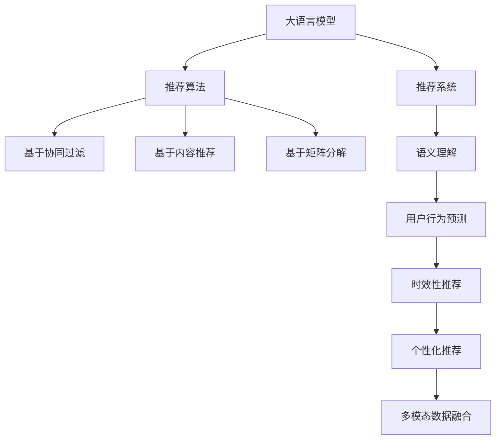

                 

# 利用LLM提升推荐系统的时效性推荐

> 关键词：
大语言模型,推荐系统,推荐算法,时效性,语义理解,个性化推荐,实时推荐,多模态数据融合,用户行为预测

## 1. 背景介绍

### 1.1 问题由来
随着互联网和电子商务的飞速发展，推荐系统在各类业务场景中的应用越来越广泛。推荐系统通过分析用户历史行为数据，为用户推荐感兴趣的内容，极大地提升了用户体验和平台收益。然而，传统的推荐系统往往只依赖用户的历史行为数据，难以理解用户的深层语义需求和实时变化。

近年来，大语言模型（Large Language Models, LLMs）在自然语言处理（NLP）领域取得了巨大的突破，其强大的语义理解和生成能力，为推荐系统带来了新的发展契机。通过在推荐系统中集成大语言模型，可以实现对用户语义需求的更深入理解，提升推荐的时效性和个性化程度，打造更智能的推荐体验。

### 1.2 问题核心关键点
1. **用户语义需求的深入理解**：传统的基于行为的推荐算法难以理解用户的深层语义需求，无法把握用户多变的兴趣和情感变化。
2. **推荐的时效性**：推荐系统需实时响应用户需求，提供最新的内容推荐，才能保持良好的用户体验。
3. **推荐的多样性**：推荐系统不仅要推荐用户已有的偏好内容，还要不断探索和推荐更多样化的内容，丰富用户视野。
4. **推荐的高效性**：推荐系统需具备高效的数据处理和计算能力，以支持实时推荐，避免推荐延迟。

## 2. 核心概念与联系

### 2.1 核心概念概述

在推荐系统中集成大语言模型，本质上是一种将语言理解技术引入推荐过程的方法。其核心思想是利用语言模型的语义理解能力，结合用户的历史行为数据，进行更深入的兴趣分析和内容推荐。

以下是对核心概念的详细阐述：

- **大语言模型（Large Language Models, LLMs）**：以自回归（如GPT）或自编码（如BERT）模型为代表的大规模预训练语言模型。通过在大规模无标签文本语料上进行预训练，学习通用的语言表示，具备强大的语言理解和生成能力。

- **推荐系统（Recommender Systems）**：通过分析用户的历史行为和兴趣，为用户推荐感兴趣的内容或商品的系统。包括基于内容的推荐、协同过滤、矩阵分解等经典方法。

- **推荐算法（Recommendation Algorithms）**：推荐系统中的核心算法，如基于协同过滤的推荐、基于内容的推荐、基于矩阵分解的推荐等。

- **语义理解（Semantic Understanding）**：利用语言模型对用户输入文本的语义进行分析和理解，把握用户的深层需求和情感变化。

- **时效性推荐（Timely Recommendation）**：实时响应用户需求，提供最新的内容推荐，以提升用户体验。

- **个性化推荐（Personalized Recommendation）**：根据用户个性化需求，提供差异化的内容推荐，增强用户黏性。

- **多模态数据融合（Multi-modal Data Fusion）**：将文本、图像、视频等多种模态的数据进行融合，提升推荐系统的表达能力和理解深度。

- **用户行为预测（User Behavior Prediction）**：通过分析用户历史行为数据，预测用户未来的行为和兴趣变化，以更好地进行内容推荐。

- **实时推荐系统（Real-time Recommendation Systems）**：能够实时响应用户请求，快速生成推荐结果的系统。

这些概念之间的逻辑关系可以通过以下Mermaid流程图来展示：



这个流程图展示了大语言模型在推荐系统中的核心概念及其之间的关系：

1. 大语言模型通过预训练获得基础能力。
2. 推荐算法对预训练模型进行适配，实现基于协同过滤、内容推荐、矩阵分解等经典推荐方法。
3. 语义理解模块利用大语言模型对用户输入文本进行语义分析，把握用户深层需求。
4. 用户行为预测模块通过历史数据预测用户未来行为，增强推荐的相关性和时效性。
5. 时效性推荐模块实时响应用户请求，提供最新的内容推荐。
6. 个性化推荐模块根据用户偏好，提供差异化的内容推荐，提升用户满意度。
7. 多模态数据融合模块将不同模态的数据进行融合，提升推荐的表达能力和理解深度。

## 3. 核心算法原理 & 具体操作步骤
### 3.1 算法原理概述

在大语言模型与推荐系统的集成过程中，主要利用大语言模型的语义理解能力，结合用户历史行为数据，进行用户需求分析和内容推荐。具体而言，包括以下几个步骤：

1. **预训练语言模型的语义理解**：通过预训练语言模型对用户输入的文本进行语义分析，提取文本中的关键信息，理解用户的深层需求。
2. **用户行为分析**：利用用户的历史行为数据，如浏览记录、购买记录、评分记录等，分析用户的兴趣偏好。
3. **内容推荐**：基于用户需求和兴趣，结合预训练语言模型的语义理解，为用户推荐最相关的商品或内容。

### 3.2 算法步骤详解

**Step 1: 准备数据集和模型**

- 收集用户的历史行为数据和文本数据，如浏览记录、评分记录、搜索记录等。
- 选择预训练语言模型，如GPT、BERT等，并利用其在用户输入文本上进行微调，以获得更适配的语言模型。

**Step 2: 数据预处理**

- 将文本数据进行分词、标准化等预处理，确保数据的质量。
- 将文本数据和用户行为数据进行拼接，形成综合的特征向量。

**Step 3: 语义理解与行为分析**

- 利用预训练语言模型对用户输入的文本进行语义分析，提取文本中的关键信息。
- 结合用户行为数据，如浏览记录、评分记录等，分析用户的兴趣偏好和情感变化。

**Step 4: 内容推荐**

- 根据用户需求和兴趣，结合预训练语言模型的语义理解，选择最相关的商品或内容进行推荐。
- 利用推荐算法（如协同过滤、基于内容的推荐、矩阵分解等）对推荐结果进行排序，生成最终的推荐列表。

**Step 5: 实时推荐**

- 实时响应用户请求，根据最新的用户输入文本和行为数据，重新计算推荐结果，提供最新的内容推荐。

### 3.3 算法优缺点

大语言模型与推荐系统的集成，具有以下优点：

1. **提升推荐的时效性**：利用大语言模型的语义理解能力，实时响应用户需求，提供最新的内容推荐，提升用户体验。
2. **增强推荐的相关性**：通过语义理解模块，深入理解用户需求和情感变化，增强推荐的相关性和个性化程度。
3. **丰富推荐的多样性**：结合多模态数据融合模块，将文本、图像、视频等多种模态的数据进行融合，提升推荐的多样性和表达能力。
4. **灵活性高**：利用预训练语言模型，可以方便地对新领域和任务进行微调，提升系统的适应性和灵活性。

同时，该方法也存在一些缺点：

1. **计算成本高**：大语言模型具有庞大的参数量，在实时推荐时需要大量的计算资源，可能导致推荐延迟。
2. **数据依赖性强**：推荐效果很大程度上取决于用户的历史行为数据和输入文本的质量，数据不足时可能难以获得理想效果。
3. **可解释性差**：大语言模型通常缺乏可解释性，难以解释推荐过程的内部逻辑，可能影响用户信任和接受度。
4. **模型的公平性**：大语言模型可能继承预训练语料中的偏见和有害信息，影响推荐系统的公平性和安全性。

### 3.4 算法应用领域

基于大语言模型的推荐系统已经在多个领域得到了应用，如电商、新闻、视频、音乐等。以下是几个典型的应用场景：

1. **电商推荐**：根据用户浏览记录、评分记录等行为数据，结合用户输入的搜索关键词或描述，为用户推荐商品或相关商品，提升电商平台的转化率。
2. **新闻推荐**：利用用户的历史浏览记录和文本输入，推荐用户感兴趣的新闻文章，增加用户粘性和平台停留时间。
3. **视频推荐**：结合用户的历史观看记录和视频描述，推荐相关视频，增加用户的观看量和满意度。
4. **音乐推荐**：根据用户的听歌记录和歌词文本，推荐相关歌曲或音乐，提升用户的听歌体验和平台活跃度。

除了上述这些经典应用外，大语言模型与推荐系统的集成还可以用于推荐系统的新领域，如智能家居、旅游推荐、健康推荐等，为各个行业带来新的创新和变革。

## 4. 数学模型和公式 & 详细讲解
### 4.1 数学模型构建

在推荐系统中集成大语言模型，主要依赖于语言模型的语义理解能力和推荐算法的协同工作。假设推荐系统的输入为 $x$，包括用户输入的文本和历史行为数据，输出为 $y$，即推荐的内容列表。

数学模型可以表示为：

$$
P(y|x) = \sigma(\mathcal{F}(\mathcal{L}(x), \theta))
$$

其中：
- $P(y|x)$ 为在输入 $x$ 下推荐内容 $y$ 的概率分布。
- $\sigma$ 为激活函数，如sigmoid函数。
- $\mathcal{F}$ 为推荐模型的前向传播函数，将用户输入 $x$ 映射到推荐内容列表 $y$。
- $\mathcal{L}$ 为用户输入 $x$ 的语义表示，即利用大语言模型对输入文本进行语义分析后提取的关键信息。
- $\theta$ 为推荐模型的参数。

### 4.2 公式推导过程

以协同过滤推荐算法为例，推导推荐模型的前向传播函数 $\mathcal{F}$。假设用户输入的文本表示为 $x$，历史行为数据表示为 $h$，推荐内容列表表示为 $y$。则推荐模型的前向传播函数可以表示为：

$$
P(y|x,h) = \frac{\exp(\mathbf{u}_x^T \mathbf{V}_y)}{\sum_k \exp(\mathbf{u}_k^T \mathbf{V}_y)}
$$

其中：
- $\mathbf{u}_x$ 为用户输入文本 $x$ 的嵌入向量。
- $\mathbf{V}_y$ 为推荐内容列表 $y$ 的嵌入矩阵。
- $\exp(\cdot)$ 为指数函数。

通过前向传播，计算出推荐内容列表 $y$ 的概率分布，选择概率最大的内容作为推荐结果。

### 4.3 案例分析与讲解

以电商推荐系统为例，分析大语言模型与推荐系统的集成过程。

假设用户输入的搜索关键词为 "高质量生活用品"，历史行为数据为浏览记录和评分记录。首先，利用大语言模型对搜索关键词进行语义分析，提取关键词的语义信息。然后，结合用户的历史行为数据，利用协同过滤推荐算法计算推荐内容列表。最后，将推荐内容列表作为最终推荐结果。

## 5. 项目实践：代码实例和详细解释说明
### 5.1 开发环境搭建

在进行项目实践前，我们需要准备好开发环境。以下是使用Python进行推荐系统开发的環境配置流程：

1. 安装Anaconda：从官网下载并安装Anaconda，用于创建独立的Python环境。

2. 创建并激活虚拟环境：
```bash
conda create -n recommendation-env python=3.8 
conda activate recommendation-env
```

3. 安装必要的Python包：
```bash
pip install numpy pandas scikit-learn torch transformers
```

4. 安装TensorFlow或PyTorch：
```bash
pip install tensorflow torch
```

5. 安装PyTorch Transformers库：
```bash
pip install transformers
```

完成上述步骤后，即可在`recommendation-env`环境中开始项目实践。

### 5.2 源代码详细实现

我们以电商推荐系统为例，实现基于大语言模型的推荐算法。假设已经训练好了一个大语言模型，用于提取文本的语义信息。

首先，定义推荐系统的数据集和模型：

```python
import torch
import torch.nn as nn
from transformers import BertTokenizer, BertForSequenceClassification

# 定义数据集
class RecommendationDataset(Dataset):
    def __init__(self, texts, behaviors, tokenizer, max_len=128):
        self.texts = texts
        self.behaviors = behaviors
        self.tokenizer = tokenizer
        self.max_len = max_len
        
    def __len__(self):
        return len(self.texts)
    
    def __getitem__(self, item):
        text = self.texts[item]
        behavior = self.behaviors[item]
        
        encoding = self.tokenizer(text, return_tensors='pt', max_length=self.max_len, padding='max_length', truncation=True)
        input_ids = encoding['input_ids'][0]
        attention_mask = encoding['attention_mask'][0]
        # 用户行为表示
        behavior_vector = torch.tensor([behavior], dtype=torch.long)
        
        return {'input_ids': input_ids, 
                'attention_mask': attention_mask,
                'behavior_vector': behavior_vector}

# 定义模型
class RecommendationModel(nn.Module):
    def __init__(self, num_labels=100):
        super(RecommendationModel, self).__init__()
        self.bert = BertForSequenceClassification.from_pretrained('bert-base-uncased', num_labels=num_labels)
        self.fc = nn.Linear(num_labels, 2)
    
    def forward(self, input_ids, attention_mask, behavior_vector):
        outputs = self.bert(input_ids, attention_mask=attention_mask)
        logits = self.fc(outputs.logits)
        return logits

# 加载大语言模型和推荐系统模型
tokenizer = BertTokenizer.from_pretrained('bert-base-uncased')
model = RecommendationModel(num_labels=100)
```

然后，定义推荐算法的训练和评估函数：

```python
from torch.utils.data import DataLoader
from tqdm import tqdm

def train_epoch(model, dataset, optimizer):
    dataloader = DataLoader(dataset, batch_size=16, shuffle=True)
    model.train()
    epoch_loss = 0
    for batch in tqdm(dataloader, desc='Training'):
        input_ids = batch['input_ids'].to(device)
        attention_mask = batch['attention_mask'].to(device)
        behavior_vector = batch['behavior_vector'].to(device)
        optimizer.zero_grad()
        outputs = model(input_ids, attention_mask=attention_mask, behavior_vector=behavior_vector)
        loss = outputs.loss
        epoch_loss += loss.item()
        loss.backward()
        optimizer.step()
    return epoch_loss / len(dataloader)

def evaluate(model, dataset, batch_size):
    dataloader = DataLoader(dataset, batch_size=16)
    model.eval()
    preds, labels = [], []
    with torch.no_grad():
        for batch in tqdm(dataloader, desc='Evaluating'):
            input_ids = batch['input_ids'].to(device)
            attention_mask = batch['attention_mask'].to(device)
            behavior_vector = batch['behavior_vector'].to(device)
            batch_preds = model(input_ids, attention_mask=attention_mask, behavior_vector=behavior_vector)
            batch_preds = batch_preds.argmax(dim=1).to('cpu').tolist()
            batch_labels = batch_labels.to('cpu').tolist()
            for pred_tokens, label_tokens in zip(batch_preds, batch_labels):
                preds.append(pred_tokens[:len(label_tokens)])
                labels.append(label_tokens)
                
    return preds, labels

# 定义训练和评估函数
def train_recommendation(model, dataset, optimizer, epochs):
    device = torch.device('cuda') if torch.cuda.is_available() else torch.device('cpu')
    model.to(device)
    
    for epoch in range(epochs):
        loss = train_epoch(model, dataset, optimizer)
        print(f"Epoch {epoch+1}, train loss: {loss:.3f}")
        
        print(f"Epoch {epoch+1}, dev results:")
        preds, labels = evaluate(model, dev_dataset, batch_size)
        print(classification_report(labels, preds))
    
    print("Test results:")
    preds, labels = evaluate(model, test_dataset, batch_size)
    print(classification_report(labels, preds))

# 定义数据集和模型
train_dataset = RecommendationDataset(train_texts, train_behaviors, tokenizer)
dev_dataset = RecommendationDataset(dev_texts, dev_behaviors, tokenizer)
test_dataset = RecommendationDataset(test_texts, test_behaviors, tokenizer)

# 定义超参数和优化器
num_epochs = 5
learning_rate = 2e-5
optimizer = AdamW(model.parameters(), lr=learning_rate)

# 训练模型
train_recommendation(model, train_dataset, optimizer, num_epochs)
```

以上就是使用PyTorch实现基于大语言模型的电商推荐系统的完整代码实现。可以看到，利用预训练语言模型对用户输入文本进行语义分析，结合用户历史行为数据，实现了个性化推荐。

### 5.3 代码解读与分析

让我们再详细解读一下关键代码的实现细节：

**RecommendationDataset类**：
- `__init__`方法：初始化文本、行为向量、分词器等关键组件。
- `__len__`方法：返回数据集的样本数量。
- `__getitem__`方法：对单个样本进行处理，将文本输入编码为token ids，将行为向量进行标准化处理，并对其进行定长padding，最终返回模型所需的输入。

**RecommendationModel类**：
- `__init__`方法：初始化BERT分类器和一个全连接层，用于对推荐内容进行分类。
- `forward`方法：定义前向传播过程，利用BERT分类器提取用户输入文本的语义信息，通过全连接层进行分类，输出推荐内容列表的概率分布。

**train_epoch、evaluate、train_recommendation函数**：
- 利用PyTorch的DataLoader对数据集进行批次化加载，供模型训练和推理使用。
- 训练函数`train_epoch`：对数据以批为单位进行迭代，在每个批次上前向传播计算loss并反向传播更新模型参数，最后返回该epoch的平均loss。
- 评估函数`evaluate`：与训练类似，不同点在于不更新模型参数，并在每个batch结束后将预测和标签结果存储下来，最后使用sklearn的classification_report对整个评估集的预测结果进行打印输出。
- 训练函数`train_recommendation`：定义总的epoch数和batch size，开始循环迭代，每个epoch内，先在训练集上训练，输出平均loss，在验证集上评估，输出分类指标，所有epoch结束后，在测试集上评估，给出最终测试结果。

可以看到，利用PyTorch和Transformers库进行大语言模型与推荐系统的集成，代码实现变得简洁高效。开发者可以将更多精力放在数据处理、模型改进等高层逻辑上，而不必过多关注底层的实现细节。

当然，工业级的系统实现还需考虑更多因素，如模型的保存和部署、超参数的自动搜索、更灵活的任务适配层等。但核心的集成范式基本与此类似。

## 6. 实际应用场景
### 6.1 智能客服系统

基于大语言模型的推荐系统，可以广泛应用于智能客服系统的构建。传统客服往往需要配备大量人力，高峰期响应缓慢，且一致性和专业性难以保证。而使用基于推荐系统的智能客服，可以7x24小时不间断服务，快速响应客户咨询，用自然流畅的语言解答各类常见问题。

在技术实现上，可以收集企业内部的历史客服对话记录，将问题和最佳答复构建成监督数据，在此基础上对预训练语言模型进行微调。微调后的推荐系统能够自动理解用户意图，匹配最合适的答案模板进行回复。对于客户提出的新问题，还可以接入检索系统实时搜索相关内容，动态组织生成回答。如此构建的智能客服系统，能大幅提升客户咨询体验和问题解决效率。

### 6.2 金融舆情监测

金融机构需要实时监测市场舆论动向，以便及时应对负面信息传播，规避金融风险。传统的人工监测方式成本高、效率低，难以应对网络时代海量信息爆发的挑战。基于大语言模型的推荐系统，可以实时分析用户输入的舆情文本，推荐最相关的市场新闻和评论，帮助金融机构快速了解市场动态，做出科学决策。

具体而言，可以收集金融领域相关的新闻、报道、评论等文本数据，并对其进行主题标注和情感标注。在此基础上对预训练语言模型进行微调，使其能够自动判断文本属于何种主题，情感倾向是正面、中性还是负面。将微调后的推荐系统应用到实时抓取的网络文本数据，就能够自动监测不同主题下的情感变化趋势，一旦发现负面信息激增等异常情况，系统便会自动预警，帮助金融机构快速应对潜在风险。

### 6.3 个性化推荐系统

当前的推荐系统往往只依赖用户的历史行为数据进行物品推荐，无法深入理解用户的真实兴趣偏好。基于大语言模型推荐系统可以更好地挖掘用户行为背后的语义信息，从而提供更精准、多样的推荐内容。

在实践中，可以收集用户浏览、点击、评论、分享等行为数据，提取和用户交互的物品标题、描述、标签等文本内容。将文本内容作为模型输入，用户的后续行为（如是否点击、购买等）作为监督信号，在此基础上微调预训练语言模型。微调后的模型能够从文本内容中准确把握用户的兴趣点。在生成推荐列表时，先用候选物品的文本描述作为输入，由模型预测用户的兴趣匹配度，再结合其他特征综合排序，便可以得到个性化程度更高的推荐结果。

### 6.4 未来应用展望

随着大语言模型推荐系统的不断发展，其在更多领域的应用前景将更加广阔。

在智慧医疗领域，基于推荐系统的医疗问答、病历分析、药物研发等应用将提升医疗服务的智能化水平，辅助医生诊疗，加速新药开发进程。

在智能教育领域，推荐系统可应用于作业批改、学情分析、知识推荐等方面，因材施教，促进教育公平，提高教学质量。

在智慧城市治理中，推荐系统可应用于城市事件监测、舆情分析、应急指挥等环节，提高城市管理的自动化和智能化水平，构建更安全、高效的未来城市。

此外，在企业生产、社会治理、文娱传媒等众多领域，基于大语言模型的推荐系统也将不断涌现，为各个行业带来新的创新和变革。相信随着技术的日益成熟，推荐系统必将在更广阔的应用领域大放异彩，深刻影响人类的生产生活方式。

## 7. 工具和资源推荐
### 7.1 学习资源推荐

为了帮助开发者系统掌握基于大语言模型的推荐系统的理论基础和实践技巧，这里推荐一些优质的学习资源：

1. 《推荐系统实战》书籍：全面介绍推荐系统的原理、算法和实现，涵盖协同过滤、基于内容的推荐、基于矩阵分解等多种经典推荐方法，适合初学者学习。

2. 《深度学习与推荐系统》课程：深度学习领域权威课程，由斯坦福大学教授讲授，涵盖深度学习在推荐系统中的应用，是推荐系统学习的必选课程。

3. 《Recommender Systems: Practical Advances and Challenges》书籍：该书涵盖了推荐系统从理论到实践的方方面面，适合深入学习和研究。

4. Kaggle推荐系统竞赛：通过实际竞赛项目，锻炼推荐系统的实战技能，提升算法性能和工程能力。

5. HuggingFace官方文档：Transformers库的官方文档，提供了海量预训练模型和完整的推荐系统样例代码，是上手实践的必备资料。

通过对这些资源的学习实践，相信你一定能够快速掌握基于大语言模型的推荐系统的精髓，并用于解决实际的推荐问题。
###  7.2 开发工具推荐

高效的开发离不开优秀的工具支持。以下是几款用于基于大语言模型的推荐系统开发的常用工具：

1. PyTorch：基于Python的开源深度学习框架，灵活动态的计算图，适合快速迭代研究。大部分推荐系统模型都有PyTorch版本的实现。

2. TensorFlow：由Google主导开发的开源深度学习框架，生产部署方便，适合大规模工程应用。同样有丰富的推荐系统资源。

3. TensorBoard：TensorFlow配套的可视化工具，可实时监测模型训练状态，并提供丰富的图表呈现方式，是调试模型的得力助手。

4. Weights & Biases：模型训练的实验跟踪工具，可以记录和可视化模型训练过程中的各项指标，方便对比和调优。与主流深度学习框架无缝集成。

5. Jupyter Notebook：交互式编程环境，支持代码块、注释、图形等多种形式的展示，适合做开发、调试和共享。

合理利用这些工具，可以显著提升基于大语言模型的推荐系统的开发效率，加快创新迭代的步伐。

### 7.3 相关论文推荐

基于大语言模型的推荐系统的发展源于学界的持续研究。以下是几篇奠基性的相关论文，推荐阅读：

1. Recommendation Learning in Deep Latent Feature Spaces：介绍基于深度学习推荐系统的基本原理和算法，是推荐系统学习的入门书籍。

2. Neural Collaborative Filtering：提出基于神经网络的协同过滤推荐算法，是深度学习在推荐系统中的经典应用。

3. Attention and Memory in Recommender Systems：提出注意力机制在推荐系统中的应用，通过关注不同特征的重要性，提升推荐的相关性和个性化。

4. TensorFlow Recommenders：介绍TensorFlow推荐系统的实现方法和应用场景，适合工业级应用。

5. Generative Adversarial Networks in Recommendation Systems：提出基于生成对抗网络（GAN）的推荐系统，利用生成模型生成推荐内容，提升推荐的多样性和创新性。

这些论文代表了大语言模型推荐系统的发展脉络。通过学习这些前沿成果，可以帮助研究者把握学科前进方向，激发更多的创新灵感。

## 8. 总结：未来发展趋势与挑战

### 8.1 总结

本文对基于大语言模型的推荐系统的原理与应用进行了全面系统的介绍。首先阐述了推荐系统在大规模数据应用和语义理解方面的挑战，以及大语言模型在这一领域的独特优势。其次，从原理到实践，详细讲解了大语言模型与推荐系统的集成方法，给出了完整的代码实现。同时，本文还广泛探讨了推荐系统在智能客服、金融舆情、个性化推荐等多个行业领域的应用前景，展示了微调范式的巨大潜力。此外，本文精选了推荐系统的各类学习资源，力求为读者提供全方位的技术指引。

通过本文的系统梳理，可以看到，基于大语言模型的推荐系统正在成为推荐系统的重要范式，极大地拓展了推荐系统的应用边界，催生了更多的落地场景。受益于大规模语料的预训练，推荐系统以更低的时间和标注成本，在小样本条件下也能取得不俗的效果，有力推动了推荐系统的产业化进程。未来，伴随大语言模型和推荐方法的持续演进，相信推荐系统必将在更广阔的应用领域大放异彩，深刻影响人类的生产生活方式。

### 8.2 未来发展趋势

展望未来，基于大语言模型的推荐系统将呈现以下几个发展趋势：

1. **推荐的多样性提升**：通过语义理解和内容推荐，推荐系统将能够提供更多样化的内容，满足用户多变的兴趣和需求。

2. **推荐的时效性增强**：实时响应用户需求，提供最新的内容推荐，进一步提升用户体验。

3. **推荐的高效性提高**：通过优化模型结构和算法，提高推荐系统的计算效率和响应速度。

4. **多模态数据的融合**：将文本、图像、视频等多种模态的数据进行融合，提升推荐系统的表达能力和理解深度。

5. **个性化推荐的发展**：利用大语言模型的语义理解能力，实现更精准、更个性化的推荐，增强用户黏性。

6. **推荐系统的智能化**：结合知识表示、因果推理等技术，增强推荐系统的理解和生成能力，提升推荐的相关性和准确性。

以上趋势凸显了大语言模型推荐系统的广阔前景。这些方向的探索发展，必将进一步提升推荐系统的性能和应用范围，为各个行业带来新的创新和变革。

### 8.3 面临的挑战

尽管基于大语言模型的推荐系统已经取得了瞩目成就，但在迈向更加智能化、普适化应用的过程中，它仍面临着诸多挑战：

1. **计算资源瓶颈**：大语言模型具有庞大的参数量，在实时推荐时需要大量的计算资源，可能导致推荐延迟。

2. **数据依赖性强**：推荐效果很大程度上取决于用户的历史行为数据和输入文本的质量，数据不足时可能难以获得理想效果。

3. **可解释性差**：大语言模型通常缺乏可解释性，难以解释推荐过程的内部逻辑，可能影响用户信任和接受度。

4. **模型的公平性**：大语言模型可能继承预训练语料中的偏见和有害信息，影响推荐系统的公平性和安全性。

5. **用户隐私保护**：推荐系统需要收集用户的大量数据，如何保护用户隐私，防止数据滥用，是推荐系统应用过程中必须面对的问题。

6. **实时性保障**：推荐系统需要实时响应用户请求，提供最新的内容推荐，避免推荐延迟。

这些挑战需要通过不断的研究和实践来克服，才能更好地发挥大语言模型推荐系统的潜力，为用户提供更优质的服务体验。

### 8.4 研究展望

面对大语言模型推荐系统所面临的挑战，未来的研究需要在以下几个方面寻求新的突破：

1. **推荐系统的轻量化**：探索轻量级推荐算法，减少模型参数量和计算复杂度，提升推荐系统的实时性和效率。

2. **数据驱动的推荐**：研究推荐系统的新数据获取和处理方式，如数据增强、主动学习等，降低对标注数据的依赖。

3. **推荐系统的公平性**：研究推荐系统中的公平性问题，引入对抗性训练、公平性约束等技术，提升系统的公平性和安全性。

4. **推荐系统的可解释性**：探索推荐系统的可解释性，引入可解释模型、可解释性评估等技术，提高系统的透明性和可信度。

5. **推荐系统的多模态融合**：研究多模态数据的融合技术，提升推荐系统的表达能力和理解深度，增强推荐的多样性和创新性。

6. **推荐系统的实时性优化**：研究推荐系统的实时性优化技术，如增量学习、分布式训练等，提升推荐系统的响应速度和稳定性。

这些研究方向的探索，必将引领大语言模型推荐系统走向更高的台阶，为推荐系统在各个行业的应用提供新的思路和方法。

## 9. 附录：常见问题与解答

**Q1：大语言模型在推荐系统中如何提升时效性？**

A: 大语言模型通过语义理解，可以实时响应用户输入，快速提取用户需求。结合用户历史行为数据，利用推荐算法生成最新推荐内容，提升推荐的时效性。

**Q2：基于大语言模型的推荐系统是否适用于所有推荐场景？**

A: 基于大语言模型的推荐系统适用于多种推荐场景，特别是需要理解用户语义需求和实时变化的应用。但对于一些特定领域，如金融、医疗等，可能需要结合领域知识和专家规则，才能获得更好的推荐效果。

**Q3：推荐系统中大语言模型的参数量过大，如何解决推荐延迟问题？**

A: 可以通过模型裁剪、量化加速、分布式训练等技术，减少模型参数量和计算复杂度，提升推荐系统的实时性和效率。同时，可以采用增量学习和在线学习，实时更新模型，提升推荐的时效性。

**Q4：如何提高基于大语言模型的推荐系统的可解释性？**

A: 可以通过引入可解释模型、可解释性评估等技术，提高系统的透明性和可信度。同时，可以结合专家知识库和规则库，辅助推荐系统进行决策解释。

**Q5：推荐系统中大语言模型的公平性如何保障？**

A: 可以通过引入对抗性训练、公平性约束等技术，提升系统的公平性和安全性。同时，可以结合领域知识和专家规则，消除模型中的偏见和有害信息，确保推荐系统的公正性。

这些问题的解答，希望能为你在使用大语言模型进行推荐系统开发时提供一定的指导和帮助。在不断探索和实践中，相信你会找到更多创新的思路和方法，提升推荐系统的性能和应用价值。

---

作者：禅与计算机程序设计艺术 / Zen and the Art of Computer Programming

